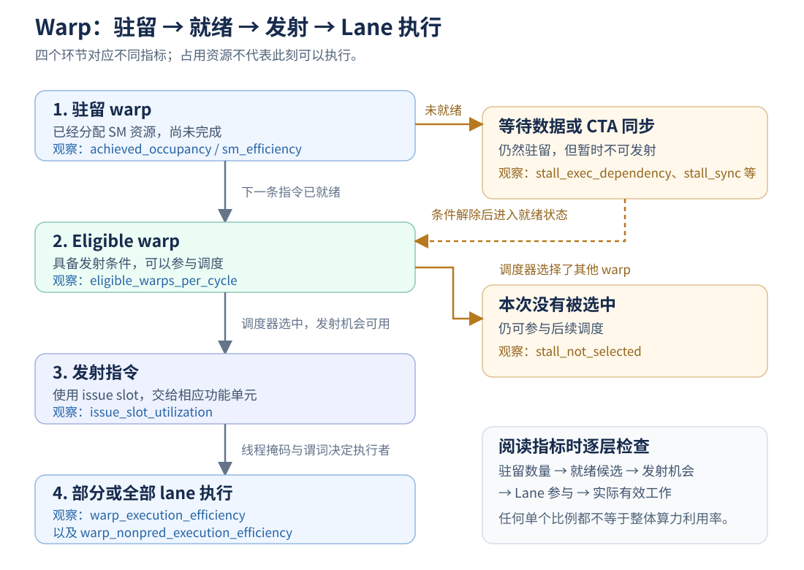
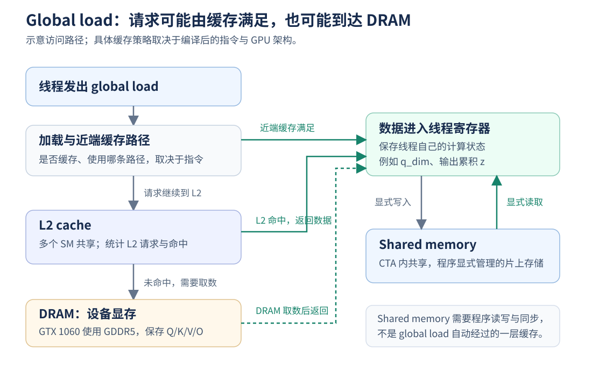

# nvprof 性能指标入门：GPU 执行机制与 FA2 实测解读

本文面向第一次使用 nvprof 的读者，解释本次采集的全部 23 个指标，并把每项指标与 GPU 执行机制、当前 attention kernel 和优化判断联系起来。指标表保留原始精度，正文中的近似值用于辅助阅读。

**本次最关键的现象是：custom 的 occupancy 接近 100%，但就绪 warp 和指令发射利用率低于 efficient；大量驻留工作没有转化为有效执行。** 同步和依赖链值得优先优化，K/V 重复加载也有实测证据；当前数据没有显示 DRAM 带宽饱和。

<a id="reading-guide"></a>

## 1. 阅读顺序与测量对象

### 1.1 阅读路径

第一次阅读建议按以下顺序：

1. [基础机制](#gpu-basics)：认识 thread、warp、CTA、SM，以及驻留、就绪、发射的区别。
2. [Warp 与指令发射指标](#warp-metrics)：理解 GPU 有多少工作，以及这些工作是否能推进。
3. [Stall 指标](#stall-metrics)：理解 warp 为什么没有发射下一条指令。
4. [内存指标](#memory-metrics)：区分逻辑加载、缓存请求、显存事务和吞吐。
5. [综合诊断与优化验证](#diagnosis)：把指标与源码联系起来，形成可验证的优化假设。
6. [nvprof 使用方法](#usage)：查询指标、限定采集范围、生成文本结果并解读输出。

后续优化复测先核对 [V0 的代码与二进制版本](#baseline-version)，再按 [理论预期与实测对照](#theory-validation) 记录实验。本文的 custom 数值固定属于 V0，未来版本另行归档。

本文负责解释指标与判读方法。完整计时、时间线、二进制证据和优化方案见 [FA2 baseline 性能分析](perf-baseline.md)。

### 1.2 本次采集条件与数据来源

| 项目 | 条件 |
|---|---|
| 采集日期 | 2026-10-11 |
| GPU | NVIDIA GeForce GTX 1060，GP106，Compute Capability 6.1 |
| 工具与驱动 | nvprof 12.8.90 (21)，驱动 570.211.01 |
| 输入 | FP32，`Q/K/V` 形状均为 `(16384, 64)`，non-causal |
| 运行条件 | seed 0，CPU threads 1，5 次 warmup |
| 捕获范围 | 一次 forward 调用；多指标通过 kernel replay 采集 |
| custom | 自定义 `fa2_forward_fp32_kernel`，一个 CTA 处理一个 query |
| efficient | PyTorch memory-efficient attention，采集 kernel 为 `fmha_cutlassF_f32_aligned_64x64_rf_sm50` |

这里 `S` 是序列长度，`d` 是每个 query/key/value 向量的维度；FP32 表示 32 位单精度浮点。non-causal 表示每个 query 可以关注全部 key，causal 则限制为当前位置及之前的 key。

全部实测值来自 [custom 原始 CSV](data/nvprof-custom-s16384-d64.csv)、[efficient 原始 CSV](data/nvprof-efficient-s16384-d64.csv) 和 [结构化指标 counters.json](data/counters.json)。custom 的 `sm_efficiency` 显示 `<OVERFLOW>`，这项结果无效，其余指标返回了数值。

<a id="baseline-version"></a>

### 1.3 此次 profile 的代码版本：V0

**此次 custom profile 对应参考提交 `be1e825df74e09adb947fb90182805e2d846080f` 的 baseline 算法，实际测量对象是 SHA-256 为 `29f397f8fa5bad4d2bd7f4f3ba54be87cee2d8bb5eaa4a505db283f60f957d6a` 的已编译扩展。** 采集日期为 2026-10-11，采集期间没有重新编译扩展。后续将这次测量称为 **V0**。

| 版本身份 | 此次记录 | 可核对的证据 |
|---|---|---|
| 所属 Git 仓库 | `stanford_cs336/assignments/assignment2-systems`，不是外层 institutionalized 仓库 | 提交需要在 assignment2-systems 仓库查询 |
| 参考提交 | `be1e825df74e09adb947fb90182805e2d846080f`；提交时间为 2026-10-10 15:34:54 UTC | [原始 custom benchmark 的版本记录](opt_routine1.md#L128-L135)、[evidence.json](data/evidence.json) |
| 参考源码 | Git 路径 `FA/cpp_cuda/fa2/fa2_forward.cu`，按提交原样提取 | [V0 源码快照](snapshot/fa2_forward.cu#L15-L82) |
| 源码快照 SHA-256 | `e2c57c282ef893fb264dead77d159ac0669f2829bdc464614138c84ab9985671` | 与该提交的 Git 对象逐字节一致 |
| 运行时扩展 | 从 `FA` 目录加载 `src/cuda_fa2_extension.cpython-311-x86_64-linux-gnu.so` | [counters.json](data/counters.json) 的 `binary` 字段 |
| 实际二进制 SHA-256 | `29f397f8fa5bad4d2bd7f4f3ba54be87cee2d8bb5eaa4a505db283f60f957d6a` | [归档的 V0 扩展](snapshot/cuda_fa2_extension.cpython-311-x86_64-linux-gnu.so)，221072 bytes |
| 设备代码架构 | `sm_61` | [资源统计](data/resources.txt)、[SASS](data/sass.txt) |
| PyTorch 与 CUDA runtime 构建版本 | `torch 2.6.0+cu124`，`torch.version.cuda = 12.4` | [无 profiler 复测记录](data/benchmark-recheck-custom.json) |
| 采集工具与驱动 | `nvprof 12.8.90 (21)`，驱动 `570.211.01` | [采集证据](data/evidence.json) |
| 测量时工作区源码哈希 | `c9e04d84abe5eaee67bcda67d67c4ebc060ce7b33bca99e772d63f9a23833ef1` | [counters.json](data/counters.json) 中历史 `current_source_sha256` 字段；不是当前文件哈希 |

**参考提交、测量时工作区源码和实际运行二进制是三个不同的版本层次。** 采集时工作区已包含变量命名、`const` 与格式调整，但运行时仍加载原来的预编译 `.so`。因此不能把这次结果描述成“采集时工作区重新构建后的性能”，也不能将之后只修改源码的状态直接称为新的测量版本。

原构建脚本配置为 C++ `-O2`、nvcc `-O2 -lineinfo`；这些是参考构建配置。既有记录没有保存构建这份 `.so` 时的完整 nvcc/host compiler 版本和编译日志，所以不宣称使用任意当前工具链重新编译都能得到完全相同的二进制。已归档 [版本清单 manifest.json](manifest.json)，记录参考源码、实际二进制、环境与原始数据哈希。

efficient 列对应上述 PyTorch 分发中的 memory-efficient attention kernel，不由这份 custom `.cu` 源码构建。后续若更换 PyTorch、驱动或编译工具链，应重新建立相同环境下的对照，避免把环境变化当成代码优化收益。

本文用于说明 V0 算法的 `.cu` 行号链接指向归档快照，避免后续编辑开发源码后发生引用漂移；实际执行结构仍以 V0 的 SASS 与二进制为准。当前开发文件为 [工作区 fa2_forward.cu](../../../../cpp_cuda/fa2/fa2_forward.cu)，已有命名、限定符和排版变化。

### 1.4 V0 的比较口径与结果索引

V0 的性能指标来自一次 forward capture 的多 pass 采集，采用默认 `--aggregate-mode on`。无 profiler 延迟来自独立 benchmark，两种运行分别记录：

| 结果类型 | V0 custom 结果或设置 | 后续比较方式 |
|---|---|---|
| 正式 benchmark | warmup 5；每组 20 次 forward；5 组；CUDA Event 均值 **2922.2971875 ms**，中位数 **2916.776953125 ms** | 用相同设置的新 benchmark 比较，保留每组样本；[原始记录](opt_routine1.md#L128-L186) |
| 当日短复测 | warmup 5；每组 1 次；3 组；CUDA Event 均值 **2896.6222330729165 ms** | 只用于确认当时运行状态；[复测 JSON](data/benchmark-recheck-custom.json) |
| 聚合 profile | `(S,d)=(16384,64)`、FP32、non-causal、seed 0、threads 1、warmup 5、捕获一次 forward | 对比相同 capture、相同指标与聚合模式；[custom CSV](data/nvprof-custom-s16384-d64.csv) |
| 资源与机器指令 | 128 threads/CTA、17 registers/thread、524 B shared/CTA；每 key 10 条 `BAR.SYNC` 对应位置 | 优化后重新检查资源、SASS 与实际执行计数 |
| 正确性 | 已有小形状 causal/non-causal 用例通过；大形状计时使用 `--no-verify` | 单独校验结果，不能由性能计时推导数值正确性 |

原始 profile、benchmark 和 V0 快照固定保留；后续每个代码变更版本另建结果目录和版本清单。未来评估以“源码版本 + 实际加载模块路径与哈希 + 环境 + 测量方法 + 原始数据”为完整身份，仅记录 Git HEAD 不足以覆盖未提交修改或旧扩展缓存。

<a id="gpu-basics"></a>

## 2. 理解指标需要的 GPU 基础

### 2.1 Thread、warp、CTA 与 SM

| 概念 | 含义 | 与本次 kernel 的关系 |
|---|---|---|
| Thread | CUDA 线程，持有自己的寄存器状态，执行 kernel 代码 | `threadIdx.x` 映射到一个向量维度 |
| Warp | 32 个线程组成的执行与调度单位 | 128 个线程组成 4 个 warp |
| Lane | warp 中的一个线程位置，编号 0–31 | 一条 warp 指令可只让部分 lane 执行 |
| Block / CTA | 线程块；CTA 是 Cooperative Thread Array 的缩写 | 一个 CTA 固定一个 query，并遍历所有 key |
| SM | Streaming Multiprocessor，GPU 上执行 CTA 的计算单元 | 一个 SM 可以同时驻留多个 CTA |
| Warp scheduler | 从就绪 warp 中选择并发射指令的硬件调度器 | 通过切换到其他就绪 warp 隐藏等待 |

CUDA 使用 SIMT（Single Instruction, Multiple Threads，单指令多线程）执行模型：同一个 warp 的线程执行共同的指令流，但每个线程持有自己的数据和状态，分支与谓词可以屏蔽部分线程。

线程、warp 和 SM 不是一一对应的关系。一个 warp 也不等于永久占有 32 个 CUDA Core；计算、加载存储和特殊函数指令由相应功能单元执行。Pascal 的调度器还可以在满足条件时发射一对独立指令，不能把“一个就绪 warp”固定换算成“一条指令”。架构背景见 [Pascal 指令调度](https://docs.nvidia.com/cuda/archive/12.8.0/pascal-tuning-guide/index.html#instruction-scheduling)。

本次 custom 固定使用 128 threads/CTA，`dim=threadIdx.x`，`qi=blockIdx.x`；`d=64` 时只有 threads 0–63 拥有有效 Q/K/V 维度。V0 的变量原名是 `query_index`、`valid_dim`、`query_value`，本文使用整理后的 `qi`、`is_valid_dim`、`q_dim` 解释同一映射；见 [V0 线程配置与维度判断](snapshot/fa2_forward.cu#L15-L41)。

### 2.2 驻留、就绪、发射与 lane 执行

**驻留 warp** 已经在 SM 上分配了寄存器等资源，尚未完成；**eligible warp** 的下一条指令已经具备发射条件；调度器随后选择 warp，在可用的 **issue slot（发射机会）** 上发射指令。指令发射后，还要由线程掩码与谓词决定哪些 lane 实际执行。



图示依据 [NVIDIA Warp State](https://docs.nvidia.com/cuda/archive/12.8.0/profiler-users-guide/index.html#warp-state)。等待某个 warp 的数据时，SM 可以执行其他就绪 warp，这叫**延迟隐藏（latency hiding）**。隐藏等待不等于让请求本身更快返回，而是利用等待期间完成其他工作。

需要区分两个含义：occupancy 中的 **active warp** 指驻留且尚未完成的 warp；warp execution 指标中的 **active thread/lane** 指参与当前指令执行路径的线程。等待屏障的 warp 仍可计入前者；执行路径中的线程又可能被当前指令的谓词屏蔽。

### 2.3 指令依赖、流水线与并行度

**指令延迟**是从发射到结果可用的时间；**流水线吞吐**是单位时间能够接收或完成多少操作。两者不同：某条运算可能经过多个周期才产生结果，但流水线仍可能在这些周期接收其他独立运算。

例如 `a=x*y; b=a+z;` 中，第二条指令必须等 `a` 就绪。硬件通过 scoreboard（追踪操作结果与依赖是否就绪的状态机制）等机制判断是否可以继续；编译器也会安排指令顺序。若同一线程还有不依赖 `a` 的操作，就可以交错执行，这叫 **ILP（Instruction-Level Parallelism，指令级并行）**。让多个互不依赖的内存请求同时在途，则叫 **MLP（Memory-Level Parallelism，内存级并行）**。

增加驻留 warp、提高线程内 ILP、增加独立内存请求，都可能帮助隐藏延迟，但它们也会占用寄存器或请求资源，需要结合实际耗时选择。相关机制与方法见 [Warp State 中的执行和内存依赖说明](https://docs.nvidia.com/cuda/archive/12.8.0/profiler-users-guide/index.html#warp-state)。

### 2.4 Global memory、缓存、shared memory 与寄存器

**Global memory 是 CUDA 地址空间概念；DRAM 是设备显存的物理存储。** GTX 1060 使用 GDDR5。执行一次 global load，不代表一定发生一次 DRAM 读取：缓存可以直接满足请求。



图示是概念路径，不表示所有 global load 都采用同一种 L1 策略。Pascal 的 L1/texture 与只读加载机制见 [Unified L1/Texture Cache](https://docs.nvidia.com/cuda/archive/12.8.0/pascal-tuning-guide/index.html#unified-l1-texture-cache)。

| 存储或路径 | 管理方式与作用 | 当前 custom 的用法 |
|---|---|---|
| 寄存器 | 线程的计算状态；通常由编译器分配，资源不足时可能 spill | `q_dim`、输出累积 `z` 等 |
| Shared memory | 程序显式读写，CTA 内共享；跨线程通信需要正确同步 | `reduction`、`alpha`、`p_tilde`、`l_shared` |
| L1/texture、只读缓存路径 | 由硬件和编译后的访问策略管理 | SASS 中 Q/K/V 读取使用 `LDG` 指令 |
| L2 cache | 多个 SM 共享，缓冲到设备显存的请求 | 可以满足不同 CTA 的重复 K/V 读取 |
| DRAM | 容量较大的设备显存 | 保存 Q/K/V/O |

寄存器不足时，编译器可能把部分线程状态放到 local memory，这叫 register spill（寄存器溢出到内存）。local memory 是线程私有地址空间，但并不是寄存器，访问可能涉及设备内存与缓存；声明局部变量也不保证它一定保存在 local memory。

寄存器或 shared memory 是编程与资源概念，不应与 L2/DRAM 吞吐混为一谈。shared memory 也不是 global load 自动经过的一层缓存。V0 的 `previous_weight/current_weight/final_normalizer` 分别对应本文的 `alpha/p_tilde/l_shared`；声明见 [V0 kernel 状态](snapshot/fa2_forward.cu#L27-L41) 与 [Q 的 LDG 指令](data/sass.txt#L20-L31)。

### 2.5 计数、比例与吞吐的统计口径

nvprof 的 **event** 通常对应底层硬件事件计数，**metric** 则由一个或多个 event 推导出比例、吞吐或其他性能特征。不同 metric 的分母不同，不能因为都叫 efficiency 就直接互相比较。定义见 [Profiler User's Guide：Profiling Overview](https://docs.nvidia.com/cuda/archive/12.8.0/profiler-users-guide/index.html)。

| 统计类型 | 本文例子 | 应如何理解 |
|---|---|---|
| 活跃周期内的平均量 | occupancy、eligible warps | 排除相应硬件单元没有 active warp 的周期；注意其聚合口径 |
| 时间或机会比例 | `sm_efficiency`、`issue_slot_utilization` | 分别统计有驻留工作、有指令发射的程度 |
| 指令加权的 lane 比例 | 两个 warp execution 指标 | 观察实际执行指令中的线程参与，不按源码行或墙钟时间平均 |
| 停顿原因比例 | `stall_*` | 原因分布，不能换算为同等比例的 kernel 墙钟耗时 |
| 请求命中比例 | `l2_tex_read_hit_rate` | 只针对该指标覆盖的请求路径 |
| 吞吐 | `dram_read_throughput` 等 | 对应采集 pass 内的速率 |
| 事务总数 | `dram_read_transactions` 等 | 硬件事务数量，不等于源码的数组访问次数 |

多指标需要不同 event group 时，nvprof 可以重放同一次 kernel 调用。**捕获一次 forward，不代表 GPU 物理上只执行一次。** 不同 pass 的缓存状态、计数与计时条件可能不同，吞吐不能乘另一次 benchmark 的时间来推算实测字节数。重放机制见 [Event/metric Summary Mode](https://docs.nvidia.com/cuda/archive/12.8.0/profiler-users-guide/index.html#event-metric-summary-mode)。

<a id="warp-metrics"></a>

## 3. Warp、occupancy 与指令发射：6 个指标

### 3.1 原始指标表

下表定义按 [NVIDIA CC 6.x Metrics Reference](https://docs.nvidia.com/cuda/archive/12.8.0/profiler-users-guide/index.html#metrics-for-capability-6-x) 整理；数值来自 §1.2 的两份原始 CSV。两份日志使用默认 `--aggregate-mode on`，表中是每个 kernel 的聚合指标，不是某个指定 SM 的单独数值。点击指标名称可跳转到详细解释，按 SM 查看能力见 [§3.8](#per-sm-metrics)。

| 指标 | 观察对象 | 单位 | custom | efficient |
|---|---|---|---:|---:|
| [achieved_occupancy](#achieved-occupancy) | 活跃周期内平均驻留 warp 数 / 硬件上限 | 比例（0–1） | 0.997961 | 0.186290 |
| [sm_efficiency](#sm-efficiency) | SM 至少有一个 active warp 的时间比例 | % | OVERFLOW | 95.302411 |
| [warp_execution_efficiency](#warp-execution-efficiency) | 每条 warp 指令的平均 active lane 比例 | % | 92.145628 | 99.573523 |
| [warp_nonpred_execution_efficiency](#warp-nonpred-execution-efficiency) | 进一步考虑谓词屏蔽后的 lane 执行比例 | % | 67.779263 | 97.896062 |
| [eligible_warps_per_cycle](#eligible-warps-per-cycle) | 每个 active cycle 平均有多少就绪 warp | warp / active cycle | 3.110919 | 4.327752 |
| [issue_slot_utilization](#issue-slot-utilization) | 至少发射一条指令的 issue slot 比例 | % | 54.201824 | 67.121107 |

<a id="achieved-occupancy"></a>

### 3.2 achieved_occupancy：实际驻留了多少 warp

**定义。** SM 活跃周期内平均 active warp 数，除以该 SM 支持的最大驻留 warp 数。原始值为 0–1 的比例。

\[
\text{achieved occupancy}
= \frac{\text{活跃周期内平均驻留 warp 数}}{\text{每个 SM 的最大驻留 warp 数}}
\]

**背景。** Pascal 每个 SM 的上限为 64 个驻留 warp；实际可驻留数量还受到线程数、寄存器、shared memory 和 CTA 数上限等限制，见 [Pascal Occupancy](https://docs.nvidia.com/cuda/archive/12.8.0/pascal-tuning-guide/index.html#occupancy)。按资源与 launch 配置计算的是理论 occupancy，本指标是实际运行时的 achieved occupancy；它们可能因工作数量、执行尾部等因素不同。

**本次解读。** custom 为 **99.7961%**，efficient 为 **18.6290%**，两者均为聚合结果。occupancy 的原始值是比例，将它乘以每个 SM 的最大驻留量 64，就得到该统计口径下的等效平均驻留 warp 数：

| 实现 | 原始 occupancy 比例 | 换算过程 | 等效平均驻留 warp 数/SM |
|---|---:|---|---:|
| custom | 0.997961 | `0.997961 × 64 = 63.869504` | 约 63.87 |
| efficient | 0.186290 | `0.186290 × 64 = 11.922560` | 约 11.92 |

**63.87 来自上述乘法，并不是 nvprof 单独输出的另一项指标。** 它表示 occupancy 统计口径下、活跃周期内的等效平均驻留量；不是同时执行的 warp 数，也不意味着每个 SM 都恰好具有这一驻留量。平均值允许有小数，某个 SM 在某个具体时刻的驻留 warp 数则是整数。

等待同步或数据的 warp 仍然占用驻留位置。更多驻留 warp 可以提供延迟隐藏机会，但需要有足够的就绪工作。efficient 使用更多寄存器和 shared memory，occupancy 较低却快得多；降低资源占用以追求 100% occupancy 不是当前首要目标。低 occupancy 与高 ILP 的权衡见 [CUDA 最佳实践：Thread and Block Heuristics](https://docs.nvidia.com/cuda/archive/12.8.0/cuda-c-best-practices-guide/index.html#thread-and-block-heuristics)。

<a id="sm-efficiency"></a>

### 3.3 sm_efficiency：SM 是否至少有一个 active warp

**定义。** 从单个 SM 看，表示它至少有一个 active warp 的时间比例；nvprof 默认将相关事件跨硬件实例聚合后输出一个 kernel 指标，因此“指标描述以 SM 为单位”不意味着当前输出已经逐 SM 展示。

**背景。** 这个指标只要求存在驻留工作，occupancy 还区分驻留了多少 warp。因此，SM 大部分时间有工作、但每个活跃周期只驻留较少 warp，两者可以同时发生；active warp 正在等待时，也不能据此判断算术单元是否充分工作。

**本次解读。** efficient 的聚合值为 **95.302411%**，说明按该指标汇总，大部分 SM 时间有驻留工作；不能据此声称 10 个 SM 各自都为 95.302411%，也不能还原哪个 SM 更忙。custom 的 `OVERFLOW` 表示相关计数器溢出，这项结果无效。不能将它解释为 0% 或 100%，也不能用 occupancy 或 `nvidia-smi` 的 GPU utilization 替代。

`sm_efficiency` 不等于峰值算力使用率、FP32 流水线利用率，也不等于有效 attention 计算的比例。

<a id="warp-execution-efficiency"></a>

### 3.4 warp_execution_efficiency：每条 warp 指令有多少 active lane

**定义。** 执行 warp 指令时的平均 active thread 数与 warp 最大线程数 32 的比值。这里按执行的指令统计线程参与，不是按源码行数或 kernel 时间平均。

**背景。** 当同一 warp 的线程进入不同分支路径时，当前路径只允许部分 lane 参与。编译器也可能使用谓词而不是跳转处理短分支，下一项指标进一步考虑这种屏蔽。

**本次解读。** custom 为 **92.145628%**，约对应每条 warp 指令平均 **29.49/32** 个 active lane；efficient 为 **99.573523%**。这些 lane 可以在做地址计算、控制、清零或同步，指标不识别操作是否对 attention 结果贡献了有效乘加。

`d=64` 只有 64/128 个线程拥有有效维度，但不意味着此指标必然为 50%。另外两个 warp 仍执行公共控制、shared 清零和同步；整个 warp 跳过某个分支时，也不能将其简单算作该分支每条指令的 32 个无效 lane。必须结合 [V0 维度判断和归约逻辑](snapshot/fa2_forward.cu#L32-L72) 判读。

<a id="warp-nonpred-execution-efficiency"></a>

### 3.5 warp_nonpred_execution_efficiency：考虑谓词屏蔽后的 lane 执行

**定义。** 进一步考虑被谓词屏蔽的线程后，平均执行线程数与 32 的比值。这里的 `nonpred` 应理解为没有被谓词关闭的执行，不能读成“只统计完全不带谓词的机器指令”。

**背景。** 短 `if` 可以被编译为带条件的指令，而不使用真正的跳转。例如：

```text
@P0 FADD ...     仅谓词 P0 为真的 lane 执行加法
@!P0 FADD ...    仅谓词 P0 为假的 lane 执行加法
```

线程处于当前执行路径，不意味着一定执行当前这条指令。谓词为假的线程不写入结果，也不执行相应的地址求值和操作数读取，见 [CUDA 最佳实践：Branching and Divergence](https://docs.nvidia.com/cuda/archive/12.8.0/cuda-c-best-practices-guide/index.html#branching-and-divergence)。

**本次解读。** custom 从上一项的 **92.145628%** 降至 **67.779263%**，efficient 则从 **99.573523%** 降至 **97.896062%**。custom 的归约尾部只允许少量 lane 加法，softmax 更新也只有 thread 0 执行；现有 [SASS 谓词归约指令](data/sass.txt#L67-L71) 与这种差异一致。

这个指标也不衡量数学有效性：被允许执行的“加上零”仍算执行。两项 warp 指标应结合线程映射和实际工作量使用。

<a id="eligible-warps-per-cycle"></a>

### 3.6 eligible_warps_per_cycle：有多少 warp 已准备好发射

**定义。** 每个 active cycle 中，平均有多少 warp 符合发射条件。这是就绪候选数量，不是实际发射指令数。

**背景。** 依赖输入未就绪或仍在等待同步的 warp 不能成为相应的就绪候选。调度器需要有可选择的工作，才能在另一个 warp 等待时继续推进。

**本次解读。** custom 为 **3.110919**，efficient 为 **4.327752**。custom 驻留更多 warp，但该指标下的平均就绪候选反而更少；这与其同步和递推结构一致。

这个数也不是“本周期发射了 3.111 个 warp”。[§3.2](#achieved-occupancy) 中的 **63.87** 是 `0.997961 × 64` 推导出的等效平均驻留 warp 数/SM。不同指标可能采用不同的硬件实例、平均与聚合口径，未确认两者口径一致前，不能直接用 `3.110919 / 63.87` 当作精确的就绪率，也不能只根据数值推断每个调度器的饥饿程度。

<a id="issue-slot-utilization"></a>

### 3.7 issue_slot_utilization：发射机会实际用了多少

**定义。** 至少发射一条指令的 issue slot 占比，并跨周期平均。issue slot 可以理解为调度器的一次指令发射机会。

**背景。** 指令发射说明工作在推进，但发射的可能是乘加、加载、地址计算、分支或同步指令；指令使用的功能单元和参与 lane 数也不同。因此，它比 occupancy 更接近执行进展，仍然不能直接换算成 FLOP/s 或峰值算力利用率。

**本次解读。** custom 为 **54.201824%**，efficient 为 **67.121107%**。结合 eligible warps，custom 既有较少就绪候选，也有较低发射活跃度。优化应让发射机会承担更多有效计算，并用无 profiler 的延迟验证收益。

<a id="per-sm-metrics"></a>

### 3.8 按单个 SM 查看：聚合值与硬件实例

**nvprof 可以展示每个硬件实例的值，SM 相关指标也支持这种方式。** 在 `--metrics` 或 `--events` 之前加 `--aggregate-mode off`，并使用 `--print-gpu-trace`，可以关闭跨硬件实例聚合。官方行为说明见 [Event/metric Trace Mode](https://docs.nvidia.com/cuda/archive/12.8.0/profiler-users-guide/index.html#event-metric-trace-mode)。

这里存在两种独立的聚合：summary 按同名 kernel 的多次调用汇总，`--aggregate-mode` 控制同一次调用是否跨 GPU 硬件实例聚合。因此，仅使用 trace 输出不会自动得到逐 SM 数值；两项设置需要分开理解。

| 层级 | 默认或现有数据 | 逐实例数据可以回答的问题 |
|---|---|---|
| 调用层级 | summary 可汇总多次 kernel 调用；本次各捕获一次 | 哪一次 kernel 调用发生了变化 |
| 硬件层级 | 默认跨 SM 等实例聚合成一个值 | 哪个实例的驻留、就绪或 stall 与其他实例不同 |
| 时间层级 | 对应一次 kernel 采集范围内的计数与派生指标 | 仍不是每个 SM 随时间变化的完整时间线 |

本次补充通过 CUPTI 查询 `CUPTI_METRIC_ATTR_EVALUATION_MODE`，确认当前 GTX 1060 上以下能力。`PER_INSTANCE=1`、`AGGREGATE=2` 是位标志，返回 `3` 表示两种模式都支持；这是能力查询，不是新采集的性能值。查询记录保存在 [逐实例能力元数据](data/nvprof-instance-capabilities.json)，机制见 [CUPTI MetricEvaluationMode](https://docs.nvidia.com/cupti/12.8.1/api/group__CUPTI__METRIC__API.html#group__cupti__metric__api_1ga59396bc237d98ee0595e5743bde89b9d)。

| 本文指标组 | 数量 | 当前 evaluation mode | 按实例查看能力 |
|---|---:|---:|---|
| §3 的 occupancy、SM、lane、eligible 和 issue 指标 | 6 | 3 | 支持逐实例，也支持聚合 |
| §4 的全部 `stall_*` 指标 | 10 | 3 | 支持逐实例，也支持聚合 |
| §5 的 DRAM/L2、事务数与 `gld_efficiency` | 7 | 2 | 这些派生指标在当前设备只支持聚合 |

`sm_efficiency` 的底层事件是 `active_cycles` 和 `elapsed_cycles_sm`；`achieved_occupancy` 的底层事件是 `active_warps` 和 `active_cycles`。查询显示相关事件域各有 10 个实例，与本机 10 个 SM 的数量一致，因此有能力观察 SM 之间的差异。当前 95.302411% 的汇总结果不包含这些单独值，不能事后拆分，需重新采集。

**Instance 是硬件事件域的实例，不对所有指标都等于 SM。** SM 相关事件可用于分析各 SM 的负载，而内存事件的实例可能对应显存控制器或 L2 单元；内存指标只支持聚合也不等于其全部底层 event 都没有实例计数。此外，不应未经核对就把工具输出第 `i` 个实例等同于 kernel 中 `%smid` 指令返回的物理编号。

重新采集后仍可能出现权限、计数溢出或其他工具限制；逐实例模式并不保证修复 custom 的 `OVERFLOW`。本文只核对了能力元数据，尚无 10 个 SM 的本次性能分布。可复现命令见 [§7.6](#per-sm-collection)。

<a id="stall-metrics"></a>

## 4. Stall 原因分布：10 个指标

### 4.1 原始指标表与分母

**这里的百分比表示停顿原因分布，不是 kernel 墙钟耗时占比。** 下表每列合计约为 100%；一个 warp 停顿时，其他 warp 仍可能发射，多个 warp 的等待也可以重叠。

因此，不能计算 `kernel 时间 × stall_sync` 作为同步耗时，也不能按 `1 / (1 - stall_sync)` 预测消除屏障后的加速比。efficient 某一类 stall 的比例更高，也不证明它的绝对等待时间更长。原因定义见 [NVIDIA CC 6.x 指标表](https://docs.nvidia.com/cuda/archive/12.8.0/profiler-users-guide/index.html#metrics-for-capability-6-x) 与 [Warp State](https://docs.nvidia.com/cuda/archive/12.8.0/profiler-users-guide/index.html#warp-state)。

| 指标 | 停顿原因 | 单位 | custom | efficient |
|---|---|---|---:|---:|
| [stall_sync](#stall-sync) | 等待 CTA 同步屏障 | % | 45.266341 | 23.046328 |
| [stall_exec_dependency](#stall-exec-dependency) | 指令所需输入尚未就绪 | % | 20.619948 | 37.350955 |
| [stall_memory_dependency](#stall-memory-dependency) | 内存操作依赖、资源或未完成请求相关等待 | % | 9.338987 | 0.844083 |
| [stall_other](#stall-other) | 工具未进一步细分的其他原因 | % | 18.159877 | 4.245361 |
| [stall_not_selected](#stall-not-selected) | warp 已就绪，但调度器选择其他 warp | % | 1.530019 | 17.773436 |
| [stall_inst_fetch](#stall-inst-fetch) | 下一条机器指令尚未取到 | % | 5.001215 | 12.682526 |
| [stall_pipe_busy](#stall-pipe-busy) | 所需计算流水线繁忙 | % | 0.082793 | 4.045380 |
| [stall_texture](#stall-texture) | texture 子系统繁忙或请求过多 | % | 0.000000 | 0.000000 |
| [stall_memory_throttle](#stall-memory-throttle) | 未完成内存请求过多导致节流 | % | 0.000016 | 0.000044 |
| [stall_constant_memory_dependency](#stall-constant-memory-dependency) | constant cache 未命中相关等待 | % | 0.000806 | 0.011886 |

<a id="stall-sync"></a>

### 4.2 stall_sync：等待 CTA 同步屏障

**定义。** warp 阻塞在 `__syncthreads()` 对应屏障处的停顿比例。

**背景。** 同一个 CTA 中的线程到达屏障后，需要满足该屏障的到齐与内存可见性条件才能继续。不同 warp 到达时间不同，先到者就会等待；等待期间仍占用驻留资源。它与 CPU 调用 `cudaDeviceSynchronize()` 等 GPU 完成属于不同层面。

**本次解读。** custom 为 **45.266341%**，是最大的已分类原因。每个 key 执行一次点积写入后的屏障、7 次归约屏障、一次 softmax 广播屏障和一次输出更新后的屏障，共 **10 次**；结构见 [V0 核心循环](snapshot/fa2_forward.cu#L43-L73)，编译结果保留了相应 `BAR.SYNC`。

这支持优先尝试 warp 内 shuffle 归约、减少跨 warp 广播和增加同步点之间的有效计算。屏障承担数据交换正确性，调整时必须改变通信组织并验证结果，不能直接删掉同步。

<a id="stall-exec-dependency"></a>

### 4.3 stall_exec_dependency：等待前面的指令算出输入

**定义。** 下一条指令需要的输入尚未就绪，通常依赖前面指令的结果。

**背景。** 连续依赖的运算构成关键链，例如 `a=x*y; b=a+z; c=b*w;`。若没有其他独立指令可交错执行，warp 就要等待结果。增加 ILP 可以缓解部分等待，但循环展开只有在暴露出独立工作时才有帮助，盲目展开也会增大代码和寄存器需求。

**本次解读。** custom 为 **20.619948%**，efficient 为 **37.350955%**。custom 的 shared 归约、online softmax 的 `m/l` 更新、`z` 累积都存在依赖；特别是同一 query 的下一轮状态依赖上一轮。V0 的 `row_max/row_sum/output_value` 对应本文 `m/l/z`，见 [V0 softmax 与输出递推](snapshot/fa2_forward.cu#L56-L72)。

该指标无法独立区分 softmax、归约和输出累积各自贡献了多少。efficient 的原因比例更高，也不能据此判断其优化程度更差。

<a id="stall-memory-dependency"></a>

### 4.4 stall_memory_dependency：内存操作相关条件尚未解除

**定义与背景。** NVIDIA 的 Warp State 说明从“等待先前内存访问完成”解释这一状态；CC 6.x 指标表还描述了内存操作所需资源不可用、相关资源充分占用或某类 outstanding requests 过多的情形。**Outstanding request** 是已经发出、尚未完成的请求。

因此，不能把它简单等同于“等待 DRAM 读取”。内存访问可能由缓存满足，kernel 也有 shared memory 读写；当前指标不足以进一步区分具体路径或某条加载指令。

**本次解读。** custom 为 **9.338987%**，efficient 为 **0.844083%**。这说明 custom 存在较多内存相关等待，但不是 DRAM 带宽饱和的证明。判读时应同时看吞吐、事务、缓存命中以及加载后立即使用的依赖关系。

<a id="stall-other"></a>

### 4.5 stall_other：未进一步细分的其他原因

**定义。** 较少见的编译器或硬件相关等原因，被归入其他停顿类别。

**本次解读。** custom 为 **18.159877%**，efficient 为 **4.245361%**。custom 的比例不小，但本次没有进一步定位具体组成。它不能重新算入同步、内存依赖或计算流水线繁忙，也不能单独对应到某个可修改的源码位置。

它适合用作后续定位的线索；当前可操作的优化假设仍应从已解释的同步、依赖和工作分配出发。

<a id="stall-not-selected"></a>

### 4.6 stall_not_selected：已经就绪，但没有被选中

**定义。** warp 已准备好发射，但调度器把当前机会给了其他 warp。

**背景。** 这与“不能执行”不同：调度器有其他就绪工作可选时，一个 warp 未被选中，另一个 warp 可以正在推进。较高比例有时反映候选工作充足，而不是 GPU 空转。

**本次解读。** efficient 为 **17.773436%**，高于 custom 的 **1.530019%**，与它具有更高 eligible warps 的情况一致。因此，不应把所有 stall 都当成必须下降的坏指标；这一项需要结合发射利用率、资源和延迟判断，也不能单独证明 kernel 已优化充分。

<a id="stall-inst-fetch"></a>

### 4.7 stall_inst_fetch：下一条机器指令还没有取到

**定义。** 下一条要执行的汇编指令尚未获取，warp 暂时无法发射。

**背景。** GPU 除了读取 Q/K/V 数据，还要读取执行程序本身的 SASS 指令。代码体积、函数调用、循环展开、指令缓存局部性和 warp 执行位置分散，都可能影响取指。PTX 是虚拟指令层，实际执行的设备机器指令是 SASS。

**本次解读。** custom 为 **5.001215%**，efficient 为 **12.682526%**。这观察的是指令获取，不能解释成 Q/K/V 数据缓存未命中率；比例也不直接等于指令缓存 miss rate。若后续大幅展开循环，应同时检查代码体积和这一项变化。

<a id="stall-pipe-busy"></a>

### 4.8 stall_pipe_busy：所需计算流水线繁忙

**定义。** 下一条计算操作所需的功能单元或计算流水线繁忙，暂时不能执行。

**背景。** 操作数已经就绪，也可能因为对应执行资源不可用而等待。GPU 有不同功能单元，例如 FP32 运算与特殊函数单元；特定单元承压不代表所有单元都满载。

**本次解读。** custom 为 **0.082793%**，efficient 为 **4.045380%**。结合高同步和依赖比例，custom 并不像在持续向计算流水线提交大量工作。但低比例不能直接推出 FP32 利用率，较高比例也不自动意味着性能差。

<a id="stall-texture"></a>

### 4.9 stall_texture：texture 子系统繁忙或请求过多

**定义。** texture 子系统充分占用，或相关未完成请求过多造成的停顿。

**背景。** 名称中的 texture 不只涉及图形纹理。只读 global load，例如 `LDG`，也可能经过相关硬件路径，因此 CUDA 数值计算没有显式纹理对象也可能受其影响。缓存机制见 [Pascal Unified L1/Texture Cache](https://docs.nvidia.com/cuda/archive/12.8.0/pascal-tuning-guide/index.html#unified-l1-texture-cache)。

**本次解读。** 两者均为 **0.000000%**，没有观察到这类停顿。它不表示没有使用只读或 texture 缓存路径，也不表示全部加载命中缓存。

<a id="stall-memory-throttle"></a>

### 4.10 stall_memory_throttle：内存请求积压导致节流

**定义。** 大量未完成内存请求使后续操作无法继续推进，即 memory throttle。

**背景。** 内存队列和请求通路的容量有限。请求发得快但完成得慢时，可能积压到限制；这与只发出少数请求、每个请求延迟较高的情况不同。内存 throttle 与 memory dependency 的描述有相关之处，但不能将两者分别固定对应到 DRAM 与某一级缓存。

**本次解读。** custom 为 **0.000016%**，efficient 为 **0.000044%**，都接近零。当前没有明显的此类节流证据，但不能排除单次访存延迟或数据依赖限制。

<a id="stall-constant-memory-dependency"></a>

### 4.11 stall_constant_memory_dependency：constant cache 未命中相关等待

**定义。** 常量缓存未命中导致的相关停顿，官方也提及 immediate constant cache miss。

**背景。** CUDA 的 constant memory 和缓存适合 warp 内线程读取同一数据的广播场景。编译后的常量路径还可能包含 kernel 参数或数学函数所需常量；C++ 的 `const` 限定并不等于声明了 `__constant__` 地址空间。

**本次解读。** custom 为 **0.000806%**，efficient 为 **0.011886%**，目前不是主要问题。即使源码没有显式 `__constant__` 数组，也不能认定该指标必须为零；现有 [SASS 参数读取](data/sass.txt#L20-L28) 中包含 `c[...]` 常量空间操作数，但该指标不能把停顿全部归因于这些位置。

<a id="memory-metrics"></a>

## 5. 内存吞吐、缓存与事务：7 个指标

### 5.1 原始指标表

下表定义来自 [NVIDIA CC 6.x 内存指标](https://docs.nvidia.com/cuda/archive/12.8.0/profiler-users-guide/index.html#metrics-for-capability-6-x)。吞吐单位中的 GB/MB 与数据容量计算中的 GiB/MiB 应区别使用：前者采用十进制前缀，后者分别以 2 的 30 次方和 20 次方计字节。

| 指标 | 观察对象 | 单位 | custom | efficient |
|---|---|---|---:|---:|
| [dram_read_throughput](#dram-read-throughput) | 显存读取吞吐 | GB/s | 1.588894 | 6.804241 |
| [dram_write_throughput](#dram-write-throughput) | 显存写入吞吐 | MB/s | 2.846625 | 110.795123 |
| [l2_read_throughput](#l2-read-throughput) | L2 层全部读取请求的吞吐 | GB/s | 22.637489 | 79.820898 |
| [l2_tex_read_hit_rate](#l2-tex-read-hit-rate) | 来自 texture cache 路径的请求在 L2 的读命中率 | % | 86.939724 | 96.487041 |
| [dram_read_transactions](#dram-read-transactions) | 显存读取事务数 | 次 | 155720747 | 8586931 |
| [l2_read_transactions](#l2-read-transactions) | L2 层全部读取事务数 | 次 | 2218604078 | 100733727 |
| [gld_efficiency](#gld-efficiency) | 请求的 global load 吞吐 / 所需实际加载吞吐 | % | 100.000000 | 100.000000 |

<a id="dram-read-throughput"></a>

### 5.2 dram_read_throughput：设备显存读取速率

**定义。** 对应采集 pass 中，设备 DRAM 提供读取数据的吞吐。

**背景。** 这是设备显存读取，不能解释为 CPU 到 GPU 的 PCIe 传输速率。global load 命中缓存时可以不访问 DRAM，因此它也不是源码请求的全部逻辑字节数除以时间。

**本次解读。** custom 为 **1.588894 GB/s**，efficient 为 **6.804241 GB/s**。设备记录的标称 memory bandwidth 为 **192.192 GB/s**，custom 读取约为其 **0.8267%**，见 [带宽属性与判定](perf-baseline.md#bandwidth-assessment)。标称带宽是上限参考，不是这个 kernel 的实测可持续吞吐；读写也应结合观察。

读取、写入都很低，且 memory throttle 接近零，当前没有 DRAM 带宽饱和的证据。低吞吐仍不能排除访存延迟：依赖链和同步可以使请求发不出去，即使每次请求都需要等待，整体速率仍低。

<a id="dram-write-throughput"></a>

### 5.3 dram_write_throughput：设备显存写入速率

**定义。** 对应采集 pass 中的 DRAM 写入吞吐。本表使用 **MB/s**，与读取的 **GB/s** 不同。

**背景。** 吞吐衡量速率，不衡量显存占用量或整个 kernel 写入的总量。即使两个 kernel 写入相同大小的输出，完成时间不同，平均写入速率也可以差很多。

**本次解读。** custom 为 **2.846625 MB/s**，efficient 为 **110.795123 MB/s**。custom 的 `O` 形状为 `(16384,64)`，FP32 输出大小为 `16384 × 64 × 4 = 4194304 bytes = 4 MiB`，且最后才写回，见 [V0 最终输出写入](snapshot/fa2_forward.cu#L75-L82)。

这两个速率不能解释成 efficient 比 custom 多写了约 39 倍数据。输出容量、实际写入事务与采集速率需要分别判断。

<a id="l2-read-throughput"></a>

### 5.4 l2_read_throughput：L2 层看到的读取速率

**定义。** L2 cache 层全部读取请求对应的内存吞吐。

**背景。** L2 命中的请求无需继续读取 DRAM，所以 L2 读取速率可以高于 DRAM。近端缓存直接满足的请求可能不进入 L2，因此这也不是全部线程逻辑加载的速率。L2 和 DRAM 是不同层级，不能把两项吞吐相加当成总加载量。

**本次解读。** custom 为 **22.637489 GB/s**，efficient 为 **79.820898 GB/s**。efficient 在 L2 层的处理速率更高，但速率不代表请求总量更多。大量重复访问可以增加 L2 工作，而不增加有效 attention 计算。

本次没有测得该设备 L2 的可持续吞吐上限，不能仅凭 22.64 GB/s 判定 L2 已经饱和。应与 L2 事务数、命中率和依赖指标联合分析。

<a id="l2-tex-read-hit-rate"></a>

### 5.5 l2_tex_read_hit_rate：特定请求路径的 L2 命中率

**定义。** 来自 texture cache 路径的读取请求，在 L2 cache 命中的比例。这可能涉及只读/global-load 路径，但不是所有类型 L2 请求的总命中率。

**背景。** 对该路径的请求，L2 命中通常减少继续访问 DRAM 的需要。命中仍有访问和指令成本；若程序反复请求同一数据，即使命中率高，也可能比将数据保存在寄存器或 shared tile 中复用更慢。

**本次解读。** custom 为 **86.939724%**，efficient 为 **96.487041%**。两者相应路径都有较多 L2 命中，efficient 更高，但无法仅由该比例重建其全部 global load 的缓存行为。

不能用 `l2_read_transactions × (1 - l2_tex_read_hit_rate)` 直接推算 DRAM 事务数：前者覆盖全部 L2 读事务，后者覆盖特定来源；相关指标还可能来自不同 replay pass。

<a id="dram-read-transactions"></a>

### 5.6 dram_read_transactions：显存读取事务总数

**定义。** 采集到的设备显存读取事务数。

**背景。** 硬件按一定数据粒度组织传输，一个事务不等于一次 C++ 数组访问。多个 lane 的访问可能合并成事务；分散访问可能需要更多事务；缓存命中又可以避免到达 DRAM。事务数换算字节时，必须核对该架构和底层 event 的事务粒度，不能把一次事务当作一个 `float`。

**本次解读。** custom 为 **155720747**，efficient 为 **8586931**，前者约为后者的 **18.13 倍**。在相同形状下，这为减少重复 K/V 读取、改进数据复用提供了实测依据。

它不能直接给出 Q/K/V 各自贡献的事务数，也不能与另一次 benchmark 的耗时组合成精确吞吐。

<a id="l2-read-transactions"></a>

### 5.7 l2_read_transactions：L2 层读取事务总数

**定义。** L2 层看到的全部读取事务数，既包含相应命中请求，也包含需要继续取数的请求。

**本次解读。** custom 为 **2218604078**，efficient 为 **100733727**，前者约为后者的 **22.02 倍**。这说明 custom 在 L2 层承担了更多读取工作，与每个 query CTA 重复扫描 K/V 的源码结构一致。

“事务总数更少”和“吞吐更高”可以同时发生：efficient 更快完成工作，因此即使总请求更少，单位时间处理速率仍可更高。事务数观察完成任务产生的内存工作量，吞吐观察处理这些工作的速度。

<a id="gld-efficiency"></a>

### 5.8 gld_efficiency：全局加载事务中的数据利用

**定义。** 请求的 global memory load 吞吐与满足这些请求所需的实际加载吞吐之比。它主要用于观察访存合并和传输数据利用，见 [CUDA 最佳实践：Throughput Reported by Visual Profiler](https://docs.nvidia.com/cuda/archive/12.8.0/cuda-c-best-practices-guide/index.html#throughput-reported-by-visual-profiler)。

\[
\text{gld efficiency}
= \frac{\text{requested global load throughput}}{\text{required global load throughput}}
\times 100\%
\]

**背景。** CC 6.x 上，32 个 lane 各读取一个对齐且连续的 `float`，总计 128 bytes，可由四个 32-byte 事务服务；若相同数量的有效数据分散到更多数据段，需要更多事务，可能浪费传输。这个例子说明 warp 访存合并粒度，不应据此未经核对就给所有 DRAM/L2 event 使用同一字节乘数。机制见 [Coalesced Access to Global Memory](https://docs.nvidia.com/cuda/archive/12.8.0/cuda-c-best-practices-guide/index.html#coalesced-access-to-global-memory)。

**本次解读。** 两者均为 **100.000000%**。custom 沿连续维度读取 K/V，有利于合并；这项指标没有显示明显的全局加载事务浪费。

但它不衡量数据复用。把同一份 K/V 连续、合并地读取很多遍，仍然可以得到 100%。因此，**合并访问回答“一次读取如何高效传输”，数据复用回答“这次读取是否有必要重复发生”。**

<a id="diagnosis"></a>

## 6. 从指标到当前 kernel 的诊断

### 6.1 高 occupancy 与低执行效率同时出现

正式无 profiler benchmark 中，custom 的单次 forward CUDA Event 均值为 **2922.297 ms**，efficient 为 **35.913 ms**，custom 约慢 **81.37 倍**。两者使用同形状与同一计时方案，见 [正式 benchmark](perf-baseline.md#formal-benchmark)。计时与本次计数器是不同运行，不能将指标比例机械换算成该次计时的成本。

当前证据形成以下判断链：

| 实测与代码现象 | 支持的判断 | 尚不能推出的结论 |
|---|---|---|
| occupancy 99.7961%，eligible warps 3.110919，issue utilization 54.201824% | 驻留工作很多，平均就绪与发射活跃度仍低于 efficient | 每个 SM 有多少周期完全无法发射 |
| `stall_sync` 45.266341%，每 key 10 次 CTA barrier | 同步和跨 warp 通信应优先检查 | 同步独占了 45.27% 墙钟时间或可直接带来相同比例加速 |
| `stall_exec_dependency` 20.619948%，状态逐 key 递推 | 需要增加独立工作、降低频繁的跨 key 状态更新 | softmax 指数计算的独立耗时 |
| nonpred lane 效率 67.779263%，归约尾部和 thread 0 分支 | 指令中存在较多 lane 屏蔽，工作分配有改进空间 | 只有 67.78% 的时间在有效乘加 |
| DRAM 读速率 1.588894 GB/s，写速率也低，throttle 接近零 | 当前没有 DRAM 带宽饱和证据 | 内存延迟、缓存或 shared 依赖完全没有影响 |
| DRAM/L2 读事务约为 efficient 的 18.13/22.02 倍 | K/V 数据复用值得改进 | 所有性能差距都来自显存流量 |
| `gld_efficiency` 100% | 当前全局加载合并与事务利用良好 | 输入数据只被读取一次 |

资源对照显示 custom 每线程使用 **17 个寄存器**、每 CTA **524 B shared**；efficient 为 **168 个寄存器**和 **22016 B dynamic shared**。更多片上资源可以用于保存与复用数据，不能仅追求资源数值更低。依据见 [资源与执行组织对照](perf-baseline.md#resource-comparison)。

### 6.2 逐 key 循环为什么产生同步和依赖

当前循环固定一个 query，每轮只生成一个标量 score，然后更新 online softmax：


`d=64` 时，7 级归约实际执行加法的 lane 数依次为 `64, 32, 16, 8, 4, 2, 1`。后半段很少的线程计算，却仍要求整个 CTA 到齐；第一步还把有效的前 64 项与后 64 个零相加。

一个 CTA 在 `S=16384` 的 non-causal 循环内执行 `16384 × 10 = 163840` 次屏障。所有 CTA 的屏障动态实例合计约 26.8 亿次；它们可以并行、重叠，不能乘一个固定屏障延迟推算总时间。完整计数与 SASS 证据见 [逐 key 同步成本](perf-baseline.md#key-loop-synchronization)。

每行的 `m/l/z` 又依赖前一轮状态，因此仅增加 CTA 数量不能解决同一行的串行链。分块计算可以并行生成一组 scores，再每个 tile 更新一次跨 tile 状态；具体需要改变计算组织，不能只靠调大 block。

### 6.3 存储空间、逻辑加载量和实测流量

输出 `O` 只占 4 MiB，但每个 query CTA 都重新扫描全部 K/V。忽略缓存，当前 K/V 的逻辑加载量为：

```text
2 × S² × d × sizeof(float)
= 2 × 16384² × 64 × 4
= 137438953472 bytes
= 128 GiB
```

**4 MiB 是输出存储容量，128 GiB 是源码结构推导的逻辑加载量，DRAM/L2 指标是硬件层面的实测。** 缓存可以显著减少到达 DRAM 的请求，因此三者不同。容量小不保证流量小，缓存命中高也不保证加载指令少。

这里的逻辑量可用于评价算法组织，但不能当作实测显存字节数。依据见 [K/V 重复加载分析](perf-baseline.md#kv-logical-loads)。

### 6.4 复杂度与可并行性

| 项目 | 当前 custom | 分块优化的影响 |
|---|---|---|
| 主要算术复杂度 | `O(S²d)` | 精确 dense attention 仍为 `O(S²d)`，改善常数与执行组织 |
| 额外 global 输出空间 | `O(Sd)`，不物化完整 `S²` 矩阵 | 保持输出与分块工作集，不必物化完整矩阵 |
| 每 CTA shared 工作集 | `O(T)`，`T=128` | 随 query tile、key tile 和 `d` 增长 |
| Query 行之间 | 独立，可由不同 CTA 并行 | 可让一个 CTA 处理多行并复用 K/V |
| 同一行跨 key 的状态 | 当前按 key 顺序递推 | tile 间仍有状态依赖，但更新频率降低 |
| 点积、tile 内 scores 与输出分量 | 可在正确通信与归约下并行 | 提供更多独立运算和数据复用机会 |

若一个 CTA 处理 `Br` 个 query，并显式共享 K/V tile，理想的 K/V 加载组织可按约 `Br` 倍减少；每行跨 tile 状态更新次数可从 `S` 降到 `ceil(S/Bc)`，其中 `Bc` 是 key tile 大小。这些是算法组织关系，不是预先承诺的 DRAM 减少倍数或加速比。V0 计算与输出位置见 [归档 kernel](snapshot/fa2_forward.cu#L18-L82)。

### 6.5 优化后的验证顺序

首先验证正确性，再在相同输入和运行条件下测无 profiler 延迟，最后使用对应计数器解释变化。不要把让某个百分比下降当成唯一目标；减少一种停顿后，其他原因的比例可能上升，即使绝对延迟已经下降。

| 优化假设 | 可尝试的调整 | 优先观察 |
|---|---|---|
| 跨 warp 归约与广播过于频繁 | warp 内 shuffle、一个 warp 负责一行、CTA 内多行组织 | 延迟、`stall_sync`、eligible warps、issue utilization |
| 逐 key 状态更新形成长依赖链 | tile softmax、在更新之间增加独立计算 | 延迟、execution dependency、寄存器与发射情况 |
| K/V 反复读取 | shared/register tiling，让多个 query 复用 K/V | 同形状下 DRAM/L2 事务、命中率、依赖与延迟 |
| 部分指令 lane 参与不足 | 调整归约与维度映射、按 `d` 特化 | 两个 warp execution 指标、工作量与延迟 |

GTX 1060 上的方案应按 FP32 SIMT 能力组织；优化实现与验证细节见 [baseline 优化顺序](perf-baseline.md#optimization-sequence)。本文尚无优化后的实测结果，不据这些指标预报加速比。

<a id="theory-validation"></a>

### 6.6 优化前先记录理论预期

每轮优化先记录具体改变、输入形状、线程或 tile 参数、理论减少的工作量和预期指标方向，再实施与测量。数量关系、指标方向与整体加速比是不同层次的预测，不能用一个代替另一个。

下表是基于 V0 的待检验假设，不表示已经实现或测得相应结果：

| 改动假设与成立条件 | 可明确计算的理论预期 | 实测应检查的证据 | 不直接承诺的结果 |
|---|---|---|---|
| 一个 warp 完整负责一个 query，归约与权重交换全部在该 warp 内完成 | V0 每 key 的 10 次跨 warp CTA 屏障可以从该计算路径移除；K/V 逻辑重读与逐 key 状态依赖仍在 | SASS/动态计数是否去掉相应 `BAR.SYNC`，`stall_sync`、eligible、issue 和延迟如何变化 | 整个 kernel 的同步比例必为 0，或加速比等于原同步占比推导值 |
| 每 CTA 处理 `Br` 行，K/V tile 加载一次供各行复用；忽略尾块和附加访问 | 理想 K/V 逻辑加载量由 `2S²d × sizeof(float)` 降到约其 `1/Br` | 实际加载组织、DRAM/L2 事务、shared/寄存器用量及延迟 | DRAM 字节数严格减少 `Br` 倍，或速度严格提升 `Br` 倍 |
| 每行以 `Bc` 个 key 为一组更新跨 tile softmax 状态 | 非 causal 的跨组状态更新次数从 `16384` 降到 `ceil(16384/Bc)`；tile 内点积、指数和归约仍需执行 | 递推位置、同步频率、执行依赖、资源和延迟 | 所有指数运算都减少 `Bc` 倍 |
| 仅调整命名、`const` 或格式 | 不能事先据此断言减少数学工作、屏障或输入读取 | 是否重新构建；实际 SASS/资源是否变化；同口径计时的波动 | 新源码哈希自动意味着加速，或新二进制哈希自动意味着算法优化 |

主计算仍为 `O(S²d)`。若要给出定量延迟预测，需要明确采用的算术、访存、同步与依赖模型，以及吞吐、延迟和重叠假设；当前 stall 百分比不能作为互不重叠的墙钟时间权重。未建立这种模型时，先预测结构计数和指标方向，再用正常 benchmark 判断性能收益。

### 6.7 优化后记录实测并判定是否符合预期

每个新版本的结果目录保存版本清单、原始 benchmark 样本、计数器日志、资源/SASS 和数值校验；与 V0 对照至少包含以下字段：

| 记录项目 | V0 已有依据 | 新版本需要记录与判定的内容 |
|---|---|---|
| 代码与执行版本 | §1.3 的 commit、源码快照与 `.so` 哈希 | 新 commit；若未提交，记录相对 HEAD 的 patch 与参与构建源码哈希；实际导入路径与二进制哈希 |
| 理论预期 | §6.6 的 V0 结构计数 | 改动前记录预期数量、假设、指标方向；涉及 `Br/Bc/threads` 时写出取值 |
| 构建与环境 | §1.2–1.3 的已记录环境及历史构建缺口 | nvcc、host compiler、编译参数、目标架构、PyTorch/CUDA、驱动、GPU，以及是否调整时钟 |
| 数值正确性 | 小形状测试通过，大形状计时未验证 | 记录测试形状、causal 模式、容差、参考实现与误差；快速数学或归约顺序变化要独立评估 |
| 正常延迟 | 正式均值 2922.2971875 ms、中位数 2916.776953125 ms | 相同 warmup/iterations/repeats 的均值、中位数与每组样本；与同一环境、相近时间复跑的 V0 比较更可靠 |
| 结构与计数器 | 每 key 10 次屏障，原始 23 项指标 | 结构减少量是否达到公式；同口径指标是否支持解释；无效指标保留标记 |
| 最终判断 | V0 为参考，没有优化结论 | 分别给出“结构预测是否成立”“速度是否改善”“偏差由何证据解释”；指标比例变化本身不能代替结论 |

加速比使用同口径无 profiler 时间：`speedup = V0 时间 / 新版本时间`。与正式 baseline 比均值时使用 2922.2971875 ms，与中位数比较时使用 2916.776953125 ms；当日短复测属于另一计时方案，不混用。若运行环境或 GPU 状态变化，应在同一环境、相近时间复跑归档 V0 与新版本，记录样本波动，判断收益是否超出测量噪声。

如果屏障确实移除而延迟改善不足，继续检查新增的依赖、指令数量、寄存器压力与访存；如果事务下降而速度未变，检查计算、通信或依赖是否成为限制；如果速度提高但计数预测未实现，应记录其他原因，不能事后把假设改写成已经证明的结论。

当前版本状态为：**V0 已采集并归档；新的算法优化版本尚未建立结果。** 后续每轮在自己的版本目录中记录“父版本、改动、理论预期、原始结果和判断”，保留本页的 V0 数值。

<a id="usage"></a>

## 7. nvprof 的查询、采集与输出解读

### 7.1 查询当前 GPU 支持的指标

指标支持与 GPU 架构、工具版本有关。应先查询当前设备，而不是照搬新架构 Nsight Compute 的指标名称：

```bash
/usr/local/cuda-12.8/bin/nvprof --query-metrics
/usr/local/cuda-12.8/bin/nvprof --query-events
```

本次已保存 [GTX 1060 支持的指标列表](data/nvprof-supported-metrics.txt)。`--query-events` 返回底层事件，`--query-metrics` 返回可选的派生指标；两者不是同一套名称。

### 7.2 先采集少量指标，使用默认文本表格

以下命令在项目 `FA` 目录执行，只选择 occupancy、就绪 warp、发射利用率和同步停顿四项。CPU threads 保持为 1，`--no-causal` 显式匹配本次 baseline；脚本默认是 causal。

```bash
sudo /usr/local/cuda-12.8/bin/nvprof --profile-from-start off \
  --kernels '.*fa2_forward_fp32_kernel.*' \
  --metrics achieved_occupancy,eligible_warps_per_cycle,issue_slot_utilization,stall_sync \
  --log-file /tmp/fa2-custom-s16384-d64-summary.txt \
  /home/dengxiao/miniconda3/envs/nanovllm/bin/python -E -s -B \
  -m scripts.profile_attention \
  --impl cuda_fa2 --seq-len 16384 --head-dim 64 --warmup 5 --threads 1 --no-causal
```

| 选项 | 作用 |
|---|---|
| `--profile-from-start off` | 启动时不采集，等待程序调用 profiler start |
| `--kernels` | 限定后面的 event/metric 设置所作用的 kernel |
| `--metrics` | 选择所需指标；少量指标也可能需要 replay |
| `--log-file` | 将 profiler 输出写入文件；程序自身 stdout 不一定进入该文件 |
| 不加 `--csv` | 使用默认可读文本表格 |
| 不加 `--print-gpu-trace` | 使用 summary 输出，指标逐行排列 |

输入生成与 5 次 warmup 位于 capture 之外，随后 start、执行一次 forward、同步、stop，见 [实际捕获边界](../../../../scripts/profile_attention.py#L73-L88)。这些选项的官方说明见 [nvprof Command-Line Options](https://docs.nvidia.com/cuda/archive/12.8.0/profiler-users-guide/index.html#command-line-options)。

### 7.3 全部 23 个指标的文本采集

以下使用同一个完整指标集合，但直接生成逐行文本表格。命令用于后续复现；本文数值仍来自已有 CSV，而不是这条文本命令的新运行。

```bash
sudo /usr/local/cuda-12.8/bin/nvprof --profile-from-start off \
  --kernels '.*fa2_forward_fp32_kernel.*' \
  --metrics achieved_occupancy,sm_efficiency,warp_execution_efficiency,warp_nonpred_execution_efficiency,eligible_warps_per_cycle,issue_slot_utilization,stall_sync,stall_memory_dependency,stall_exec_dependency,stall_other,stall_not_selected,stall_inst_fetch,stall_pipe_busy,stall_texture,stall_memory_throttle,stall_constant_memory_dependency,dram_read_throughput,dram_write_throughput,l2_read_throughput,l2_tex_read_hit_rate,dram_read_transactions,l2_read_transactions,gld_efficiency \
  --log-file /tmp/fa2-custom-s16384-d64-all-metrics.txt \
  /home/dengxiao/miniconda3/envs/nanovllm/bin/python -E -s -B \
  -m scripts.profile_attention \
  --impl cuda_fa2 --seq-len 16384 --head-dim 64 --warmup 5 --threads 1 --no-causal
```

采集 efficient 时，把 kernel filter 改为 `'.*fmha_cutlassF.*'`，`--impl` 改为 `efficient`，输出路径改为 `/tmp/fa2-efficient-s16384-d64-all-metrics.txt`。

`--kernels` 必须放在它所限制的 `--metrics` 之前。本次旧明细命令顺序错误，工具警告 filter 未生效；但 capture 中各只有一次 forward，两个原始 CSV 也各只有一条预期 kernel 记录，因此仍能明确测量对象，见 [采集方法与 filter 警告](perf-baseline.md#collection-method)。

若需要保持原始 CSV 的数值精度并由脚本处理，添加 `--csv --print-gpu-trace`，并使用 `.csv` 输出路径；默认文本输出可能采用不同的单位缩放和显示精度。多次 kernel 调用时，summary 会按 kernel 聚合，trace 按调用展示；本次捕获各只有一次 forward。

### 7.4 原始 CSV 的元数据与诊断

`nvprof --csv` 的文件仍可能带有诊断日志。本文两份原始文件依次包含 `==进程号==` 工具消息、表头、单位行与一条 kernel 数据行，不能把每一行都当成同一种记录。

| 字段或消息 | 含义 |
|---|---|
| `Device` | 设备名称和编号 |
| `Context` | CUDA context 标识 |
| `Stream` | CUDA stream 标识，不是执行耗时 |
| `Kernel` | 编译后的 kernel 名称或签名，用于确认目标 |
| `Correlation_ID` | 用于关联相应 CUDA 活动记录的标识，不是 CTA 数或循环次数 |
| 单位行 | 各列采用的单位；occupancy 是无 `%` 的比例 |
| `Some kernel(s) will be replayed` | 多组计数需要重放，采集总耗时会增加 |
| `<OVERFLOW>` | 相关计数器溢出，该项无效；不能按零处理 |
| `ERR_NVGPUCTRPERM` | 无权读取 GPU 性能计数器，与 kernel 数值正确性无关 |

本次 sudo 采集与性能计数器权限有关，见 [NVIDIA ERR_NVGPUCTRPERM](https://developer.nvidia.com/ERR_NVGPUCTRPERM)。正确解析 CSV 时应先定位 `Device` 表头、读取单位行，再处理数据行并保留无效标记。

### 7.5 区分采集、benchmark 与正确性验证

计数器采集回答“执行时发生了什么”，benchmark 回答“正常运行有多快”，数值测试回答“结果是否正确”。replay、状态保存恢复和采集本身会改变执行条件，三者不能互相替代。

本次已有小形状 causal/non-causal 正确性测试通过；`S=16384` 计时使用 `--no-verify`，不能由此推导大形状误差上界。完整验证记录见 [baseline 正确性和证据文件](perf-baseline.md#validation-evidence)。

<a id="per-sm-collection"></a>

### 7.6 关闭跨实例聚合，查看各 SM 的指标

以下在 `FA` 目录运行，先选取少量 SM 相关指标，不将只支持聚合的 §5 内存指标混入本次非聚合设置。命令保留相同形状、warmup 和 non-causal 条件；它用于后续采集，本文没有执行这轮性能采集。

```bash
sudo /usr/local/cuda-12.8/bin/nvprof --profile-from-start off \
  --kernels '.*fa2_forward_fp32_kernel.*' \
  --aggregate-mode off \
  --metrics sm_efficiency,achieved_occupancy,eligible_warps_per_cycle,issue_slot_utilization,stall_sync \
  --print-gpu-trace \
  --log-file /tmp/fa2-custom-s16384-d64-per-sm.txt \
  /home/dengxiao/miniconda3/envs/nanovllm/bin/python -E -s -B \
  -m scripts.profile_attention \
  --impl cuda_fa2 --seq-len 16384 --head-dim 64 --warmup 5 --threads 1 --no-causal
```

`--aggregate-mode off` 与 `--kernels` 一样，作用于后续的 event/metric 设置，必须放在相应 `--metrics` 之前。若需要分析底层事件，也可以将本条命令的 `--metrics ...` 替换为：

```bash
--events active_cycles,elapsed_cycles_sm,active_warps
```

输出中会按工具格式展示各实例值；应保留原始实例标识或顺序，并核对数量、无效标记和采集诊断。逐实例的 occupancy、issue 和同步分布可以检查是否有 SM 长时间缺少工作、是否存在尾部负载差异；但仍需配合正常 benchmark，不能把较高的 `stall_sync` 分布直接转换成该 SM 的绝对同步耗时。

<a id="optimized-code-loading"></a>

### 7.7 优化版本复测时确认实际加载代码

Python wrapper 导入预编译 `src.cuda_fa2_extension`，不会因为 `.cu` 文件修改就自动重建，见 [扩展导入逻辑](../../../../src/cuda_fa2_forward.py#L16-L25)。因此每轮必须重新构建、启动新的 Python 进程，并核对 `extension.__file__` 和 SHA-256。

以下是后续在 `FA` 目录执行的记录与复测命令，本文尚未执行。先保存新源码状态；这里的 `git diff HEAD` 覆盖已跟踪和已暂存的修改，未跟踪但参与构建的文件需另行保存快照与哈希：

```bash
git rev-parse HEAD
git status --short
git diff --binary HEAD -- cpp_cuda/fa2 src scripts
```

确认 V0 已归档后，按当前构建入口强制编译，显式指定 GTX 1060 架构和构建并行度；完整 stdout/stderr、工具链版本和环境配置随新版本保存：

```bash
TORCH_CUDA_ARCH_LIST=6.1 MAX_JOBS=1 \
  /home/dengxiao/miniconda3/envs/nanovllm/bin/python -E -s -B \
  cpp_cuda/fa2/build_extension.py build_ext --inplace --force
```

构建完成后使用新的 Python 进程确认模块与源码哈希，不能仅以构建命令退出成功作为加载新版本的证据：

```bash
/home/dengxiao/miniconda3/envs/nanovllm/bin/python -E -s -B - <<'PY'
import hashlib
from pathlib import Path
from src import cuda_fa2_extension

paths = [
    Path(cuda_fa2_extension.__file__).resolve(),
    Path("cpp_cuda/fa2/fa2_forward.cu"),
    Path("cpp_cuda/fa2/binding.cpp"),
    Path("cpp_cuda/fa2/build_extension.py"),
]
for path in paths:
    print(path, hashlib.sha256(path.read_bytes()).hexdigest())
PY
```

数值验证通过后，再按正式 V0 的计时方案运行；下面 `v1` 是下一版本的示例输出名，每个版本使用自己的路径：

```bash
/home/dengxiao/miniconda3/envs/nanovllm/bin/python -E -s -B \
  -m scripts.benchmark_attention \
  --device cuda --impl cuda_fa2 --seq-len 16384 --head-dim 64 \
  --warmup 5 --iterations 20 --repeats 5 --threads 1 --seed 0 \
  --no-causal --no-verify --output-json /tmp/fa2-v1-benchmark.json
```

`--no-verify` 只为匹配 V0 的大形状性能计时，不能替代前一步的数值验证。接着使用 §7.3 的完整指标集合采集，更新 kernel filter 与输出路径；聚合结果与 V0 聚合结果比较，§7.6 的逐 SM 输出作为补充实验。最终将原始结果、版本清单、参与构建的源码快照与实际 `.so` 归档到该版本自己的目录，并使用相对路径引用。

<a id="references"></a>

## 8. 数据与机制参考

### 8.1 本地实测与代码

| 链接 | 内容 |
|---|---|
| [custom 原始 CSV](data/nvprof-custom-s16384-d64.csv) / [efficient 原始 CSV](data/nvprof-efficient-s16384-d64.csv) | 本文 23 个指标的原始数值与单位 |
| [V0 版本清单](manifest.json) | 参考 commit、实际运行二进制、源码与原始数据哈希、环境和比较口径 |
| [V0 源码快照](snapshot/fa2_forward.cu#L15-L82) / [V0 扩展归档](snapshot/cuda_fa2_extension.cpython-311-x86_64-linux-gnu.so) | 固定保留的 baseline 参考源码与实际被测二进制 |
| [counters.json](data/counters.json) | 工具、设备、输入、指标、溢出标记与派生比值 |
| [逐实例能力元数据](data/nvprof-instance-capabilities.json) | 当前设备 23 个指标的 evaluation mode、相关事件域和实例数量；不是性能采集结果 |
| [evidence.json](data/evidence.json) | 测量对象、时间线、反汇编与相关证据 |
| [resources.txt](data/resources.txt) / [sass.txt](data/sass.txt) | custom 的资源用量和实际机器指令 |
| [FA2 baseline 性能分析](perf-baseline.md) | 正式 benchmark、同步成本、流量与优化顺序 |
| [V0 CUDA kernel](snapshot/fa2_forward.cu#L18-L82) / [当前开发源码](../../../../cpp_cuda/fa2/fa2_forward.cu) | 本文解释以 V0 快照为准，后续开发源码另有版本 |

### 8.2 NVIDIA 官方定义与背景

| 官方章节 | 用于核对的内容 |
|---|---|
| [Profiler User's Guide 12.8：CC 6.x Metrics](https://docs.nvidia.com/cuda/archive/12.8.0/profiler-users-guide/index.html#metrics-for-capability-6-x) | 全部指标定义与适用架构 |
| [Profiler User's Guide：Warp State](https://docs.nvidia.com/cuda/archive/12.8.0/profiler-users-guide/index.html#warp-state) | 停顿状态、执行依赖、内存依赖与调度 |
| [Profiler User's Guide：Event/metric Summary Mode](https://docs.nvidia.com/cuda/archive/12.8.0/profiler-users-guide/index.html#event-metric-summary-mode) | event、metric 与 kernel/application replay |
| [Profiler User's Guide：Event/metric Trace Mode](https://docs.nvidia.com/cuda/archive/12.8.0/profiler-users-guide/index.html#event-metric-trace-mode) | 逐调用展示与 `--aggregate-mode off` 的硬件实例输出 |
| [CUPTI Metric API：Evaluation Mode](https://docs.nvidia.com/cupti/12.8.1/api/group__CUPTI__METRIC__API.html#group__cupti__metric__api_1ga59396bc237d98ee0595e5743bde89b9d) | 查询逐实例与聚合的能力标志 |
| [Profiler User's Guide：Command-Line Options](https://docs.nvidia.com/cuda/archive/12.8.0/profiler-users-guide/index.html#command-line-options) | 指标过滤、输出格式与采集参数 |
| [Pascal Tuning Guide](https://docs.nvidia.com/cuda/archive/12.8.0/pascal-tuning-guide/index.html) | 指令调度、64 warp/SM 上限、资源与 L1/texture 路径 |
| [CUDA C++ Best Practices Guide 12.8](https://docs.nvidia.com/cuda/archive/12.8.0/cuda-c-best-practices-guide/index.html) | 合并访存、谓词、occupancy 与 ILP 权衡 |

官方文档定义指标和机制，本地数据说明本次运行的具体行为。未知原因、无效指标和不同采集口径均按各自边界保留。
