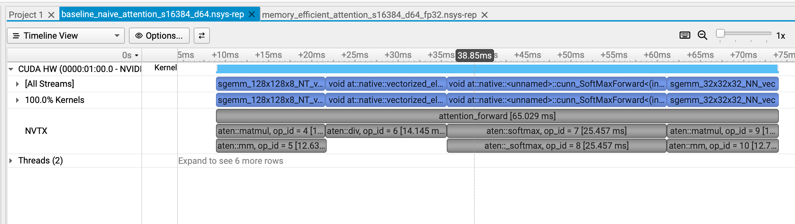
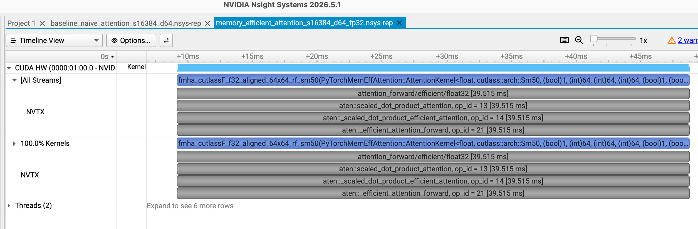
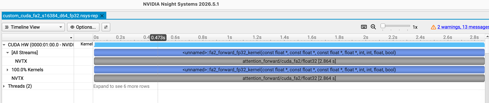

> 目标很直观：自己用C++实现的FA forward kernel 在所测试的 QKV 形状上，性能不比 pytorch 的 efficient 实现版本差，火电不行用风电，再不行上核电。

性能分析见 [FP32 custom baseline 性能分析](perf-baseline.md)，包含 Nsight 时间线、SASS 同步指令统计、访存判定边界与优化顺序。

## native
```bach
(base) dengxiao(phy) ~/code_repos/institutionalized/stanford_cs336/assignments/assignment2-systems/FA [dev] % /home/dengxiao/miniconda3/envs/nanovllm/bin/python -E -s -B \
  -m scripts.benchmark_attention \
  --device cuda --impl native \
  --seq-len 16384 --head-dim 64 --no-verify --no-causal
{
  "implementation": "native",
  "backend": "pytorch_dense_attention",
  "device": "cuda",
  "gpu_name": "NVIDIA GeForce GTX 1060",
  "compute_capability": [
    6,
    1
  ],
  "torch_version": "2.6.0+cu124",
  "torch_cuda_build": "12.4",
  "dtype": "torch.float32",
  "tf32": false,
  "qkv_shape": [
    16384,
    64
  ],
  "causal": false,
  "cpu_threads": 1,
  "seed": 0,
  "warmup": 5,
  "iterations_per_repeat": 20,
  "repeats": 5,
  "verified": false,
  "verification_rtol": null,
  "verification_atol": null,
  "max_abs_error_vs_cpu_fp64": null,
  "materializes_full_attention_matrices": true,
  "native_s_matrix_bytes": 1073741824,
  "native_p_matrix_bytes": 1073741824,
  "native_s_plus_p_bytes": 2147483648,
  "peak_additional_cuda_allocated_bytes": 2151677952,
  "wall_ms_mean": 65.52790536999964,
  "wall_ms_median": 65.49376784987544,
  "wall_ms_samples": [
    65.40879469994252,
    65.46358610012248,
    65.49376784987544,
    65.74844269998721,
    65.52493550007057
  ],
  "cuda_event_ms_mean": 65.525908203125,
  "cuda_event_ms_median": 65.49180297851562,
  "cuda_event_ms_samples": [
    65.4065673828125,
    65.46159057617187,
    65.49180297851562,
    65.746533203125,
    65.523046875
  ]
}
```



## efficient

```
(base) dengxiao(phy) ~/code_repos/institutionalized/stanford_cs336/assignments/assignment2-systems/FA [dev] % /home/dengxiao/miniconda3/envs/nanovllm/bin/python -E -s -B \
  -m scripts.benchmark_attention \
  --device cuda --impl efficient \
  --seq-len 16384 --head-dim 64 --no-verify --no-causal
{
  "implementation": "efficient",
  "backend": "pytorch_sdpa_efficient_attention",
  "device": "cuda",
  "gpu_name": "NVIDIA GeForce GTX 1060",
  "compute_capability": [
    6,
    1
  ],
  "torch_version": "2.6.0+cu124",
  "torch_cuda_build": "12.4",
  "dtype": "torch.float32",
  "tf32": false,
  "qkv_shape": [
    16384,
    64
  ],
  "causal": false,
  "cpu_threads": 1,
  "seed": 0,
  "warmup": 5,
  "iterations_per_repeat": 20,
  "repeats": 5,
  "verified": false,
  "verification_rtol": null,
  "verification_atol": null,
  "max_abs_error_vs_cpu_fp64": null,
  "materializes_full_attention_matrices": false,
  "native_s_matrix_bytes": 1073741824,
  "native_p_matrix_bytes": 1073741824,
  "native_s_plus_p_bytes": 2147483648,
  "peak_additional_cuda_allocated_bytes": 4194304,
  "wall_ms_mean": 35.91488009009481,
  "wall_ms_median": 35.933733850106364,
  "wall_ms_samples": [
    35.990502150161774,
    35.841546849951555,
    35.81583735012828,
    35.933733850106364,
    35.99278025012609
  ],
  "cuda_event_ms_mean": 35.91298278808594,
  "cuda_event_ms_median": 35.93195495605469,
  "cuda_event_ms_samples": [
    35.988458251953126,
    35.83959045410156,
    35.813726806640624,
    35.93195495605469,
    35.99118347167969
  ]
}
```



## custom
commid: be1e825df74e09adb947fb90182805e2d846080f

```
(base) dengxiao(phy) ~/code_repos/institutionalized/stanford_cs336/assignments/assignment2-systems/FA [dev] % /home/dengxiao/miniconda3/envs/nanovllm/bin/python -E -s -B \
  -m scripts.benchmark_attention \
  --device cuda --impl cuda_fa2 \
  --seq-len 16384 --head-dim 64 --no-verify --no-causal
{
  "implementation": "cuda_fa2",
  "backend": "custom_cpp_cuda_fa2_baseline_fp32",
  "device": "cuda",
  "gpu_name": "NVIDIA GeForce GTX 1060",
  "compute_capability": [
    6,
    1
  ],
  "torch_version": "2.6.0+cu124",
  "torch_cuda_build": "12.4",
  "dtype": "torch.float32",
  "tf32": false,
  "qkv_shape": [
    16384,
    64
  ],
  "causal": false,
  "cpu_threads": 1,
  "seed": 0,
  "warmup": 5,
  "iterations_per_repeat": 20,
  "repeats": 5,
  "verified": false,
  "verification_rtol": null,
  "verification_atol": null,
  "max_abs_error_vs_cpu_fp64": null,
  "materializes_full_attention_matrices": false,
  "native_s_matrix_bytes": 1073741824,
  "native_p_matrix_bytes": 1073741824,
  "native_s_plus_p_bytes": 2147483648,
  "peak_additional_cuda_allocated_bytes": 4194304,
  "wall_ms_mean": 2922.30183620999,
  "wall_ms_median": 2916.7910428999676,
  "wall_ms_samples": [
    2893.619048649998,
    2907.4966018999476,
    2916.7910428999676,
    2945.7892373000504,
    2947.813250299987
  ],
  "cuda_event_ms_mean": 2922.2971875000003,
  "cuda_event_ms_median": 2916.776953125,
  "cuda_event_ms_samples": [
    2893.60546875,
    2907.4826171875,
    2916.776953125,
    2945.774609375,
    2947.8462890625
  ]
}
```



啊哈，完蛋，比native慢44倍，比efficient慢81倍。

### native causal
```
(base) dengxiao(phy) ~/code_repos/institutionalized/stanford_cs336/assignments/assignment2-systems/FA [dev] % /home/dengxiao/miniconda3/envs/nanovllm/bin/python -E -s -B \
  -m scripts.benchmark_attention \
  --device cuda --impl native \   
  --seq-len 16384 --head-dim 64 --no-verify
{
  "implementation": "native",
  "backend": "pytorch_dense_attention",
  "device": "cuda",
  "gpu_name": "NVIDIA GeForce GTX 1060",
  "compute_capability": [
    6,
    1
  ],
  "torch_version": "2.6.0+cu124",
  "torch_cuda_build": "12.4",
  "dtype": "torch.float32",
  "tf32": false,
  "qkv_shape": [
    16384,
    64
  ],
  "causal": true,
  "cpu_threads": 1,
  "seed": 0,
  "warmup": 5,
  "iterations_per_repeat": 20,
  "repeats": 5,
  "verified": false,
  "verification_rtol": null,
  "verification_atol": null,
  "max_abs_error_vs_cpu_fp64": null,
  "materializes_full_attention_matrices": true,
  "native_s_matrix_bytes": 1073741824,
  "native_p_matrix_bytes": 1073741824,
  "native_s_plus_p_bytes": 2147483648,
  "peak_additional_cuda_allocated_bytes": 2416181248,
  "wall_ms_mean": 102.63517426999897,
  "wall_ms_median": 102.74070710001979,
  "wall_ms_samples": [
    102.12027119996492,
    102.48814394999499,
    102.74070710001979,
    102.83870570001454,
    102.9880434000006
  ],
  "cuda_event_ms_mean": 102.63360961914063,
  "cuda_event_ms_median": 102.73924560546875,
  "cuda_event_ms_samples": [
    102.11814575195312,
    102.48668212890625,
    102.73924560546875,
    102.83729248046875,
    102.98668212890625
  ]
}
```


## efficient causal
```
(base) dengxiao(phy) ~/code_repos/institutionalized/stanford_cs336/assignments/assignment2-systems/FA [dev] % /home/dengxiao/miniconda3/envs/nanovllm/bin/python -E -s -B \
  -m scripts.benchmark_attention \
  --device cuda --impl efficient \
  --seq-len 16384 --head-dim 64 --no-verify
{
  "implementation": "efficient",
  "backend": "pytorch_sdpa_efficient_attention",
  "device": "cuda",
  "gpu_name": "NVIDIA GeForce GTX 1060",
  "compute_capability": [
    6,
    1
  ],
  "torch_version": "2.6.0+cu124",
  "torch_cuda_build": "12.4",
  "dtype": "torch.float32",
  "tf32": false,
  "qkv_shape": [
    16384,
    64
  ],
  "causal": true,
  "cpu_threads": 1,
  "seed": 0,
  "warmup": 5,
  "iterations_per_repeat": 20,
  "repeats": 5,
  "verified": false,
  "verification_rtol": null,
  "verification_atol": null,
  "max_abs_error_vs_cpu_fp64": null,
  "materializes_full_attention_matrices": false,
  "native_s_matrix_bytes": 1073741824,
  "native_p_matrix_bytes": 1073741824,
  "native_s_plus_p_bytes": 2147483648,
  "peak_additional_cuda_allocated_bytes": 4194304,
  "wall_ms_mean": 19.004053589960677,
  "wall_ms_median": 18.94646159998956,
  "wall_ms_samples": [
    19.629500199880567,
    18.745269250030105,
    18.716466699879675,
    18.94646159998956,
    18.982570200023474
  ],
  "cuda_event_ms_mean": 19.002315673828125,
  "cuda_event_ms_median": 18.94481964111328,
  "cuda_event_ms_samples": [
    19.627464294433594,
    18.743550109863282,
    18.71472625732422,
    18.94481964111328,
    18.98101806640625
  ]
}
```

## custom causal
```
(base) dengxiao(phy) ~/code_repos/institutionalized/stanford_cs336/assignments/assignment2-systems/FA [dev] % /home/dengxiao/miniconda3/envs/nanovllm/bin/python -E -s -B \
  -m scripts.benchmark_attention \
  --device cuda --impl cuda_fa2 \
  --seq-len 16384 --head-dim 64 --no-verify
{
  "implementation": "cuda_fa2",
  "backend": "custom_cpp_cuda_fa2_baseline_fp32",
  "device": "cuda",
  "gpu_name": "NVIDIA GeForce GTX 1060",
  "compute_capability": [
    6,
    1
  ],
  "torch_version": "2.6.0+cu124",
  "torch_cuda_build": "12.4",
  "dtype": "torch.float32",
  "tf32": false,
  "qkv_shape": [
    16384,
    64
  ],
  "causal": true,
  "cpu_threads": 1,
  "seed": 0,
  "warmup": 5,
  "iterations_per_repeat": 20,
  "repeats": 5,
  "verified": false,
  "verification_rtol": null,
  "verification_atol": null,
  "max_abs_error_vs_cpu_fp64": null,
  "materializes_full_attention_matrices": false,
  "native_s_matrix_bytes": 1073741824,
  "native_p_matrix_bytes": 1073741824,
  "native_s_plus_p_bytes": 2147483648,
  "peak_additional_cuda_allocated_bytes": 4194304,
  "wall_ms_mean": 1460.6805131800138,
  "wall_ms_median": 1462.6957746999324,
  "wall_ms_samples": [
    1450.111903549987,
    1455.263214399929,
    1462.6957746999324,
    1465.3157480001028,
    1470.015925250118
  ],
  "cuda_event_ms_mean": 1460.68205078125,
  "cuda_event_ms_median": 1462.69736328125,
  "cuda_event_ms_samples": [
    1450.113671875,
    1455.2650390625,
    1462.69736328125,
    1465.31708984375,
    1470.01708984375
  ]
}
```