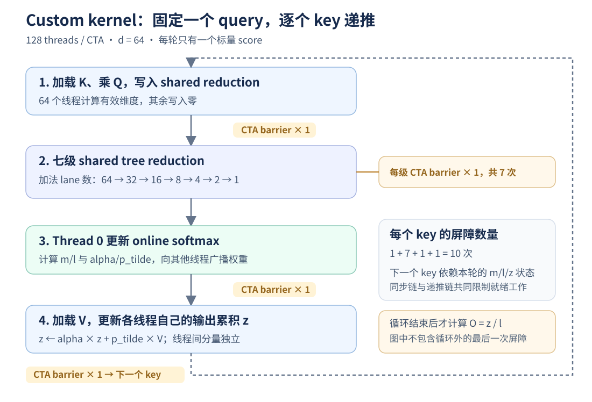

# 1. FP32 custom attention baseline 性能分析

分析与实测日期：2026-10-11。本次测量版本为 **V0**，参考提交：`be1e825df74e09adb947fb90182805e2d846080f`，所属仓库为 `stanford_cs336/assignments/assignment2-systems`。输入：GTX 1060、FP32、`S=16384, d=64`、non-causal、TF32 关闭。

本报告分析 V0 的性能证据与优化方向；指标定义、GPU 背景及后续复测方法见 [nvprof 指标入门文档](nvprof-readable.md)。V0 的实际源码和二进制身份见 [版本与证据归档](#v0-version)。

<a id="perf-conclusions"></a>

## 1.1 结论与证据边界

**实际 `nvprof` 采集支持优先优化 CTA 同步、执行依赖与工作分配；V0 没有 DRAM 带宽饱和的证据。** custom 的同步 stall 占比为 **45.266%**，执行依赖为 **20.620%**，memory dependency 为 **9.339%**；DRAM 读取吞吐仅 **1.589 GB/s**，约为设备标称带宽的 **0.827%**。这些 stall 数值是 profiler 记录的停顿原因分布，不能解读为各自占用了相同比例的 kernel 墙钟时间，定义见 [NVIDIA CC 6.x 指标参考](https://docs.nvidia.com/cuda/archive/12.8.0/profiler-users-guide/index.html#metrics-for-capability-6-x)。

custom 的实测 occupancy 已达 **99.796%**，但 eligible warps 为 **3.111**、issue slot utilization 为 **54.202%**。同形状的 efficient kernel occupancy 只有 **18.629%**，上述两项却为 **4.328** 与 **67.121%**，正式 benchmark 仍快 **81.37 倍**。提高 occupancy 不是 V0 的首要目标；更有价值的是减少逐 key 的同步与递推，并让更多发射指令承担有效计算。内存复用也值得优化：custom 的 DRAM/L2 读取事务数分别为 efficient 的 **18.13/22.02 倍**，但应与同步和工作组织一起处理，不能将性能差距全部归因于显存带宽。

已有 Nsight 时间线确认 GPU kernel 本身持续约 2.86 秒，CPU 发射调用只需约 28 微秒。因此 Python 绑定、扩展导入、编译和 launch 开销无法解释约 2.92 秒的单次 benchmark 延迟。“额外峰值显存只有 4 MiB”表示存储量减少，不代表内存流量减少，也不代表 GPU 执行高效。

本次结论由实际计数器、计时与代码结构相互核对：

1. 本次采集的 [custom 原始 CSV](data/nvprof-custom-s16384-d64.csv)、[efficient 原始 CSV](data/nvprof-efficient-s16384-d64.csv) 与 [结构化指标](data/counters.json)：硬件计数器。
2. [native benchmark](opt_routine1.md#L5-L62)、[efficient benchmark](opt_routine1.md#L66-L124)、[custom benchmark](opt_routine1.md#L128-L186) 与本次无 profiler 复测：forward 延迟。三个行号范围均只覆盖 non-causal 记录。
3. [Nsight 原始报告](#nsight-timeline)及保存在 [evidence.json](data/evidence.json) 的提取记录：GPU kernel、CUDA API、launch 配置与设备属性。
4. 同一 `sm_61` 扩展的 [SASS](data/sass.txt)、[资源统计](data/resources.txt) 与 [V0 源码快照](snapshot/fa2_forward.cu#L15-L82)：同步指令、资源和线程映射。

<a id="v0-version"></a>

提取的数据、原始报告 SHA-256、二进制 SHA-256 与诊断信息保存在 [evidence.json](data/evidence.json)。V0 的 [版本清单](manifest.json)、[提交源码快照](snapshot/fa2_forward.cu#L15-L82) 和 [实际扩展归档](snapshot/cuda_fa2_extension.cpython-311-x86_64-linux-gnu.so) 固定保留。加载扩展的 SHA-256 为 `29f397f8fa5bad4d2bd7f4f3ba54be87cee2d8bb5eaa4a505db283f60f957d6a`，与原 baseline 完全一致；采集时没有重新构建扩展。

参考提交、采集时工作区源码和实际测量二进制属于不同层次。工作区当时已包含命名、`const` 和格式调整，因此测量对象以该二进制哈希为准。本文的算法代码链接改为固定的 V0 快照；后续开发源码变化不会改变本文引用的版本。V0 中 `row_max/row_sum/output_value` 对应本文的 `m/l/z`，`previous_weight/current_weight/final_normalizer` 对应 `alpha/p_tilde/l_shared`。历史完整编译日志与工具链版本缺失的边界见 [指标文档的版本记录](nvprof-readable.md#baseline-version)。

现有 GPU 正确性测试全部通过，覆盖小形状的 causal/non-causal 与 CPU FP64 对照；`S=16384` 的计时使用 `--no-verify`，未新增该大形状的数值误差结论。V0 是优化前版本，目前没有已归档的新算法优化结果。

## 1.2 正式 benchmark 与时间线

<a id="formal-benchmark"></a>

### 1.2.1 同口径 benchmark

三个实现均使用 5 次 warmup、每组 20 次 forward、5 组重复。计时器对每组结果除以调用次数，所以 2922 ms 是单次 forward 平均值。计时实现见 [measure_latency](../../../../src/benchmark_measurement.py#L18-L42)；这是当前可跳转的辅助代码，V0 的实际结果与运行参数以原始 benchmark 记录为准。

| 实现 | CUDA Event 均值 | wall 均值 | 额外峰值分配 | custom / 本实现 |
|---|---:|---:|---:|---:|
| native | 65.526 ms | 65.528 ms | 2052 MiB | 44.60 |
| efficient | 35.913 ms | 35.915 ms | 4 MiB | 81.37 |
| custom | 2922.297 ms | 2922.302 ms | 4 MiB | 1.00 |

custom 的 wall 与 Event 均值只差约 4.65 µs。Event 时间也可能包含同一 stream 上的发射间隙，因此还需时间线确认；这里已有单 kernel 时间线提供交叉证据。

<a id="nsight-timeline"></a>

### 1.2.2 Nsight 单次采集

| 报告 | kernel 数量 | GPU kernel 时长或总和 | 主要 kernel |
|---|---:|---:|---|
| [native 原始报告](profiles/baseline_naive_attention_s16384_d64.nsys-rep) | 4 | 65.027 ms | 两次 SGEMM、缩放、softmax |
| [efficient 原始报告](profiles/memory_efficient_attention_s16384_d64_fp32.nsys-rep) | 1 | 39.515 ms | `fmha_cutlassF_f32_aligned_64x64_rf_sm50` |
| [custom 原始报告](profiles/custom_cuda_fa2_s16384_d64_fp32.nsys-rep) | 1 | 2864.050 ms | `fa2_forward_fp32_kernel` |

这些报告采于不同时间，用于确认执行结构和量级；正式加速比使用上一表的 benchmark。Nsight 的 custom 16384 报告里，`cudaLaunchKernel` CPU 调用持续 27.808 µs；GPU 在该调用开始约 24.264 µs 后启动，甚至早于调用返回，说明这里没有秒级发射等待。`cudaDeviceSynchronize` 持续 2864.003 ms，表示 CPU 等待正在运行的 GPU kernel，不是额外的 2.86 秒计算。

报告带有 “Not all CUDA/NVTX events might have been collected” 诊断。本分析依据可见的一次 launch、一次 kernel 与同步记录，不将报告解释为所有事件绝对完整的证明。

<a id="collection-method"></a>

### 1.2.3 本次采集方法与无 profiler 复测

工具为 `nvprof 12.8.90 (21)`，驱动 `570.211.01`，设备为 GP106、CC 6.1。在同一 `S=16384, d=64`、non-causal、seed 0、CPU threads 1 条件下，先完成 5 次 warmup，再通过 `cudaProfilerStart/Stop` 捕获一次 forward。多指标需要 kernel replay；捕获一次 forward 不代表物理上只执行一次 kernel，机制见 [Event/metric Summary Mode](https://docs.nvidia.com/cuda/archive/12.8.0/profiler-users-guide/index.html#event-metric-summary-mode)。捕获过程的辅助源码见 [capture 边界](../../../../scripts/profile_attention.py#L73-L88)，实际运行输出见 [采集进程日志](data/nvprof-detailed-process.log)。

两份明细 CSV 使用默认 `--aggregate-mode on`，指标是跨硬件实例聚合的 kernel 结果，不能视为每个 SM 的独立数值。后续已核对部分指标支持逐实例模式，但 V0 没有逐 SM 性能分布；支持范围和采集方法见 [按单个 SM 查看](nvprof-readable.md#per-sm-metrics) 与 [逐 SM 采集命令](nvprof-readable.md#per-sm-collection)。

驱动的 `RmProfilingAdminOnly: 1` 导致普通用户出现 `ERR_NVGPUCTRPERM`，本次以 sudo 完成采集。custom 明细只有 `sm_efficiency` 显示 `<OVERFLOW>`，该指标不参与结论；其余指标均返回有效数值，efficient 没有溢出。第一轮 custom 的同步 stall 为 45.104%、执行依赖为 20.653%，与明细轮的 45.266%/20.620% 接近。DRAM 读吞吐两轮为 1.470/1.589 GB/s，均远低于标称带宽。L2 读吞吐两轮为 28.813/22.637 GB/s，存在 replay 与运行条件差异，两份原始数据均保留。

明细命令的 `--kernels` 放在 `--metrics` 后，被工具警告未生效；实际 capture 只有一次 forward，两个 CSV 各只有一条预期 kernel 记录，因此没有混入初始化或 warmup kernel。复现命令在 [§1.8.1](#counter-reproduction) 已将 filter 放到 metrics 前，警告与运行记录见 [完整进程输出](data/nvprof-detailed-process.log)。

采集结束后，三个实现分别进行 5 次 warmup、每组 1 次 forward、3 组重复的无 profiler 短复测：

| 实现 | CUDA Event 均值 | wall 均值 | 原始记录 |
|---|---:|---:|---|
| native | 66.542 ms | 66.565 ms | [JSON](data/benchmark-recheck-native.json) |
| efficient | 36.134 ms | 36.156 ms | [JSON](data/benchmark-recheck-efficient.json) |
| custom | 2896.622 ms | 2896.631 ms | [JSON](data/benchmark-recheck-custom.json) |

量级与正式 baseline 一致。该短复测用于检查采集时的运行状态，正式加速比仍使用 [§1.2.1](#formal-benchmark) 的 20 次 × 5 组记录，不使用 replay 过程的时长替代。

## 1.3 每个 query-key 对的同步成本

<a id="stall-distribution"></a>

### 1.3.1 实测 stall 原因分布

以下来自同形状的两份 nvprof 明细 CSV。每列各类原因合计约 100%，分母为 profiler 的 stall 原因统计；SM 上各 warp 的等待和执行可重叠，不能计算 `2896 ms × 45.266%` 作为同步耗时，也不能从该比例直接预测移除 barrier 的加速比。定义见 [NVIDIA Warp State](https://docs.nvidia.com/cuda/archive/12.8.0/profiler-users-guide/index.html#warp-state)，逐项判读见 [指标文档的 stall 章节](nvprof-readable.md#stall-metrics)。

| stall 指标 | custom | efficient |
|---|---:|---:|
| `stall_sync` | **45.266341%** | 23.046328% |
| `stall_exec_dependency` | 20.619948% | 37.350955% |
| `stall_memory_dependency` | 9.338987% | 0.844083% |
| `stall_other` | 18.159877% | 4.245361% |
| `stall_inst_fetch` | 5.001215% | 12.682526% |
| `stall_not_selected` | 1.530019% | 17.773436% |
| `stall_pipe_busy` | 0.082793% | 4.045380% |
| `stall_texture` | 0.000000% | 0.000000% |
| `stall_memory_throttle` | 0.000016% | 0.000044% |
| `stall_constant_memory_dependency` | 0.000806% | 0.011886% |

同步是 custom 最大的已分类原因，与逐 key 的 barrier 链一致。`stall_other` 的 18.160% 未在本次采集中进一步定位，不能把它重新算入同步或内存等待。efficient 的 execution dependency 比例更高，但总延迟低得多；不同 kernel 的原因比例不能独立用于判断谁的绝对等待时间更长。

<a id="key-loop-synchronization"></a>

### 1.3.2 逐 key 循环的执行链

[V0 核心循环](snapshot/fa2_forward.cu#L43-L73) 在每个 key 上依次执行 K 加载、归约、softmax 更新和输出累积：



每轮合计 `1 + 7 + 1 + 1 = 10` 次 `__syncthreads()`。[SASS 循环区间](data/sass.txt#L48-L236) `0x0118..0x06f8` 确认保留 10 条 `BAR.SYNC` 和 10 条 `MEMBAR.CTA`，编译器没有消除这些同步，也没有把归约自动改写为 shuffle。

non-causal 时，一个 CTA 执行 `16384 × 10 = 163840` 次循环内屏障。全网格共有 268435456 个 query-key 对，累计循环内屏障 2684354560 次；再计入每个 CTA 的最后一次屏障，共 **2684370944 次 CTA 屏障实例**。这是由 V0 控制流推导的所有 CTA 动态实例之和，不是某条全 GPU 串行时间线的长度，也不能直接乘一个固定 barrier 延迟推算总耗时。

每轮只有一个长度 64 的点积，却需要四个 warp 反复到齐。等待 barrier 的 warp 仍占用驻留资源；其他 CTA 可以掩盖部分等待，但资源允许高 occupancy 不等于随时有可发射的有效指令。GPU 通过调度其他就绪 warp 隐藏延迟，没有足够就绪工作时此机制受限，见 [CUDA 最佳实践：Occupancy](https://docs.nvidia.com/cuda/archive/12.8.0/cuda-c-best-practices-guide/index.html#occupancy)。

<a id="thread-utilization"></a>

### 1.3.3 d=64 时的线程利用

[V0 线程映射](snapshot/fa2_forward.cu#L15-L46) 固定使用 128 threads，即 4 warps，但只有 threads 0–63 参与 Q/K/V 维度计算。另外两个 warp 仍执行清零、归约控制和同步，QK 与输出更新阶段只有一半线程拥有有效维度。

归约阶段每一级真正执行加法的 lane 数是 `64, 32, 16, 8, 4, 2, 1`。最后几级只有少量 lane 工作，但每一级都保留 CTA 屏障。第一步还将有效的前 64 项与全零的后 64 项相加，属于 V0 在 d=64 配置下的冗余。

实测 `warp_execution_efficiency` 为 **92.146%**，并非简单的 50%；包含谓词是否执行的 `warp_nonpred_execution_efficiency` 为 **67.779%**，efficient 对应为 **99.574%/97.896%**。前者统计执行 warp 指令时的平均 active threads，后者还反映被谓词屏蔽的线程；它们均不等价于“有多少 lane 正在做有效 attention 乘加”。定义与解释见 [active lane 指标](nvprof-readable.md#warp-execution-efficiency) 和 [谓词屏蔽指标](nvprof-readable.md#warp-nonpred-execution-efficiency)。

同步、控制、清零等指令可以有很多 active lanes；完全跳过分支的 warp 也不能按逐维度乘加的 50% 推算此指标。归约尾端和 thread 0 分支的低有效工作量仍是优化对象，应与这两个实测值及 issue 利用率一起判断。

<a id="softmax-dependencies"></a>

## 1.4 softmax 状态与指令依赖

[V0 thread 0 的递推](snapshot/fa2_forward.cu#L56-L72) 对每个标量 score 单独更新 `m` 和 `l`，计算指数权重，再把 `alpha/p_tilde` 写入 shared。同一 CTA 的下一个 key 依赖前一个 key 的状态，输出更新也依赖上一轮累积结果，因此每行有 16384 轮连续递推，V0 没有跨 key 的分块计算或预取流水线。

实测 execution dependency 占比 **20.620%** 与该依赖结构一致，但该指标不能区分 softmax、shared 归约和输出累积各自的贡献；memory dependency **9.339%** 也包含数据请求资源或 outstanding requests 等因素，不能全部解释成一次 DRAM load 的等待。相关定义见 [执行依赖](nvprof-readable.md#stall-exec-dependency) 和 [内存依赖](nvprof-readable.md#stall-memory-dependency)。

普通 `expf` 在 V0 二进制中展开为多条范围处理、浮点与整数指令，并出现两个 `MUFU.EX2` 静态位置。这些计算位于 thread 0 分支中，其他线程随后在屏障处等待。不能将两个静态指令位置直接等同于固定的全网格 SFU 利用率；首次 key 的 `isfinite` 分支还会跳过一个指数计算。

真正的 tile 算法可以并行生成一组 scores，做 tile 的 max/sum，每个 tile 更新一次跨 tile 状态和旧输出缩放。score 指数仍然需要计算，但跨 tile 递推、旧输出 rescale 与同步的频率可以降低。[FlashAttention-2 论文 §2.3、§3](https://tridao.me/publications/flash2/flash2.pdf) 明确将减少非矩阵乘运算和 warp 间 shared 通信列为优化方向。

V0 已经把 [最终除以 `l`](snapshot/fa2_forward.cu#L75-L82) 放在循环之后，避免逐 key 归一化；因此“把除法移到最后”不能作为本 baseline 的新优化。

## 1.5 K/V 复用、内存流量与带宽判定

<a id="kv-logical-loads"></a>

### 1.5.1 已确认的重复加载

[V0 K/V 加载](snapshot/fa2_forward.cu#L43-L73) 中，每个 CTA 持有一个 Q 行，重新遍历完整 K 和 V。K/V 没有加载到 shared tile 后供多个 query 使用；shared 仅用于归约和几个权重。忽略缓存，同一轮 forward 的 K/V 逻辑加载量为：

```text
2 × S² × d × sizeof(float)
= 137438953472 bytes
= 128 GiB
```

Q 读取与 O 写入各仅 4 MiB。这说明避免写两张 1 GiB 中间矩阵的同时，仍可能产生大量重复输入访问。逻辑加载量除以 benchmark 时间约为 **47.03 GB/s**，但它不是实测 DRAM 吞吐。

每个 warp 读取连续的 K/V 维度，访问模式有利于合并事务；源码没有明显的跨维度大步长访问。不同 CTA 可能复用 L2/cache 中的相同 K/V，实际 DRAM 字节数可能显著低于逻辑字节数。报告中的设备 L2 容量是 1.5 MiB，K/V 合计 8 MiB；容量关系并不能单独确定实际命中率。

<a id="memory-counters"></a>

### 1.5.2 实测 DRAM/L2 与带宽判定

| 指标 | custom | efficient |
|---|---:|---:|
| DRAM read throughput | **1.588894 GB/s** | 6.804241 GB/s |
| DRAM write throughput | 2.846625 MB/s | 110.795123 MB/s |
| L2 read throughput | 22.637489 GB/s | 79.820898 GB/s |
| `l2_tex_read_hit_rate` | 86.939724% | 96.487041% |
| DRAM read transactions | 155720747 | 8586931 |
| L2 read transactions | 2218604078 | 100733727 |
| Global load efficiency | 100.000000% | 100.000000% |

custom 的 DRAM 读取事务约为 efficient 的 **18.13 倍**，L2 读取事务约为 **22.02 倍**。这为改进数据复用提供了实测依据，而不只是由 `128 GiB` 逻辑加载量推断。`l2_tex_read_hit_rate` 只覆盖来自 texture cache 路径的请求，不能直接视为全部 L2 请求的命中率，也不能将不同 event group 的数值相乘重建 DRAM 字节数。Global load efficiency 100% 说明采集到的全局加载事务利用良好；它不评价相同数据被多个 CTA 重复读取的效率。详细口径见 [L2 命中率](nvprof-readable.md#l2-tex-read-hit-rate) 和 [global load efficiency](nvprof-readable.md#gld-efficiency)。

<a id="bandwidth-assessment"></a>

Nsight 设备属性给出的标称 memory bandwidth 为 192.192 GB/s，设备为 GP106。这是设备属性，不是这次 kernel 的实测可持续吞吐。GTX 1060 使用 GDDR5；这里的设备显存不应按 A100 的硬件类型称为 HBM。

按常见的两次矩阵乘计数，主计算量为 `4S²d = 68.719 GFLOP`。custom 的等效主计算吞吐约为 23.52 GFLOP/s；它忽略额外归约、rescale、指数与控制指令，用于比较完成同一 attention 工作的效率，不是 kernel 全部指令的总 FLOP 吞吐。

实测 DRAM 读吞吐为标称带宽的 **0.827%**，写吞吐也很低；结合接近零的 memory throttle 和高同步 stall，**V0 测量不支持 DRAM 带宽饱和解释**。低带宽不能排除加载延迟、缓存路径或 shared 数据依赖问题；这些仍应由优化前后的计数器变化判断。吞吐属于对应 replay pass，不能乘正式 benchmark 的 2922.297 ms 来计算实测总字节数。同形状事务计数、逻辑加载结构和无 profiler 延迟应分别保留各自的口径。

<a id="resource-comparison"></a>

## 1.6 资源与成熟 kernel 的对照

| 属性 | custom | efficient |
|---|---|---|
| launch grid | 16384 CTAs | 256 CTAs |
| block threads | 128 | 128（32×4） |
| 寄存器 / thread | 17 | 168 |
| 声明 shared / CTA | 524 B | 22016 B dynamic |
| local memory / thread | 0 B | 0 B |
| 计算组织证据 | 源码：1 query / CTA，逐标量 key | kernel 名称：CUTLASS FP32 64×64 tile |
| 实测 achieved occupancy | **99.7961%** | **18.6290%** |
| eligible warps / active cycle | 3.110919 | 4.327752 |
| issue slot utilization | 54.201824% | 67.121107% |
| `sm_efficiency` | `<OVERFLOW>`，不使用 | 95.302411% |

custom 的反汇编资源统计还显示 `STACK:0, LOCAL:0`，现有证据不支持寄存器 spill 导致慢的解释。17 个寄存器和 524 B shared 的资源占用较低，实测 occupancy 接近满载，但 eligible warps 和 issue utilization 仍低于 efficient。occupancy 是驻留 active warps 与硬件上限的比例，并不要求这些 warp 在当前周期均可发射；等待 barrier 的 warp 可继续占用驻留位置。定义与换算过程见 [achieved occupancy](nvprof-readable.md#achieved-occupancy)。

GPU 报告记录 10 个 SM；16384 个 CTA 已提供大量 query 维度并行。这里优先需要改善每个 CTA 内部的工作组织，增加 CTA 数量并不能解决逐 key 的同步链。单纯增加驻留 warp 数没有明显空间；也不应以降低寄存器使用量为主要目标。efficient 使用更多寄存器和 shared，却快得多，说明缓存与寄存器应服务于数据复用和并行计算，不应仅追求资源数值尽可能小。

native 的可见 kernel 是 FP32 SGEMM，efficient 也是 FP32 CUTLASS；本次性能差距不需要 Tensor Core 才能解释。

<a id="optimization-sequence"></a>

## 1.7 优化顺序与验证方法

### 1.7.1 第一阶段：warp 内归约和多 query 工作分配

对 d=64 的常用配置，优先尝试一个 warp 负责一个 query，每个 lane 持有两个维度的 Q 与输出，用 shuffle 归约 dot product，再广播权重。一个 CTA 可安排多个独立 query warp，将原来的跨 warp 归约和标量权重广播改为 warp 内通信。尾部维度和小于 32 的 d 必须正确处理，不能直接把所有情况假定为 d=64。

当归约、广播与状态更新全部在该 warp 内完成时，可以移除 V0 逐 key 的 10 次 CTA barrier，但仍保留逐 key 递推与逻辑 K/V 重读，不应预先承诺能达到 efficient 的性能。验证时先核对 SASS 中的同步结构，再比较 `stall_sync`、eligible warps、issue utilization 与无 profiler 延迟；若同步比例下降但延迟没有对应改善，应检查新的依赖和指令成本。

### 1.7.2 第二阶段：Q/K/V tiling 与 tile softmax

让一个 CTA 处理 `Br` 个 query，共享加载 `Bc` 个 K/V 行，使用寄存器块和 shared tile 完成 QK 与 PV，再按 tile 更新 softmax 状态。与 V0 每个 query 单独扫描相比，理想的显式 K/V tile 加载量按约 `Br` 倍减少；这是加载组织的理论关系，不是实测 DRAM 减少倍数。

同时将每行的跨 tile 更新次数由 `S` 降至 `ceil(S/Bc)`，但 tile 内 scores 的计算、归约和指数仍需实现；同步次数取决于具体 tiling 和线程映射。GTX 1060 上应先采用 FP32 SIMT 方案，不照搬要求新架构 Tensor Core 或 `cp.async` 的实现。本次 DRAM/L2 事务差距支持该阶段，但首先要让 tile 同时改善同步频率和有效计算组织；仅仅减少 DRAM 字节数未必解决当前的主要停顿。验证时对照相同形状下的 DRAM/L2 transactions、hit rate、依赖 stall 和 benchmark。

### 1.7.3 后续局部优化

在上述结构改善后再考虑 d 特化、向量化加载、循环展开、预取以及快速指数函数。`__expf` 或 `--use_fast_math` 会改变数值行为；采用前必须完成 GPU 正确性校验，不能把 `--no-verify` 的 benchmark 当成数值正确性证明。

三种实现的主要算术复杂度仍是 `O(S²d)`。custom 的额外 global 输出空间为 `O(Sd)`，每 CTA shared 为 `O(T)`，这里 `T=128`；tile 实现的 shared/寄存器工作集随 `Br/Bc/d` 增长，但无需完整物化 `S²` 矩阵。行之间可独立并行；同一行跨 key tile 的状态存在递推依赖，tile 内矩阵乘、score 指数和行归约可并行组织。

### 1.7.4 后续版本的理论预期与实测对照

每轮优化先记录父版本、commit 或未提交 patch、线程与 tile 参数，以及预计减少的屏障、加载或状态更新数量，再实现和测量。**结构预测是否成立、指标是否支持解释、正常延迟是否改善分别判断。** 具体记录规范与 V0 假设表见 [理论预期与实测对照](nvprof-readable.md#theory-validation)。

新的性能结果使用自己的版本目录、源码快照、实际 `.so` 哈希与环境记录。V0 原始数据保持固定；环境或 GPU 状态变化时，在相近时间复跑 V0 与新版本，保留同口径 benchmark 的每组样本。扩展不会因 `.cu` 修改自动重建，复测前应核对实际加载模块，步骤见 [重新构建与加载版本确认](nvprof-readable.md#optimized-code-loading)。

## 1.8 复现命令、原始数据与验证

<a id="counter-reproduction"></a>

### 1.8.1 同形状计数器采集

V0 管理员采集已经完成。以下为使用相同指标集合的复现命令，在 `FA` 目录中运行，CPU 线程保持为 1。GTX 1060 的计数器名称已通过 [设备支持列表](data/nvprof-supported-metrics.txt) 核对：

```bash
nvprof --query-metrics
```

按 V0 的同一形状与 non-causal 设置采集一次 custom forward。命令会加载当前可导入的扩展；只有它与 V0 的实际 `.so` 哈希一致时，才是 V0 复跑，否则应记为新版本。版本身份见 [V0 清单](manifest.json)。

```bash
sudo /usr/local/cuda-12.8/bin/nvprof --profile-from-start off \
  --kernels '.*fa2_forward_fp32_kernel.*' \
  --aggregate-mode on \
  --metrics achieved_occupancy,sm_efficiency,warp_execution_efficiency,warp_nonpred_execution_efficiency,eligible_warps_per_cycle,issue_slot_utilization,stall_sync,stall_memory_dependency,stall_exec_dependency,stall_other,stall_not_selected,stall_inst_fetch,stall_pipe_busy,stall_texture,stall_memory_throttle,stall_constant_memory_dependency,dram_read_throughput,dram_write_throughput,l2_read_throughput,l2_tex_read_hit_rate,dram_read_transactions,l2_read_transactions,gld_efficiency \
  --print-gpu-trace \
  --csv \
  --log-file /tmp/fa2-custom-s16384-d64-counters.csv \
  /home/dengxiao/miniconda3/envs/nanovllm/bin/python -E -s -B \
  -m scripts.profile_attention \
  --impl cuda_fa2 --seq-len 16384 --head-dim 64 --warmup 5 --threads 1 --seed 0 --no-causal
```

efficient 使用同一命令，将 kernel filter 改为 `'.*fmha_cutlassF.*'`、`--impl` 改为 `efficient`，并将输出文件改为 `/tmp/fa2-efficient-s16384-d64-counters.csv`。`--kernels` 和 `--aggregate-mode` 必须出现在它们限制的 `--metrics` 之前。V0 custom 的 `sm_efficiency` 溢出，重现时若仍显示 `<OVERFLOW>` 应保留标记并排除该指标，不能将它解释成 0% 或使用其他 GPU utilization 指标替代。

| 优化后的验证问题 | 观察项与判读 |
|---|---|
| barrier 是否限制就绪工作 | `stall_sync`、eligible warps、issue 活跃度；比较改为 shuffle 后的变化 |
| 是否主要在等待加载 | memory dependency stall、DRAM/L2 throughput；区分延迟等待与带宽饱和 |
| lane 是否低效 | warp execution efficiency 与 nonpred 指标；结合 thread 0 分支和归约映射 |
| 工作是否真正就绪 | eligible warps 与 issue utilization；custom occupancy 已接近满载 |
| K/V tile 是否有效 | 同形状下逻辑访问结构、DRAM/L2 计数与正式 benchmark 一起比较 |

多指标通常导致 kernel replay，计数器采集的时长不能替代正式 benchmark。

<a id="validation-evidence"></a>

### 1.8.2 正确性和证据文件

V0 采集后执行了现有测试：

```bash
/home/dengxiao/miniconda3/envs/nanovllm/bin/python -E -s -B \
  -m tests.test_cuda_fa2_forward --device cuda
```

4 项测试全部通过，其中数值测试覆盖 `(1,1)、(7,3)、(65,64)、(129,96)、(257,128)`，每种形状均执行 causal/non-causal，并与 CPU FP64 参考比较。这是正确性用例，未将其他序列长度引入性能对比，见 [原始测试输出](data/cuda-validation.log)。

| 文件 | 内容 |
|---|---|
| [nvprof 指标入门文档](nvprof-readable.md) | GPU 基础、全部 23 项指标、实测解读、版本记录和复测方法 |
| [V0 版本清单](manifest.json) | 参考 commit、源码和实际扩展哈希、运行环境及比较口径 |
| [V0 源码](snapshot/fa2_forward.cu#L15-L82) / [V0 扩展](snapshot/cuda_fa2_extension.cpython-311-x86_64-linux-gnu.so) | 固定保留的参考源码与实际被测二进制 |
| [逐实例能力元数据](data/nvprof-instance-capabilities.json) | 后续核对的按实例支持范围，不包含逐 SM 性能采集 |
| [counters.json](data/counters.json) | 设备、二进制、指标值、溢出标记与派生比值 |
| [custom CSV](data/nvprof-custom-s16384-d64.csv) / [efficient CSV](data/nvprof-efficient-s16384-d64.csv) | 两个实现的逐 kernel 原始指标 |
| [custom 首轮 CSV](data/nvprof-custom-summary-s16384-d64.csv) | 独立一轮 custom 指标，用于核对稳定性 |
| [进程输出](data/nvprof-detailed-process.log) | 实际输入、capture 完成记录与 filter 警告 |
| [evidence.json](data/evidence.json) | 原 baseline、时间线、SASS 和所有新增证据的 SHA-256 |

大形状计时仍使用 `--no-verify`；上述小形状测试不等于大形状误差上界的证明。

<a id="mechanism-references"></a>

## 1.9 外部机制参考

| 来源 | 支持的机制或定义 |
|---|---|
| [NVIDIA CUDA C++ Best Practices Guide 12.8](https://docs.nvidia.com/cuda/archive/12.8.0/cuda-c-best-practices-guide/index.html) | GPU warp 调度、延迟隐藏、合并访存与优化方法 |
| [Tri Dao：FlashAttention-2，§2.3、§3](https://tridao.me/publications/flash2/flash2.pdf) | tiling、减少非矩阵乘计算与 shared 通信 |
| [NVIDIA Profiler User's Guide 12.8：CC 6.x Metrics](https://docs.nvidia.com/cuda/archive/12.8.0/profiler-users-guide/index.html#metrics-for-capability-6-x) | stall、warp/occupancy、issue 和内存指标定义 |
| [Profiler User's Guide：Warp State](https://docs.nvidia.com/cuda/archive/12.8.0/profiler-users-guide/index.html#warp-state) | warp 就绪、执行与停顿原因 |
| [Profiler User's Guide：Event/metric Summary Mode](https://docs.nvidia.com/cuda/archive/12.8.0/profiler-users-guide/index.html#event-metric-summary-mode) | 多组 event/metric 的 replay |

外部参考支持指标口径和机制解释；本实现的具体耗时、配置、计数器值与指令数量均来自上述本地原始证据。
