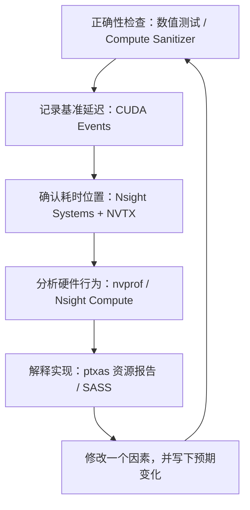
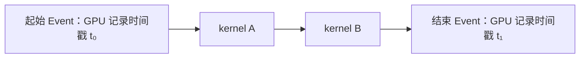

# CUDA Kernel 性能调优工具与学习路线

更新日期：2026-10-11。示例项目：FP32 attention forward；设备：GTX 1060（GP106、CC 6.1）。

**CUDA kernel 调优最值得先掌握的是三件事：可靠计时、读取程序时间线、分析单个 kernel 的硬件指标。** 对应工具是 CUDA Events、Nsight Systems，以及 Nsight Compute；在本项目的 Pascal GPU 上，还需要使用 `nvprof` 或隔离安装的旧版 Nsight Compute。Compute Sanitizer、编译器资源报告和 SASS 反汇编用于验证正确性与解释测量结果。

学习目标是能够独立完成“提出瓶颈假设 → 选择指标 → 修改实现 → 解释结果”的实验，而不只是运行一条命令或得到一个更快的 kernel。NVIDIA 的 [CUDA 最佳实践指南][cuda-best-practices]也采用逐轮评估、修改与验证的工作方法。

## 1. 工具在调优流程中的位置



这几个环节回答不同的问题。benchmark 判断有没有加速；时间线判断值得优化哪个阶段；硬件计数器帮助形成原因假设；反汇编说明编译器实际生成了什么。单独看源码无法确定真实 stall 分布，单独看一个 profiler 百分比也无法确定优化收益。

### 1.1 常用工具总览

下面既包含独立程序，也包含在代码中调用的 API。**CUDA Events 是 CUDA 提供的事件与计时 API；benchmark 是使用这些 API 编写的计时程序。** Nsight Systems（`nsys`）和 Nsight Compute（`ncu`）则是独立的 profiler，可以从命令行启动目标程序并收集报告。

| 工具 | 主要问题 | 常见输出 | 在本项目中的练习 |
|---|---|---|---|
| CUDA Events API / 自编 benchmark | stream 中目标工作区间多久？修改是否加速？ | 延迟样本、均值、中位数 | 记录起止 Event、warmup、重复计时 |
| Nsight Systems：`nsys` / GUI | 时间花在 CPU、GPU、复制还是发射间隙？ | `.nsys-rep` 时间线、统计表 | 关联 CUDA API 与 GPU kernel |
| Nsight Compute：`ncu` / GUI | 单个 kernel 的计算、访存和调度有什么限制？ | 分析页面、指标、源码与 SASS 关联 | 从 Scheduler / Memory / Warp 页面判断原因 |
| `nvprof` / Visual Profiler | 较老 GPU 的硬件行为如何？ | 文本表格、CSV、旧版报告 | 在 GTX 1060 上采集同步、依赖、带宽和事务 |
| NVTX | 时间线中的这段工作属于哪个操作？ | 名称、范围、颜色标记 | 标记 `attention_forward` |
| Compute Sanitizer | 是否越界、读取未初始化数据或错误同步？ | 带位置的错误报告 | 改归约和 barrier 后检查正确性 |
| `nvcc` / `ptxas` | 编译器用了多少寄存器？有无 spill？ | 编译期资源报告 | 检查展开、寄存器块和 tile 的代价 |
| `cuobjdump` / `nvdisasm` | 源码最终变成了哪些指令？ | PTX、SASS、资源与控制流 | 找到 `BAR.SYNC`、`SHFL`、加载和指数指令 |
| `cuda-gdb` | 哪个线程、哪条指令、哪个变量出错？ | 断点、线程状态、寄存器 | 定位失败用例，辅助检查索引 |
| `nvidia-smi` | 测量时 GPU 的频率、温度和占用如何？ | 设备状态、进程、采样日志 | 排查其他进程、降频与测量波动 |

这些工具不全是 profiler：[NVTX][nsight-systems] 是标记 API，[Compute Sanitizer][compute-sanitizer] 与 [cuda-gdb][cuda-gdb] 用于正确性和调试，[cuobjdump 与 nvdisasm][cuda-binary-utilities] 做静态分析。它们共同服务于性能实验，但不能互相替代。

### 1.2 GTX 1060 上实际可用的组合

现代 Nsight Compute 的 GPU 支持范围必须按版本确认。根据 [2025.1 的 GPU 支持表][ncu-2025-support]，本机默认 `ncu 2025.1.1` 不支持 Pascal；[2019.5 系列的支持表][ncu-2019-support]则列出 GP10x 为支持，但不支持同为 Pascal 的 GP100。

| 任务 | 本机选择 | 已确认的边界 |
|---|---|---|
| 现有 PyTorch forward 计时 | `scripts.benchmark_attention` | 使用当前 PyTorch / CUDA 环境 |
| CPU/GPU 时间线 | `nsys 2024.6.2` | 已有成功采集的 `.nsys-rep` |
| 当前随机输入的硬件计数器 | `nvprof 12.8.90` | 已成功采集 custom / efficient 同形状数据 |
| 学习 Nsight Compute 页面 | `ncu-pascal`，旧版 2019.5.0 | 已通过独立 Driver API 入口成功采集 |
| 旧版直接包装当前 PyTorch | 不可用 | CUDA 12.4 初始化阶段出现 error 36 |
| 现代 `ncu` 直接采集 GTX 1060 | 不可用 | GPU 架构不受支持，sudo 无法解决 |

旧版已经独立放在用户目录，默认 CUDA、驱动、PyTorch 与 `ncu` 保持原样。具体安装位置、成功报告和兼容性记录见 [Nsight Compute 隔离安装说明](ncu-pascal.md)。[NVIDIA Profiler 用户指南][nvprof-guide]已将 `nvprof` 标记为 deprecated，但它仍是当前这块 GPU 与现有程序组合中已验证可用的工具。

## 2. CUDA Events：先学会可靠计时

**这里的计时方式是在同一条 CUDA stream 的目标工作前后记录两个 Event，再计算它们的时间戳之差。** 创建 Event 时启用 timing；CPU 调用 `record` 是向 stream 提交事件记录操作，GPU 执行到相应位置时才记录时间戳。CPU 等待结束 Event 完成后，才能读取这段区间的耗时，参见 [CUDA Event 计时说明][cuda-event-timing]。



测得的时间为 `t₁ − t₀`。它覆盖两个 Event 之间的整个时间区间，可能包括 kernel 执行、区间内的数据复制、调度等待，以及 CPU 未及时提交后续工作造成的空档；也可能受到其他 stream 争用 GPU 资源的影响。因此它不一定等于各个 kernel 执行时间的简单求和。若要看清区间内每个 kernel 和空档的具体位置，再使用 `nsys` 的时间线。

CUDA C++ 中对应的 API 是 `cudaEventRecord`、`cudaEventSynchronize` 和 `cudaEventElapsedTime`；PyTorch 的基本写法如下，其中 `q/k/v` 已是 CUDA tensor，`forward` 是待测的 attention 函数：

```python
stream = torch.cuda.current_stream()
start = torch.cuda.Event(enable_timing=True)
end = torch.cuda.Event(enable_timing=True)

start.record(stream)
forward(q, k, v, is_causal=False)
end.record(stream)

end.synchronize()
elapsed_ms = start.elapsed_time(end)
```

这个例子假设 `forward` 将工作提交到当前 stream；本项目的 CUDA 扩展采用了 [当前 stream](file:///home/dengxiao/code_repos/institutionalized/stanford_cs336/assignments/assignment2-systems/FA/cpp_cuda/fa2/fa2_forward.cu#L105-L109)。`end.synchronize()` 等待结束事件及其之前的 stream 工作完成，不是要求所有 stream 都完成。若目标操作使用多个 stream，需要明确它们之间的依赖，再决定计时边界。

CUDA kernel 发射通常是异步的。CPU 调用返回时，GPU 可能还没有执行完；只在 Python 函数前后读取 CPU 时钟，容易测到提交工作所需的时间。上面的 Event 示例展示计时机制，实际 benchmark 还需要 warmup、重复测量和保存样本。

本项目的 [计时代码](file:///home/dengxiao/code_repos/institutionalized/stanford_cs336/assignments/assignment2-systems/FA/src/benchmark_measurement.py#L18-L42)先 warmup 和同步，再在多次调用前后记录 Event，最后除以调用次数。它还保存 wall time，方便与 Event 时间核对。

从 `FA` 目录执行下面的短复测：

```bash
/home/dengxiao/miniconda3/envs/nanovllm/bin/python -E -s -B \
  -m scripts.benchmark_attention \
  --device cuda --impl cuda_fa2 \
  --seq-len 16384 --head-dim 64 --no-causal \
  --warmup 5 --iterations 1 --repeats 3 --threads 1 \
  --no-verify --output-json /tmp/fa2-benchmark.json
```

学习时需要明确以下口径：

- **warmup**：让初始化、库加载及首次运行的影响发生在计时前。
- **iterations 与 repeats**：前者是每组调用次数，后者是独立计时组数；保存样本比只保存均值更有用。
- **固定输入条件**：shape、dtype、causal、seed、线程数和编译选项都影响可比性。
- **Event 区间**：测量 stream 中两个事件之间的时间，可能包含 CPU 供给不足造成的发射间隙；单 kernel 时间仍需时间线核对。
- **正确性**：大形状的 `--no-verify` 只跳过参考计算，不能证明数值正确。

正式 baseline 使用 5 次 warmup、每组 20 次 forward、5 组重复；上面的 1 次 × 3 组适合检查当前状态。完整记录见 [性能分析](measurements/v0/perf-baseline.md)。

## 3. Nsight Systems：学会读 CPU/GPU 时间线

Nsight Systems 主要用于程序层面的分析：CUDA API 何时被 CPU 调用、kernel 何时开始与结束、stream 是否存在空档、数据复制能否与计算重叠，以及同步点是否让 CPU 等待。它的首要用途是确定耗时位置，而不是给每条 CUDA 指令分配成本，操作方法见 [Nsight Systems 用户指南][nsight-systems]。

### 3.1 采集与查看

```bash
nsys profile \
  --trace=cuda,nvtx \
  --sample=none --cpuctxsw=none \
  --capture-range=cudaProfilerApi \
  --capture-range-end=stop \
  --output=/tmp/fa2-timeline \
  /home/dengxiao/miniconda3/envs/nanovllm/bin/python -E -s -B \
  -m scripts.profile_attention \
  --impl cuda_fa2 --seq-len 16384 --head-dim 64 \
  --warmup 5 --threads 1 --no-causal
```

该命令输出 `/tmp/fa2-timeline.nsys-rep`。`--capture-range=cudaProfilerApi` 配合脚本中的 profiler start/stop，只采集目标 forward；随机输入准备、初始化和 warmup 在 capture 外。参见 [实际边界](file:///home/dengxiao/code_repos/institutionalized/stanford_cs336/assignments/assignment2-systems/FA/scripts/profile_attention.py#L73-L88)。

先用文本统计找到 kernel 和 API：

```bash
nsys stats --report cuda_gpu_kern_sum,cuda_api_sum \
  /tmp/fa2-timeline.nsys-rep
```

GUI 中展开 CPU 线程、CUDA API、GPU stream 和 NVTX 行，选中 `fa2_forward_fp32_kernel`，检查其 duration、关联 launch 与前后的空档。已有 [custom 时间线报告](measurements/v0/profiles/custom_cuda_fa2_s16384_d64_fp32.nsys-rep)可直接用于第一轮练习。

本项目已有报告中，GPU kernel 约 **2864.050 ms**，CPU `cudaLaunchKernel` 约 **27.808 µs**。`cudaDeviceSynchronize` 约 **2864.003 ms** 表示 CPU 等待该 GPU 工作完成，不能再加上它，认为 forward 做了两次约 2.86 秒的计算。这些数值和原始报告哈希保存在 [evidence.json](measurements/v0/data/evidence.json)。

### 3.2 NVTX：给工作命名

NVTX 是 NVIDIA Tools Extension API。它给时间线上的工作加名称、范围或颜色，例如“attention forward”“输入准备”“通信”，也可用于过滤采集范围，参见 [Nsight Systems 的标记与范围说明][nsight-systems-annotations]。

本项目已经使用 [NVTX forward 范围](file:///home/dengxiao/code_repos/institutionalized/stanford_cs336/assignments/assignment2-systems/FA/scripts/profile_attention.py#L78-L88)。这个 CPU range 包住发射调用；GPU kernel 可以持续到 range 结束之后。因此 NVTX range 的 CPU duration 不能直接当作 GPU duration，需要通过时间线关联它发射的 GPU 工作。

## 4. nvprof 与 Nsight Compute：从指标形成瓶颈假设

这类工具通过硬件计数器、采样或指令插桩收集 kernel 内部行为。部分指标一次不能同时测量，工具会重复执行 kernel，称为 replay。指标越多、捕获的 kernel 越多，采集成本通常越高，参见 [Nsight Compute 的 replay 说明][ncu-replay]和 [nvprof 用户指南][nvprof-guide]。

### 4.1 先看哪些指标

| 问题 | 先观察什么 | 需要结合的证据 |
|---|---|---|
| 有足够就绪工作吗？ | eligible warps、issue utilization | active warps、依赖与同步 |
| 是否主要在等同步？ | barrier / synchronization stall | 哪些 warp 先到屏障、屏障前的工作 |
| 是否在等待数据？ | 数据依赖、内存流水线与吞吐 | L1/L2/DRAM 层级、请求量与缓存命中 |
| 是否减少了重复读取？ | transactions / bytes | 同 shape 的输出工作量与正式延迟 |
| 线程执行是否有效？ | active lanes、nonpred efficiency | 分支、谓词屏蔽和实际算术工作 |
| 资源是否限制驻留？ | achieved / theoretical occupancy | 寄存器、shared、block size 和 grid |
| 某条计算流水线是否繁忙？ | Compute Workload、instruction mix | 算术指令、指数、整数地址计算 |

occupancy 衡量驻留 warp 数，而 eligible warps 衡量当前能够发射的工作。warp 等待屏障时仍可能驻留；因此“高 occupancy”和“高有效吞吐”是不同的量，相关定义见 [Nsight Compute 的调度与 occupancy 说明][ncu-sections]。

### 4.2 在当前 PyTorch 入口上使用 nvprof

先确认指标名称：

```bash
nvprof --query-metrics
```

再采集一组较小的指标集合：

```bash
sudo /usr/local/cuda-12.8/bin/nvprof \
  --profile-from-start off \
  --kernels '.*fa2_forward_fp32_kernel.*' \
  --metrics achieved_occupancy,warp_execution_efficiency,warp_nonpred_execution_efficiency,eligible_warps_per_cycle,issue_slot_utilization,stall_sync,stall_exec_dependency,stall_memory_dependency,dram_read_throughput,l2_read_throughput \
  --log-file /tmp/fa2-counters.txt \
  /home/dengxiao/miniconda3/envs/nanovllm/bin/python -E -s -B \
  -m scripts.profile_attention \
  --impl cuda_fa2 --seq-len 16384 --head-dim 64 \
  --warmup 5 --threads 1 --no-causal
```

这里使用默认文本 summary，指标逐行排列。`--csv` 更适合后续程序处理；它仍会把诊断日志写进输出文件，`--print-gpu-trace` 则会把每个 kernel 的很多指标展开为一行。`--kernels` 必须放在它限制的 `--metrics` 前面。当前驱动设置只允许管理员读取性能计数器，所以采集使用 sudo。

已有同形状、同随机输入条件的结果可在 [指标可读版](measurements/v0/nvprof-readable.md)查看：

| 指标 | custom | efficient |
|---|---:|---:|
| Achieved occupancy | 99.7961% | 18.6290% |
| Eligible warps / active cycle | 3.110919 | 4.327752 |
| Issue slot utilization | 54.201824% | 67.121107% |
| Synchronization stall | 45.266341% | 23.046328% |
| DRAM read throughput | 1.588894 GB/s | 6.804241 GB/s |

这些数据说明 custom 的首要学习主题可以是同步和工作组织：它已有大量驻留 warp，却比 efficient 更缺少就绪工作。同时 DRAM/L2 读取事务更多，支持进一步研究 tile 复用；低 DRAM 吞吐不支持带宽饱和解释。这是由 [原始计数器](measurements/v0/data/counters.json)、时间线和源码一起形成的判断，优化收益仍需修改后的计时验证。

解读时尤其注意：

1. `stall_sync` 等 nvprof 百分比是停顿原因分布，不能乘总延迟得到“同步耗时”。
2. 吞吐属于相应采集 pass，不能乘另一轮 benchmark 的时间重建流量。
3. 不同工具、架构与版本的 stall 分母可能不同，名称相似也不应直接对比数值。
4. `OVERFLOW` 是无效指标。本项目 custom 的 `sm_efficiency` 已排除，不能解释成 0%。
5. 某项 stall 很高不一定代表整体受限；还要确认调度器缺少可发射工作，参见 [Nsight Compute 的 warp 状态说明][ncu-sections]及 [nvprof 指标定义][nvprof-metrics]。

### 4.3 使用隔离安装的旧版 Nsight Compute

当前可用命令是 `ncu-pascal`。它无法直接包装现有 PyTorch 2.6/CUDA 12.4 入口，但已通过 [独立 Driver API 脚本](file:///home/dengxiao/code_repos/institutionalized/stanford_cs336/assignments/assignment2-systems/FA/scripts/profile_attention_driver.py#L63-L81)提取并加载同一个扩展里的 `sm_61` cubin。

```bash
sudo /home/dengxiao/.local/bin/ncu-pascal \
  --profile-from-start off \
  --kernel-regex fa2_forward_fp32_kernel \
  --launch-count 1 --clock-control none \
  --set detailed --page details \
  --export /tmp/fa2-ncu-pascal \
  /home/dengxiao/miniconda3/envs/nanovllm/bin/python -E -s -B \
  -m scripts.profile_attention_driver \
  --seq-len 64 --head-dim 64 --warmup 1 --no-causal
```

这里的小输入用于学习页面与验证工具。脚本使用 `Q=K=0` 和确定性 V，输出可以按均值校验，与随机输入的 `S=16384` baseline 不同，**不能把两份结果混成一次性能对比**。完整兼容性边界见 [旧版使用说明](ncu-pascal.md)。

已有 [成功报告](assets/ncu-pascal/fa2-driver-s64-d64.nsight-cuprof-report)和 [文本输出](assets/ncu-pascal/fa2-driver-s64-d64.txt)。旧版 GUI 命令 `ncu-pascal-ui` 用于有图形显示的 Linux 会话；报告优先用匹配采集版本的 GUI 打开。

建议按以下顺序读报告：

| 页面 | 阅读重点 |
|---|---|
| Launch Statistics | kernel、grid、block、寄存器和 shared 是否符合预期 |
| Speed Of Light | 计算与内存的总体利用情况，作为继续分析的入口 |
| Scheduler Statistics | active → eligible → issued 的数量变化 |
| Warp State Statistics | 哪些等待与缺少就绪工作有关 |
| Memory Workload Analysis | 哪一层的事务、缓存或带宽值得深入 |
| Compute Workload / Instruction Statistics | 指令混合、IPC 和流水线是否均衡 |
| Occupancy | 理论与实测驻留是否一致，哪个资源限制 CTA 数量 |
| Source 页面 | 在可用的源码关联或采样信息中寻找具体指令位置 |

不要从报告第一页的自动建议直接跳到修改。先确认输入、launch 和单位，再选择能回答当前假设的页面。页面用途见 [Nsight Compute 的 sections 说明][ncu-sections]；旧版 Pascal 的指标名称与现代 GPU 不同，参见 [旧版指标组说明][ncu-2019-support]，应查询本机版本。

### 4.4 后续在受支持 GPU 上使用现代 ncu

现代 CLI 常用 `--kernel-name`；旧版这里使用 `--kernel-regex`。例如在受该工具版本支持的 GPU 上，可以从较小指标集合开始：

```bash
ncu --profile-from-start off \
  --kernel-name regex:fa2_forward_fp32_kernel \
  --launch-count 1 --set basic --page details \
  --export /tmp/fa2-modern-ncu \
  /home/dengxiao/miniconda3/envs/nanovllm/bin/python -E -s -B \
  -m scripts.profile_attention \
  --impl cuda_fa2 --seq-len 16384 --head-dim 64 \
  --warmup 5 --threads 1 --no-causal
```

该示例不适用于当前 GTX 1060。首次学习可先查 `--list-sets`、`--list-sections` 和 `--query-metrics`，有明确假设后再增加 section，减少无必要的 replay。[Nsight Compute 分析指南][ncu-profiling-guide]还介绍了 Roofline 与源码/指令关联等分析；是否可用取决于工具版本和 [GPU 支持范围][ncu-2025-support]。

## 5. Compute Sanitizer：修改同步后验证正确性

数值测试通过，不等于所有内存访问和线程协作都正确。[Compute Sanitizer][compute-sanitizer] 通过动态检查寻找 CUDA 执行错误，尤其适合修改 shared memory、索引和同步之后使用。

| 子工具 | 主要检查 |
|---|---|
| `memcheck` | 越界、未对齐访问及相关错误 |
| `racecheck` | shared memory 的数据访问竞争 |
| `initcheck` | 未初始化设备 global memory 的读取 |
| `synccheck` | 同步原语的错误使用，如不合法的参与关系 |

先在已有小形状测试上使用 memcheck：

```bash
compute-sanitizer --tool memcheck \
  --kernel-name kns=fa2_forward_fp32_kernel \
  --error-exitcode 1 \
  /home/dengxiao/miniconda3/envs/nanovllm/bin/python -E -s -B \
  -m tests.test_cuda_fa2_forward --device cuda
```

然后按需要将 `--tool` 改为 `racecheck`、`initcheck` 或 `synccheck`。racecheck 可额外指定 `--racecheck-num-workers 1` 控制 CPU 工作线程。过滤 kernel 可以减少框架其他 kernel 的检查成本，现有 [数值测试](file:///home/dengxiao/code_repos/institutionalized/stanford_cs336/assignments/assignment2-systems/FA/tests/test_cuda_fa2_forward.py#L33-L71)覆盖小 shape、causal/non-causal 以及 CPU FP64 参考。

已有 4 项 CUDA 测试通过；上面的 Sanitizer 命令是后续练习方法，不代表本项目已经取得 Sanitizer 全部检查通过的结论。检查结果受实际执行路径和输入覆盖限制；[racecheck 的检查范围][sanitizer-racecheck]也不能当作所有 global memory 竞争的通用证明。插桩后的耗时不用于性能比较。

## 6. 编译器报告与 SASS：把结果对应到实现

### 6.1 nvcc / ptxas 资源报告

常用编译选项包括：

| 选项 | 用途 |
|---|---|
| `-lineinfo` | 为优化后的设备代码保留源码行信息 |
| `-Xptxas=-v` | 输出寄存器、shared、stack 和 spill 等资源信息 |
| `-G` | 生成设备调试代码；应使用独立调试构建 |
| `-g` | 生成 host 调试信息，辅助调试 host 代码 |

本项目的 [编译配置](file:///home/dengxiao/code_repos/institutionalized/stanford_cs336/assignments/assignment2-systems/FA/cpp_cuda/fa2/build_extension.py#L33-L46)已经有 `-O2` 和 `-lineinfo`。若要查看 ptxas 的编译期报告，可以在 `nvcc` 参数列表中加入 `-Xptxas=-v` 后重新构建，选项定义见 [NVCC 编译器文档][nvcc-guide]。性能实验应保留优化构建；不要把 `-G` 调试构建的结果与原 baseline 比较。

寄存器增加可能减少驻留 CTA，也可能通过保存更多 Q/O 或预取值减少访存、提高吞吐。因此资源数量是解释性能的条件，不能仅以“寄存器越少越好”为优化目标。spill 指寄存器压力导致值放到 thread-local memory，需要结合报告中的 spill load/store 与实际访问分析。

### 6.2 cuobjdump：直接检查现有扩展

```bash
cuobjdump --dump-resource-usage \
  src/cuda_fa2_extension.cpython-311-x86_64-linux-gnu.so

cuobjdump --dump-sass \
  src/cuda_fa2_extension.cpython-311-x86_64-linux-gnu.so
```

PTX 是虚拟指令表示，SASS 是某个 GPU 架构的机器指令。分析已经加载的扩展可以确定编译器真正生成了哪些指令，而不是由源码猜测。`cuobjdump` 可直接读 `.so`、可执行文件或 cubin；`nvdisasm` 读取 cubin，提供更丰富的控制流等分析，具体区别见 [CUDA Binary Utilities][cuda-binary-utilities]。

已有 [SASS](measurements/v0/data/sass.txt)与 [资源统计](measurements/v0/data/resources.txt)：baseline 使用 17 registers/thread、524 B shared/CTA，报告中 local 与 stack 为 0。其逐 key 循环保留 10 个 `BAR.SYNC` 静态位置，与 [V0 源码屏障链](measurements/v0/snapshot/fa2_forward.cu#L43-L73)一致。静态位置数、动态执行次数和实际等待时间是三个不同概念。

后续改归约时重点检查：

- shared load/store 是否减少，是否出现预期的 `SHFL`。
- `BAR.SYNC` 是否从逐 key 循环中减少。
- `expf` 展开和输出递推是否仍是长依赖链。
- 寄存器使用是否增加，是否新增 local 访问或 spill。

### 6.3 nvdisasm：查看源码关联和控制流

先把 cubin 提取到临时目录，再查看反汇编：

```bash
mkdir -p /tmp/fa2-sass-study
cd /tmp/fa2-sass-study
cuobjdump --extract-elf all \
  /home/dengxiao/code_repos/institutionalized/stanford_cs336/assignments/assignment2-systems/FA/src/cuda_fa2_extension.cpython-311-x86_64-linux-gnu.so
nvdisasm --print-line-info fa2_forward.sm_61.cubin
```

该 cubin 文件名对应当前构建；可用 `cuobjdump --list-elf` 确认重建后的名称。[nvdisasm][nvdisasm-guide] 的 `--output-control-flow-graph` 还能输出 Graphviz 控制流图。[NVCC 的 lineinfo 选项][nvcc-guide]提供位置关联，但源码行与机器指令不是一一对应：内联、循环展开和指令调度都可能改变顺序。

## 7. cuda-gdb、nvidia-smi 与其他工具

### 7.1 cuda-gdb：定位失败用例

[cuda-gdb][cuda-gdb] 适合在 kernel 断点处检查 block/thread、变量和寄存器，不用于判断优化后快了多少。常用操作包括 `break`、`run`、`print`、`info cuda kernels` 和 `info cuda threads`。

本项目可从 Python 可执行文件启动：

```bash
cuda-gdb --args \
  /home/dengxiao/miniconda3/envs/nanovllm/bin/python -E -s -B \
  -m tests.test_cuda_fa2_forward --device cuda
```

针对 Python 动态加载扩展，可设置 pending breakpoint，或使用 `set cuda break_on_launch application` 在应用 kernel 启动时停下。若需要可靠查看 CUDA 局部变量，应使用带设备调试信息的独立构建；优化代码中的变量可能被消除或重用，`-lineinfo` 本身并不保留所有变量。

### 7.2 nvidia-smi：记录测量环境

```bash
nvidia-smi \
  --query-gpu=name,driver_version,pstate,utilization.gpu,clocks.sm,clocks.mem,temperature.gpu,power.draw \
  --format=csv
```

比较运行时应关注其他 GPU 进程、频率、温度和功耗限制。`utilization.gpu = 100%` 表示采样窗口内一直有 kernel 在执行，不意味着所有计算单元都达到峰值；它也不是 achieved occupancy。粗粒度状态用于解释实验波动，不能取代单 kernel 的 profiler 指标。这些字段的本机说明可以通过 `nvidia-smi --help-query-gpu` 查阅。

### 7.3 在需要时扩展工具范围

`torch.profiler` 适合从 PyTorch operator 和调用栈定位框架层开销；已经确认慢在自定义 kernel 内部时，Nsight 工具提供更直接的硬件分析。CUPTI 是编写 CUDA profiling 工具时使用的底层接口，初学 kernel 调优通常先使用现成 profiler，再研究采集接口。VS Code 的 Nsight 扩展或 Nsight Visual Studio Edition 可改善编辑器调试体验，但不是当前 Linux/Mac 工作流的必要前置步骤。

## 8. 用 FA kernel 完成四轮学习实验

### 8.1 第一轮：独立解释一份时间线

打开已有 custom `.nsys-rep`，记录 CPU launch、GPU duration 与同步调用。完成标准是能解释“CPU 函数已经返回”和“GPU 已完成”之间的区别，以及为什么不能将同步等待时间再次加到 GPU 执行时间上。这一轮不需要修改 kernel。

### 8.2 第二轮：从计数器提出假设

读取同形状 custom / efficient 指标，写出带证据的假设：逐 key 的 CTA 同步和递推限制了就绪工作，重复输入读取也值得优化。需要同时解释 occupancy、eligible warps、stall 和内存事务，并标明哪些部分尚不能定位，例如 `stall_other` 的具体来源。不要从一个百分比承诺固定加速倍数。

### 8.3 第三轮：改变归约与通信方式

只改变归约和权重广播的线程组织，在修改前写下预期：循环内 CTA barrier 应减少，SASS 应出现相应通信指令，同步停顿及就绪工作可能改善，延迟应由无 profiler benchmark 验证。

修改后按顺序完成数值测试、必要的 Sanitizer 检查、SASS/资源核对和同输入计数器采集。如果 stall 比例降低但延迟未改善，需要继续分析新增依赖、指令量或资源变化。某个指标“更好看”不是实验成功的充分条件。

### 8.4 第四轮：学习 tiling 与数据复用

让 CTA 处理多个 query，并复用 K/V tile，比较同形状的 DRAM/L2 transactions、依赖、就绪工作和延迟。tile 也会增加寄存器/shared 工作集并改变同步，因此应把资源报告纳入分析。GTX 1060 上先练习 FP32 SIMT 组织。

三种 attention 实现的主要算术复杂度仍为 `O(S²d)`；custom 输出空间为 `O(Sd)`，不物化完整 `S²` 矩阵。query 行之间可并行，同一行的 online softmax 状态跨 key 或 tile 存在递推；tile 内点积、指数和部分输出计算可以并行安排。复杂度相同而延迟差异很大，正适合学习线程映射、数据移动与同步成本。

每轮实验都应保留以下内容：

| 记录 | 用途 |
|---|---|
| 假设与预计变化 | 防止测到结果后再倒推理由 |
| 源码版本、扩展哈希、构建参数 | 确认实际运行的是哪份二进制 |
| 输入、计时与采集命令 | 保证修改前后可复现 |
| 原始报告与指标 | 便于重新检查分母、单位和异常 |
| 正确性与无 profiler 延迟 | 确认改善具有实际意义 |
| 未解释现象 | 指导下一轮实验 |

在远程工作流中，采集在 GPU 所在 Linux 上执行，图形报告再复制到具备合适 GUI 的机器查看。CPU 侧数据准备保持单线程，多个性能采集或 benchmark 应依次执行，避免 GPU 任务相互干扰；独立的报告阅读和文档整理可以并行。

## 9. 参考资料与现有项目入口

建议先读 §2、§3、§4，再按当前假设进入 §5、§6。命令中的临时输出均放在 `/tmp`，确认有保留价值后再归档到对应版本的测量目录，组织方式见 [测量索引](measurements/README.md)。本文命令用于后续练习；除明确链接的既有采集记录外，不表示每个示例都已经重新执行。

- [性能 baseline 与实测结论](measurements/v0/perf-baseline.md)
- [nvprof 指标可读版](measurements/v0/nvprof-readable.md)
- [旧版 Nsight Compute 安装、命令与兼容性](ncu-pascal.md)

官方文档：

- [CUDA C++ Best Practices Guide 12.8][cuda-best-practices]：评估与优化循环、CUDA Event 计时。
- [Nsight Systems User Guide][nsight-systems]：Focused Profiling、NVTX 与 CLI。
- [Nsight Compute Profiling Guide 2025.1][ncu-profiling-guide]：sections、replay、调度与指标语义。
- [Profiler User's Guide 12.8][nvprof-guide]：nvprof、focused profiling 与指标定义。
- [CUDA Binary Utilities 12.8][cuda-binary-utilities]：cuobjdump、nvdisasm 与 CUDA 二进制。
- [CUDA Compiler Driver NVCC 12.8][nvcc-guide]：lineinfo、device debug 与 ptxas options。
- [Compute Sanitizer][compute-sanitizer]：memcheck、racecheck、initcheck 与 synccheck。
- [CUDA-GDB 12.8][cuda-gdb]：kernel 断点、CUDA 线程检查与设备调试。
- [Nsight Compute 2025.1 GPU Support][ncu-2025-support]：当前版本的 GPU 支持范围。
- [Nsight Compute 2019.5.1 GPU Support][ncu-2019-support]：Pascal GP10x 支持与指标组。

[cuda-best-practices]: https://docs.nvidia.com/cuda/archive/12.8.0/cuda-c-best-practices-guide/index.html
[cuda-event-timing]: https://docs.nvidia.com/cuda/archive/12.8.0/cuda-c-best-practices-guide/index.html#using-cuda-gpu-timers
[nsight-systems]: https://docs.nvidia.com/nsight-systems/UserGuide/index.html
[nsight-systems-annotations]: https://docs.nvidia.com/nsight-systems/UserGuide/index.html#preparing-your-application-for-profiling
[ncu-profiling-guide]: https://docs.nvidia.com/nsight-compute/2025.1/ProfilingGuide/index.html
[ncu-replay]: https://docs.nvidia.com/nsight-compute/2025.1/ProfilingGuide/index.html#replay
[ncu-sections]: https://docs.nvidia.com/nsight-compute/2025.1/ProfilingGuide/index.html#sections-and-rules
[nvprof-guide]: https://docs.nvidia.com/cuda/archive/12.8.0/profiler-users-guide/index.html
[nvprof-metrics]: https://docs.nvidia.com/cuda/archive/12.8.0/profiler-users-guide/index.html#metrics-reference
[cuda-binary-utilities]: https://docs.nvidia.com/cuda/archive/12.8.0/cuda-binary-utilities/index.html
[nvdisasm-guide]: https://docs.nvidia.com/cuda/archive/12.8.0/cuda-binary-utilities/index.html#nvdisasm
[nvcc-guide]: https://docs.nvidia.com/cuda/archive/12.8.0/cuda-compiler-driver-nvcc/index.html
[compute-sanitizer]: https://docs.nvidia.com/compute-sanitizer/ComputeSanitizer/index.html
[sanitizer-racecheck]: https://docs.nvidia.com/compute-sanitizer/ComputeSanitizer/index.html#racecheck-tool
[cuda-gdb]: https://docs.nvidia.com/cuda/archive/12.8.0/cuda-gdb/index.html
[ncu-2025-support]: https://docs.nvidia.com/nsight-compute/2025.1/ReleaseNotes/index.html#gpu-support
[ncu-2019-support]: https://docs.nvidia.com/nsight-compute/2019.5.1/ReleaseNotes/index.html#gpu-support
