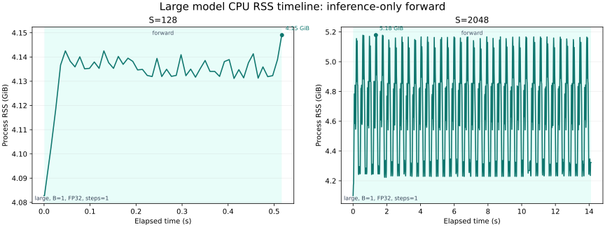
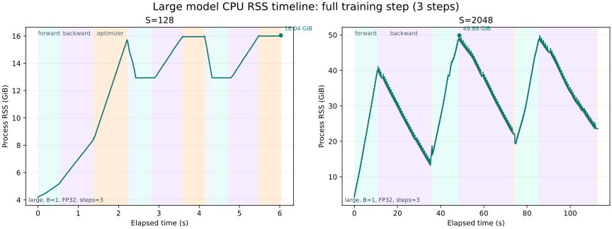
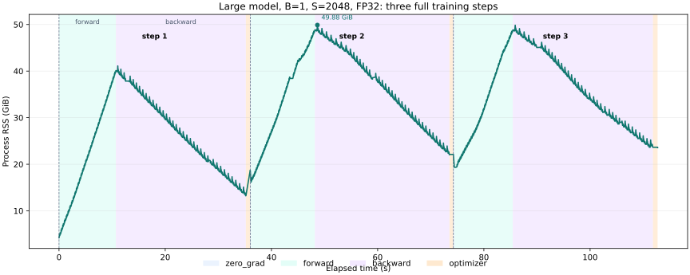
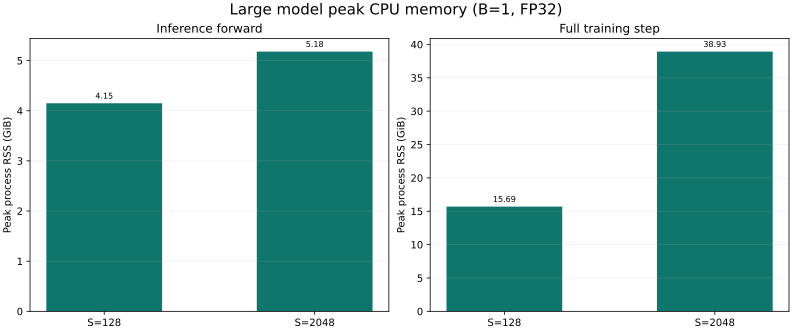
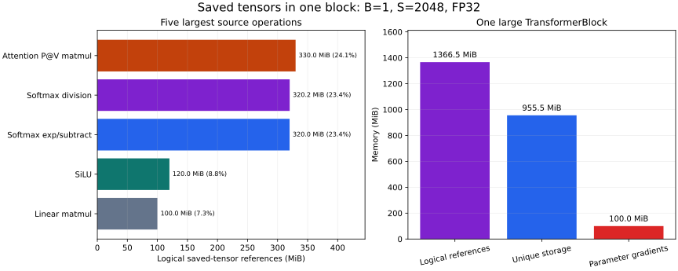

# Large 模型内存 Profiling 实验报告

## 1. 原问题与本次实验范围

原题 `memory_profiling` 要求：

1. 对 Table 1 中的 `xl` 模型，分别采集 inference forward 和完整训练 step 的 Active Memory Timeline；
2. 比较 context length 为 128 和 2048 时，forward 与完整训练 step 的峰值内存；
3. 比较 mixed precision；
4. 计算 residual stream Tensor 的大小；
5. 找出 timeline 中最大的 allocation 及其代码来源；
6. 用 Nsight Systems 分析单个 `TransformerBlock` 为 backward 保存的 residual、最大的五个来源以及 block gradient 大小。

本次按要求把模型改为 `large`：

| 参数 | 值 |
|---|---:|
| $d_\text{model}$ | 1280 |
| $d_\text{ff}$ | 5120 |
| 层数 | 36 |
| attention heads | 20 |
| vocabulary size | 10000 |
| 参数数量 | 0.969B（969,411,840） |
| FP32 参数内存 | 3.611 GiB |

还有两项硬件适配必须先说明：

- 本机没有可用 CUDA device，因此不能生成可由 `pytorch.org/memory_viz` 打开的 CUDA allocator snapshot，也不能在本机执行 Nsight Systems CUDA memory trace。
- 远端 `cuda-via-a` 是 6 GiB GTX 1060，而 large 模型完整 FP32 AdamW 训练仅参数、梯度和 optimizer states 的静态下界就约为 14.445 GiB，必然无法运行。

因此，本报告在本机 CPU 上使用真实进程 RSS timeline 和 `saved_tensors_hooks` 完成对应分析。为防止 `B=4,S=2048` 将 109 GiB 主存推入 swap，所有实测统一使用 `B=1`；涉及 handout 原始参考 batch size `B=4` 的地方另行给出解析结果。报告不会把 CPU RSS 图冒充 CUDA Active Memory Timeline。

## 2. 背景知识

### 2.1 训练内存由什么组成

一个完整训练 step 的主要内存来源是：

1. **模型参数**：本实验保持 FP32。
2. **参数梯度**：通常与参数形状和 dtype 相同。
3. **optimizer states**：本项目 AdamW 为每个参数保存 FP32 一阶矩 $m$ 和二阶矩 $v$。
4. **forward activations 与中间量**：包括层输出、attention scores、MLP 中间量等；其中一部分在最后一次 forward 使用后即可释放，另一部分会作为 saved tensors 被 autograd 保留到 backward。
5. **临时 Tensor 和算子 workspace**：仅服务于当前算子执行，不属于模型需要长期保留的 activation。
6. **Python、PyTorch runtime、线程库及 allocator 缓存**。

因此，saved tensors 不是与 forward activations 并列且可以再次相加的一类内存，而是按**生命周期和用途**划出的子集。反过来，saved tensors 也不一定都是通常所说的“层输出”：autograd 还可能保存算子的输入、mask、归一化统计量或参数引用，以便执行对应 VJP。

设参数数量为 $P$，全部采用 FP32。参数、梯度、AdamW `m/v` 的静态训练状态下界为：

$$M_\text{state}=4P+4P+4P+4P=16P\ \text{bytes}$$

large 模型有 969,411,840 个参数，因此：

$$M_\text{state}=\frac{16\times969411840}{1024^3}=14.445\ \text{GiB}$$

这还没有包括 activation、saved tensors、临时 Tensor 和运行时开销。

### 2.2 Forward-only 和训练 forward 为什么不同

Inference forward 在 `torch.inference_mode()` 下不构建 autograd graph。中间结果在最后一个使用者完成后即可释放，因而时间线上通常表现为围绕参数基线反复出现的短峰值。

训练 forward 必须为 backward 保留 Tensor。随着 TransformerBlock 逐层执行，尚未 backward 的 saved tensors 不断累积，所以内存通常呈阶梯式或近似线性上升。Backward 一边生成梯度，一边释放已经使用的 saved tensors。

### 2.3 RSS、active memory 和 reserved memory

三个概念不能混用：

- **Active/allocated Tensor memory**：当前仍由活跃 Tensor 占用的 allocator block。
- **Reserved memory**：allocator 向系统申请后保留的内存；Tensor 释放后 block 可能继续留在缓存中。
- **RSS**：操作系统观察到的整个进程驻留内存，除 Tensor 外还包含 Python、动态库、线程栈和 allocator 缓存。

CUDA `memory_viz` 展示的是 PyTorch CUDA allocator 的 segment/block 事件，能够定位 allocation stack；本报告的 CPU RSS timeline 只能可靠回答“进程峰值和阶段变化”，不能证明某个已释放 Tensor 的物理页已经归还操作系统。为了分析具体 residual，本报告另外使用 `saved_tensors_hooks` 记录 autograd 保存的 Tensor。

### 2.4 Saved tensor reference 与真实 storage

同一底层 storage 的不同 view 可能被多个 backward node 保存。因此报告同时给出：

- **logical saved references**：每次保存的 Tensor 视图大小之和，适合分析哪些算子依赖这些数据；
- **unique non-parameter storage**：按底层 storage pointer 去重，较接近这些引用实际保持存活的内存；
- **parameter storage**：本来就常驻，不计入 residual。

二者都不是 CPU RSS；前者可能重复计数共享 storage，后者也不包含 allocator metadata 和算子临时 workspace。

## 3. 实现

### 3.1 Full-model timeline

[`scripts/profile_memory.py`](../scripts/profile_memory.py) 支持：

- `forward` 和 `full`；
- 通过 `--steps` 连续记录多个训练 step；
- FP32；工具保留 autocast 参数，供具备原生低精度硬件的环境使用；
- 逐阶段标记 `forward/loss/backward/optimizer`；
- 后台线程按固定间隔采样 CPU RSS；
- CUDA 环境下同时采样 allocated/reserved memory；
- CUDA 环境下通过 `--output-snapshot` 调用 `_record_memory_history()` 和 `_dump_snapshot()`。

每组配置在独立进程中运行，避免前一组实验的 allocator cache 污染后一组。采样在模型、输入和空 optimizer 已创建后开始，因此 baseline 已包含模型参数。

### 3.2 单个 TransformerBlock residual

[`scripts/profile_block_saved_tensors.py`](../scripts/profile_block_saved_tensors.py) 使用 `torch.autograd.graph.saved_tensors_hooks` 记录：

- Tensor shape、dtype 和逻辑大小；
- 底层 storage 大小；
- 是否属于参数 storage；
- 保存动作对应的本项目 Python 源码位置；
- backward 后生成的参数梯度总大小。

它不会把参数被 matmul backward 引用的大小误算成新增 residual。

### 3.3 可视化

[`scripts/plot_memory_profiles.py`](../scripts/plot_memory_profiles.py) 直接读取原始 JSON，生成 timeline、峰值对比和单 block residual 图，不在绘图脚本中硬编码实验结果。

## 4. 实验设置

| 项目 | 值 |
|---|---|
| 主机 | `online1` |
| CPU | Intel Xeon Platinum 8336C |
| 可用物理核 | 56 |
| 实验绑定 | NUMA node 0 的 CPU 0-27 |
| 主存 | 109 GiB |
| PyTorch | 2.11.0+cu130 |
| CUDA availability | `False` |
| 模型 | `large` |
| batch size | 1 |
| context lengths | 128、2048 |
| precision | FP32 |
| optimizer | 项目自定义 AdamW |
| memory sample interval | 10 ms |
| warmup | 0；主实验记录第一个 step，另有一次连续 3-step 验证 |

典型命令：

```bash
OMP_NUM_THREADS=28 MKL_NUM_THREADS=28 \
OMP_PROC_BIND=true OMP_PLACES=cores \
taskset -c 0-27 \
uv run python scripts/profile_memory.py \
  --model-size large \
  --mode full \
  --device cpu \
  --dtype float32 \
  --autocast-dtype none \
  --batch-size 1 \
  --context-length 2048 \
  --sample-interval-ms 10 \
  --output-json benchmark_results/cpu_memory_profile/large_s2048_full_fp32.json
```

内存 profiling 刻意不做 warmup：AdamW 的 `m/v` 在第一次 `optimizer.step()` 中惰性创建，这正是完整模型生命周期需要观察的事件。

## 5. (a) Memory timeline

### 5.1 原问题

分别观察 inference-only forward 和 full training step 的 Active Memory Timeline；是否能从峰值判断当前阶段？

### 5.2 Forward-only



`S=128` 的 activation 相对 3.611 GiB 参数基线很小，RSS 只在约 4.1 GiB 附近轻微波动。`S=2048` 则出现约 36 组明显的周期性峰谷，对应 36 个 TransformerBlock 依次分配并释放 attention/FFN 临时 Tensor；inference 不保存 backward residual，所以不会逐层累积。

### 5.3 Full training step



该主图已按补充实验重画：`S=128/2048` 两个 FP32 面板都展示连续 3 个 step。第 6 节用于横向比较的峰值表仍采用先前相互隔离的单-step 进程结果，避免 allocator 历史影响不同配置的比较。

Full step 的阶段可以直接辨认：

1. **Forward**：saved tensors 随层数持续累积；`S=2048` FP32 的第一次 forward 从约 4.2 GiB 增长到 39.88 GiB，后两次则在已有 AdamW states 和 allocator cache 的基线上增长到约 48.64 GiB。
2. **Backward**：开始时 residual 尚未释放而梯度已经产生，FP32 三步的 backward 峰值分别为 41.11、49.88 和 49.84 GiB；随后每完成一个 block 的 VJP 就释放该 block residual，时间线上出现下降锯齿。
3. **Optimizer**：第一次 backward 结束后创建 AdamW `m/v`；后续 optimizer step 复用已有 states，不再重复出现同等规模的新增长。`S=128` 的 activation 较小，所以第一步全局峰值出现在 optimizer；`S=2048` 则始终由 backward 初期主导。

第 2 点描述的是 `S=2048`。`S=128` 的 backward 没有整体下降趋势并不只是采样误差：单个 large block 在 `S=128` 时只保留约 21.98 MiB 去重非参数 saved storage，却会产生约 100.01 MiB 的 FP32 parameter gradients。反向经过一层时，释放的 residual 少于新增长期保留到 `zero_grad()` 的梯度，因此活跃 Tensor 的净变化本来就偏向上升。

CPU RSS 又会强化这一现象：autograd 释放 Tensor 后，底层 allocator 可以保留相应内存页供后续分配复用，而不立即归还操作系统。因此“RSS 没下降”不能推出“residual 没释放”。在 CUDA 上也必须区分 `memory_allocated()` 和 allocator 的 `memory_reserved()`；CPU RSS 在这一点上更接近包含缓存和其他运行时内存的进程级指标。

### 5.4 为什么 backward 是锯齿，而不是光滑单调下降

一个 block 的 backward 不是“先一次性释放该层全部 residual，再一次性生成全部 gradient”，而是多个 VJP 按逆序交错执行：

1. 某个 backward node 读取其 saved tensors；
2. kernel 为 activation gradient、parameter gradient 或 workspace 分配内存，曲线暂时上升；
3. 该 node 完成后，其不再需要的 saved tensors 才能释放，曲线下降；
4. parameter `.grad` 必须保留到 optimizer step，而传给前一层的 activation gradient 也暂时存活；
5. 下一个 node 或 block 重复这个过程。

因此局部曲线自然是“分配后上升、释放后下降”的锯齿。包络线的方向取决于两者谁更大：

- `S=2048`：每层释放约 955.48 MiB 去重 saved storage，只新增约 100.01 MiB 参数梯度，所以下降占主导；
- `S=128`：每层只释放约 21.98 MiB saved storage，却新增约 100.01 MiB 参数梯度，所以上升占主导；
- 10 ms 采样和 CPU allocator 缓存会改变锯齿的可见程度，但不会改变上述 Tensor 生命周期关系。

### 5.5 连续 3-step 验证

此前主实验的每个独立进程确实只运行了一个 step，目的是把第一次 `optimizer.step()` 惰性创建 AdamW `m/v` 的事件包含进 timeline。为观察长序列的稳态周期，现对 `S=2048` 的 FP32 补跑 3 个 step：

```bash
OMP_NUM_THREADS=28 MKL_NUM_THREADS=28 \
OMP_PROC_BIND=true OMP_PLACES=cores \
taskset -c 0-27 \
uv run python scripts/profile_memory.py \
  --model-size large \
  --mode full \
  --device cpu \
  --dtype float32 \
  --batch-size 1 \
  --context-length 2048 \
  --steps 3 \
  --sample-interval-ms 5 \
  --output-json benchmark_results/cpu_memory_profile/large_s2048_full_fp32_3steps.json
```



| Step | `zero_grad` 后 | Forward peak | Backward peak | Optimizer peak |
|---:|---:|---:|---:|---:|
| 1 | 4.202 GiB | 39.883 GiB | 41.108 GiB | 18.721 GiB |
| 2 | 16.159 GiB | 48.640 GiB | 49.883 GiB | 22.147 GiB |
| 3 | 19.345 GiB | 48.631 GiB | 49.843 GiB | 23.644 GiB |

结果呈现两个阶段：

- **Step 1 是初始化周期**：开始时只有参数和运行时基线；backward 创建 FP32 `.grad`，optimizer 首次创建并保留 FP32 `m/v`。
- **Step 2/3 是长序列稳态周期**：两次 forward/backward 的曲线形状基本重复，backward 峰值稳定在约 49.86 GiB。
- **第二步峰值高于第一步**：从 Step 2 开始，约 7.22 GiB AdamW `m/v` 已在 forward 前常驻；allocator cache 和碎片还会进一步抬高 RSS。
- **周期不会闭合到同一 RSS 基线**：`zero_grad(set_to_none=True)` 会解除 `.grad` 引用，但 CPU allocator 不保证立即归还页。`zero_grad` 后 RSS 从 Step 2 的 16.16 GiB 漂移到 Step 3 的 19.35 GiB；这是 RSS/allocator 行为，不能据此断言 autograd graph 泄漏。

因此 `S=2048` 更清楚地同时展示了两个层级的周期：每个 backward 内有逐 block 的细锯齿，完整 step 之间又重复“forward 上升、backward 下降、zero_grad 部分回落”的大周期。

## 6. (b) Context length 与峰值内存

### 6.1 原问题

context length 为 128 和 2048 时，forward-only 与完整训练 step 的峰值分别是多少？

### 6.2 实测结果

以下均为 `large,B=1,FP32` 的进程峰值 RSS：

| Context length | Forward-only | Full step | Full / forward |
|---:|---:|---:|---:|
| 128 | 4.149 GiB | 15.693 GiB | 3.78× |
| 2048 | 5.179 GiB | 38.926 GiB | 7.52× |



完整训练的分阶段峰值进一步说明峰值来源：

| Context | Forward stage | Backward stage | Optimizer stage |
|---:|---:|---:|---:|
| 128 | 5.228 GiB | 8.446 GiB | 15.693 GiB |
| 2048 | 37.650 GiB | 38.926 GiB | 17.338 GiB |

context 从 128 增长到 2048 是 16 倍，但 full-step 峰值从 15.69 GiB 增长到 38.93 GiB，而不是简单的 16 倍。原因是参数、梯度和 optimizer state 与 sequence length 无关，只有 activation、saved tensors 和部分 workspace 随 $S$ 或 $S^2$ 增长。

## 7. (c) Mixed precision

### 7.1 原问题

Mixed precision 下 forward 与 full step 的峰值是多少？它是否显著影响内存？

### 7.2 本机不执行该实验

本机 CPU 不具备原生 BF16/FP16 硬件指令，运行 CPU autocast 测到的是转换和软件回退行为，不是有硬件支持时的 mixed-precision 训练特征。远端 GTX 1060 同样不支持 BF16，并且其 6 GiB 显存无法容纳 large 模型的完整训练状态。

因此本报告移除所有低精度实测结果，不用不受支持的环境回答“mixed precision 是否显著节省内存”。该问题需要在具备原生 BF16 或 Tensor Core FP16、且显存足以容纳 large full step 的 GPU 上重新实验。

## 8. (d) Residual stream Tensor

### 8.1 原问题

给定参考超参数，单个 FP32 Transformer residual-stream Tensor 有多大？

### 8.2 Residual stream 是什么

Residual stream 是 Transformer 中贯穿各层的主隐藏状态。Token embedding 首先产生 $x^{(0)}$；之后每个 attention 和 FFN 子层不直接替换它，而是计算一个更新量并通过 residual connection 加回主路径。

本项目的 Pre-Norm `TransformerBlock` 对应：

```python
x = x + self.attn(self.ln1(x), token_positions=token_positions, rope=self.rope)
x = x + self.ffn(self.ln2(x))
```

见 [`model.py:L187-L193`](../../assignment1-basics/cs336_basics/model.py#L187-L193)。对第 $l$ 层中第 $(b,s)$ 个 token，数学上可写成：

$$x_{b,s}^{(l+\frac12)}=x_{b,s}^{(l)}+\operatorname{Attention}(\operatorname{RMSNorm}(x^{(l)}))_{b,s},\qquad x_{b,s}^{(l+1)}=x_{b,s}^{(l+\frac12)}+\operatorname{FFN}(\operatorname{RMSNorm}(x_{b,s}^{(l+\frac12)}))$$

这里的 $x$ 就是 residual stream。它有以下特征：

1. 每个 batch 样本、每个 sequence position 都有一个 $d_\text{model}$ 维隐藏向量。
2. attention 和 FFN 的输出都必须回到 $d_\text{model}$ 维，才能加回这条主路径。
3. 它从 token embedding 开始，依次穿过全部 Transformer blocks，最后进入 final RMSNorm 和 LM head。
4. “Stream”描述的是同一语义主路径在网络深度方向上的连续传递，不表示实现中只有一个始终原地修改的 storage；每次非原地加法通常会产生新的 Tensor。

Residual stream 与前文的 autograd **saved tensors/residuals** 不是同义词：

- residual stream 是模型架构中的隐藏状态，按“数据流位置”命名；
- saved tensor 是 autograd 为执行 VJP 而延长生命周期的任意 Tensor，按“反向传播用途”命名；
- 某个 residual-stream Tensor 可能被保存供 backward 使用，但 saved tensors 还包括 Q/K/V、attention probability、MLP 中间量和归一化统计量。

因此题目 (d) 只要求计算“一份主隐藏状态”的大小，不是计算一个 TransformerBlock 保存的全部 backward residual；后者在第 10 节单独统计。

### 8.3 大小推导

下面计算的是**某一个网络深度位置上的一份 residual-stream Tensor**，不是整个 36 层模型中所有 residual-stream states 的总和。单份 Tensor 的形状是 `(B,S,d_model)`，因此：

$$M_\text{residual}=\frac{B S d_\text{model}\times4}{1024^2}\ \text{MiB}$$

对 large 模型 $d_\text{model}=1280$：

| Batch | Context | 单个 FP32 residual stream |
|---:|---:|---:|
| 1 | 128 | 0.625 MiB |
| 1 | 2048 | 10 MiB |
| 4（handout reference） | 128 | 2.5 MiB |
| 4（handout reference） | 512 | 10 MiB |
| 4（handout reference） | 2048 | 40 MiB |

### 8.4 整条链路中有多少份 residual-stream state

对于每个 TransformerBlock，本实现会产生两个新的 residual-stream state：

1. attention 更新加回主路径后得到 $x^{(l+\frac12)}$；
2. FFN 更新加回主路径后得到 $x^{(l+1)}$。

Embedding 输出提供初始状态 $x^{(0)}$。因此 36 层 forward 在概念上依次产生：

$$N_\text{stream states}=1+2L=1+2\times36=73$$

这里没有重复计算相邻 block 的边界：前一层输出 $x^{(l)}$ 就是后一层输入的同一个 Tensor。Final RMSNorm 会再产生一份同形状输出，但它通常被视为 residual stream 的最终 readout，而不是又一次 residual update，所以没有计入上述 73 份。

Python 代码虽然始终使用变量名 `x`：

```python
x = x + attention_update
x = x + ffn_update
```

但这是变量重新绑定。因为 `+` 不是原地操作，每行都会产生新 Tensor；它不会覆盖旧 storage。

如果纯粹把 73 份概念状态的大小相加：

| Batch | Context | 单份大小 | 73 份概念总量 |
|---:|---:|---:|---:|
| 1 | 128 | 0.625 MiB | 45.625 MiB |
| 1 | 2048 | 10 MiB | 730 MiB |
| 4 | 128 | 2.5 MiB | 182.5 MiB |
| 4 | 2048 | 40 MiB | 2920 MiB（约 2.852 GiB） |

但这个乘法结果**不是实际峰值内存**：

- inference 中，旧的 stream state 在最后一个使用者完成后可以释放，73 份通常不会同时存活；
- training 中，autograd 会保留 backward 真正需要的部分 state，但 residual addition 本身不等于要求保存两个加数的完整副本；
- attention 和 FFN 还会产生 Q/K/V、attention matrix 和 $d_\text{ff}$ 宽度的中间量，它们不属于 residual stream，却可能远大于上述 73 份状态；
- view 可能共享底层 storage，allocator 也可能复用已经释放的 block。

所以题目 (d) 询问的“a tensor of activations in the Transformer residual stream”是**单份大小**；整网实际 activation/residual 内存必须按 autograd 保存集合和 Tensor 生命周期统计，不能简单使用 `73 × 单份大小` 代替。第 10 节的 saved-tensor hook 正是在测量后一个问题。

另外，“一个 residual-stream Tensor”也不等于“一层为 backward 保存的全部 residual”。一个 block 还会保存 Q/K/V、attention probability、MLP 宽维 activation 以及归一化中间量。

## 9. (e) 最大 allocation

### 9.1 原问题

降低 memory timeline 的 Detail 后，最大 allocation 有多大，来自哪里？

### 9.2 结果

在 `large,B=1,S=2048,FP32` 的单 block trace 中，最大的三个非参数 Tensor 都是 320 MiB：

| 大小 | Shape | 来源 | 含义 |
|---:|---|---|---|
| 320 MiB | `(1,20,2048,2048)` | [`nn_utils.py:L10`](../../assignment1-basics/cs336_basics/nn_utils.py#L10) | softmax 的指数结果 |
| 320 MiB | `(1,20,2048,2048)` | [`nn_utils.py:L11`](../../assignment1-basics/cs336_basics/nn_utils.py#L11) | softmax 除法 backward 保存的输入 |
| 320 MiB | `(20,2048,2048)` | [`model.py:L133`](../../assignment1-basics/cs336_basics/model.py#L133) | `attention_probability @ V` backward 保存的 attention probability |

其大小来自：

$$\frac{B H S^2\times4}{1024^2}=\frac{1\times20\times2048^2\times4}{1024^2}=320\ \text{MiB}$$

若按 handout 的 `B=4`，单个同类 FP32 allocation 为 1280 MiB。降低 Detail 后仍然首先看到这些 Tensor，是因为 attention matrix 按 $O(BHS^2)$ 增长；本项目的手写 softmax 又显式物化 `max/subtract/exp/sum/divide` 路径，没有使用 fused memory-efficient attention。

## 10. (f) 单个 TransformerBlock 的 residual 与 gradient

### 10.1 五个最大来源



以下为 `large,B=1,S=2048,FP32`，已排除常驻 parameter storage。百分比的分母是 1366.5 MiB logical non-parameter saved references：

| 排名 | 源码位置 | Logical saved bytes | 占比 |
|---:|---|---:|---:|
| 1 | [`attention_probability @ V`](../../assignment1-basics/cs336_basics/model.py#L133) | 330.0 MiB | 24.15% |
| 2 | [softmax division](../../assignment1-basics/cs336_basics/nn_utils.py#L11) | 320.16 MiB | 23.43% |
| 3 | [softmax exp/subtract](../../assignment1-basics/cs336_basics/nn_utils.py#L10) | 320.0 MiB | 23.42% |
| 4 | [SiLU](../../assignment1-basics/cs336_basics/model.py#L75-L77) | 120.0 MiB | 8.78% |
| 5 | [Linear matmul](../../assignment1-basics/cs336_basics/model.py#L30-L32) | 100.0 MiB | 7.32% |
| 合计 |  | 1190.16 MiB | 87.10% |

Logical references 可能指向相同 storage。按底层 storage pointer 去重后，一个 block 的非参数 saved storage 为 955.48 MiB。

### 10.2 一个 block 产生多少参数梯度

Large TransformerBlock 的参数数量为：

$$P_\text{block}=4d_\text{model}^2+3d_\text{model}d_\text{ff}+2d_\text{model}=26216960$$

所以 FP32 parameter gradients 应占：

$$M_\text{grad,block}=\frac{26216960\times4}{1024^2}=100.01\ \text{MiB}$$

Hook 在 backward 后直接统计到 104,867,840 bytes，即 100.01 MiB，与理论值完全一致。

从 full-step RSS 看，`S=2048` backward 从约 37.803 GiB 下降到 11.102 GiB，平均每层净下降约 759.5 MiB。它与 `955.48 - 100.01 = 855.47 MiB` 的 Tensor-level 估算不完全一致，因为 RSS 还受 CPU allocator 缓存、临时 workspace、不同 storage 生命周期以及操作系统页驻留影响。这正说明不能仅用 RSS 的相邻峰谷精确反推出 gradient 大小；CUDA Active Memory Timeline 或本实验的直接 Tensor 统计更适合这个问题。

### 10.3 与题目要求的 Nsight 差异

题目要求的 Nsight CUDA screenshot 在当前硬件上无法诚实地产生：6 GiB GTX 1060 连 large FP32 full-step 的 14.445 GiB 静态训练状态下界都容纳不了。本报告用真实 CPU timeline 和 saved-tensor source trace 回答相同的内存归因问题，但它不是 Nsight 截图；将来在足够显存的 CUDA 机器上可直接复用 `profile_memory.py --output-snapshot ...` 生成 PyTorch snapshot。

## 11. 复杂度与可并行性

### 11.1 内存复杂度

- 参数、梯度和 AdamW states：$O(P)$。
- Residual-stream Tensor：$O(BSd_\text{model})$。
- MLP activation：$O(BSd_\text{ff})$。
- 普通 attention matrix：$O(BHS^2)$。
- 36 层训练 forward 保存的 residual：最坏情况下随层数近似线性增长。

因此长上下文实验最终由 $S^2$ attention Tensor 主导，而短上下文更容易由 $O(P)$ 模型状态主导。

### 11.2 实验并行性

各组 full-model 配置彼此独立，理论上可以并行；但内存 profiling 不应并行运行：

- 并发进程会争用主存带宽和 CPU cores；
- 系统 RSS、页缓存和 NUMA placement 会互相干扰；
- 两个 `S=2048` full step 并发可能触发 swap。

因此本实验串行运行，每组独占 CPU 0-27。绘图与 JSON 分析可以在 profile 完成后并行。

## 12. 结论

1. Large 模型的 FP32 参数本身占 3.611 GiB，完整 AdamW 状态下界为 14.445 GiB，所以 6 GiB GTX 1060 无法完成 full step。
2. `S=128` 时 activation 较小，full-step 峰值由 optimizer state 初始化主导；`S=2048` 时 saved residual 主导，峰值出现在 backward 初期。
3. `S=2048` FP32 full step 的独立单-step 实测峰值为 38.926 GiB；进入稳态后，第二、三步峰值约为 49.86 GiB，因为 AdamW states 已经常驻。
4. 单个 `B=1,S=2048` block 的去重 saved storage 为 955.48 MiB，其中三个最大的 attention/softmax Tensor 各为 320 MiB。
5. 一个 large block 的 FP32 parameter gradients 精确占 100.01 MiB，与参数量推导一致。
6. 手写 softmax 显式物化多个 $O(BHS^2)$ Tensor，是长上下文内存的首要优化对象；fused scaled-dot-product/FlashAttention 可从算法层面避免保存完整中间矩阵。
7. `S=2048` 的连续三步结果显示 Step 1 包含 AdamW state 初始化，Step 2/3 才形成稳定周期；短序列 backward 的上升趋势则来自参数梯度大于被释放 residual，而不是 residual 没有释放。

## 13. 产物

| 产物 | 路径 |
|---|---|
| Full-model profiler | [`scripts/profile_memory.py`](../scripts/profile_memory.py) |
| Block saved-tensor profiler | [`scripts/profile_block_saved_tensors.py`](../scripts/profile_block_saved_tensors.py) |
| 绘图脚本 | [`scripts/plot_memory_profiles.py`](../scripts/plot_memory_profiles.py) |
| Forward timeline | [`large_forward_rss_timeline.svg`](./assets/memory_profiling/large_forward_rss_timeline.svg) |
| Full-step timeline | [`large_full_rss_timeline.svg`](./assets/memory_profiling/large_full_rss_timeline.svg) |
| Three-step timeline | [`large_s2048_three_step_rss_timeline.svg`](./assets/memory_profiling/large_s2048_three_step_rss_timeline.svg) |
| Peak comparison | [`large_peak_rss_comparison.svg`](./assets/memory_profiling/large_peak_rss_comparison.svg) |
| Block residual breakdown | [`large_block_saved_tensors.svg`](./assets/memory_profiling/large_block_saved_tensors.svg) |
| 原始数据 | `benchmark_results/cpu_memory_profile/` |

## 14. 参考资料

1. [PyTorch: Understanding CUDA Memory Usage](https://docs.pytorch.org/docs/stable/torch_cuda_memory.html)
2. [PyTorch: `torch.autograd.graph.saved_tensors_hooks`](https://docs.pytorch.org/docs/stable/autograd.html#torch.autograd.graph.saved_tensors_hooks)
3. [PyTorch: Automatic Mixed Precision examples](https://docs.pytorch.org/docs/stable/notes/amp_examples.html)
4. [PyTorch Memory Visualizer](https://pytorch.org/memory_viz)
