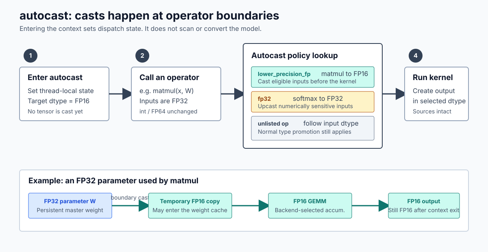
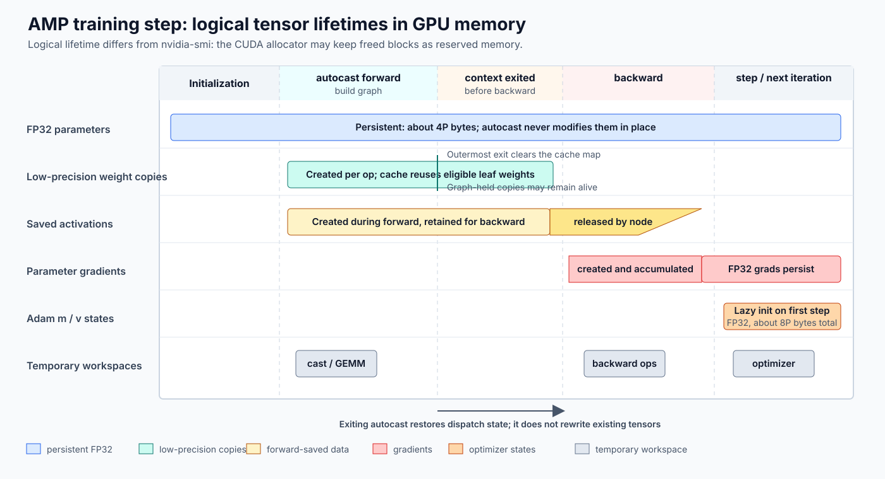
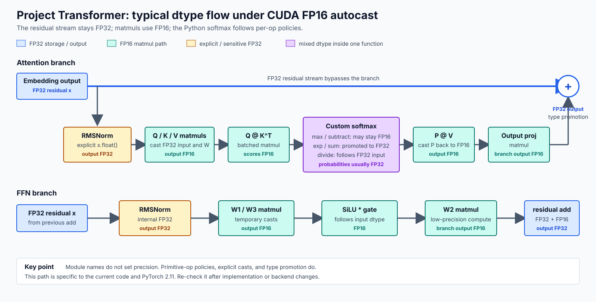
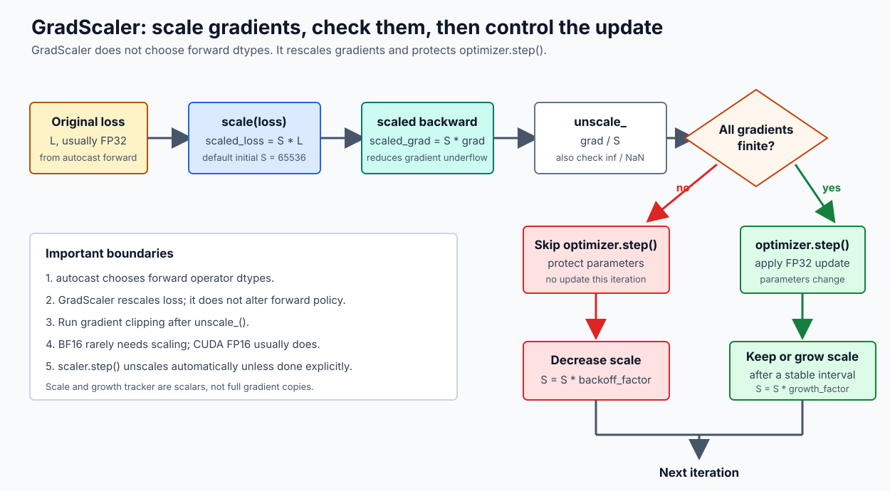

# PyTorch autocast 与混合精度训练详解

本文解释下面这段代码在 PyTorch 中实际发生了什么：

```python
model = model.float()  # 参数仍是 FP32

with torch.autocast(device_type="cuda", dtype=torch.float16):
    logits = model(input_ids)
    loss = cross_entropy(logits, targets)

loss.backward()
optimizer.step()
```

重点不是只记住“矩阵乘用 FP16、归约用 FP32”，而是区分：

1. 模型参数、buffer、激活和梯度等不同用途的张量在显存中的**存储 dtype**；
2. 某次算子调用收到的**输入 dtype**；
3. 算子的**计算 dtype**与内部累加 dtype；
4. 算子的**输出 dtype**；
5. autograd 为 backward 保存的张量 dtype；
6. 最终参数梯度和优化器状态的 dtype。

这些概念不分开，就很容易产生“进入 autocast 后模型变成 FP16”之类的误解。

本文以当前项目环境中的 PyTorch `2.11.0+cu130` 为主要版本基准。Autocast 的算子策略可能随 PyTorch 版本和设备后端变化，具体版本应以官方 [Autocast Op Reference](https://docs.pytorch.org/docs/stable/amp.html#autocast-op-reference) 为准。

## 1. 先给出结论

### 1.1 `autocast` 不会把整个模型永久转换成 FP16

执行：

```python
model = model.float()
```

后，模型参数的原始存储是 FP32。进入：

```python
with torch.autocast(device_type="cuda", dtype=torch.float16):
```

不会立刻遍历模型，也不会原地修改参数。此时：

```python
next(model.parameters()).dtype is torch.float32
```

仍然成立。

`autocast` 只是在当前线程中启用一套算子分派规则。真正执行某个符合条件的算子时，PyTorch 才根据该算子的策略临时转换输入，并让该算子以指定精度执行。

### 1.2 转换发生在算子调用边界

以 FP32 输入和 FP32 权重的矩阵乘为例：

```python
with torch.autocast("cuda", dtype=torch.float16):
    y = torch.matmul(x_fp32, w_fp32)
```

逻辑顺序是：

1. Python 调用 `torch.matmul`。
2. PyTorch dispatcher 发现当前线程启用了 CUDA autocast。
3. `matmul` 的 CUDA autocast 策略是 `lower_precision_fp`。
4. 在进入真正的矩阵乘 kernel 前，符合条件的 FP32 输入被转换为 FP16。
5. 矩阵乘接收 FP16 输入并产生 FP16 输出。
6. 原始 `x_fp32` 和 `w_fp32` 的存储没有被修改。

因此，转换不是在进入 `with` 时统一发生，也不是在退出 `with` 时统一恢复，而是发生在**每个受 autocast 管理的算子被分派时**。



图中下半部分强调了两份数据可以同时存在：FP32 参数本体保持不变，FP16 副本只服务于当前低精度计算，并可能被 weight cache 或 autograd graph 暂时持有。

### 1.3 算子的 BF16 输出会自动转回 FP32 吗

不会。假设一个算子的原始输入是 FP32，autocast 选择让该算子以 BF16 执行，并且算子输出是 BF16，那么这个输出激活就是一个 BF16 Tensor。退出 autocast 上下文也不会把它自动转回 FP32。下面的示例需要支持 CUDA BF16 的 GPU，不能在 GTX 1060 上运行：

```python
residual_fp32 = torch.randn(8, 8, device="cuda", dtype=torch.float32)
x_fp32 = torch.randn(8, 8, device="cuda", dtype=torch.float32)
w_fp32 = torch.randn(8, 8, device="cuda", dtype=torch.float32)

with torch.autocast("cuda", dtype=torch.bfloat16):
    y_bf16 = torch.matmul(x_fp32, w_fp32)
    assert x_fp32.dtype is torch.float32
    assert w_fp32.dtype is torch.float32
    assert y_bf16.dtype is torch.bfloat16

    z_fp32 = y_bf16 + residual_fp32
    assert z_fp32.dtype is torch.float32

assert y_bf16.dtype is torch.bfloat16
```

这里同时存在三类数据：

1. 原始 `x_fp32` 和 `w_fp32` 仍是 FP32；
2. `matmul` 在调用边界获得临时 BF16 输入；
3. 新产生的输出激活 `y_bf16` 是 BF16。

`y_bf16` 会一直保持 BF16，直到后续代码出现明确的精度变化。常见变化来源包括：

- 下一个算子采用 FP32 autocast 策略，例如 CUDA 上的内置 `layer_norm` 或 `softmax`；
- 与 FP32 residual 等 Tensor 运算时，普通类型提升产生 FP32 输出；
- 代码显式调用 `.float()` 或 `.to(torch.float32)`；
- 模块内部像本项目 RMSNorm 一样，主动提升到 FP32。

因此，更准确的结论是：

> 一个低精度算子的 BF16 输出不会因为其输入原来是 FP32 而自动恢复为 FP32。它是否继续保持 BF16，由后续算子的 autocast 策略、显式 cast 和普通类型提升共同决定。

还要区分“算子”和“层”。一个层可能由多个算子组成：若最后一个算子输出 BF16，则该层暴露给下游的激活是 BF16；若层内随后执行 FP32 normalization、FP32 reduction 或与 FP32 residual 相加，则该层最终输出可能是 FP32。

训练时，autograd 可能按 backward 公式保存 BF16 输出、临时 BF16 输入或其他 FP32 中间量，但不会仅为了“恢复原输入精度”而额外维护一份与 `y_bf16` 数值相同的 FP32 输出副本。

### 1.4 AMP 是什么

AMP 是 **Automatic Mixed Precision，自动混合精度**。它不是一种新的 dtype，也不等于单独使用 `autocast`，而是一套让不同训练环节使用不同精度的执行方案。

PyTorch 的 AMP 主要涉及：

| 组件 | 职责 |
|---|---|
| `torch.autocast` | 在 forward 和 loss 中按算子选择 FP16、BF16 或 FP32 |
| `torch.amp.GradScaler` | 在 FP16 训练中放大 loss、还原梯度并检查 `inf`/`NaN` |
| autograd | 按 forward 建立的计算图和 dtype 路径执行 backward |
| FP32 参数与优化器状态 | 保存可稳定累积和更新的长期训练状态 |
| optimizer | 在梯度有效时更新参数 |

典型组合是：

- CUDA FP16 训练：`autocast + GradScaler`；
- CUDA/CPU BF16 训练：通常使用 `autocast`，不启用 GradScaler；
- 混合精度推理：只使用 `autocast`，因为没有 backward 和参数更新。


图中的“Automatic”表示 PyTorch 根据已注册的算子策略自动选择计算 dtype，并不表示所有数值问题都会被自动处理。自定义 Python 组合函数、自定义算子和特殊数值公式仍可能需要显式指定精度。

### 1.5 典型 CUDA FP16 AMP 的 dtype

对于“FP32 参数 + CUDA FP16 autocast + 内置 LayerNorm 和 cross-entropy”的常见模型：

| 对象 | 典型 dtype | 原因 |
|---|---|---|
| 模型参数本体 | FP32 | `autocast` 不修改参数存储 |
| Linear/matmul 的临时计算输入 | FP16 | 该类算子优先低精度 |
| Linear/matmul 输出 | FP16 | 输出通常跟随低精度计算 |
| LayerNorm 输出 | FP32 | CUDA autocast 将 `layer_norm` 放入 FP32 策略 |
| 最后一层 Linear logits | FP16 | Linear 再次以低精度执行 |
| 内置 cross-entropy 输出 loss | FP32 | `cross_entropy` 使用 FP32 策略 |
| backward 中间量 | 混合 | 通常沿用对应 forward 算子的 dtype |
| FP32 参数的 `.grad` | FP32 | 梯度最终转换并累加到 FP32 叶子参数 |
| AdamW 一阶、二阶状态 | 通常 FP32 | 状态通常跟随 FP32 参数创建 |

这张表只描述常见路径。自定义 Python 函数会被拆成基础算子逐个处理，不能仅凭函数名套用内置算子的策略。本项目正好存在这种情况，见第 7 节。

### 1.6 原示例缺少 FP16 训练通常需要的 GradScaler

原代码能表达 autocast，但对 CUDA FP16 训练并不完整。更常见的写法是：

```python
model = model.float()
optimizer = AdamW(model.parameters(), ...)
scaler = torch.amp.GradScaler("cuda")

for input_ids, targets in dataloader:
    optimizer.zero_grad(set_to_none=True)

    with torch.autocast(device_type="cuda", dtype=torch.float16):
        logits = model(input_ids)
        loss = cross_entropy(logits, targets)

    scaler.scale(loss).backward()
    scaler.step(optimizer)
    scaler.update()
```

`autocast` 解决“各算子使用什么 dtype”，`GradScaler` 解决“FP16 backward 中很小的梯度可能下溢为 0”。二者职责不同。

## 2. 为什么需要混合精度

### 2.1 三种常见格式

| dtype | 符号位 | 指数位 | 尾数位 | 最大有限值约为 | 最小正规格化正数约为 |
|---|---:|---:|---:|---:|---:|
| FP32 | 1 | 8 | 23 | $3.4 \times 10^{38}$ | $1.18 \times 10^{-38}$ |
| FP16 | 1 | 5 | 10 | $6.55 \times 10^4$ | $6.10 \times 10^{-5}$ |
| BF16 | 1 | 8 | 7 | $3.4 \times 10^{38}$ | $1.18 \times 10^{-38}$ |

FP16 比 FP32 少了很多指数位，因此动态范围窄，容易出现：

- 大值溢出为 `inf`；
- 小梯度下溢为 0；
- 长归约中的舍入误差积累。

BF16 保留了与 FP32 相同数量的指数位，动态范围接近 FP32，但尾数更短，因此它通常不容易发生 FP16 式的溢出和下溢，却仍有更大的舍入误差。

### 2.2 低精度的收益来自哪里

低精度可能同时带来：

- 更高的 Tensor Core 矩阵乘吞吐；
- 更低的显存带宽；
- 更小的 activation 和临时张量；
- 某些情况下更大的可用 batch size。

但它不会自动把所有训练状态减半。若参数本体、参数梯度和 Adam 状态仍为 FP32，这些持久数据仍占用 FP32 空间。


## 3. `autocast` 的内部工作模型

### 3.1 进入上下文时发生什么

PyTorch 2.11 的 [`autocast.__enter__`](https://github.com/pytorch/pytorch/blob/v2.11.0/torch/amp/autocast_mode.py#L320-L353) 主要做以下事情：

1. 保存进入前的 autocast 开关、目标 dtype 和 cache 设置；
2. 为指定设备启用 autocast dispatch key；
3. 将该设备的目标低精度设为 `dtype`；
4. 增加嵌套层级计数；
5. 设置 weight cache 是否启用。

这里没有模型遍历，也没有参数转换，更没有 CUDA kernel 因“进入上下文”而批量启动。

Autocast 状态是线程局部的。新线程不会自动继承当前线程的状态，每个线程都要自行进入 autocast 上下文。

### 3.2 算子调用时的五类策略

PyTorch 的 autocast wrapper 在 dispatcher 层按算子注册策略。源码中的核心策略包括：

| 策略 | 行为 |
|---|---|
| `lower_precision_fp` | 将符合条件的浮点输入转换为目标低精度，再调用真实算子 |
| `fp32` | 将符合条件的输入转换为 FP32，再调用真实算子 |
| `fp32_set_opt_dtype` | 对带可选 `dtype` 参数的算子，在用户未显式指定时设置 FP32 |
| `fp32_append_dtype` | 调用带 dtype 的重载，使结果使用 FP32 |
| `promote` | 在多个输入中选择最宽的 dtype |

对应实现可见 PyTorch 2.11 的 [`CastPolicy`](https://github.com/pytorch/pytorch/blob/v2.11.0/aten/src/ATen/autocast_mode.h#L415-L439) 和各策略 wrapper。

CUDA 上常见的例子是：

- 低精度策略：`matmul`、`mm`、`bmm`、`linear`、卷积；
- FP32 策略：`layer_norm`、`softmax`、`log_softmax`、`cross_entropy`、`exp`、`log`、若干归约和 loss；
- 最宽输入策略：部分需要组合多个输入的算子。

完整清单是后端和版本相关的，不能把这里的例子当成永久不变的语言规范。

### 3.3 哪些调用不参与自动转换

官方 [Op Eligibility](https://docs.pytorch.org/docs/stable/amp.html#op-eligibility) 有几个重要边界：

1. 只有浮点 Tensor 会被考虑；`input_ids` 和 `targets` 这类整型 Tensor 不会被转成 FP16。
2. FP64 Tensor 不会被 autocast 降精度。
3. 主要是 out-of-place 算子参与 autocast。
4. 原地算子和显式传入 `out=` 的调用通常不参与自动转换。
5. 若算子调用显式提供了 `dtype=...`，PyTorch 尊重用户指定的 dtype。
6. 未在 autocast 表中的算子不会获得额外 wrapper，而是按输入 dtype 和普通类型提升规则执行。

“未列出”不等于“强制 FP32”，也不等于“强制 FP16”。它通常表示输出 dtype 由已有输入 dtype 决定。

### 3.4 算子 dtype 不等于硬件内部累加 dtype

设数学上使用列向量，线性层为 $y = Wx$。在 PyTorch 中特征位于最后一维，一批输入对应实现为 $Y = XW^\top$。

若 autocast 让 `X` 和 `W` 以 FP16 进入 GEMM，能确定的是：

- 算子可见的输入是 FP16；
- 输出 Tensor 通常是 FP16。

但不能仅看 `output.dtype` 就断言乘加累加器也始终是 FP16。CUDA 库可能使用 FP32 中间累加，也可能在支持的架构上启用部分 reduced-precision reduction。PyTorch 在 [Numerical accuracy](https://docs.pytorch.org/docs/stable/notes/numerical_accuracy.html#reduced-precision-reduction-for-fp16-and-bf16-gemms) 中专门区分了输入/输出 dtype 与 GEMM 内部累加行为。

因此应区分：

- storage dtype；
- operator input/output dtype；
- kernel accumulator dtype。

`autocast` 主要控制前两者，不承诺所有 backend kernel 的内部实现细节。

## 4. 参数临时副本与 weight cache

### 4.1 为什么会有低精度权重副本

参数本体保持 FP32，但矩阵乘需要 FP16 输入，所以在算子调用前会出现类似：

```python
weight_fp16 = weight_fp32.to(torch.float16)
```

的逻辑。这个转换生成新的 Tensor 和新的低精度数据存储，不会与原始 FP32 参数共享同一份数值存储。

CUDA 执行是异步的。从 Python 视角看，转换在算子 dispatch 时被安排；从 GPU 时间线上看，转换 kernel 和后续计算进入 CUDA stream，只有遇到同步点时 CPU 才等待它们完成。

### 4.2 cache 缓存什么

默认 `cache_enabled=True`。PyTorch 2.11 的 [`cached_cast`](https://github.com/pytorch/pytorch/blob/v2.11.0/aten/src/ATen/autocast_mode.cpp) 只在满足一组条件时缓存低精度副本，关键条件包括：

- 目标是当前设备的低精度 dtype；
- 源 Tensor 是 FP32；
- `requires_grad=True`；
- 是 leaf Tensor；
- 不是 view；
- cache 已启用；
- 不在 inference mode 中。

这套条件主要针对 FP32 模型权重，而不是缓存所有 activation 的 cast。

同一个权重在同一个最外层 autocast 区域内再次使用时，可以复用低精度副本，避免重复转换。

### 4.3 cache 何时清除

退出最外层 autocast 上下文时，PyTorch 将嵌套层级减到 0，并调用 `torch.clear_autocast_cache()`。该行为见 [`autocast.__exit__`](https://github.com/pytorch/pytorch/blob/v2.11.0/torch/amp/autocast_mode.py#L355-L380)。

这意味着常见的“每个 iteration 单独包一个 autocast 上下文”会在 forward/loss 结束时清除 cache 映射。

但是，清除 cache 映射不代表所有低精度 Tensor 立即释放。若 autograd graph 为 backward 保存了某个低精度权重副本或 activation，它仍有其他引用，必须等 backward 使用完成且 graph 被释放后才可能回收。

此外，PyTorch CUDA caching allocator 可能保留已释放的显存块，所以 `nvidia-smi` 或 `memory_reserved()` 不一定立刻下降。

### 4.4 本项目自定义 Linear 的特殊点

本项目的 Linear 实现为：

```python
return x @ self.weight.transpose(-2, -1)
```

见 [`model.py:L30-L32`](../../assignment1-basics/cs336_basics/model.py#L30-L32)。

传给 `matmul` 的权重参数是 `self.weight.transpose(...)` 得到的 view，而不是原始 leaf 参数。PyTorch 2.11 的 weight cache 条件包含“不是 view”，因此这个转置 view 不满足通用 weight cache 条件。它仍会在 `matmul` 调用边界被转换为低精度，但不能按“标准 `nn.Linear` 的 leaf weight 一定会命中 cache”来理解。

当前模型中每个 Linear 权重通常每次 forward 只使用一次，所以这不一定造成明显重复转换；但如果同一自定义 Linear 在一个 autocast 区域中重复使用，就值得通过 profiler 检查额外 cast 开销。

## 5. 给定代码的逐行时间线

### 5.1 `model = model.float()`

此调用原地将模块的浮点参数和浮点 buffer 转成 FP32，并返回模块自身。

此时通常存在：

- FP32 参数；
- FP32 buffer；
- 尚未执行 forward，因此没有本轮 activation；
- 若优化器刚创建且使用本项目 AdamW，`m`、`v` 状态尚未创建。

### 5.2 进入 `autocast`

```python
with torch.autocast(device_type="cuda", dtype=torch.float16):
```

只设置线程局部 autocast 状态。此刻：

- 参数本体仍为 FP32；
- 不会产生整模型的 FP16 副本；
- 不会提前决定整个模型每一层的输出 dtype；
- 不会启用 gradient scaling。

### 5.3 `logits = model(input_ids)`

模型开始逐算子执行。以典型模块为例：

1. Embedding 的索引是整数，不会被转成 FP16。若 embedding weight 是 FP32，未被特殊低精度策略覆盖的查表输出通常继续是 FP32。
2. 遇到 Linear/matmul 时，浮点输入和权重在算子边界被转成 FP16，matmul 输出通常是 FP16。
3. 遇到 CUDA autocast 明确列入 FP32 策略的内置 LayerNorm 时，输入会被提升到 FP32，输出也是 FP32。
4. 下一个 Linear 即使接收 FP32 activation，也会在自己的算子边界重新降到 FP16。
5. 未显式列入 autocast 表的逐元素操作通常继承输入 dtype，或按普通类型提升规则选择 dtype。

所以一条计算图中可能交替出现：

```text
FP32 persistent parameter
    -> temporary FP16 operand
    -> FP16 matmul output
    -> FP32 normalization/reduction output
    -> temporary FP16 operand
    -> FP16 matmul output
```

autocast 并不要求一个模块的所有中间量具有相同 dtype。

### 5.4 `loss = cross_entropy(logits, targets)`

这里必须区分两种实现。

#### 使用 PyTorch 内置 cross-entropy

CUDA autocast 将内置 `cross_entropy` 列入 FP32 策略。即使 logits 是 FP16，loss 计算会以 FP32 执行，输出通常为 FP32 标量。

#### 使用本项目自定义 cross-entropy

本项目函数见 [`nn_utils.py:L14-L20`](../../assignment1-basics/cs336_basics/nn_utils.py#L14-L20)：

```python
x_max = inputs.max(dim=-1, keepdim=True).values
shifted = inputs - x_max
log_sum_exp = torch.log(torch.exp(shifted).sum(dim=-1))
target_logit = shifted.gather(dim=-1, index=targets.unsqueeze(-1)).squeeze(-1)
return (log_sum_exp - target_logit).mean()
```

Autocast 不认识 Python 函数名 `cross_entropy` 的数值语义。它只会分别处理 `max`、减法、`exp`、`sum`、`log`、`gather` 和 `mean`。

如果输入 logits 是 FP16，则前面的 `max` 和减法可能先按输入 dtype 执行；后续明确采用 FP32 策略的基础算子才会提升。它不能等同于“一开始就将 logits 提升到 FP32 的内置 cross-entropy”。

如果希望整个自定义 loss 明确以 FP32 执行，应写成：

```python
with torch.autocast(device_type="cuda", enabled=False):
    loss = cross_entropy(logits.float(), targets)
```

### 5.5 退出 `autocast`

离开 `with` 后：

- 当前线程恢复进入前的 autocast 状态；
- 最外层上下文退出时清除 weight cache 映射；
- `logits` 和 `loss` 不会被自动转回 FP32；
- autograd graph 以及其保存的 Tensor 仍然存在。

“退出 autocast”只恢复后续算子的 dispatch 规则，不会修改已经产生的 Tensor。

### 5.6 `loss.backward()`

官方建议 backward 放在 autocast 上下文之外。Backward 算子通常使用对应 forward 算子选择的 dtype：

- FP16 matmul 对应的 backward GEMM 通常使用低精度输入；
- FP32 归约或 normalization 对应的 backward 路径保留所需的高精度数据；
- backward 中会同时存在 FP16 和 FP32 临时梯度。

这不等于“整个 backward 都是 FP16”，也不等于“退出 autocast 后整个 backward 自动恢复为 FP32”。

对于 FP32 leaf 参数，低精度计算路径产生的参数梯度最终会经过 cast 的反向节点转换并累加到 FP32 `.grad` 中。因此常见 AMP 路径下：

```python
parameter.dtype == torch.float32
parameter.grad.dtype == torch.float32
```

### 5.7 `optimizer.step()`

优化器一般在 autocast 上下文外执行。

本项目 AdamW 在第一次 `step()` 时按参数创建状态：

```python
state["m"] = torch.zeros_like(p.data)
state["v"] = torch.zeros_like(p.data)
```

见 [`optimizer.py:L24-L39`](../../assignment1-basics/cs336_basics/optimizer.py#L24-L39)。因为参数本体是 FP32，所以：

- `m` 是 FP32；
- `v` 是 FP32；
- 参数更新在 FP32 参数上执行。

若先执行 `model.half()`，本项目的 `zeros_like(p.data)` 也会创建 FP16 的 `m` 和 `v`，这已经不是常见的“FP32 master weights + FP32 optimizer states”的 AMP 方案，数值风险明显更高。

## 6. 显存中具体存了什么

设模型有 $P$ 个可训练参数。以下按训练 step 的时间顺序分析，不包含 CUDA allocator 元数据、内存碎片、workspace 和框架额外开销。



图中的横向长度表示逻辑生存区间，不表示精确显存大小。Backward 会一边创建梯度，一边消费并释放 saved tensors；某一时刻的真实峰值还取决于算子 workspace、执行顺序和 allocator 复用。

### 6.1 模型和优化器刚创建

若参数保持 FP32：

| 数据 | 是否存在 | 近似大小 |
|---|---|---:|
| FP32 参数本体 | 是 | $4P$ bytes |
| 参数梯度 | 否，若为 `None` | 0 |
| Adam 一阶状态 `m` | 本项目首次 step 前通常不存在 | 0 |
| Adam 二阶状态 `v` | 本项目首次 step 前通常不存在 | 0 |
| FP16 权重副本 | 否 | 0 |

### 6.2 autocast forward 进行中

可能同时存在：

- FP32 参数本体；
- 当前低精度算子所需的 FP16 参数副本；
- weight cache 中可复用的 FP16 权重副本；
- FP16 activation；
- FP32 normalization、loss 或归约中间量；
- autograd graph 节点和元数据；
- autograd 为 backward 保存的 Tensor；
- 算子 workspace 和临时 buffer。

不能简单地说“activation 全部减半”，因为每个算子的输出 dtype 不同，残差连接和普通类型提升还可能把低精度结果重新提升为 FP32。

### 6.3 退出 autocast、尚未 backward

weight cache 映射被清除，但 graph 为 backward 保存的 Tensor 仍然存在。训练中这通常是 activation 显存接近峰值的阶段之一。

Autograd 保存什么取决于具体 backward 公式。例如，矩阵乘 backward 为了计算输入梯度和权重梯度，通常需要 forward 的某些输入；这些被保存的输入就是 forward 算子实际看到的 dtype，而不一定是调用模型前的原始 FP32 dtype。

### 6.4 backward 进行中

随着 backward 从 loss 向前推进：

- 新建当前节点的梯度临时量；
- 读取该节点保存的 forward Tensor；
- 使用完成后逐步释放 saved tensors；
- 将叶子参数梯度累加到 `.grad`。

因此 backward 的显存曲线通常表现为“一边创建梯度和 workspace，一边释放 forward 保存量”，而不是所有 forward activation 在 backward 开始时一次性消失。

### 6.5 backward 完成

默认 `retain_graph=False` 时，大部分 graph 和 saved tensors 可被释放。此时通常保留：

| 数据 | dtype | 近似大小 |
|---|---|---:|
| 参数本体 | FP32 | $4P$ bytes |
| 参数 `.grad` | FP32 | $4P$ bytes |
| 已存在的 Adam `m` | FP32 | $4P$ bytes |
| 已存在的 Adam `v` | FP32 | $4P$ bytes |

所以使用普通 FP32 Adam 状态时，仅这些持久训练状态在梯度存在期间就约为 $16P$ bytes。Autocast 的主要显存收益来自低精度 activation、部分临时量和计算副本，而不是把这 $16P$ 全部变成 $8P$。

调用：

```python
optimizer.zero_grad(set_to_none=True)
```

后，`.grad` Tensor 的引用可被释放，因此两次 iteration 之间的逻辑持久状态可降到约 $12P$ bytes。CUDA allocator 可能继续将对应显存计入 reserved。

### 6.6 GradScaler 自身的内存

`GradScaler` 主要保存：

- FP32 scale 标量；
- 整数 growth tracker；
- 每个设备的 `found_inf` 等少量状态。

与模型参数和 activation 相比，这部分显存通常可以忽略。Gradient scaling 的主要成本是对梯度进行 non-finite 检查和 unscale，而不是保存一份完整梯度副本。

## 7. 本项目 Transformer 的实际 dtype 路径



这张图描述当前自定义实现的典型路径，而不是所有 Transformer 的通用结论。尤其需要注意 FP32 residual、显式 FP32 RMSNorm，以及由多个基础算子组成的自定义 softmax。

### 7.1 RMSNorm 已经手工指定高精度

本项目 RMSNorm 明确执行：

```python
in_dtype = x.dtype
x = x.to(torch.float32)
rms = torch.sqrt(x.pow(2).mean(dim=-1, keepdim=True) + self.eps)
y = x / rms * self.weight
return y.to(in_dtype)
```

见 [`model.py:L67-L72`](../../assignment1-basics/cs336_basics/model.py#L67-L72)。

这段实现的语义是：

1. 记住输入 dtype；
2. 显式将输入转为 FP32；
3. 平方、均值、开方、归一化和缩放主要在 FP32 路径执行；
4. 最终输出显式转回输入 dtype。

它不依赖 Python 函数名 `RMSNorm` 被 autocast 识别，属于人为指定敏感区域精度的有效做法。

### 7.2 residual stream 很可能保持 FP32

Embedding 由 FP32 权重查表后通常产生 FP32 activation。Transformer block 使用：

```python
x = x + self.attn(self.ln1(x), ...)
x = x + self.ffn(self.ln2(x))
```

见 [`model.py:L187-L193`](../../assignment1-basics/cs336_basics/model.py#L187-L193)。

即使 attention 或 FFN 的最后一个 Linear 输出 FP16，FP32 residual 与 FP16 分支结果相加时，普通类型提升会产生 FP32 结果。因此在当前实现中，residual stream 很可能持续为 FP32，而大矩阵乘的输入在每个 matmul 边界临时转成 FP16。

这意味着当前模型的 autocast 显存收益不能按“所有 block activation 都是 FP16”估算。

### 7.3 自定义 softmax 与内置 softmax 不等价

本项目 softmax 由以下基础算子组成：

```python
x_max = x.max(dim=dim, keepdim=True).values
x_exp = torch.exp(x - x_max)
return x_exp / x_exp.sum(dim=dim, keepdim=True)
```

见 [`nn_utils.py:L7-L11`](../../assignment1-basics/cs336_basics/nn_utils.py#L7-L11)。

Autocast 会逐个处理这些基础算子，而不是把整个 Python 函数识别成“softmax”。若 attention score 是 FP16，`max` 和减法可能先在 FP16 路径执行，之后 `exp`、`sum` 等算子再按各自策略处理。

内置 `torch.softmax` 在 CUDA autocast 表中有明确 FP32 策略，能够在 softmax 开始处按该策略执行。因此两种写法即使数学公式相同，autocast dtype 路径也可能不同。

可以使用以下方式明确整个自定义 softmax 的精度：

```python
def softmax_fp32(x: torch.Tensor, dim: int = -1) -> torch.Tensor:
    output_dtype = x.dtype
    with torch.autocast(device_type=x.device.type, enabled=False):
        x_fp32 = x.float()
        x_max = x_fp32.max(dim=dim, keepdim=True).values
        x_exp = torch.exp(x_fp32 - x_max)
        result = x_exp / x_exp.sum(dim=dim, keepdim=True)
    return result.to(output_dtype)
```

是否将结果转回低精度要由下游接口决定。若下一步立刻是 autocast 管理的 matmul，保留 FP32 结果也可以，matmul 会在自己的边界处理输入。

### 7.4 自定义 cross-entropy 也需要显式检查

同理，本项目自定义 cross-entropy 不自动继承内置 `cross_entropy` 的整算子 FP32 策略。

更稳妥的局部方案是：

```python
with torch.autocast(device_type="cuda", dtype=torch.float16):
    logits = model(input_ids)

with torch.autocast(device_type="cuda", enabled=False):
    loss = cross_entropy(logits.float(), targets)
```

也可以改用 PyTorch 内置、已有 autocast 注册的 fused loss，但这属于实现选择，需要先验证与作业要求及测试预期一致。

## 8. GradScaler 到底做了什么

### 8.1 它不改变 forward 的算子 dtype

`GradScaler` 不决定 Linear 用 FP16 还是 FP32。该职责属于 autocast。

设原始 loss 为 $L$，scale 为 $S$。Gradient scaling 先构造 $L_s = S L$，于是参数梯度变为 $\nabla_\theta L_s = S \nabla_\theta L$。原本可能小到无法用 FP16 表示的中间梯度被整体放大，更不容易下溢为 0。

在 optimizer 真正更新参数前，再把最终参数梯度除以 $S$。

### 8.2 标准执行顺序

```python
scaler.scale(loss).backward()
scaler.unscale_(optimizer)  # 只有需要先检查或裁剪真实梯度时才显式调用
torch.nn.utils.clip_grad_norm_(model.parameters(), max_norm)
scaler.step(optimizer)
scaler.update()
```

其中：

1. `scale(loss)` 将 loss 乘以当前 scale。
2. `backward()` 对放大后的 loss 求导。
3. `unscale_()` 就地还原参数梯度并检查 `inf`/`NaN`。
4. 若发现非有限梯度，`step()` 跳过本轮参数更新。
5. `update()` 在连续稳定后增大 scale，出现非有限梯度后减小 scale。

若不需要 gradient clipping，可以省略显式 `unscale_()`；`scaler.step(optimizer)` 会自动执行。



图中的 `finite` 判断发生在 unscale/check 阶段。只有梯度全部有限时才允许更新参数；否则跳过该步并降低 scale。

### 8.3 为什么 FP16 常用，而 BF16 通常不用

FP16 的指数范围窄，小梯度容易下溢，所以 CUDA FP16 AMP 通常配合 `GradScaler`。

BF16 的指数范围与 FP32 接近，通常不需要 loss scaling。它仍然有更低的尾数精度，因此“不需要 scaler”不等于“与 FP32 数值完全相同”。

### 8.4 原示例的风险

原代码直接：

```python
loss.backward()
optimizer.step()
```

在 FP16 autocast 下不会自动进行 loss scaling。模型可能仍能运行，但很小的 backward 中间量可能下溢，导致部分梯度为 0。这个问题不一定立刻表现为报错或 NaN，因此“loss 看起来正常”不能证明没有精度损失。

## 9. 不满足 autocast 策略时，如何手工指定精度

答案是可以，而且这是常见做法。但应优先限定到最小的敏感区域，不要无差别地把整个模型转成低精度或高精度。

### 9.1 在 autocast 内嵌套禁用区域

这是最直接、最容易审计的方式：

```python
with torch.autocast("cuda", dtype=torch.float16):
    hidden = low_precision_friendly_part(x)

    with torch.autocast("cuda", enabled=False):
        stable = numerically_sensitive_part(hidden.float())

    output = another_low_precision_friendly_part(stable)
```

进入 `enabled=False` 区域不会自动把已有 FP16 Tensor 提升为 FP32，所以需要显式调用 `.float()`。

### 9.2 使用算子的显式 dtype 参数

若算子支持，可以直接指定累加或输出 dtype：

```python
probs = torch.softmax(scores, dim=-1, dtype=torch.float32)
total = values.sum(dim=-1, dtype=torch.float32)
```

这比依赖隐含策略更清楚。若下游需要低精度，再显式：

```python
probs = probs.to(scores.dtype)
```

需要注意，算子的 `dtype` 参数通常描述输出或计算接口语义，不一定暴露底层 kernel 的每个内部 accumulator 设置。

### 9.3 在模块内部显式 upcast 和 downcast

本项目 RMSNorm 就是这种模式：

```python
input_dtype = x.dtype
x = x.float()
result = sensitive_math(x)
return result.to(input_dtype)
```

它适合归一化、某些 reduction、概率计算或已知存在溢出的局部公式。

### 9.4 自定义 `autograd.Function`

对自定义 autograd 函数，可以使用：

```python
class MyFunction(torch.autograd.Function):
    @staticmethod
    @torch.amp.custom_fwd(device_type="cuda", cast_inputs=torch.float32)
    def forward(ctx, x):
        ...

    @staticmethod
    @torch.amp.custom_bwd(device_type="cuda")
    def backward(ctx, grad_output):
        ...
```

`custom_fwd(..., cast_inputs=torch.float32)` 在外层启用 autocast 时，将浮点输入转成 FP32，并在禁用 autocast 的状态下执行该 `forward`。`custom_bwd` 让 backward 使用与 forward 一致的 autocast 状态。

### 9.5 自定义 dispatcher operator

PyTorch 2.11 提供：

```python
torch.library.register_autocast(
    "mylib::my_op",
    "cuda",
    torch.float32,
)
```

它为自定义算子注册 autocast 规则。调用时，浮点输入先转成指定 dtype，然后在 autocast 关闭的状态下进入自定义算子。

这比在每个调用点手写 cast 更适合被广泛复用的扩展算子。

### 9.6 自定义 CUDA/Triton kernel

自定义 kernel 可以分别指定：

- 输入加载 dtype；
- 乘法操作数 dtype；
- accumulator dtype；
- 输出写回 dtype。

例如常见的矩阵乘策略是低精度输入、FP32 accumulator、低精度输出。此时精度策略已经超出 `autocast` 的能力边界，由 kernel 作者负责数值正确性、性能和 backward 一致性。

### 9.7 哪些方式不推荐

以下做法虽然能运行，但通常不是首选：

```python
model.half()
```

它会永久改变参数和 buffer 的存储 dtype，还可能使自定义优化器状态也变成 FP16。它不是“逐算子混合精度”，而是全量低精度模型。

也不建议在整个 forward 中到处无规则地插入 `.half()` 和 `.float()`。这样会：

- 产生额外转换和显存流量；
- 让 dtype 路径难以审计；
- 破坏 fused kernel 或编译器优化机会；
- 增加不同分支发生 dtype mismatch 的风险。

## 10. 业界通常怎样设计精度策略

### 10.1 BF16 是现代训练的常见默认选择

在原生支持 BF16 Tensor Core 的现代 GPU 上，常见方案是：

- 矩阵乘、卷积等大计算使用 BF16；
- 归一化、softmax、loss、统计归约等敏感部分使用 FP32 或 FP32 accumulator；
- 参数更新和关键 optimizer state 保持 FP32；
- 通常不使用 GradScaler。

BF16 的优势是动态范围接近 FP32，训练配置通常比 FP16 简单。代价是有效尾数比 FP16 更短。

### 10.2 FP16 AMP 仍然常见

在 FP16 吞吐好但 BF16 不可用或生态未覆盖的硬件上，常见方案是：

- FP32 master parameters；
- FP16 matmul/conv 和相关 activation；
- FP32 敏感算子和 accumulator；
- FP32 参数梯度；
- FP32 optimizer state；
- dynamic loss scaling。

这正是 `autocast + GradScaler` 的经典使用场景。

### 10.3 FP8 通常由专门 recipe 管理

FP8 的动态范围和精度更受限，通常不会简单写成 `model.to(fp8)`。现代训练系统一般只让适合的 GEMM 使用 FP8，并维护额外的缩放因子、amax 历史或校准状态；归一化、softmax、loss、参数主副本和 optimizer state 仍使用 BF16 或 FP32。

这类方案常由 NVIDIA Transformer Engine、torchao 或训练框架的 FP8 recipe 管理，而不是只依赖基础 `autocast`。

### 10.4 分布式训练会把“精度”拆得更细

FSDP、ZeRO 和 tensor parallel 场景通常分别配置：

- 参数存储或 master parameter dtype；
- forward/backward compute dtype；
- gradient reduce dtype；
- communication dtype；
- buffer dtype；
- optimizer state dtype。

低精度通信可以减少带宽，但可能影响梯度归约精度。业界不会假设一个 `dtype` 开关能同时正确决定计算、存储和通信的所有精度。

### 10.5 精度策略必须经过验证

常见验证流程是：

1. 以 FP32 或已知稳定配置作为 reference。
2. 单独启用 autocast，比较 loss、梯度范数和收敛曲线。
3. FP16 再启用 GradScaler，观察 scale、skipped step、`inf`/`NaN`。
4. 对可疑模块局部强制 FP32，做消融定位。
5. 使用 profiler 验证是否真的调用低精度高性能 kernel。
6. 比较吞吐、峰值显存和最终质量，而不只比较单步耗时。

“程序没有报错”只能证明执行路径合法，不能证明数值等价或训练质量不受影响。

## 11. 当前两台实验机器应如何选择

### 11.1 GTX 1060

建议：

- 性能基线继续使用 FP32；
- 为学习 AMP 机制，可运行 FP16 autocast；
- 训练时配合 `GradScaler`；
- 记录 loss、梯度有限性、peak allocated/reserved memory；
- 不预期获得现代 Tensor Core GPU 上的典型加速；
- 不使用 BF16。

### 11.2 `online1` CPU

CPU autocast 的默认低精度是 BF16，可用于验证 API、dtype 流转和数值行为：

```python
with torch.autocast(device_type="cpu", dtype=torch.bfloat16):
    ...
```

但当前 Xeon Platinum 8336C 缺少原生 AVX512-BF16、AVX512-FP16 和 AMX，因此不应把该机器的耗时结果解读为 BF16 硬件加速能力。

## 12. 如何实际观察 dtype 和保存张量

### 12.1 检查参数、输出、loss 和梯度

日志应带字段名：

```python
parameter = next(model.parameters())
print(f"parameter_dtype={parameter.dtype}")

with torch.autocast("cuda", dtype=torch.float16):
    logits = model(input_ids)
    loss = cross_entropy(logits, targets)
    print(f"logits_dtype={logits.dtype}")
    print(f"loss_dtype={loss.dtype}")

loss.backward()
print(f"parameter_grad_dtype={parameter.grad.dtype}")
```

模块 forward hook 可以观察模块边界的输入输出 dtype，但看不到模块内部每个 primitive op 的 dtype。

### 12.2 用 saved tensor hooks 观察 autograd 保存内容

```python
def pack_hook(tensor: torch.Tensor) -> torch.Tensor:
    print(
        f"saved_tensor_shape={tuple(tensor.shape)} "
        f"saved_tensor_dtype={tensor.dtype} "
        f"saved_tensor_device={tensor.device}"
    )
    return tensor


def unpack_hook(tensor: torch.Tensor) -> torch.Tensor:
    print(
        f"loaded_tensor_shape={tuple(tensor.shape)} "
        f"loaded_tensor_dtype={tensor.dtype} "
        f"loaded_tensor_device={tensor.device}"
    )
    return tensor


with torch.autograd.graph.saved_tensors_hooks(pack_hook, unpack_hook):
    with torch.autocast("cuda", dtype=torch.float16):
        logits = model(input_ids)
        loss = cross_entropy(logits, targets)
    loss.backward()
```

这能观察“哪些 Tensor 被 autograd 保存以及它们的 dtype”，但 hook 本身会增加同步、日志和 Python 开销，不能用于真实性能计时。

### 12.3 用 memory snapshot 观察生命周期

项目 handout 已给出：

```python
torch.cuda.memory._record_memory_history(max_entries=1_000_000)
...
torch.cuda.memory._dump_snapshot("memory_snapshot.pickle")
torch.cuda.memory._record_memory_history(enabled=None)
```

将 snapshot 放入 [PyTorch Memory Visualizer](https://pytorch.org/memory_viz) 后，可以观察 cast 副本、activation、梯度和 optimizer state 的分配时间线。见 [handout:L303-L324](./cs336_assignment2_systems_extracted.md#L303-L324)。

## 13. 针对本项目的推荐落地方式

若后续为 benchmark 增加混合精度，建议把“参数 dtype”和“autocast compute dtype”分成两个配置，不要继续复用当前单一的 `--dtype` 含义。

推荐语义：

```text
parameter_dtype=float32
autocast_dtype=float16 | bfloat16 | none
grad_scaler=on | off
```

训练代码应类似：

```python
amp_dtype = torch.float16
use_fp16_scaler = device.type == "cuda" and amp_dtype is torch.float16
scaler = torch.amp.GradScaler(device.type, enabled=use_fp16_scaler)

model.zero_grad(set_to_none=True)
with torch.autocast(
    device_type=device.type,
    dtype=amp_dtype,
    enabled=amp_dtype is not None,
):
    logits = model(input_ids)

with torch.autocast(device_type=device.type, enabled=False):
    loss = cross_entropy(logits.float(), targets)

scaler.scale(loss).backward()
scaler.step(optimizer)
scaler.update()
```

在正式采用前，应先做两项验证：

1. 用 hooks 或小型测试确认 Linear、RMSNorm、softmax、loss、参数梯度和 optimizer state 的实际 dtype。
2. 分别在 GTX 1060 和 CPU 上记录 FP32/BF16/FP16 的正确性、时间和峰值显存，不能跨设备混合比较。

## 14. 复杂度、性能成本与可并行性

### 14.1 时间复杂度

Autocast 的 dispatch 判断对每次受管理的算子调用增加常数级工作。若一次 forward 包含 $N_{op}$ 次算子调用，Python/C++ dispatch 层的额外判断总量可记为 $O(N_{op})$。

真正可能显著的额外成本来自 dtype 转换。转换一个含 $n$ 个元素的 Tensor 需要读取源数据并写入目标数据，时间复杂度是 $O(n)$，通常受显存带宽限制。若同一 FP32 权重在一个 autocast 区域中多次参与低精度计算，weight cache 可以避免重复的 $O(n)$ 转换。

`GradScaler.unscale_()` 和 non-finite 检查需要遍历参数梯度，总工作量与梯度元素总数线性相关，可记为 $O(P)$。PyTorch 通常使用 foreach/fused CUDA kernel 批量处理多个梯度，减少 kernel launch 开销。

### 14.2 空间复杂度

Autocast 自身的线程局部状态是常数级。主要额外空间来自：

- 可缓存或临时的低精度权重副本，最坏可按 eligible 参数量记为 $O(P)$；
- autograd 保存的混合精度 activation；
- dtype 转换的临时输出；
- backend GEMM、softmax 等算子的 workspace。

低精度副本每个元素通常占 2 bytes，但它们与 FP32 参数本体同时存在，所以不是用 $2P$ 替换 $4P$，而是在特定阶段额外出现最多约 $2P$ 量级的数据。

### 14.3 可并行性

dtype 转换是逐元素操作，GPU 上具有很高的数据并行性，但仍消耗显存带宽和 kernel launch。GEMM 本身也高度并行，只有硬件具备合适的低精度执行单元且矩阵尺寸足够大时，低精度吞吐优势才容易覆盖转换和调度成本。

不同 layer 的 autocast 决策在语义上是逐算子局部决策，不要求全模型先完成统一转换。CUDA stream 仍按依赖关系调度 kernel；autocast 不会自动创造跨层并行。

Autocast 状态是 thread-local。单进程多线程时，每个执行模型的线程都要进入上下文；常见 DDP 一进程一卡模式则由每个进程独立维护 autocast 和 GradScaler 状态。

## 15. 常见误解

### 15.1 “进入 autocast 后，参数在上下文内就是 FP16”

错误。参数本体仍是 FP32；只是某些算子会获得临时 FP16 输入。

### 15.2 “退出 autocast 后，输出自动恢复成 FP32”

错误。已经创建的 FP16 Tensor 仍是 FP16，需要时必须显式 `.float()`。

### 15.3 “backward 在上下文外，所以 backward 全是 FP32”

错误。Backward 通常沿用对应 forward 算子的 dtype 路径。

### 15.4 “用了 autocast 就自动有 loss scaling”

错误。`GradScaler` 是独立组件。

### 15.5 “函数叫 softmax/cross_entropy，就会使用对应的 autocast 策略”

错误。Python 组合函数会按内部 primitive operators 分别 dispatch。只有实际注册到 dispatcher 的算子才获得整算子策略。

### 15.6 “低精度输出意味着内部 accumulator 一定是低精度”

错误。Tensor dtype 与 kernel 内部累加 dtype 是不同层面的概念。

### 15.7 “显存一定减半”

错误。FP32 参数、FP32 梯度、FP32 Adam 状态仍占主要持久空间，且训练中还可能同时存在临时低精度权重副本。

## 16. 官方资料

1. [PyTorch Automatic Mixed Precision package](https://docs.pytorch.org/docs/stable/amp.html)
2. [PyTorch Autocast Op Reference](https://docs.pytorch.org/docs/stable/amp.html#autocast-op-reference)
3. [PyTorch Automatic Mixed Precision recipe](https://docs.pytorch.org/tutorials/recipes/recipes/amp_recipe.html)
4. [PyTorch AMP examples](https://docs.pytorch.org/docs/stable/notes/amp_examples.html)
5. [PyTorch numerical accuracy: reduced-precision GEMM accumulation](https://docs.pytorch.org/docs/stable/notes/numerical_accuracy.html#reduced-precision-reduction-for-fp16-and-bf16-gemms)
6. [PyTorch 2.11 `autocast_mode.py`](https://github.com/pytorch/pytorch/blob/v2.11.0/torch/amp/autocast_mode.py)
7. [PyTorch 2.11 `autocast_mode.cpp`](https://github.com/pytorch/pytorch/blob/v2.11.0/aten/src/ATen/autocast_mode.cpp)
8. [PyTorch 2.11 `autocast_mode.h`](https://github.com/pytorch/pytorch/blob/v2.11.0/aten/src/ATen/autocast_mode.h)
9. [PyTorch `torch.library.register_autocast`](https://docs.pytorch.org/docs/stable/library.html#torch.library.register_autocast)
10. [NVIDIA Transformer Engine FP8 primer](https://nvidia.github.io/TransformerEngine/examples/fp8_primer.html)
