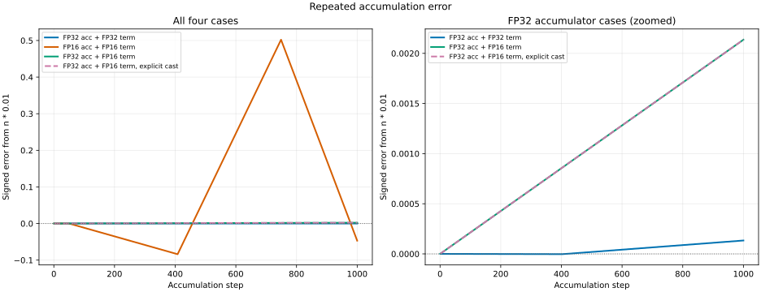

# Mixed-Precision Accumulation 实验报告

## 1. 原问题

Handout 的 [`mixed_precision_accumulation`](./cs336_assignment2_systems_extracted.md#L233-L260) 要求运行以下四种累加方式，并评论结果精度：

1. FP32 accumulator 累加 FP32 的 `0.01`；
2. FP16 accumulator 累加 FP16 的 `0.01`；
3. FP32 accumulator 直接累加 FP16 的 `0.01`；
4. FP16 的 `0.01` 显式转换成 FP32 后，再交给 FP32 accumulator。

数学上的准确结果是 $1000 \times 0.01 = 10$。

### 1.1 Handout 简答

FP32 累加 FP32 输入得到 `10.0001335`，误差很小；纯 FP16 累加得到 `9.953125`，因为每一步都将部分和舍入到 FP16，累计误差明显放大。FP32 accumulator 累加 FP16 输入的隐式和显式转换结果相同，均为 `10.0021362`：高精度 accumulator 消除了反复 FP16 舍入造成的大部分误差，但无法恢复 `0.01` 在转换成 FP16 时已经丢失的精度。

## 2. 实验实现

可重复运行的脚本是 [`scripts/mixed_precision_accumulation.py`](../scripts/mixed_precision_accumulation.py)。

四组配置定义见 [`L33-L55`](../scripts/mixed_precision_accumulation.py#L33-L55)，统一的累加与误差计算见 [`L58-L85`](../scripts/mixed_precision_accumulation.py#L58-L85)。脚本严格执行 1000 次顺序加法，并额外记录：

- `0.01` 转成对应 dtype 后的实际存储值；
- 最终结果；
- 相对数学结果 10 的有符号误差；
- 相对误差；
- 最终结果附近的 ULP；
- 每一步的累计误差，用于绘制误差曲线。

运行命令：

```bash
uv run python scripts/mixed_precision_accumulation.py \
  --output-svg notes/assets/mixed_precision_accumulation/accumulation_error.svg
```

实验环境：

| 项目 | 值 |
|---|---|
| 日期 | 2026-09-26 |
| PyTorch | `2.11.0+cu130` |
| 执行设备 | CPU |
| 累加次数 | 1000 |
| 数学增量 | 0.01 |
| 数学准确结果 | 10 |

本实验研究的是浮点表示和顺序累加误差，不是 GPU 吞吐，因此使用 CPU 已足够。不同设备或 kernel 若改变归约顺序，末位结果可能不同，但本实验揭示的精度规律不变。

## 3. 实验结果

| 编号 | Accumulator | 输入增量 | 显式转换 | 最终结果 | 有符号误差 | 相对误差 |
|---|---|---|---|---:|---:|---:|
| 1 | FP32 | FP32 | 否 | 10.000133514404297 | +0.000133514404297 | +0.00133514% |
| 2 | FP16 | FP16 | 否 | 9.953125 | -0.046875 | -0.46875% |
| 3 | FP32 | FP16 | 否 | 10.00213623046875 | +0.00213623046875 | +0.0213623% |
| 4 | FP32 | FP16 | 是，先转 FP32 | 10.00213623046875 | +0.00213623046875 | +0.0213623% |

输入 `0.01` 的实际存储值和最终 ULP：

| dtype | `0.01` 的实际存储值 | 与数学 0.01 的差 | 最终结果附近的 ULP |
|---|---:|---:|---:|
| FP32 | 0.0099999997764825821 | -0.0000000002235174179 | 0.00000095367431640625 |
| FP16 | 0.01000213623046875 | +0.00000213623046875 | 0.0078125 |



左图展示全部四组结果。纯 FP16 曲线的误差量级远大于其他三组；右图放大 FP32 accumulator 的三条曲线，可以看到两种 FP16 输入路径完全重合，而 FP32 输入路径最接近 0。

## 4. 背景知识

### 4.1 十进制 `0.01` 无法被二进制浮点精确表示

有限位二进制浮点只能精确表示形如 $k \times 2^n$ 的有限精度数。十进制 `0.01` 的二进制展开无限循环，因此 FP32 和 FP16 都只能保存它附近的一个可表示值：

- FP32 保存为约 `0.0099999997764825821`；
- FP16 保存为约 `0.01000213623046875`。

FP16 的尾数位更少，因此它对 `0.01` 的初始量化误差更大。

### 4.2 输入量化误差与累加舍入误差是两件事

本实验同时涉及两类误差：

1. **输入量化误差**：创建 `torch.tensor(0.01, dtype=...)` 时，数学值 `0.01` 被舍入为该 dtype 能表示的邻近值。
2. **累加舍入误差**：每次执行 `s += x` 后，新的部分和还要再次舍入到 accumulator 的 dtype。

高精度 accumulator 只能显著减小第二类误差，不能恢复第一步已经丢失的信息。

### 4.3 ULP 是什么

ULP 是 Unit in the Last Place，可理解为某个数值附近相邻两个可表示浮点数之间的间隔。浮点数绝对值越大，指数越大，相邻可表示数之间的绝对间隔通常也越大。

最终 FP16 结果位于 `[8, 16)`，该区间的 FP16 ULP 是 `0.0078125`。增量的实际值约为 `0.0100021`，已经与一个 ULP 处于同一数量级，因此每次加法的舍入方向会显著影响累积结果。

FP32 最终结果附近的 ULP 约为 `9.5367e-7`，远小于 `0.01`，所以 FP32 accumulator 能更精细地保留每次增量。

### 4.4 浮点加法不满足结合律

数学实数满足 $(a+b)+c=a+(b+c)$，但浮点加法的每一步都可能舍入，因此一般不满足结合律。顺序执行 1000 次加法、使用并行树形归约、先分块累加再合并，可能得到略有不同的结果。

这也是为什么机器学习系统需要同时关心：

- 输入和权重使用什么 dtype；
- 乘法使用什么 dtype；
- accumulator 使用什么 dtype；
- reduction 采用什么顺序；
- 最终输出写回什么 dtype。

## 5. 四种情况逐项解释

### 5.1 FP32 accumulator + FP32 输入

结果：

```text
10.000133514404297
```

虽然每个 FP32 `0.01` 已经非常接近数学值，但并不完全相等；此外，1000 次顺序加法中的每个部分和都会舍入到 FP32。因此结果不是严格的 10，而是出现约 `1.335e-4` 的正误差。

这个误差只有约 `0.001335%`，在四组中最小。

### 5.2 FP16 accumulator + FP16 输入

结果：

```text
9.953125
```

这里同时存在：

- FP16 `0.01` 的输入量化误差；
- 1000 次部分和写回 FP16 的累加舍入误差。

纯 FP16 曲线不是单调偏离理想值。它在第 400 步的误差约为 `-0.08203125`，到第 750 步时部分和恰好达到 `8.0`，相对理想值 `7.5` 的误差变成 `+0.5`，最终又下降为 `-0.046875`。

这是因为 ULP 会随部分和所在指数区间改变：

- 部分和位于 `[4, 8)` 时，FP16 ULP 是 `0.00390625`，`0.0100021` 可能被舍入成三个 ULP，即有效增加 `0.01171875`，误差向正方向增长；
- 部分和进入 `[8, 16)` 后，FP16 ULP 变为 `0.0078125`，每次加法的有效增加量趋向一个 ULP，小于 `0.01`，误差又向负方向移动。

因此，不能用“FP16 保存的 `0.01` 乘以 1000”来预测纯 FP16 顺序累加结果，因为每一个中间部分和都发生了新的舍入。

### 5.3 FP32 accumulator + FP16 输入，隐式转换

结果：

```text
10.00213623046875
```

Accumulator `s` 是 FP32。执行：

```python
s += torch.tensor(0.01, dtype=torch.float16)
```

时，in-place addition 的目标 Tensor 仍必须保持 FP32，FP16 右操作数在计算中被转换为 FP32。所有 FP16 数值都能被 FP32 精确表示，所以转换后的增量精确等于：

```text
0.01000213623046875
```

使用 FP32 accumulator 后，中间部分和不再反复舍入到 FP16。最终误差几乎完全来自最初把数学 `0.01` 量化为 FP16：

`1000 × (0.01000213623046875 - 0.01) = 0.00213623046875`。

### 5.4 FP32 accumulator + FP16 输入，显式转换

结果与第三组完全相同：

```text
10.00213623046875
```

显式执行：

```python
x = torch.tensor(0.01, dtype=torch.float16)
s += x.type(torch.float32)
```

只是把第三组 addition 内部已经会做的转换写在了 Python 代码中。由于 `x` 在 `.type(torch.float32)` 之前已经量化为 FP16，转回 FP32 只能精确保存 FP16 值 `0.01000213623046875`，不能恢复数学上的 `0.01`。

这说明：

> 提升 dtype 可以防止后续计算继续丢失精度，但不能恢复此前低精度量化已经丢失的信息。

## 6. 为什么混合精度强调高精度 accumulator

矩阵乘中的一个输出元素本质上是许多乘积的和。数学上以列向量记线性层 $y=Wx$；其中每个 $y_i$ 都包含沿输入维度的归约。

混合精度 kernel 常采用类似策略：

1. 输入或权重以 FP16/BF16 存储和参与乘法；
2. 乘积被累加到更高精度 accumulator；
3. 最终结果按接口要求写回 FP16、BF16 或 FP32。

这与本实验第三、四组的思想一致：低精度输入仍然带有量化误差，但高精度 accumulator 避免每次更新部分和时重复发生大粒度舍入。

需要注意，PyTorch Tensor 的输入/输出 dtype 不能完全说明 GPU kernel 内部 accumulator 的实现。具体 GEMM 是否始终使用完整 FP32 累加，还取决于硬件、CUDA 库和 reduced-precision reduction 配置，详见 [autocast 文档的累加精度说明](./02_01_pytorch_autocast_mixed_precision_guide.md#34-算子-dtype-不等于硬件内部累加-dtype)。

## 7. 与 autocast 的关系

这个实验没有直接调用 `torch.autocast`，它演示的是 autocast 策略背后的数值动机：

- 大型 matmul/conv 可以使用低精度输入获得吞吐和带宽收益；
- 长 reduction、normalization、softmax 和部分 loss 对累加误差更敏感；
- 因此不能只用一个低精度 dtype 覆盖全部算子；
- autocast 按算子选择精度，自定义 kernel 则需要作者显式选择 accumulator dtype。

`GradScaler` 解决的是 FP16 梯度数值过小导致的下溢，不会改变本实验所展示的 accumulator 舍入精度问题。二者都与混合精度数值稳定性有关，但处理的是不同问题。

## 8. 复杂度与可并行性

### 8.1 当前实验

每组执行 1000 次标量加法。一般化到 $N$ 次：

- 时间复杂度：$O(N)$；
- 额外空间复杂度：$O(1)$；
- 数据依赖：第 $i$ 次加法依赖第 $i-1$ 次的部分和。

因此这段 Python 循环本身是一条严格的串行依赖链，不适合用于衡量 GPU 并行吞吐。

### 8.2 并行 reduction

真实模型通常使用并行树形归约，将 reduction 的依赖深度从线性链缩短。并行归约具有更高吞吐，但会改变加法顺序；由于浮点加法不满足结合律，它可能与当前顺序循环产生不同末位结果。

提高 accumulator 精度、使用分块 FP32 累加或补偿求和可以降低误差，但会带来不同程度的计算、寄存器或带宽成本。实际系统需要在吞吐、显存和数值稳定性之间权衡。

## 9. 结论

1. 纯 FP16 accumulator 的问题不只是输入 `0.01` 表示不准，更重要的是每一步部分和都被舍入到 FP16。
2. FP32 accumulator 将绝对误差从纯 FP16 的 `0.046875` 降到 `0.00213623`，约缩小 22 倍。
3. FP32 accumulator 不能恢复 FP16 输入已经丢失的精度，所以仍不如“FP32 输入 + FP32 accumulator”准确。
4. 隐式和显式 FP16-to-FP32 转换结果相同，说明关键因素是 accumulator dtype，而不是 cast 写在 Python 代码中还是由算子内部完成。
5. 这正是混合精度训练常保留高精度 reduction/accumulator 的原因。

## 10. 参考资料

1. [Assignment 2 handout: Mixed-Precision Accumulation](./cs336_assignment2_systems_extracted.md#L233-L260)
2. [PyTorch Numerical Accuracy](https://docs.pytorch.org/docs/stable/notes/numerical_accuracy.html)
3. [PyTorch `torch.finfo`](https://docs.pytorch.org/docs/stable/type_info.html#torch-finfo)
4. [02_01 PyTorch autocast 与混合精度训练详解](./02_01_pytorch_autocast_mixed_precision_guide.md)
