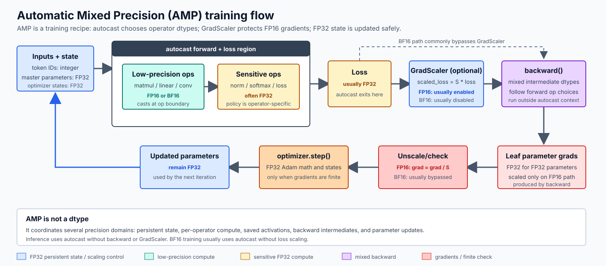
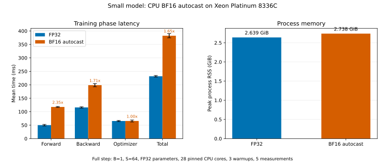
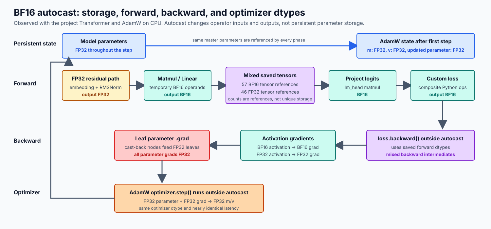

# Benchmarking Mixed Precision 实验报告

## 1. 原问题与本次范围

Handout 的 [`benchmarking_mixed_precision`](./cs336_assignment2_systems_extracted.md#L264-L301) 包含三部分：

1. 判断 CUDA FP16 autocast 下 ToyModel 的参数、Linear、LayerNorm、logits、loss 和梯度 dtype；
2. 解释 LayerNorm 为什么对低精度敏感，以及 BF16 是否仍需特殊处理；
3. 为 benchmark 增加 BF16 mixed precision，比较 FP32 与 BF16 的 forward/backward 时间。

根据本次实验约束，只使用本机和 `small` preset 学习机制，不运行 `medium`、`large`、`xl` 或 `10b`，也不连接 `cuda-via-a`。除 handout 要求的 forward/backward 外，本报告进一步测量 optimizer step，并观测参数、activation、saved tensors、参数梯度和 AdamW 状态的实际 dtype。

## 2. 本机环境

| 项目 | 值 |
|---|---|
| 主机 | `online1` |
| CPU | Intel Xeon Platinum 8336C，56 个可见物理核 |
| 实验绑核 | NUMA node 0 的 CPU `0-27`，共 28 核 |
| 物理内存 | 109 GiB |
| PyTorch | `2.11.0+cu130` |
| CPU backend | oneDNN 3.10.2、MKL、AVX-512 |
| CUDA | `torch.cuda.is_available() == False` |
| CPU autocast | 可用，默认低精度为 `torch.bfloat16` |
| 原生 BF16 指令 | CPU flags 中无 `avx512_bf16`、`amx_bf16` |

本机只能执行 CPU BF16 autocast。由于 CPU 没有原生 BF16/AMX 指令，这个实验适合学习 dtype 流、正确使用 autocast 和观察转换开销，但不代表支持 BF16 Tensor Core 或 AMX 的硬件性能。

## 3. 实现改动

### 3.1 参数存储 dtype 与计算 dtype 分离

原有 `--dtype` 会直接决定模型参数和 buffer 的存储 dtype。现在新增：

```text
--autocast-dtype none | bfloat16
```

两者含义严格分离：

```text
--dtype float32                 参数和 buffer 保持 FP32
--autocast-dtype bfloat16       forward/loss 按算子使用 BF16 或 FP32
```

Benchmark JSON 也新增 `autocast_dtype` 字段，避免把“全模型直接存成 BF16”误写成“混合精度”。

### 3.2 autocast 的边界

统一上下文由 [`_autocast_context`](../cs336_systems/benchmark.py#L128-L132) 创建。训练 step 的边界见 [`benchmark.py:L152-L193`](../cs336_systems/benchmark.py#L152-L193)：

1. `model.zero_grad(set_to_none=True)`；
2. forward 和 loss 位于同一个 autocast 上下文中；
3. 退出 autocast；
4. 执行 backward；
5. 若为 `full` mode，再执行 optimizer step。



本实验使用 `full` mode，因此会依次测量 forward、loss、backward 和 optimizer。`model.zero_grad(set_to_none=True)` 仍位于计时区间外，optimizer 时间只表示 `optimizer.step()`。

### 3.3 为什么 backward 不放进 autocast

代码在退出 `_autocast_context` 后才调用 [`loss.backward()`](../cs336_systems/benchmark.py#L177-L186)，这是有意的边界，而不是遗漏。PyTorch 官方建议 autocast 只覆盖 forward 和 loss，不建议用 autocast 上下文包住 backward。

Forward 执行时，autograd 已经建立计算图，并按实际执行路径保存 BF16、FP16 或 FP32 Tensor。Backward 会依据这些 forward 节点和 saved tensors 执行相应精度的反向 kernel，因此退出 autocast 并不会把整个 backward 自动恢复成 FP32：

```python
with torch.autocast(device_type=device.type, dtype=autocast_dtype):
    logits = model(input_ids)
    loss = cross_entropy(logits, targets)

# backward 仍会沿用 forward 建立的混合 dtype 路径
loss.backward()
```

例如，低精度 matmul 对应的 backward GEMM 通常继续使用低精度中间量；梯度经过 cast 的反向节点后，最终累加到 FP32 leaf parameter 的 `.grad` 中。因此常见结果是：

```text
backward intermediate dtype = mixed
parameter.dtype             = FP32
parameter.grad.dtype        = FP32
```

把 `loss.backward()` 放进 autocast 不会使 backward“统一且正确地变成低精度”。它反而可能让 backward 中新分派的算子再次套用 forward-oriented autocast policy，产生不必要或非预期的转换。

CUDA FP16 训练应在 autocast 外执行：

```python
scaler.scale(loss).backward()
scaler.step(optimizer)
scaler.update()
```

其中 `GradScaler` 负责防止 FP16 梯度下溢，它不要求 backward 位于 autocast 中。BF16 通常不需要 loss scaling，因此本实验直接在 autocast 外调用 `loss.backward()`。

### 3.4 约束

当启用 autocast 时，benchmark 强制模型参数使用 FP32，见 [`benchmark.py:L229-L237`](../cs336_systems/benchmark.py#L229-L237)。这可以阻止下面这种语义混淆：

```text
--dtype bfloat16 --autocast-dtype bfloat16
```

后者是低精度参数存储，不是本文测量的“FP32 参数 + BF16 compute”。

### 3.5 验证

新增测试验证 CPU BF16 autocast 能完成 forward/backward，并确认结果元数据同时记录：

```text
dtype=float32
autocast_dtype=bfloat16
```

对应测试见 [`test_benchmark.py:L44-L67`](../tests/test_benchmark.py#L44-L67)。

## 4. Part (a)：ToyModel 的 dtype

### 4.1 Handout 所问 CUDA FP16 路径

Handout 假设“CUDA GPU、参数原本为 FP32、autocast dtype 为 FP16”。根据 CUDA autocast 算子策略，答案是：

| 对象 | dtype | 原因 |
|---|---|---|
| autocast 内的模型参数本体 | FP32 | autocast 不修改参数存储 |
| `fc1` 输出 | FP16 | Linear 属于低精度计算算子 |
| LayerNorm 输出 | FP32 | CUDA FP16 autocast 将 LayerNorm 放在 FP32 策略中 |
| logits，即 `fc2` 输出 | FP16 | `fc2` 再次按 Linear 的低精度策略执行 |
| 内置 cross-entropy loss | FP32 | 内置 loss 使用 FP32 策略 |
| FP32 参数的 `.grad` | FP32 | 梯度最终累加到 FP32 leaf parameter |

因此，CUDA FP16 的直接答案为：

```text
parameters=FP32
fc1_output=FP16
layer_norm_output=FP32
logits=FP16
loss=FP32
parameter_gradients=FP32
```

### 4.2 本机 CPU BF16 实测

可重复运行脚本为 [`scripts/inspect_toy_autocast.py`](../scripts/inspect_toy_autocast.py)。它通过 forward hooks 记录三个模块的实际输出 dtype。

运行：

```bash
uv run python scripts/inspect_toy_autocast.py
```

结果：

```text
parameter_dtype_inside=torch.float32
fc1_output_dtype=torch.bfloat16
layer_norm_output_dtype=torch.bfloat16
logits_dtype=torch.bfloat16
builtin_cross_entropy_dtype=torch.float32
project_cross_entropy_dtype=torch.bfloat16
gradient_dtypes=['torch.float32']
```

CPU BF16 路径与 handout 的 CUDA FP16 路径并不完全相同：

- 本机 CPU autocast 下 LayerNorm 的**输出 Tensor**是 BF16；
- 内置 `torch.nn.functional.cross_entropy` 输出 FP32；
- 本项目由基础算子组合的自定义 `cross_entropy` 输出 BF16；
- 参数和最终参数梯度仍为 FP32。

这再次说明 autocast 策略同时依赖设备 backend 和真实 dispatcher operator。不能只凭 Python 函数名或 CUDA 经验推断 CPU 输出 dtype，也不能仅凭 LayerNorm 输出 dtype 推断其 kernel 内部 accumulator dtype。

## 5. Part (b)：LayerNorm 为什么敏感

### 5.1 直接回答

LayerNorm 需要计算均值、方差、中心化和倒平方根，其中 reduction 会累积舍入误差，平方可能溢出，而 `x-\mu` 还可能发生消减误差。BF16 具有与 FP32 相近的指数范围，因此比 FP16 更不容易溢出或下溢，但其尾数只有 7 位，所以均值和方差仍适合使用 FP32 accumulator；最终输出可以再转回 BF16。

### 5.2 计算过程

对一个包含 $d$ 个特征的列向量 $x$，LayerNorm 的核心计算为：均值 $\mu=\frac{1}{d}\sum_i x_i$，方差 $\sigma^2=\frac{1}{d}\sum_i(x_i-\mu)^2$，输出 $y_i=\gamma_i\frac{x_i-\mu}{\sqrt{\sigma^2+\epsilon}}+\beta_i$。

敏感位置包括：

1. **均值归约**：大量元素相加，每次舍入都会影响最终均值。
2. **中心化**：当 $x_i$ 与 $\mu$ 接近时，`x_i - mu` 可能发生有效位消减。
3. **平方与方差归约**：FP16 动态范围窄，较大值平方后更容易溢出。
4. **小方差与 epsilon**：低精度可能无法分辨很小的方差变化，或使 epsilon 的影响被舍入掉。
5. **倒平方根**：方差误差会通过非线性变换传播到所有归一化输出。

### 5.3 FP16 与 BF16 的差别

| dtype | 指数位 | 尾数位 | LayerNorm 主要风险 |
|---|---:|---:|---|
| FP16 | 5 | 10 | 动态范围窄，平方、求和易溢出，小值易下溢 |
| BF16 | 8 | 7 | 动态范围接近 FP32，但均值和方差的舍入误差仍较大 |
| FP32 | 8 | 23 | 更适合 reduction 和统计量累加 |

BF16 解决了 FP16 最严重的动态范围问题，但没有消除 reduction 对精度的需求。业界常见做法是低精度输入/输出配合 FP32 内部统计和 accumulator，而不是要求 LayerNorm 的所有中间量都永久存成 FP32。

## 6. Part (c)：small 模型实验

### 6.1 配置

| 配置项 | 值 |
|---|---|
| 模型 | `small` |
| 参数量 | 128,625,408 |
| mode | `full` |
| 参数 dtype | FP32 |
| 对照组 compute | FP32，无 autocast |
| 实验组 compute | CPU BF16 autocast |
| batch size | 1 |
| context length | 64 |
| CPU | 28 核，固定在 `0-27` |
| warmup | 3 steps |
| measurement | 5 steps |
| seed | 0 |

这里使用 `B=1,S=64` 是为了在本机快速、稳定地学习机制，不等同于前面的 `B=4,S=512` 大规模 CPU benchmark。两组只改变 autocast 设置，其余配置完全一致。

运行模板：

```bash
OMP_NUM_THREADS=28 \
MKL_NUM_THREADS=28 \
OMP_PROC_BIND=true \
OMP_PLACES=cores \
taskset -c 0-27 \
uv run python benchmark.py \
  --model-size small \
  --mode full \
  --device cpu \
  --dtype float32 \
  --autocast-dtype none \
  --batch-size 1 \
  --context-length 64 \
  --warmup-steps 3 \
  --measurement-steps 5 \
  --seed 0
```

BF16 组只需将：

```text
--autocast-dtype none
```

替换成：

```text
--autocast-dtype bfloat16
```

### 6.2 时间结果

| 阶段 | FP32 | BF16 autocast | BF16 / FP32 |
|---|---:|---:|---:|
| forward | 50.014 ± 2.773 ms | 117.658 ± 1.767 ms | 2.35× |
| loss | 0.416 ± 0.008 ms | 0.540 ± 0.046 ms | 1.30× |
| backward | 115.902 ± 2.295 ms | 198.598 ± 5.837 ms | 1.71× |
| optimizer | 65.387 ± 2.017 ms | 65.470 ± 3.632 ms | 1.00× |
| total | 231.760 ± 2.779 ms | 382.374 ± 7.748 ms | 1.65× |



Loss 本身不足 1 ms，在 total 中占比很低，其 1.30× 不应过度解读。Optimizer 在两组中几乎完全相同，因为它位于 autocast 外，并且两组都使用 FP32 参数、FP32 参数梯度以及 FP32 AdamW 状态。

### 6.3 Handout 简答

在本机 small 模型、`B=1,S=64` 下，FP32 的 forward/backward/optimizer 分别为 `50.014 ± 2.773 ms`、`115.902 ± 2.295 ms` 和 `65.387 ± 2.017 ms`，BF16 autocast 则为 `117.658 ± 1.767 ms`、`198.598 ± 5.837 ms` 和 `65.470 ± 3.632 ms`。BF16 使 forward 慢 2.35×、backward 慢 1.71×，但 optimizer 基本不变，完整 step 慢 1.65×；原因是本机没有原生 BF16/AMX 指令，而 optimizer 两组都沿用 FP32 训练状态。

## 7. 梯度与 optimizer 状态实验

### 7.1 观测方法

[`scripts/inspect_amp_training_state.py`](../scripts/inspect_amp_training_state.py) 使用一个两层 tiny Transformer 分别执行 FP32 和 CPU BF16 autocast 的完整训练 step。它通过 forward hooks、`retain_grad()` 和 `saved_tensors_hooks` 在以下边界读取真实 dtype：

1. forward 前：参数、`.grad` 和 optimizer state；
2. forward 后：选定 activation、loss 和 autograd saved tensors；
3. backward 后：activation gradient 和 parameter `.grad`；
4. optimizer 后：AdamW `m/v`、参数 dtype 和参数更新。

该脚本是状态诊断工具，不参与性能计时，因为 hooks、`retain_grad()` 和日志都会改变运行开销。

运行：

```bash
uv run python scripts/inspect_amp_training_state.py
```



### 7.2 实测 dtype

| 阶段与对象 | FP32 组 | BF16 autocast 组 |
|---|---|---|
| 模型参数 | 21 个 FP32 | 21 个 FP32 |
| forward 前 `.grad` | 全部为 `None` | 全部为 `None` |
| optimizer state | 尚未创建 | 尚未创建 |
| embedding 输出 | FP32 | FP32 |
| 第一层 RMSNorm 输出 | FP32 | FP32 |
| 第一层 Q projection 输出 | FP32 | BF16 |
| logits | FP32 | BF16 |
| 项目自定义 loss | FP32 | BF16 |
| 保存的浮点 Tensor 引用 | 103 个 FP32 | 57 个 BF16、46 个 FP32 |
| Q projection activation gradient | FP32 | BF16 |
| logits gradient | FP32 | BF16 |
| 参数 `.grad` | 21 个 FP32 | 21 个 FP32 |
| optimizer step 后的 Tensor state | 42 个 FP32 | 42 个 FP32 |
| 更新后的参数 | FP32 | FP32 |

`saved_tensors_hooks` 统计的是 autograd 保存的 Tensor **引用次数**，不是去重后的物理 allocation 数量；表中计数用于证明保存内容确实是混合 dtype，不能直接当成峰值内存。

### 7.3 梯度从 BF16 activation 回到 FP32 参数

BF16 autocast 下的梯度路径可分为三层：

1. Linear/matmul 的 forward 输入和输出是 BF16，因此这些节点保存的部分 Tensor 和对应 activation gradient 也是 BF16。
2. Backward 在 autocast 上下文外执行，但会依据 forward graph 和 saved tensors 运行混合精度反向 kernel，不会统一切回 FP32。
3. FP32 参数在 forward 中经过 cast 节点得到临时 BF16 计算副本；反向经过该 cast 节点时，参数梯度被转换并累加到 FP32 leaf parameter 的 `.grad`。

因此，“activation gradient 是 BF16”和“parameter.grad 是 FP32”可以同时成立，它们位于计算图的不同位置。

### 7.4 AdamW 为什么保持 FP32

本项目 AdamW 在第一次 `optimizer.step()` 时执行：

```python
state["m"] = torch.zeros_like(p.data)
state["v"] = torch.zeros_like(p.data)
```

参数 `p.data` 保持 FP32，所以每个参数创建一个 FP32 `m` 和一个 FP32 `v`。Tiny 模型有 21 个参数 Tensor，因此状态观测得到 21 个 optimizer state entry 和 42 个 FP32 Tensor state。

Optimizer 随后读取：

```text
FP32 parameter + FP32 parameter.grad + FP32 m + FP32 v
```

并把更新写回 FP32 参数。Autocast 已经退出，不会改变这些 optimizer 运算，这解释了 full benchmark 中 optimizer 时间的比值只有 1.001×。

## 8. 为什么 BF16 在本机更慢

### 8.1 没有原生 BF16 计算单元

`lscpu` 显示该 CPU 有 AVX-512 和 VNNI，但没有：

```text
avx512_bf16
amx_bf16
avx512_fp16
```

因此不能像支持 BF16 的新 CPU 或 Tensor Core GPU 那样直接获得低精度矩阵乘吞吐。oneDNN 仍可接受 BF16 Tensor，但转换、重排或模拟路径可能比成熟的 FP32 AVX-512 SGEMM 更慢。

### 8.2 FP32 参数仍然存在

标准 autocast 不会把模型参数本体永久转换成 BF16。每个低精度 matmul 仍需要从 FP32 参数得到 BF16 计算输入，因此会增加：

- FP32 到 BF16 转换；
- 临时 Tensor 分配；
- 额外内存读写；
- dispatcher 和 autocast policy 开销。

当前 `B=1,S=64` 的计算量较小，这些固定成本更难被大矩阵计算摊薄。

### 8.3 当前自定义 Linear 不利于 weight cache

本项目 Linear 实现为：

```python
return x @ self.weight.transpose(-2, -1)
```

传给 matmul 的权重是一个 transpose view，而 PyTorch autocast weight cache 主要缓存符合条件的 FP32 leaf parameter。这个实现可能无法像标准 `nn.Linear` 那样复用 leaf weight 的低精度缓存副本，进一步增加转换成本。

### 8.4 Backward 仍然是混合路径

退出 autocast 后，并不意味着 backward 全部恢复成 FP32。Backward 根据对应 forward 算子的 dtype 执行，最终再把参数梯度累积到 FP32 leaf parameter，因此会同时出现低精度 GEMM、FP32 梯度和 dtype 转换。

## 9. 内存结果

| 配置 | Peak RSS | 相对 FP32 |
|---|---:|---:|
| FP32 | 2.639 GiB | 1.000× |
| BF16 autocast | 2.738 GiB | 1.037× |

本次 BF16 autocast 没有降低进程峰值 RSS，反而增加约 3.7%。原因是：

- 参数仍为 FP32；
- 参数梯度仍为 FP32；
- Adam `m/v` 在两组中都是 FP32；
- BF16 计算会产生临时 cast 副本；
- `B=1,S=64` 的 activation 很小，activation 节省不足以抵消临时副本和 allocator 开销。

这不表示混合精度在所有硬件和模型上都增加内存。GPU、大 batch、长序列或 activation 占比更高时，BF16 activation 通常能带来更明显的显存收益。

## 10. 项目自定义 loss 的注意事项

ToyModel 脚本同时测量了内置和项目自定义 cross-entropy：

```text
builtin_cross_entropy_dtype=torch.float32
project_cross_entropy_dtype=torch.bfloat16
```

项目函数由 `max`、减法、`exp`、`sum`、`log`、`gather` 和 `mean` 等基础算子组合而成。Autocast 不会因为 Python 函数名叫 `cross_entropy` 就应用内置 fused cross-entropy 的完整 FP32 策略，而是分别处理内部算子。

本 benchmark 当前把自定义 loss 放在 autocast 上下文中，因此 CPU BF16 组的 loss 输出是 BF16。若目标从“性能实验”转为“稳定训练”，应单独评估将该 loss 整体放入 `autocast(enabled=False)` 并显式转换 logits 到 FP32。

## 11. 复杂度与可并行性

对 $L$ 层 Transformer，忽略常数后，主要计算量来自投影/FFN 的 $O(BLSd^2+BLSdd_{ff})$ 和 attention 的 $O(BLS^2d)$。Autocast 不改变渐近复杂度，但会增加与被转换 Tensor 元素数线性相关的 cast 和内存流量。

矩阵乘、逐元素转换和 reduction 都可以在 CPU 核之间并行。本实验将 OpenMP/MKL 固定为 28 线程并绑定单个 NUMA 节点，避免 50 线程跨 NUMA 时观察到的 `90–1300 ms` forward 大幅抖动。

可并行性不能弥补硬件指令缺失：如果 BF16 最终需要转换或由较慢路径实现，增加线程只能并行化这条低效路径，无法产生原生 BF16 单元的吞吐。

## 12. 实验限制

1. 本次只运行 small 模型，不能回答 handout 原本要求的跨模型规模趋势。
2. 本次是 CPU BF16，不是 CUDA BF16/FP16，不应外推到 Tensor Core GPU。
3. 使用 `B=1,S=64`，结果只用于机制学习和当前机器上的相对比较。
4. 使用 `full` mode 测量 optimizer step，但没有启用 gradient clipping 或学习率调度。
5. 峰值内存来自 `/usr/bin/time -v` 的进程 RSS，不是 CUDA allocator 显存指标。
6. 项目自定义 RMSNorm、softmax、cross-entropy 会影响 dtype 路径，结论不等同于全部使用 PyTorch fused operators 的模型。

## 13. 复现与产物

| 产物 | 路径 |
|---|---|
| Benchmark 实现 | [`cs336_systems/benchmark.py`](../cs336_systems/benchmark.py) |
| ToyModel dtype 检查 | [`scripts/inspect_toy_autocast.py`](../scripts/inspect_toy_autocast.py) |
| 训练状态 dtype 检查 | [`scripts/inspect_amp_training_state.py`](../scripts/inspect_amp_training_state.py) |
| 图表生成脚本 | [`scripts/plot_cpu_mixed_precision.py`](../scripts/plot_cpu_mixed_precision.py) |
| 原始 FP32 JSON | `benchmark_results/cpu_mixed_precision/small_full_fp32.json` |
| 原始 BF16 JSON | `benchmark_results/cpu_mixed_precision/small_full_bfloat16.json` |
| 峰值 RSS | `benchmark_results/cpu_mixed_precision/small_full_{fp32,bfloat16}.time` |
| 图表 | [`small_cpu_bfloat16_benchmark.svg`](./assets/mixed_precision_benchmark/small_cpu_bfloat16_benchmark.svg) |
| dtype 生命周期图 | [`training_state_dtype_lifecycle.svg`](./assets/mixed_precision_benchmark/training_state_dtype_lifecycle.svg) |

原始 benchmark 结果位于已被 Git 忽略的 `benchmark_results/`，图表和报告则保存在 `notes/` 下。

## 14. 参考资料

1. [Assignment 2 handout: Benchmarking Mixed Precision](./cs336_assignment2_systems_extracted.md#L264-L301)
2. [PyTorch Automatic Mixed Precision](https://docs.pytorch.org/docs/stable/amp.html)
3. [PyTorch CPU autocast operator reference](https://docs.pytorch.org/docs/stable/amp.html#cpu-op-specific-behavior)
4. [02_01 PyTorch autocast 与混合精度训练详解](./02_01_pytorch_autocast_mixed_precision_guide.md)
5. [02_02 Mixed-Precision Accumulation 实验报告](./02_02_mixed_precision_accumulation_report.md)
