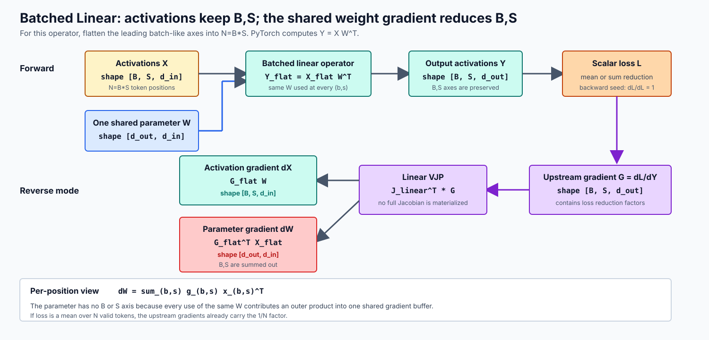
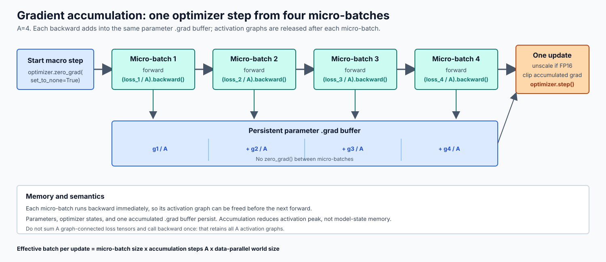
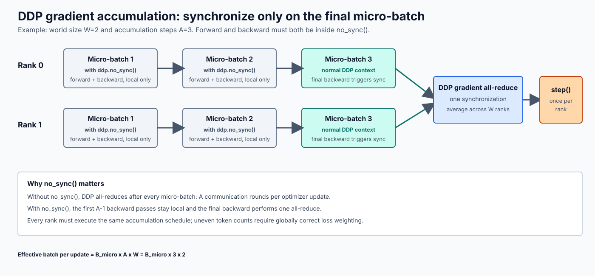

# PyTorch 梯度累积：数学等价、正确归一化与分布式实现

## 1. 问题与结论

梯度累积（gradient accumulation）把一个逻辑大 batch 拆成多个较小的 microbatch，依次执行 forward 和 backward，在若干次 backward 之后才执行一次参数更新。它主要用于降低单次 forward/backward 的激活显存峰值，也可以减少 DDP 中每个 optimizer update 对应的梯度同步次数。

先给出最重要的结论：

1. PyTorch 的 `backward()` 默认把新梯度**加到**叶子张量已有的 `.grad` 中，而不是覆盖它；这是梯度累积成立的直接机制。[1][2]
2. 一个累积窗口只应在开始前清一次梯度，并在窗口结束时执行一次 `optimizer.step()`；每个 microbatch 都 `zero_grad()` 会破坏累积，每个 microbatch 都 `step()` 则已经变成多次小 batch 更新。
3. 若每个 microbatch 大小相同，loss 使用 `reduction="mean"`，并且一个窗口有 $A$ 个 microbatch，则每次 backward 前通常要除以 $A$。
4. 若 microbatch 的有效样本数或有效 token 数不同，不能简单地让每个 microbatch mean 再除以 $A$。正确目标是“所有有效元素的 loss 总和除以所有有效权重的总和”。
5. 梯度裁剪应对**完整、已正确归一化的累积梯度**执行一次；AMP 下还必须先 `scaler.unscale_(optimizer)`，再裁剪。[5][6]
6. AMP 累积窗口内，梯度必须始终保持同一个 scale。`unscale_`、`scaler.step()` 和 `scaler.update()` 都只能在完整有效 batch 的边界执行。[5]
7. DDP 下每个 rank 的 batch 仍是本地 batch。若 world size 为 $W$，每个 rank 每个 microbatch 有 $B_\text{micro}$ 个样本，累积步数为 $A$，则等长情况下全局有效 batch size 是 $B_\text{eff}=WAB_\text{micro}$。[5][7]
8. DDP 的 `no_sync()` 必须同时包住 forward 和 backward；只包 backward 不会关闭该次梯度同步。[7]
9. 梯度累积只在一组条件下与真实大 batch 数学等价。BatchNorm、batch 内交互型 loss、随机算子、浮点求和顺序以及 optimizer update 次数都可能破坏严格等价。
10. 梯度累积主要减少 activation 峰值，不会按累积步数等比例减少参数、梯度和 optimizer state 的内存。

术语上，本文讨论的是**跨多个 microbatch 的参数梯度累积**。它不同于 [Mixed-Precision Accumulation](./02_02_mixed_precision_accumulation_report.md) 中“一个算子内部用高精度 accumulator 累加乘积”的数值问题，也不同于 Adam 在 optimizer state 中维护一阶、二阶矩；三者都使用“累积”一词，但发生位置和生命周期完全不同。

本文以 PyTorch 2.11 官方文档为固定参考版本。文末只列 PyTorch 官方文档和官方源码链接。

## 2. 记号与执行模型

数学上把参数展平后记为列向量 $\theta\in\mathbb{R}^{P}$，其梯度 $\nabla_\theta L$ 也按列向量理解。代码中的参数仍保持 PyTorch 模块自身的张量布局；若涉及线性层，数学上采用列向量写法 $y=Wx$，而 PyTorch 输入通常把特征放在最后一维，对应实现为 $y=xW^\top$。数学记号与框架张量布局是两个层面。

本文使用以下记号：

| 符号 | 含义 |
|---|---|
| $A$ | 每个 optimizer update 累积的 microbatch 数 |
| $B_\text{micro}$ | 单个 rank 上一个等长 microbatch 的样本数 |
| $W$ | DDP world size |
| $B_\text{eff}$ | 一次 optimizer update 覆盖的全局有效样本数 |
| $D_k$ | 第 $k$ 个 microbatch 的有效 loss 权重总量，例如有效 token 数 |
| $S_k$ | 第 $k$ 个 microbatch 的未归一化 loss 总和 |
| $P$ | 参数数量 |

### 2.1 参数只有一套，为什么 batch 中每个样本都能产生梯度

模型参数是共享的。以一个无 bias 线性层为例，数学上使用列向量记法：

$$y_{b,s}=Wx_{b,s}$$

$W\in\mathbb{R}^{d_\text{out}\times d_\text{in}}$ 只有一份；$x_{b,s}$ 和 $y_{b,s}$ 则分别属于 batch 中第 $b$ 个样本、第 $s$ 个序列位置。相同的 $W$ 被所有 $(b,s)$ 位置重复使用，但并没有为每个位置复制一套独立参数。

在 PyTorch 中，输入特征位于最后一维：

```text
X.shape = (B, S, d_in)
W.shape = (d_out, d_in)
Y.shape = (B, S, d_out)
Y = X @ W.T
```

从 Linear 这个局部算子的角度，`B` 和 `S` 都是前导的 batch-like dimensions。可以临时把它们展平为 $N=B S$：

```text
X_flat.shape = (N, d_in)
Y_flat.shape = (N, d_out)
```

这不表示 sequence 在整个 Transformer 中等同于独立 batch。Linear、RMSNorm 等 token-wise 算子会逐位置使用共享参数；self-attention 则显式耦合不同 sequence positions。所谓“把 sequence 看成广义 batch 维”，只适用于分析某个对前导维度逐元素或逐位置应用的算子。

核心答案是：

> Activation 和 activation gradient 保留 `B`、`S` 等前导维度；共享参数的梯度则把该参数在所有样本、所有 token 位置和所有计算路径上的贡献求和，因而最终形状只与参数自身相同。

例如 `B=2,S=3` 时有 6 个 token activation 使用同一个 $W$。Backward 会得到 6 份对 $W$ 的局部贡献，并把它们汇总进唯一的 `W.grad`。

### 2.2 上游梯度是什么

对计算图中的某个中间量 $y$，上游梯度通常记为：

$$\bar y=\frac{\partial L}{\partial y}$$

这里“上游”是相对 backward 的传播方向而言：它是从最终标量 loss 一侧传回当前算子输出的梯度。它与 $y$ 形状相同，而不是参数形状。

Reverse-mode autograd 从标量 loss 开始。因为 $\frac{\partial L}{\partial L}=1$，backward 的初始种子是标量 1；随后每个算子接收对自己输出的上游梯度，再根据局部导数计算对各输入和参数的梯度。

这也解释了 `Tensor.backward()` 的接口：标量 loss 可以直接调用 `loss.backward()`，因为初始上游梯度就是 1；若输出 Tensor 不是标量，则必须通过 `output.backward(gradient=v)` 显式提供与输出形状兼容的上游梯度 $v$，autograd 计算的正是该 $v$ 与 Jacobian 的 VJP。[1]

如果一个 Tensor 在 forward 中流向多个后续分支，则 backward 从这些分支返回的贡献会在该 Tensor 处相加。共享参数在 batch 和 sequence 的许多位置被重复使用，本质上也是一种大规模 fan-out；反向时所有使用位置对该参数的贡献最终 fan-in 到同一个 `.grad`。

### 2.3 VJP：autograd 实际计算的对象

设一个算子为 $y=f(x,\theta)$，其中 $\theta$ 是参数。其完整 Jacobian $J_f$ 往往巨大，PyTorch 不会先显式构造它。

Backward 已经拿到上游梯度 $\bar y=\partial L/\partial y$，真正需要的是 Jacobian-transpose-vector product，也就是 VJP：

$$\bar x=J_{f,x}^{\top}\bar y,\qquad \bar\theta=J_{f,\theta}^{\top}\bar y$$

VJP 同时回答两个问题：

- `grad_input`：当前算子应该向更早的 activation 传播什么梯度；
- `grad_parameter`：当前算子此次使用参数产生了多少梯度贡献。

Autograd 为每种算子实现 VJP 规则，直接计算这些乘积，避免存储完整 Jacobian。对标量 loss，reverse mode 可以用一次反向遍历得到所有参数的梯度，这也是深度学习训练使用反向模式自动微分的原因；PyTorch 也通过 `torch.func.vjp` 直接暴露了“返回函数输出和 VJP 函数”的接口。[18]

### 2.4 Batched Linear 的 VJP

令 $\delta_{b,s}=\partial L/\partial y_{b,s}$ 表示 Linear 输出位置 $(b,s)$ 收到的上游梯度。对单个位置，Linear 的局部 VJP 为：

$$\frac{\partial L}{\partial x_{b,s}}=W^\top\delta_{b,s},\qquad \left.\frac{\partial L}{\partial W}\right|_{b,s}=\delta_{b,s}x_{b,s}^\top$$

因为所有位置共享同一个 $W$，完整参数梯度必须汇总所有位置：

$$\frac{\partial L}{\partial W}=\sum_{b=1}^{B}\sum_{s=1}^{S}\delta_{b,s}x_{b,s}^\top$$

若存在 bias，则 $\partial L/\partial b_\text{bias}=\sum_{b,s}\delta_{b,s}$，同样要约掉所有前导维度。

一个最小数值例子可以直接看出这种汇总。令 $d_\text{in}=2,d_\text{out}=1$，四个位置的输入分别为 $x_{1,1}=(1,0)^\top$、$x_{1,2}=(0,1)^\top$、$x_{2,1}=(1,1)^\top$、$x_{2,2}=(2,-1)^\top$，对应上游梯度为 $1,2,3,4$，则唯一的共享权重梯度是：

$$\frac{\partial L}{\partial W}=1(1,0)+2(0,1)+3(1,1)+4(2,-1)=(12,1)$$

四个位置没有生成四个长期独立的 `W.grad`；它们的局部外积贡献被加进同一个形状为 `(1,2)` 的梯度张量。

在 PyTorch 的 feature-last 布局中，将 `B,S` 展平为 $N=B S$：

```text
X_flat.shape = (N, d_in)
G_flat.shape = (N, d_out)   # G_flat = dL / dY_flat

dX_flat = G_flat @ W
dW      = G_flat.T @ X_flat
```

因此：

```text
dX.shape = (B, S, d_in)       # activation gradient 保留 B、S
dW.shape = (d_out, d_in)      # parameter gradient 对 B、S 求和
```



PyTorch 通常用 batched/vectorized kernel 一次完成这些计算，并不会真的写两层 Python 循环。但矩阵公式 `G_flat.T @ X_flat` 精确表达了“每个位置贡献一个外积，再沿所有前导位置求和”。

### 2.5 Loss reduction 如何进入上游梯度

Batch size 并不是在 parameter-gradient 公式末尾由 autograd 随意决定“求和还是平均”。求和或平均来自 loss 的定义，并已经包含在上游梯度 $\delta_{b,s}$ 中。

语言模型 logits 的形状通常是 `(B,S,V)`。若对 $N=B S$ 个 token 使用 mean cross-entropy：

$$L=\frac{1}{N}\sum_{b,s}\ell_{b,s}$$

则每个位置 logits 的上游梯度都包含 $1/N$：

$$\frac{\partial L}{\partial z_{b,s}}=\frac{1}{N}\left(p_{b,s}-\operatorname{onehot}(t_{b,s})\right)$$

LM head 数学上为 $z_{b,s}=W_\text{head}h_{b,s}$，所以：

$$\frac{\partial L}{\partial W_\text{head}}=\sum_{b,s}\frac{\partial L}{\partial z_{b,s}}h_{b,s}^\top$$

这里公式外层是“求和”，但每个上游梯度内部已有 $1/N$，最终整体效果就是对 token contributions 求平均。若 loss 使用 `reduction="sum"`，上游梯度中没有 $1/N$，参数梯度自然也会大 $N$ 倍。

有 padding 或 `ignore_index` 时，$N$ 应是有效 token 数，而不是简单的 $B S$。若先对每条 sequence 求 mean，再对 batch 求 mean，则每条 sequence 获得相同权重；若对全部有效 token 求 mean，则长 sequence 权重更大。两种目标不同，必须先明确训练目标。

### 2.6 Attention 为什么不妨碍参数贡献求和

Self-attention 会让某个 token 的输出依赖多个 token，因此 $\delta_{b,s}$ 已经包含来自其他 sequence positions 的间接影响。不能把整个 Transformer 的 token 看成彼此独立的样本。

但 Q/K/V projection 等 Linear 仍在每个位置使用同一套权重。Autograd 先沿 attention 图通过一系列 VJP 算出每个 projection 输出的上游梯度，再由 Linear VJP 对所有 $(b,s)$ 的参数贡献求和。跨 token 依赖改变的是 $\delta_{b,s}$ 的数值，不改变共享参数梯度必须沿所有使用位置汇总这一事实。

### 2.7 这如何导出 microbatch 梯度累积

假设把一个大 batch 沿 batch 维拆成 $A$ 个 microbatch。大 batch Linear 的输入和上游梯度可以按行分块：

```text
X_flat = concat(X_1, X_2, ..., X_A)
G_flat = concat(G_1, G_2, ..., G_A)
```

利用矩阵乘对行分块的可加性：

$$G_\text{flat}^\top X_\text{flat}=\sum_{k=1}^{A}G_k^\top X_k$$

右侧每一项正是一个 microbatch backward 对共享参数产生的局部梯度。PyTorch 每次 `backward()` 都把该项加进同一个 parameter `.grad`，所以多个 microbatch 可以重建大 batch 的参数梯度。

唯一必须额外处理的是 loss reduction：

- 大 batch 目标为 sum 时，直接累加各 microbatch sum-gradient；
- 等长 microbatch 且目标为 mean 时，每个 microbatch mean-loss 要除以 $A$；
- 有效样本或 token 数不同时，要按真实分母加权。

这就是后文所有梯度累积规则的数学起点，而不只是“PyTorch 恰好没有自动清空 `.grad`”。

标准 gradient accumulation 通常只拆 batch 维。不能直接把 sequence 维切成若干独立短序列并期待等价，因为 self-attention、位置编码和跨 token loss 可能依赖完整上下文；只有在使用正确的 KV/state 传递、sequence parallel 或专门的长序列分块算法时，sequence 切分才有独立的等价性分析。

### 2.8 从单次 backward 到累积窗口

一次完整的累积窗口应被视为一个 **optimizer update**：

```text
zero_grad
    microbatch 1: forward -> backward -> 累积到 .grad
    microbatch 2: forward -> backward -> 累积到 .grad
    ...
    microbatch A: forward -> backward -> 累积到 .grad
可选：归一化梯度
可选：unscale
可选：gradient clipping
optimizer step
scheduler step
进入下一窗口
```



## 3. `.grad` 的累积语义

### 3.1 `backward()` 是加法，不是赋值

PyTorch 官方 `Tensor.backward()` 和 `torch.autograd.backward()` 文档都明确说明：反向传播会把梯度累积到图中叶子张量的 `.grad` 属性，因此调用前可能需要把 `.grad` 清零或设为 `None`。[1][2]

设参数当前已有梯度 $g_\text{old}$，本次 backward 产生梯度 $g_\text{new}$。在常见的 `create_graph=False` 情况下，结果可理解为：

$$\theta.\mathrm{grad}\leftarrow g_\text{old}+g_\text{new}$$

第一次 backward 前若 `param.grad is None`，autograd 会创建梯度张量；后续 backward 会原地累加到已有的非稀疏 `.grad`。官方 default gradient layouts 文档还说明，这种“先为 `None`，首次 backward 时创建，之后原地累加”的方式是推荐的默认行为。[3]

一个最小示例：

```python
optimizer.zero_grad(set_to_none=True)

loss_1 = loss_fn(model(x_1), y_1)
loss_1.backward()
grad_after_1 = model.weight.grad.clone()

loss_2 = loss_fn(model(x_2), y_2)
loss_2.backward()
grad_after_2 = model.weight.grad

# 除浮点舍入差异外：
# grad_after_2 == grad_after_1 + grad(loss_2)
```

这里累积的是**参数梯度张量**，不是把多个计算图永久连接起来。若每个 microbatch 都立刻调用一次 `backward()`，且没有使用 `retain_graph=True`，本次 backward 使用的图会按默认行为释放。[1][2] 因而常规梯度累积的峰值 activation 内存通常接近一个 microbatch，而不是 $A$ 个 microbatch 的总和。

相反，下面的写法会让多个 forward 的计算图一直存活到最后一次 backward，通常失去梯度累积的主要内存优势：

```python
# 不推荐：total_loss 引用所有 microbatch 的计算图
total_loss = 0.0
for inputs, targets in microbatches:
    total_loss = total_loss + loss_fn(model(inputs), targets)

(total_loss / len(microbatches)).backward()
```

正确思路是每个 microbatch 立即 backward，只让 `.grad` 跨 microbatch 存活。

### 3.2 `zero_grad(set_to_none=True)` 与清零

`optimizer.zero_grad(set_to_none=True)` 的默认行为是把梯度设为 `None`，而不是给已有梯度张量填 0。官方 API 给出的影响包括：[4]

- 通常内存占用更低，并可能略微提高性能；
- backward 后仍为 `None` 的参数表示它没有收到梯度；
- optimizer 对 `grad is None` 和全 0 梯度的处理不同：前者会跳过该参数，后者会以 0 梯度执行该参数的 step。

这一区别在存在条件分支、稀疏激活参数或 weight decay 时尤其值得注意。梯度累积并不要求必须使用 `set_to_none=True`，但通常可把它作为默认选择。

清梯度有两种等价的窗口放置方式：

```python
# 方式一：窗口开始前清理
for window in windows:
    optimizer.zero_grad(set_to_none=True)
    for microbatch in window:
        ...
        loss.backward()
    optimizer.step()
```

```python
# 方式二：首次进入循环前清理，step 后立即清理
optimizer.zero_grad(set_to_none=True)
for microbatch in dataloader:
    ...
    loss.backward()
    if update_boundary:
        optimizer.step()
        optimizer.zero_grad(set_to_none=True)
```

关键不在于 `zero_grad()` 写在 `step()` 前还是后，而在于：

- 第一个 microbatch 前 `.grad` 必须为空；
- 同一累积窗口内不能清理；
- 下一个窗口不能继承上一个窗口的梯度。

## 4. 何时与真实大 batch 数学等价

### 4.1 等长 microbatch 与 mean loss

设一个逻辑大 batch 被分成 $A$ 个等长 microbatch，每个包含 $B$ 个样本。单样本 loss 为 $\ell(\theta;z_{k,j})$，真实大 batch 的 mean loss 是：

$$L_\text{large}(\theta)=\frac{1}{AB}\sum_{k=1}^{A}\sum_{j=1}^{B}\ell(\theta;z_{k,j})$$

第 $k$ 个 microbatch 的 mean loss 是 $L_k(\theta)=\frac{1}{B}\sum_{j=1}^{B}\ell(\theta;z_{k,j})$，所以：

$$\nabla_\theta L_\text{large}(\theta)=\sum_{k=1}^{A}\nabla_\theta\frac{L_k(\theta)}{A}$$

因此，每个 microbatch 执行：

```python
loss = criterion(outputs, targets)  # reduction="mean"
(loss / accum_steps).backward()
```

并且在整个窗口中保持参数 $\theta$ 不变，累积结束后 `.grad` 就对应大 batch mean loss 的梯度，忽略浮点求和顺序造成的末位差异。

如果忘记除以 $A$，得到的是大 batch mean 梯度的 $A$ 倍。对无 momentum、无 weight decay 的普通 SGD，可以通过同步缩小学习率得到某种代数补偿；但对 Adam/AdamW、momentum、梯度裁剪、weight decay 和动态 loss scaling，这不是普适等价方案。应直接把梯度归一化正确。

### 4.2 使用 sum loss

若目标本来就是对大 batch 求和，则每个 microbatch 使用 `reduction="sum"` 并直接 backward 即可：

$$\nabla_\theta L_\text{sum}(\theta)=\sum_{k=1}^{A}\nabla_\theta S_k(\theta)$$

但多数训练配置的目标是按样本或 token 求 mean。此时需要再除以全窗口的有效元素总数。

### 4.3 数学等价所需条件

梯度累积与一次真实大 batch forward/backward 等价，需要至少满足：

1. 累积窗口内不更新参数，所有 microbatch 都在同一个 $\theta$ 上计算。
2. microbatch loss 的权重与大 batch reduction 完全一致。
3. 模型和 loss 对 batch 中不同样本是可分解的，或拆分后仍保留同样的跨样本计算。
4. 模型没有因 microbatch 边界而改变的训练态统计或其他副作用。
5. 只在窗口末执行一次 gradient clipping、optimizer step 和按 update 定义的 scheduler step。
6. 随机数使用方式相同，且底层算子和 reduction 顺序允许所需的数值容差。

满足前五项通常只能保证数学目标一致；浮点数加法顺序不同，仍不保证逐 bit 相同。

## 5. Loss 归一化

### 5.1 固定大小 microbatch

当以下条件同时成立时，`loss / A` 是正确方案：

- 每个 microbatch 有相同数量的有效训练元素；
- criterion 返回这些元素的算术平均；
- 最后一个累积窗口也是完整的，或单独用它实际包含的 microbatch 数归一化；
- DDP 各 rank 的有效元素数相同。

基础实现如下。这里假设 `dataloader` 有长度，并正确处理最后不足 $A$ 个 microbatch 的窗口：

```python
accum_steps = 8
num_microbatches = len(dataloader)
optimizer.zero_grad(set_to_none=True)

for micro_idx, (inputs, targets) in enumerate(dataloader):
    window_start = (micro_idx // accum_steps) * accum_steps
    window_size = min(accum_steps, num_microbatches - window_start)
    is_update_boundary = (micro_idx - window_start + 1) == window_size

    outputs = model(inputs)
    loss = criterion(outputs, targets) / window_size
    loss.backward()

    if is_update_boundary:
        torch.nn.utils.clip_grad_norm_(model.parameters(), max_norm)
        optimizer.step()
        if scheduler is not None:
            scheduler.step()
        optimizer.zero_grad(set_to_none=True)
```

若 dataloader 长度不能预先获得，应显式按窗口分组，或跟踪最后窗口的真实分母。不要在最后仅有 $r<A$ 个 microbatch 时仍除以 $A$，否则最后一次更新会被缩小为正确值的 $r/A$。

### 5.2 不等长 microbatch

设第 $k$ 个 microbatch 包含 $D_k$ 个等权有效元素，其 loss 总和为 $S_k$。真实大 batch mean 是：

$$L_\text{large}=\frac{\sum_{k=1}^{A}S_k}{\sum_{k=1}^{A}D_k}$$

如果 criterion 返回每个 microbatch 的 mean $\bar L_k=S_k/D_k$，正确组合是：

$$L_\text{large}=\sum_{k=1}^{A}\frac{D_k}{\sum_jD_j}\bar L_k$$

而简单计算 $\frac{1}{A}\sum_k\bar L_k$ 会让每个 microbatch 权重相同，使小 microbatch 中的每个元素获得更大的权重。

例如两个 microbatch 分别有 2 和 8 个有效样本。两个 microbatch mean 各占一半，等价于前 2 个样本合计占 50% 权重、后 8 个样本也只占 50%；真实的 10 样本 mean 应让它们分别占 20% 和 80%。

### 5.3 变长序列与 token loss

语言模型常见的 `ignore_index` 会让 padding token 不参与 loss。PyTorch `CrossEntropyLoss` 官方文档说明：

- `reduction="sum"` 返回未归一化 loss 之和；
- `reduction="mean"` 对未忽略目标取加权平均；
- 使用类别权重时，mean 的分母不是简单的 token 数，而是未忽略目标对应类别权重的总和。[10]

因此，变长序列中“每个 microbatch 的 token mean 再除以 $A$”一般不等价于整个大 batch 的 token mean。稳妥策略是：

1. 每个 microbatch 使用 `reduction="sum"` 得到分子 $S_k$；
2. backward 累积未归一化梯度；
3. 统计整个窗口的正确分母 $D=\sum_kD_k$；
4. 在 optimizer step 前把累积梯度统一乘以 $1/D$；
5. 然后再做 gradient clipping。

单进程、无 AMP 的核心形式：

```python
optimizer.zero_grad(set_to_none=True)
window_denominator = 0.0

for micro_idx, (logits, targets) in enumerate(microbatches):
    loss_sum = torch.nn.functional.cross_entropy(
        logits,
        targets,
        ignore_index=ignore_index,
        reduction="sum",
    )
    loss_sum.backward()
    window_denominator += (targets != ignore_index).sum().item()

for parameter in model.parameters():
    if parameter.grad is not None:
        parameter.grad.mul_(1.0 / window_denominator)

torch.nn.utils.clip_grad_norm_(model.parameters(), max_norm)
optimizer.step()
optimizer.zero_grad(set_to_none=True)
```

代码中的分母只适用于“无类别权重、每个有效 token 等权”的交叉熵。若使用 `weight=class_weight`，$D_k$ 应是有效目标对应 `class_weight` 的总和；若使用自定义 mask、每样本权重或其他 loss，必须让分母与该 loss 的正式 reduction 定义一致。

这种“先累积 sum 梯度，最后统一除分母”的方式还有一个优点：不需要在第一个 microbatch backward 前就知道后续 microbatch 的有效 token 数。

### 5.4 DDP 下全局 token 加权

DDP 对各 rank 的梯度执行 all-reduce，并按 world size 求平均。[7] 设 rank $r$ 的窗口 loss 分子为 $S_r$、有效权重为 $D_r$，全局目标应为：

$$L_\text{global}=\frac{\sum_{r=1}^{W}S_r}{D_\text{global}},\qquad D_\text{global}=\sum_{r=1}^{W}D_r$$

若各 rank 先累积 `loss_sum` 的梯度，DDP 同步后 `.grad` 是 $\frac{1}{W}\sum_r\nabla_\theta S_r$。因此同步、AMP unscale 之后，应把梯度乘以：

$$\frac{W}{D_\text{global}}$$

不能直接乘 $1/D_\text{global}$，否则会额外小 $W$ 倍。实现上可对本地 `window_denominator` 做一次 `dist.all_reduce(..., op=SUM)` 得到 $D_\text{global}$。

如果每个 rank 的有效元素数完全相同，则“各 rank 算本地 mean，再由 DDP 对 rank 求平均”恰好等于全局 mean。只要各 rank 的 token 数不同，rank mean 的简单平均就会错误地给每个 rank 相同权重。

## 6. `zero_grad`、`backward`、`step` 与 scheduler 的时序

### 6.1 每个 microbatch 执行的操作

每个 microbatch 应执行：

1. forward；
2. 计算带正确权重的 loss；
3. backward，把贡献累积进 `.grad`。

这些步骤之间不执行 `optimizer.step()`，因为 step 会修改参数，使后续 microbatch 在不同参数点计算梯度。

### 6.2 每个累积窗口执行的操作

窗口边界应执行：

1. 若使用 AMP，调用一次 `scaler.unscale_(optimizer)`；
2. 若采用“先 sum、后归一化”，此时统一缩放 `.grad`；
3. 对完整累积梯度执行一次 gradient clipping；
4. 调用一次 `optimizer.step()` 或 `scaler.step(optimizer)`；
5. AMP 下调用一次 `scaler.update()`；
6. 若 scheduler 以 optimizer update 为时间单位，在成功参数更新后调用一次 `scheduler.step()`；
7. 清理梯度，开始下一窗口。

PyTorch 官方 optimizer 文档把 `optimizer.step()` 定义为在梯度计算完成后更新参数；`LRScheduler.step()` 文档明确要求在 optimizer 的 `step()` 后调用。[8][9]

大多数按 step 设计的 warmup、cosine 或 linear scheduler，其“step”应解释为 optimizer update，而不是 dataloader microbatch。引入累积后若仍每个 microbatch 调一次 scheduler，学习率日程会加速 $A$ 倍。

按 epoch 或验证指标工作的 scheduler 仍应遵循它自己的语义。例如 `ReduceLROnPlateau` 通常在验证指标产生后调用，不能机械地套用每个 update 一次。

### 6.3 optimizer step 次数决定优化轨迹

SGD with momentum 和 AdamW 的官方算法都在每次 optimizer step 时更新内部状态；AdamW 还在 step 中执行 decoupled weight decay。[11][12] 所以：

- “累积 $A$ 次 backward，再 step 一次”只有一次 momentum/Adam 状态更新和一次 weight decay；
- “每个 microbatch 都 step”有 $A$ 次参数变化、$A$ 次状态更新和 $A$ 次 weight decay；
- 即使两者处理相同样本，也不是同一个优化过程。

### 6.4 如何改造 Assignment 1 的训练循环

Assignment 1 当前训练循环在每个 `it` 内执行一次 `get_batch → forward → zero_grad → backward → clip → step`，见 [`train.py:L160-L180`](../../assignment1-basics/cs336_basics/train.py#L160-L180)。这等价于 `accum_steps=1`。

引入固定大小梯度累积后，外层 `it` 应表示 **optimizer update**，内层循环才表示 microbatch：

```python
accum_steps = 8

for update_step in range(start_iter, args.total_iters):
    lr = get_lr_cosine_schedule(
        update_step,
        args.lr_max,
        args.lr_min,
        args.warmup_iters,
        args.cosine_iters,
    )
    for group in optimizer.param_groups:
        group["lr"] = lr

    optimizer.zero_grad(set_to_none=True)
    loss_for_log = torch.zeros(
        (),
        dtype=torch.float32,
        device=args.device,
    )

    for _micro_step in range(accum_steps):
        x, y = get_batch(
            train_data,
            args.batch_size,
            args.context_length,
            args.device,
        )
        logits = model(x)
        micro_loss = cross_entropy(
            logits.view(-1, logits.size(-1)),
            y.view(-1),
        )
        (micro_loss / accum_steps).backward()
        loss_for_log += micro_loss.detach()

    if args.grad_clip > 0:
        gradient_clipping(model.parameters(), args.grad_clip)
    optimizer.step()

    mean_loss_for_log = (loss_for_log / accum_steps).item()
```

这段改造有四个容易忽略的语义变化：

1. `optimizer.zero_grad()` 从单 batch 内部移动到整个累积窗口开始处。
2. `optimizer.step()`、梯度裁剪和学习率更新每个窗口只发生一次。
3. 日志应记录未除以 `accum_steps` 的 `micro_loss` 的平均值，而不是被缩小后的 backward loss。
4. `total_iters` 现在表示 optimizer update 数；若保持它不变，总训练 token 数会扩大 $A$ 倍。若目标是保持原 token budget，需要相应减少 update 数，或直接按累计 token 数驱动训练停止、日志与学习率日程。

Checkpoint 最好只在累积窗口边界保存。若必须在窗口中间保存并实现逐 bit 恢复，就还要序列化当前 micro-step、尚未 step 的 `.grad`、AMP scale 以及数据迭代位置，复杂度明显更高。

## 7. Gradient Clipping

`torch.nn.utils.clip_grad_norm_()` 先把所有参数梯度的范数视为一个拼接向量的范数，再原地修改梯度。[6] 由于 clipping 是非线性变换，必须在完整累积梯度形成后执行一次：

$$\operatorname{clip}\left(\sum_k g_k\right)\neq\sum_k\operatorname{clip}(g_k)$$

正确顺序是：

```python
loss.backward()  # 对多个 microbatch 重复

if update_boundary:
    torch.nn.utils.clip_grad_norm_(model.parameters(), max_norm)
    optimizer.step()
    optimizer.zero_grad(set_to_none=True)
```

若使用“先 sum、后统一除分母”，归一化也应先于 clipping：

```text
完整累积 -> 正确归一化 -> clipping -> optimizer step
```

否则 clipping 阈值作用在错误尺度的梯度上。

AMP 下 `.grad` 在 `scaler.scale(loss).backward()` 后仍带 scale。官方 AMP 示例明确要求先 `scaler.unscale_(optimizer)`，再检查或裁剪 `.grad`；若直接裁剪 scaled gradients，实际阈值也被 scale 扭曲。[5]

FSDP 参数存在分片时，应使用 `FSDP.clip_grad_norm_()`，该 API 会处理跨 rank 的分片梯度范数；只有所有 FSDP 实例均为 `NO_SHARD` 时，普通 `torch.nn.utils.clip_grad_norm_()` 才与之等价。[13]

## 8. AMP 与 `GradScaler`

### 8.1 固定大小 microbatch 的完整模板

PyTorch 官方 AMP gradient accumulation 示例规定：[5]

- scale 必须按有效 batch 校准；
- 同一有效 batch 内的梯度保持 scaled；
- 累积期间 scale factor 必须保持不变；
- `unscale_` 只能在所有梯度累积完成后调用；
- `step()` 和 `update()` 只在有效 batch 边界调用。

一个包含尾窗口、clipping 和 scheduler 的模板如下：

```python
accum_steps = 8
num_microbatches = len(dataloader)

scaler = torch.amp.GradScaler("cuda")
optimizer.zero_grad(set_to_none=True)

for micro_idx, (inputs, targets) in enumerate(dataloader):
    window_start = (micro_idx // accum_steps) * accum_steps
    window_size = min(accum_steps, num_microbatches - window_start)
    is_update_boundary = (micro_idx - window_start + 1) == window_size

    with torch.autocast(
        device_type="cuda",
        dtype=torch.float16,
    ):
        outputs = model(inputs)
        loss = criterion(outputs, targets) / window_size

    scaler.scale(loss).backward()

    if is_update_boundary:
        scaler.unscale_(optimizer)
        torch.nn.utils.clip_grad_norm_(model.parameters(), max_norm)

        scale_before_step = scaler.get_scale()
        scaler.step(optimizer)
        scaler.update()
        optimizer_step_was_skipped = scaler.get_scale() < scale_before_step

        if scheduler is not None and not optimizer_step_was_skipped:
            scheduler.step()

        optimizer.zero_grad(set_to_none=True)
```

`scaler.step(optimizer)` 会先处理梯度的 unscale 状态并检查 `inf`/`NaN`；发现非有限梯度时会跳过 `optimizer.step()`。官方 AMP 示例随后调用 `scaler.update()` 更新下一窗口使用的 scale。[5]

如果 scheduler 的定义是“每次成功 optimizer update 前进一步”，则 AMP 因溢出跳过 optimizer step 时也不应推进 scheduler。上面的动态 scale 判断适用于标准 `GradScaler` 行为：发生非有限梯度时，新 scale 会小于旧 scale。使用训练框架时，优先采用框架公开的“optimizer step 是否跳过”信号。

### 8.2 为什么不能在中途 unscale

设 scale factor 为 $s$。每个 microbatch backward 后 `.grad` 累积的是 $s g_k$。若中途先除以 $s$，下一次 backward 又加上 $s g_{k+1}$，结果变成 $g_k+s g_{k+1}$，已经无法用一次统一除法恢复 $g_k+g_{k+1}$。

同理，若在窗口中途调用 `scaler.update()`，后续 microbatch 可能使用另一个 scale $s'$，最终得到 $s g_1+s'g_2$，无法用一个 scale 正确还原。

官方文档还规定，同一 optimizer 的每次 step 之前只能调用一次 `unscale_()`；在两次 step 之间第二次调用会触发 `RuntimeError`。[5]

### 8.3 变长 token 的 AMP 模板

可先累积 scaled loss-sum 梯度，在窗口末统一 unscale、除以有效 token 数，再裁剪：

```python
scaler = torch.amp.GradScaler("cuda")
optimizer.zero_grad(set_to_none=True)
window_denominator = 0.0

for micro_idx, (inputs, targets) in enumerate(dataloader):
    with torch.autocast(
        device_type="cuda",
        dtype=torch.float16,
    ):
        logits = model(inputs)
        loss_sum = torch.nn.functional.cross_entropy(
            logits.flatten(0, 1),
            targets.flatten(),
            ignore_index=ignore_index,
            reduction="sum",
        )

    scaler.scale(loss_sum).backward()
    window_denominator += (targets != ignore_index).sum().item()

    if is_update_boundary:
        scaler.unscale_(optimizer)

        grad_scale = 1.0 / window_denominator
        for parameter in model.parameters():
            if parameter.grad is not None:
                parameter.grad.mul_(grad_scale)

        torch.nn.utils.clip_grad_norm_(model.parameters(), max_norm)
        scaler.step(optimizer)
        scaler.update()
        optimizer.zero_grad(set_to_none=True)
        window_denominator = 0.0
```

这里 `window_denominator` 的定义仍必须与 loss reduction 一致。不要把 padding 在内的张量元素总数误当成有效 token 数。

### 8.4 BF16 是否需要 `GradScaler`

PyTorch 官方 AMP 文档把 gradient scaling 的主要动机描述为防止 FP16 梯度下溢，并给出 CPU BF16 autocast 不使用 `GradScaler` 的训练示例。[14] 因此 BF16 通常不需要 loss scaling，但这不改变梯度累积的 loss 归一化、clipping 和 step 时序。

## 9. DDP 与 `no_sync()`

### 9.1 默认 DDP 行为

`DistributedDataParallel` 在各 replica 间同步梯度。官方文档说明 DDP 不会自动切分输入，用户需要通过 `DistributedSampler` 等方式让各 rank 读取不同数据；梯度会在 rank 间归约并取平均。[7]

若不使用 `no_sync()`，每个 microbatch backward 都会触发梯度同步。数学上仍可累积，但一个 optimizer update 会执行 $A$ 轮梯度通信，通常浪费带宽和同步时间。

### 9.2 `no_sync()` 的正确边界

DDP 官方 API 对 `no_sync()` 的定义是：在 context 内不进行梯度同步，梯度累积在 module variables 上，并在退出后的第一次 forward-backward 中同步。官方特别警告，**forward 必须包含在 context 内**，否则梯度仍会同步。[7]



固定大小 microbatch 的典型写法：

```python
from contextlib import nullcontext

accum_steps = 8
num_microbatches = len(dataloader)
optimizer.zero_grad(set_to_none=True)

for micro_idx, (inputs, targets) in enumerate(dataloader):
    window_start = (micro_idx // accum_steps) * accum_steps
    window_size = min(accum_steps, num_microbatches - window_start)
    is_update_boundary = (micro_idx - window_start + 1) == window_size

    sync_context = (
        nullcontext()
        if is_update_boundary
        else ddp_model.no_sync()
    )

    with sync_context:
        outputs = ddp_model(inputs)
        loss = criterion(outputs, targets) / window_size
        loss.backward()

    if is_update_boundary:
        torch.nn.utils.clip_grad_norm_(ddp_model.parameters(), max_norm)
        optimizer.step()
        if scheduler is not None:
            scheduler.step()
        optimizer.zero_grad(set_to_none=True)
```

窗口中前 $A-1$ 个 microbatch 使用 `no_sync()`，最后一个正常执行 forward-backward。最后一次 backward 会同步整个窗口已经累积的梯度。所有 rank 必须以一致的顺序进入 collective；不同 rank 在不同 microbatch 判断为边界，可能导致 collective 不匹配或挂起。

### 9.3 有效 batch size

等长、每样本等权时：

$$B_\text{eff}=B_\text{micro}\times A\times W$$

这里 $B_\text{micro}$ 是**每个 rank** 的 microbatch size，而不是所有 GPU 的总和。PyTorch AMP 官方示例也把分布式累积的有效 batch 写为 `batch_per_iter * iters_to_accumulate * num_procs`。[5]

对变长语言模型，比“样本数”更有意义的是每次 update 的全局有效 token 数：

$$T_\text{eff}=\sum_{r=1}^{W}\sum_{k=1}^{A}D_{r,k}$$

它会随窗口变化。若训练目标是 token mean，应按 $T_\text{eff}$ 归一化，而不是只按 $A$ 或 $W$ 归一化。

### 9.4 DDP + AMP + 变长 token 的顺序

完整顺序应是：

```text
各 rank 累积 loss-sum 的 scaled gradients
-> 最后一个 microbatch 触发 DDP 同步
-> all-reduce 得到全局 denominator
-> scaler.unscale_(optimizer)
-> 每个参数梯度乘 world_size / global_denominator
-> gradient clipping
-> scaler.step(optimizer)
-> scaler.update()
-> 成功更新后 scheduler.step()
-> zero_grad()
```

DDP 已经除过 world size，所以必须乘回 `world_size` 再除全局分母。若使用自定义 DDP communication hook，归约是否除以 world size 取决于 hook 的契约，不能再机械套用该因子。

## 10. FSDP 中的相关限制

FSDP 同样提供 `no_sync()`，但它与内存的关系比 DDP 更敏感。官方文档说明，在 `no_sync()` 内梯度不会同步；FSDP 会累积**完整、未分片的模型梯度**，直到退出 context 后的第一次 forward-backward 才同步并重新分片，因此可能显著增加内存。[13]

这意味着：

- DDP `no_sync()` 的主要代价通常是保留本地完整梯度，而 DDP 本来就为每个 replica 保存完整参数和梯度；
- FSDP 正常同步后可只保留分片梯度，但 `no_sync()` 累积时可能临时失去这部分分片内存优势；
- 很大的 $A$ 不会复制 $A$ 份梯度，但完整未分片梯度的峰值本身可能成为瓶颈。

FSDP 官方限制还指出：启用 CPU offload 时，不支持在 `no_sync()` **之外**做梯度累积，因为新归约出的梯度可能替代已有梯度而导致错误结果。[13] 同时，`no_sync()` 内的梯度不会立刻 offload 到 CPU。使用 FSDP + CPU offload + accumulation 时必须严格遵循当前 PyTorch 版本文档，并实测峰值显存。

若 FSDP 参数被分片，窗口末的全局范数裁剪应调用：

```python
fsdp_model.clip_grad_norm_(max_norm)
```

AMP 下仍需先对 optimizer 调用一次 `scaler.unscale_()`。

## 11. 内存行为

### 11.1 会减少什么

在常规“每个 microbatch 立即 backward”的实现中，activation、为 backward 保存的中间张量以及多数临时 workspace 的规模由 $B_\text{micro}$ 决定。真实大 batch 一次性 forward 需要同时保存约 $AB_\text{micro}$ 对应的 activation，而梯度累积只需保留当前 microbatch 的图。

因此，若 activation 是主要瓶颈，减小 microbatch 通常能近似按比例降低这一部分峰值内存。实际比例受固定开销、算子 workspace、序列 padding、allocator 缓存和模型结构影响，不保证严格线性。

### 11.2 不会减少什么

梯度累积通常不会减少：

- 模型参数；
- 参数 `.grad`；
- Adam/AdamW 的一阶、二阶状态；
- DDP reducer bucket 等固定通信结构；
- 当前 microbatch 之外与模型规模相关的固定 workspace。

`.grad` 在第一次 backward 后要跨整个窗口保持存在，其规模通常是 $O(P)$，而不是随 microbatch size 下降。

### 11.3 容易误判的显存现象

1. `set_to_none=True` 可能推迟梯度张量分配到第一次 backward，但窗口中间不会释放它。
2. CUDA caching allocator 会保留已释放 block，因此 `nvidia-smi` 中的 reserved memory 不一定随图释放立即下降。
3. 把多个 loss 存进 Python list，或先相加后统一 backward，会间接保留所有计算图。
4. 使用 `retain_graph=True` 会阻止图按通常方式释放，常规梯度累积不需要它。
5. DDP 的 `gradient_as_bucket_view=True` 可让梯度成为通信 bucket 的 view，从第二轮起节省约一份总梯度大小的峰值内存，但会改变可执行的原地操作限制。[7]
6. FSDP `no_sync()` 累积完整梯度，可能比正常每步 reduce-scatter 占用更多内存。[13]

梯度累积与 activation checkpointing 是两个独立维度：前者缩小单次处理的数据量，后者在 backward 时重算部分 forward 以减少单个 microbatch 内保存的 activation。二者可以组合，但计算开销也会叠加。

## 12. 不严格等价的情况

### 12.1 BatchNorm

训练态 BatchNorm 使用当前 mini-batch 的均值和方差，并在每次 forward 更新 running statistics。PyTorch 官方 `BatchNorm2d` 文档明确给出了这两点。[15]

因此：

- 一个大小为 $AB$ 的真实大 batch 只计算一组 batch statistics；
- $A$ 个大小为 $B$ 的 microbatch 会计算 $A$ 组不同 statistics；
- running mean/variance 也会更新 $A$ 次。

梯度累积无法把这些 forward 行为合并成真实大 batch 行为。DDP 的 SyncBatchNorm 可以在单个 microbatch 上跨 rank 同步统计，但不会自动跨 accumulation steps 合并统计。

### 12.2 Dropout 与其他随机算子

PyTorch `Dropout` 文档说明，训练时每次 forward 都会独立采样 Bernoulli mask。[16] 将一次大 batch forward 拆成多次 forward 会改变随机数调用的分块和顺序，因此通常不保证逐元素使用与大 batch 完全相同的 mask。

即使设置相同 seed，也只能在固定版本、固定设备和固定执行路径下提高可复现性。PyTorch reproducibility 文档明确说明，不同 release、平台以及 CPU/GPU 之间不保证完全可复现。[17]

从期望上看，Dropout 的目标可能仍一致；从单次 update 的精确梯度看，通常不相同。

### 12.3 浮点求和顺序

真实大 batch 的 reduction、多个 microbatch 的 `.grad` 顺序累加、DDP 的分桶 all-reduce，可能采用不同的加法顺序。浮点加法不满足结合律，所以即使目标函数在实数数学上完全相同，末位也可能不同。

混合精度、不同 kernel、不同 world size 和 nondeterministic CUDA 算子会进一步扩大这种差异。[17]

### 12.4 optimizer step 次数

梯度累积要求每个有效 batch 只 step 一次。若每个 microbatch step：

- 后续梯度在更新后的参数上计算；
- momentum/Adam moments 更新 $A$ 次；
- step 计数和 bias correction 推进 $A$ 次；
- weight decay 应用 $A$ 次；
- scheduler 若同步调用也推进 $A$ 次。

这不是“近似梯度累积”，而是另一条小 batch 优化轨迹。[11][12]

### 12.5 batch 内样本相互作用

若 loss 依赖同一 batch 内其他样本，拆分会直接改变目标。例如：

- contrastive learning 的 in-batch negatives；
- batch 内 hard-negative mining；
- 跨样本排序或配对 loss；
- 任何显式按整个 batch 计算的统计量；
- 只在 microbatch 内构造的 mixture、去重或归一化。

要恢复大 batch 语义，需要缓存或跨 microbatch/rank 汇总必要表示与统计，而不仅是累积参数梯度。这通常会重新引入内存或通信成本。

### 12.6 stateful forward 与副作用

每次 forward 都更新的 buffer、计数器、EMA、随机增强状态、自定义缓存或有状态 RNN，都可能在 $A$ 次 microbatch forward 与一次大 batch forward 之间产生差异。判断等价性时不能只检查 optimizer。

## 13. 常见错误清单

| 错误 | 后果 | 修正 |
|---|---|---|
| 每个 microbatch 调用 `zero_grad()` | 只保留最后一个 microbatch 的梯度 | 每个累积窗口只清一次 |
| 窗口之间忘记 `zero_grad()` | 梯度跨 optimizer update 泄漏 | step 后或下一窗口前清理 |
| mean loss 未除以 $A$ | 梯度放大 $A$ 倍 | 等长时每个 loss 除以窗口大小 |
| loss 已是 sum，却仍按 mean 规则重复除 | 梯度尺度错误 | 明确 criterion 的 reduction |
| 变长 token 对 microbatch mean 做平均 | 短序列或小 microbatch 被过度加权 | 累积 loss sum，再除全局有效权重 |
| 最后不足 $A$ 步仍除以 $A$ | 尾窗口更新偏小 | 使用尾窗口实际分母 |
| 每个 microbatch 调用 `optimizer.step()` | 变成多次小 batch 更新 | 只在窗口末 step |
| 每个 microbatch 调 scheduler | 学习率日程加速 $A$ 倍 | 按成功 optimizer update 推进 |
| 每个 microbatch clipping | 非线性地改变梯度方向和大小 | 对完整累积梯度裁剪一次 |
| AMP 下先 clip scaled gradients | clipping 阈值失真 | 先 `unscale_`，再归一化和 clip |
| AMP 窗口中途 `unscale_` | scaled 与 unscaled 梯度混加 | 仅在窗口末 unscale |
| AMP 每个 microbatch `update()` | 同一窗口可能混用不同 scale | 只在 step 后 update |
| 对同一 optimizer 每窗口多次 `unscale_` | 触发 `RuntimeError` | 每次 step 前最多一次 |
| `no_sync()` 只包 backward | DDP forward 已准备同步，优化失效 | context 同时包 forward 和 backward |
| 最后一个 microbatch 也在 `no_sync()` | 窗口梯度没有正常同步 | 最后一次 forward-backward 正常执行 |
| DDP 变长 token 忘记全局分母 | 各 rank 权重不正确 | all-reduce denominator |
| DDP 已平均后再直接除全局 token 数 | 梯度额外小 $W$ 倍 | 乘 `world_size / global_denominator` |
| 把多个 loss 保存后统一 backward | 保留多个计算图，显存上涨 | 每个 microbatch 立即 backward |
| 误用 `retain_graph=True` | 计算图不能及时释放 | 常规累积保持默认 `False` |
| 用除过 $A$ 的 loss 做训练日志 | 日志比真实 mean 小 $A$ 倍 | logging 使用未除累积步数的 loss |
| 忽略 `grad is None` 与 0 的差异 | 条件参数的 optimizer 行为变化 | 了解 `set_to_none` 的 API 语义 |
| AMP step 被跳过仍推进 scheduler | LR 计数领先于参数更新 | 只对成功 optimizer update 调度 |

## 14. 复杂度、吞吐与可并行性

### 14.1 计算复杂度

设每个样本的 forward+backward 工作量为 $C$。一个有效 batch 含 $AB_\text{micro}$ 个样本，则总算术工作量仍约为：

$$O(AB_\text{micro}C)$$

梯度累积不会减少模型对这些样本的核心 FLOPs。它还会产生更多 Python 循环、kernel launch 和小矩阵运算，因此相同有效 batch 下通常比一次能放入显存的大 batch 更慢。

### 14.2 空间复杂度

粗略地，把单样本 activation 保存量记为 $M_\text{act}$，与模型规模相关的持久训练状态记为 $M_\text{state}$。真实大 batch 与梯度累积的主要峰值可近似写为：

$$M_\text{large}\approx M_\text{state}+AB_\text{micro}M_\text{act},\qquad M_\text{accum}\approx M_\text{state}+B_\text{micro}M_\text{act}$$

这只是用于理解趋势的模型；实际峰值还包含临时 workspace、allocator 碎片、DDP/FSDP 通信 buffer 和 activation checkpointing 行为。

### 14.3 单设备并行性

microbatch 内的矩阵乘、attention 和其他算子仍可并行，但 $A$ 个 microbatch 之间在普通训练循环中是串行的。microbatch 太小会导致：

- GPU occupancy 降低；
- Tensor Core 矩阵尺寸不理想；
- launch overhead 占比升高；
- 数据加载和 host 调度更容易成为瓶颈。

所以梯度累积的目标通常是选择“能放入显存且硬件利用率仍合理”的最大 microbatch，而不是无条件把 microbatch 降到 1。

### 14.4 DDP 通信

令一次完整梯度的规模为 $O(P)$：

- 不使用 `no_sync()` 时，每个 optimizer update 执行 $A$ 轮梯度同步，通信量量级为 $O(AP)$；
- 使用 `no_sync()` 时，只在窗口末同步一次，通信量量级为 $O(P)$；
- 实际耗时还取决于 bucket 数、网络拓扑、all-reduce 算法以及通信与 backward 的重叠。

DDP 会把参数分桶，使梯度 bucket 的归约可能与 backward 重叠。[7] 使用 `no_sync()` 后，前 $A-1$ 次 backward 没有这种通信，但最后一次 backward 承担完整同步。累积提高了每次参数更新处理的数据量并摊薄通信，不代表样本吞吐一定提高；应同时测量 samples/s、tokens/s、updates/s 和峰值内存。

### 14.5 可并行与不可并行部分

可并行部分：

- 每个 microbatch 内的张量算子；
- DDP 各 rank 对不同数据的 forward/backward；
- 最后一次 backward 中可与计算重叠的 bucket 通信；
- 数据加载与当前计算的流水。

天然串行部分：

- 同一 rank 上 $A$ 个 microbatch 的 Python 训练循环；
- 同一个 `.grad` buffer 的逻辑累加顺序；
- 窗口末的 clipping、optimizer step 和 scheduler step；
- 依赖前一步 optimizer state 的下一次参数更新。

## 15. 推荐实现检查表

在提交训练任务前，逐项确认：

1. 明确一次 optimizer update 的目标单位是样本 mean、token mean、加权 mean 还是 sum。
2. 记录 `microbatch_size`、`accum_steps`、`world_size` 和动态有效 token 数，不只记录模糊的 `batch_size`。
3. 在第一个 microbatch 前 `zero_grad(set_to_none=True)`。
4. 每个 microbatch 立即 backward，不保留整窗计算图。
5. 等长 mean loss 除以实际窗口大小，不等长 loss 使用精确分子和分母。
6. AMP 窗口内 scale 不变，只在末尾 unscale、step 和 update。
7. 归一化在 clipping 前完成，clipping 每个窗口一次。
8. optimizer 每个窗口最多 step 一次。
9. scheduler 的时间单位与 optimizer update 对齐，并处理 AMP skipped step。
10. DDP `no_sync()` 包住非边界 microbatch 的完整 forward-backward。
11. DDP 变长 loss 使用全局 denominator，并考虑 DDP 已执行 world-size averaging。
12. FSDP 使用分片感知的 clipping，并评估 `no_sync()` 的完整梯度内存。
13. 单独检查 BatchNorm、随机层、batch-coupled loss 和 stateful forward。
14. 用小模型比较“大 batch 一次 backward”和“microbatch 累积”的参数梯度，使用合理的 `rtol`/`atol`，不要要求浮点逐 bit 相同。
15. 分别监控 peak allocated memory、peak reserved memory、tokens/s 和 optimizer updates/s。

## 16. 一个实用的正确性测试

可以在固定初始参数、关闭 Dropout、避免 BatchNorm 训练态统计、使用确定性输入时比较两条路径：

```python
import copy

large_batch_model = copy.deepcopy(model)
accum_model = copy.deepcopy(model)

large_batch_model.zero_grad(set_to_none=True)
large_loss = criterion(
    large_batch_model(all_inputs),
    all_targets,
)
large_loss.backward()

accum_model.zero_grad(set_to_none=True)
for inputs, targets in equal_microbatches:
    micro_loss = criterion(
        accum_model(inputs),
        targets,
    )
    (micro_loss / len(equal_microbatches)).backward()

for large_parameter, accum_parameter in zip(
    large_batch_model.parameters(),
    accum_model.parameters(),
    strict=True,
):
    if large_parameter.grad is None:
        assert accum_parameter.grad is None
        continue

    torch.testing.assert_close(
        large_parameter.grad,
        accum_parameter.grad,
        rtol=1e-5,
        atol=1e-7,
    )
```

若测试失败，按以下顺序排查：

1. loss reduction 和尾窗口分母；
2. padding、`ignore_index`、类别权重；
3. Dropout 与其他随机算子；
4. BatchNorm 或 stateful buffer；
5. 每个 microbatch 是否意外 step/zero/clip；
6. AMP scale 与 unscale 时序；
7. DDP 是否重复或遗漏 world-size 因子；
8. 是否保存了上一个窗口的旧梯度；
9. 浮点 dtype、kernel 和 reduction 顺序差异。

## 17. 官方参考资料

以下资料均为 PyTorch 官方文档或其官方源码入口，访问日期为 2026-09-26。

1. [PyTorch 2.11 `torch.Tensor.backward`](https://docs.pytorch.org/docs/2.11/generated/torch.Tensor.backward.html)：`backward()` 对叶子张量梯度的累积语义，以及默认释放计算图的行为。
2. [PyTorch 2.11 `torch.autograd.backward`](https://docs.pytorch.org/docs/2.11/generated/torch.autograd.backward.html)：多输出 backward、叶子梯度累积和 `retain_graph` 说明。
3. [PyTorch 2.11 Default gradient layouts](https://docs.pytorch.org/docs/2.11/autograd.html#default-gradient-layouts)：`.grad is None` 时的创建规则、已有 `.grad` 时的原地累积以及推荐布局。
4. [PyTorch 2.11 `Optimizer.zero_grad`](https://docs.pytorch.org/docs/2.11/generated/torch.optim.Optimizer.zero_grad.html) 与 [Zeroing out gradients recipe](https://docs.pytorch.org/tutorials/recipes/recipes/zeroing_out_gradients.html)：`set_to_none=True` 的内存、性能和 optimizer 行为差异。
5. [PyTorch 2.11 Automatic Mixed Precision examples](https://docs.pytorch.org/docs/2.11/notes/amp_examples.html)：gradient clipping、gradient accumulation、固定 scale、`unscale_`、`step()` 和 `update()` 的正式约束。
6. [PyTorch 2.11 `torch.nn.utils.clip_grad_norm_`](https://docs.pytorch.org/docs/2.11/generated/torch.nn.utils.clip_grad_norm_.html)：全参数梯度范数的定义与原地裁剪行为。
7. [PyTorch 2.11 `DistributedDataParallel`](https://docs.pytorch.org/docs/2.11/generated/torch.nn.parallel.DistributedDataParallel.html)：梯度平均、bucket、`gradient_as_bucket_view` 和 `no_sync()`；[`no_sync()` 官方源码](https://github.com/pytorch/pytorch/blob/v2.11.0/torch/nn/parallel/distributed.py#L1431-L1475)。
8. [PyTorch 2.11 Optimizer 使用说明](https://docs.pytorch.org/docs/2.11/optim.html#taking-an-optimization-step)：在梯度计算完成后调用 optimizer step。
9. [PyTorch 2.11 `LRScheduler.step`](https://docs.pytorch.org/docs/2.11/generated/torch.optim.lr_scheduler.LRScheduler.html#torch.optim.lr_scheduler.LRScheduler.step)：scheduler 应在 optimizer step 后调用。
10. [PyTorch 2.11 `CrossEntropyLoss`](https://docs.pytorch.org/docs/2.11/generated/torch.nn.CrossEntropyLoss.html)：`none`、`mean`、`sum`、`ignore_index` 和类别权重下的 reduction 定义。
11. [PyTorch 2.11 `SGD`](https://docs.pytorch.org/docs/2.11/generated/torch.optim.SGD.html)：momentum、weight decay 和每次 optimizer step 的状态转移。
12. [PyTorch 2.11 `AdamW`](https://docs.pytorch.org/docs/2.11/generated/torch.optim.AdamW.html)：一阶/二阶矩、step 计数和 decoupled weight decay 的更新公式。
13. [PyTorch 2.11 `FullyShardedDataParallel`](https://docs.pytorch.org/docs/2.11/fsdp.html)：`no_sync()` 的完整梯度内存、CPU offload 累积限制和 FSDP gradient clipping。
14. [PyTorch 2.11 Automatic Mixed Precision package](https://docs.pytorch.org/docs/2.11/amp.html)：autocast、FP16 gradient scaling 与 BF16 示例。
15. [PyTorch 2.11 `BatchNorm2d`](https://docs.pytorch.org/docs/2.11/generated/torch.nn.BatchNorm2d.html)：训练态 batch statistics 和 running statistics 更新。
16. [PyTorch 2.11 `Dropout`](https://docs.pytorch.org/docs/2.11/generated/torch.nn.Dropout.html)：每次 forward 独立采样随机 mask。
17. [PyTorch Reproducibility](https://docs.pytorch.org/docs/stable/notes/randomness.html)：跨版本、平台和设备不保证完全复现，以及随机性和 nondeterministic 算子的控制方式。
18. [PyTorch 2.11 `torch.func.vjp`](https://docs.pytorch.org/docs/2.11/generated/torch.func.vjp.html)：直接计算 vector-Jacobian product，而不显式构造完整 Jacobian。
