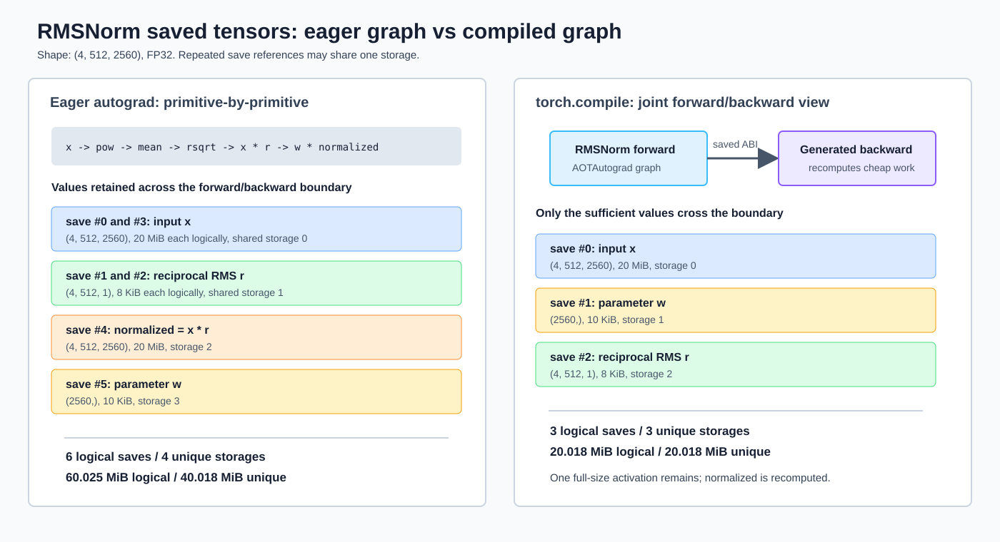

# RMSNorm Autograd Saved Tensors 与 Operator Fusion 实验报告

## 1. 原问题

Handout 的 [`3.1 Autograd Residuals`](./cs336_assignment2_systems_extracted.md#L360-L435) 从一个纯 FP32 RMSNorm 开始，要求使用 `torch.autograd.graph.saved_tensors_hooks` 观察 autograd 在 forward 中保存、在 backward 中取回的 Tensor：

> Let's build some understanding of what's being saved in our network. Starting with our unassuming RMSNorm function (pure FP32 for simplicity), let's add some hooks for when tensors are being saved or retrieved by autograd.

接下来的 [`3.1.1 Operator Fusion`](./cs336_assignment2_systems_extracted.md#L437-L458) 使用 `torch.compile` 编译同一个 RMSNorm，再次检查保存集合，观察编译和算子融合为什么能减少 backward residuals。

### 1.1 Handout 简答

在本机 PyTorch `2.11.0` 上，eager RMSNorm 触发 6 次保存，但其中输入 $x$ 和 reciprocal RMS $r$ 各被逻辑保存两次，所以只涉及 4 块唯一 storage；`torch.compile` 后只保存 $x$、参数 $w$ 和 $r$，共 3 次保存和 3 块唯一 storage。

对于题目尺寸 `(4, 512, 2560)`，包括参数引用时，logical saved bytes 从 60.025 MiB 降至 20.018 MiB，减少 66.65%；按唯一 storage 去重后，从 40.018 MiB 降至 20.018 MiB，减少 49.98%。编译版本只保留一份完整 activation，backward 根据 $x$ 和 $r$ 重新计算所需的归一化值。

## 2. 实验目标

本实验回答五个问题：

1. `pack_hook` 和 `unpack_hook` 分别在什么时候执行？
2. eager RMSNorm 为什么保存 6 次，而不是只保存输入？
3. 6 次保存是否真的代表 6 份独立内存？
4. `torch.compile` 为什么能把保存集合缩减为 3 个 Tensor？
5. 保存集合改变后，forward 结果和 backward 梯度是否仍然一致？

实现按职责拆为三个模块：

1. [`saved_tensor_profiler.py`](../cs336_systems/saved_tensor_profiler.py)：通用 saved-tensor 测量模块；
2. [`rmsnorm_fusion.py`](../cs336_systems/rmsnorm_fusion.py)：RMSNorm 与 eager/compiled workload；
3. [`autograd_experiment.py`](../scripts/autograd_experiment.py)：组合两个模块、输出 JSON 的 CLI。

接口级测试分别位于 [`test_saved_tensor_profiler.py`](../tests/test_saved_tensor_profiler.py) 和 [`test_rmsnorm_fusion.py`](../tests/test_rmsnorm_fusion.py)。

## 3. 背景知识

### 3.1 RMSNorm 的数学定义

数学上按列向量约定，对单个 token 的隐藏状态 $x\in\mathbb{R}^D$，RMSNorm 定义为：

$$r=\left(\frac{1}{D}x^\top x+\epsilon\right)^{-\frac12},\qquad y=w\odot x\,r$$

其中：

- $D$ 是 hidden size；
- $w\in\mathbb{R}^D$ 是可训练缩放参数；
- $r$ 是该 token 对应的标量 reciprocal RMS；
- $\odot$ 表示逐元素乘法。

数学上 $x$ 和 $w$ 都是列向量。PyTorch 中特征位于最后一维，实际输入布局为 `(batch_size, sequence_length, hidden_size)`；代码对最后一维执行 reduction，并一次向量化处理全部 $B\times S$ 个 token。

本实验使用 handout 给出的纯 FP32 实现，见 [`rmsnorm_fusion.py:L15-L26`](../cs336_systems/rmsnorm_fusion.py#L15-L26)：

```python
rms = torch.rsqrt(x.pow(2).mean(dim=-1, keepdim=True) + self.eps)
normalized = x * rms
return self.weight * normalized
```

这里刻意没有导入 Assignment 1 的 RMSNorm。Assignment 1 当前实现使用 `sqrt` 后除法，并包含 dtype 转换；primitive graph 不同会改变具体保存集合，无法与 handout 的 `rsqrt` 实验逐项对应。

### 3.2 Reverse-mode autograd 为什么需要保存 forward 值

设某个算子为 $z=f(a)$，loss 为标量 $L$。Reverse-mode autograd 接收上游梯度 $\bar z=\partial L/\partial z$，计算局部 VJP：

$$\bar a=J_f(a)^\top\bar z$$

局部 Jacobian $J_f(a)$ 通常依赖 forward 时的输入或输出。例如：

- `pow(2)` 的 backward 需要输入 $x$，因为导数是 $2x$；
- `rsqrt(u)` 的 backward 可以使用 forward 输出 $r=u^{-1/2}$；
- `a * b` 的 backward 需要两个乘数，因为 $\bar a=\bar z\odot b$、$\bar b=\bar z\odot a$。

PyTorch 不会显式构造完整 Jacobian，而是让每个 backward node 保存执行 VJP 所需的少量 primal values。这里的 primal value 是 forward 中出现的输入、输出或中间量。

### 3.3 saved tensor、activation 和 residual 的关系

这三个术语相关但不完全相同：

- **Activation**：forward 产生的中间 Tensor。
- **Saved tensor**：autograd 决定跨越 forward/backward 边界保留的 Tensor。
- **Residual**：在本 handout 的语境中是 saved tensor 的同义称呼，不是 Transformer 架构中的 residual stream。

saved tensors 是 activations/intermediates 按 backward 生命周期划出的子集。参数也可能通过 saved-tensor hook 出现，但参数不是 activation，并且其 storage 在 forward 前就已经存在。

### 3.4 `saved_tensors_hooks` 的协议

上下文管理器：

```python
with torch.autograd.graph.saved_tensors_hooks(pack_hook, unpack_hook):
    y = model(x)
    y.sum().backward()
```

具有以下语义：

1. autograd 准备为 backward 保存 Tensor 时调用 `pack_hook(tensor)`；
2. autograd 保存 `pack_hook` 的返回对象，而不要求它本身仍是 Tensor；
3. backward 需要该值时，将保存对象传给 `unpack_hook(packed)`；
4. `unpack_hook` 必须返回与原 Tensor 内容等价的 Tensor。

这个协议不仅能打印日志，还可用于把 saved tensors 搬到 CPU、写入外部存储或进行有损/无损压缩。不过这些操作会增加传输、同步或重建成本。

通用 profiler 为每次保存分配稳定的 `save_index`，并让 pack hook 返回包含 detached storage alias 和序号的 `_PackedTensor`。因此 backward 取回 Tensor 时可以精确对应到最初的保存事件，同时避免让 packed object 持有原始 autograd Tensor，见 [`saved_tensor_profiler.py:L78-L158`](../cs336_systems/saved_tensor_profiler.py#L78-L158)。

### 3.5 三种不同的“内存大小”

本报告区分：

1. **Logical saved bytes**：每次 pack hook 都按 Tensor 逻辑大小累加；同一 Tensor 被两个 backward node 保存时会计算两次。
2. **Unique saved storage bytes**：按底层 storage 地址去重；多个保存引用指向同一 storage 时只计算一次。
3. **Incremental allocated bytes**：forward 因保存行为而新增分配的物理内存。

前两项可以由 hook 可靠统计，第三项不能仅靠 hook 得到。例如输入 $x$ 在 forward 前已经分配；保存 $x$ 会延长其生命周期，却不会复制一份新 storage。真实峰值还受到 allocator cache、workspace 和其他临时 Tensor 影响，需要 CUDA memory snapshot、CUDA allocated memory 或 CPU RSS timeline 共同分析。

## 4. 实验实现

实现的 seam 是：

```text
RMSNormFusionWorkload ──┐
                        ├── autograd_experiment.py
SavedTensorProfile  ────┘
```

`rmsnorm_fusion.py` 不知道 hooks 如何记录或去重；`saved_tensor_profiler.py` 不知道 RMSNorm、eager 或 `torch.compile`。CLI 只负责准备输入、把 workload callable 交给测量模块，以及序列化结果。

### 4.1 保存事件与 storage 去重

每个事件记录：

- `phase`：`save` 或 `load`；
- `save_index`：保存与取回之间的稳定配对编号；
- `storage_index`：按底层 storage 去重后的编号；
- `role`：`input`、`parameter` 或 `intermediate`；
- shape、dtype、`requires_grad` 和 `grad_fn`；
- Tensor 逻辑字节数和底层 storage 字节数。

通用 profile 与聚合接口见 [`saved_tensor_profiler.py:L15-L75`](../cs336_systems/saved_tensor_profiler.py#L15-L75)，采集入口见 [`saved_tensor_profiler.py:L161-L180`](../cs336_systems/saved_tensor_profiler.py#L161-L180)。同一 `storage_index` 出现多次，表示存在多个逻辑保存引用，但底层数据没有因此复制多份。

### 4.2 Eager 与 compiled 使用同一输入

`RMSNormFusionWorkload` 封装 eager/compiled 构造、编译 warmup、forward/backward 和梯度结果，见 [`rmsnorm_fusion.py:L55-L127`](../cs336_systems/rmsnorm_fusion.py#L55-L127)。CLI 从同一个随机输入复制数据并把 workload 交给 profiler，见 [`autograd_experiment.py:L22-L62`](../scripts/autograd_experiment.py#L22-L62)。

compiled 分支使用：

```python
torch.compile(module, fullgraph=True, backend="inductor")
```

正式采集前先在 hook 外执行一次 forward 和 backward warmup。这样可以完成 Dynamo tracing、AOTAutograd joint graph 生成、Inductor 编译以及 compiled backward 的首次编译，避免把编译阶段行为混入本次 saved-tensor 事件。

### 4.3 正确性验证

脚本比较以下三个结果：

1. forward 输出；
2. 输入梯度 $\partial L/\partial x$；
3. 参数梯度 $\partial L/\partial w$。

比较逻辑见 [`rmsnorm_fusion.py:L130-L153`](../cs336_systems/rmsnorm_fusion.py#L130-L153)。结果同时记录 `allclose`、最大绝对误差和相对 L2 误差，避免只依赖一个布尔值。

### 4.4 原始结果

完整事件写入：

```text
benchmark_results/autograd_residuals/rmsnorm_saved_tensors.json
```

`benchmark_results/` 已由 `.gitignore` 排除。报告保留关键结果，原始 JSON 可通过命令重新生成，不需要纳入 Git。

## 5. 实验环境与命令

实验日期：2026-09-27。

| 项目 | 值 |
|---|---|
| PyTorch | `2.11.0+cu130` |
| Python | `3.13.12` |
| 执行设备 | CPU |
| `torch.compile` backend | Inductor |
| CPU 逻辑核数 | 56 |
| PyTorch 线程数 | 8 |
| 输入 shape | `(4, 512, 2560)` |
| dtype | FP32 |
| $\epsilon$ | $10^{-5}$ |
| 随机种子 | 0 |

运行命令：

```bash
OMP_NUM_THREADS=8 MKL_NUM_THREADS=8 \
uv run python scripts/autograd_experiment.py
```

只观察 eager 或 compiled 时可以分别使用 `--mode eager` 或 `--mode compiled`。默认 `--mode both` 会额外执行数值一致性检查。

## 6. 实验结果

### 6.1 总览

| 指标 | Eager | `torch.compile` | 降幅 |
|---|---:|---:|---:|
| Save hook 次数 | 6 | 3 | 50.00% |
| Load hook 次数 | 6 | 3 | 50.00% |
| 完整非参数 activation 保存引用 | 3 | 1 | 66.67% |
| Logical saved bytes，含参数 | 60.025 MiB | 20.018 MiB | 66.65% |
| Unique saved storage，含参数 | 40.018 MiB | 20.018 MiB | 49.98% |
| Logical non-parameter saved bytes | 60.016 MiB | 20.008 MiB | 66.66% |
| Unique non-parameter saved storage | 40.008 MiB | 20.008 MiB | 49.99% |



### 6.2 Eager 保存明细

| Save index | Role | Shape | 逻辑大小 | Storage | `grad_fn` |
|---:|---|---|---:|---:|---|
| 0 | 输入 $x$ | `(4, 512, 2560)` | 20 MiB | 0 | `None` |
| 1 | reciprocal RMS $r$ | `(4, 512, 1)` | 8 KiB | 1 | `RsqrtBackward0` |
| 2 | reciprocal RMS $r$ | `(4, 512, 1)` | 8 KiB | 1 | `RsqrtBackward0` |
| 3 | 输入 $x$ | `(4, 512, 2560)` | 20 MiB | 0 | `None` |
| 4 | normalized $x r$ | `(4, 512, 2560)` | 20 MiB | 2 | `MulBackward0` |
| 5 | 参数 $w$ | `(2560,)` | 10 KiB | 3 | `None` |

关键现象：

- save 0 和 save 3 都指向 storage 0，因此两次 20 MiB 是两个保存引用，不是两份 20 MiB storage；
- save 1 和 save 2 同理，共享 storage 1；
- normalized activation 使用独立的 storage 2；
- 参数 $w$ 使用 storage 3，它在 forward 前已经存在。

Eager 的 load 顺序为：

```text
[4, 5, 2, 3, 1, 0]
```

它不是保存顺序 `[0, 1, 2, 3, 4, 5]` 的严格反转。Backward 按计算图拓扑执行各 backward node，每个 node 再按自己的参数顺序请求保存值，因此“节点逆拓扑”不等于“所有 pack hook 调用全局逆序”。

### 6.3 Compiled 保存明细

| Save index | Role | Shape | 逻辑大小 | Storage | `grad_fn` |
|---:|---|---|---:|---:|---|
| 0 | 输入 $x$ | `(4, 512, 2560)` | 20 MiB | 0 | `None` |
| 1 | 参数 $w$ | `(2560,)` | 10 KiB | 1 | `None` |
| 2 | reciprocal RMS $r$ | `(4, 512, 1)` | 8 KiB | 2 | `None` |

Compiled 的 load 顺序为 `[0, 1, 2]`。三个 Tensor 都没有 `grad_fn`，因为 AOTAutograd 将 RMSNorm 的 joint forward/backward graph 分区后，把这些值作为 generated backward 的显式输入跨越分区边界；从该边界观察，它们是 detached saved values，而不是 eager primitive graph 中继续携带局部 `grad_fn` 的中间节点。

## 7. Eager 为什么保存 6 次

将 forward 拆成 primitive operations：

| Forward operation | Backward 所需值 | 触发的保存 |
|---|---|---|
| `x.pow(2)` | $x$，用于 $2x$ | save 0 |
| `mean(...)` | shape、维度等元数据即可 | 无 Tensor |
| `+ eps` | 常量与广播元数据即可 | 无 Tensor |
| `rsqrt(...)` | 输出 $r$，用于其导数 | save 1 |
| `x * r` | $r$ 用于 $\bar x$，$x$ 用于 $\bar r$ | save 2、3 |
| `w * normalized` | normalized 用于 $\bar w$，$w$ 用于 $\overline{\text{normalized}}$ | save 4、5 |

因此 eager autograd 的决策是局部的：每个 primitive backward node 独立保存完成自身 VJP 所需的值。它不知道后续另一个 node 已经保存过同一 storage，也不会自动把整个 RMSNorm 的解析梯度重写成最小保存形式。

这里“粒度太细”不是说数学上计算错了，而是：

- backward graph 包含多个 primitive nodes；
- 同一值可能被多个 node 分别引用；
- 中间 activation `normalized` 被跨 forward/backward 边界保留；
- 多个 elementwise/reduction kernels 还会增加 kernel launch 和内存读写。

## 8. 编译后为什么只需三个 Tensor

### 8.1 RMSNorm 的整体 VJP

令上游梯度为 $g=\partial L/\partial y$，并定义 $u=w\odot g$。对单个 token，整体 RMSNorm 的输入梯度为：

$$\frac{\partial L}{\partial x}=r u-\frac{r^3}{D}x\left(x^\top u\right)$$

参数梯度需要对所有 batch 和 sequence 位置求和：

$$\frac{\partial L}{\partial w}=\sum_{b=1}^{B}\sum_{s=1}^{S}g_{b,s}\odot\left(r_{b,s}x_{b,s}\right)$$

从这两个式子可以看到，generated backward 只需要：

1. 输入 $x$；
2. 参数 $w$；
3. 每个 token 的 reciprocal RMS $r$；
4. backward 运行时传入的上游梯度 $g$。

完整 normalized activation $xr$ 不需要长期保存，因为 backward 可以从 $x$ 和很小的 $r$ 重新计算它。

### 8.2 `torch.compile` 做了什么

这里的优化不应简单理解成“几个 forward kernel 被焊成一个 kernel”。PyTorch 的 compiled training 路径通常包含：

1. TorchDynamo 捕获 Python 层计算图；
2. AOTAutograd 同时观察 forward 和 backward，生成 joint graph；
3. partitioner 决定哪些值跨 forward/backward 边界保存，哪些值在 backward 中重算；
4. Inductor 对分区后的计算进行代码生成和 kernel fusion。

Saved tensors 从 6 个变成 3 个，直接来源于 joint graph 的全局视角和分区决策；kernel fusion 则进一步减少 kernel launch 与中间结果的物化。两者经常同时出现，但不是完全相同的概念。

## 9. 数值一致性

比较容差为 `rtol=1e-5, atol=5e-4`：

| 比较对象 | `allclose` | 最大绝对误差 | 相对 L2 误差 |
|---|---|---:|---:|
| Forward 输出 | True | $9.5367\times10^{-7}$ | $6.2655\times10^{-8}$ |
| 输入梯度 | True | $3.5763\times10^{-7}$ | $6.2929\times10^{-8}$ |
| 参数梯度 | True | $2.0218\times10^{-4}$ | $8.3110\times10^{-7}$ |

参数梯度的最大绝对误差明显大于逐元素输出和输入梯度，是因为 $\partial L/\partial w$ 要沿 $B\times S=2048$ 个 token 做 reduction。Inductor 可以采用与 eager 不同的分块和树形归约顺序；FP32 加法不满足结合律，所以末位结果会略有不同。其相对 L2 误差仍只有约 $8.31\times10^{-7}$，结果在实验容差内一致。

## 10. 如何解释内存收益

### 10.1 Logical bytes 的 66.65% 降幅

Eager 对 $x$ 和 $r$ 各保存两个逻辑引用，并额外保存 normalized。按每次 hook 的 Tensor 大小相加会得到 60.025 MiB。Compiled 不再重复引用，也不保存 normalized，只剩 20.018 MiB。

这个指标描述 autograd 保存接口的逻辑负担，适合解释 backward graph 的粒度，但会重复计算共享 storage。

### 10.2 Unique storage 的 49.98% 降幅

Eager 中两次 $x$ 引用只占一块 20 MiB storage，两次 $r$ 引用也只占一块 8 KiB storage。去重后，真正被保存引用覆盖的 storage 为：

$$20\ \text{MiB }(x)+20\ \text{MiB }(xr)+8\ \text{KiB }(r)+10\ \text{KiB }(w)=40.018\ \text{MiB}$$

Compiled 去掉 normalized storage，只保留 $x$、$r$ 和 $w$，所以 unique footprint 约减半。

### 10.3 这仍不等于新增分配 20.018 MiB

Compiled 统计中的 20 MiB 主体是输入 $x$。它在进入 RMSNorm 前已经存在，保存行为只是阻止 allocator 在 backward 前复用该 storage。参数 $w$ 同样早已存在。

因此更准确的说法是：

> Compiled RMSNorm 的 backward 依赖覆盖 20.018 MiB 唯一 storage，并将这些 storage 的生命周期延长到 backward；不能据此断言 forward 新分配了 20.018 MiB。

## 11. 复杂度与可并行性

### 11.1 时间复杂度

Eager 和 compiled RMSNorm 的 forward、backward 渐近复杂度都为：

$$O(BSD)$$

编译不会改变渐近复杂度，但能减少中间 Tensor 物化、全尺寸显存/内存流量和 kernel launch 数量。Backward 重算 $xr$ 也为 $O(BSD)$，这是用少量额外计算换取一份 $O(BSD)$ activation storage。

### 11.2 空间复杂度

两种实现都至少要保留输入 $x$，所以 saved-tensor 空间复杂度仍为：

$$O(BSD)$$

收益体现在常数项：

- eager 保留 $x$ 和 normalized 两块完整 activation storage；
- compiled 只保留 $x$，另有 $O(BS)$ 的 $r$ 和 $O(D)$ 的参数引用。

### 11.3 可并行性

- 不同 $(b,s)$ token 的 RMSNorm 相互独立，可以并行；
- 每个 token 内部计算 RMS 需要沿 $D$ 维 reduction；
- 输入梯度可按元素和 token 并行；
- 参数梯度需要沿 $B$、$S$ 归约，并行实现会改变浮点求和顺序；
- compiled backward 可把重算、逐元素梯度和部分归约融合，减少内存往返。

## 12. 测试与限制

测试执行：

```bash
uv run pytest \
  tests/test_saved_tensor_profiler.py \
  tests/test_rmsnorm_fusion.py -q
```

结果：

```text
4 passed
```

测试覆盖：

1. 通用 profiler 能记录 save/load、角色和 storage 指标；
2. 同一 storage 的角色冲突会在 interface 上被拒绝；
3. 小尺寸 eager RMSNorm 恰好触发 6 次保存和 6 次取回；
4. logical bytes 与 unique storage bytes 的去重结果正确；
5. compiled 路径保存数量少于 eager；
6. eager 与 compiled 的输出、输入梯度和参数梯度一致。

本实验有以下边界：

- saved-tensor 集合属于编译器实现决策，PyTorch 版本、backend、shape 或 graph break 都可能改变具体结果；
- 本次在 CPU 上执行，验证的是 autograd 与编译图语义，不是 GPU kernel 性能；
- `torch.compile` 第一次调用包含编译成本，所以正式采集前必须 warmup；
- 本实验只分析单个 RMSNorm，不能把约 20 MiB 的收益直接乘以整个模型层数来预测峰值；跨层生命周期、allocator 复用和其他 activation 仍需整体 profiling。

## 13. 结论

Eager autograd 按 primitive operator 构造 backward，每个节点独立保存 VJP 所需值，因此一个简单 RMSNorm 也会产生 6 次保存事件和 3 个完整 activation 引用。由于重复引用共享 storage，真实唯一保存 footprint 是 40.018 MiB，而不是 logical sum 的 60.025 MiB。

`torch.compile` 通过 AOTAutograd 的 joint forward/backward 图只把 $x$、$w$ 和 $r$ 传给 generated backward，并重算 normalized，将唯一保存 footprint 降到 20.018 MiB。数值结果与 eager 一致；参数梯度的微小差异来自并行 reduction 顺序变化。
