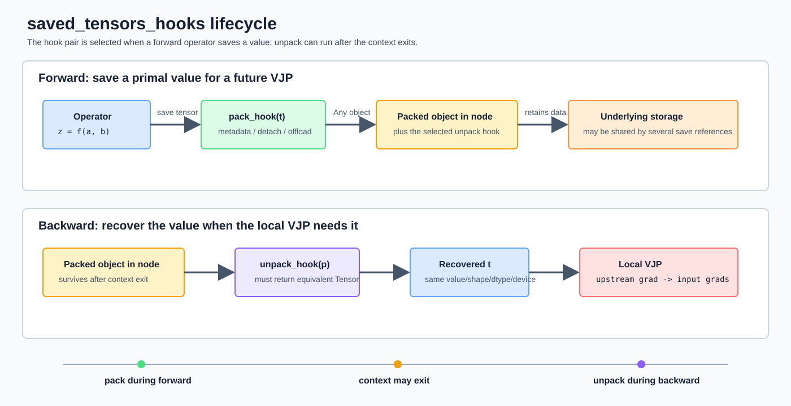

# PyTorch `saved_tensors_hooks` 机制详解

## 1. 要解释的代码

原始实现直接在 `profile_block_saved_tensors.py` 中使用：

```python
with torch.autograd.graph.saved_tensors_hooks(pack_hook, unpack_hook):
```

重构后，这个底层机制位于通用 [`saved_tensor_profiler.py:L161-L180`](../cs336_systems/saved_tensor_profiler.py#L161-L180)，block profiler 通过 [`capture_saved_tensors()`](../scripts/profile_block_saved_tensors.py#L65-L83) 调用它。RMSNorm 实验和 `TransformerBlock` 实验因此共享同一套测量实现。

它不是普通的 module forward hook 或 gradient hook，而是在当前动态作用域内替换 autograd 的 **saved-tensor pack/unpack 策略**：

- forward 中某个算子决定“为了 backward，我需要保存这个 Tensor”时，PyTorch 调用 `pack_hook(tensor)`；
- autograd graph 保存 pack hook 的返回对象和与之配对的 unpack hook；
- backward 真正需要原值时，PyTorch 调用 `unpack_hook(packed)` 恢复 Tensor；
- hook 本身不决定一个算子应保存什么，只拦截该算子原本就要保存的值。

通用 profiler 利用 pack hook 记录 shape、dtype、来源和 storage；block profiler 再由这些元数据估算一个 `TransformerBlock` 为 backward 延长了哪些 Tensor 的生命周期。

## 2. 先建立 autograd 背景

### 2.1 Forward graph 与 backward node

当输入或参数满足 `requires_grad=True` 且没有处于 `torch.no_grad()`/inference mode 时，PyTorch eager execution 会在执行 forward 的同时构造动态 autograd graph。

例如：

```python
z = a * b
```

结果 `z` 通常带有类似 `MulBackward0` 的 `grad_fn`。该 backward node 表示：未来收到上游梯度 $\bar z=\partial L/\partial z$ 时，如何计算输入梯度。

数学上按列向量约定，局部反向传播是在计算 VJP：

$$\bar a=J_{f,a}^\top\bar z,\qquad \bar b=J_{f,b}^\top\bar z$$

逐元素乘法 $z=a\odot b$ 的 VJP 为：

$$\bar a=\bar z\odot b,\qquad \bar b=\bar z\odot a$$

所以 `MulBackward0` 在 forward 时必须保留 $a$ 和 $b$，否则 backward 无法计算这两个式子。

### 2.2 为什么不是所有 activation 都保存

是否保存 Tensor 由每个算子的 backward 公式决定：

- `a * b` 通常需要保存两个乘数；
- `x.pow(2)` 需要保存 $x$；
- `x + y` 的梯度只是把上游梯度按广播规则传回，通常只需 shape 等元数据，不必保存完整输入；
- 某些 backward 可以使用 forward 输出代替输入；
- 某些值可以低成本重算，编译器可能选择不保存。

因此：

> saved tensors 是 forward activations/intermediates 中因 backward VJP 而被延长生命周期的子集，不是“所有 forward 输出”的同义词。

### 2.3 `SavedVariable` 的概念角色

PyTorch C++ autograd 内部使用类似 `SavedVariable` 的结构表达 backward 所需的 Tensor 状态。概念上它需要处理：

- Tensor 数据或其 packed representation；
- Tensor metadata；
- 与 autograd graph 的关系；
- view、leaf、output number 等信息；
- version counter，用于发现不安全的 in-place 修改。

如果某个 forward 值被原地修改，导致其 version 与保存时不一致，普通 autograd 通常会在 backward 报出 “modified by an inplace operation” 一类错误。Hook 不能绕过数学正确性要求；尤其不能在 pack/unpack hook 内原地修改输入。

## 3. `saved_tensors_hooks` 的生命周期



完整时序为：

1. 进入 `with`，PyTorch 将 `(pack_hook, unpack_hook)` 压入当前 saved-tensor hook 栈；
2. forward 算子准备保存 Tensor；
3. PyTorch 调用当前生效的 `pack_hook(tensor)`；
4. autograd node 保存 pack hook 的返回对象，并记住配对的 unpack hook；
5. 离开 `with`，全局动态作用域中的默认 hook 被弹出；
6. 之后 backward 访问该 saved value；
7. node 调用保存时绑定的 `unpack_hook(packed)`；
8. unpack hook 返回等价 Tensor，backward node 用它执行局部 VJP；
9. 正常 backward 使用完保存值后，graph 释放相应引用。

### 3.1 `with` 内部实际做了什么

本机 PyTorch `2.11.0` 的 Python 实现中，`__enter__` 和 `__exit__` 分别调用：

```python
torch._C._autograd._push_saved_tensors_default_hooks(pack_hook, unpack_hook)
torch._C._autograd._pop_saved_tensors_default_hooks()
```

因此它是一个动态作用域设置，不会改写 `TransformerBlock` 类，也不会把 hook 永久注册到模型实例。

### 3.2 Context 只需覆盖 forward 保存阶段

Hook 对在 **保存发生时** 绑定到相应 autograd node。下面的写法仍然会在 backward 调用 `unpack_hook`：

```python
with torch.autograd.graph.saved_tensors_hooks(pack_hook, unpack_hook):
    output = block(x)

loss = output.square().mean()
loss.backward()
```

本机实测中，退出 context 后才执行 `backward()`，已绑定的 unpack hook 仍然正常触发。当前脚本把 backward 也写在 context 内，主要是让一次 profiling 的代码边界更直观；对于默认的 `create_graph=False`，这不是调用原 unpack hook 的必要条件。

如果使用 `backward(create_graph=True)`，backward 自身还会构造高阶梯度图。此时 backward 放在 context 内可能拦截高阶图中新保存的 Tensor，统计含义会发生变化。

### 3.3 嵌套 context

PyTorch 一次只允许一对 hooks 生效。嵌套时：

- 内层作用域中的算子使用内层 hook；
- 退出内层后，外层 hook 恢复；
- 每个 node 在保存时绑定当时生效的那一对 hooks。

不能假设外层和内层 hook 会对同一个 saved tensor 依次执行。

## 4. Pack/unpack API 契约

函数签名是：

```python
pack_hook(tensor: Tensor) -> Any
unpack_hook(packed: Any) -> Tensor
```

`pack_hook` 可以返回任意 Python 对象，例如：

- detached Tensor；
- `(device, cpu_tensor)` tuple；
- 文件路径和 metadata；
- 压缩后的字节对象；
- 自定义数据类。

但必须满足：

> `unpack_hook(pack_hook(t))` 应恢复与原 Tensor 在 value、shape、dtype 和 device 上等价的结果。

PyTorch 不保证能够替用户发现所有违反契约的错误。若 unpack 返回错误数值或使用有损压缩，梯度可能悄悄改变，而不一定立即报错。

### 4.1 不要在 hook 中做 in-place 修改

对传入 pack hook 的 Tensor 或 unpack 后 Tensor 做 in-place 修改可能破坏 version counter、其他 alias 或 backward 需要的原值，PyTorch 官方将其标记为 undefined behavior。

### 4.2 Pack 返回值不要持有原 Tensor 引用

本机 PyTorch 2.11 文档明确警告：为避免引用环，pack hook 的返回对象不应持有输入 Tensor 本身。推荐：

```python
def pack_hook(tensor: Tensor) -> Tensor:
    return tensor.detach()
```

而不是：

```python
def pack_hook(tensor: Tensor) -> Tensor:
    return tensor
```

原因是原 Tensor 可能通过 `grad_fn` 指回保存它的 graph node，而 node 又持有 pack 返回对象，形成 Python/C++ 跨层引用环。

原始 inline hook 曾直接 `return tensor`，不符合当前官方建议。重构后的 [`saved_tensor_profiler.py:L146-L155`](../cs336_systems/saved_tensor_profiler.py#L146-L155) 保存 `tensor.detach()`；detached Tensor 共享相同 storage，不会复制数据，也不影响 storage 去重统计。

## 5. 通用 profiler 的 pack 路径

### 5.1 定位触发保存的 Python 调用点

Block profiler 将 [`_source_location()`](../scripts/profile_block_saved_tensors.py#L32-L36) 作为 `source_resolver` 传给通用接口：

```python
_, profile = capture_saved_tensors(
    forward_backward,
    tensor_roles={
        "input": (x,),
        "parameter": tuple(block.parameters()),
    },
    source_resolver=_source_location,
)
```

每次 pack 时，通用 profiler 调用该 resolver。`_source_location()` 扫描最多 40 层 Python stack，从最近的 frame 开始查找：

```text
cs336_basics/model.py
cs336_basics/nn_utils.py
```

找到后记录：

```text
文件名:行号:函数名
```

例如：

```text
model.py:133:scaled_dot_product_attention
```

这表示保存事件发生时，最近的项目 Python frame 位于该位置；它不是 PyTorch C++ backward formula 的精确源文件，也不一定能定位 fused/compiled operator 的内部来源。

如果 stack 中没有项目 frame，脚本写为：

```text
pytorch_internal
```

每次 pack 都提取 Python stack，开销较高。因此该脚本适合做 attribution，不适合拿来测真实性能延迟。

### 5.2 生成 storage identity

通用 profiler 的 [`_storage_key()`](../cs336_systems/saved_tensor_profiler.py#L85-L86) 执行：

```python
storage_key = _storage_key(tensor)
storage_nbytes = tensor.untyped_storage().nbytes()
```

其中：

```python
def _storage_key(tensor):
    return str(tensor.device), tensor.untyped_storage().data_ptr()
```

一个 Tensor 可以看成两层：

1. **Tensor view/metadata**：shape、stride、dtype、storage offset；
2. **Storage**：真正保存字节的底层内存。

不同 Tensor view 可以共享同一个 storage。因此脚本用 `(device, data_ptr)` 识别底层存储，而不是使用 Python 对象的 `id(tensor)`。

设备必须放入 key。CPU 地址和 CUDA 地址即使数值相同，也不是同一块物理存储。

### 5.3 识别参数 storage

Block profiler 通过 `tensor_roles` 声明已知 storage：

```python
tensor_roles={
    "input": (x,),
    "parameter": tuple(block.parameters()),
}
```

[`_build_role_map()`](../cs336_systems/saved_tensor_profiler.py#L105-L115) 将这些 Tensor 转成 `storage key -> role` 映射。这里按 storage 而不是 `isinstance(tensor, nn.Parameter)` 判断，原因是 autograd 可能保存参数的 view；view 不一定仍表现为 `Parameter` 对象，但仍共享参数 storage。

需要注意：如果 autocast 或某个算子创建了参数的低精度副本，该副本有独立 storage，不会匹配原始 FP32 参数 key。它会被计入 non-parameter runtime storage，这是合理的，因为它确实是额外存储。

### 5.4 `tensor_nbytes` 与 `storage_nbytes`

[`_record()`](../cs336_systems/saved_tensor_profiler.py#L123-L144) 同时保存：

```python
"tensor_nbytes": tensor.numel() * tensor.element_size(),
"storage_nbytes": tensor.untyped_storage().nbytes(),
```

两者含义不同：

- `tensor_nbytes` 是当前 Tensor view 覆盖的逻辑元素数乘单元素字节数；
- `storage_nbytes` 是整个底层 storage 的容量。

对独立、连续且无额外容量的 Tensor，两者通常相等。对 slice、transpose 或其他 view：

- view 的 `tensor_nbytes` 可能很小；
- 它仍然让整个 base storage 无法释放；
- `storage_nbytes` 因而可能远大于 `tensor_nbytes`。

### 5.5 保存逻辑引用并去重 storage

每次 pack 都产生一个 `SavedTensorEvent`：

```python
SavedTensorEvent(
    phase="save",
    save_index=save_index,
    storage_index=...,
    ...
)
```

所以 `profile.saved_events` 统计的是 **保存引用次数**。Block profiler 为兼容原 JSON schema，再将这些事件转换成 `saved_references`。同一 Tensor 被两个 backward nodes 保存，会出现两条记录。

聚合时，[`SavedTensorProfile.metrics()`](../cs336_systems/saved_tensor_profiler.py#L55-L63) 用 `storage_index` 去重：

```python
storage_nbytes = {
    event.storage_index: event.storage_nbytes
    for event in saves
}
```

按 storage key 去重，得到非参数 saved tensors 所覆盖的唯一底层 storage。

设 pack hook 一共观察到 $K$ 个非参数引用，第 $i$ 个 Tensor 的逻辑大小为 $n_i$，则：

$$M_\text{logical}=\sum_{i=1}^{K}n_i$$

设这些引用只覆盖 $U$ 块唯一 storage，第 $j$ 块 storage 容量为 $s_j$，则：

$$M_\text{unique storage}=\sum_{j=1}^{U}s_j$$

一般不能假设两者相等，也不能断言其中任意一个就是 forward 新分配的内存。

## 6. 通用 profiler 的 unpack 路径

[`saved_tensor_profiler.py:L153-L155`](../cs336_systems/saved_tensor_profiler.py#L153-L155)：

```python
def unpack(self, packed: _PackedTensor) -> Tensor:
    self._record("load", packed.save_index, packed.value, packed.source)
    return packed.value
```

这是带事件记录的 identity unpack：

- 没有 CPU/GPU 搬运；
- 没有解压；
- 使用原 `save_index` 记录 load event；
- 保留最初保存时解析出的 source；
- 没有额外 Tensor 转换。

通用 `SavedTensorProfile` 因此可以回答：

- save/load 次数；
- load 顺序；
- 每次 load 对应哪个 save；
- load 时观察到的 Tensor metadata。

当前 block profiler 为保持原 JSON schema，只把 `profile.saved_events` 转换为旧格式，没有序列化 load events；需要 load 明细时可以直接读取通用 profile 或调用 `profile.to_dict()`。

## 7. Block profiler 的完整执行边界

重构后的核心代码位于 [`profile_block_saved_tensors.py:L65-L84`](../scripts/profile_block_saved_tensors.py#L65-L84)：

```python
rss_before_forward = _rss_bytes()
rss_after_forward = None

def forward_backward():
    nonlocal rss_after_forward
    with _autocast_context(autocast_dtype):
        output = block(x)
        loss = output.float().square().mean()
    rss_after_forward = _rss_bytes()
    loss.backward()

_, profile = capture_saved_tensors(
    forward_backward,
    tensor_roles={
        "input": (x,),
        "parameter": tuple(block.parameters()),
    },
    source_resolver=_source_location,
)
rss_after_backward = _rss_bytes()
```

执行顺序如下。

### 7.1 `rss_before_forward`

此时 block 参数和输入 $x$ 已经存在，但尚未执行 forward。该值是进程 RSS 基线，不是“零内存”。

### 7.2 调用通用 profiler

`capture_saved_tensors()` 在内部进入 saved-tensor hook context，然后调用 `forward_backward()`。这样 block profiler 只声明 workload、已知 Tensor roles 和 source resolver，不再维护 hook 配对或 storage 去重逻辑。

### 7.3 进入 autocast context

若 `autocast_dtype == "none"`，`_autocast_context()` 返回 `nullcontext()`，不改变 dtype。

若启用 CPU autocast，算子 dispatcher 根据 autocast policy 决定实际执行 dtype。Pack hook 看到的是算子真正保存的 Tensor dtype，而不是命令行中抽象的“目标 dtype”。

Hooks 不控制 autocast，autocast 也不保证所有 saved tensors 都是同一种 dtype。

### 7.4 执行 `block(x)`

`TransformerBlock` 内所有需要为 backward 保存 Tensor 的 primitive operations 都会触发 pack hook。一个 module 不会只触发一次；触发次数由内部 autograd operations 的 backward 公式决定。

### 7.5 构造 loss

下面一行也处于 hook context 内：

```python
loss = output.float().square().mean()
```

因此统计范围不严格等于 `block(x)`：

- `square()` 的 backward 需要其输入；
- 它会额外保存一份与 block 输出同形状的 Tensor；
- 该操作不在 `model.py`/`nn_utils.py` stack 中，所以来源通常记为 `pytorch_internal`。

现有原始数据验证了这一点：

| 配置 | `pytorch_internal` 次数 | 逻辑大小 | 对应 shape |
|---|---:|---:|---|
| `B=1,S=128,D=1280` | 1 | 655,360 bytes = 0.625 MiB | `(1,128,1280)` |
| `B=1,S=2048,D=1280` | 1 | 10,485,760 bytes = 10 MiB | `(1,2048,1280)` |

所以脚本当前统计的是：

> `TransformerBlock` forward 加上用于触发 backward 的 square-loss 所保存的 Tensor。

如果要严格统计 block 自身，可以缩小 hook 范围：

```python
with torch.autograd.graph.saved_tensors_hooks(pack_hook, unpack_hook):
    with _autocast_context(autocast_dtype):
        output = block(x)

loss = output.float().square().mean()
loss.backward()
```

Block forward 保存时已经绑定了 unpack hook，所以 backward 位于 context 外仍可恢复这些值；loss 自己保存的 Tensor 则不会进入统计。

### 7.6 `rss_after_forward`

此时：

- block forward 已完成；
- loss 已完成；
- autograd graph 和 saved values 仍然存活；
- 可能还有 allocator cache、Python runtime 和库内部 workspace。

该 RSS 不是 `sum(saved tensor bytes)`。它是整个进程驻留物理页的快照。

### 7.7 `loss.backward()`

Autograd 从 loss 开始逆拓扑遍历：

1. backward node 请求某个 saved value；
2. PyTorch 调用该 node 绑定的 unpack hook；
3. node 执行局部 VJP；
4. 产生输入梯度或参数梯度；
5. 正常情况下，用完的 saved value 引用逐步释放。

同时，参数 `.grad` 和输入 `x.grad` 会被创建。因此 backward 期间的总内存可能：

- 下降：释放 saved activations 多于新增 gradients；
- 上升：新增 gradients/workspace 多于当时释放量；
- 锯齿波动：分配和释放在不同 backward nodes 间交错。

### 7.8 `rss_after_backward`

Backward 完成不意味着 RSS 立即回到 baseline：

- 参数梯度仍然存活；
- `x.grad` 仍然存活；
- PyTorch/系统 allocator 可能缓存已释放 block；
- Python 对象和库 workspace 仍可能保留；
- detached packed Tensor 仍会保活相同的底层 storage，直到 graph 释放它。

因此不能用 `rss_after_forward - rss_after_backward` 直接当作“释放的 saved tensor 字节数”。

## 8. Logical reference、unique storage 与真实峰值

### 8.1 为什么一个 storage 会被保存多次

不同 backward nodes 可以独立需要同一个 forward Tensor。例如 RMSNorm eager graph 中：

- `pow` backward 需要输入 $x$；
- 后续 `x * r` backward 也需要 $x$；
- pack hook 因而观察到两次 $x$；
- 两条记录仍可共享同一个 input storage。

这就是：

```text
saved_tensor_reference_count > unique_storage_count
```

的来源。

### 8.2 为什么 unique storage 仍不是增量 allocation

假设输入 $x$ 在 forward 前已占 20 MiB：

- backward 保存 $x$ 不会再分配 20 MiB；
- 但 graph 会延长这 20 MiB storage 的生命周期；
- 若没有保存，allocator 可能更早复用它。

所以 unique storage 更准确地描述“被 saved references 保活的底层数据范围”，不是“hook 导致的新分配量”。

### 8.3 Views 为什么必须看 storage

假设一个 1 MiB view 指向 100 MiB base storage。只要 view 被保存且 base storage 没有其他可拆分机制，整个 100 MiB storage 都不能释放。

此时：

```text
tensor_nbytes = 1 MiB
storage_nbytes = 100 MiB
```

Logical bytes 更适合分析算子保存了什么形状；storage bytes 更接近生命周期约束。

### 8.4 RSS、CUDA allocated 与 CUDA reserved

三者不能混用：

- CPU RSS：整个进程当前驻留在物理内存中的页；
- CUDA allocated：PyTorch allocator 当前分配给活跃 Tensor 的显存；
- CUDA reserved：PyTorch allocator 从 CUDA driver 保留的显存池。

当前脚本在 CPU 上读取 `/proc/self/statm`，只得到 RSS。它不会得到 CUDA active allocation timeline，也无法区分 Tensor、allocator cache 和其他进程内存。

## 9. Source attribution 的含义与局限

`source_summary` 按 `source` 汇总 logical bytes：

```python
source_bytes[source] += int(record["tensor_nbytes"])
```

百分比分母是所有非参数保存引用的 logical bytes：

$$p_\text{source}=\frac{\text{该 source 的 logical saved bytes}}{\text{全部 non-parameter logical saved bytes}}\times100\%$$

它回答的是：

> 哪些 Python 调用位置触发的保存引用，在逻辑字节和中占比最大？

它不回答：

- 哪一行独占最多唯一 storage；
- 哪个 Tensor 真正新增了多少 RSS；
- 哪个 CUDA allocation 在 allocator timeline 中最大；
- 哪个算子的 backward 最晚才释放内存。

此外，Python stack attribution 存在以下限制：

- C++/fused/compiled 路径可能只显示 `pytorch_internal`；
- 同一 Python 行可以触发多个 primitive saves；
- view 共享 storage 时，logical attribution 会重复；
- stack 提取本身会扰动运行时间。

## 10. Hook 与 graph 生命周期

### 10.1 默认 backward 后 saved tensors 会释放

默认 `loss.backward()` 完成后，PyTorch 释放用于该图 backward 的保存值。再次沿同一图 backward 通常会报：

```text
Trying to backward through the graph a second time ...
Saved intermediate values ... have already been freed.
```

### 10.2 `retain_graph=True`

使用：

```python
loss.backward(retain_graph=True)
```

会保留 graph 和 saved values，以便再次 backward。这样会延长 activation 生命周期，并可能让 unpack hook 在后续 backward 再次执行。

不要为了“修复重复 backward 报错”长期无条件启用它；这会显著增加内存占用。

### 10.3 梯度累积不会自动保留旧 graph

常规梯度累积对多个 microbatch 分别执行 forward/backward：

```python
loss_1.backward()
loss_2.backward()
```

参数 `.grad` 会累加，但每个 microbatch 的 graph 在对应 backward 后仍可释放。它不要求对每一步使用 `retain_graph=True`。

## 11. 与其他内存技术的关系

### 11.1 `save_on_cpu`

PyTorch 提供：

```python
with torch.autograd.graph.save_on_cpu(pin_memory=True):
    output = block(x)
```

它本质上是预定义的 saved-tensor hooks：

- pack 时把保存值移到 CPU；
- unpack 时搬回原设备；
- `pin_memory=True` 可支持异步 CPU-to-GPU copy。

它用 PCIe/互连传输和 CPU 内存换取 GPU 显存，适合显存不足但能容忍额外通信的场景。

### 11.2 自定义 offload

概念示例：

```python
def pack_hook(tensor):
    return tensor.device, tensor.detach().cpu()

def unpack_hook(packed):
    device, cpu_tensor = packed
    return cpu_tensor.to(device)
```

生产实现还要处理：

- pinned memory；
- CUDA stream 与同步；
- 生命周期和预取；
- dtype/layout；
- 多 GPU device identity；
- CPU 内存上限。

### 11.3 压缩 saved tensors

可以在 pack 中量化或压缩，在 unpack 中恢复。但若恢复值不完全相同，梯度也会改变。此时它已经不是纯内存工程优化，而是带数值误差的训练算法，需要单独验证收敛与稳定性。

### 11.4 Activation checkpointing

Activation checkpointing 的核心是：

- 原始 forward 少保存内部 Tensor；
- backward 时重算一段 forward；
- 再执行该段 backward。

Saved-tensor hooks 是“改变保存值的表示或观察保存行为”；checkpointing 是“改变保存与重算的边界”。两者可以组合，但 hooks 可能同时观察 checkpoint 边界保存和 backward 重算阶段产生的新保存事件，具体行为取决于 checkpoint 实现与 `use_reentrant` 模式。

### 11.5 `torch.compile`

AOTAutograd 可以同时观察 forward 和 backward，决定哪些值跨分区保存、哪些值在 backward 重算。Hooks 包在 compiled callable 外时，通常观察到的是 generated forward/backward 边界上的 saved values，而不是原始 eager primitive graph 的全部保存。

[`02_05 RMSNorm 实验`](./02_05_rmsnorm_autograd_saved_tensors_report.md) 中，eager RMSNorm 有 6 次保存，而 compiled RMSNorm 只有 3 次，正是这种 joint graph 优化的结果。

## 12. 当前脚本的复杂度与扰动

设 pack hook 被调用 $K$ 次，唯一非参数 storage 数为 $U$。

### 12.1 额外时间

- 每次 pack 提取最多 40 层 stack，约为 $O(KF)$，其中 $F\leq40$；
- 每次进行字典查询和 metadata 读取，平均约为 $O(K)$；
- 最终排序 source summary 和 largest references 还需要额外排序成本。

这些 Python callbacks 受 GIL 影响，会显著扰动细粒度算子时间。因此不能在启用当前 hooks 的同一次运行里得出可信的 kernel/forward latency。

### 12.2 额外 Python 空间

- `SavedTensorProfile.events` 为 $O(K)$；
- storage index 和 role map 为 $O(U)$；
- 每条记录只保存 metadata，没有显式 clone Tensor 数据。

通用 profiler 返回 `tensor.detach()`，避免 packed object 持有原 Tensor 的 autograd 关系；detached alias 仍共享 storage，不会增加一份 Tensor 数据副本。

### 12.3 可并行性

模型底层算子仍可使用 CPU threads 或 CUDA kernels 并行执行，但 Python pack hook 在每个 save boundary 上运行。它适合诊断和统计，不适合长期放在高吞吐训练主路径中。

## 13. 更严格的 observation-only 模板

下面的模板同时解决三个问题：

1. pack 返回 detached Tensor，避免持有原 Tensor graph 引用；
2. hook 范围只覆盖待分析模块，不包含 loss；
3. 给 save/load 配对编号，能观察 backward 取回顺序。

```python
from dataclasses import dataclass

import torch


@dataclass(frozen=True)
class PackedTensor:
    value: torch.Tensor
    save_index: int


events = []
next_save_index = 0


def pack_hook(tensor):
    global next_save_index
    save_index = next_save_index
    next_save_index += 1
    events.append(("save", save_index, tuple(tensor.shape)))
    return PackedTensor(tensor.detach(), save_index)


def unpack_hook(packed):
    events.append(("load", packed.save_index, tuple(packed.value.shape)))
    return packed.value


with torch.autograd.graph.saved_tensors_hooks(pack_hook, unpack_hook):
    output = block(x)

loss = output.float().square().mean()
loss.backward()
```

若只统计 save metadata，不关心 load 顺序，可以让 pack 返回 `tensor.detach()`，unpack 直接返回 detached Tensor。

## 14. 常见误解

### 14.1 “进入 context 后，所有 activation 都会保存”

错误。Hook 只拦截 backward formula 原本要求保存的 Tensor。

### 14.2 “Pack 调用一次就复制一次 Tensor”

错误。当前 hook 不 clone 数据；多个 pack 返回值还可能共享同一 storage。

### 14.3 “Pack 次数就是 allocation 次数”

错误。Pack 是 autograd 保存语义，allocation 是 allocator 事件。

### 14.4 “退出 context 后 unpack hook 就失效”

错误。已保存 node 记住了保存时配对的 unpack hook。

### 14.5 “Backward 结束后 RSS 必须下降”

错误。Gradients、allocator cache、workspace 和其他仍存活的引用都可能让 RSS 保持高位。

### 14.6 “这里的 residual 就是 Transformer residual stream”

错误。这里 residual 指 backward saved tensor；residual stream 是贯穿 Transformer 深度的主隐藏状态。某个 residual-stream Tensor 可以成为 saved tensor，但两者不是同义概念。

## 15. 阅读当前 JSON 时的检查清单

1. 先看 `saved_tensor_reference_count`，确认逻辑保存次数。
2. 再看 `unique_non_parameter_storage_bytes`，排除 alias/重复引用。
3. 查看 `tensor_nbytes` 与 `storage_nbytes` 是否差异很大，识别 view 保活大 storage。
4. 不要把参数 storage 当作 activation residual 重复计算。
5. 检查 `pytorch_internal`，当前脚本中它包含 square-loss 保存的 block 输出。
6. 不要把 logical percent 解读为真实 RSS 或 CUDA allocation percent。
7. 用 RSS/CUDA allocator timeline 验证实际峰值和生命周期。
8. 比较不同 PyTorch 版本或 `torch.compile` 模式时重新采集，不能假设保存集合稳定。

## 16. 总结

`saved_tensors_hooks(pack_hook, unpack_hook)` 拦截的是 reverse-mode autograd 在 forward/backward 边界保存和恢复 primal values 的过程。Pack 在 forward 保存时执行，返回对象和 unpack hook 被绑定到 autograd node；backward 即使位于 context 外，仍能使用该 unpack hook 恢复 Tensor 并执行局部 VJP。

在当前实现中，`profile_block_saved_tensors.py` 只定义 block workload 和 source attribution，再把执行交给通用 `capture_saved_tensors()`。通用 profiler 记录每个保存引用，并按 `(device, storage data pointer)` 去重底层 storage。这同时提供了 logical saved bytes 和 unique storage footprint，但两者都不等于真实新增 allocation 或进程峰值。

阅读结果时仍要注意 workload 范围包含 square-loss，因此 `pytorch_internal` 中有一份 block 输出。若要严格统计 block 本身，应将 loss 构造移出传给 `capture_saved_tensors()` 的 callable；引用环问题已由通用 profiler 中的 `tensor.detach()` 处理。

## 17. 参考资料

1. [PyTorch `saved_tensors_hooks` API](https://docs.pytorch.org/docs/stable/autograd.html#torch.autograd.graph.saved_tensors_hooks)
2. [PyTorch `save_on_cpu` API](https://docs.pytorch.org/docs/stable/autograd.html#torch.autograd.graph.save_on_cpu)
3. [Hooks for autograd saved tensors](https://docs.pytorch.org/tutorials/intermediate/autograd_saved_tensors_hooks_tutorial.html)
4. [Extending `torch.autograd`](https://docs.pytorch.org/docs/stable/notes/extending.html#extending-torch-autograd)
