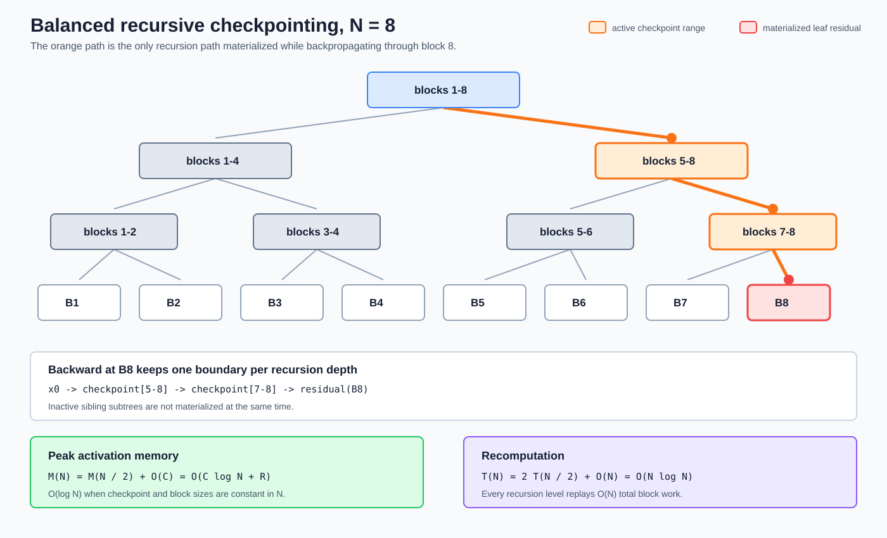
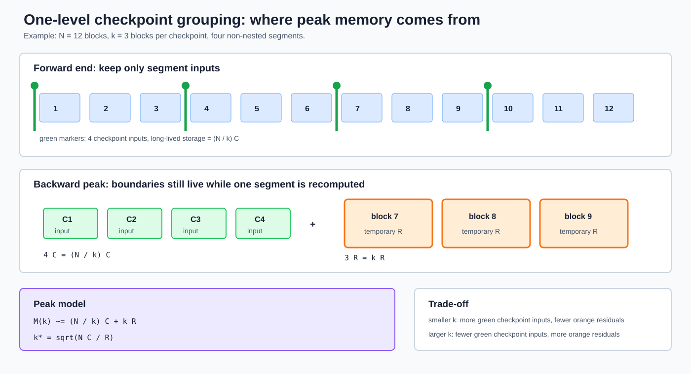
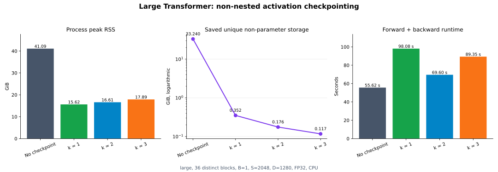

# Memory-Optimal Gradient Checkpointing 实验报告

## 1. 原问题

Handout 的 [`gradient_checkpointing`](./cs336_assignment2_systems_extracted.md#L599-L610)：

> Consider a Transformer with $N$ identical blocks stacked sequentially. Without any checkpointing, all $N$ blocks' worth of residuals are kept alive simultaneously, giving $O(N)$ peak activation memory. We have a free hand to wrap any subset of the forward pass in `checkpoint`, including nesting `checkpoint` calls inside one another.

### 1.1 问题 (a)

> What checkpointing strategy minimizes peak activation memory, ignoring the compute cost? Describe how you would arrange the `checkpoint` calls (a code sketch is fine), and give the asymptotic peak activation memory and compute of your strategy as a function of $N$. Assume the residuals saved by a single block dominate any per-checkpoint bookkeeping.

### 1.2 问题 (b)

> Consider the xl model config with batch size 4 and sequence length 2048 as above. If you only have the time/compute budget to run one step of recomputation (meaning you may not nest `checkpoint` calls), what is the best checkpointing strategy to reduce peak memory? Profile your run's peak memory to validate your hypothesis. Compare the peak memory of the next smaller and larger checkpointing block sizes to be sure.

用户指定本机实验使用 **large**，因为这是本机能完整运行的最大配置。为保证无 checkpoint 基线也能在 109 GiB 主存内完成，实验采用 `B=1,S=2048`；若保持 handout 的 `B=4`，仅 activation 的线性估算就会超过本机内存。

## 2. Handout 简答

### 2.1 (a) 递归最优策略

将 $N$ 个 blocks 近似二等分，对左右两半分别调用 `checkpoint`，并在每个子区间内继续递归二分，直到叶子只包含一个 block。Backward 处理某个叶子时，只需同时保留递归路径上 $O(\log N)$ 个 checkpoint 边界和一个 block 的临时 residual，因此峰值 activation memory 为 $O(\log N)$。每深入一层，全部 $N$ 个 blocks 会多经历一轮合计 $O(N)$ 的重计算，递归深度为 $O(\log N)$，所以总计算量为 $O(N\log N)$。这正是以更多重计算换取低于单层 checkpoint 的 $O(\sqrt N)$ 峰值。



图中整棵树表示静态递归划分，橙色只标出 backward 处理 block 8 时的活动路径。灰色 sibling subtrees 不会与当前叶子的完整 residual 同时物化；递归每深入一层只增加常数个边界 Tensor，因此同时存活的边界数量由树深度而不是叶子总数决定。

代码骨架：

```python
def recursive_checkpoint(blocks, x):
    if len(blocks) == 1:
        return blocks[0](x)
    midpoint = len(blocks) // 2
    x = checkpoint(
        lambda value: recursive_checkpoint(blocks[:midpoint], value),
        x,
        use_reentrant=False,
    )
    return checkpoint(
        lambda value: recursive_checkpoint(blocks[midpoint:], value),
        x,
        use_reentrant=False,
    )
```

### 2.2 (b) Large 实测答案

Large 配置的单 block unique residual 为 945.484 MiB，而一个 checkpoint 边界 Tensor 只有 10 MiB；对 36 层，连续最优分组为 $k^*=\sqrt{36\times10/945.484}=0.617$，受整数下界约束后应选 **每 1 层一个 checkpoint**。实测 `k=1` 的峰值 RSS 为 **15.622 GiB**，低于 `k=2` 的 16.613 GiB、`k=3` 的 17.894 GiB，也远低于无 checkpoint 的 41.090 GiB。由于 $k=1$ 已是最小合法分组，不存在更小的正整数候选；本实验比较了紧邻的更大候选 `k=2`，并额外测量 `k=3` 确认上升趋势。

## 3. Activation checkpointing 是什么

### 3.1 不要与训练状态 checkpoint 混淆

“Checkpoint”在训练系统中有两个不同含义：

| 名称 | 保存位置 | 目的 | 典型内容 |
|---|---|---|---|
| 训练状态 checkpoint | 磁盘/对象存储 | 崩溃恢复、续训 | 参数、optimizer state、step |
| Activation checkpointing | 一次训练 step 的计算图 | 用计算换显存/内存 | 少量区间输入 |

本文只讨论第二种，也常称 gradient checkpointing、activation recomputation 或 rematerialization。

### 3.2 普通 backward 为什么占用 $O(N)$ activation memory

设网络依次产生：

$$x_1=f_1(x_0),\quad x_2=f_2(x_1),\quad\ldots,\quad x_N=f_N(x_{N-1})$$

反向传播按 $f_N,f_{N-1},\ldots,f_1$ 的逆序执行。每个 block 的 VJP 通常依赖该 block 的输入、attention probability、Q/K/V、MLP 中间量和 normalization statistics，因此普通 forward 必须把所有 block residuals 保留到 backward。

若每个 block 的 saved residual 大小近似为 $R$，则：

$$M_\text{no-checkpoint}\approx NR=O(N)$$

### 3.3 Checkpoint 做了什么

#### 3.3.1 “区间函数”是什么

“区间函数”不是 PyTorch 中某种特殊的函数类型，而是本文为了描述**网络深度方向上一段连续计算**使用的名称。

设第 $l$ 个 TransformerBlock 为：

$$x_l=f_l(x_{l-1};\theta_l)$$

其中 $x_{l-1}$ 是进入该 block 的 residual-stream Tensor，$\theta_l$ 是该 block 的参数。把第 $a$ 到第 $b$ 个 blocks 连起来，就得到区间函数：

$$F_{a:b}(x_{a-1})=f_b\left(f_{b-1}\left(\cdots f_a(x_{a-1};\theta_a)\cdots;\theta_{b-1}\right);\theta_b\right)$$

它有一个清晰的计算边界：

- **区间输入**：进入第 $a$ 个 block 前的 activation $x_{a-1}$；
- **区间内部**：blocks $a,a+1,\ldots,b$ 产生的所有中间 activation；
- **区间输出**：第 $b$ 个 block 的输出 $x_b$。

例如，将 blocks 3、4、5 组成一个区间：

```python
def blocks_3_to_5(x):
    x = blocks[2](x)
    x = blocks[3](x)
    x = blocks[4](x)
    return x
```

也可以写成通用循环：

```python
def run_segment(x, segment):
    for block in segment:
        x = block(x)
    return x
```

这里的 $x$ 在数学讨论中表示区间边界状态；在 PyTorch 中，它是特征位于最后一维的完整 activation Tensor，形状通常为 `(B,S,D)`。Self-attention 会耦合不同 sequence positions，所以 checkpoint 保存和恢复的是整个 `(B,S,D)` 边界，而不是彼此独立的单 token 向量。

#### 3.3.2 参数为什么没有显式写进 `checkpoint`

代码通常只把 activation $x$ 作为 `checkpoint` 的显式参数：

```python
y = checkpoint(segment_function, x, use_reentrant=False)
```

这不表示区间函数没有模型参数。`segment_function` 通过 Python closure 或 `nn.Module` 持有 blocks，blocks 再持有参数 $\theta_a,\ldots,\theta_b$；autograd 仍然会追踪这些 leaf parameters，并在 backward 中生成对应梯度。

区间函数可以接收多个 Tensor，例如 activation、attention mask 或显式 position Tensor：

```python
y = checkpoint(segment_function, x, mask, positions, use_reentrant=False)
```

这些显式输入共同构成 recomputation 的边界状态。边界输入越多、越大，checkpoint bookkeeping 的内存 $C$ 也越大。

#### 3.3.3 为什么通常选择连续区间

`torch.utils.checkpoint.checkpoint` 技术上可以包装任意 callable，不强制它对应连续 layers。但对顺序 Transformer stack，连续区间最自然：

1. blocks 之间主要通过一条 residual stream 连接，区间入口通常只需一个 `(B,S,D)` Tensor；
2. 给定区间入口和不变的参数，可以按原顺序重放整个区间；
3. 区间外部不需要持有内部 activation；
4. 设整个网络共有 $N$ 个 blocks，每个 checkpoint 区间连续包含 $k$ 个 blocks，那么区间数量、也就是 `checkpoint(...)` 调用数量约为 $N/k$；backward 每次进入一个区间时，最多需要重新执行该区间内的 $k$ 个 blocks。

例如 $N=12,k=3$ 时，可以划分为 `[1,2,3]`、`[4,5,6]`、`[7,8,9]`、`[10,11,12]` 四个区间：

- 一共调用 4 次 `checkpoint(...)`，即 $N/k=12/3=4$；
- 原始 forward 结束后长期保留 4 个区间入口；
- backward 每次只重建当前区间的 3 个 blocks，而不是同时重建全部 12 个。

若 $N$ 不能被 $k$ 整除，区间数应写成 $\lceil N/k\rceil$，最后一个区间包含少于 $k$ 个 blocks。例如 $N=10,k=3$ 时会得到 4 个区间，大小依次为 3、3、3、1。

若包装的是有跨区间 skip connection、多个分支或外部可变状态的非连续计算，recomputation 可能需要保存更多输入，简单的 $C+kR$ 模型也不再成立。

#### 3.3.4 区间函数必须可重放

Backward 会再次调用同一个区间函数，所以在参数没有更新的前提下，它必须根据相同输入产生与原始 forward 兼容的结果。适合放入区间函数的是模型 forward 计算；不适合放入其中的是：

- `optimizer.step()` 或参数原地更新；
- 写文件、发送请求等不可重复副作用；
- 依赖会变化的全局变量；
- 未正确保存 RNG state 的随机计算。

本实验的实际分组实现见 [`gradient_checkpointing.py:L23-L42`](../cs336_systems/gradient_checkpointing.py#L23-L42)：每次先截取连续 `segment`，再将 `apply_blocks(segment, value)` 作为区间函数交给 checkpoint。

#### 3.3.5 对区间函数调用 checkpoint

对区间函数 $F(x)$ 调用：

```python
y = checkpoint(F, x, use_reentrant=False)
```

可以理解为：

1. 原始 forward 保留区间入口 $x$，但不长期保留 $F$ 内部的大部分 saved tensors；
2. backward 到达该区间时，从 $x$ 重新执行 $F$；
3. 重建局部 residual；
4. 立即完成该区间 backward；
5. 释放该区间的临时值。

Checkpoint 没有消灭 activation，而是把“所有层同时长期存活”改成“少量边界长期存活 + 当前区间短期重建”。

## 4. 一层分组 checkpoint 的内存模型

设：

- $N$：block 总数；
- $k$：每个 checkpoint 区间包含的 blocks 数；
- $C$：一个区间入口 checkpoint Tensor 的大小；
- $R$：一个 block 在普通 forward 中保留的 residual storage。

区间数约为 $N/k$，原始 forward 结束时长期保存约 $(N/k)C$；backward 重计算一个区间时，最多物化约 $kR$ 的内部 residual。因此：

$$M_\text{one-level}(k)\approx\frac{N}{k}C+kR$$



图中绿色部分是原始 forward 结束后长期存活的 $(N/k)$ 个 checkpoint inputs，橙色部分是 backward 当前重计算区间内的 $k$ 份 block residual。减小 $k$ 会增加绿色边界但缩小橙色临时区间；增大 $k$ 则相反，最优点来自这两项的平衡。

忽略整数取整，对 $k$ 求导：

$$\frac{\mathrm dM}{\mathrm dk}=-\frac{NC}{k^2}+R$$

令导数为 0：

$$k^*=\sqrt{\frac{NC}{R}}$$

若只做渐近分析并把 $C$、$R$ 都视为与 $N$ 无关的常量，则 $k=\Theta(\sqrt N)$，峰值为 $O(\sqrt N)$。

### 4.1 为什么不能机械使用 $\sqrt N$

经典的“每 $\sqrt N$ 层放一个 checkpoint”隐含了 $C$ 和 $R$ 常数因子相近。Transformer 中单 block residual 包含 attention 和 MLP 中间量，可能远大于一个 `(B,S,D)` checkpoint Tensor。

因此实际分组应使用：

$$k^*=\sqrt{\frac{NC}{R}}$$

而不是忽略系数后直接取 $\sqrt N$。本实验中 $R/C\approx94.55$，所以最优点落到合法区间下界 $k=1$。

### 4.2 一层 checkpoint 的计算量

不管 $k$ 是 1、2 还是 3：

- 原始 forward 执行 $N$ 个 blocks；
- backward 前的 recomputation 合计再执行约 $N$ 个 blocks；
- 正常 backward 仍执行 $N$ 个 block VJPs。

所以一层非嵌套 checkpoint 的总计算复杂度仍为 $O(N)$。更准确地说，**forward 形态的 block 执行次数**从原来的 $N$ 次变成约 $2N$ 次：第一次是正常 forward，第二次是在 backward 中为恢复 activation 而执行的 recomputation。正常的 block VJP/backward 仍只执行一次，并没有复制成两次。

设一个 block 的正常 forward 成本为 $T_f$，backward/VJP 成本为 $T_b$。无 checkpoint 时：

$$T_\text{normal}=N(T_f+T_b)$$

使用一层非嵌套 checkpoint 后：

$$T_\text{checkpoint}\approx N(T_f+T_f+T_b)=N(2T_f+T_b)$$

因此“forward-like 计算常数约增加一倍”不等于“整个训练 step 耗时增加一倍”。总计算量的理想比例为：

$$\frac{T_\text{checkpoint}}{T_\text{normal}}\approx\frac{2T_f+T_b}{T_f+T_b}=1+\frac{T_f}{T_f+T_b}$$

例如若 backward 的计算成本约为 forward 的两倍，即 $T_b\approx2T_f$，则无 checkpoint 的成本约为 $3NT_f$，checkpoint 后约为 $4NT_f$，理想总计算增幅约为 $4/3-1=33.3\%$，而不是 100%。

以 $N=12$ 为例：

| 计算阶段 | 无 checkpoint | 一层非嵌套 checkpoint |
|---|---:|---:|
| 原始 forward block 调用 | 12 | 12 |
| Recompute block 调用 | 0 | 约 12 |
| Block backward/VJP | 12 | 12 |

这里的 “forward-like” 指 recomputation 会重新执行该区间的线性层、attention、MLP 和 normalization 等 forward operators，以恢复 backward 所需的 activation；它不是一次新的训练 step，也不会在 recomputation 中执行 `optimizer.step()`。

实际耗时还会受到 non-reentrant early-stop、checkpoint 调用次数、Python 调度、RNG state 保存、内存带宽和 allocator 行为影响。更小的 $k$ 虽然不会改变“所有 $N$ 个 blocks 合计重算约一次”这一主项，却会产生更多 `checkpoint(...)` 调用，因此固定框架开销通常更大。

## 5. 为什么还要引入递归 checkpoint

### 5.1 第 4 节解决了什么

第 4 节研究的是**只有一层 checkpoint、禁止嵌套**的情况。把 $N$ 个 blocks 分成大小为 $k$ 的区间后：

$$M_\text{one-level}(k)\approx\frac{N}{k}C+kR$$

当 $C$、$R$ 视为常量且最优点不落在边界时，取 $k=\Theta(\sqrt N)$，得到：

$$M_\text{one-level}=O(\sqrt N),\qquad T_\text{one-level}=O(N)$$

这是题目 (b) 的约束：只允许一次 recomputation 层级。它已经将普通训练的 $O(N)$ activation memory 降为 $O(\sqrt N)$，同时让每个 block 最多额外重算约一次。

但题目 (a) 的条件更激进：

- 允许 checkpoint 内部继续嵌套 checkpoint；
- 目标是尽量降低峰值内存；
- 暂时忽略额外计算成本。

因此第 4 节的 $O(\sqrt N)$ 不是 (a) 所要求的最低目标，还可以继续递归。

### 5.2 递归 checkpoint 解决了什么

单层方案在 backward 重建一个大小为 $k$ 的区间时，仍会让该区间内部约 $kR$ 的 residual 同时存在。递归方案把这个区间再次分成两个子区间，并在子区间内部继续 checkpoint；于是“当前重建区间的大小”不再停在 $\sqrt N$，而是继续缩小，直到叶子只剩一个 block。

#### 5.2.1 为什么不在单层方案中直接令 $k=1$

可以，而且对本次 large 的有限配置，这正是最佳选择。但单层 `k=1` 只解决了 $kR$，同时把另一项 $(N/k)C$ 推到了最大：

$$M_\text{one-level}(1)=NC+R$$

原因是单层方案会依次执行 $N$ 次彼此独立的 `checkpoint(one_block, x_i)`。原始 forward 结束后，第 1 到第 $N$ 个 checkpoint 的输入 $x_0,x_1,\ldots,x_{N-1}$ 都要等待各自的 backward，因此有 $N$ 份边界 Tensor 同时长期存活。

所以单层 `k=1` 的两项分别是：

- 当前重计算区间：只有一个 block residual，即 $R$；
- 长期 checkpoint 边界：共有 $N$ 份，即 $NC$。

若 $C$ 是与 $N$ 无关的非零常量，则 $NC+R=O(N)$。也就是说，`k=1` 将重计算区间压到最小，却没有解决 checkpoint 边界数量随网络深度线性增长的问题。

递归方案的价值在于同时做到：

1. 叶子区间仍然只包含一个 block，所以临时 residual 仍约为 $R$；
2. 外层 checkpoint 会遮蔽其内部递归区间的长期保存，只需保留当前递归路径上的 $O(\log N)$ 个边界，而不是全部 $N$ 个边界。

因此两者的深度相关项不同：

$$M_\text{one-level}(k=1)=O(NC+R),\qquad M_\text{recursive}=O(C\log N+R)$$

在本次实验中，$N=36,C=10$ MiB，所以单层 `k=1` 的边界总量只有 360 MiB。相对于 15.622 GiB 的实际进程峰值，这部分已经很小；递归即使继续把边界项压到 $O(\log N)$，也只能再节省几百 MiB，却会把计算量提高到 $O(N\log N)$。因此：

- **回答本机 large 的实际选择**：直接使用单层 `k=1`；
- **回答题目 (a) 的渐近最低内存**：使用递归 checkpoint。

可以把两种策略对比为：

| 策略 | 区间内部是否继续 checkpoint | 峰值 activation | 计算量 |
|---|---|---:|---:|
| 单层最优分组 | 否 | $O(\sqrt N)$ | $O(N)$ |
| 平衡递归二分 | 是 | $O(\log N)$ | $O(N\log N)$ |

所以引入递归不是因为第 4 节推导错误，而是因为两个问题的计算预算不同：

- **(b)** 只允许一层 recomputation，使用第 4 节；
- **(a)** 允许多层 recomputation 并优先压低内存，使用递归。

本机 large 实验属于 (b)，实际只测了非嵌套 `k=1/2/3`。递归 large 会显著增加计算，因此只在 toy model 上验证正确性。

### 5.3 一个容易混淆的术语

**Recursive** 描述 checkpoint 的组织结构：一个 checkpointed 区间内部是否继续嵌套更小的 checkpoint。`use_reentrant` 则只是 PyTorch 对单次 `checkpoint(...)` 调用的底层实现选项，与是否递归没有直接关系。

本文只需记住：

- (a) 使用 recursive structure，把区间递归二分；
- 所有 `checkpoint(...)` 调用统一使用 PyTorch 当前推荐的 `use_reentrant=False`；
- `use_reentrant` 的历史实现差异不影响本文关于 $O(\sqrt N)$ 与 $O(\log N)$ 的主线推导。

### 5.4 本项目的递归实现

实现见 [`gradient_checkpointing.py:L45-L67`](../cs336_systems/gradient_checkpointing.py#L45-L67)。它对 block 区间做平衡二分，并对两个子区间分别调用：

```python
checkpoint(child_range, x, use_reentrant=False)
```

“平衡二分”属于 recursive structure；`use_reentrant=False` 则是每个 checkpoint call 的 autograd implementation。二者解决的是不同问题。

### 5.5 峰值内存

Backward 进入某个叶子 block 时，每层递归只需保留常数个边界 Tensor。递归深度为 $\lceil\log_2N\rceil$，因此：

$$M_\text{recursive}(N)=M_\text{recursive}(\lceil N/2\rceil)+O(C)=O(C\log N+R)$$

当 $C$、$R$ 相对 $N$ 都视为常量时，峰值为 $O(\log N)$。

### 5.6 计算量

递归每一层的区间重算合计覆盖 $O(N)$ 个 block，层数为 $O(\log N)$：

$$T_\text{recursive}(N)=2T_\text{recursive}(N/2)+O(N)=O(N\log N)$$

在一个 8-block toy stack 上，本实现测得：

| 策略 | 总 block forward 调用 |
|---|---:|
| 无 checkpoint | 8 |
| 非嵌套 `k=1` | 16 |
| 非嵌套 `k=2` | 16 |
| 递归二分 | 24 |

非 reentrant checkpoint 的 early-stop 会在所需 Tensor 全部重建后停止，因此常数可能小于朴素的 $N(1+\log_2N)$，但渐近上仍为 $O(N\log N)$。

### 5.7 关于理论上的 $O(1)$

若允许实现完全自定义的离线反向调度，并愿意在计算每一层梯度前都从最初输入重算整个前缀，模型深度相关的 checkpoint 数可以压到 $O(1)$，代价是 $O(N^2)$ 计算。Handout 此处要求用可嵌套的 `torch.utils.checkpoint` 安排静态 forward，并紧接着讨论 recursive checkpointing；因此本文把平衡递归的 $O(\log N)$ memory、$O(N\log N)$ compute 作为题目 (a) 的目标答案，同时明确它不是任意 pebble-game 调度下的绝对理论下界。

## 6. 实现

### 6.1 策略模块

[`cs336_systems/gradient_checkpointing.py`](../cs336_systems/gradient_checkpointing.py) 只负责 block stack 的执行策略：

- [`apply_blocks()`](../cs336_systems/gradient_checkpointing.py#L15-L20)：无 checkpoint；
- [`apply_grouped_checkpointing()`](../cs336_systems/gradient_checkpointing.py#L23-L42)：固定 $k$ 的单层非嵌套分组；
- [`apply_recursive_checkpointing()`](../cs336_systems/gradient_checkpointing.py#L45-L67)：递归二分；
- [`apply_checkpoint_strategy()`](../cs336_systems/gradient_checkpointing.py#L70-L95)：统一调度入口。

分组实现的核心是：

```python
for start in range(0, len(blocks), blocks_per_checkpoint):
    segment = ...
    x = checkpoint(
        lambda value: apply_blocks(segment, value),
        x,
        use_reentrant=False,
        preserve_rng_state=False,
    )
```

每个 block 只属于一个 segment，因此 (b) 没有嵌套 checkpoint，所有 blocks 最多经历一层 recomputation。

### 6.2 Checkpoint 调用参数

本文所有调用都显式传入 PyTorch 当前推荐的 `use_reentrant=False`。它不是实验变量，也不影响本文对单层分组与递归结构的复杂度比较；理解后文只需记住 checkpoint 会在 backward 中重算区间 activation。

### 6.3 为什么设置 `preserve_rng_state=False`

本项目 `TransformerBlock` 没有 dropout，也没有 forward-time 随机算子，所以重计算不需要恢复 RNG 状态。关闭保存/恢复 RNG state 可以减少与算法无关的固定开销。

若 checkpoint 区域包含 dropout、随机采样或其他 RNG 操作，必须保留 RNG state，或者自行保证原始 forward 与 recomputation 完全一致；否则可能得到错误梯度。

### 6.4 Profile 脚本

[`scripts/profile_gradient_checkpointing.py`](../scripts/profile_gradient_checkpointing.py)：

1. 按 large config 构造 36 个参数独立的 `TransformerBlock`，见 [`L39-L60`](../scripts/profile_gradient_checkpointing.py#L39-L60)；
2. 按 `--blocks-per-checkpoint` 选择策略，见 [`L63-L70`](../scripts/profile_gradient_checkpointing.py#L63-L70)；
3. 用通用 `capture_saved_tensors()` 统计原始 forward 结束时的长期保存集合，见 [`L106-L123`](../scripts/profile_gradient_checkpointing.py#L106-L123)；
4. 用 Linux `ru_maxrss` 记录整个进程的 high-water RSS，见 [`L24-L31`](../scripts/profile_gradient_checkpointing.py#L24-L31)；
5. 独立记录 forward/backward 时间、参数/梯度大小和数值摘要。

Loss 在 `capture_saved_tensors()` 外构造，因此 saved-tensor 统计严格覆盖 block stack，不包含 `output.square().mean()` 自己保存的输出。

### 6.5 测量模块与 workload 解耦

本实验复用 [`saved_tensor_profiler.py`](../cs336_systems/saved_tensor_profiler.py)。Checkpoint 策略不知道如何记录 storage，profiler 也不知道网络是否使用 checkpoint；profile CLI 是两者唯一的组合位置。

## 7. 正确性测试

[`tests/test_gradient_checkpointing.py`](../tests/test_gradient_checkpointing.py) 使用 4 层 toy residual stack，对比：

- 无 checkpoint；
- 非嵌套 `k=2`；
- 递归二分 checkpoint。

测试逐项比较：

1. forward 输出；
2. 输入梯度；
3. 每个 block 的所有参数梯度；
4. 非法 `k=0` 的错误处理。

结果：

```text
3 passed
```

Large 四组独立进程的数值摘要也完全相同：

| 指标 | 四组共同结果 |
|---|---:|
| Loss | 23.7504615784 |
| Output sum | 365478.055853 |
| Input gradient norm | 1.520368059 |
| Parameter gradient norm | 176.984533900 |

## 8. Large 实验设置

### 8.1 模型

| 项目 | 值 |
|---|---:|
| 配置 | large |
| Blocks | 36 个独立参数的 `TransformerBlock` |
| $d_\text{model}$ | 1280 |
| $d_\text{ff}$ | 5120 |
| Attention heads | 20 |
| Batch size | 1 |
| Sequence length | 2048 |
| Dtype | FP32 |
| Block 参数量 | 943,810,560，即 0.944B |
| 参数 storage | 3.516 GiB |
| Backward 后参数梯度 | 3.516 GiB |
| 输入/checkpoint Tensor | 10 MiB |

这里没有 embedding、final norm 和 LM head，因为题目研究的是 $N$ 个 Transformer blocks 的 checkpoint 分组。与 handout 的四层示例不同，本实验构造了 36 个参数独立的 blocks，并没有让它们共享一套参数。

### 8.2 为什么使用 `B=1`

本机有约 109 GiB 主存。Large、`B=1,S=2048` 的无 checkpoint block stack 已实测达到 41.090 GiB 峰值；activation 随 batch 近似线性增长，`B=4` 很可能超过物理内存并进入 swap 或 OOM。

因此本实验保留最影响 attention memory 的 `S=2048` 和完整 36 层，仅把 batch 降为 1。这个调整不改变 checkpoint 分组的机制，也不改变 $M(k)=NC/k+kR$ 的优化方法。

### 8.3 其他设置

| 项目 | 值 |
|---|---|
| 设备 | CPU |
| PyTorch | `2.11.0+cu130` |
| CPU | Intel Xeon Platinum 8336C |
| 线程限制 | `OMP_NUM_THREADS=50`, `MKL_NUM_THREADS=50` |
| CPU affinity | `taskset -c 0-49` |
| Optimizer | 不创建 |
| Compile | 不启用 |
| 随机种子 | 0 |
| 每个配置 | 独立进程 |

不创建 optimizer 是为了隔离 activation checkpointing；AdamW 的 $m/v$ 与 checkpoint 分组无关，只会增加固定内存。未启用 `torch.compile` 是为了单独测量 checkpoint 策略，而不把 AOTAutograd 的 saved-tensor 分区优化混入变量。

### 8.4 峰值定义

本实验使用 Linux `resource.getrusage(RUSAGE_SELF).ru_maxrss`：

- 它是进程从启动到采样时刻的 RSS high-water mark；
- 不会像低频轮询那样漏掉短暂峰值；
- 每种配置必须运行在独立进程，否则前一个配置的历史峰值无法清零；
- 它包含参数、梯度、activation、allocator cache、Python runtime 和库 workspace。

因此结果是真实进程峰值，但不是纯 activation bytes。Saved-tensor profiler 另外提供 forward 长期保存集合，用于解释峰值来源。

## 9. 单 block 校准

在相同 `B=1,S=2048,D=1280` 下单独运行一个 large block：

| 指标 | 值 |
|---|---:|
| Non-parameter logical saved bytes | 1.325 GiB |
| Unique non-parameter saved storage $R$ | 945.484 MiB |
| Block 参数梯度 | 100.01 MiB |
| Checkpoint 输入 $C$ | 10 MiB |

本次统计把 loss 放在 hook 外，因此 $R$ 不包含 square-loss 保存的额外 10 MiB 输出。与前一份 block 报告中的 955.48 MiB 相差恰好 10 MiB，原因就是统计边界不同。

代入 $N=36$：

$$k^*=\sqrt{\frac{36\times10}{945.484}}=0.617$$

因此解析预测是整数下界 $k=1$。

三个候选的简化 activation 预测：

| $k$ | Checkpoint 数 $\lceil N/k\rceil$ | 边界 storage | 当前区间 residual | 预测合计 |
|---:|---:|---:|---:|---:|
| 1 | 36 | 360 MiB | 945.484 MiB | 1.275 GiB |
| 2 | 18 | 180 MiB | 1890.969 MiB | 2.022 GiB |
| 3 | 12 | 120 MiB | 2836.453 MiB | 2.887 GiB |

这只是 checkpoint 相关 activation 的简化模型，不包含参数、梯度、临时 workspace 和 allocator 行为。

## 10. 实测结果



### 10.1 Saved tensors 与峰值 RSS

| 策略 | $k$ | Checkpoint 数 | Save references | Forward unique non-parameter storage | Model-ready RSS | Peak RSS | 相对无 checkpoint |
|---|---:|---:|---:|---:|---:|---:|---:|
| 无 checkpoint | - | 0 | 1728 | 33.240 GiB | 4.019 GiB | 41.090 GiB | baseline |
| 每层 checkpoint | 1 | 36 | 72 | 0.352 GiB | 4.013 GiB | **15.622 GiB** | **-61.98%** |
| 每 2 层 checkpoint | 2 | 18 | 36 | 0.176 GiB | 4.011 GiB | 16.613 GiB | -59.57% |
| 每 3 层 checkpoint | 3 | 12 | 24 | 0.117 GiB | 4.016 GiB | 17.894 GiB | -56.45% |

### 10.2 阶段 RSS

| 策略 | Forward 后 RSS | Backward 后 RSS | 进程峰值相对 model-ready 增量 |
|---|---:|---:|---:|
| 无 checkpoint | 39.897 GiB | 13.142 GiB | 37.071 GiB |
| $k=1$ | 10.178 GiB | 13.747 GiB | 11.609 GiB |
| $k=2$ | 10.176 GiB | 13.973 GiB | 12.603 GiB |
| $k=3$ | 10.177 GiB | 14.315 GiB | 13.878 GiB |

### 10.3 时间

| 策略 | Forward | Backward | 合计 | 相对 baseline |
|---|---:|---:|---:|---:|
| 无 checkpoint | 20.343 s | 35.273 s | 55.615 s | 1.00x |
| $k=1$ | 32.220 s | 65.861 s | 98.081 s | 1.76x |
| $k=2$ | 23.172 s | 46.425 s | 69.597 s | 1.25x |
| $k=3$ | 29.742 s | 59.611 s | 89.353 s | 1.61x |

每组只运行一次，时间受共享主机调度、内存页分配和 checkpoint 调用数量影响，不能用来建立稳定吞吐排名。理论上三个非嵌套配置都把 block forward 重算约一次，渐近计算量相同；`k=1` 的 36 次 checkpoint 调用有更高固定调度开销。

## 11. 结果解释

### 11.1 无 checkpoint 与单 block 校准严格吻合

单 block unique residual 为 945.484 MiB。36 个 blocks：

$$36\times945.484\ \text{MiB}=33.240\ \text{GiB}$$

实测无 checkpoint 的 forward unique non-parameter storage 正好是 33.240 GiB，说明：

- 每层 residual 的线性累积确实是主要来源；
- storage 去重逻辑没有把共享引用重复计算；
- 36 个 blocks 的 activation 生命周期延续到 backward。

### 11.2 Checkpoint 边界保存量符合解析值

非 reentrant checkpoint 对每个区间向外层 hooks 暴露：

- 一个零元素 dummy Tensor；
- 一个区间输入 Tensor。

零元素 Tensor 不贡献 storage，所以：

- `k=1`：36 个输入，共 360 MiB，save references 为 $36\times2=72$；
- `k=2`：18 个输入，共 180 MiB，save references 为 36；
- `k=3`：12 个输入，共 120 MiB，save references 为 24。

这些数值与 JSON 完全一致。

### 11.3 为什么 saved storage 更少，峰值却更高

从 `k=1` 增大到 `k=3` 时，forward 结束后的长期 checkpoint storage 从 360 MiB 降到 120 MiB，但峰值 RSS 从 15.622 GiB 上升到 17.894 GiB。

原因是峰值出现在 backward recomputation：

- `k=1` 一次只重建一个 block；
- `k=2` 一次需要保留两个 blocks 的局部 residual；
- `k=3` 一次需要保留三个 blocks 的局部 residual。

减少的 checkpoint 边界只有每组几十到几百 MiB，而新增的单 block residual 接近 945 MiB，所以 $kR$ 的增长压过了 $NC/k$ 的下降。

### 11.4 为什么实测峰值高于简化公式

以 `k=1` 为例，公式只估算：

$$36C+R\approx1.275\ \text{GiB}$$

但 model-ready 到进程峰值的实测增量为 11.609 GiB。差额来自：

- 3.516 GiB 参数梯度；
- attention/MLP backward 临时 Tensor；
- GEMM/reduction workspace；
- PyTorch CPU allocator 保留的已释放内存页；
- autograd graph metadata；
- RSS 包含 Python 和底层库的其他驻留页。

公式用于选择 $k$ 和解释趋势，不是完整峰值预测器。

### 11.5 为什么 checkpoint forward 后 RSS 都约 10.18 GiB

三个 checkpoint 配置的 live saved storage 分别只有 360、180、120 MiB，但 forward 后 RSS 都约 10.18 GiB。CPU allocator 不必把已经释放的临时页立即归还操作系统，因此 RSS 看不到同等幅度的下降；saved-tensor storage 才能直接显示长期保留集合随 checkpoint 数变化。

这也是为什么报告同时给出：

- saved unique storage：回答“autograd graph 保活什么”；
- process peak RSS：回答“进程实际达到多高”。

## 12. 为什么 `k=1` 是本机 large 的最佳单层策略

本题限制“只允许一步 recomputation”，即不能递归嵌套。所有非嵌套分组都把每个 block 额外执行约一次，故主要计算量相近；可调变量只剩长期 checkpoint 数与单次重建区间大小。

本机 large 配置中：

$$R=945.484\ \text{MiB}\gg C=10\ \text{MiB}$$

减少一个长期 checkpoint 只能节省约 10 MiB，但把 $k$ 增大 1 会让 backward 同时物化约一层、即接近 945 MiB 的额外 residual。解析模型和 RSS 实测都因此选择最小合法值 `k=1`。

这不是所有模型的普遍答案。若 block residual 更小、checkpoint Tensor 更大或 $N$ 显著增加，$k^*=\sqrt{NC/R}$ 可能落在 1 以上，届时应比较 $\lfloor k^*\rfloor$ 和 $\lceil k^*\rceil$。

## 13. PyTorch 实现细节与陷阱

### 13.1 Forward 必须可重放

Checkpoint 假设 recomputation 与原始 forward 语义一致。以下变化可能破坏正确性：

- forward 依赖会变化的全局变量；
- 原地修改 checkpoint 输入；
- 随机算子但未保存 RNG state；
- 原始 forward 与 recomputation 进入不同 autocast/device 状态；
- forward 有不可重复的 I/O 或其他副作用。

### 13.2 参数不是作为 checkpoint 参数传入

Segment closure 捕获对应 `nn.Module` 对象，参数仍由 autograd 正常追踪。`use_reentrant=False` 支持这种方式，不要求每个参数显式出现在 `checkpoint(function, *args)` 中。

### 13.3 不要在 checkpoint 内做 optimizer step

Checkpointed function 应表达可重放的纯 forward 区域。参数更新、日志写入、随机状态修改和外部副作用不应放在其中，因为 backward 会再次调用它。

### 13.4 与 autocast 的关系

若原始 forward 使用 autocast，recomputation 必须使用兼容的 autocast 上下文。`checkpoint` 的 `context_fn` 可以为原始 forward 与 recomputation 分别提供 context manager；本实验纯 FP32，不需要额外处理。

### 13.5 与 `torch.compile` 的关系

`torch.compile` 可能改变 saved-tensor 分区、融合和重计算决策。Checkpoint 仍可组合使用，但应在最终组合下重新 profile，不能把 eager checkpoint 的峰值和 compiled block 的 residual 数字直接拼接预测。

## 14. 可重复运行

单 block 校准：

```bash
OMP_NUM_THREADS=50 MKL_NUM_THREADS=50 taskset -c 0-49 \
uv run python scripts/profile_gradient_checkpointing.py \
  --model-size large --num-layers 1 \
  --batch-size 1 --context-length 2048 \
  --blocks-per-checkpoint 0 \
  --output-json benchmark_results/gradient_checkpointing/large_b1_s2048_single_block.json
```

无 checkpoint：

```bash
OMP_NUM_THREADS=50 MKL_NUM_THREADS=50 taskset -c 0-49 \
uv run python scripts/profile_gradient_checkpointing.py \
  --model-size large --batch-size 1 --context-length 2048 \
  --blocks-per-checkpoint 0 \
  --output-json benchmark_results/gradient_checkpointing/large_b1_s2048_none.json
```

分别将 `--blocks-per-checkpoint` 改为 `1`、`2`、`3`，输出到对应 `group1/group2/group3.json`，即可复现实验组。

递归策略使用：

```bash
uv run python scripts/profile_gradient_checkpointing.py \
  --model-size large --batch-size 1 --context-length 2048 \
  --blocks-per-checkpoint -1 \
  --output-json benchmark_results/gradient_checkpointing/large_b1_s2048_recursive.json
```

递归 large 实验具有 $O(N\log N)$ 重计算成本，本报告只通过小模型测试验证实现正确性，没有执行该重任务。

生成图表：

```bash
uv run python scripts/plot_gradient_checkpointing.py
```

原始 JSON 位于 `benchmark_results/gradient_checkpointing/`，该目录已被 `.gitignore` 排除。

## 15. 结论

1. 普通反向传播保留全部 36 层 residual，forward unique saved storage 为 33.240 GiB，进程峰值达到 41.090 GiB。
2. 在只能做一层 recomputation 时，内存模型是 $M(k)\approx NC/k+kR$；large 实测的 $R/C\approx94.55$，使最优分组落在下界 `k=1`。
3. `k=1` 将进程峰值降至 15.622 GiB，比无 checkpoint 降低 61.98%；`k=2` 和 `k=3` 的峰值依次升至 16.613 和 17.894 GiB。
4. 若允许递归二分 checkpoint，目标复杂度是 $O(\log N)$ activation memory 与 $O(N\log N)$ compute；本实现已通过输出、输入梯度和全部参数梯度一致性测试。

## 16. 参考资料

1. [PyTorch `torch.utils.checkpoint`](https://docs.pytorch.org/docs/stable/checkpoint.html)
2. [Training Deep Nets with Sublinear Memory Cost](https://arxiv.org/abs/1604.06174)
3. [PyTorch saved-tensor hooks](https://docs.pytorch.org/docs/stable/autograd.html#torch.autograd.graph.saved_tensors_hooks)
