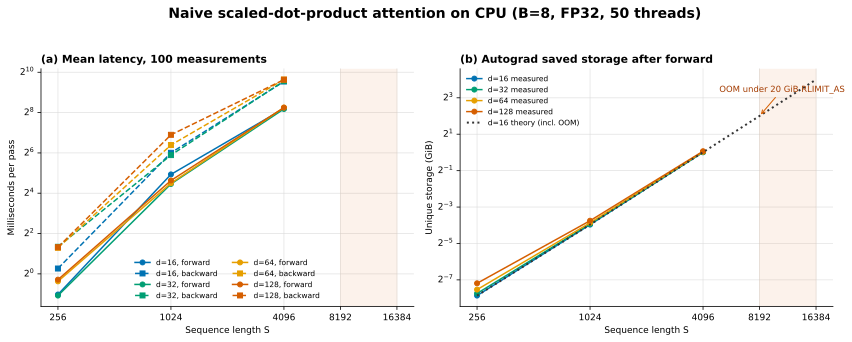

# PyTorch Attention CPU Benchmark 实验报告

## 1. 原问题

Handout 的 [`pytorch_attention`](./cs336_assignment2_systems_extracted.md#L623-L647) 要求：

1. 固定 batch size 为 8，不使用 multi-head 维度；
2. 遍历 $d_{\text{model}}\in\{16,32,64,128\}$ 与 $S\in\{256,1024,4096,8192,16384\}$ 的笛卡尔积；
3. 为 $Q,K,V$ 创建随机输入；
4. warmup 后分别测量 100 次 forward 和 100 次 backward；
5. 测量 backward 开始前的内存；
6. 报告耗时或 OOM、最小 OOM 配置的内存核算、saved memory 随 $S$ 的变化，以及消除该内存成本的方法。

本机没有适合该实验的 CUDA GPU，因此本报告在 CPU 上完成同一参数网格。为稳定复现 OOM，每个 case 的进程虚拟地址空间上限固定为 20 GiB。

## 2. 结论摘要

- 在 20 GiB `RLIMIT_AS` 下，$S\le4096$ 的 12 个 case 全部成功，$S\ge8192$ 的 8 个 case 全部 OOM。最小 OOM 配置为 `B=8,S=8192,d=16,FP32`。
- `S=8192` 可以完成 forward，但 warmup backward 在申请一个 2 GiB 的 score-sized buffer 时 OOM；`S=16384` 在首次 forward 计算 score 时申请 8 GiB Tensor 即 OOM。
- 对当前 naive attention 和自定义 softmax，forward 后由 Autograd 保留的唯一 storage 精确满足 $M_\text{saved}=2BS^2e+3BSde+12BS$，其中 FP32 元素大小 $e=4$ bytes。主导项为 $2BS^2e$，因此 saved memory 对 $S$ 呈二次增长。
- `S=8192,d=16` 的唯一 saved storage 为 4.012451 GiB。单独进行 forward-only 测量时，backward 边界 RSS 为 4.507679 GiB，虚拟地址空间为 13.134045 GiB。Backward 还需多个 $O(BS^2)$ 临时 Tensor，最终触及 20 GiB 地址空间上限。
- 根本解决方案是 FlashAttention 风格的 tiled online softmax：不物化完整的 `(B,S,S)` score/probability，并在 backward 中按 tile 重算概率。额外 activation memory 可从 $O(BS^2)$ 降到 $O(BSd)$，计算复杂度仍为 $O(BS^2d)$。



## 3. 实验设计

### 3.1 Attention 实现与张量布局

实验直接调用 Assignment 1 的 naive [`scaled_dot_product_attention`](../../assignment1-basics/cs336_basics/model.py#L121-L133)：

```python
scores = Q @ K.transpose(-2, -1) / math.sqrt(d_k)
attn = softmax(scores, dim=-1)
output = attn @ V
```

数学上每个 token 的 $q_i,k_j,v_j$ 都按列向量理解，单个 score 为 $q_i^\top k_j/\sqrt d$。在 PyTorch 中特征位于最后一维，`Q/K/V` 的实际布局是 `(B,S,d)`，每个 token 向量表现为最后一维的一行，因此 batched 实现使用 `Q @ K.transpose(-2, -1)` 得到 `(B,S,S)`。这是数学列向量约定与框架张量布局的显式区分。

本实验不使用 mask，也没有 head 维度。所有输入、输出和中间浮点 Tensor 均为 FP32。

### 3.2 机器与软件

| 项目 | 配置 |
|---|---|
| CPU | 2 × Intel Xeon Platinum 8336C @ 2.30 GHz |
| 物理核心 | 56 cores，2 个 NUMA nodes，每核 1 thread |
| 主存 | 109 GiB |
| 操作系统 | Linux 5.4.143.bsk.8-amd64, x86-64 |
| PyTorch | 2.11.0+cu130，本实验只使用 CPU |
| BLAS/并行后端 | MKL + OpenMP |
| CPU affinity | `taskset -c 0-49` |
| PyTorch/OMP/MKL threads | 50 |
| 每 case 地址空间上限 | 20 GiB `RLIMIT_AS` |
| 随机种子 | 0 |

### 3.3 计时、内存和故障隔离

Benchmark 的核心实现见 [`attention_benchmark.py:L81-L184`](../cs336_systems/attention_benchmark.py#L81-L184)，进程隔离与参数网格见 [`benchmark_attention_cpu.py:L23-L225`](../scripts/benchmark_attention_cpu.py#L23-L225)。

每个 case 的步骤为：

1. 在导入 PyTorch 前设置 20 GiB `RLIMIT_AS`；
2. 创建带梯度的 $Q,K,V$ 和固定 upstream gradient；
3. 执行 5 次完整 forward + backward warmup；
4. 在启用梯度的情况下独立计时 100 次 forward，并在每次后释放输出和计算图；
5. 使用 `saved_tensors_hooks` 再构建一次图，记录 Autograd saved tensors，并读取 backward 前 RSS；
6. 在同一张图上用 `retain_graph=True` 计时 100 次 backward，每次先将 `Q/K/V.grad` 设为 `None`；
7. 每个 `(S,d)` 运行在独立子进程中，单 case timeout 为 300 秒。

CPU operator 对调用线程同步返回，不存在 CUDA stream 的异步计时问题。代码仍保留统一的 `_synchronize()`，仅当设备为 CUDA 时才调用 `torch.cuda.synchronize()`。

`RLIMIT_AS` 限制的是整个进程的虚拟地址空间，不是“允许 PyTorch Tensor 使用 20 GiB RSS”。共享库映射、线程栈、allocator 保留区和其他 runtime 映射也会占用该预算。因此报告同时记录 saved storage、RSS 和虚拟地址空间，不能把三者混为同一个指标。

## 4. 实验结果

表中时间为 100 次测量的 `mean ± population std`。RSS 是构建待 backward 的计算图后、调用 backward 前的进程 resident set；Saved 是 `saved_tensors_hooks` 按 storage 去重后的物理字节。OOM case 没有合法的 100 次计时结果。

| $S$ | $d$ | Forward (ms) | Backward (ms) | RSS before backward (GiB) | Saved unique (MiB) | 状态 |
|---:|---:|---:|---:|---:|---:|---|
| 256 | 16 | 0.492 ± 0.199 | 1.203 ± 0.294 | 0.520 | 4.398 | OK |
| 256 | 32 | 0.474 ± 0.102 | 2.537 ± 5.304 | 0.529 | 4.773 | OK |
| 256 | 64 | 0.773 ± 0.335 | 2.456 ± 0.953 | 0.525 | 5.523 | OK |
| 256 | 128 | 0.821 ± 0.420 | 2.499 ± 5.471 | 0.530 | 7.023 | OK |
| 1024 | 16 | 30.573 ± 23.015 | 64.164 ± 32.066 | 0.573 | 65.594 | OK |
| 1024 | 32 | 22.004 ± 8.871 | 59.364 ± 21.526 | 0.581 | 67.094 | OK |
| 1024 | 64 | 22.564 ± 10.003 | 83.874 ± 47.290 | 0.570 | 70.094 | OK |
| 1024 | 128 | 24.778 ± 12.213 | 119.157 ± 67.182 | 0.592 | 76.094 | OK |
| 4096 | 16 | 293.811 ± 18.366 | 745.046 ± 44.190 | 1.539 | 1030.375 | OK |
| 4096 | 32 | 290.168 ± 18.180 | 755.483 ± 43.565 | 1.574 | 1036.375 | OK |
| 4096 | 64 | 304.095 ± 20.608 | 796.009 ± 42.012 | 1.575 | 1048.375 | OK |
| 4096 | 128 | 303.620 ± 21.652 | 793.361 ± 36.725 | 1.628 | 1072.375 | OK |
| 8192 | 16 | OOM | OOM | - | - | warmup backward OOM |
| 8192 | 32 | OOM | OOM | - | - | warmup backward OOM |
| 8192 | 64 | OOM | OOM | - | - | warmup backward OOM |
| 8192 | 128 | OOM | OOM | - | - | warmup backward OOM |
| 16384 | 16 | OOM | OOM | - | - | first forward OOM |
| 16384 | 32 | OOM | OOM | - | - | first forward OOM |
| 16384 | 64 | OOM | OOM | - | - | first forward OOM |
| 16384 | 128 | OOM | OOM | - | - | first forward OOM |

### 4.1 时间结果解读

Naive attention 的两个矩阵乘法需要 $O(BS^2d)$ 计算，softmax 需要 $O(BS^2)$ 计算。固定 $B$ 和 $d$ 时，主项随 $S^2$ 增长；固定 $B$ 和 $S$ 时，矩阵乘法随 $d$ 线性增长，但 score 的读写和 softmax 与 $d$ 无关。

在本机上，`S=4096` 的 forward 均值约 290 至 304 ms，backward 约 745 至 796 ms。此时 512 MiB 的 score Tensor 读写和 softmax 已成为强主导项，所以将 $d$ 从 16 增到 128 并没有产生理想化的 8 倍时间增长。`S=256/1024` 的标准差较大，说明小 case 容易受 50-thread 启动、NUMA 调度、CPU 频率和系统负载影响；这些均值只能代表本机该次 CPU 实验，不能替代 GPU kernel benchmark。

### 4.2 OOM 发生在哪里

所有 `S=8192` case 都在 warmup backward 中失败，错误为：

```text
DefaultCPUAllocator: can't allocate memory:
you tried to allocate 2147483648 bytes
```

即 backward 需要再申请一个 2 GiB 的 `(B,S,S)` FP32 buffer。所有 `S=16384` case 则在首次 forward 的 score 计算中失败，请求大小为 8 GiB：

```text
DefaultCPUAllocator: can't allocate memory:
you tried to allocate 8589934592 bytes
```

因此在本实验规定的 20 GiB 地址空间下，最小 OOM 点是 `B=8,S=8192,d=16,FP32`，且决定边界的是 $S$ 而不是 $d$。

## 5. 最小 OOM 配置的内存核算

### 5.1 基本 Tensor 大小

令 FP32 元素大小为 $e=4$ bytes，则单个 `Q/K/V/output` Tensor 的大小为 $A=BSde$，单个 score 或 attention probability Tensor 的大小为 $M=BS^2e$。

对 `B=8,S=8192,d=16`：

$$A=8\times8192\times16\times4=4{,}194{,}304\ \text{bytes}=4\ \text{MiB}$$

$$M=8\times8192^2\times4=2{,}147{,}483{,}648\ \text{bytes}=2\ \text{GiB}$$

### 5.2 Autograd 为什么保存 8 个逻辑引用

当前实现由两次 matmul 和手写 stable softmax 组成。Backward 所需的 saved values 包括：

| 来源 | 保存内容 | 唯一 storage |
|---|---|---:|
| `Q @ K.T` | $Q,K$ | $2A$ |
| `max` | 每行 argmax，int64 | $8BS$ |
| `exp` | `x_exp` | $M$ |
| 除法 | `x_exp` 的另一个引用、每行 denominator | 已有 $M$ + $4BS$ |
| `attn @ V` | attention probability、$V$ | $M+A$ |

`x_exp` 被两个 backward node 引用，因此 logical bytes 会重复计算它，但 unique storage 只计算一次。由此得到 $M_\text{saved,unique}=2M+3A+12BS$ 和 $M_\text{saved,logical}=3M+3A+12BS$。

代入最小 OOM 配置：

$$M_\text{saved,unique}=2\times2\ \text{GiB}+3\times4\ \text{MiB}+0.75\ \text{MiB}=4.012451\ \text{GiB}$$

$$M_\text{saved,logical}=3\times2\ \text{GiB}+3\times4\ \text{MiB}+0.75\ \text{MiB}=6.012451\ \text{GiB}$$

这里的 6.012451 GiB 不表示实际占用了 6.012451 GiB 物理 storage，它包含同一 `x_exp` storage 的重复逻辑引用。内存容量分析应使用 4.012451 GiB unique storage。

### 5.3 为什么 4.01 GiB saved storage 会触及 20 GiB 上限

为了测量 OOM 前的边界，额外运行了同配置的 forward-only probe。结果为：

| 指标 | 实测值 |
|---|---:|
| Forward 状态 | 成功 |
| Saved logical bytes | 6.012451 GiB |
| Saved unique storage | 4.012451 GiB |
| RSS before backward | 4.507679 GiB |
| Virtual memory before backward | 13.134045 GiB |
| 进程地址空间上限 | 20 GiB |
| Output | 4 MiB |
| Upstream gradient | 4 MiB |

Backward 不能只在 4.01 GiB saved storage 上原地完成。它至少要产生对 attention probability 的 `(B,S,S)` 梯度，并在 softmax VJP、`QK^T` VJP 和两个 matmul VJP 之间分配、读取和释放多个 score-sized 临时 Tensor。Forward 边界时进程已经映射 13.13 GiB 虚拟地址空间；Backward 运行一段后，再请求一个 2 GiB 连续 buffer 时剩余地址空间预算不足，于是 allocator 返回 OOM。

这也解释了为什么不能做“4.01 GiB saved < 20 GiB，所以不应 OOM”的比较：`RLIMIT_AS` 还包括 runtime 映射与 allocator 保留地址，而且 backward workspace 不属于 forward saved storage。

### 5.4 与成功配置对照

`d=16` 时的 measured/predicted unique saved storage 为：

| $S$ | 单个 score $M$ | Unique saved |
|---:|---:|---:|
| 256 | 2 MiB | 4.398 MiB |
| 1024 | 32 MiB | 65.594 MiB |
| 4096 | 512 MiB | 1030.375 MiB |
| 8192 | 2 GiB | 4.012451 GiB，forward-only |
| 16384 | 8 GiB | 16.025 GiB，理论值，forward OOM |

当 $S$ 从 1024 增大 4 倍到 4096 时，unique saved 从 65.594 MiB 增到 1030.375 MiB，约为 15.71 倍，已经接近二次主项预测的 16 倍。反之，固定 `S=4096`，将 $d$ 从 16 增到 128 只把 saved storage 从 1030.375 MiB 增到 1072.375 MiB；这是因为 $d$ 只出现在较小的 $3BSde$ 线性项中。

## 6. 如何消除二次内存成本

### 6.1 FlashAttention 的核心

应使用 FlashAttention 风格的 exact tiled attention：

1. 把 query rows 与 key/value rows 分成 tiles；
2. 每次只计算一个小的 score tile；
3. 为每个 query row 维护 running maximum、running normalization sum 和 output accumulator；
4. 一个 tile 被归并后立即释放，不保留完整 `(B,S,S)` score/probability；
5. Backward 根据保存的输入和每行 log-sum-exp，重新按 tile 计算局部 probability。

这样不会改变 attention 的数学结果，也不是稀疏近似。它将额外 activation memory 从 $O(BS^2)$ 降至 $O(BSd)$ 加少量 tile workspace，同时仍保持 $O(BS^2d)$ 算术复杂度。主要加速来源是显著减少 HBM/DRAM 读写，而不是减少理论 FLOPs。

### 6.2 为什么其他办法不彻底

- **FP16/BF16**：只能把二次项常数减半，仍是 $O(BS^2)$。
- **普通 activation checkpointing**：可减少 forward 后长期保留的 Tensor，但重算 naive attention 时仍会物化完整 score，backward 仍需要 score-sized workspace，无法消除二次峰值。
- **CPU/offload**：只是移动存储位置；本实验本来就在 CPU 上，也没有消除容量和带宽成本。
- **减小 batch 或 sequence length**：能避开 OOM，但改变了任务规模。
- **PyTorch SDPA**：在受支持的 CUDA GPU 上可选择 Flash 或 memory-efficient backend；CPU backend 是否采用同类优化取决于版本和硬件，不能假设本实验的手写 naive 实现会自动融合。

## 7. 复杂度与可并行性

| 项目 | Naive attention | Tiled FlashAttention |
|---|---:|---:|
| Forward 算术 | $O(BS^2d)$ | $O(BS^2d)$ |
| Forward 额外内存 | $O(BS^2)$ | $O(BSd)$ + tile workspace |
| Backward 算术 | $O(BS^2d)$ | $O(BS^2d)$，包含局部重算 |
| Backward saved memory | $O(BS^2)$ | $O(BSd)$ |

Naive 实现可沿 batch、query rows 和矩阵 tile 并行，本实验由 MKL/OpenMP 在 50 cores 上执行。20 个参数 case 彼此也可并行，但每个 case 已使用 50 threads 且有 20 GiB 地址空间预算；并发运行会引入严重的 CPU、NUMA 和内存带宽争用，因此 sweep 选择串行执行。

FlashAttention 同样可以让不同 query tiles 并行。单个 query row 对 key/value tiles 的 online-softmax 合并存在归约依赖，但每个 tile 内部的矩阵乘法仍具有高并行度。GPU 实现的关键是把 tile 大小、shared memory/register 使用和并行划分一起设计；CPU 上可以验证算法与数值正确性，但不能代表 CUDA kernel 的实际性能。

## 8. 复现命令与产物

完整实验：

```bash
taskset -c 0-49 uv run python scripts/benchmark_attention_cpu.py \
  --batch-size 8 \
  --warmup-steps 5 \
  --measurement-steps 100 \
  --memory-limit-gib 20 \
  --num-threads 50 \
  --timeout-seconds 300 \
  --output-dir benchmark_results/cpu_attention \
  --output-json benchmark_results/cpu_attention/sweep.json \
  --overwrite
```

生成图表：

```bash
uv run python scripts/plot_attention_cpu.py
```

相关产物：

- 原始结果：`benchmark_results/cpu_attention/sweep.json`，属于本地 benchmark artifact，已被 `.gitignore` 忽略；
- 每 case 结果：`benchmark_results/cpu_attention/cases/*.json`；
- 图表：[`cpu_attention_benchmark.svg`](assets/attention/cpu_attention_benchmark.svg)；
- Benchmark 模块：[`attention_benchmark.py:L41-L184`](../cs336_systems/attention_benchmark.py#L41-L184)；
- Sweep CLI：[`benchmark_attention_cpu.py:L23-L280`](../scripts/benchmark_attention_cpu.py#L23-L280)；
- 绘图脚本：[`plot_attention_cpu.py:L26-L176`](../scripts/plot_attention_cpu.py#L26-L176)；
- 定向测试：[`test_attention_benchmark.py:L1-L42`](../tests/test_attention_benchmark.py#L1-L42)。

## 9. 实验限制

1. 这是 CPU 实验，不能回答 GPU kernel latency、CUDA allocator 或 HBM bandwidth 问题。
2. OOM 是人为施加的 20 GiB 虚拟地址空间边界，不能直接等价为“20 GiB GPU 显存”。
3. `S=8192` 在完整 warmup backward 中 OOM，因此该档没有满足题目协议的 100 次 forward/backward timing；forward-only probe 只用于记录 OOM 前内存边界。
4. 50 threads 横跨两个 NUMA nodes，小 case 的标准差较高；报告保留真实波动，没有筛除 outlier。
