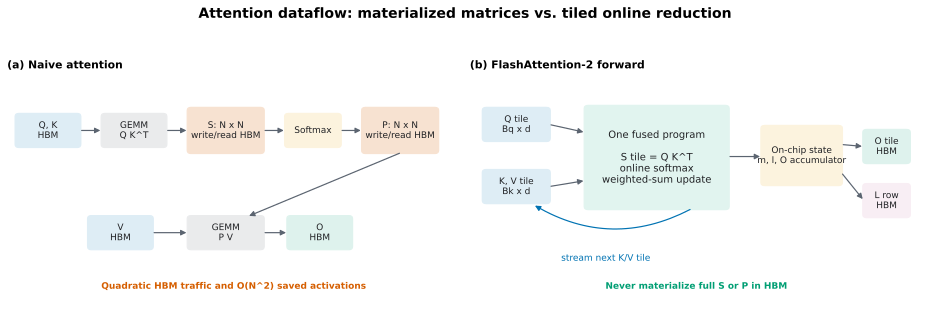
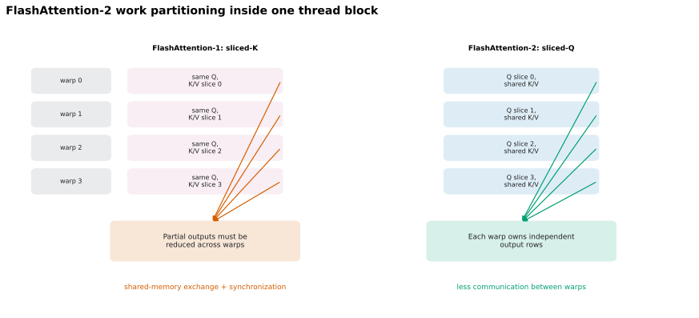

# FlashAttention-2 Forward 初学者教材：从 Online Softmax 到 Triton Tile

## 0. 本文目标与阅读方法

本文是 FlashAttention-2 教材的 **Forward 篇**，面向第一次系统学习 FlashAttention-2（下文简称 FA2）的读者。目标不是背诵一段 kernel，而是建立一条可以独立推导和实现 forward 的知识链：

1. 先看懂普通 scaled dot-product attention 的数学和张量形状；
2. 分清算术复杂度、显存容量与 HBM I/O 三种不同成本；
3. 用 weighted sum 掌握 Triton 的 program、tile、stride 和 block pointer；
4. 从一个 score 行推导 online softmax；
5. 把推导扩展成分块 attention forward；
6. 理解 causal mask、边界处理与数值稳定性；
7. 解释 FA2 相比 FA1 为什么更快；
8. 明确 forward 为什么要额外保存 $L$，为 backward 重算建立接口。

Backward 推导、Triton 映射、正确性测试、benchmark 和练习已拆到 [Backward 与实现验证篇](./03_03_flash_attention_2_backward.md)。两篇沿用原来的连续章节编号，建议先读本篇第 0-8 章，再进入下篇第 9 章。

本文讲的是 FA2 forward 的核心算法与课程实现路线，不是某个生产库全部特性的 API 手册。Dropout、variable-length batching、MQA/GQA、KV cache 和不同 GPU 架构的专用流水线只在需要辨清边界时提及。

### 0.1 一手资料索引

后文用下面的简称标注来源。论文结论优先引用论文，Triton 语义优先引用官方文档，作业接口优先引用当前仓库 handout。

| 简称 | 一手资料 | 本文主要使用的内容 |
|---|---|---|
| FA1 | Dao et al., 2022, [FlashAttention: Fast and Memory-Efficient Exact Attention with IO-Awareness](https://openreview.net/forum?id=H4DqfPSibmx)，另见 [NeurIPS 论文 PDF](https://papers.neurips.cc/paper_files/paper/2022/file/67d57c32e20fd0a7a302cb81d36e40d5-Paper-Conference.pdf) | I/O-aware 动机、tiling、recomputation、kernel fusion、I/O 复杂度 |
| FA2 | Dao, 2023, [FlashAttention-2: Faster Attention with Better Parallelism and Work Partitioning](https://arxiv.org/abs/2307.08691)，可直接阅读 [HTML §3](https://arxiv.org/html/2307.08691v1#S3) | FA2 算法、序列维并行、warp 工作划分、实验结论 |
| Online Softmax | Milakov and Gimelshein, 2018, [Online normalizer calculation for softmax](https://arxiv.org/abs/1805.02867) | 在线维护 softmax 最大值和归一化因子 |
| Triton-Attn | Triton 官方 [Fused Attention tutorial](https://triton-lang.org/main/getting-started/tutorials/06-fused-attention.html) | FA2 风格前后向 kernel、causal 分段、FP32 状态和 benchmark |
| Triton-Ptr | Triton 3.6 官方源码中的 [`make_block_ptr` 与 `advance`](https://github.com/triton-lang/triton/blob/v3.6.0/python/triton/language/core.py#L2236-L2263)，以及官方 [`load`](https://triton-lang.org/main/python-api/generated/triton.language.load.html) 文档 | block pointer 的字段、移动、边界加载 |
| Triton-Core | Triton 官方 [`program_id`](https://triton-lang.org/main/python-api/generated/triton.language.program_id.html) 与 [`dot`](https://triton-lang.org/main/python-api/generated/triton.language.dot.html) 文档 | launch grid 索引、块矩阵乘和 accumulator |
| SDPA | PyTorch 官方 [`scaled_dot_product_attention`](https://docs.pytorch.org/docs/stable/generated/torch.nn.functional.scaled_dot_product_attention.html) 文档 | API 语义、shape、causal mask、后端选择与数值差异 |
| Handout-WS | 当前 CS336 handout [4.2.1 Weighted Sum](./cs336_assignment2_systems_extracted.md#L662-L1021) | Triton 入门、block pointer、launch grid 与自定义 backward |
| Handout-Fwd | 当前 CS336 handout [4.2.2 Forward](./cs336_assignment2_systems_extracted.md#L1023-L1220) | 课程版前向算法、kernel grid、精度要求与 causal mask |
| Handout-Bwd | 当前 CS336 handout [backward 与 4.2.3](./cs336_assignment2_systems_extracted.md#L1222-L1280) | 保存/重算策略、$D$ 向量与 tiled backward |

> 版本提示：当前 Triton 官方 fused-attention 教程主要使用 tensor descriptor；当前 CS336 handout 使用 `tl.make_block_ptr`。两者表达的是同一类“从全局张量选取并移动 tile”的映射思想，但 API 不能逐行混抄。block pointer 的准确参数语义可核对当前环境对应的 [Triton 3.6 官方源码](https://github.com/triton-lang/triton/blob/v3.6.0/python/triton/language/core.py#L2236-L2263)。

### 0.2 三条建议阅读路线

- **先懂 forward 原理**：依次阅读第 1、2、4、5、8 章，先忽略 Triton API 细节。
- **完成课程实现**：先读本篇第 3-8 章，再读 [下篇第 9-12 章](./03_03_flash_attention_2_backward.md)。
- **当前没有 GPU**：先完成本篇的数学推导与纯 PyTorch tiled forward，再按下篇第 13 章区分可验证与不可验证的结论。

---

## 1. 初学者前置知识

### 1.1 最少数学基础

开始前应当熟悉：

- 矩阵乘法和转置；
- softmax 及其减最大值的稳定写法；
- 链式法则和反向传播；
- Big-O 记号；
- batch、sequence、head 和 head dimension 的含义。

不需要先会手写 CUDA，但要接受一个系统事实：GPU 上“少做算术”不一定等于“更快”，数据在 HBM 与片上存储之间移动也要付出时间。FA1 的出发点正是把 attention 设计成 I/O-aware 算法，而不是把它改成近似算法。[FA1 §1、§3](https://papers.neurips.cc/paper_files/paper/2022/file/67d57c32e20fd0a7a302cb81d36e40d5-Paper-Conference.pdf)

### 1.2 本文的向量与矩阵约定

**下标起点约定：** 标量数学公式中的 query、key 和特征下标 $i,j,u,r,c$ 从 1 开始；对应求和写成从 1 到维度上界。tile 与 Triton program 的循环索引 $a,b$ 从 0 开始，即 $a=0,\ldots,T_q-1$、$b=0,\ldots,T_k-1$。

**数学上，所有单个向量都按列向量书写。** 对第 $i$ 个 query 和第 $j$ 个 key：

- $q_i,k_j,v_j\in\mathbb{R}^{d}$ 都是列向量；
- score 是 $s_{ij}=q_i^\top k_j/\sqrt d$；
- 单个输出是 $o_i=\sum_j p_{ij}v_j$，仍是列向量；
- 线性层写作 $y=Wx$。

为了批量计算，把每个列向量的转置堆成矩阵的行：

$$Q=\begin{bmatrix}q_1^\top\\ \vdots\\ q_{S_q}^\top\end{bmatrix}\in\mathbb{R}^{S_q\times d},\quad K=\begin{bmatrix}k_1^\top\\ \vdots\\ k_{S_k}^\top\end{bmatrix}\in\mathbb{R}^{S_k\times d},\quad V=\begin{bmatrix}v_1^\top\\ \vdots\\ v_{S_k}^\top\end{bmatrix}\in\mathbb{R}^{S_k\times d}$$

于是矩阵形式为 $S=QK^\top/\sqrt d$、$P=\operatorname{softmax}_{\mathrm{row}}(S)$、$O=PV$。这与 handout 的 attention 定义一致。[Handout：L1031-L1037](./cs336_assignment2_systems_extracted.md#L1031-L1037)

**PyTorch 是另一个层面。** 单头输入通常存成 `(B, S, d)`，多头常存成 `(B, H, S, d)`；特征位于最后一维，因此代码用 `Q @ K.transpose(-2, -1)`。数学上的列向量约定没有改变，只是批量 Tensor 把每个 $q_i^\top$ 存成最后一维的一行。类似地，数学上线性层是 $y=Wx$，PyTorch 的 feature-last 批量实现对应 `y = x @ W.T`。PyTorch SDPA 的官方 shape 也是 batch/head 维在前、序列和 embedding 维在后。[SDPA 参数与 shape](https://docs.pytorch.org/docs/stable/generated/torch.nn.functional.scaled_dot_product_attention.html)

### 1.3 最少 GPU 与 Triton 基础

先记住四层抽象：

| 层次 | 初学时需要知道什么 |
|---|---|
| HBM / global memory | 容量大，kernel 间共享；大 Tensor 通常驻留于此 |
| 片上存储 | 寄存器和 shared memory/SRAM 更快但更小；tile 的活跃状态应尽量留在这里 |
| Triton program instance | launch grid 中的一个程序实例，通过 `tl.program_id(axis)` 取得坐标 |
| tile | 一个 program 一次处理的规则数据块，例如 $B_q\times d$ 的 query block |

FA2 论文用 CUDA 的 thread block/warp 解释工作划分；Triton 则让开发者编写 block-level program，编译器再映射到 GPU 线程和指令。不要把“一个 Triton program”机械理解成“一个 Python 线程”或“一个 CUDA thread”。`tl.program_id` 返回当前 program 在最多三维 launch grid 上的索引。[FA2 §2.1](https://arxiv.org/html/2307.08691v1#S2.SS1)；[Triton `program_id`](https://triton-lang.org/main/python-api/generated/triton.language.program_id.html)

---

## 2. Naive attention 到底贵在哪里

### 2.1 三段式实现

忽略 dropout，普通 attention 常被拆成三个阶段：

```python
scores = Q @ K.transpose(-2, -1) * scale
scores = scores.masked_fill(~allowed, float("-inf"))
probs = torch.softmax(scores, dim=-1)
output = probs @ V
```

若单头 Tensor 为 `(B, S, d)`，则 `scores` 和 `probs` 都是 `(B, S, S)`。多头时它们是 `(B, H, S, S)`。handout 直接指出，长序列下这类 score 矩阵会造成 OOM。[Handout：L617-L633](./cs336_assignment2_systems_extracted.md#L617-L633)

### 2.2 容量、算术与 I/O 是三笔不同的账

令元素大小为 $e$ bytes。一个 `(B,H,S,S)` 中间矩阵占 $BHS^2e$ bytes，而一个 `(B,H,S,d)` 输入或输出只占 $BHSde$ bytes。

例如 $B=1$、$H=1$、$S=8192$、FP16 时，仅一个 score 矩阵就是 $8192^2\times2=128$ MiB；若 $H=32$，则是 4 GiB。训练时 autograd 还可能需要保存 probability 或产生同量级临时量，因此“显存中能放下输入”远不代表“能完成 backward”。

三种复杂度必须分开：

| 成本 | Naive attention | FlashAttention 的变化 |
|---|---|---|
| 算术量 | 主项 $O(BHS^2d)$ | 仍是精确 dense attention，主项没有降成线性 |
| score/probability 中间存储 | $O(BHS^2)$ | 不在 HBM 物化完整矩阵 |
| HBM I/O | 多次写回并读入 $S$、$P$ | tile 在片上生成、消费后丢弃 |



图中左侧把 $S$、$P$ 作为完整 $N\times N$ 矩阵写入并读回 HBM；右侧只让当前 score tile 和 online-softmax 状态在 fused program 内存活，最终向 HBM 写回 $O$ 与 $L$。

因此 FlashAttention 的核心不是“少算所有 query-key 对”，而是“以更合适的顺序算，并避免把完整 $S$、$P$ 往返 HBM”。FA1 证明，在序列长度 $N$、head dimension $d$、SRAM 容量 $M$ 的模型下，标准 attention 的 HBM 访问量为 $\Theta(Nd+N^2)$，其 tiled 算法为 $\Theta(N^2d^2/M)$；在论文讨论的典型 $d$ 与 $M$ 下，后者显著更少。[FA1 Theorem 2，论文 §3.2](https://papers.neurips.cc/paper_files/paper/2022/file/67d57c32e20fd0a7a302cb81d36e40d5-Paper-Conference.pdf)

本仓库上一份 [CPU benchmark 报告](./03_01_pytorch_attention_cpu_benchmark_report.md#L16-L24) 给出了一个具体边界：在 20 GiB 地址空间限制下，naive FP32 attention 的 `B=8,S=8192,d=16` forward 可以完成，但 backward 会在申请额外的 2 GiB score-sized buffer 时 OOM。这正是 `(B,H,S,S)` 中间 Tensor 随 $S^2$ 增长的本地实证。

### 2.3 用具体数字建立数据体积直觉

#### 2.3.1 先分清三个层级

一个 attention 层并不只产生一个数字，而是会产生多个不同尺度的 Tensor：

1. **一个 score 或 probability Tensor**：shape 为 `(B,H,S,S)`，固定 $B,H$ 时，元素数随 $S^2$ 增长；
2. **一个 attention 层**：可能同时持有或为 backward 保存一个到多个 `(B,H,S,S)` Tensor，还包括 shape 为 `(B,H,S,d)` 的 $Q,K,V,O$；固定 $B,H,d$ 时，后者的元素数随 $S$ 增长；
3. **整个 $L$ 层模型**：训练 forward 结束时，多层的 saved activations 可能同时存活，因此需要再按层累加。

单个 `(B,H,S_q,S_k)` Tensor 的字节数为 $BH S_qS_ke$；self-attention 中 $S_q=S_k=S$，所以是 $BHS^2e$。这里 $e=2$ 表示 FP16/BF16，$e=4$ 表示 FP32。

> **最重要的口径**：下面表格中的“一个 score/probability”只是**一个 attention 层中的一个 `(B,H,S,S)` Tensor**，不是整个层的全部内存，更不是整个模型的总内存。

#### 2.3.2 一个多头 attention 层有多大

先取一个常见且容易心算的配置：`B=1,H=32,d=128,BF16`，对应 $d_\text{model}=Hd=4096$。单个 $Q/K/V/O$ 的 shape 是 `(1,32,S,128)`，而单个 score 或 probability 的 shape 是 `(1,32,S,S)`；后者可以理解为 32 个 attention heads 各自持有一张 $S\times S$ 矩阵：

| $S$ | 单个 `(B,H,S,d)` 的 $Q/K/V/O$ | 单个 `(B,H,S,S)` 的 score 或 $P$ | 后者是前者的多少倍 |
|---:|---:|---:|---:|
| 1024 | 8 MiB | 64 MiB | 8 倍 |
| 2048 | 16 MiB | 256 MiB | 16 倍 |
| 4096 | 32 MiB | 1 GiB | 32 倍 |
| 8192 | 64 MiB | 4 GiB | 64 倍 |
| 16384 | 128 MiB | 16 GiB | 128 倍 |
| 1,000,000（1M） | 约 7.63 GiB | 约 58.21 TiB | 7812.5 倍 |

表中假设 score/probability Tensor 也以 BF16 存储。若某个实现将它以 FP32 保存，第三列及后续相应估算全部再乘 2；FP32 accumulator 是否最终写入 HBM，要看具体 kernel 和 autograd 实现。

这个比例本质上是 $S/d$。当 $S=8192,d=128$ 时，一个 $Q$ 只有 64 MiB，但一个 $S$ 或 $P$ 已经有 4 GiB。若 naive forward 的某个时刻同时存在 $S$ 和 $P$，仅这两项就是 8 GiB；这仍然只是**一个 attention 层**，尚未计算参数、梯度、optimizer state、MLP activations、allocator workspace 和其他临时量。

Batch size 也会按比例放大这些数字。例如把上例从 `B=1` 改成 `B=8`，`S=4096` 时单个 `(B,H,S,S)` Tensor 会从 1 GiB 增为 8 GiB；`S=8192` 时会从 4 GiB 增为 32 GiB。

#### 2.3.3 多层训练为什么会继续累加

假设模型有 32 个 Transformer layers，每层一个 self-attention。不同层的 $P$ 来自不同输入和参数，不能共享。普通训练 forward 结束、backward 尚未开始时，各层为 backward 保存的 Tensor 会同时存活。

仍使用 `B=1,H=32,BF16`，这里只统计每层保存的 `(B,H,S,S)` Tensor：

| $S$ | 一个 `(B,H,S,S)` Tensor/层 | 32 层各保存 1 个 | 32 层各保存 2 个 |
|---:|---:|---:|---:|
| 2048 | 0.25 GiB | 8 GiB | 16 GiB |
| 4096 | 1 GiB | 32 GiB | 64 GiB |
| 8192 | 4 GiB | 128 GiB | 256 GiB |
| 16384 | 16 GiB | 512 GiB | 1 TiB |

“每层保存几个 `(B,H,S,S)` Tensor”取决于具体实现：

- fused softmax backward 可能只需保存 $P$，即接近 1 份 `(B,H,S,S)` storage；
- 拆开的手写 softmax 可能让指数结果、归一化结果等多个 storage 留给 backward，即接近 2 份或更多；
- compiler、算子融合和内存复用会改变准确常数，但不会改变 naive 实现的 $S^2$ 主导趋势。

因此上表不是某个 PyTorch backend 的精确峰值，而是帮助判断数量级的 1 份/2 份模型。真实训练内存还要加上各层其他 shapes 的 activations、参数、参数梯度、optimizer state、通信 buffer 和 backward workspace。

#### 2.3.4 为什么推理不能机械乘层数

是否乘层数取决于生命周期：

- **训练**：forward 必须把 backward 所需状态留到之后，多个层的 saved activations 会叠加，通常需要考虑 $L$ 倍；
- **整段 prefill 推理**：没有 backward，上一层的临时 score/probability 可在该层结束后释放，峰值通常由“单层临时峰值 + 模型常驻状态”决定，不会把所有层的 score 简单相加；
- **自回归单 token decoding**：每步 query length 通常为 1，score shape 更接近 `(B,H,1,S)`，不再是该步的 $S^2$ 临时量；此时长期增长的主要对象通常是所有层的 KV cache；
- **Activation checkpointing**：能减少同时保存的层数，但重算某个 naive attention 层时仍要物化该层的 `(B,H,S,S)` 临时量，因此不能解决“单层本身已经 OOM”的情况。

#### 2.3.5 KV cache 为什么缓存 $K,V$，却不缓存 $S,P$

对标准自回归 Transformer，每一层都有自己独立的 KV cache。它保存历史 token 在该层产生的：

- $K_\text{cache}$：通常是完成 key projection，并应用该位置对应的 RoPE 之后的 key；
- $V_\text{cache}$：完成 value projection 后的 value。

它通常**不保存**历史 query、完整 score $S$ 或 probability $P$。原因来自这些量能否被未来步骤复用。

生成第 $t$ 个 token 时，该层只产生当前 token 的新 query $q_t$、key $k_t$ 和 value $v_t$。将 $k_t,v_t$ 追加到 cache 后，当前输出为：

$$s_t=K_\text{cache}q_t/\sqrt d,\quad p_t=\operatorname{softmax}(s_t),\quad o_t=V_\text{cache}^\top p_t$$

这里 $K_\text{cache},V_\text{cache}\in\mathbb{R}^{T\times d}$，每行分别存一个历史 key/value 的转置；$q_t,s_t,p_t,o_t$ 均按列向量书写。在 PyTorch 的 feature-last 布局中，对应操作通常写成 `q_t @ K_cache.transpose(-2, -1)` 和 `p_t @ V_cache`。

可以把一次 decoding step 理解为：

```python
q_t, k_t, v_t = project(current_hidden_state)
k_t = apply_rope(k_t, position=t)

K_cache[layer].append(k_t)
V_cache[layer].append(v_t)

scores = q_t @ K_cache[layer].transpose(-2, -1)
probs = softmax(scores)
output = probs @ V_cache[layer]

# 这一层当前 step 结束后即可释放。
del scores, probs
```

为什么只缓存 $K,V$：

1. **历史 $K,V$ 会被每一个未来 query 反复使用。** 第 $t+1,t+2,\ldots$ 个 query 都需要与全部历史 keys 打分，并用相应 values 做加权求和。
2. **历史 $S,P$ 只属于生成它们的那个 query。** 新 query $q_{t+1}$ 与旧 query $q_t$ 不同，所以必须重新计算 $K_\text{cache}q_{t+1}$；旧的 $s_t,p_t$ 不能用于新 query。
3. **旧 query 的输出已经算完。** 自回归 decoding 不会再次计算旧位置的输出，因此继续保存旧 $S,P$ 没有复用收益。
4. **若把每一步的 $P$ 都留下，内存会重新变成平方增长。** 第 1 至 $T$ 步的 probability 长度依次约为 $1,2,\ldots,T$，总元素数为 $T(T+1)/2$。

假设每层使用 $H_{kv}$ 个 KV heads、head dimension 为 $d$、缓存长度为 $T$、元素大小为 $e$ bytes，则 $L$ 层 KV cache 的总大小为 $2LBH_{kv}Tde$。它对上下文长度 $T$ 呈线性增长，但因为要跨所有层长期保存，常数仍然很大。

例如 `L=32,B=1,d=128,BF16,T=8192`：

| Attention 类型 | $H_{kv}$ | 32 层 KV cache |
|---|---:|---:|
| 标准 MHA | 32 | 4 GiB |
| GQA | 8 | 1 GiB |
| MQA | 1 | 0.125 GiB（128 MiB） |

这里减少 $H_{kv}$ 会缩小 KV cache。Score/probability 则仍按 query heads 产生，但单 token decoding 时 shape 只是 `(B,H_q,1,T)`，只在当前层、当前 step 临时存在。

还要区分两个推理阶段：

- **Prefill**：一次处理长度为 $T$ 的整段 prompt，同时生成每层的初始 KV cache；naive attention 仍可能物化 `(B,H_q,T,T)`，适合用 FlashAttention。
- **Decode**：之后每次通常只有一个新 query，读取不断增长的 KV cache；这时主要瓶颈逐渐转向 KV cache 容量与读取带宽。

只有调试 attention heatmap、可解释性分析或某些特殊算法才可能主动保留 $P$；这不是标准大模型 serving 中 KV cache 的组成部分。

#### 2.3.6 一个小块和完整矩阵差多少

这里只比较数据体积，具体怎样分块和执行留到第 5 节。取 `S=4096,H=1,BF16`：完整 score 有 $4096^2$ 个元素，占 32 MiB。若把它看成许多 `64 × 64` 小块：

- BF16 tile 只有 $64^2\times2=8$ KiB；
- 即使转成 FP32，也只有 16 KiB；
- 完整 BF16 score 相当于 4096 个这样的 BF16 小块。

关键差别是：普通实现可能把 4096 个小块组成的完整矩阵保存在 HBM；FlashAttention 的目标是只让当前计算需要的少量小块短暂存在，用完即丢弃，而不是同时保存全部 4096 块。

本仓库的 [CPU benchmark](./03_01_pytorch_attention_cpu_benchmark_report.md#L189-L201) 也提供了可核对实例：`B=8,H=1,S=4096,FP32` 时，一个 score 是 512 MiB，手写 softmax 保存的两个主要 `(B,H,S,S)` storages 合计约 1 GiB；到 `S=8192` 时，一个 score 变成 2 GiB，这两个 storages 合计约 4 GiB，并在 backward 中触发 20 GiB 地址空间限制下的 OOM。

### 2.4 为什么简单 fusion 还不够

如果一个 kernel 先在片上算出完整 $S$ 再做 softmax，$S$ 往往根本放不进有限的片上存储。即使单个 forward 勉强融合，训练 backward 若依赖完整 $P$，仍可能把它写到 HBM 保存。FA1 的组合解法是：

1. **Tiling**：每次只计算 $S$ 的一个 tile；
2. **Online softmax**：跨 key tiles 合并 softmax 统计量；
3. **Recomputation**：backward 从 $Q,K,V$ 与归一化统计量重算 $S,P$；
4. **Kernel fusion**：score、mask、softmax 更新和 $PV$ 累加在同一 kernel 内完成。

这四点共同避免在 HBM 中物化完整的 $S$、$P$；只说“用了 tiling”是不完整的。[FA1 §3.1](https://papers.neurips.cc/paper_files/paper/2022/file/67d57c32e20fd0a7a302cb81d36e40d5-Paper-Conference.pdf)；[Handout：L1055-L1073](./cs336_assignment2_systems_extracted.md#L1055-L1073)

---

## 3. 用 weighted sum 学 Triton 程序模型与 VJP

Weighted sum 本身很简单，选择它作为第一个 Triton 例子，是为了隔离并学习两件之后实现 FA2 必需的事情：

1. **Forward 的 Triton 程序模型**：怎样定义 launch grid、怎样让不同 program instances 负责不同输出、怎样用 block pointer 加载 tile、怎样在一个 program 内做归约并写回结果；
2. **Backward 的 VJP**：`torch.autograd.Function.backward` 怎样接收输出端的上游梯度，并直接计算输入端梯度，而不显式构造完整 Jacobian；同时观察多个 programs 写梯度时的所有权与归约问题。

因此这一章不是在优化一个重要算子，而是在用一个数学上足够简单的算子，把“GPU 程序怎样组织”和“自定义算子怎样接入 reverse-mode autograd”分开看清楚。

### 3.0 优先阅读仓库中已有的完整教材

本章只提取与 FA2 直接相关的最小知识，不替代 `institutionalized/triton/docs/` 下已经存在的完整教材。遇到下面概念时，应优先跳转阅读对应内容：

| 主题 | 仓库中更完整的教材位置 |
|---|---|
| Triton program、launch grid、`program_id` 和元素区间映射 | [`triton/docs/vector_add.md:L293-L304`](../../../../triton/docs/vector_add.md#L293-L304)、[`L366-L404`](../../../../triton/docs/vector_add.md#L366-L404)、[`L538-L570`](../../../../triton/docs/vector_add.md#L538-L570) |
| Output tile 的所有权，以及同一 program 沿归约维循环 input tiles | [`triton/docs/03-matrix-multiplication.md:L180-L251`](../../../../triton/docs/03-matrix-multiplication.md#L180-L251)、[`L293-L325`](../../../../triton/docs/03-matrix-multiplication.md#L293-L325) |
| 上游梯度、Jacobian、VJP 和“不显式构造 Jacobian” | [`triton/docs/backpropagation_and_autograd.md:L754-L887`](../../../../triton/docs/backpropagation_and_autograd.md#L754-L887) |
| Triton kernel 封装成 PyTorch custom op，并实现 `autograd.Function.backward` | [`triton/docs/custom_torch_operator_with_triton.md:L107-L172`](../../../../triton/docs/custom_torch_operator_with_triton.md#L107-L172)、[`L636-L1057`](../../../../triton/docs/custom_torch_operator_with_triton.md#L636-L1057) |
| 每个 program 独立写输入梯度，但共享参数梯度需要跨 programs 归约 | [`triton/docs/05-layer-norm.md:L300-L410`](../../../../triton/docs/05-layer-norm.md#L300-L410) |

建议的先修顺序是 `vector_add.md` → `backpropagation_and_autograd.md` → `custom_torch_operator_with_triton.md` → `03-matrix-multiplication.md`。已经掌握这些内容时，可以把本章当成 weighted sum 与 FA2 之间的对应关系索引，直接阅读第 4 节。

### 3.1 从数学到并行任务

给定 $X\in\mathbb{R}^{n\times d}$ 和列向量 $w\in\mathbb{R}^{d}$，计算列向量 $y=Xw\in\mathbb{R}^{n}$。第 $r$ 个输出是 $y_r=x_r^\top w$，其中 $x_r$ 是列向量，而矩阵 $X$ 的第 $r$ 行存的是 $x_r^\top$。

PyTorch 写法很短：

```python
def weighted_sum(x, weight):
    return (x * weight).sum(dim=-1)
```

Triton 练习的价值不在这个算子本身，而在于它包含了 FA2 所需的最小骨架：把行分 tile、用 program id 选择 tile、显式 load、在特征维归约、显式 store。handout 的完整示例见 [L662-L824](./cs336_assignment2_systems_extracted.md#L662-L824)。

### 3.2 一个 program 负责什么

设行 tile 大小为 `ROWS_TILE_SIZE`。launch grid 为 `ceil_div(n, ROWS_TILE_SIZE)` 个 program：

```python
grid = (triton.cdiv(n_rows, ROWS_TILE_SIZE),)
weighted_sum_fwd[grid](...)
```

这里要区分三个概念：

| 概念 | 含义 |
|---|---|
| Triton kernel 定义 | 用 `@triton.jit` 修饰的函数，是所有 program instances 共用的程序模板 |
| 一次 kernel launch | Python 端执行一次 `weighted_sum_fwd[grid](...)` |
| Triton program instance | launch grid 中的一个执行实例，通过 `tl.program_id(axis)` 知道自己负责哪个 tile |

因此，**一次 kernel launch 通常对应多个 program instances，而不是一个 program**。program 数量由 grid 决定：一维 grid `(G,)` 创建 $G$ 个 programs；二维 grid `(G_0,G_1)` 创建 $G_0G_1$ 个 programs。

在 NVIDIA GPU 上，一个 Triton program instance 通常会映射为一个由若干 warps 协作执行的 CUDA thread block/CTA；`num_warps` 控制每个 program 使用多少个 warps。这个硬件映射不影响 Triton 源码层面的核心理解：所有 programs 执行同一个 kernel 函数，但拥有不同的 `program_id`，因而处理不同的数据 tile。

因此“program 和 block 对应”必须说明 block 指什么：

- 若 block 指 **CUDA thread block/CTA**，在常见 NVIDIA Triton kernel 中可近似理解为一个 program instance 对应一个 CTA；
- 若 block 指 **数据 tile**，则不一定一一对应：一个 program 可以固定一个输出 tile，同时在循环中依次读取和处理多个输入 tiles；
- `tl.make_block_ptr` 名称中的 block 是数据区域，不是 CUDA thread block。

program `pid = tl.program_id(0)` 负责全局行区间：

```text
[pid * ROWS_TILE_SIZE, (pid + 1) * ROWS_TILE_SIZE)
```

准确地说，$y$ 是 shape 为 `(n,)` 的一维向量，没有“$y$ 的行”。这里存在两层不同的分块：

1. **跨 programs 分配 $y$ 的不同元素区间。** program `pid` 负责 `y[pid * ROWS_TILE_SIZE : (pid + 1) * ROWS_TILE_SIZE]`。这些区间互不重叠，所以每个 $y_r$ 只由一个 program 写入。
2. **同一个 program 内沿 $D$ 维分块累加。** 对自己负责的每个输出元素，program 仍需计算 $y_r=\sum_{c=0}^{D-1}X_{rc}w_c$。若一次只读取 `D_TILE_SIZE` 个特征，它会在同一个 program 内循环多个 feature tiles，并把部分和累加到该 $y_r$；这不是把同一个 $y_r$ 分给多个 programs。

例如 `n=100, ROWS_TILE_SIZE=16` 时，Python 端只调用一次 `weighted_sum_fwd[grid](...)`，但 `grid=(7,)` 会创建 7 个 program instances：program 0 写 `y[0:16]`，program 1 写 `y[16:32]`，最后 program 6 只写有效的 `y[96:100]`。若 `D=128,D_TILE_SIZE=32`，每个 program 会在内部循环 4 次，才完成它负责的每个 $y_r$。handout 对 launch grid 与 `tl.program_id(0)` 的对应关系有直接说明。[Handout：L805-L824](./cs336_assignment2_systems_extracted.md#L805-L824)

这是 Triton **program-instance 层级**的所有权描述。编译到 GPU 后，一个 program 内部当然可能由多个 hardware threads/warps 协作执行乘法和归约；但不会有另一个 `program_id` 再向同一个 $y_r$ 写一份 partial sum。

### 3.3 block pointer 描述了什么

`tl.make_block_ptr(base, shape, strides, offsets, block_shape, order)` 返回父 Tensor 中一个 block 的指针。各字段的职责如下：

| 字段 | 含义 | weighted sum 示例 |
|---|---|---|
| `base` | 父 Tensor 首元素地址 | `x_ptr` |
| `shape` | 父 Tensor 的逻辑 shape | `(n_rows, D)` |
| `strides` | 每个轴移动一格对应的元素跨度 | `(x_stride_row, x_stride_dim)` |
| `offsets` | 当前 block 左上角的逻辑坐标 | `(pid * Br, 0)` |
| `block_shape` | 一次 load/store 的 tile shape | `(Br, Bd)` |
| `order` | 内存维度顺序提示 | 连续二维行主序常见 `(1, 0)` |

`tile` 不是“结果的一块”的专用名词，而是任意 Tensor 或迭代空间中的一个小块。以矩阵乘法 $C=AB$ 为例，一个 program 可能负责一个 **output tile** $C_{mn}$，并沿归约维循环加载多个 **input tiles** $A_{mk}$、$B_{kn}$，再把部分乘积累加到 output tile。三者都叫 tile。

之所以有时单说 “the tile” 像是在指结果，是因为 program 的工作所有权通常用 output tile 定义；但脱离上下文后这种简称有歧义。本文后续会尽量明确写成 `Q tile`、`K/V tile`、`score tile` 或 `output tile`。

`order` 不是转置操作；真正的地址布局由 `strides` 和 `offsets` 决定。对于 block pointer，`tl.load` 使用 `boundary_check` 和 `padding_option` 处理越界，不能同时再传普通 pointer 形式的 `mask/other`。[Triton `make_block_ptr` 源码](https://github.com/triton-lang/triton/blob/v3.6.0/python/triton/language/core.py#L2236-L2248)；[Triton `load`](https://triton-lang.org/main/python-api/generated/triton.language.load.html)

概念伪代码如下：

```python
pid = tl.program_id(0)
x_block = make_block_ptr(
    x_ptr,
    shape=(n_rows, D),
    strides=(stride_xr, stride_xd),
    offsets=(pid * Br, 0),
    block_shape=(Br, Bd),
    order=(1, 0),
)
w_block = make_block_ptr(..., offsets=(0,), block_shape=(Bd,))
acc = zeros((Br,), fp32)

for feature_tile in range(ceil_div(D, Bd)):
    x_tile = load(x_block, boundary_check=(0, 1), padding="zero")
    w_tile = load(w_block, boundary_check=(0,), padding="zero")
    acc += sum(x_tile * w_tile[None, :], axis=1)
    x_block = x_block.advance((0, Bd))
    w_block = w_block.advance((Bd,))

store(y_block, acc, boundary_check=(0,))
```

`advance((0, Bd))` 表示在逻辑坐标中沿第二维前进 $B_d$，不是手写字节偏移。[Triton `advance` 源码](https://github.com/triton-lang/triton/blob/v3.6.0/python/triton/language/core.py#L2251-L2263)；handout 的对应代码见 [L719-L773](./cs336_assignment2_systems_extracted.md#L719-L773)。

### 3.4 Weighted sum 的 VJP 与 backward 所有权

令上游梯度列向量为 $g=\nabla_y\mathcal L\in\mathbb{R}^{n}$。由 $y_r=x_r^\top w$ 可得 $\nabla_X\mathcal L=gw^\top\in\mathbb{R}^{n\times d}$，以及 $\nabla_w\mathcal L=X^\top g\in\mathbb{R}^{d}$。

这正是 VJP。若把 weighted sum 记为 $y=f(X,w)$，`backward(ctx, grad_output)` 接收到的 `grad_output` 就是 $g=\nabla_y\mathcal L$，它需要返回 $J_f(X,w)^\top g$ 在 $X$ 与 $w$ 两个输入方向上的分量。实现不需要构造完整 Jacobian，只需要使用上面的闭式公式计算 $\nabla_X\mathcal L$ 和 $\nabla_w\mathcal L$。完整推导优先阅读 [`triton/docs/backpropagation_and_autograd.md:L754-L887`](../../../../triton/docs/backpropagation_and_autograd.md#L754-L887)；batch/sequence 维上的共享参数梯度还可参考 [`02_04 PyTorch 梯度累积详解`](./02_04_gradient_accumulation_guide.md)。

两项梯度的并行所有权不同：

- 每个 row-tile program 只负责自己那几行的 $\nabla_X\mathcal L$，写入区域互不重叠；
- 每个 row-tile program 都会对同一个 $\nabla_w\mathcal L$ 贡献部分和，不能让多个 programs 无同步地覆盖同一输出。

handout 的做法是让每个 program 先写一行 `partial_grad_weight`，kernel 结束后再沿 row-tile 维归约。[Handout：L826-L1003](./cs336_assignment2_systems_extracted.md#L826-L1003) 这个例子建立了一个通用判断方法：先问“谁拥有最终输出 tile”，再决定是否需要 partial buffer、atomic、额外归约，或者像 FA2 backward 那样重排计算。

### 3.5 它怎样迁移到 attention

对应关系如下：

| Weighted sum | FA2 forward |
|---|---|
| 一个 program 负责一组 $X$ 行 | 一个 program 负责一个 query tile |
| 固定行 tile，循环 feature tiles | 固定 query tile，循环 key/value tiles |
| FP32 `acc` 累加标量输出 | FP32 `acc` 累加 $B_q\times d$ 输出 |
| `advance` 沿特征维移动 | `advance` 沿 key 序列维移动 |
| 越界元素补零 | query/key 边界分别 mask；softmax score 越界应视为不可见 |

FA2 backward 同样先分析梯度 tile 的写入所有权，再通过工作重排和部分重算避免昂贵的跨 program 同步。[Handout：L1242-L1280](./cs336_assignment2_systems_extracted.md#L1242-L1280)

---

## 4. Online softmax：从一个 query 的输出开始

这一节先不讨论 Triton、program 或 block pointer，只解决一个问题：

> 当一个 query 对应的全部 scores 无法同时放在片上时，怎样分批读取 scores 和 values，同时得到与普通 softmax attention 相同的输出？

### 4.1 普通 attention 输出是“分子除以分母”

固定一个 query 列向量 $q\in\mathbb{R}^{d}$。它与 $N$ 个 key 列向量分别产生 score $s_j=q^\top k_j/\sqrt d$，再用 softmax 权重对 value 列向量 $v_j$ 求和：

$$o=\sum_{j=1}^{N}p_jv_j,\quad p_j=\frac{\exp(s_j)}{\sum_{u=1}^{N}\exp(s_u)}$$

为防止 $\exp(s_j)$ 上溢，先取全行最大值 $m=\max_j s_j$。给所有 scores 同时减去 $m$ 不改变 softmax：

$$o=\frac{\sum_{j=1}^{N}\exp(s_j-m)v_j}{\sum_{u=1}^{N}\exp(s_u-m)}$$

现在可以看出，计算输出只需要三个对象：

| 名称 | 定义 | 作用 |
|---|---|---|
| 最大值 $m$ | $\max_j s_j$ | 让指数输入不大于 0，避免上溢 |
| 分母 $\ell$ | $\sum_j\exp(s_j-m)$ | softmax 的归一化因子 |
| 分子 $z$ | $\sum_j\exp(s_j-m)v_j$ | 尚未归一化的 value 加权和 |

最后只需计算 $o=z/\ell$。这里 $\ell$ 是标量，$z,o\in\mathbb{R}^{d}$ 是列向量。这一步还没有使用分块，只是把普通 attention 改写成后面容易增量更新的形式。[FA1 §3.1](https://papers.neurips.cc/paper_files/paper/2022/file/67d57c32e20fd0a7a302cb81d36e40d5-Paper-Conference.pdf)；[Online Softmax](https://arxiv.org/abs/1805.02867)

### 4.2 为什么“每块各做一次 softmax”是错的

先只看四个 scores，并把它们分成两块：

```text
score tile 1: [1, 2]
score tile 2: [3, 4]
```

若分别计算局部 softmax：

```text
softmax([1, 2]) = [0.2689, 0.7311]
softmax([3, 4]) = [0.2689, 0.7311]
```

直接拼接后四个数之和为 2，不是概率分布。即使再整体除以 2，也是在强行规定两个 tiles 各占 50% 的总概率质量。

真正的全局结果是：

```text
softmax([1, 2, 3, 4])
= [0.0321, 0.0871, 0.2369, 0.6439]
```

tile 1 合计只占约 11.92%，tile 2 合计约占 88.08%。局部 softmax 保留了每个 tile 内部的相对比例，却丢掉了两个 tiles 之间的相对大小。因此不能保存“已经归一化完的局部概率”，而要保存仍可与后续 tile 合并的信息。

### 4.3 第一块处理完后，究竟应该记住什么

继续使用 scores `[1,2]`，并给它们配上最简单的一维 values `[10,20]`。第一块的最大值是 $m_\text{old}=2$，相对这个最大值的未归一化权重为 `[e^-1,1]`。

如果以后不再保存原始 scores，至少要留下：

- $m_\text{old}=2$：旧数据使用的指数基准；
- $\ell_\text{old}=e^{-1}+1\approx1.367879$：旧块的 softmax 分母；
- $z_\text{old}=10e^{-1}+20\approx23.678794$：旧块的 value 加权和。

用这三个量已经可以恢复“只看第一块”时的输出 $z_\text{old}/\ell_\text{old}\approx17.310586$。更重要的是，它们还保留了与后续块合并所需的信息：

- 只有局部概率 `[0.2689,0.7311]` 时，不知道这块相对其他块应占多少总概率；
- 同时保留 $m_\text{old}$ 和 $\ell_\text{old}$，就知道这块未归一化概率质量的尺度；
- 保留使用同一尺度的 $z_\text{old}$，就能同步修正已经累计的 value 加权和。

所以 $m,\ell,z$ 不是凭空设计的三个变量，它们分别保存了**指数基准、分母和分子**。

### 4.4 第二块到来后，为什么旧状态要缩放

第二块 scores 是 `[3,4]`，values 是 `[30,40]`。它带来了更大的最大值 4，所以新的共同基准必须改成 $m_\text{new}=4$。

旧块原来按最大值 2 记录。对任意旧 score $s$：

$$\exp(s-m_\text{new})=\exp(s-m_\text{old})\exp(m_\text{old}-m_\text{new})$$

因此所有旧权重都统一乘 $\alpha=\exp(2-4)=e^{-2}\approx0.135335$。这一步把旧状态从“以 2 为基准”换算成“以 4 为基准”，不需要重新读取旧 scores。

新块相对最大值 4 的未归一化权重是 `[e^-1,1]`。于是新分母为：

$$\ell_\text{new}=e^{-2}\ell_\text{old}+e^{-1}+1\approx1.553002$$

新分子为：

$$z_\text{new}=e^{-2}z_\text{old}+30e^{-1}+40\approx54.240960$$

最终输出是 $o=z_\text{new}/\ell_\text{new}\approx34.926527$，与一次性计算 `softmax([1,2,3,4]) @ [10,20,30,40]` 相同。

这一步只需要记住一句话：

> 最大值改变时，旧分母 $\ell$ 和旧分子 $z$ 必须乘同一个缩放因子，才能与新块处在同一指数基准下。

### 4.5 从手算例子抽象出一般更新式

设当前已处理若干 score tiles，保存的旧状态为 $m_\text{old},\ell_\text{old},z_\text{old}$。现在读入新 score tile $s\in\mathbb{R}^{B_k}$ 及其 value 矩阵 $V\in\mathbb{R}^{B_k\times d}$。

按以下顺序更新：

1. 新最大值：$m_\text{new}=\max(m_\text{old},\max_t s_t)$；
2. 旧状态缩放：$\alpha=\exp(m_\text{old}-m_\text{new})$；
3. 新块未归一化权重：$\widetilde p=\exp(s-m_\text{new})$；
4. 新分母：$\ell_\text{new}=\alpha\ell_\text{old}+\sum_t\widetilde p_t$；
5. 新分子：$z_\text{new}=\alpha z_\text{old}+V^\top\widetilde p$。

初始化为 $m=-\infty,\ell=0,z=0$。全部 key/value tiles 处理完后，输出为 $o=z/\ell$。

### 4.6 为什么这种更新是精确的

处理完任意若干个 tiles 后，状态始终满足：

$$m=\max_{t\in\text{seen}}s_t,\quad \ell=\sum_{t\in\text{seen}}\exp(s_t-m),\quad z=\sum_{t\in\text{seen}}\exp(s_t-m)v_t$$

证明只需两步：

1. 第一块处理后，三个等式直接由定义成立；
2. 加入新块时，旧项全部乘 $\exp(m_\text{old}-m_\text{new})$，依据第 4.4 节的恒等式，它们恰好被改写成相对 $m_\text{new}$ 的形式；再加上新块的项，等式继续成立。

因此 $z/\ell$ 恰好等于对全部已见 scores 一次做 softmax 后的 weighted sum。Online softmax 只是改变计算和归约顺序，没有删除 query-key 对，也不是近似 attention。有限精度下，不同归约顺序可能产生正常的舍入差异。[FA2 §2.3.1、§3.1.1](https://arxiv.org/html/2307.08691v1#S3.SS1.SSS1)

### 4.7 为什么还要保存 logsumexp

#### 4.7.1 这里的 $L$ 不是训练 loss

这里把每个 query 行的 `logsumexp` 记为 $L_i$。它只是 attention forward 产生的一个行统计量，不是整个模型最终优化的训练 loss。

对一个 query：

- 有 $N_k$ 个 scores；
- 只有 1 个 $L$；
- $L$ 把这一整行 scores 的 softmax 归一化信息压缩成一个标量。

若有 $N_q$ 个 queries，则 $L$ 的 shape 是 `(Nq,)`；加入 batch 和 head 后通常是 `(B,H,Nq)`。

#### 4.7.2 $L=m+\log\ell$ 是怎么来的

前面定义：

- $m=\max_j s_j$；
- $\ell=\sum_j\exp(s_j-m)$。

把原始 softmax 分母中的 $\exp(m)$ 提出来：

$$\sum_j\exp(s_j)=\exp(m)\sum_j\exp(s_j-m)=\exp(m)\ell$$

对两边取对数：

$$\log\left(\sum_j\exp(s_j)\right)=m+\log\ell$$

因此定义 $L=m+\log\ell$。也就是说，$L$ 就是原始 softmax 分母的对数：

$$L=\operatorname{logsumexp}(s)=\log\left(\sum_j\exp(s_j)\right)$$

#### 4.7.3 为什么一个 $L$ 就能恢复整行 probability

普通 softmax probability 是：

$$p_j=\frac{\exp(s_j)}{\sum_u\exp(s_u)}$$

因为分母等于 $\exp(L)$：

$$p_j=\frac{\exp(s_j)}{\exp(L)}=\exp(s_j-L)$$

所以 backward 只要重新算出 score $s_j$，再读取该 query 行保存的一个 $L$，就能恢复 $p_j$。不需要把 forward 中的全部 probabilities 一直保留到 backward。

继续使用 `[1,2,3,4]`：

- $m=4$；
- $\ell=e^{-3}+e^{-2}+e^{-1}+1\approx1.553002$；
- $L=4+\log(1.553002)\approx4.440190$。

逐个恢复：

```text
exp(1 - L) = 0.0321
exp(2 - L) = 0.0871
exp(3 - L) = 0.2369
exp(4 - L) = 0.6439
```

这正是普通 `softmax([1,2,3,4])`。而且 $L\geq\max_j s_j$，所以 $s_j-L\leq0$，指数不会因为正数过大而上溢。

#### 4.7.4 为什么保存 $L$ 比保存 $P$ 小得多

对每个 batch、head：

| 保存对象 | Shape | 元素数 |
|---|---|---:|
| 完整 probability $P$ | `(Nq,Nk)` | $N_qN_k$ |
| 行统计量 $L$ | `(Nq,)` | $N_q$ |

例如 `B=1,H=32,Nq=Nk=8192`：

- BF16 的完整 $P$ 为 4 GiB；
- FP32 的 $L$ 仅为 $1\times32\times8192\times4=1$ MiB；
- 二者相差 4096 倍。

保存 $m$ 和 $\ell$ 也足以恢复归一化信息，但每个 query 需要两个标量。保存 $L=m+\log\ell$ 只需一个标量，而且重建概率时可以直接计算 $\exp(s_j-L)$。

#### 4.7.5 Backward 实际怎样使用它

对当前 score tile，backward 执行：

1. 从保存的 $Q,K$ 重新计算当前 $S$ tile；
2. 对 causal 或越界位置应用与 forward 完全相同的 mask；
3. 读取每个 query 行对应的 $L_i$；
4. 广播 $L_i$，计算 $P_{ij}=\exp(S_{ij}-L_i)$；
5. 立即使用当前 $P$ tile 计算梯度，用完后丢弃。

因此保存 $L$ 的意义不是“避免 backward 计算 score”，而是“让 backward 重算 score 后，无需再次遍历整行做 online softmax，就能直接恢复当前 probability tile”。

当前 handout 要求 forward 保存 $L,Q,K,V,O$，并在 backward 中重算概率。[Handout：L1061-L1095](./cs336_assignment2_systems_extracted.md#L1061-L1095)；[Handout：L1145-L1153](./cs336_assignment2_systems_extracted.md#L1145-L1153)

$L$ 如何与 $D$ 配合完成 softmax backward，将在 [Backward 与实现验证篇第 9 章](./03_03_flash_attention_2_backward.md) 中从普通 attention backward 开始推导。

读完本节，至少应能独立回答：

1. 为什么局部 softmax 不能直接拼接；
2. $m,\ell,z$ 分别保存什么信息；
3. 为什么最大值改变后 $\ell$ 和 $z$ 必须同时缩放；
4. 为什么最终 $z/\ell$ 与普通 attention 完全相同；
5. 为什么保存 $L$ 就能在 backward 重建 $P$。

---

## 5. FA2 forward：从公式到伪代码

### 5.1 Tile 定义

先省略 batch 和 head。设：

- $Q\in\mathbb{R}^{N_q\times d}$；
- $K,V\in\mathbb{R}^{N_k\times d}$；
- query tile 大小为 $B_q$，数量 $T_q=\lceil N_q/B_q\rceil$；
- key/value tile 大小为 $B_k$，数量 $T_k=\lceil N_k/B_k\rceil$。

这里 $B_q,B_k$ 中的 $B$ 表示 block/tile size，不是 batch size；代码中通常对应 `Q_TILE_SIZE` 和 `K_TILE_SIZE`。例如 `Bq=64,Bk=64,d=128` 表示一个 query tile 含 64 个 query tokens，一个 key/value tile 含 64 个 key/value tokens，每个 token 在该 attention head 内的向量维度为 128。因此 $Q^{(a)}$ 是 `(64,128)`，$K^{(b)},V^{(b)}$ 是 `(64,128)`，两者相乘得到的当前 score tile 是 `(64,64)`。

本文用 $a,b$ 表示从 0 开始的 tile 索引，用 $i,j$ 表示单个 token 的行号，即 $a\in\{0,\ldots,T_q-1\}$、$b\in\{0,\ldots,T_k-1\}$。索引为 $a$ 的 query tile 记作 $Q^{(a)}\in\mathbb{R}^{B_q\times d}$，索引为 $b$ 的 key/value tile 记作 $K^{(b)},V^{(b)}\in\mathbb{R}^{B_k\times d}$。括号上标 $(a),(b)$ 只是分块标签，不表示乘方。课程算法不沿 head dimension $d$ 分块。[Handout：L1097-L1115](./cs336_assignment2_systems_extracted.md#L1097-L1115)

每个 Triton program 固定一个 `(batch/head, query_tile)`，把 $Q^{(a)}$ 留在片上，并循环全部 key/value tiles。它维护当前 query tile 的运行状态 $m^{(a)}\in\mathbb{R}^{B_q}$、$\ell^{(a)}\in\mathbb{R}^{B_q}$ 和未归一化输出 accumulator $A^{(a)}\in\mathbb{R}^{B_q\times d}$。

### 5.2 每个 key tile 的更新

初始化 $m^{(a)}=-\infty$、$\ell^{(a)}=0$、$A^{(a)}=0$。依次处理索引为 $b=0,\ldots,T_k-1$ 的 key tiles：

$$S^{(a,b)}=\frac{Q^{(a)}(K^{(b)})^\top}{\sqrt d}+M^{(a,b)}\in\mathbb{R}^{B_q\times B_k}$$

其中 mask $M^{(a,b)}$ 对可见位置为 0，对不可见位置为 $-\infty$ 或实现中足够小的数。逐行更新最大值 $m^{(a)}_{\mathrm{new}}=\max(m^{(a)},\operatorname{rowmax}(S^{(a,b)}))$：

$$\alpha^{(a)}=\exp(m^{(a)}-m^{(a)}_{\mathrm{new}}),\quad \widetilde P^{(a,b)}=\exp(S^{(a,b)}-m^{(a)}_{\mathrm{new}}[:,None])$$

$\ell^{(a)}_{\mathrm{new}}=\alpha^{(a)}\circ\ell^{(a)}+\operatorname{rowsum}(\widetilde P^{(a,b)})$，并更新输出 accumulator：

$$A^{(a)}_{\mathrm{new}}=\alpha^{(a)}[:,None]\circ A^{(a)}+\widetilde P^{(a,b)}V^{(b)}$$

循环结束后，$O^{(a)}=A^{(a)}/\ell^{(a)}[:,None]$，且 $L^{(a)}=m^{(a)}+\log\ell^{(a)}$。

这里 `[:, None]` 表示把行向量广播到每一列，$\circ$ 表示逐元素乘法。以上就是 handout Algorithm 1 的逐式展开。[Handout：L1111-L1132](./cs336_assignment2_systems_extracted.md#L1111-L1132)

### 5.3 可逐行对照的伪代码

下面是算法伪代码，不是可直接运行的 Triton：

```python
parallel for batch_head in [0, B * H):
    parallel for query_tile in [0, ceil_div(Nq, Bq)):
        q = load Q[batch_head, query_tile]       # (Bq, d)
        m = full((Bq,), -inf, dtype=fp32)
        l = zeros((Bq,), dtype=fp32)
        acc = zeros((Bq, d), dtype=fp32)

        for key_tile in [0, ceil_div(Nk, Bk)):
            k = load K[batch_head, key_tile]     # (Bk, d)
            v = load V[batch_head, key_tile]     # (Bk, d)

            scores = dot(q, transpose(k)) * scale
            scores = apply_bounds_and_causal_mask(scores)

            m_new = maximum(m, rowmax(scores))
            alpha = exp(m - m_new)
            p_tilde = exp(scores - m_new[:, None])

            acc = acc * alpha[:, None] + dot(cast(p_tilde, v.dtype), v)
            l = l * alpha + rowsum(p_tilde)
            m = m_new

        output = acc / l[:, None]
        logsumexp = m + log(l)
        store O[batch_head, query_tile] = cast_to_output_dtype(output)
        store L[batch_head, query_tile] = logsumexp
```

`tl.dot` 计算两个二维或三维 block 的矩阵乘，并可通过 `acc=` 累加到既有 accumulator；handout 要求片上的 $A^{(a)},\ell^{(a)},m^{(a)}$ 使用 FP32，并在写回前转换输出 dtype。[Triton `dot`](https://triton-lang.org/main/python-api/generated/triton.language.dot.html)；[Handout：L1209-L1215](./cs336_assignment2_systems_extracted.md#L1209-L1215)

### 5.4 它为什么不物化完整 attention matrix

在任意时刻，一个 program 只需要：

- 一个 $B_q\times d$ query tile；
- 一个 $B_k\times d$ key tile；
- 一个 $B_k\times d$ value tile；
- 一个 $B_q\times B_k$ 临时 score/probability tile；
- $B_q$ 个最大值与分母；
- 一个 $B_q\times d$ 输出 accumulator。

$S^{(a,b)}$ 和 $\widetilde P^{(a,b)}$ 被当前 tile 消费后即可丢弃。HBM 中保留的是 $Q,K,V,O,L$，而不是完整 $N_q\times N_k$ 的 $S$ 或 $P$。因此 attention-specific saved activations 不再包含元素数为 $N_qN_k$ 的完整矩阵，主要保存项的元素数为 $O((N_q+N_k)d)$。[FA1 §3.1 与 Theorem 1](https://papers.neurips.cc/paper_files/paper/2022/file/67d57c32e20fd0a7a302cb81d36e40d5-Paper-Conference.pdf)；[Handout：L1051-L1067](./cs336_assignment2_systems_extracted.md#L1051-L1067)

---

## 6. Causal 与边界 mask：哪些 score 可以进入 softmax

### 6.1 本节要解决的核心问题

第 5 节已经说明如何按 $B_q\times B_k$ tile 计算 score 并更新 online softmax，但还没有回答一个实现正确性问题：

> 当前 score tile 中，哪些 $(r,c)$ 元素是真实且可见的，因而有资格参与 row maximum、分母和输出累计？

这里有两类原因会让一个位置无效：

1. **Causal 不可见**：位置 $r$ 不能读取未来位置 $c>r$；
2. **Tensor 越界**：最后一个 tile 可能覆盖 $r\ge N_q$ 的伪 query 行或 $c\ge N_k$ 的伪 key 列。

这两类位置都必须在 row maximum 和指数运算之前从 score 中排除。把无效 score 简单填成 0 并不安全，因为它会贡献 $\exp(0)=1$，从而改变 softmax 分母；如果无效 score 大于该行真实最大值，它还会污染 online softmax 保存的 $m$。

对方形 causal self-attention，可以把一个位置是否有效统一写成：

$$\operatorname{valid}(r,c)=(r<N_q)\land(c<N_k)\land(\lnot\text{is\_causal}\lor c\le r)$$

然后只允许有效位置进入 softmax：

$$S_{rc}=\begin{cases}q_r^\top k_c/\sqrt d,&\operatorname{valid}(r,c)\\-\infty,&\text{otherwise}\end{cases}$$

课程 handout 要求使用 `is_causal: tl.constexpr`，并在 causal 屏蔽位置加 `-1e6`；完成作业时应以该接口和测试约定为准。[Handout：L1218-L1220](./cs336_assignment2_systems_extracted.md#L1218-L1220)

### 6.2 在 tile 内构造逐元素 causal mask

设当前 query tile 的起点为 `q_tile_start`，key tile 的起点为 `k_tile_start`。先构造各行、各列对应的全局 token 位置，再比较 $c\le r$：

```python
q_pos = q_tile_start + tl.arange(0, Bq)  # (Bq,)
k_pos = k_tile_start + tl.arange(0, Bk)  # (Bk,)

causal_valid = k_pos[None, :] <= q_pos[:, None]  # (Bq, Bk)
scores = tl.where(causal_valid, scores, -float("inf"))
```

`q_pos[:, None]` 的 shape 是 `(Bq, 1)`，`k_pos[None, :]` 的 shape 是 `(1, Bk)`；广播比较后得到 `(Bq, Bk)` 的布尔矩阵。每个布尔值恰好对应当前 score tile 中的一个 query-key 对。

mask 的位置不能晚于 online softmax 更新。正确顺序是：

1. 计算当前 tile 的原始 score；
2. 把 causal 或越界位置改成 $-\infty$（作业接口使用 `-1e6`）；
3. 对 masked score 求 `rowmax`；
4. 计算指数、分母和输出 accumulator。

如果先求 `rowmax` 或先计算指数再 mask，即使最后把 probability 清零，错误位置也可能已经改变 $m$、$\ell$ 和旧 accumulator 的缩放因子。

### 6.3 为什么要把 key tiles 分成三类

对固定 query tile，并非每个 key tile 都需要执行 $B_qB_k$ 次逐元素比较。令 query tile 覆盖 $[q_0,q_1]$，key tile 覆盖 $[k_0,k_1]$，则有三种情况：

| tile 关系 | 判断条件 | 处理 |
|---|---|---|
| 全部可见 | $k_1\le q_0$ | 直接计算，不需要 causal mask |
| 部分可见 | 区间跨越 causal 对角线 | 构造 $B_q\times B_k$ 逐元素 mask |
| 全部不可见 | $k_0>q_1$ | 整个 key tile 可以跳过 |

例如 $N_q=N_k=8$、$B_q=B_k=4$：

- query tile $[0,3]$ 对 key tile $[0,3]$：与对角线相交，需要逐元素 mask；
- query tile $[0,3]$ 对 key tile $[4,7]$：全部是未来位置，可以跳过；
- query tile $[4,7]$ 对 key tile $[0,3]$：全部可见，无需比较；
- query tile $[4,7]$ 对 key tile $[4,7]$：与对角线相交，需要逐元素 mask。

**为什么全不可见 tile 连 score 都不需要计算？** 若 $k_0>q_1$，则对 tile 中任意 $r\in[q_0,q_1]$ 和 $c\in[k_0,k_1]$ 都有：

$$c\ge k_0>q_1\ge r\quad\Longrightarrow\quad c>r$$

所以整个 tile 都被 causal mask 排除。按照数学定义，其 masked score 全是 $-\infty$，对应的指数权重全是 0：

$$\exp(S_{rc}+M_{rc})=\exp(-\infty)=0$$

假设索引为 $a$ 的 query tile 已从可见 key tiles 得到状态 $m^{(a)},\ell^{(a)},A^{(a)}$，处理索引为 $b$ 的全不可见 key tile 在数学上只会产生：

$$m^{(a)}_{\mathrm{new}}=m^{(a)},\qquad \alpha^{(a)}=1,\qquad \widetilde P^{(a,b)}=0,\qquad \ell^{(a)}_{\mathrm{new}}=\ell^{(a)},\qquad A^{(a)}_{\mathrm{new}}=A^{(a)}$$

也就是说，它对 row maximum、softmax 分母和输出分子都没有贡献，整个更新是恒等操作。因此实现可以在读取 $K^{(b)},V^{(b)}$ 以及计算 $Q^{(a)}(K^{(b)})^\top$ 之前，仅根据 tile 的全局位置判断 `k_tile_start > q_tile_end`，然后跳过该 tile。这同时省去 $O(B_qB_kd)$ 的两个矩阵乘相关工作、逐元素 mask/指数运算以及对应的 K/V 读取。

反过来，如果真的对一个全屏蔽 tile 执行 online-softmax 公式，初始状态 $m^{(a)}=-\infty$ 时还可能遇到 $-\infty-(-\infty)$，产生 `NaN`。所以“整块跳过”既是性能优化，也避免了全屏蔽行的数值陷阱。

“三类 tile”首先是一项性能优化，而不是新的数学语义。最简单且正确的实现可以对所有已访问 tiles 使用逐元素 mask；进一步优化时，再让完全可见的 tiles 走无 mask 路径，并跳过完全不可见的 tiles。

当前 Triton fused-attention 教程把需要实际计算的 causal 区域拆成 `off-band` 和 `on-band` 两个阶段。这里的 `band` 指 causal 矩阵主对角线附近、边界 $c=r$ 穿过的条带，不是 HBM bandwidth：

| 阶段 | 对固定 query tile 的 key 范围 | 可见性 | 处理方式 |
|---|---|---|---|
| `off-band` | 对角条带左侧 | 整块可见 | 计算 score，但省去逐元素 causal 比较 |
| `on-band` | 与对角条带重合 | 部分可见 | 计算 score，并应用 $B_q\times B_k$ 逐元素 mask |
| 未来区域 | 对角条带右侧 | 整块不可见 | 不进入 inner loop，连 score 都不计算 |

因此教程中的两个阶段可以理解为：先用无 mask 的快速路径处理对角线左侧，再单独用有 mask 的路径处理对角线条带；对角线右侧根本不调度计算。若 $B_q>B_k$，一个 query tile 对应的 `on-band` 可能包含多个 key tiles，而不一定只有一个。[Triton-Attn](https://triton-lang.org/main/getting-started/tutorials/06-fused-attention.html)

### 6.4 非整除边界与 causal mask 是两件事

若 $N_q$ 或 $N_k$ 不是 tile 大小的整数倍，最后一个 tile 会包含超出父 Tensor 的伪位置。它们与“不能看未来”的 causal 语义不同：

- **边界有效性**回答“这个全局位置是否真实存在”；
- **causal 有效性**回答“这个真实 key 是否允许被当前 query 看见”。

在通用实现中，可以组合两个条件：

```python
q_in_bounds = q_pos < Nq
k_in_bounds = k_pos < Nk
score_valid = (
    q_in_bounds[:, None]
    & k_in_bounds[None, :]
)
if is_causal:
    score_valid = score_valid & (k_pos[None, :] <= q_pos[:, None])
scores = tl.where(score_valid, scores, -float("inf"))
```

具体处理规则是：

- 越界 query 行不能写回 $O$ 或 $L$；
- 越界 key 列必须在 softmax 中不可见，不能把对应 score 当作 0；
- 越界 value 可以补 0，但前提是对应 probability 已经被 mask 成 0；
- 如果某个伪 query 行被全部 mask，其 $m=-\infty$、$\ell=0$，后续可能出现 $-\infty-(-\infty)$ 或 $0/0$，因此不能把该行当作正常 query 更新和写回。

Triton block pointer 的 `boundary_check` 负责防止 load/store 访问父 Tensor 之外的地址；score 上的 `score_valid` 则负责保证无效位置不参与 softmax。前者不能替代后者。[Triton `load`](https://triton-lang.org/main/python-api/generated/triton.language.load.html)

本作业 handout 说明测试维度是至少为 16 的 2 的幂，因此可以选择能整除测试 shape 的 tile sizes；但理解非整除边界仍然是编写通用 Triton kernel 所必需的。[Handout：L1149-L1152](./cs336_assignment2_systems_extracted.md#L1149-L1152)

### 6.5 非方形 attention 不能直接套用 $c\le r$

上述 $c\le r$ 默认 query 与 key 使用同一套时间坐标，适用于标准方形 causal self-attention。当 $N_q\ne N_k$ 时，“第 $r$ 个 query 对应时间轴上的哪个位置”取决于具体接口语义。

PyTorch SDPA 在方形矩阵下使用下三角 causal mask；当 query length 与 key length 不同时，`is_causal=True` 使用 upper-left causal bias 对齐，并且不能同时再传 `attn_mask`。实现 cross-attention 或 KV-cache 场景时，必须先确认 query/key 的时间对齐方式，不能未经确认就套用 $c\le r$。[SDPA `is_causal`](https://docs.pytorch.org/docs/stable/generated/torch.nn.functional.scaled_dot_product_attention.html)

读完本节，应能独立回答：

1. 为什么无效 score 不能简单补 0；
2. 为什么 mask 必须在 `rowmax` 和指数运算之前生效；
3. 哪些 causal tiles 可以跳过，哪些必须逐元素比较；
4. Triton `boundary_check` 为什么不能代替 softmax score mask；
5. 为什么非方形 attention 需要重新确认 causal 对齐语义。

---

## 7. 数值稳定性清单

### 7.1 必须做的事

1. **减去最新行最大值。** 每轮都用 $m^{\mathrm{new}}$ 重标定旧状态和新 tile。
2. **旧 accumulator 也要重标定。** 只更新分母、不乘 $\alpha$ 更新 $A$，结果会系统性错误。
3. **关键状态使用 FP32。** handout 要求 $A,\ell,m$ 为 `tl.float32`；低精度 $Q,K,V$ 可用 Tensor Core 路径，写回 $O$ 时再转换。[Handout：L1211-L1215](./cs336_assignment2_systems_extracted.md#L1211-L1215)
4. **mask 在 max 之前生效。** 被屏蔽的大 score 不能污染 $m$。
5. **处理全屏蔽行。** 若一个语义允许整行没有有效 key，则 $m=-\infty$、$\ell=0$ 会导致无效运算；必须定义输出语义并显式处理。标准方形 causal self-attention 因为可见自身，正常行不会全屏蔽。

### 7.2 指数函数换底：`exp` 与 `exp2`

在实数域内，只要底数 $a>0$，任意指数函数都可以换成以 2 为底：

$$a^x=2^{x\log_2 a}$$

自然指数只是取 $a=e$ 的特例：

$$\exp(x)=e^x=2^{x\log_2 e}$$

其中：

$$\log_2 e=\frac{1}{\ln 2}\approx1.4426950408889634$$

所以若已有 `exp2(z)`，可以用下面的数学等价式计算自然指数：

```python
exp_x = exp2(x * LOG2_E)
```

变量底数同样可以换底。对 $a>0$：

$$a^x=2^{x\log_2 a}$$

反方向也成立：

$$2^x=\exp(x\ln2)$$

对数函数也可以换底。对 $x>0$、$a>0$ 且 $a\ne1$：

$$\log_a x=\frac{\log_2 x}{\log_2 a}$$

因此从实数数学上说，正底数的指数与对数运算都可以统一到 `exp2` 和 `log2`。但这个结论有三个边界：

1. **定义域。** 对任意实数指数 $x$，$a^x$ 的实数换底公式要求 $a>0$。负底数只在部分整数或有理指数上有实数结果，不能直接使用 $\log_2 a$。
2. **复合表达式。** 每个指数项都能单独换底，但指数项的和通常不能合并成一个指数。例如 $\exp(x)+\exp(y)$ 不能一般性地化成单个 $2^z$。
3. **浮点实现。** `exp(x)` 与 `exp2(x\log_2 e)` 在实数数学上相等，但由于常数舍入、指令近似、溢出和下溢，浮点结果不保证逐 bit 相同。对很小的 $x$ 计算 $\exp(x)-1$ 时，也不应机械替换专门为消除相消误差设计的 `expm1(x)`。

某些 GPU 对以 2 为底的指数提供高效指令，因此 kernel 会显式使用 `exp2`；但是否更快取决于硬件、精度要求和编译器 lowering，不能仅凭换底恒等式断言所有平台上的 `exp2` 都更快。

### 7.3 “精确”不等于逐 bit 相同

FA2 没有稀疏化或近似掉 attention 项，数学目标与普通 dense attention 相同；但并行归约顺序、FP16/BF16 输入、FP32 accumulator、`exp` 近似以及 backend 都会造成正常的浮点差异。PyTorch 官方也明确说明，SDPA 因 fused backend 和浮点运算顺序不同，输出可能不同。[SDPA 数值说明](https://docs.pytorch.org/docs/stable/generated/torch.nn.functional.scaled_dot_product_attention.html)

### 7.4 FP32 输入也不自动意味着 IEEE matmul

当前 Triton `tl.dot` 文档说明，在支持 Tensor Core 的 NVIDIA GPU 上，两个 FP32 输入默认使用 `input_precision="tf32"`。也就是说，即使 `q.dtype == k.dtype == tl.float32`，只写 `tl.dot(q, k)` 仍可能先把乘法输入截断到 TF32 精度。

如果希望明确使用 FP32 输入值执行 dot，应同时显式控制三个层面：

1. **输入 dtype**：传给 `tl.dot` 的两个 block 都是 `tl.float32`；
2. **乘法输入精度**：设置 `input_precision="ieee"`，而不是默认的 `"tf32"`；
3. **输出和 accumulator dtype**：使用 `out_dtype=tl.float32`，并让传入的 `acc` 也是 `tl.float32`。

不带已有 accumulator 的写法是：

```python
q = tl.load(q_ptrs).to(tl.float32)
k = tl.load(k_ptrs).to(tl.float32)

scores = tl.dot(
    q,
    tl.trans(k),
    input_precision="ieee",
    out_dtype=tl.float32,
)
```

需要累加到已有矩阵时，应把 accumulator 也显式创建为 FP32：

```python
acc = tl.zeros((Bq, Dv), dtype=tl.float32)

acc = tl.dot(
    p.to(tl.float32),
    v.to(tl.float32),
    acc=acc,
    input_precision="ieee",
    out_dtype=tl.float32,
)
```

这里几个参数不能互相替代：

- `.to(tl.float32)` 决定传入 `tl.dot` 的张量 dtype；
- `input_precision="ieee"` 决定 FP32 乘法输入不能走默认 TF32 精度；
- `out_dtype=tl.float32` 决定 dot 的输出 dtype；
- FP32 `acc` 决定已有部分和以 FP32 保存并继续累加。

如果源 Tensor 本来存储为 FP16 或 BF16，load 后再 `.to(tl.float32)` 只能把已经量化的数值扩展为 FP32，不能恢复存储前丢失的尾数精度。要验证真正的 FP32 输入路径，调用 kernel 的 PyTorch Tensor 本身也必须是 `torch.float32`。

`input_precision="tf32x3"` 会用多次 TF32 运算提高精度，但它仍不是要求严格 FP32 输入语义时最直接的选择；此时应使用 `"ieee"`。旧参数 `allow_tf32=False` 已被弃用，新代码应使用 `input_precision="ieee"`。[Triton `dot`](https://triton-lang.org/main/python-api/generated/triton.language.dot.html)

最后，`"ieee"` 只约束 `tl.dot` 的 FP32 输入精度，不保证结果与某个 CPU 或 PyTorch 实现逐 bit 相同。GPU 仍可能使用 fused multiply-add、不同的归约树和不同的运算顺序；其它 `exp`、除法和 reduction 也有各自的数值误差。这里更准确的目标是“避免 TF32 截断并保持 FP32 输入与累加”，而不是“保证跨实现 bitwise 一致”。

---

## 8. FA2 相比 FA1 的三类核心改进

FA1 已经解决了“不把完整 $S,P$ 写入 HBM”的核心问题。FA2 的重点不是再发明一个不同的 attention，而是改进算法中的非矩阵运算，以及 thread block 和 warp 的工作划分。论文将贡献明确归纳为以下三类。[FA2 摘要与 §1](https://arxiv.org/abs/2307.08691)

### 8.1 改进一：减少 non-matmul FLOPs

GPU 的矩阵乘有专用高吞吐单元，而 max、exp、逐元素乘除等 non-matmul 操作相对昂贵。FA2 维护未归一化的输出 accumulator $A$，每轮只按新最大值缩放旧 $A$，到所有 key tiles 结束后才除以 $\ell$。这避免了每个 tile 都把两部分输出归一化再合并。

Backward 使用预先计算的 $D$ 简化 softmax 梯度。论文以 A100 为例指出 FP16/BF16 matmul 理论吞吐可达 non-matmul FP32 的 16 倍，因此少量 non-matmul FLOPs 也可能占据明显时间。[FA2 §3.1](https://arxiv.org/html/2307.08691v1#S3.SS1)

### 8.2 改进二：沿序列维增加 thread-block 并行

FA1 主要在 batch 和 head 上并行。当 $B\times H$ 很小而序列很长时，可调度的 thread blocks 不足，许多 SM 可能空闲。

FA2 forward 把不同 query tiles 分给不同 thread blocks。每个 block 独立计算自己的 $O^{(a)},L^{(a)}$，不需要跨 block 通信，于是并行任务数从近似 $B\times H$ 增加到 $B\times H\times T_q$。当前 handout 的简化接口使用 grid `(T_q, batch_size)`，并要求每个 program 只读写一个 batch 的一个 query tile。[FA2 §3.2](https://arxiv.org/html/2307.08691v1#S3.SS2)；[Handout：L1155-L1159](./cs336_assignment2_systems_extracted.md#L1155-L1159)

从循环顺序看，这对应“query tile 在外、key/value tiles 在内”：一个 program 固定 $Q^{(a)}$，在片上完成它的全部 online softmax 状态，最后只写一次 $O^{(a)},L^{(a)}$。

### 8.3 改进三：thread block 内从 sliced-K 改为 sliced-Q

一个 thread block 内通常有多个 warps。

- **FA1 的 sliced-K**：warps 分担同一 query rows 对不同 K/V slices 的工作，各自产生同一输出的部分和；之后需要把中间结果写入 shared memory、同步并归约。
- **FA2 的 sliced-Q**：warps 共享 K/V tile，但各自负责不同 query rows；每个 warp 持有自己输出行的完整部分结果，不再需要对输出做 warp 间求和。

这样减少 shared-memory 读写与同步。它是 thread block **内部**的工作划分，不能与上一节“不同 query tiles 分给不同 thread blocks”混为一谈。[FA2 §3.3](https://arxiv.org/html/2307.08691v1#S3.SS3)



左侧多个 warps 产生同一输出的 partial results，必须通信和归约；右侧每个 warp 拥有独立 query rows 及其输出，K/V tile 可共享，但输出无需跨 warp 求和。

### 8.4 如何理解论文性能数字

FA2 论文报告其相对 FA1 约有 2 倍加速，在 A100 上达到理论峰值的 50% 至 73%，并报告 GPT 类模型训练最高 225 TFLOP/s/A100。它们是论文特定硬件、shape、dtype 和实现下的测量，不是任何 Triton 教学实现都自动获得的保证。[FA2 摘要](https://arxiv.org/abs/2307.08691)

---

## 继续阅读

本篇到此已经建立 $S\rightarrow P\rightarrow O$、online softmax、causal mask、数值精度和 FA2 工作划分的 forward 主线。接下来阅读：

- [FlashAttention-2 Backward 与实现验证](./03_03_flash_attention_2_backward.md)：从第 9 章开始推导 $dO\rightarrow dV,dP\rightarrow dS\rightarrow dQ,dK$，并继续讲 Triton 映射、测试、benchmark 和练习。
