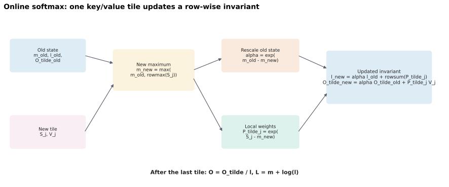

# FlashAttention-2 初学者教材：从 Online Softmax 到 Triton Tile

## 0. 本文目标与阅读方法

本文面向第一次系统学习 FlashAttention-2（下文简称 FA2）的读者。目标不是背诵一段 kernel，而是建立一条可以独立推导、实现和验证的知识链：

1. 先看懂普通 scaled dot-product attention 的数学和张量形状；
2. 分清算术复杂度、显存容量与 HBM I/O 三种不同成本；
3. 用 weighted sum 掌握 Triton 的 program、tile、stride 和 block pointer；
4. 从一个 score 行推导 online softmax；
5. 把推导扩展成分块 attention forward；
6. 理解 causal mask、数值稳定性与 backward 重算；
7. 解释 FA2 相比 FA1 为什么更快；
8. 建立正确性测试和可信 benchmark；
9. 明确没有可用 GPU 时能验证什么、不能声称什么。

本文讲的是 FA2 的核心算法与课程实现路线，不是某个生产库全部特性的 API 手册。Dropout、variable-length batching、MQA/GQA、KV cache 和不同 GPU 架构的专用流水线只在需要辨清边界时提及。

### 0.1 一手资料索引

后文用下面的简称标注来源。论文结论优先引用论文，Triton 语义优先引用官方文档，作业接口优先引用当前仓库 handout。

| 简称 | 一手资料 | 本文主要使用的内容 |
|---|---|---|
| FA1 | Dao et al., 2022, [FlashAttention: Fast and Memory-Efficient Exact Attention with IO-Awareness](https://openreview.net/forum?id=H4DqfPSibmx)，另见 [NeurIPS 论文 PDF](https://papers.neurips.cc/paper_files/paper/2022/file/67d57c32e20fd0a7a302cb81d36e40d5-Paper-Conference.pdf) | I/O-aware 动机、tiling、recomputation、kernel fusion、I/O 复杂度 |
| FA2 | Dao, 2023, [FlashAttention-2: Faster Attention with Better Parallelism and Work Partitioning](https://arxiv.org/abs/2307.08691)，可直接阅读 [HTML §3](https://arxiv.org/html/2307.08691v1#S3) | FA2 算法、序列维并行、warp 工作划分、实验结论 |
| Online Softmax | Milakov and Gimelshein, 2018, [Online normalizer calculation for softmax](https://arxiv.org/abs/1805.02867) | 在线维护 softmax 最大值和归一化因子 |
| Triton-Attn | Triton 官方 [Fused Attention tutorial](https://triton-lang.org/main/getting-started/tutorials/06-fused-attention.html) | FA2 风格前后向 kernel、causal 分段、FP32 状态和 benchmark |
| Triton-Ptr | Triton 3.6 官方源码中的 [`make_block_ptr` 与 `advance`](https://github.com/triton-lang/triton/blob/v3.6.0/python/triton/language/core.py#L2236-L2263)，以及官方 [`load`](https://triton-lang.org/main/python-api/generated/triton.language.load.html) 文档 | block pointer 的字段、移动、边界加载 |
| Triton-Core | Triton 官方 [`program_id`](https://triton-lang.org/main/python-api/generated/triton.language.program_id.html) 与 [`dot`](https://triton-lang.org/main/python-api/generated/triton.language.dot.html) 文档 | launch grid 索引、块矩阵乘和 accumulator |
| SDPA | PyTorch 官方 [`scaled_dot_product_attention`](https://docs.pytorch.org/docs/stable/generated/torch.nn.functional.scaled_dot_product_attention.html) 文档 | API 语义、shape、causal mask、后端选择与数值差异 |
| Handout-WS | 当前 CS336 handout [4.2.1 Weighted Sum](./cs336_assignment2_systems_extracted.md#L662-L1021) | Triton 入门、block pointer、launch grid 与自定义 backward |
| Handout-Fwd | 当前 CS336 handout [4.2.2 Forward](./cs336_assignment2_systems_extracted.md#L1023-L1220) | 课程版前向算法、kernel grid、精度要求与 causal mask |
| Handout-Bwd | 当前 CS336 handout [backward 与 4.2.3](./cs336_assignment2_systems_extracted.md#L1222-L1280) | 保存/重算策略、$D$ 向量与 tiled backward |

> 版本提示：当前 Triton 官方 fused-attention 教程主要使用 tensor descriptor；当前 CS336 handout 使用 `tl.make_block_ptr`。两者表达的是同一类“从全局张量选取并移动 tile”的映射思想，但 API 不能逐行混抄。block pointer 的准确参数语义可核对当前环境对应的 [Triton 3.6 官方源码](https://github.com/triton-lang/triton/blob/v3.6.0/python/triton/language/core.py#L2236-L2263)。

### 0.2 三条建议阅读路线

- **先懂原理**：依次阅读第 1、2、4、5、8、9、17 节，先忽略 Triton API 细节。
- **完成课程实现**：依次阅读第 3 至 12 节，再按第 15 节的阶段顺序实现。
- **当前没有 GPU**：重点完成第 1 至 7、9、11、13 节的 CPU 验证；把 Triton 性能结论留到有受支持 GPU 时再验证。

---

## 1. 初学者前置知识

### 1.1 最少数学基础

开始前应当熟悉：

- 矩阵乘法和转置；
- softmax 及其减最大值的稳定写法；
- 链式法则和反向传播；
- Big-O 记号；
- batch、sequence、head 和 head dimension 的含义。

不需要先会手写 CUDA，但要接受一个系统事实：GPU 上“少做算术”不一定等于“更快”，数据在 HBM 与片上存储之间移动也要付出时间。FA1 的出发点正是把 attention 设计成 I/O-aware 算法，而不是把它改成近似算法。[FA1 §1、§3](https://papers.neurips.cc/paper_files/paper/2022/file/67d57c32e20fd0a7a302cb81d36e40d5-Paper-Conference.pdf)

### 1.2 本文的向量与矩阵约定

**数学上，所有单个向量都按列向量书写。** 对第 $i$ 个 query 和第 $j$ 个 key：

- $q_i,k_j,v_j\in\mathbb{R}^{d}$ 都是列向量；
- score 是 $s_{ij}=q_i^\top k_j/\sqrt d$；
- 单个输出是 $o_i=\sum_j p_{ij}v_j$，仍是列向量；
- 线性层写作 $y=Wx$。

为了批量计算，把每个列向量的转置堆成矩阵的行：

$$Q=\begin{bmatrix}q_1^\top\\ \vdots\\ q_{S_q}^\top\end{bmatrix}\in\mathbb{R}^{S_q\times d},\quad K=\begin{bmatrix}k_1^\top\\ \vdots\\ k_{S_k}^\top\end{bmatrix}\in\mathbb{R}^{S_k\times d},\quad V=\begin{bmatrix}v_1^\top\\ \vdots\\ v_{S_k}^\top\end{bmatrix}\in\mathbb{R}^{S_k\times d}$$

于是矩阵形式为 $S=QK^\top/\sqrt d$、$P=\operatorname{softmax}_{\mathrm{row}}(S)$、$O=PV$。这与 handout 的 attention 定义一致。[Handout：L1031-L1037](./cs336_assignment2_systems_extracted.md#L1031-L1037)

**PyTorch 是另一个层面。** 单头输入通常存成 `(B, S, d)`，多头常存成 `(B, H, S, d)`；特征位于最后一维，因此代码用 `Q @ K.transpose(-2, -1)`。数学上的列向量约定没有改变，只是批量 Tensor 把每个 $q_i^\top$ 存成最后一维的一行。类似地，数学上线性层是 $y=Wx$，PyTorch 的 feature-last 批量实现对应 `y = x @ W.T`。PyTorch SDPA 的官方 shape 也是 batch/head 维在前、序列和 embedding 维在后。[SDPA 参数与 shape](https://docs.pytorch.org/docs/stable/generated/torch.nn.functional.scaled_dot_product_attention.html)

### 1.3 最少 GPU 与 Triton 基础

先记住四层抽象：

| 层次 | 初学时需要知道什么 |
|---|---|
| HBM / global memory | 容量大，kernel 间共享；大 Tensor 通常驻留于此 |
| 片上存储 | 寄存器和 shared memory/SRAM 更快但更小；tile 的活跃状态应尽量留在这里 |
| Triton program instance | launch grid 中的一个程序实例，通过 `tl.program_id(axis)` 取得坐标 |
| tile | 一个 program 一次处理的规则数据块，例如 $B_q\times d$ 的 query block |

FA2 论文用 CUDA 的 thread block/warp 解释工作划分；Triton 则让开发者编写 block-level program，编译器再映射到 GPU 线程和指令。不要把“一个 Triton program”机械理解成“一个 Python 线程”或“一个 CUDA thread”。`tl.program_id` 返回当前 program 在最多三维 launch grid 上的索引。[FA2 §2.1](https://arxiv.org/html/2307.08691v1#S2.SS1)；[Triton `program_id`](https://triton-lang.org/main/python-api/generated/triton.language.program_id.html)

---

## 2. Naive attention 到底贵在哪里

### 2.1 三段式实现

忽略 dropout，普通 attention 常被拆成三个阶段：

```python
scores = Q @ K.transpose(-2, -1) * scale
scores = scores.masked_fill(~allowed, float("-inf"))
probs = torch.softmax(scores, dim=-1)
output = probs @ V
```

若单头 Tensor 为 `(B, S, d)`，则 `scores` 和 `probs` 都是 `(B, S, S)`。多头时它们是 `(B, H, S, S)`。handout 直接指出，长序列下这类 score 矩阵会造成 OOM。[Handout：L617-L633](./cs336_assignment2_systems_extracted.md#L617-L633)

### 2.2 容量、算术与 I/O 是三笔不同的账

令元素大小为 $e$ bytes。一个 `(B,H,S,S)` 中间矩阵占 $BHS^2e$ bytes，而一个 `(B,H,S,d)` 输入或输出只占 $BHSde$ bytes。

例如 $B=1$、$H=1$、$S=8192$、FP16 时，仅一个 score 矩阵就是 $8192^2\times2=128$ MiB；若 $H=32$，则是 4 GiB。训练时 autograd 还可能需要保存 probability 或产生同量级临时量，因此“显存中能放下输入”远不代表“能完成 backward”。

三种复杂度必须分开：

| 成本 | Naive attention | FlashAttention 的变化 |
|---|---|---|
| 算术量 | 主项 $O(BHS^2d)$ | 仍是精确 dense attention，主项没有降成线性 |
| score/probability 中间存储 | $O(BHS^2)$ | 不在 HBM 物化完整矩阵 |
| HBM I/O | 多次写回并读入 $S$、$P$ | tile 在片上生成、消费后丢弃 |


图中左侧把 $S$、$P$ 作为完整 $N\times N$ 矩阵写入并读回 HBM；右侧只让当前 score tile 和 online-softmax 状态在 fused program 内存活，最终向 HBM 写回 $O$ 与 $L$。

因此 FlashAttention 的核心不是“少算所有 query-key 对”，而是“以更合适的顺序算，并避免把完整 $S$、$P$ 往返 HBM”。FA1 证明，在序列长度 $N$、head dimension $d$、SRAM 容量 $M$ 的模型下，标准 attention 的 HBM 访问量为 $\Theta(Nd+N^2)$，其 tiled 算法为 $\Theta(N^2d^2/M)$；在论文讨论的典型 $d$ 与 $M$ 下，后者显著更少。[FA1 Theorem 2，论文 §3.2](https://papers.neurips.cc/paper_files/paper/2022/file/67d57c32e20fd0a7a302cb81d36e40d5-Paper-Conference.pdf)

本仓库上一份 [CPU benchmark 报告](./03_01_pytorch_attention_cpu_benchmark_report.md#L16-L24) 给出了一个具体边界：在 20 GiB 地址空间限制下，naive FP32 attention 的 `B=8,S=8192,d=16` forward 可以完成，但 backward 会在申请额外的 2 GiB score-sized buffer 时 OOM。这正是 `(B,H,S,S)` 中间 Tensor 随 $S^2$ 增长的本地实证。

### 2.3 用具体数字建立数据体积直觉

#### 2.3.1 先分清三个层级

一个 attention 层并不只产生一个数字，而是会产生多个不同尺度的 Tensor：

1. **一个 score 或 probability Tensor**：shape 为 `(B,H,S,S)`，固定 $B,H$ 时，元素数随 $S^2$ 增长；
2. **一个 attention 层**：可能同时持有或为 backward 保存一个到多个 `(B,H,S,S)` Tensor，还包括 shape 为 `(B,H,S,d)` 的 $Q,K,V,O$；固定 $B,H,d$ 时，后者的元素数随 $S$ 增长；
3. **整个 $L$ 层模型**：训练 forward 结束时，多层的 saved activations 可能同时存活，因此需要再按层累加。

单个 `(B,H,S_q,S_k)` Tensor 的字节数为 $BH S_qS_ke$；self-attention 中 $S_q=S_k=S$，所以是 $BHS^2e$。这里 $e=2$ 表示 FP16/BF16，$e=4$ 表示 FP32。

> **最重要的口径**：下面表格中的“一个 score/probability”只是**一个 attention 层中的一个 `(B,H,S,S)` Tensor**，不是整个层的全部内存，更不是整个模型的总内存。

#### 2.3.2 一个多头 attention 层有多大

先取一个常见且容易心算的配置：`B=1,H=32,d=128,BF16`，对应 $d_\text{model}=Hd=4096$。单个 $Q/K/V/O$ 的 shape 是 `(1,32,S,128)`，而单个 score 或 probability 的 shape 是 `(1,32,S,S)`；后者可以理解为 32 个 attention heads 各自持有一张 $S\times S$ 矩阵：

| $S$ | 单个 `(B,H,S,d)` 的 $Q/K/V/O$ | 单个 `(B,H,S,S)` 的 score 或 $P$ | 后者是前者的多少倍 |
|---:|---:|---:|---:|
| 1024 | 8 MiB | 64 MiB | 8 倍 |
| 2048 | 16 MiB | 256 MiB | 16 倍 |
| 4096 | 32 MiB | 1 GiB | 32 倍 |
| 8192 | 64 MiB | 4 GiB | 64 倍 |
| 16384 | 128 MiB | 16 GiB | 128 倍 |
| 1,000,000（1M） | 约 7.63 GiB | 约 58.21 TiB | 7812.5 倍 |

表中假设 score/probability Tensor 也以 BF16 存储。若某个实现将它以 FP32 保存，第三列及后续相应估算全部再乘 2；FP32 accumulator 是否最终写入 HBM，要看具体 kernel 和 autograd 实现。

这个比例本质上是 $S/d$。当 $S=8192,d=128$ 时，一个 $Q$ 只有 64 MiB，但一个 $S$ 或 $P$ 已经有 4 GiB。若 naive forward 的某个时刻同时存在 $S$ 和 $P$，仅这两项就是 8 GiB；这仍然只是**一个 attention 层**，尚未计算参数、梯度、optimizer state、MLP activations、allocator workspace 和其他临时量。

Batch size 也会按比例放大这些数字。例如把上例从 `B=1` 改成 `B=8`，`S=4096` 时单个 `(B,H,S,S)` Tensor 会从 1 GiB 增为 8 GiB；`S=8192` 时会从 4 GiB 增为 32 GiB。

#### 2.3.3 多层训练为什么会继续累加

假设模型有 32 个 Transformer layers，每层一个 self-attention。不同层的 $P$ 来自不同输入和参数，不能共享。普通训练 forward 结束、backward 尚未开始时，各层为 backward 保存的 Tensor 会同时存活。

仍使用 `B=1,H=32,BF16`，这里只统计每层保存的 `(B,H,S,S)` Tensor：

| $S$ | 一个 `(B,H,S,S)` Tensor/层 | 32 层各保存 1 个 | 32 层各保存 2 个 |
|---:|---:|---:|---:|
| 2048 | 0.25 GiB | 8 GiB | 16 GiB |
| 4096 | 1 GiB | 32 GiB | 64 GiB |
| 8192 | 4 GiB | 128 GiB | 256 GiB |
| 16384 | 16 GiB | 512 GiB | 1 TiB |

“每层保存几个 `(B,H,S,S)` Tensor”取决于具体实现：

- fused softmax backward 可能只需保存 $P$，即接近 1 份 `(B,H,S,S)` storage；
- 拆开的手写 softmax 可能让指数结果、归一化结果等多个 storage 留给 backward，即接近 2 份或更多；
- compiler、算子融合和内存复用会改变准确常数，但不会改变 naive 实现的 $S^2$ 主导趋势。

因此上表不是某个 PyTorch backend 的精确峰值，而是帮助判断数量级的 1 份/2 份模型。真实训练内存还要加上各层其他 shapes 的 activations、参数、参数梯度、optimizer state、通信 buffer 和 backward workspace。

#### 2.3.4 为什么推理不能机械乘层数

是否乘层数取决于生命周期：

- **训练**：forward 必须把 backward 所需状态留到之后，多个层的 saved activations 会叠加，通常需要考虑 $L$ 倍；
- **整段 prefill 推理**：没有 backward，上一层的临时 score/probability 可在该层结束后释放，峰值通常由“单层临时峰值 + 模型常驻状态”决定，不会把所有层的 score 简单相加；
- **自回归单 token decoding**：每步 query length 通常为 1，score shape 更接近 `(B,H,1,S)`，不再是该步的 $S^2$ 临时量；此时长期增长的主要对象通常是所有层的 KV cache；
- **Activation checkpointing**：能减少同时保存的层数，但重算某个 naive attention 层时仍要物化该层的 `(B,H,S,S)` 临时量，因此不能解决“单层本身已经 OOM”的情况。

#### 2.3.5 KV cache 为什么缓存 $K,V$，却不缓存 $S,P$

对标准自回归 Transformer，每一层都有自己独立的 KV cache。它保存历史 token 在该层产生的：

- $K_\text{cache}$：通常是完成 key projection，并应用该位置对应的 RoPE 之后的 key；
- $V_\text{cache}$：完成 value projection 后的 value。

它通常**不保存**历史 query、完整 score $S$ 或 probability $P$。原因来自这些量能否被未来步骤复用。

生成第 $t$ 个 token 时，该层只产生当前 token 的新 query $q_t$、key $k_t$ 和 value $v_t$。将 $k_t,v_t$ 追加到 cache 后，当前输出为：

$$s_t=K_\text{cache}q_t/\sqrt d,\quad p_t=\operatorname{softmax}(s_t),\quad o_t=V_\text{cache}^\top p_t$$

这里 $K_\text{cache},V_\text{cache}\in\mathbb{R}^{T\times d}$，每行分别存一个历史 key/value 的转置；$q_t,s_t,p_t,o_t$ 均按列向量书写。在 PyTorch 的 feature-last 布局中，对应操作通常写成 `q_t @ K_cache.transpose(-2, -1)` 和 `p_t @ V_cache`。

可以把一次 decoding step 理解为：

```python
q_t, k_t, v_t = project(current_hidden_state)
k_t = apply_rope(k_t, position=t)

K_cache[layer].append(k_t)
V_cache[layer].append(v_t)

scores = q_t @ K_cache[layer].transpose(-2, -1)
probs = softmax(scores)
output = probs @ V_cache[layer]

# 这一层当前 step 结束后即可释放。
del scores, probs
```

为什么只缓存 $K,V$：

1. **历史 $K,V$ 会被每一个未来 query 反复使用。** 第 $t+1,t+2,\ldots$ 个 query 都需要与全部历史 keys 打分，并用相应 values 做加权求和。
2. **历史 $S,P$ 只属于生成它们的那个 query。** 新 query $q_{t+1}$ 与旧 query $q_t$ 不同，所以必须重新计算 $K_\text{cache}q_{t+1}$；旧的 $s_t,p_t$ 不能用于新 query。
3. **旧 query 的输出已经算完。** 自回归 decoding 不会再次计算旧位置的输出，因此继续保存旧 $S,P$ 没有复用收益。
4. **若把每一步的 $P$ 都留下，内存会重新变成平方增长。** 第 1 至 $T$ 步的 probability 长度依次约为 $1,2,\ldots,T$，总元素数为 $T(T+1)/2$。

假设每层使用 $H_{kv}$ 个 KV heads、head dimension 为 $d$、缓存长度为 $T$、元素大小为 $e$ bytes，则 $L$ 层 KV cache 的总大小为 $2LBH_{kv}Tde$。它对上下文长度 $T$ 呈线性增长，但因为要跨所有层长期保存，常数仍然很大。

例如 `L=32,B=1,d=128,BF16,T=8192`：

| Attention 类型 | $H_{kv}$ | 32 层 KV cache |
|---|---:|---:|
| 标准 MHA | 32 | 4 GiB |
| GQA | 8 | 1 GiB |
| MQA | 1 | 0.125 GiB（128 MiB） |

这里减少 $H_{kv}$ 会缩小 KV cache。Score/probability 则仍按 query heads 产生，但单 token decoding 时 shape 只是 `(B,H_q,1,T)`，只在当前层、当前 step 临时存在。

还要区分两个推理阶段：

- **Prefill**：一次处理长度为 $T$ 的整段 prompt，同时生成每层的初始 KV cache；naive attention 仍可能物化 `(B,H_q,T,T)`，适合用 FlashAttention。
- **Decode**：之后每次通常只有一个新 query，读取不断增长的 KV cache；这时主要瓶颈逐渐转向 KV cache 容量与读取带宽。

只有调试 attention heatmap、可解释性分析或某些特殊算法才可能主动保留 $P$；这不是标准大模型 serving 中 KV cache 的组成部分。

#### 2.3.6 一个小块和完整矩阵差多少

这里只比较数据体积，具体怎样分块和执行留到第 5 节。取 `S=4096,H=1,BF16`：完整 score 有 $4096^2$ 个元素，占 32 MiB。若把它看成许多 `64 × 64` 小块：

- BF16 tile 只有 $64^2\times2=8$ KiB；
- 即使转成 FP32，也只有 16 KiB；
- 完整 BF16 score 相当于 4096 个这样的 BF16 小块。

关键差别是：普通实现可能把 4096 个小块组成的完整矩阵保存在 HBM；FlashAttention 的目标是只让当前计算需要的少量小块短暂存在，用完即丢弃，而不是同时保存全部 4096 块。

本仓库的 [CPU benchmark](./03_01_pytorch_attention_cpu_benchmark_report.md#L189-L201) 也提供了可核对实例：`B=8,H=1,S=4096,FP32` 时，一个 score 是 512 MiB，手写 softmax 保存的两个主要 `(B,H,S,S)` storages 合计约 1 GiB；到 `S=8192` 时，一个 score 变成 2 GiB，这两个 storages 合计约 4 GiB，并在 backward 中触发 20 GiB 地址空间限制下的 OOM。

### 2.4 为什么简单 fusion 还不够

如果一个 kernel 先在片上算出完整 $S$ 再做 softmax，$S$ 往往根本放不进有限的片上存储。即使单个 forward 勉强融合，训练 backward 若依赖完整 $P$，仍可能把它写到 HBM 保存。FA1 的组合解法是：

1. **Tiling**：每次只计算 $S$ 的一个 tile；
2. **Online softmax**：跨 key tiles 合并 softmax 统计量；
3. **Recomputation**：backward 从 $Q,K,V$ 与归一化统计量重算 $S,P$；
4. **Kernel fusion**：score、mask、softmax 更新和 $PV$ 累加在同一 kernel 内完成。

这四点共同避免在 HBM 中物化完整的 $S$、$P$；只说“用了 tiling”是不完整的。[FA1 §3.1](https://papers.neurips.cc/paper_files/paper/2022/file/67d57c32e20fd0a7a302cb81d36e40d5-Paper-Conference.pdf)；[Handout：L1055-L1073](./cs336_assignment2_systems_extracted.md#L1055-L1073)

---

## 3. 用 weighted sum 学 Triton 程序模型与 VJP

Weighted sum 本身很简单，选择它作为第一个 Triton 例子，是为了隔离并学习两件之后实现 FA2 必需的事情：

1. **Forward 的 Triton 程序模型**：怎样定义 launch grid、怎样让不同 program instances 负责不同输出、怎样用 block pointer 加载 tile、怎样在一个 program 内做归约并写回结果；
2. **Backward 的 VJP**：`torch.autograd.Function.backward` 怎样接收输出端的上游梯度，并直接计算输入端梯度，而不显式构造完整 Jacobian；同时观察多个 programs 写梯度时的所有权与归约问题。

因此这一章不是在优化一个重要算子，而是在用一个数学上足够简单的算子，把“GPU 程序怎样组织”和“自定义算子怎样接入 reverse-mode autograd”分开看清楚。

### 3.0 优先阅读仓库中已有的完整教材

本章只提取与 FA2 直接相关的最小知识，不替代 `institutionalized/triton/docs/` 下已经存在的完整教材。遇到下面概念时，应优先跳转阅读对应内容：

| 主题 | 仓库中更完整的教材位置 |
|---|---|
| Triton program、launch grid、`program_id` 和元素区间映射 | [`triton/docs/vector_add.md:L293-L304`](../../../../triton/docs/vector_add.md#L293-L304)、[`L366-L404`](../../../../triton/docs/vector_add.md#L366-L404)、[`L538-L570`](../../../../triton/docs/vector_add.md#L538-L570) |
| Output tile 的所有权，以及同一 program 沿归约维循环 input tiles | [`triton/docs/03-matrix-multiplication.md:L180-L251`](../../../../triton/docs/03-matrix-multiplication.md#L180-L251)、[`L293-L325`](../../../../triton/docs/03-matrix-multiplication.md#L293-L325) |
| 上游梯度、Jacobian、VJP 和“不显式构造 Jacobian” | [`triton/docs/backpropagation_and_autograd.md:L754-L887`](../../../../triton/docs/backpropagation_and_autograd.md#L754-L887) |
| Triton kernel 封装成 PyTorch custom op，并实现 `autograd.Function.backward` | [`triton/docs/custom_torch_operator_with_triton.md:L107-L172`](../../../../triton/docs/custom_torch_operator_with_triton.md#L107-L172)、[`L636-L1057`](../../../../triton/docs/custom_torch_operator_with_triton.md#L636-L1057) |
| 每个 program 独立写输入梯度，但共享参数梯度需要跨 programs 归约 | [`triton/docs/05-layer-norm.md:L300-L410`](../../../../triton/docs/05-layer-norm.md#L300-L410) |

建议的先修顺序是 `vector_add.md` → `backpropagation_and_autograd.md` → `custom_torch_operator_with_triton.md` → `03-matrix-multiplication.md`。已经掌握这些内容时，可以把本章当成 weighted sum 与 FA2 之间的对应关系索引，直接阅读第 4 节。

### 3.1 从数学到并行任务

给定 $X\in\mathbb{R}^{n\times d}$ 和列向量 $w\in\mathbb{R}^{d}$，计算列向量 $y=Xw\in\mathbb{R}^{n}$。第 $r$ 个输出是 $y_r=x_r^\top w$，其中 $x_r$ 是列向量，而矩阵 $X$ 的第 $r$ 行存的是 $x_r^\top$。

PyTorch 写法很短：

```python
def weighted_sum(x, weight):
    return (x * weight).sum(dim=-1)
```

Triton 练习的价值不在这个算子本身，而在于它包含了 FA2 所需的最小骨架：把行分 tile、用 program id 选择 tile、显式 load、在特征维归约、显式 store。handout 的完整示例见 [L662-L824](./cs336_assignment2_systems_extracted.md#L662-L824)。

### 3.2 一个 program 负责什么

设行 tile 大小为 `ROWS_TILE_SIZE`。launch grid 为 `ceil_div(n, ROWS_TILE_SIZE)` 个 program：

```python
grid = (triton.cdiv(n_rows, ROWS_TILE_SIZE),)
weighted_sum_fwd[grid](...)
```

这里要区分三个概念：

| 概念 | 含义 |
|---|---|
| Triton kernel 定义 | 用 `@triton.jit` 修饰的函数，是所有 program instances 共用的程序模板 |
| 一次 kernel launch | Python 端执行一次 `weighted_sum_fwd[grid](...)` |
| Triton program instance | launch grid 中的一个执行实例，通过 `tl.program_id(axis)` 知道自己负责哪个 tile |

因此，**一次 kernel launch 通常对应多个 program instances，而不是一个 program**。program 数量由 grid 决定：一维 grid `(G,)` 创建 $G$ 个 programs；二维 grid `(G_0,G_1)` 创建 $G_0G_1$ 个 programs。

在 NVIDIA GPU 上，一个 Triton program instance 通常会映射为一个由若干 warps 协作执行的 CUDA thread block/CTA；`num_warps` 控制每个 program 使用多少个 warps。这个硬件映射不影响 Triton 源码层面的核心理解：所有 programs 执行同一个 kernel 函数，但拥有不同的 `program_id`，因而处理不同的数据 tile。

因此“program 和 block 对应”必须说明 block 指什么：

- 若 block 指 **CUDA thread block/CTA**，在常见 NVIDIA Triton kernel 中可近似理解为一个 program instance 对应一个 CTA；
- 若 block 指 **数据 tile**，则不一定一一对应：一个 program 可以固定一个输出 tile，同时在循环中依次读取和处理多个输入 tiles；
- `tl.make_block_ptr` 名称中的 block 是数据区域，不是 CUDA thread block。

program `pid = tl.program_id(0)` 负责全局行区间：

```text
[pid * ROWS_TILE_SIZE, (pid + 1) * ROWS_TILE_SIZE)
```

准确地说，$y$ 是 shape 为 `(n,)` 的一维向量，没有“$y$ 的行”。这里存在两层不同的分块：

1. **跨 programs 分配 $y$ 的不同元素区间。** program `pid` 负责 `y[pid * ROWS_TILE_SIZE : (pid + 1) * ROWS_TILE_SIZE]`。这些区间互不重叠，所以每个 $y_r$ 只由一个 program 写入。
2. **同一个 program 内沿 $D$ 维分块累加。** 对自己负责的每个输出元素，program 仍需计算 $y_r=\sum_{c=0}^{D-1}X_{rc}w_c$。若一次只读取 `D_TILE_SIZE` 个特征，它会在同一个 program 内循环多个 feature tiles，并把部分和累加到该 $y_r$；这不是把同一个 $y_r$ 分给多个 programs。

例如 `n=100, ROWS_TILE_SIZE=16` 时，Python 端只调用一次 `weighted_sum_fwd[grid](...)`，但 `grid=(7,)` 会创建 7 个 program instances：program 0 写 `y[0:16]`，program 1 写 `y[16:32]`，最后 program 6 只写有效的 `y[96:100]`。若 `D=128,D_TILE_SIZE=32`，每个 program 会在内部循环 4 次，才完成它负责的每个 $y_r$。handout 对 launch grid 与 `tl.program_id(0)` 的对应关系有直接说明。[Handout：L805-L824](./cs336_assignment2_systems_extracted.md#L805-L824)

这是 Triton **program-instance 层级**的所有权描述。编译到 GPU 后，一个 program 内部当然可能由多个 hardware threads/warps 协作执行乘法和归约；但不会有另一个 `program_id` 再向同一个 $y_r$ 写一份 partial sum。

### 3.3 block pointer 描述了什么

`tl.make_block_ptr(base, shape, strides, offsets, block_shape, order)` 返回父 Tensor 中一个 block 的指针。各字段的职责如下：

| 字段 | 含义 | weighted sum 示例 |
|---|---|---|
| `base` | 父 Tensor 首元素地址 | `x_ptr` |
| `shape` | 父 Tensor 的逻辑 shape | `(n_rows, D)` |
| `strides` | 每个轴移动一格对应的元素跨度 | `(x_stride_row, x_stride_dim)` |
| `offsets` | 当前 block 左上角的逻辑坐标 | `(pid * Br, 0)` |
| `block_shape` | 一次 load/store 的 tile shape | `(Br, Bd)` |
| `order` | 内存维度顺序提示 | 连续二维行主序常见 `(1, 0)` |

`tile` 不是“结果的一块”的专用名词，而是任意 Tensor 或迭代空间中的一个小块。以矩阵乘法 $C=AB$ 为例，一个 program 可能负责一个 **output tile** $C_{mn}$，并沿归约维循环加载多个 **input tiles** $A_{mk}$、$B_{kn}$，再把部分乘积累加到 output tile。三者都叫 tile。

之所以有时单说 “the tile” 像是在指结果，是因为 program 的工作所有权通常用 output tile 定义；但脱离上下文后这种简称有歧义。本文后续会尽量明确写成 `Q tile`、`K/V tile`、`score tile` 或 `output tile`。

`order` 不是转置操作；真正的地址布局由 `strides` 和 `offsets` 决定。对于 block pointer，`tl.load` 使用 `boundary_check` 和 `padding_option` 处理越界，不能同时再传普通 pointer 形式的 `mask/other`。[Triton `make_block_ptr` 源码](https://github.com/triton-lang/triton/blob/v3.6.0/python/triton/language/core.py#L2236-L2248)；[Triton `load`](https://triton-lang.org/main/python-api/generated/triton.language.load.html)

概念伪代码如下：

```python
pid = tl.program_id(0)
x_block = make_block_ptr(
    x_ptr,
    shape=(n_rows, D),
    strides=(stride_xr, stride_xd),
    offsets=(pid * Br, 0),
    block_shape=(Br, Bd),
    order=(1, 0),
)
w_block = make_block_ptr(..., offsets=(0,), block_shape=(Bd,))
acc = zeros((Br,), fp32)

for feature_tile in range(ceil_div(D, Bd)):
    x_tile = load(x_block, boundary_check=(0, 1), padding="zero")
    w_tile = load(w_block, boundary_check=(0,), padding="zero")
    acc += sum(x_tile * w_tile[None, :], axis=1)
    x_block = x_block.advance((0, Bd))
    w_block = w_block.advance((Bd,))

store(y_block, acc, boundary_check=(0,))
```

`advance((0, Bd))` 表示在逻辑坐标中沿第二维前进 $B_d$，不是手写字节偏移。[Triton `advance` 源码](https://github.com/triton-lang/triton/blob/v3.6.0/python/triton/language/core.py#L2251-L2263)；handout 的对应代码见 [L719-L773](./cs336_assignment2_systems_extracted.md#L719-L773)。

### 3.4 Weighted sum 的 VJP 与 backward 所有权

令上游梯度列向量为 $g=\nabla_y\mathcal L\in\mathbb{R}^{n}$。由 $y_r=x_r^\top w$ 可得 $\nabla_X\mathcal L=gw^\top\in\mathbb{R}^{n\times d}$，以及 $\nabla_w\mathcal L=X^\top g\in\mathbb{R}^{d}$。

这正是 VJP。若把 weighted sum 记为 $y=f(X,w)$，`backward(ctx, grad_output)` 接收到的 `grad_output` 就是 $g=\nabla_y\mathcal L$，它需要返回 $J_f(X,w)^\top g$ 在 $X$ 与 $w$ 两个输入方向上的分量。实现不需要构造完整 Jacobian，只需要使用上面的闭式公式计算 $\nabla_X\mathcal L$ 和 $\nabla_w\mathcal L$。完整推导优先阅读 [`triton/docs/backpropagation_and_autograd.md:L754-L887`](../../../../triton/docs/backpropagation_and_autograd.md#L754-L887)；batch/sequence 维上的共享参数梯度还可参考 [`02_04 PyTorch 梯度累积详解`](./02_04_gradient_accumulation_guide.md)。

两项梯度的并行所有权不同：

- 每个 row-tile program 只负责自己那几行的 $\nabla_X\mathcal L$，写入区域互不重叠；
- 每个 row-tile program 都会对同一个 $\nabla_w\mathcal L$ 贡献部分和，不能让多个 programs 无同步地覆盖同一输出。

handout 的做法是让每个 program 先写一行 `partial_grad_weight`，kernel 结束后再沿 row-tile 维归约。[Handout：L826-L1003](./cs336_assignment2_systems_extracted.md#L826-L1003) 这个例子建立了一个通用判断方法：先问“谁拥有最终输出 tile”，再决定是否需要 partial buffer、atomic、额外归约，或者像 FA2 backward 那样重排计算。

### 3.5 它怎样迁移到 attention

对应关系如下：

| Weighted sum | FA2 forward |
|---|---|
| 一个 program 负责一组 $X$ 行 | 一个 program 负责一个 query tile |
| 固定行 tile，循环 feature tiles | 固定 query tile，循环 key/value tiles |
| FP32 `acc` 累加标量输出 | FP32 `acc` 累加 $B_q\times d$ 输出 |
| `advance` 沿特征维移动 | `advance` 沿 key 序列维移动 |
| 越界元素补零 | query/key 边界分别 mask；softmax score 越界应视为不可见 |

FA2 backward 同样先分析梯度 tile 的写入所有权，再通过工作重排和部分重算避免昂贵的跨 program 同步。[Handout：L1242-L1280](./cs336_assignment2_systems_extracted.md#L1242-L1280)

---

## 4. Online softmax：从一个 query 的输出开始

这一节先不讨论 Triton、program 或 block pointer，只解决一个问题：

> 当一个 query 对应的全部 scores 无法同时放在片上时，怎样分批读取 scores 和 values，同时得到与普通 softmax attention 相同的输出？

### 4.1 普通 attention 输出是“分子除以分母”

固定一个 query 列向量 $q\in\mathbb{R}^{d}$。它与 $N$ 个 key 列向量分别产生 score $s_j=q^\top k_j/\sqrt d$，再用 softmax 权重对 value 列向量 $v_j$ 求和：

$$o=\sum_{j=1}^{N}p_jv_j,\quad p_j=\frac{\exp(s_j)}{\sum_{u=1}^{N}\exp(s_u)}$$

为防止 $\exp(s_j)$ 上溢，先取全行最大值 $m=\max_j s_j$。给所有 scores 同时减去 $m$ 不改变 softmax：

$$o=\frac{\sum_{j=1}^{N}\exp(s_j-m)v_j}{\sum_{j=1}^{N}\exp(s_j-m)}$$

现在可以看出，计算输出只需要三个对象：

| 名称 | 定义 | 作用 |
|---|---|---|
| 最大值 $m$ | $\max_j s_j$ | 让指数输入不大于 0，避免上溢 |
| 分母 $\ell$ | $\sum_j\exp(s_j-m)$ | softmax 的归一化因子 |
| 分子 $z$ | $\sum_j\exp(s_j-m)v_j$ | 尚未归一化的 value 加权和 |

最后只需计算 $o=z/\ell$。这里 $\ell$ 是标量，$z,o\in\mathbb{R}^{d}$ 是列向量。这一步还没有使用分块，只是把普通 attention 改写成后面容易增量更新的形式。[FA1 §3.1](https://papers.neurips.cc/paper_files/paper/2022/file/67d57c32e20fd0a7a302cb81d36e40d5-Paper-Conference.pdf)；[Online Softmax](https://arxiv.org/abs/1805.02867)

### 4.2 为什么“每块各做一次 softmax”是错的

先只看四个 scores，并把它们分成两块：

```text
score tile 1: [1, 2]
score tile 2: [3, 4]
```

若分别计算局部 softmax：

```text
softmax([1, 2]) = [0.2689, 0.7311]
softmax([3, 4]) = [0.2689, 0.7311]
```

直接拼接后四个数之和为 2，不是概率分布。即使再整体除以 2，也是在强行规定两个 tiles 各占 50% 的总概率质量。

真正的全局结果是：

```text
softmax([1, 2, 3, 4])
= [0.0321, 0.0871, 0.2369, 0.6439]
```

tile 1 合计只占约 11.92%，tile 2 合计约占 88.08%。局部 softmax 保留了每个 tile 内部的相对比例，却丢掉了两个 tiles 之间的相对大小。因此不能保存“已经归一化完的局部概率”，而要保存仍可与后续 tile 合并的信息。

### 4.3 第一块处理完后，究竟应该记住什么

继续使用 scores `[1,2]`，并给它们配上最简单的一维 values `[10,20]`。第一块的最大值是 $m_\text{old}=2$，相对这个最大值的未归一化权重为 `[e^-1,1]`。

如果以后不再保存原始 scores，至少要留下：

- $m_\text{old}=2$：旧数据使用的指数基准；
- $\ell_\text{old}=e^{-1}+1\approx1.367879$：旧块的 softmax 分母；
- $z_\text{old}=10e^{-1}+20\approx23.678794$：旧块的 value 加权和。

用这三个量已经可以恢复“只看第一块”时的输出 $z_\text{old}/\ell_\text{old}\approx17.310586$。更重要的是，它们还保留了与后续块合并所需的信息：

- 只有局部概率 `[0.2689,0.7311]` 时，不知道这块相对其他块应占多少总概率；
- 同时保留 $m_\text{old}$ 和 $\ell_\text{old}$，就知道这块未归一化概率质量的尺度；
- 保留使用同一尺度的 $z_\text{old}$，就能同步修正已经累计的 value 加权和。

所以 $m,\ell,z$ 不是凭空设计的三个变量，它们分别保存了**指数基准、分母和分子**。

### 4.4 第二块到来后，为什么旧状态要缩放

第二块 scores 是 `[3,4]`，values 是 `[30,40]`。它带来了更大的最大值 4，所以新的共同基准必须改成 $m_\text{new}=4$。

旧块原来按最大值 2 记录。对任意旧 score $s$：

$$\exp(s-m_\text{new})=\exp(s-m_\text{old})\exp(m_\text{old}-m_\text{new})$$

因此所有旧权重都统一乘 $\alpha=\exp(2-4)=e^{-2}\approx0.135335$。这一步把旧状态从“以 2 为基准”换算成“以 4 为基准”，不需要重新读取旧 scores。

新块相对最大值 4 的未归一化权重是 `[e^-1,1]`。于是新分母为：

$$\ell_\text{new}=e^{-2}\ell_\text{old}+e^{-1}+1\approx1.553002$$

新分子为：

$$z_\text{new}=e^{-2}z_\text{old}+30e^{-1}+40\approx54.240960$$

最终输出是 $o=z_\text{new}/\ell_\text{new}\approx34.926527$，与一次性计算 `softmax([1,2,3,4]) @ [10,20,30,40]` 相同。

这一步只需要记住一句话：

> 最大值改变时，旧分母 $\ell$ 和旧分子 $z$ 必须乘同一个缩放因子，才能与新块处在同一指数基准下。

### 4.5 从手算例子抽象出一般更新式

设当前已处理若干 score tiles，保存的旧状态为 $m_\text{old},\ell_\text{old},z_\text{old}$。现在读入新 score tile $s\in\mathbb{R}^{B_k}$ 及其 value 矩阵 $V\in\mathbb{R}^{B_k\times d}$。

按以下顺序更新：

1. 新最大值：$m_\text{new}=\max(m_\text{old},\max_t s_t)$；
2. 旧状态缩放：$\alpha=\exp(m_\text{old}-m_\text{new})$；
3. 新块未归一化权重：$\widetilde p=\exp(s-m_\text{new})$；
4. 新分母：$\ell_\text{new}=\alpha\ell_\text{old}+\sum_t\widetilde p_t$；
5. 新分子：$z_\text{new}=\alpha z_\text{old}+V^\top\widetilde p$。

初始化为 $m=-\infty,\ell=0,z=0$。全部 key/value tiles 处理完后，输出为 $o=z/\ell$。

概念伪代码如下：

```python
m = -inf
l = 0
z = zeros(d)

for scores, values in tiles:
    m_new = max(m, max(scores))
    alpha = exp(m - m_new)
    p_tilde = exp(scores - m_new)

    l_new = alpha * l + sum(p_tilde)
    z_new = alpha * z + values.T @ p_tilde

    m, l, z = m_new, l_new, z_new

output = z / l
```

实现时必须先保留旧的 $m,\ell,z$，再统一写入新状态。若过早执行 `m = m_new`，随后计算出的 `exp(m - m_new)` 会错误地恒等于 1。



### 4.6 为什么这种更新是精确的

处理完任意若干个 tiles 后，状态始终满足：

$$m=\max_{t\in\text{seen}}s_t,\quad \ell=\sum_{t\in\text{seen}}\exp(s_t-m),\quad z=\sum_{t\in\text{seen}}\exp(s_t-m)v_t$$

证明只需两步：

1. 第一块处理后，三个等式直接由定义成立；
2. 加入新块时，旧项全部乘 $\exp(m_\text{old}-m_\text{new})$，依据第 4.4 节的恒等式，它们恰好被改写成相对 $m_\text{new}$ 的形式；再加上新块的项，等式继续成立。

因此 $z/\ell$ 恰好等于对全部已见 scores 一次做 softmax 后的 weighted sum。Online softmax 只是改变计算和归约顺序，没有删除 query-key 对，也不是近似 attention。有限精度下，不同归约顺序可能产生正常的舍入差异。[FA2 §2.3.1、§3.1.1](https://arxiv.org/html/2307.08691v1#S3.SS1.SSS1)

### 4.7 为什么还要保存 logsumexp

最终状态中的 $L=m+\log\ell$ 就是整行 scores 的 `logsumexp`。Backward 重新算出某个 score $s_t$ 后，可以用 $p_t=\exp(s_t-L)$ 直接恢复对应 probability，不需要保存完整 $P$，也不需要再次运行 online normalization。

当前 handout 要求 forward 保存 $L,Q,K,V,O$，并在 backward 中重算概率。[Handout：L1061-L1095](./cs336_assignment2_systems_extracted.md#L1061-L1095)；[Handout：L1145-L1153](./cs336_assignment2_systems_extracted.md#L1145-L1153)

读完本节，至少应能独立回答：

1. 为什么局部 softmax 不能直接拼接；
2. $m,\ell,z$ 分别保存什么信息；
3. 为什么最大值改变后 $\ell$ 和 $z$ 必须同时缩放；
4. 为什么最终 $z/\ell$ 与普通 attention 完全相同；
5. 为什么保存 $L$ 就能在 backward 重建 $P$。

---

## 5. FA2 forward：从公式到伪代码

### 5.1 Tile 定义

先省略 batch 和 head。设：

- $Q\in\mathbb{R}^{N_q\times d}$；
- $K,V\in\mathbb{R}^{N_k\times d}$；
- query tile 大小为 $B_q$，数量 $T_q=\lceil N_q/B_q\rceil$；
- key/value tile 大小为 $B_k$，数量 $T_k=\lceil N_k/B_k\rceil$。

这里 $B_q,B_k$ 中的 $B$ 表示 block/tile size，不是 batch size；代码中通常对应 `Q_TILE_SIZE` 和 `K_TILE_SIZE`。例如 `Bq=64,Bk=64,d=128` 表示一个 query tile 含 64 个 query tokens，一个 key/value tile 含 64 个 key/value tokens，每个 token 在该 attention head 内的向量维度为 128。因此 $Q_i$ 是 `(64,128)`，$K^{(j)},V^{(j)}$ 是 `(64,128)`，两者相乘得到的当前 score tile 是 `(64,64)`。

第 $i$ 个 query tile 为 $Q_i\in\mathbb{R}^{B_q\times d}$，第 $j$ 个 key/value tile 为 $K^{(j)},V^{(j)}\in\mathbb{R}^{B_k\times d}$。课程算法不沿 head dimension $d$ 分块。[Handout：L1097-L1115](./cs336_assignment2_systems_extracted.md#L1097-L1115)

每个 Triton program 固定一个 `(batch/head, query_tile)`，把 $Q_i$ 留在片上，并循环全部 key/value tiles。对每个 query 行分别维护 $m_i\in\mathbb{R}^{B_q}$、$\ell_i\in\mathbb{R}^{B_q}$ 和未归一化输出 accumulator $A_i\in\mathbb{R}^{B_q\times d}$。

### 5.2 每个 key tile 的更新

初始化 $m_i=-\infty$、$\ell_i=0$、$A_i=0$。对第 $j$ 个 key tile：

$$S_i^{(j)}=\frac{Q_i(K^{(j)})^\top}{\sqrt d}+M_i^{(j)}\in\mathbb{R}^{B_q\times B_k}$$

其中 mask $M_i^{(j)}$ 对可见位置为 0，对不可见位置为 $-\infty$ 或实现中足够小的数。逐行更新最大值 $m_i^{\mathrm{new}}=\max(m_i,\operatorname{rowmax}(S_i^{(j)}))$：

$$\alpha_i=\exp(m_i-m_i^{\mathrm{new}}),\quad \widetilde P_i^{(j)}=\exp(S_i^{(j)}-m_i^{\mathrm{new}}[:,None])$$

$\ell_i^{\mathrm{new}}=\alpha_i\circ\ell_i+\operatorname{rowsum}(\widetilde P_i^{(j)})$，并更新输出 accumulator：

$$A_i^{\mathrm{new}}=\alpha_i[:,None]\circ A_i+\widetilde P_i^{(j)}V^{(j)}$$

循环结束后，$O_i=A_i/\ell_i[:,None]$，且 $L_i=m_i+\log\ell_i$。

这里 `[:, None]` 表示把行向量广播到每一列，$\circ$ 表示逐元素乘法。以上就是 handout Algorithm 1 的逐式展开。[Handout：L1111-L1132](./cs336_assignment2_systems_extracted.md#L1111-L1132)

### 5.3 可逐行对照的伪代码

下面是算法伪代码，不是可直接运行的 Triton：

```python
parallel for batch_head in [0, B * H):
    parallel for query_tile in [0, ceil_div(Nq, Bq)):
        q = load Q[batch_head, query_tile]       # (Bq, d)
        m = full((Bq,), -inf, dtype=fp32)
        l = zeros((Bq,), dtype=fp32)
        acc = zeros((Bq, d), dtype=fp32)

        for key_tile in [0, ceil_div(Nk, Bk)):
            k = load K[batch_head, key_tile]     # (Bk, d)
            v = load V[batch_head, key_tile]     # (Bk, d)

            scores = dot(q, transpose(k)) * scale
            scores = apply_bounds_and_causal_mask(scores)

            m_new = maximum(m, rowmax(scores))
            alpha = exp(m - m_new)
            p_tilde = exp(scores - m_new[:, None])

            acc = acc * alpha[:, None] + dot(cast(p_tilde, v.dtype), v)
            l = l * alpha + rowsum(p_tilde)
            m = m_new

        output = acc / l[:, None]
        logsumexp = m + log(l)
        store O[batch_head, query_tile] = cast_to_output_dtype(output)
        store L[batch_head, query_tile] = logsumexp
```

`tl.dot` 计算两个二维或三维 block 的矩阵乘，并可通过 `acc=` 累加到既有 accumulator；handout 要求片上的 $A_i,\ell_i,m_i$ 使用 FP32，并在写回前转换输出 dtype。[Triton `dot`](https://triton-lang.org/main/python-api/generated/triton.language.dot.html)；[Handout：L1209-L1215](./cs336_assignment2_systems_extracted.md#L1209-L1215)

### 5.4 它为什么不物化完整 attention matrix

在任意时刻，一个 program 只需要：

- 一个 $B_q\times d$ query tile；
- 一个 $B_k\times d$ key tile；
- 一个 $B_k\times d$ value tile；
- 一个 $B_q\times B_k$ 临时 score/probability tile；
- $B_q$ 个最大值与分母；
- 一个 $B_q\times d$ 输出 accumulator。

$S_i^{(j)}$ 和 $\widetilde P_i^{(j)}$ 被当前 tile 消费后即可丢弃。HBM 中保留的是 $Q,K,V,O,L$，而不是完整 $N_q\times N_k$ 的 $S$ 或 $P$。因此 attention-specific saved activations 不再包含元素数为 $N_qN_k$ 的完整矩阵，主要保存项的元素数为 $O((N_q+N_k)d)$。[FA1 §3.1 与 Theorem 1](https://papers.neurips.cc/paper_files/paper/2022/file/67d57c32e20fd0a7a302cb81d36e40d5-Paper-Conference.pdf)；[Handout：L1051-L1067](./cs336_assignment2_systems_extracted.md#L1051-L1067)

---

## 6. Causal mask 与边界

### 6.1 数学定义

对方形 self-attention，位置 $r$ 只能看见位置 $c\le r$。令 query 和 key 的全局索引分别为 $r$、$c$：

$$M_{rc}=\begin{cases}0,&c\le r\\-\infty,&c>r\end{cases}$$

mask 必须在 row maximum 与指数运算之前加到 score 上；否则不可见位置已经参与了 softmax 的归一化。

在 tile 内构造：

```python
q_pos = q_tile_start + tl.arange(0, Bq)
k_pos = k_tile_start + tl.arange(0, Bk)
allowed = k_pos[None, :] <= q_pos[:, None]
scores = tl.where(allowed, scores, -float("inf"))
```

课程 handout 明确要求 `is_causal: tl.constexpr`，并要求为屏蔽位置加 `-1e6`；完成作业时应遵循该接口和测试约定。[Handout：L1218-L1220](./cs336_assignment2_systems_extracted.md#L1218-L1220)

### 6.2 三类 causal tiles

对一个 query tile，key tiles 可分为：

1. **严格位于对角线左侧**：全部可见，不需要逐元素 causal 比较；
2. **与对角线相交**：需要 $B_q\times B_k$ 的逐元素 mask；
3. **严格位于对角线右侧**：全部不可见，可以直接跳过。

当前 Triton fused-attention 教程把 causal 计算拆成 off-band 与 on-band 阶段，避免在所有 tiles 上都做 mask。[Triton-Attn](https://triton-lang.org/main/getting-started/tutorials/06-fused-attention.html)

### 6.3 非整除边界不是 causal mask

序列长度不是 tile 大小整数倍时，还需处理越界的 query/key：

- 越界 query 行不应 store；
- 越界 key 列在 softmax 中必须不可见，不能像普通 weighted sum 那样把 score 补 0，因为 0 会贡献 $\exp(0)=1$；
- 越界 value 可以在其 probability 已为 0 的前提下补 0。

因此要把“父 Tensor 越界检查”和“语义上的 causal mask”分开。block pointer 的 `boundary_check` 负责前者，score 上的布尔条件负责后者。[Triton `load`](https://triton-lang.org/main/python-api/generated/triton.language.load.html)

### 6.4 PyTorch causal 语义的一个边界

PyTorch SDPA 在方形矩阵下使用下三角 causal mask；当 query length 与 key length 不同，其 `is_causal=True` 使用 upper-left causal bias 对齐，并且不能同时再传 `attn_mask`。实现 cross-attention 或 KV-cache 场景时，不能未经确认就套用方形条件 $c\le r$。[SDPA `is_causal`](https://docs.pytorch.org/docs/stable/generated/torch.nn.functional.scaled_dot_product_attention.html)

---

## 7. 数值稳定性清单

### 7.1 必须做的事

1. **减去最新行最大值。** 每轮都用 $m^{\mathrm{new}}$ 重标定旧状态和新 tile。
2. **旧 accumulator 也要重标定。** 只更新分母、不乘 $\alpha$ 更新 $A$，结果会系统性错误。
3. **关键状态使用 FP32。** handout 要求 $A,\ell,m$ 为 `tl.float32`；低精度 $Q,K,V$ 可用 Tensor Core 路径，写回 $O$ 时再转换。[Handout：L1211-L1215](./cs336_assignment2_systems_extracted.md#L1211-L1215)
4. **mask 在 max 之前生效。** 被屏蔽的大 score 不能污染 $m$。
5. **处理全屏蔽行。** 若一个语义允许整行没有有效 key，则 $m=-\infty$、$\ell=0$ 会导致无效运算；必须定义输出语义并显式处理。标准方形 causal self-attention 因为可见自身，正常行不会全屏蔽。

### 7.2 `exp2` 与自然指数

GPU kernel 常用 `exp2`。因为 $\exp(x)=2^{x\log_2 e}$，可以先把 score scale 乘 $\log_2 e$，再使用 `exp2`；$L$ 的底数也必须一致换算。当前 Triton 官方教程在 forward 中把 softmax scale 乘约 `1.44269504`，并配套使用 `exp2/log2`。[Triton-Attn](https://triton-lang.org/main/getting-started/tutorials/06-fused-attention.html)

### 7.3 “精确”不等于逐 bit 相同

FA2 没有稀疏化或近似掉 attention 项，数学目标与普通 dense attention 相同；但并行归约顺序、FP16/BF16 输入、FP32 accumulator、`exp` 近似以及 backend 都会造成正常的浮点差异。PyTorch 官方也明确说明，SDPA 因 fused backend 和浮点运算顺序不同，输出可能不同。[SDPA 数值说明](https://docs.pytorch.org/docs/stable/generated/torch.nn.functional.scaled_dot_product_attention.html)

### 7.4 FP32 输入也不自动意味着 IEEE matmul

当前 Triton `tl.dot` 文档说明，在支持 Tensor Core 的 NVIDIA GPU 上，FP32 输入默认 `input_precision="tf32"`；TF32 会改变输入精度。若验证要求严格 FP32 语义，应显式选择合适的 `input_precision`，并把精度策略写入实验报告。[Triton `dot`](https://triton-lang.org/main/python-api/generated/triton.language.dot.html)

---

## 8. FA2 相比 FA1 的三类核心改进

FA1 已经解决了“不把完整 $S,P$ 写入 HBM”的核心问题。FA2 的重点不是再发明一个不同的 attention，而是改进算法中的非矩阵运算，以及 thread block 和 warp 的工作划分。论文将贡献明确归纳为以下三类。[FA2 摘要与 §1](https://arxiv.org/abs/2307.08691)

### 8.1 改进一：减少 non-matmul FLOPs

GPU 的矩阵乘有专用高吞吐单元，而 max、exp、逐元素乘除等 non-matmul 操作相对昂贵。FA2 维护未归一化的输出 accumulator $A$，每轮只按新最大值缩放旧 $A$，到所有 key tiles 结束后才除以 $\ell$。这避免了每个 tile 都把两部分输出归一化再合并。

Backward 使用预先计算的 $D$ 简化 softmax 梯度。论文以 A100 为例指出 FP16/BF16 matmul 理论吞吐可达 non-matmul FP32 的 16 倍，因此少量 non-matmul FLOPs 也可能占据明显时间。[FA2 §3.1](https://arxiv.org/html/2307.08691v1#S3.SS1)

### 8.2 改进二：沿序列维增加 thread-block 并行

FA1 主要在 batch 和 head 上并行。当 $B\times H$ 很小而序列很长时，可调度的 thread blocks 不足，许多 SM 可能空闲。

FA2 forward 把不同 query tiles 分给不同 thread blocks。每个 block 独立计算自己的 $O_i,L_i$，不需要跨 block 通信，于是并行任务数从近似 $B\times H$ 增加到 $B\times H\times T_q$。当前 handout 的简化接口使用 grid `(T_q, batch_size)`，并要求每个 program 只读写一个 batch 的一个 query tile。[FA2 §3.2](https://arxiv.org/html/2307.08691v1#S3.SS2)；[Handout：L1155-L1159](./cs336_assignment2_systems_extracted.md#L1155-L1159)

从循环顺序看，这对应“query tile 在外、key/value tiles 在内”：一个 program 固定 $Q_i$，在片上完成它的全部 online softmax 状态，最后只写一次 $O_i,L_i$。

### 8.3 改进三：thread block 内从 sliced-K 改为 sliced-Q

一个 thread block 内通常有多个 warps。

- **FA1 的 sliced-K**：warps 分担同一 query rows 对不同 K/V slices 的工作，各自产生同一输出的部分和；之后需要把中间结果写入 shared memory、同步并归约。
- **FA2 的 sliced-Q**：warps 共享 K/V tile，但各自负责不同 query rows；每个 warp 持有自己输出行的完整部分结果，不再需要对输出做 warp 间求和。

这样减少 shared-memory 读写与同步。它是 thread block **内部**的工作划分，不能与上一节“不同 query tiles 分给不同 thread blocks”混为一谈。[FA2 §3.3](https://arxiv.org/html/2307.08691v1#S3.SS3)


左侧多个 warps 产生同一输出的 partial results，必须通信和归约；右侧每个 warp 拥有独立 query rows 及其输出，K/V tile 可共享，但输出无需跨 warp 求和。

### 8.4 如何理解论文性能数字

FA2 论文报告其相对 FA1 约有 2 倍加速，在 A100 上达到理论峰值的 50% 至 73%，并报告 GPT 类模型训练最高 225 TFLOP/s/A100。它们是论文特定硬件、shape、dtype 和实现下的测量，不是任何 Triton 教学实现都自动获得的保证。[FA2 摘要](https://arxiv.org/abs/2307.08691)

---

## 9. Backward：保存什么，重算什么

### 9.1 普通 backward 为什么依赖大矩阵

令上游梯度为 $dO\in\mathbb{R}^{N_q\times d}$。忽略 mask 的不可见位置后，标准矩阵形式是：

$$dV=P^\top dO,\quad dP=dOV^\top,\quad dS=P\circ\left(dP-\operatorname{rowsum}(P\circ dP)[:,None]\right)$$

其余两个输入梯度为 $dQ=dSK/\sqrt d$ 和 $dK=dS^\top Q/\sqrt d$。

如果 forward 保存完整 $P$，其元素数是 $N_qN_k$；若不保存，就必须能廉价重建它。handout 的标准 backward 展开见 [L1039-L1053](./cs336_assignment2_systems_extracted.md#L1039-L1053)。

### 9.2 用 $L$ 重建 $P$

forward 保存每行 $L_i=\log\sum_j\exp(S_{ij})$。backward 重新计算当前 score tile 后，用 $P_i^{(j)}=\exp(S_i^{(j)}-L_i[:,None])$ 恢复概率。

mask 必须与 forward 完全一致。这样每次只重建一个 $B_q\times B_k$ 的概率 tile，用完即丢弃。

### 9.3 $D$ 向量消掉 softmax Jacobian 的显式构造

定义 $D_i=\sum_{c=1}^{d}O_{ic}\,dO_{ic}=\operatorname{rowsum}(O\circ dO)_i$。

由于 $O=PV$ 且 $dP=dOV^\top$，同一个量也等于 $\operatorname{rowsum}(P\circ dP)_i$，于是 $dS_{ij}=P_{ij}(dP_{ij}-D_i)$。

整个 backward 不需要显式构造 softmax Jacobian，也不需要再运行 online softmax；它只需按 tile 重建 $P$。handout 给出了 $D$ 的等价推导和完整公式。[Handout：L1075-L1095](./cs336_assignment2_systems_extracted.md#L1075-L1095)

### 9.4 保存与重算的账

课程版 forward 保存：

| 保存项 | 用途 | 量级 |
|---|---|---:|
| $Q,K,V$ | 重算 $S,P$ 并计算三个输入梯度 | $O((N_q+2N_k)d)$ |
| $O$ | 计算 $D$ | $O(N_qd)$ |
| $L$ | 重建 $P=\exp(S-L)$ | $O(N_q)$ |
| causal flag | backward 重建同一 mask | 常数 |

不保存完整 $S,P$，因此 attention-specific saved activations 不含 $O(N_qN_k)$ 项。代价是 backward 增加重算 FLOPs；FA1 的关键观察是，这种重算在数据已位于片上时，比从 HBM 读回巨大的 $P$ 更划算。[FA1 §3.1 Recomputation](https://papers.neurips.cc/paper_files/paper/2022/file/67d57c32e20fd0a7a302cb81d36e40d5-Paper-Conference.pdf)；[Handout：L1147-L1153](./cs336_assignment2_systems_extracted.md#L1147-L1153)

若 forward 包含 dropout，还必须使 backward 能重现同一 dropout mask，通常保存随机数状态而不是完整 mask；本文和当前 handout 的核心算法不展开这部分。

### 9.5 为什么 tiled backward 会计算两次 $P$

梯度有两种自然所有权：

- 固定 key tile，遍历 query tiles，适合累加并一次写出该 tile 的 $dK,dV$；
- 固定 query tile，遍历 key tiles，适合累加并一次写出该 tile 的 $dQ$。

若强行一次遍历同时写三者，多个 program 会更新同一梯度 tile，需要跨 block 同步或 atomic。课程的可选 Triton backward 选择两次重建 $P$：一次求 $dK,dV$，一次求 $dQ$，以额外计算换取无 atomic 的独立写入。[Handout：L1242-L1280](./cs336_assignment2_systems_extracted.md#L1242-L1280)

当前作业的必做 backward 则允许先用普通 PyTorch 函数配合 `torch.compile`，不要求一开始就手写 Triton backward。[Handout：L1222-L1230](./cs336_assignment2_systems_extracted.md#L1222-L1230)

---

## 10. 从算法 tile 映射到 Triton

### 10.1 Grid

完整多头实现可把第二个 grid 轴展平为 `batch_head = batch_index * H + head_index`：

```python
grid = (triton.cdiv(Nq, Bq), B * H)
```

program 内：

```python
query_tile = tl.program_id(0)
batch_head = tl.program_id(1)
```

课程简化版没有显式 head 轴，要求 `(T_q, batch_size)`。[Handout：L1155-L1159](./cs336_assignment2_systems_extracted.md#L1155-L1159)

### 10.2 指针几何

以 `Q` 的逻辑 shape `(B, Nq, d)` 为例，先用 batch offset 移动 base，再创建二维 block pointer：

```python
Q_block_ptr = tl.make_block_ptr(
    Q_ptr + batch_index * stride_qb,
    shape=(Nq, D),
    strides=(stride_qq, stride_qd),
    offsets=(query_tile * Bq, 0),
    block_shape=(Bq, D),
    order=(1, 0),
)
```

同理：

- `K_block_ptr` 初始 `offsets=(0, 0)`，shape 为 `(Nk, D)`，block 为 `(Bk, D)`；
- `V_block_ptr` 与 K 同步沿 key 轴移动；
- `O_block_ptr` 指向当前 query tile；
- `L_block_ptr` 指向当前 $B_q$ 行。

每轮末尾调用 `K_block_ptr.advance((Bk, 0))` 和 `V_block_ptr.advance((Bk, 0))`。handout 提供了 Q pointer 骨架并提示在循环末移动 pointers。[Handout：L1160-L1209](./cs336_assignment2_systems_extracted.md#L1160-L1209)

### 10.3 算法对象到 Triton 对象的映射

| 算法对象 | Triton 中的典型表示 | 生命周期 |
|---|---|---|
| $Q_i$ | `tl.load(Q_block_ptr)` | 整个 program |
| $K^{(j)},V^{(j)}$ | 当前循环的 `tl.load` | 一次 key-tile 迭代 |
| $S_i^{(j)}$ | `tl.dot(q, tl.trans(k)) * scale` | 一次迭代 |
| $m_i,\ell_i$ | FP32 block 向量 | 整个 program |
| $A_i$ | FP32 block accumulator | 整个 program |
| $O_i,L_i$ | `tl.store` 到 global memory | program 末尾 |

block pointer 只描述逻辑地址区域，并不保证某个对象一定落在特定物理片上存储中；寄存器、shared memory、spill 和指令选择仍由编译器与资源约束决定。tile 过大可能造成寄存器压力或降低 occupancy，因此“能放下”不等于“最快”。FA2 论文也把 block size tuning 单独列为实现问题。[FA2 §3.3](https://arxiv.org/html/2307.08691v1#S3.SS3)

### 10.4 当前官方教程与 handout 怎样一起读

建议按职责对照，而不是逐行对照：

| 要理解的问题 | 首选资料 |
|---|---|
| 为什么维护 $m,\ell,A$ | FA2 论文 §3.1、handout Algorithm 1 |
| `tl.make_block_ptr` 每个参数是什么 | Triton-Ptr |
| 课程 kernel 的 grid、stride、保存项是什么 | Handout-Fwd |
| production-like causal 分段、`exp2`、autotune 怎么组织 | Triton-Attn |
| `tl.dot(..., acc=acc)` 与输入精度是什么 | Triton-Core |

官方教程会随 Triton 演进，当前版本使用 tensor descriptor；handout 的 block-pointer 写法更适合本作业。实现时以项目锁定版本和测试为准，不要把不同版本 API 拼成一段代码。

---

## 11. 正确性验证：先证明“算对”，再讨论“算快”

### 11.1 建立三层 oracle

1. **小规模 FP64 naive reference**：最容易审计，适合 CPU；
2. **纯 PyTorch tiled reference**：逐步暴露 $m,\ell,A,L$，用于定位 recurrence 错误；
3. **Triton kernel**：只在前两层一致后接入。

handout 也要求先实现慢但易调试的纯 PyTorch FA2 forward，再实现 Triton kernel，并建议逐个 Triton 操作与 tiled PyTorch 中间结果比较。[Handout：L1145-L1157](./cs336_assignment2_systems_extracted.md#L1145-L1157)

一个最小 naive reference：

```python
def attention_reference(q, k, v, is_causal=False):
    # q: (B, Sq, d), k/v: (B, Sk, d)
    scores = q @ k.transpose(-2, -1) / math.sqrt(q.shape[-1])
    if is_causal:
        sq, sk = q.shape[-2], k.shape[-2]
        allowed = torch.arange(sk)[None, :] <= torch.arange(sq)[:, None]
        scores = scores.masked_fill(~allowed.to(scores.device), float("-inf"))
    probs = torch.softmax(scores, dim=-1)
    return probs @ v, torch.logsumexp(scores, dim=-1)
```

这段方形 causal 参考只适用于本文的普通 self-attention；非方形情况应按目标 API 定义构造 mask。

### 11.2 Forward 测试矩阵

至少覆盖：

| 维度 | 建议 case |
|---|---|
| mask | non-causal、causal |
| shape | 单 tile、多 tiles、非 tile 整除、$N_q\ne N_k$（若接口支持） |
| dtype | FP32、FP16/BF16（硬件支持时） |
| 数值 | 普通随机值、放大 logits、相等 logits、边界最大值位于后续 tile |
| stride | contiguous；若接口承诺支持，再测转置/切片后的 non-contiguous |

比较 `O` 和 `L`，不要只比较最终 loss。先用 `torch.testing.assert_close` 的 dtype-appropriate tolerance，再检查所有结果有限。浮点 fused 实现不应要求 bitwise equality。[SDPA 数值说明](https://docs.pytorch.org/docs/stable/generated/torch.nn.functional.scaled_dot_product_attention.html)

### 11.3 Online softmax 的独立单元测试

在写 Triton 前，用 CPU 随机生成一个 score 行并随机切成不同块，检查：

1. 最终 $m$ 等于全局 `max`；
2. $m+\log\ell$ 等于 `logsumexp`；
3. $z/\ell$ 等于 `softmax(scores) @ V`；
4. 改变切块方式仍在容差内一致；
5. 后续 tile 出现极大 score 时，旧状态正确乘 $\alpha$。

这能把数学 recurrence 的错误与 Triton 地址错误分离。

### 11.4 Backward 测试

对同一份 $Q,K,V,dO$：

1. reference 和被测实现分别计算 $O$；
2. 分别对标量 `(O * dO).sum()` 调用 backward；
3. 比较 $dQ,dK,dV$；
4. causal case 也必须单独比较；
5. 额外检查 masked scores 对应路径不会影响输出和梯度。

课程提供 `test_flash_forward_pass_pytorch`、`test_flash_forward_pass_triton` 和 `test_flash_backward` 三个目标，命令见 [Handout：L1147-L1153、L1216、L1226-L1230](./cs336_assignment2_systems_extracted.md#L1147-L1153)。本仓库的 [`test_attention.py:L11-L59`](../tests/test_attention.py#L11-L59) 明确比较 $O$ 与 $L$，[`test_attention.py:L66-L105`](../tests/test_attention.py#L66-L105) 分别覆盖 CUDA forward 和三个输入梯度；需要接入的两个 adapter 当前位于 [`adapters.py:L7-L33`](../tests/adapters.py#L7-L33)。

PyTorch SDPA 可以作为额外参考，但它会根据输入与环境自动选择 FlashAttention-2、memory-efficient 或 math backend。若需要固定 reference，应使用 `torch.nn.attention.sdpa_kernel` 明确选择 backend，并记录选择结果。[SDPA backend 选择](https://docs.pytorch.org/docs/stable/generated/torch.nn.functional.scaled_dot_product_attention.html)

---

## 12. 性能验证：测到的究竟是什么

### 12.1 公平 benchmark 的最小规范

1. 先创建输入，不把随机数生成计入 kernel 时间；
2. warmup 到编译、cache 和频率状态稳定；
3. 使用 `triton.testing.do_bench` 或 CUDA event，确保正确处理异步执行；
4. forward、backward、forward+backward 分开报告；
5. 所有实现使用相同 shape、dtype、causal 设置和梯度条件；
6. 同时记录 latency、峰值显存、是否 OOM；
7. 报告 GPU 型号、软件版本、tile size、`num_warps`、`num_stages`；
8. 多次测量并报告中位数及分位数，不只给最好一次；
9. 正确性失败的配置不得进入性能表。

当前 handout 要求用 `triton.testing.do_bench` 比较 Triton FA2 和普通 PyTorch attention，并在单张 B200 上固定 batch size 1、causal mask，扫描序列长度、head dimension 和 dtype。[Handout：L1232-L1240](./cs336_assignment2_systems_extracted.md#L1232-L1240)

### 12.2 推荐结果表

| 实现 | $B,H,S,d$ | dtype | causal | tile $(B_q,B_k)$ | forward ms | backward ms | end-to-end ms | peak MiB | 状态 |
|---|---|---|---|---|---:|---:|---:|---:|---|
| naive PyTorch |  |  |  | N/A |  |  |  |  |  |
| PyTorch SDPA |  |  |  | backend=... |  |  |  |  |  |
| Triton FA2 |  |  |  |  |  |  |  |  |  |

如果报告 TFLOP/s，必须同时写清 FLOP 计数约定，尤其是 causal attention 是否只统计下三角有效工作。否则不同报告的数字无法直接比较。

### 12.3 应该期待什么趋势

- naive 中间内存随 $S^2$ 增长；
- FA2 不保存完整 $S,P$，attention-specific 中间内存应随序列长度近似线性增长；
- 长序列通常更能显示减少 HBM I/O 的价值；
- 小 shape 可能由 launch、调度或编译开销主导；
- tile 增大通常减少循环和重复读取，但也会增加寄存器/片上存储压力；
- causal kernel 若跳过严格未来 tiles，实际工作量可明显低于 non-causal。

这些是应验证的假设，不是脱离硬件即可保证的结果。FA1 用 I/O 分析和 A100 实验说明 HBM 访问是其场景中的主要性能因素；FA2 的性能数字同样来自特定 A100 实验。[FA1 §3.2、§4.3](https://papers.neurips.cc/paper_files/paper/2022/file/67d57c32e20fd0a7a302cb81d36e40d5-Paper-Conference.pdf)；[FA2 §4](https://arxiv.org/html/2307.08691v1#S4)

---

## 13. 没有 GPU 时能做什么

### 13.1 可以完成的实验

- 用 CPU FP64 实现并验证 naive attention；
- 用纯 PyTorch 循环实现 tiled FA2 forward；
- 验证 online softmax 的 $m,\ell,A,L$ 不变量；
- 比较 naive 与 tiled 版本的 $O,L$；
- 用 autograd reference 验证 backward 公式；
- 测试 causal mask、非整除边界与极端 logits；
- 静态检查 Triton grid、stride、offset、tile shape 和写入所有权；
- 计算理论中间 Tensor 大小和复杂度；
- 在 CPU 上调用 PyTorch SDPA 的 math backend 作为 API/结果参考。

这些实验足以验证大部分数学正确性与接口设计。

### 13.2 不能据此完成或声称的事情

- 不能真实运行 CUDA Triton kernel；
- 不能测 HBM 带宽、Tensor Core 利用率、occupancy、warp 同步或 shared-memory traffic；
- 不能调出可信的 `Bq/Bk/num_warps/num_stages` 最优值；
- 不能用 CPU latency 推断 GPU speedup；
- 不能证明某次 PyTorch SDPA 调用了 FlashAttention backend；
- 不能完成 handout 指定的单 B200 性能表。

handout 提到 `TRITON_INTERPRET=1` 可在 CPU 上运行 Triton interpreter，但同时明确提示其可能有问题。它适合有限调试，不是 GPU 正确性和性能证据。[Handout：L1134-L1143](./cs336_assignment2_systems_extracted.md#L1134-L1143)

本次编写教材时，当前环境检测结果是 `torch.cuda.is_available() == False`，虽然 Python 环境已经安装 Triton，但没有可执行 CUDA kernel 的设备。因此本仓库现在可以完成纯 PyTorch forward/backward 与公式验证，Triton correctness/performance 测试仍会按 [`test_attention.py:L66-L72`](../tests/test_attention.py#L66-L72) 的条件跳过。

---

## 14. 常见误区

### 14.1 “FlashAttention 把计算复杂度降成了线性”

错。对 dense exact attention，所有 query-key 对仍要参与，主算术量仍是 $O(N^2d)$；主要变化是避免保存完整 $N\times N$ 的 $S,P$，并减少 HBM I/O。[FA1 Theorem 1、2](https://papers.neurips.cc/paper_files/paper/2022/file/67d57c32e20fd0a7a302cb81d36e40d5-Paper-Conference.pdf)

### 14.2 “FlashAttention 是近似 attention”

错。核心 dense 算法通过代数重排计算同一个 attention 函数；浮点舍入差异不等于算法近似。[FA1 摘要](https://openreview.net/forum?id=H4DqfPSibmx)

### 14.3 “分块后对每块做 softmax，再拼起来即可”

错。每块分母不同。必须维护并重标定全行的运行最大值、指数和与输出 accumulator。

### 14.4 “只要不返回 $P$，就没有物化 $P$”

错。框架内部仍可能为算子边界或 backward 保存 $P$。是否物化要看 kernel 边界和 autograd 保存项，而不是 Python 返回值。

### 14.5 “PyTorch 的 `scaled_dot_product_attention` 一定在跑 FA2”

错。PyTorch 会根据设备、dtype、shape 和限制在多个 backend 间自动选择；不满足 fused kernel 条件时会回退。[SDPA backend 选择](https://docs.pytorch.org/docs/stable/generated/torch.nn.functional.scaled_dot_product_attention.html)

### 14.6 “block pointer 会自动把整个 block 放进 shared memory”

错。它描述地址区域和 tile 几何；实际存储与指令映射由 Triton 编译器和目标硬件决定。[Triton `make_block_ptr` 源码](https://github.com/triton-lang/triton/blob/v3.6.0/python/triton/language/core.py#L2236-L2248)

### 14.7 “`order=(1, 0)` 就是转置”

错。转置改变逻辑索引关系；`order` 是布局顺序提示，地址仍由 `strides` 和 `offsets` 决定。

### 14.8 “越大的 tile 一定越快”

错。大 tile 可减少循环和重复读取，也会增加寄存器与 shared-memory 占用，造成 spill 或降低 occupancy。应按 shape 和硬件 benchmark。[FA2 §3.3 Tuning block sizes](https://arxiv.org/html/2307.08691v1#S3.SS3.SSS0.Px3)

### 14.9 “mask 后填 0 就行”

错。softmax 中 0 对应非零权重。应在 softmax 前填 $-\infty$ 或足够小的数，并保证全屏蔽行有明确定义。

### 14.10 “数学中的 $q$ 是 PyTorch 的一行，所以它是行向量”

错。本文数学上 $q$ 始终是列向量；PyTorch `(B,S,d)` 只是用最后一维存储 $q^\top$ 的坐标。score 仍解释为 $q^\top k$。

### 14.11 “FA2 只是 FA1 换了循环顺序”

不完整。FA2 的三类核心改进是减少 non-matmul FLOPs、沿序列维增加 thread-block 并行，以及将 block 内 warp 工作划分改为 sliced-Q；循环顺序是实现这些目标的一部分。[FA2 §3](https://arxiv.org/html/2307.08691v1#S3)

### 14.12 “Backward 重算一定更慢”

不一定。它增加算术，却避免保存和读取巨大的 $P$。在论文目标 GPU 上，减少 HBM I/O 后总时间反而下降；是否成立仍取决于具体硬件与实现。[FA1 §3.1、Figure 2](https://papers.neurips.cc/paper_files/paper/2022/file/67d57c32e20fd0a7a302cb81d36e40d5-Paper-Conference.pdf)

---

## 15. 推荐学习路线

### 阶段 1：形状与 baseline

1. 手算两个 queries、三个 keys 的 attention；
2. 写出列向量形式的 $q_i^\top k_j$ 和矩阵形式的 $QK^\top$；
3. 用 PyTorch `(B,S,d)` 实现 naive forward；
4. 计算不同 $B,H,S,d,\text{dtype}$ 下 $S,P$ 的字节数；
5. 阅读 handout 的 [naive attention 问题](./cs336_assignment2_systems_extracted.md#L613-L635)。

通过标准：能解释“数学列向量”和“feature-last Tensor”为什么不矛盾，并能独立核算二次内存。

### 阶段 2：Triton 数据映射

1. 完成 weighted sum forward；
2. 画出每个 program 负责的行；
3. 对每个 block pointer 写出 `shape/strides/offsets/block_shape`；
4. 增加非整除 shape 测试；
5. 阅读 [Handout-WS](./cs336_assignment2_systems_extracted.md#L662-L824) 与 [Triton 3.6 block-pointer 源码](https://github.com/triton-lang/triton/blob/v3.6.0/python/triton/language/core.py#L2236-L2263)。

通过标准：给定一个 `pid`，能算出它会读写哪些逻辑坐标。

### 阶段 3：Online softmax

1. 只实现一行 scores 的 streaming softmax；
2. 增加 value accumulator $z$；
3. 用不同切块方式验证同一结果；
4. 加入极端 logits；
5. 推导并验证 $L=m+\log\ell$。

通过标准：不看资料也能写出 $m,\alpha,\ell,z$ 四个更新式并证明不变量。

### 阶段 4：纯 PyTorch tiled FA2

1. 扩展到 $B_q\times B_k$；
2. 增加 batch；
3. 增加 causal mask；
4. 返回 $O,L$；
5. 与 naive reference 比较。

通过标准：每个中间 tile 都可与 naive attention 的对应切片核对。

### 阶段 5：Triton forward

1. 建立 `(T_q,B)` grid；
2. 固定 query tile，循环 key/value tiles；
3. 先支持整除、FP32、non-causal；
4. 再加低精度、边界与 causal；
5. 最后才 autotune。

通过标准：所有正确性 case 通过，且 profiler/benchmark 显示没有完整 $S,P$ allocation。

### 阶段 6：Backward 与性能

1. 用 $L$ 重建 $P$；
2. 推导并验证 $D$；
3. 先用 PyTorch/`torch.compile` 完成 backward；
4. 再理解 key-major 与 query-major 两遍 tiled backward；
5. 最后做统一 benchmark。

通过标准：$dQ,dK,dV$ 均与 reference 一致，并能解释为什么两次重算 $P$ 可以避免 atomic。

---

## 16. 练习

### 练习 1：shape 检查

给定列向量 $q_i,k_j,v_j\in\mathbb{R}^{64}$，$N_q=128$、$N_k=256$。写出 $Q,K,V,S,P,O,L$ 的 shape，并写出 PyTorch batch size 4 时的 shape。

提示：数学矩阵把 $q_i^\top$ 堆成行；PyTorch 单头 feature-last 布局为 `(B,S,d)`。

### 练习 2：内存核算

计算 $B=2,H=16,S=4096$、BF16 下一个 `(B,H,S,S)` Tensor 的大小。再估算同时存在 $S$ 与 $P$ 时仅这两项需要多少 GiB。

### 练习 3：两块 online softmax

取 scores `[1, 2 | 10, 11]`，按两个块手算每轮的 $m,\alpha,\ell$。解释第二块到来时若不重标定第一块，为什么结果错误。

### 练习 4：证明 accumulator 不变量

用数学归纳法证明第 4.6 节的 $\ell$ 与 $z$ 不变量，并由此推出最终 $z/\ell$ 等于普通 attention 输出。

### 练习 5：block pointer 审计

对 `shape=(100, 64)`、`strides=(64, 1)`、`Br=16`、`Bd=32`、`pid=6` 的 `X` block pointer，写出第一次与 `advance((0, 32))` 后覆盖的逻辑坐标，并指出哪些行越界。

### 练习 6：causal tile 分类

设 $B_q=B_k=64$，query tile 覆盖全局位置 `[128, 191]`。把 key tiles `[0,63]`、`[64,127]`、`[128,191]`、`[192,255]` 分类为全可见、对角 tile 或全不可见。

### 练习 7：推导 $D$

从 $O=PV$ 和 $dP=dOV^\top$ 出发，证明 $\operatorname{rowsum}(O\circ dO)=\operatorname{rowsum}(P\circ dP)$，再推出 $dS=P\circ(dP-D[:,None])$。

### 练习 8：找出错误

下面更新缺了什么？

```python
m_new = maximum(m, rowmax(scores))
p = exp(scores - m_new[:, None])
l = l + rowsum(p)
acc = acc + p @ v
```

答案方向：旧的 $\ell$ 和 `acc` 仍以旧最大值为基准，必须乘 $\exp(m-m_\text{new})$。

### 练习 9：设计测试

设计一个最小输入，使最大 score 只在第二个 key tile 出现，并让两个 value tiles 差异明显。该 case 应能捕获“忘记缩放旧 accumulator”的 bug。

### 练习 10：设计 benchmark

固定一张 GPU，设计一个扫描 $S,d,\text{dtype},\text{causal}$ 的 benchmark 表。写清 warmup、重复次数、同步方式、backend 固定方式、OOM 记录方式和 peak-memory 测量边界。

### 练习 11：解释 sliced-Q

画出 4 个 warps 在 sliced-K 与 sliced-Q 下分别拥有哪部分 $Q,K,V,O$。指出哪一种需要对同一输出做 warp 间归约，以及为什么。

### 练习 12：无 GPU 研究报告

只用 CPU 完成 online softmax、纯 PyTorch tiled forward 与 backward 公式验证。报告中分成“已验证的数学/接口性质”和“尚未验证的 GPU 性能性质”两栏，禁止用 CPU 时间推断 GPU speedup。

---

## 17. 一页复习表

| 问题 | 最短答案 |
|---|---|
| FA2 算的还是普通 attention 吗？ | 是，dense exact attention；浮点结果不保证逐 bit 相同 |
| 为什么 naive attention 容易 OOM？ | $S,P$ 的 shape 含 $S_qS_k$，训练还要保存/重用大中间量 |
| FlashAttention 的核心目标是什么？ | 减少 HBM 与片上存储之间的 I/O，不物化完整 $S,P$ |
| softmax 为什么可以分块？ | 保存运行最大值 $m$、指数和 $\ell$，并按新最大值重标定旧状态 |
| 为什么还要保存输出 accumulator？ | 直接流式累计 $\widetilde P V$，无需保存 $\widetilde P$ |
| forward 最终保存什么统计量？ | $L=m+\log\ell$ |
| backward 怎样恢复概率？ | $P=\exp(S-L)$，逐 tile 重算 |
| $D$ 是什么？ | $D=\operatorname{rowsum}(O\circ dO)=\operatorname{rowsum}(P\circ dP)$ |
| FA2 对 FA1 的三项改进？ | 少做 non-matmul、沿序列并行 thread blocks、block 内采用 sliced-Q |
| Triton program 对应什么算法任务？ | 一个 batch/head 的一个 query tile，内部循环 key/value tiles |
| block pointer 解决什么？ | 用 shape、stride、offset 和 block shape 描述规则 tile 地址 |
| 没有 GPU 能学到哪一步？ | 数学、PyTorch tiled reference、mask、backward 与静态映射；不能验证 GPU 性能 |

---

## 18. 参考资料

1. Tri Dao, Daniel Y. Fu, Stefano Ermon, Atri Rudra, Christopher Ré. [FlashAttention: Fast and Memory-Efficient Exact Attention with IO-Awareness](https://openreview.net/forum?id=H4DqfPSibmx). NeurIPS 2022.
2. Tri Dao. [FlashAttention-2: Faster Attention with Better Parallelism and Work Partitioning](https://arxiv.org/abs/2307.08691). 2023.
3. Maxim Milakov, Natalia Gimelshein. [Online normalizer calculation for softmax](https://arxiv.org/abs/1805.02867). 2018.
4. Triton. [Fused Attention Tutorial](https://triton-lang.org/main/getting-started/tutorials/06-fused-attention.html).
5. Triton. [`make_block_ptr` 与 `advance` 3.6 源码](https://github.com/triton-lang/triton/blob/v3.6.0/python/triton/language/core.py#L2236-L2263), [`load`](https://triton-lang.org/main/python-api/generated/triton.language.load.html), [`program_id`](https://triton-lang.org/main/python-api/generated/triton.language.program_id.html), [`dot`](https://triton-lang.org/main/python-api/generated/triton.language.dot.html).
6. PyTorch. [`torch.nn.functional.scaled_dot_product_attention`](https://docs.pytorch.org/docs/stable/generated/torch.nn.functional.scaled_dot_product_attention.html).
7. CS336 Spring 2026 Assignment 2 handout：[`4.2.1 Example - Weighted Sum`](./cs336_assignment2_systems_extracted.md#L662-L1021)、[`4.2.2 FlashAttention-2 Forward Pass`](./cs336_assignment2_systems_extracted.md#L1023-L1240)、[`4.2.3 OPTIONAL: Triton Backward Pass`](./cs336_assignment2_systems_extracted.md#L1242-L1280)。
