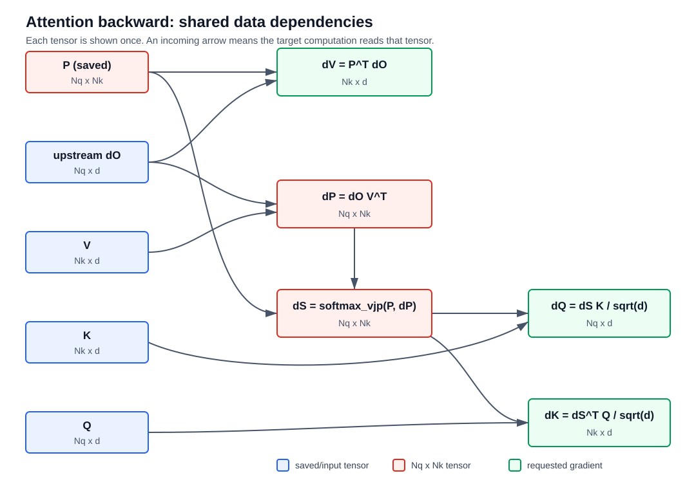

# FlashAttention-2 Backward 与实现验证

本文是 FlashAttention-2 教材的 **Backward 与实现验证篇**，接续 [Forward 篇](./03_02_flash_attention_2_beginner_textbook.md) 的第 0-8 章。为保留原有引用和阅读顺序，本篇从第 9 章继续编号；第 9 章集中推导 backward，第 10-18 章继续说明 Triton 映射、测试、benchmark、常见误区和练习。

开始前应已理解 Forward 篇中的：

1. $S=QK^\top/\sqrt d$、$P=\operatorname{rowsoftmax}(S)$、$O=PV$；
2. online softmax 的运行状态 $m,\ell$；
3. forward 保存的 $L_i=m_i+\log\ell_i$；
4. query tile、key/value tile、causal mask 和 program ownership。

本文继续遵守同一记号约定：数学中的单个向量均为列向量；矩阵 $Q,K,V,O$ 的每一行存放相应列向量的转置。下文使用的 FA1、FA2、Triton 和 Handout 等资料简称及完整链接见 [Forward 篇 0.1 节](./03_02_flash_attention_2_beginner_textbook.md) 和本文第 18 章。

**下标起点约定：** 标量数学公式中的 query、key 和特征下标 $i,j,u,r,c$ 从 1 开始；对应求和写成从 1 到维度上界。tile 与程序循环索引 $a,b$ 从 0 开始，即 $a=0,\ldots,T_q-1$、$b=0,\ldots,T_k-1$。凡是两种下标同时出现，正文都会明确指出其含义。

---

## 9. Backward：保存什么，重算什么

### 9.1 普通 backward 为什么依赖大矩阵

令上游梯度为 $dO\in\mathbb{R}^{N_q\times d}$。忽略 mask 的不可见位置后，标准矩阵形式是：

$$dV=P^\top dO,\quad dP=dOV^\top,\quad dS=P\circ\left(dP-\operatorname{rowsum}(P\circ dP)[:,None]\right)$$

其余两个输入梯度为 $dQ=dSK/\sqrt d$ 和 $dK=dS^\top Q/\sqrt d$。

下面的依赖图中，每份数据只画成一个节点；一条入边表示计算目标节点时必须读取该数据。



**图 9-1：普通 attention 的 $dQ,dK,dV$ 共享依赖 DAG。** 图中红色的 $P,dP,dS$ 都有 $N_qN_k$ 个元素；普通 backward 需要让 $P$ 跨越 forward/backward 边界保持存活，而 $dP,dS$ 可在 backward 内部产生并消费。$Q,K,V$ 也需要保持存活，但它们只有线性规模 $O((N_q+N_k)d)$。

沿依赖图读取，可以得到三条梯度路径：

1. $P,dO\rightarrow dV$；
2. $dO,V\rightarrow dP$，再由 $P,dP\rightarrow dS$，最后由 $dS,K\rightarrow dQ$；
3. 前半段与 $dQ$ 共享同一个 $dP,dS$，最后由 $dS,Q\rightarrow dK$。

如果 forward 保存完整 $P$，其元素数是 $N_qN_k$；若不保存，就必须能廉价重建它。handout 的标准 backward 展开见 [L1039-L1053](./cs336_assignment2_systems_extracted.md#L1039-L1053)。

### 9.2 预备知识：普通 attention backward 按什么顺序计算

在理解 FlashAttention backward 之前，先把不分 tile 的普通 attention backward 走一遍。这里统一约定：

$$dX\equiv\frac{\partial\mathcal J}{\partial X}$$

其中 $\mathcal J$ 是整个模型最终产生的标量 loss，$dX$ 表示该 loss 关于张量 $X$ 的梯度。

#### 9.2.1 Forward 有三个连续算子

忽略 batch、head 和 mask 后，单头 attention forward 是：

$$S=\frac{QK^\top}{\sqrt d}$$

$$P=\operatorname{rowsoftmax}(S)$$

$$O=PV$$

各张量 shape 为：

| 张量 | shape | 含义 |
|---|---:|---|
| $Q$ | $(N_q,d)$ | query |
| $K,V$ | $(N_k,d)$ | key 与 value |
| $S$ | $(N_q,N_k)$ | softmax 前的 score |
| $P$ | $(N_q,N_k)$ | 每个 query 对所有 keys 的概率 |
| $O$ | $(N_q,d)$ | attention 输出 |

backward 从上游给出的 $dO$ 开始，严格沿计算图反向经过：

```text
dO  -->  O = P V  -->  得到 dP、dV
                       |
                       v
                P = softmax(S)  -->  得到 dS
                                      |
                                      v
                              S = Q K^T / sqrt(d)
                                      |
                                      v
                                  得到 dQ、dK
```

#### 9.2.2 先经过矩阵乘 $O=PV$

给定上游梯度 $dO\in\mathbb R^{N_q\times d}$，矩阵乘 backward 得到：

$$dV=P^\top dO\in\mathbb R^{N_k\times d}$$

$$dP=dOV^\top\in\mathbb R^{N_q\times N_k}$$

$dV$ 的含义是：每个 value 向量对所有 query 输出的影响需要按 $P$ 加权汇总。$dP$ 的含义是：改变某个权重 $P_{ij}$ 时，输出行 $O_i$ 会沿 value $V_j$ 的方向变化。

这一步已经说明普通 backward 为什么依赖 $P$：即使暂时不考虑 softmax，计算 $dV$ 也需要读取完整的 attention probability。

#### 9.2.3 再经过普通 softmax backward

attention 对 $S$ 的每一行独立执行 softmax。固定第 $i$ 个 query 行：

阅读本小节时，应把 $i$ 看作已经固定的行标签：它始终指同一个 query，不参与后面的求和，也不会在求导过程中变化。真正变化的下标是 $u$ 和 $j$：$u$ 枚举这一行的 softmax 输出位置，$j$ 表示当前求导所针对的 score 输入位置。

$$S_i=\begin{bmatrix}S_{i1}&\cdots&S_{iN_k}\end{bmatrix}^\top,\qquad P_i=\operatorname{softmax}(S_i)\in\mathbb R^{N_k}$$

其中：

$$P_{ij}=\frac{\exp(S_{ij})}{\sum_{u=1}^{N_k}\exp(S_{iu})}$$

由上一节的 $O=PV$ backward，已经得到 loss 关于 softmax 输出行 $P_i$ 的上游梯度：

$$dP_i=\nabla_{P_i}\mathcal J\in\mathbb R^{N_k}$$

softmax backward 要计算 loss 关于输入 score 行 $S_i$ 的梯度：

$$dS_i=\nabla_{S_i}\mathcal J\in\mathbb R^{N_k}$$

也就是说，它的局部接口是：

```text
forward:   S_i  --> softmax --> P_i
backward:  dS_i <-- backward(P_i, dP_i) <-- dP_i
```

同一行的所有 $P_{iu}$ 都共享一个分母，所以改变一个输入 $S_{ij}$ 会影响这一行的全部输出概率。下面从 softmax 定义开始推导这种耦合关系。

先把第 $i$ 行的 softmax 分母记为：

$$Z_i=\sum_{r=1}^{N_k}\exp(S_{ir})$$

于是第 $u$ 个输出概率为：

$$P_{iu}=\frac{\exp(S_{iu})}{Z_i}$$

这里故意使用两个不同的下标：

- $u$ 表示正在求导的 softmax **输出分量** $P_{iu}$；
- $j$ 表示被改变的 softmax **输入分量** $S_{ij}$。

为了统一表示 $u=j$ 和 $u\ne j$ 两种情况，定义 Kronecker delta：

$$\delta_{uj}=\begin{cases}1,&u=j\\0,&u\ne j\end{cases}$$

先分别计算分子和分母关于 $S_{ij}$ 的导数。分子只有在 $u=j$ 时依赖 $S_{ij}$：

$$\frac{\partial\exp(S_{iu})}{\partial S_{ij}}=\delta_{uj}\exp(S_{iu})$$

分母 $Z_i$ 包含整行所有指数项，但只有第 $j$ 项依赖 $S_{ij}$：

$$\frac{\partial Z_i}{\partial S_{ij}}=\exp(S_{ij})$$

现在对 $P_{iu}=\exp(S_{iu})/Z_i$ 使用商法则。商法则的一般形式是：

$$\frac{\partial(a/b)}{\partial x}=\frac{(\partial a/\partial x)b-a(\partial b/\partial x)}{b^2}$$

在这里，$a=\exp(S_{iu})$、$b=Z_i$、$x=S_{ij}$。把刚才得到的两个导数逐项代入：

$$\frac{\partial P_{iu}}{\partial S_{ij}}=\frac{\delta_{uj}\exp(S_{iu})Z_i-\exp(S_{iu})\exp(S_{ij})}{Z_i^2}$$

先把右侧的两个分式拆开：

$$\frac{\partial P_{iu}}{\partial S_{ij}}=\frac{\delta_{uj}\exp(S_{iu})Z_i}{Z_i^2}-\frac{\exp(S_{iu})\exp(S_{ij})}{Z_i^2}$$

第一项约掉一个 $Z_i$，第二项把 $Z_i^2$ 拆成 $Z_iZ_i$：

$$\frac{\partial P_{iu}}{\partial S_{ij}}=\delta_{uj}\frac{\exp(S_{iu})}{Z_i}-\frac{\exp(S_{iu})}{Z_i}\frac{\exp(S_{ij})}{Z_i}$$

根据 $P_{iu}=\exp(S_{iu})/Z_i$ 和 $P_{ij}=\exp(S_{ij})/Z_i$，逐项替换：

$$\frac{\partial P_{iu}}{\partial S_{ij}}=\delta_{uj}P_{iu}-P_{iu}P_{ij}$$

最后提取公因子 $P_{iu}$：

$$\frac{\partial P_{iu}}{\partial S_{ij}}=\delta_{uj}P_{iu}-P_{iu}P_{ij}=P_{iu}(\delta_{uj}-P_{ij})$$

分成两种情况看更直观：

1. 当 $u=j$ 时，$\delta_{uj}=1$，所以 $\partial P_{ij}/\partial S_{ij}=P_{ij}(1-P_{ij})$。增大 $S_{ij}$ 会增大它自己的概率；
2. 当 $u\ne j$ 时，$\delta_{uj}=0$，所以 $\partial P_{iu}/\partial S_{ij}=P_{iu}(0-P_{ij})=-P_{iu}P_{ij}$。增大 $S_{ij}$ 会增大公共分母，从而压低其他概率。

#### 9.2.4 沿所有路径应用链式法则

现在固定一个输入 score $S_{ij}$，目标是计算：

$$dS_{ij}=\frac{\partial\mathcal J}{\partial S_{ij}}$$

$S_{ij}$ 会同时影响这一行的全部输出 $P_{i1},\ldots,P_{iN_k}$。按照多变量链式法则，需要把经过每个 $P_{iu}$ 的路径贡献相加：

$$dS_{ij}=\sum_{u=1}^{N_k}\frac{\partial\mathcal J}{\partial P_{iu}}\frac{\partial P_{iu}}{\partial S_{ij}}$$

根据 $dP_{iu}=\partial\mathcal J/\partial P_{iu}$：

$$dS_{ij}=\sum_{u=1}^{N_k}dP_{iu}\frac{\partial P_{iu}}{\partial S_{ij}}$$

代入上一小节得到的 softmax 偏导数：

$$dS_{ij}=\sum_{u=1}^{N_k}dP_{iu}P_{iu}(\delta_{uj}-P_{ij})$$

把括号中的两项拆开。$P_{ij}$ 与求和下标 $u$ 无关，因此可以移到第二个求和符号外：

$$dS_{ij}=\sum_{u=1}^{N_k}dP_{iu}P_{iu}\delta_{uj}-P_{ij}\sum_{u=1}^{N_k}dP_{iu}P_{iu}$$

第一项中的 $\delta_{uj}$ 只在 $u=j$ 时等于 1，其余项全部为 0，所以第一个求和只留下 $u=j$ 这一项：

$$dS_{ij}=dP_{ij}P_{ij}-P_{ij}\sum_{u=1}^{N_k}dP_{iu}P_{iu}$$

最后提取公因子 $P_{ij}$：

$$dS_{ij}=P_{ij}\left(dP_{ij}-\sum_{u=1}^{N_k}P_{iu}dP_{iu}\right)$$

定义该行共享的标量：

$$D_i=P_i^\top dP_i=\sum_{u=1}^{N_k}P_{iu}dP_{iu}$$

就得到逐元素形式的 softmax backward：

$$dS_{ij}=P_{ij}(dP_{ij}-D_i)$$

把一行中的全部 $j$ 合在一起，可写成向量形式：

$$dS_i=P_i\circ(dP_i-D_i\mathbf 1)$$

到这里已经得到了实现 softmax backward 所需的全部公式，不需要先理解或构造 Jacobian。对应代码是：

```python
def softmax_backward(grad_p, p):
    softmax_correction = (p * grad_p).sum(dim=-1, keepdim=True)
    return p * (grad_p - softmax_correction)
```

其中，参数 `p` 对应 $P$，参数 `grad_p` 对应已经由后续算子传回的 $dP$。函数不负责计算 $dP$，而是接收 $dP$ 并返回 $dS$。

所以这两行代码就是逐元素公式 $dS_{ij}=P_{ij}(dP_{ij}-D_i)$ 的批量实现。

单行长度为 $N_k$ 时，时间复杂度为 $O(N_k)$。

一个重要的正确性检查是：

$$\sum_{j=1}^{N_k}dS_{ij}=\sum_{j=1}^{N_k}P_{ij}(dP_{ij}-D_i)=D_i-D_i\sum_{j=1}^{N_k}P_{ij}=0$$

这是因为给所有 logits 同时加一个常数不会改变 softmax：

$$\operatorname{softmax}(S_i+c\mathbf 1)=\operatorname{softmax}(S_i)$$

#### 9.2.5 可选补充：Jacobian 与 VJP 的矩阵写法

前面的标量推导已经足以理解和实现 backward。本节只说明这些标量公式为什么经常被简写成 $dS_i=J_i^\top dP_i$。

Jacobian 并不是一种新的运算，它只是把 9.2.3 节求出的所有偏导数排成一个表格。定义：

$$J_i=\frac{\partial P_i}{\partial S_i}\in\mathbb R^{N_k\times N_k}$$

这个矩阵的行下标对应输出，列下标对应输入。因此，第 $u$ 行、第 $j$ 列存放：

$$\left(J_i\right)_{uj}=\frac{\partial P_{iu}}{\partial S_{ij}}$$

9.2.3 节已经分别得到：

- 对角线位置 $u=j$ 的元素是 $P_{ij}(1-P_{ij})$；
- 非对角线位置 $u\ne j$ 的元素是 $-P_{iu}P_{ij}$。

$\operatorname{diag}(P_i)$ 表示把向量 $P_i$ 的元素依次放到主对角线上，并把其他位置全部填成 0。假设这一行只有三个概率：

$$P_i=\begin{bmatrix}P_{i1}\\P_{i2}\\P_{i3}\end{bmatrix}\quad\Longrightarrow\quad\operatorname{diag}(P_i)=\begin{bmatrix}P_{i1}&0&0\\0&P_{i2}&0\\0&0&P_{i3}\end{bmatrix}$$

因此，$\operatorname{diag}(P_i)$ 的第 $(u,j)$ 个元素为：

$$[\operatorname{diag}(P_i)]_{uj}=\begin{cases}P_{iu},&u=j\\0,&u\ne j\end{cases}=\delta_{uj}P_{iu}$$

另一方面，外积 $P_iP_i^\top$ 的第 $(u,j)$ 个元素是 $P_{iu}P_{ij}$。两者相减得到：

$$\delta_{uj}P_{iu}-P_{iu}P_{ij}=P_{iu}(\delta_{uj}-P_{ij})=\frac{\partial P_{iu}}{\partial S_{ij}}$$

所以整张 Jacobian 表可以简写为：

$$J_i=\operatorname{diag}(P_i)-P_iP_i^\top$$

下面验证 $J_i^\top dP_i$ 与前面的标量链式法则相同。$J_i^\top$ 的 shape 是 $(N_k,N_k)$，$dP_i$ 的 shape 是 $(N_k,1)$，所以乘积 $J_i^\top dP_i$ 是一个包含 $N_k$ 个元素的列向量。

要计算这个结果向量的第 $j$ 个元素，需要取 $J_i^\top$ 的第 $j$ 行，与 $dP_i$ 做点积：

$$[J_i^\top dP_i]_j=\sum_{u=1}^{N_k}(J_i^\top)_{ju}dP_{iu}$$

矩阵转置会交换行列下标：

$$(J_i^\top)_{ju}=(J_i)_{uj}$$

而 Jacobian 的第 $(u,j)$ 个元素已经定义为：

$$(J_i)_{uj}=\frac{\partial P_{iu}}{\partial S_{ij}}$$

把这两个等式依次代入矩阵乘法：

$$[J_i^\top dP_i]_j=\sum_{u=1}^{N_k}(J_i)_{uj}dP_{iu}=\sum_{u=1}^{N_k}\frac{\partial P_{iu}}{\partial S_{ij}}dP_{iu}=dS_{ij}$$

这个等式对每个 $j$ 都成立，所以：

$$dS_i=J_i^\top dP_i$$

这就是 softmax 的 vector-Jacobian product（VJP）。实际实现不会构造 $N_k\times N_k$ 的 $J_i$，因为 9.2.4 节的逐元素公式只需要 $O(N_k)$ 时间和空间。

#### 9.2.6 继续传播到 $Q$ 和 $K$

前两步已经依次得到 $dP$ 和 $dS$。最后经过 $S=QK^\top/\sqrt d$：

$$dQ=\frac{dSK}{\sqrt d},\qquad dK=\frac{dS^\top Q}{\sqrt d}$$

至此，普通 attention backward 的完整计算顺序是：

1. 从 $dO,P,V$ 得到 $dV,dP$；
2. 从 $P,dP$ 得到每行的 $D$ 和 $dS$；
3. 从 $dS,Q,K$ 得到 $dQ,dK$。

下一节开始讨论 FlashAttention 面临的矛盾：这些公式需要 $P$，但 forward 为了节省 HBM 恰恰没有保存完整 $P$。[Handout：L1039-L1053](./cs336_assignment2_systems_extracted.md#L1039-L1053)

### 9.3 第一个关键：用 $L$ 按 tile 重建 $P$

普通 backward 需要 $P$，但 FlashAttention forward 没有把完整 $P$ 写入 HBM。它只额外保存每个 query 行的 log-sum-exp：

$$L_i=\log\left(\sum_{u=1}^{N_k}\exp(S_{iu})\right)$$

本节要回答：

> 为什么重新算出一个局部 score tile 后，只读取每行一个 $L_i$，就能恢复这个 tile 在全局 softmax 中的真实概率？

#### 9.3.1 局部 softmax 为什么不正确

假设当前只重算了索引为 $b$ 的 key tile 所对应的 key 集合 $\mathcal T_b$。如果直接在 tile 内做 softmax，得到的是：

$$\widehat P_{ic}^{(b)}=\frac{\exp(S_{ic})}{\sum_{u\in\mathcal T_b}\exp(S_{iu})}$$

但真实 attention probability 的分母覆盖全部 $N_k$ 个 keys：

$$P_{ic}=\frac{\exp(S_{ic})}{\sum_{u=1}^{N_k}\exp(S_{iu})}$$

一般情况下两个分母不同，所以每个 tile 各自做 local softmax 后不能拼成完整 $P$。backward 必须使用 forward 已经算出的全局行归一化信息。

#### 9.3.2 $L_i$ 保存了完整分母

由 $L_i$ 的定义：

$$\exp(L_i)=\sum_{u=1}^{N_k}\exp(S_{iu})$$

代回 softmax 定义：

$$P_{ij}=\frac{\exp(S_{ij})}{\exp(L_i)}=\exp(S_{ij}-L_i)$$

因此恢复一个概率元素只需要：

1. 用单个 query 向量 $q_i$ 和 key 向量 $k_j$ 重算 $S_{ij}$；
2. 读取该 query 行的全局 $L_i$；
3. 计算 $\exp(S_{ij}-L_i)$。

$L_i$ 之所以只需一个标量，是因为同一 query 行的所有 softmax 元素共享同一个分母。

forward 的 online softmax 最终已有：

$$L_i=m_i+\log\ell_i$$

所以保存 $L_i$ 不需要额外扫描完整 score 行，只需在 forward 结束时把已有的 running maximum 和分母状态合并。

#### 9.3.3 按 tile 重建的具体步骤

对 query tile $Q^{(a)}\in\mathbb R^{B_q\times d}$ 和 key tile $K^{(b)}\in\mathbb R^{B_k\times d}$：

从这里开始严格区分两类下标：

- $i,j$ 表示单个 query/key 的行号，例如 $q_i,k_j,S_{ij}$；
- $a,b$ 表示从 0 开始的 tile 索引，即 $a\in\{0,\ldots,T_q-1\}$、$b\in\{0,\ldots,T_k-1\}$；
- $Q^{(a)}$ 表示索引为 $a$ 的 query tile；
- $K^{(b)},V^{(b)}$ 表示索引为 $b$ 的 key/value tile；
- 括号上标 $(a),(b)$ 只是分块标签，**不表示乘方**；
- $S^{(a,b)},P^{(a,b)}$ 表示 query tile $a$ 与 key tile $b$ 共同形成的 $(B_q,B_k)$ tile。

这样，单个向量 $q_i,k_j,v_j$ 与包含多行向量的 tile $Q^{(a)},K^{(b)},V^{(b)}$ 不会混淆。

1. 重算当前 score tile：

$$S^{(a,b)}=\frac{Q^{(a)}(K^{(b)})^\top}{\sqrt d}+M^{(a,b)}$$

2. 加载 query tile $a$ 中各行对应的 $L^{(a)}\in\mathbb R^{B_q}$；
3. 将 $L^{(a)}$ 广播到当前 tile 的 $B_k$ 列并恢复：

$$P^{(a,b)}=\exp\left(S^{(a,b)}-L^{(a)}[:,None]\right)\in\mathbb R^{B_q\times B_k}$$

这里的 $P^{(a,b)}$ 是完整概率矩阵 $P$ 的真实切片。它不同于 forward 中相对当前 running maximum 构造的临时未归一化量 $\widetilde P^{(a,b)}$。

#### 9.3.4 Mask 和指数底数必须与 forward 一致

重算 $S^{(a,b)}$ 时必须恢复与 forward 完全相同的：

- score scale；
- causal mask；
- 非整除边界 mask；
- 指数底数和对应缩放。

若某位置在 forward 被 mask，则 backward 重建时也必须令其 $P_{ij}=0$，否则该位置会错误地向 $dV$ 和 $dS$ 传播梯度。

如果实现内部使用 `exp2`，$S$ 与保存的 $L$ 必须处于同一底数体系。对外若约定 $L$ 为自然 log-sum-exp，则写回或读取时必须做一致换算。

#### 9.3.5 从内存角度看为什么值得

完整 $P$ 有 $N_qN_k$ 个元素，而 $L$ 只有 $N_q$ 个元素：

$$O(N_qN_k)\text{ 个保存元素}\quad\longrightarrow\quad O(N_q)\text{ 个行统计量}$$

backward 当前只物化一个 $B_q\times B_k$ 的 $P^{(a,b)}$ tile，用完即可丢弃。代价是重新执行 $Q^{(a)}(K^{(b)})^\top$，也就是用额外 FLOPs 换取更少 HBM 容量和 I/O。

现在已经解决了“当前 $P$ tile 从哪里来”。下一节还要解决另一个全局依赖：普通 softmax backward 中的 $D_i=\sum_jP_{ij}dP_{ij}$ 跨越整行 keys，不能从单个 tile 独立算出。

### 9.4 第二个关键：用 $D$ 消除跨 tile 的行归约

上一节已经解决了“当前 $P$ tile 从哪里来”，但 softmax backward 还有一个看似无法局部计算的量：

$$D_i=\sum_{j=1}^{N_k}P_{ij}dP_{ij}$$

这里的 key 特指 attention 输入矩阵 $K$ 中的 key 向量 $k_1,\ldots,k_{N_k}$。对固定 query $q_i$，$P_{ij}$ 是它分配给 key $k_j$ 的概率，所以 $P$ 的第 $j$ 列与第 $j$ 个 key 一一对应。于是，$D_i$ 沿 $j$ 求和，就是沿 $P$ 的列轴，也就是沿全部 key 位置求和。

但是 tiled backward 每次只加载一段连续的 key 向量。这里让 tile 索引 $b$ 从 0 开始，而本节标量公式中的 key 行号仍按数学惯例从 1 开始。索引为 $b$ 的 key tile 对应：

$$\mathcal T_b=\{bB_k+1,\ldots,\min((b+1)B_k,N_k)\},\qquad b=0,\ldots,T_k-1$$

若当前 program 只持有 $\mathcal T_b$ 中的 keys，它也只能访问 $P_i$ 和 $dP_i$ 在这些列上的元素，因此最多只能得到部分和：

$$D_i^{(b)}=\sum_{u\in\mathcal T_b}P_{iu}dP_{iu}$$

完整结果需要把全部 $T_k$ 个 key tiles 的部分和再次相加：

$$D_i=\sum_{b=0}^{T_k-1}D_i^{(b)}$$

因此一般有 $D_i^{(b)}\ne D_i$。不能把单个 tile 的部分和直接代入 $dS_{iu}=P_{iu}(dP_{iu}-D_i)$；那会把全局 softmax 错误地当成 tile 内 softmax。

#### 9.4.1 先从 $dP$ 的元素公式出发

由 $O=PV$ 的矩阵乘 backward：

$$dP=dOV^\top$$

所以第 $i$ 个 query 与第 $j$ 个 key/value 对应的元素为：

$$dP_{ij}=\sum_{c=1}^{d}dO_{ic}V_{jc}$$

这里 $c$ 遍历 value/output 的特征维。将它代入 $D_i$：

$$D_i=\sum_{j=1}^{N_k}P_{ij}\left(\sum_{c=1}^{d}dO_{ic}V_{jc}\right)$$

先使用乘法对加法的分配律，把外层的 $P_{ij}$ 乘进内层求和：

$$D_i=\sum_{j=1}^{N_k}\sum_{c=1}^{d}P_{ij}dO_{ic}V_{jc}$$

这表示要把所有 $(j,c)$ 组合对应的项 $P_{ij}dO_{ic}V_{jc}$ 相加。因为两个求和都是有限求和，先遍历 $j$ 再遍历 $c$，与先遍历 $c$ 再遍历 $j$ 会访问完全相同的一组 $(j,c)$，所以可以交换顺序：

$$D_i=\sum_{c=1}^{d}\sum_{j=1}^{N_k}P_{ij}dO_{ic}V_{jc}$$

现在固定外层的 $i,c$。$dO_{ic}$ 只由 query 行 $i$ 和特征位置 $c$ 决定，不随内层求和变量 $j$ 改变，因此可以把它提到关于 $j$ 的求和外：

$$D_i=\sum_{c=1}^{d}dO_{ic}\left(\sum_{j=1}^{N_k}P_{ij}V_{jc}\right)$$

forward 的输出元素恰好满足：

$$O_{ic}=\sum_{j=1}^{N_k}P_{ij}V_{jc}$$

因此：

$$D_i=\sum_{c=1}^{d}O_{ic}dO_{ic}=\langle O_i,dO_i\rangle$$

对所有 query 行同时计算，就是：

$$D=\operatorname{rowsum}(O\circ dO)\in\mathbb R^{N_q}$$

这个等式不是近似，也不是 FlashAttention 特有的新梯度公式；它只是把 $D_i=\sum_jP_{ij}dP_{ij}$ 中的 $dP=dOV^\top$ 展开，再利用了 forward 已有的 $O=PV$。

#### 9.4.2 为什么改写后适合 tiled backward

原定义沿 key 维归约，需要先得到整行 $P_i$ 和 $dP_i$。改写后的表达式只沿长度为 $d$ 的特征维归约，而且只依赖：

- forward 输出 $O\in\mathbb R^{N_q\times d}$；
- backward 入口收到的 $dO\in\mathbb R^{N_q\times d}$。

因此可以在进入主要 backward kernel 前，用一次 $O(N_qd)$ 的预处理算出全部 $D$，无需额外遍历 $N_qN_k$ 个 score 元素：

```python
D = (O.float() * dO.float()).sum(dim=-1)
```

实际实现通常让乘法和归约在 FP32 中进行，避免长度为 $d$ 的求和过早丢失精度。将 $D$ 按 query tile 切成 $D^{(a)}\in\mathbb R^{B_q}$ 后，任意一对 query/key tiles 都能独立计算正确的：

$$dS^{(a,b)}=P^{(a,b)}\circ\left(dP^{(a,b)}-D^{(a)}[:,None]\right)$$

这里广播到每一列的是 $D^{(a)}$ 中各 query 行的**完整 $D_i$**，不是当前 key tile 的部分和。若某个位置被 mask，则重建出的 $P_{ij}=0$，相应的 $dS_{ij}$ 也自然为 0。

至此，单个 backward tile 所需的两个全局 softmax 信息都已变成每个 query 行一个标量：

| 行统计量 | 来自哪里 | 在 backward 中解决什么问题 |
|---|---|---|
| $L_i$ | forward 的 log-sum-exp | 从重算的 $S_{ij}$ 恢复全局概率 $P_{ij}$ |
| $D_i$ | backward 开始时的 $\langle O_i,dO_i\rangle$ | 从局部 $P,dP$ tile 得到正确的 $dS$ tile |

handout 的 tiled backward 也先计算 $D=\operatorname{rowsum}(O\circ dO)$，再把对应的 $D^{(a)}$ 用于每个 $dS^{(a,b)}$。[Handout：L1242-L1280](./cs336_assignment2_systems_extracted.md#L1242-L1280)

### 9.5 核心：所有二次矩阵都只按 tile 产生和消费

FA backward 的主旨不只是“不保存 $P$”，而是：**逻辑上具有 $(N_q,N_k)$ shape 的 $S,P,dP,dS$ 都不在 HBM 中物化成完整矩阵。** 对每一对 query/key tiles $(a,b)$，它们按照依赖顺序以 $(B_q,B_k)$ 小块产生，被后续计算立即消费，然后丢弃。

| 逻辑矩阵 | 完整 shape | 当前 tile 怎样得到 | 当前 tile 立即服务于什么 |
|---|---:|---|---|
| $S$ | $(N_q,N_k)$ | $Q^{(a)}(K^{(b)})^\top/\sqrt d+M^{(a,b)}$ | 用 $L^{(a)}$ 重建 $P^{(a,b)}$ |
| $P$ | $(N_q,N_k)$ | $\exp(S^{(a,b)}-L^{(a)}[:,None])$ | 计算 $\Delta dV^{(b)}$ 和 $dS^{(a,b)}$ |
| $dP$ | $(N_q,N_k)$ | $dO^{(a)}(V^{(b)})^\top$ | 计算 $dS^{(a,b)}$ |
| $dS$ | $(N_q,N_k)$ | $P^{(a,b)}\circ(dP^{(a,b)}-D^{(a)}[:,None])$ | 计算 $\Delta dQ^{(a)}$ 和 $\Delta dK^{(b)}$ |

因此，数学上的完整依赖链虽然是：

$$S\longrightarrow P,\qquad dO\longrightarrow dP\longrightarrow dS\longrightarrow dQ,dK,\qquad P,dO\longrightarrow dV$$

实现时却反复执行下面的局部流水线：

```text
生成 S_tile
  -> 重建 P_tile
  -> 计算 dP_tile
  -> 计算 dS_tile
  -> 累加到 dQ/dK/dV 的输出 tile
  -> 丢弃 S_tile、P_tile、dP_tile、dS_tile
```

最终必须写回 HBM 的是 $dQ,dK,dV$，它们的总元素数为 $N_qd+2N_kd$，只随序列长度线性增长。不会写回 HBM 的完整中间矩阵是 $S,P,dP,dS$，每一个原本都有 $N_qN_k$ 个元素。

下面固定索引为 $a$ 的 query tile 和索引为 $b$ 的 key/value tile，逐步展开这一对 tiles 的计算；至于不同 programs 如何分工和归约，将在 9.7 节说明。

#### 9.5.1 进入 tile 前已经有哪些数据

当前计算读取：

| 数据 | shape | 作用 |
|---|---:|---|
| $Q^{(a)},dO^{(a)}$ | $(B_q,d)$ | 当前 query tile 与其输出梯度 |
| $K^{(b)},V^{(b)}$ | $(B_k,d)$ | 当前 key/value tile |
| $L^{(a)},D^{(a)}$ | $(B_q,)$ | 当前 query tile 中每一行的两个全局标量 |
| $M^{(a,b)}$ | $(B_q,B_k)$ 或隐式生成 | causal 与边界 mask |

$L^{(a)},D^{(a)}$ 的 shape 都只有 $(B_q,)$。在公式中写成 `[:,None]`，表示沿当前 tile 的 $B_k$ 列广播，并不复制出一个持久的大矩阵。

#### 9.5.2 先重建 $S$ 与 $P$

$$S^{(a,b)}=\frac{Q^{(a)}(K^{(b)})^\top}{\sqrt d}+M^{(a,b)}\in\mathbb R^{B_q\times B_k}$$

$$P^{(a,b)}=\exp\left(S^{(a,b)}-L^{(a)}[:,None]\right)\in\mathbb R^{B_q\times B_k}$$

这里必须复现 forward 的 scale、mask 和指数底数。全不可见的 future tile 可以直接跳过；与 causal 对角线相交的 tile 则必须逐元素应用 mask。

#### 9.5.3 $dP$ 也按同一张 tile 网格计算

完整的 $dP=dOV^\top$ 确实是一个 $(N_q,N_k)$ 矩阵，但 FlashAttention 不会先把它完整算出并写入 HBM。它与 $S$、$P$ 使用相同的二维分块方式：query tile 索引为 $a$，key/value tile 索引为 $b$，当前切片记为 $dP^{(a,b)}$。

先看单个元素。对于 query 行 $r$ 和 key/value 行 $c$：

$$dP_{rc}=\sum_{t=1}^{d}dO_{rt}V_{ct}$$

这里的求和只发生在长度为 $d$ 的特征维 $t$ 上，不需要读取其他 query 行或其他 key/value 行。因此，要计算 $(a,b)$ 位置的整个 $dP$ tile，只需当前的 $dO^{(a)}$ 和 $V^{(b)}$：

$$dP^{(a,b)}=dO^{(a)}(V^{(b)})^\top\in\mathbb R^{B_q\times B_k}$$

也就是说，逻辑上存在完整矩阵 $dP$，实现中却只生成当前的 $B_q\times B_k$ 切片。这个切片保留在当前 program 的片上临时状态中，不写回 HBM。

#### 9.5.4 生成 $dP$ 后立即计算同位置的 $dS$

当前 program 已经拥有：

- 由 $S^{(a,b)}$ 和 $L^{(a)}$ 重建的 $P^{(a,b)}$；
- 刚计算出的 $dP^{(a,b)}$；
- backward 开始时预先计算的完整行统计量 $D^{(a)}$。

因此可以立即逐元素计算同一个位置的 $dS$ tile：

$$dS^{(a,b)}=P^{(a,b)}\circ\left(dP^{(a,b)}-D^{(a)}[:,None]\right)\in\mathbb R^{B_q\times B_k}$$

对应的数据流是：

```python
dP_tile = dO_tile @ transpose(V_tile)
dS_tile = P_tile * (dP_tile - D_tile[:, None])
```

$dP^{(a,b)}$ 产生后立刻被 $dS^{(a,b)}$ 消费，之后即可与 $S^{(a,b)}$、$P^{(a,b)}$ 一起丢弃。因此 $dP$ 虽然在数学上有 $N_qN_k$ 个元素，任意时刻实际存活的仍只有当前 $B_qB_k$ 个元素。

这一步之所以能完全在 tile 内完成，关键是 $D^{(a)}$ 中保存的是每个 query 行的完整 $D_i=\langle O_i,dO_i\rangle$。若临时改用当前 tile 的 `sum(P_tile * dP_tile)`，得到的只是 key 维归约的一部分，不是全局 softmax 的梯度。

#### 9.5.5 消费 $P$ 和 $dS$ tile

$dS$ 不是 attention backward 的最终输出。它是 loss 对内部 score 矩阵 $S$ 的梯度，作用是把梯度继续传回产生 $S$ 的两个输入 $Q$ 和 $K$。完整依赖链是：

```text
dO -> dP -> dS -> dQ
              \-> dK

dO + P -------> dV
```

先看 $dS$ 为什么能计算 $dQ$ 和 $dK$。单个 score 元素来自：

$$S_{rc}=\frac{q_r^\top k_c}{\sqrt d}$$

固定 query $q_r$ 时，每个 key $k_c$ 都通过 $S_{rc}$ 向它贡献梯度。将全部 key 位置的贡献相加：

$$dq_r=\frac{1}{\sqrt d}\sum_{c=1}^{N_k}dS_{rc}k_c$$

固定 key $k_c$ 时，每个 query $q_r$ 都通过 $S_{rc}$ 向它贡献梯度。将全部 query 位置的贡献相加：

$$dk_c=\frac{1}{\sqrt d}\sum_{r=1}^{N_q}dS_{rc}q_r$$

因此，当前 $(a,b)$ tile 的 $dS^{(a,b)}$ 分别产生：

$$\Delta dQ^{(a)}=\frac{dS^{(a,b)}K^{(b)}}{\sqrt d}\in\mathbb R^{B_q\times d}$$

$$\Delta dK^{(b)}=\frac{(dS^{(a,b)})^\top Q^{(a)}}{\sqrt d}\in\mathbb R^{B_k\times d}$$

其中 $\Delta$ 强调这只是一个 tile 提供的局部贡献：$dQ^{(a)}$ 还要累加其他 key tiles 的贡献，$dK^{(b)}$ 还要累加其他 query tiles 的贡献。

另一条支路不经过 $dS$。由 $O=PV$，当前 $P$ tile 直接对 $dV^{(b)}$ 产生：

$$\Delta dV^{(b)}=(P^{(a,b)})^\top dO^{(a)}\in\mathbb R^{B_k\times d}$$

当前 tile 对 $dQ,dK,dV$ 的贡献都累加完成后，$dS^{(a,b)}$ 和 $P^{(a,b)}$ 就完成了使命，可以直接丢弃，不需要写回 HBM。

把这一对 tiles 的局部数据流连起来就是：

```text
Q_a, K_b, mask   ->  S_ab
S_ab, L_a        ->  P_ab
dO_a, V_b        ->  dP_ab
P_ab, dP_ab, D_a ->  dS_ab

P_ab, dO_a       ->  contribution to dV_b
dS_ab, Q_a       ->  contribution to dK_b
dS_ab, K_b       ->  contribution to dQ_a
```

伪代码标识符中的 `_a`、`_b` 分别对应数学记号的 tile 上标 $(a)$、$(b)$。$S^{(a,b)},P^{(a,b)},dP^{(a,b)},dS^{(a,b)}$ 都只在处理当前 tile 时存在。剩下的工程问题是：不同 tile 会共同贡献同一个输出梯度，应当由谁负责累加这些贡献？

### 9.6 保存、预计算、重算与丢弃：张量生命周期

先按时间边界区分四类数据：

1. **跨越 forward/backward 保存**：backward 以后还要读取，forward 结束时不能释放；
2. **backward 入口预计算**：收到 $dO$ 后算一次，供所有 tile 使用；
3. **tile 内重算**：只在处理当前 tile 时短暂存在；
4. **输出梯度 accumulator**：一个 program 在片上累加，完成后写回 HBM。

完整列表如下：

| 数据 | shape | 生命周期与用途 |
|---|---:|---|
| $Q$ | $(N_q,d)$ | 跨 forward/backward 保存；重算 $S$，并计算 $dK$ |
| $K,V$ | $(N_k,d)$ | 跨 forward/backward 保存；重算 $S$，并计算 $dQ,dP$ |
| $O$ | $(N_q,d)$ | 跨 forward/backward 保存；与 $dO$ 共同计算 $D$ |
| $L$ | $(N_q,)$ | 跨 forward/backward 保存；按 tile 重建 $P$ |
| scale、causal 等参数 | 标量或小型元数据 | 跨边界保存；保证重算与 forward 语义一致 |
| $dO$ | $(N_q,d)$ | 上游在 backward 入口传入 |
| $D$ | $(N_q,)$ | backward 入口由 $\operatorname{rowsum}(O\circ dO)$ 预计算 |
| $S^{(a,b)},P^{(a,b)}$ | $(B_q,B_k)$ | tile 内重算，用完丢弃 |
| $dP^{(a,b)},dS^{(a,b)}$ | $(B_q,B_k)$ | tile 内产生和消费，用完丢弃 |
| $dQ^{(a)}$ accumulator | $(B_q,d)$ | query-owner program 私有 |
| $dK^{(b)},dV^{(b)}$ accumulators | $(B_k,d)$ | key-owner program 私有 |

需要特别区分“逻辑 shape”和“实际物化”：

- $S,P,dP,dS$ 在数学上都有 $(N_q,N_k)$ 的完整定义；
- kernel 不为其中任何一个分配完整的 HBM buffer；
- kernel 每次只产生对应位置的 $(B_q,B_k)$ tile，并在片上完成从 $S$ 到 $P$、从 $dP$ 到 $dS$、再到输出梯度贡献的计算；
- 最终只有线性规模的 $dQ,dK,dV$ 作为 backward 输出写回 HBM。

这里“保存 $Q,K,V,O$”通常表示 autograd 保持已有 Tensor storage 存活，不代表一定复制一份。$O$ 虽然是 forward 的输出，但 backward 计算 $D$ 时仍需要读取它，因此也必须保证对应值没有被释放或非法原地修改。

忽略少量元数据，跨越 forward/backward 边界的主要元素数为：

$$N_qd+2N_kd+N_qd+N_q=2N_qd+2N_kd+N_q=O((N_q+N_k)d)$$

普通实现若额外保存完整 $P$，还会增加 $N_qN_k$ 个元素。FlashAttention 用长度为 $N_q$ 的 $L$ 替代了这个二次项；$D$ 是 backward 开始后才产生的另一个长度为 $N_q$ 的向量。

任意时刻，score/probability 级别的活跃中间量只有一个或少数几个 $B_qB_k$ tile，而不是完整的 $N_qN_k$ 矩阵。代价是 backward 重新执行矩阵乘和指数运算。FA1 的核心取舍正是：在片上重算当前 tile，通常比 forward 把完整 $P$ 写入 HBM、backward 再读回来更划算。[FA1 §3.1 Recomputation](https://papers.neurips.cc/paper_files/paper/2022/file/67d57c32e20fd0a7a302cb81d36e40d5-Paper-Conference.pdf)

若 forward 包含 dropout，backward 还必须重现同一 dropout mask。常见做法是保存随机数种子或 counter，而不是保存完整 $N_q\times N_k$ mask；本文和当前 handout 的核心算法不展开这部分。

### 9.7 为什么课程版 tiled backward 使用两遍调度

9.5 已经说明，一个 $(a,b)$ tile 会同时产生 $\Delta dQ^{(a)}$、$\Delta dK^{(b)}$ 和 $\Delta dV^{(b)}$。数学上可以在一次遍历中算出它们，工程上却还要决定：哪个 program 最终拥有并写回每个输出 tile？

#### 9.7.1 三个梯度的归约方向不同

对固定的 query 行 $i$：

$$dQ_i=\frac{1}{\sqrt d}\sum_{j=1}^{N_k}dS_{ij}K_j$$

$dQ_i$ 必须汇总所有 keys 的贡献，所以最自然的是固定 query tile，遍历全部 key tiles。

对固定的 key/value 行 $j$：

$$dK_j=\frac{1}{\sqrt d}\sum_{i=1}^{N_q}dS_{ij}Q_i$$

$$dV_j=\sum_{i=1}^{N_q}P_{ij}dO_i$$

$dK_j,dV_j$ 必须汇总所有 queries 的贡献，所以最自然的是固定 key tile，遍历全部 query tiles。

由此得到两种互补的输出所有权：

| program 拥有的输出 tile | 内层遍历 | 能在片上完成的完整归约 |
|---|---|---|
| $dQ^{(a)}$ | 所有 key tiles $b$ | 沿 key 维归约 |
| $dK^{(b)},dV^{(b)}$ | 所有 query tiles $a$ | 沿 query 维归约 |

两遍的存储行为可以直接对照：

| pass | program 固定并持有的输出 accumulator | 内层每轮临时生成 | 循环结束时写回 |
|---|---|---|---|
| key-owner | $dK^{(b)},dV^{(b)}$，大小均为 $(B_k,d)$ | $S^{(a,b)},P^{(a,b)},dP^{(a,b)},dS^{(a,b)}$ | 当前 $dK^{(b)},dV^{(b)}$ |
| query-owner | $dQ^{(a)}$，大小为 $(B_q,d)$ | $S^{(a,b)},P^{(a,b)},dP^{(a,b)},dS^{(a,b)}$ | 当前 $dQ^{(a)}$ |

两遍都只让当前 $(B_q,B_k)$ 中间 tiles 短暂存活。区别不是“哪一遍物化哪个大矩阵”，而是“哪一遍负责把哪个线性规模的输出梯度 tile 完整归约并写回”。

#### 9.7.2 为什么一个遍历方向不能无代价地写完三者

假设只使用 query-owner programs。每个 program 可以独占 $dQ^{(a)}$，但所有 query programs 都会向同一个 $dK^{(b)},dV^{(b)}$ 写部分和。反过来，只使用 key-owner programs 时，多个 programs 又会同时向同一个 $dQ^{(a)}$ 写部分和。

不同 GPU thread blocks 不能直接共享一个片上 accumulator。单遍并非数学上不可能，但通常需要以下至少一种机制：

- 对全局输出做 atomic add；
- 先写出大量 partial gradients，再启动额外 kernel 归约；
- 引入更复杂的跨 program 同步与工作划分。

课程算法选择两遍，是为了让每个输出 tile 都只有一个 owner：该 program 在片上完成全部归约，最后只写回一次。

#### 9.7.3 第一遍：key-owner 计算 $dK,dV$

```python
parallel for key_tile b:
    dK_b = zeros((Bk, d), fp32)
    dV_b = zeros((Bk, d), fp32)

    for query_tile a:
        S_ab = recompute_score(Q_a, K_b, mask)
        P_ab = exp(S_ab - L_a[:, None])
        dP_ab = dO_a @ transpose(V_b)
        dS_ab = P_ab * (dP_ab - D_a[:, None])

        dV_b += transpose(P_ab) @ dO_a
        dK_b += transpose(dS_ab) @ Q_a / sqrt(d)

    store dK_b, dV_b
```

不同 key tiles 之间可以并行。每个 program 遍历全部 query tiles 后，已经得到自己所负责 $dK^{(b)},dV^{(b)}$ 的完整结果，不需要其它 programs 再修改它们。

#### 9.7.4 第二遍：query-owner 计算 $dQ$

```python
parallel for query_tile a:
    dQ_a = zeros((Bq, d), fp32)

    for key_tile b:
        S_ab = recompute_score(Q_a, K_b, mask)
        P_ab = exp(S_ab - L_a[:, None])
        dP_ab = dO_a @ transpose(V_b)
        dS_ab = P_ab * (dP_ab - D_a[:, None])

        dQ_a += dS_ab @ K_b / sqrt(d)

    store dQ_a
```

不同 query tiles 之间可以并行。每个 program 遍历全部 key tiles 后，一次写回自己负责的 $dQ^{(a)}$。

同一个 $(a,b)$ tile 对应的 $S^{(a,b)},P^{(a,b)},dP^{(a,b)},dS^{(a,b)}$ 在两遍中各算一次。这个重复是有意的：它换来了清晰的输出所有权，并避免把完整 $P,dP,dS$ 或大量 partial gradients 写入 HBM。课程的可选 Triton backward 正是用两次重建 $P$ 来避免 thread blocks 之间的同步和慢速 atomics。[Handout：L1242-L1280](./cs336_assignment2_systems_extracted.md#L1242-L1280)

#### 9.7.5 工业实现：算法共识不等于两个独立 kernel

课程的“两遍”首先是一种**归约与所有权模型**，不能直接理解为所有 FlashAttention backward 都会启动两个彼此独立、完整重算所有 tiles 的主 kernel。当前一手实现体现出的稳定共识与可变策略如下：

| 层次 | 稳定内容 | 可能变化的工程选择 |
|---|---|---|
| 中间量 | 不在 HBM 中完整物化 $S,P,dP,dS$；只在当前 tile 内重算、融合并消费 | tile shape、精度转换、寄存器/shared-memory 布局 |
| 行统计量 | backward 先得到 $D_i=\langle O_i,dO_i\rangle$（代码中也常叫 `Delta` 或 `softmax_d`） | 独立 preprocess kernel，或融合进主 kernel 的特定阶段 |
| 工作划分 | $dK,dV$ 需要沿 query 方向归约，$dQ$ 需要沿 key 方向归约 | 两个 kernel、同一 program 内两段扫描，或 key-owner 主 kernel 加 `dQ` partial/atomic accumulation |
| 重算 | 用保存的 log-sum-exp 与重算 score 恢复局部 $P$，立即形成 $dP,dS$ 并送入梯度 GEMM | 为两个 owner 各重算一次，或一次重算同时服务 $dQ,dK,dV$ |

这些共同点可以直接从 Triton 官方教程看到：preprocess kernel 先计算 `delta = sum(O * dO)`；`_attn_bwd_dkdv` 与 `_attn_bwd_dq` 都在循环内重算 `p`，随即计算 `dp`、`ds` 和目标梯度，没有全局 `S/P/dP/dS` buffer。[Triton preprocess：L249-L262](https://github.com/triton-lang/triton/blob/85609ca2481c7a98b87e305a6104e26bdb66fa8d/python/tutorials/06-fused-attention.py#L249-L262) [Triton $dK/dV$：L265-L315](https://github.com/triton-lang/triton/blob/85609ca2481c7a98b87e305a6104e26bdb66fa8d/python/tutorials/06-fused-attention.py#L265-L315) [Triton $dQ$：L318-L363](https://github.com/triton-lang/triton/blob/85609ca2481c7a98b87e305a6104e26bdb66fa8d/python/tutorials/06-fused-attention.py#L318-L363)

**Triton 官方教程的具体选择。** `_attn_bwd` 在同一个 program 中先固定 key tile 调用 `_attn_bwd_dkdv`，写回 $dK,dV$，再固定 query tile 调用 `_attn_bwd_dq`，写回 $dQ$；wrapper 只启动一次这个 main kernel。因此它有两种逻辑扫描方向，但不是两个独立的 main-kernel launch，而且两段会分别重建所需的 $P,dP,dS$。[Triton main kernel：L366-L500](https://github.com/triton-lang/triton/blob/85609ca2481c7a98b87e305a6104e26bdb66fa8d/python/tutorials/06-fused-attention.py#L366-L500) [Triton wrapper：L575-L614](https://github.com/triton-lang/triton/blob/85609ca2481c7a98b87e305a6104e26bdb66fa8d/python/tutorials/06-fused-attention.py#L575-L614)

**Dao-AILab CUDA 实现的具体选择。** 当前 seq-k-parallel 路径先以独立 kernel 计算 $D$，随后用 key-block 并行的组合 kernel 在一次 tile 重算后同时消费局部 $P,dS$：$dK,dV$ 留在该 key owner 中归约，$dQ$ 则写入 FP32 `dQaccum`，最后由转换 kernel 归约并转换 dtype。[Dao launch：L52-L125](https://github.com/Dao-AILab/flash-attention/blob/fb97d25ea8dd6586f6a184a21491d1e23a3a1428/csrc/flash_attn/src/flash_bwd_launch_template.h#L52-L125) [Dao tile 计算：L520-L595](https://github.com/Dao-AILab/flash-attention/blob/fb97d25ea8dd6586f6a184a21491d1e23a3a1428/csrc/flash_attn/src/flash_bwd_kernel.h#L520-L595) [Dao 梯度消费与 `atomicAdd`：L635-L690](https://github.com/Dao-AILab/flash-attention/blob/fb97d25ea8dd6586f6a184a21491d1e23a3a1428/csrc/flash_attn/src/flash_bwd_kernel.h#L635-L690) 非确定性路径可对共享的 `dQaccum` 做 atomic add；确定性路径改用分离的累加区再归约，所以官方接口明确说明 deterministic backward 稍慢且占用更多内存。[Dao README：L243-L292](https://github.com/Dao-AILab/flash-attention/blob/fb97d25ea8dd6586f6a184a21491d1e23a3a1428/README.md#L243-L292)

**Dispatch 也是算法的一部分。** Dao CUDA 路径按 dtype、head dimension 和 causal 标志选择模板，再按序列是否整齐、local mask、ALiBi、softcap 等条件继续特化；其公开支持范围还随 NVIDIA/AMD backend 和架构而异。[Dao 顶层 backward dispatch：L790-L798](https://github.com/Dao-AILab/flash-attention/blob/fb97d25ea8dd6586f6a184a21491d1e23a3a1428/csrc/flash_attn/flash_api.cpp#L790-L798) [Dao mask/shape 特化：L91-L115](https://github.com/Dao-AILab/flash-attention/blob/fb97d25ea8dd6586f6a184a21491d1e23a3a1428/csrc/flash_attn/src/flash_bwd_launch_template.h#L91-L115) [Dao 硬件与 head-dim 支持：L136-L166](https://github.com/Dao-AILab/flash-attention/blob/fb97d25ea8dd6586f6a184a21491d1e23a3a1428/README.md#L136-L166) 对 MQA/GQA，CUDA wrapper 先按 query-head 产生展开的 $dK,dV$，再沿共享同一 KV head 的 group 维求和，这又增加了一层归约。[Dao GQA 检查与临时量：L858-L970](https://github.com/Dao-AILab/flash-attention/blob/fb97d25ea8dd6586f6a184a21491d1e23a3a1428/csrc/flash_attn/flash_api.cpp#L858-L970) [Dao GQA 归约：L1001-L1005](https://github.com/Dao-AILab/flash-attention/blob/fb97d25ea8dd6586f6a184a21491d1e23a3a1428/csrc/flash_attn/flash_api.cpp#L1001-L1005)

最外层框架还会再次 dispatch。PyTorch `scaled_dot_product_attention` 会根据输入与运行环境在可用的 cuDNN、FlashAttention、memory-efficient 和 math 等 backend 中选择；各 fused backend 有各自限制，可用 `sdpa_kernel` 显式约束或设置 backend 优先级，GQA 的可用 backend 也受限制。因此从一次 PyTorch API 调用不能反推出固定的 backward kernel 拆分。[PyTorch SDPA](https://docs.pytorch.org/docs/stable/generated/torch.nn.functional.scaled_dot_product_attention.html) [PyTorch `sdpa_kernel`](https://docs.pytorch.org/docs/stable/generated/torch.nn.attention.sdpa_kernel.html)

所以，读生产代码时应追踪的是“不物化二次中间量、预计算 $D$、两种归约方向、tile 内重算与融合”这条不变量；kernel 数量、是否重复重算、是否使用 atomic/partial buffer，以及最终选中哪个 backend，都是实现和运行时 dispatch 的结果。

#### 9.7.6 这项取舍改变了什么

- **算术量**：两遍都重算 score 和 $P$，常数因子增加，但总体仍是 $\Theta(N_qN_kd)$。
- **跨边界保存量**：保持为 $O((N_q+N_k)d)$，没有完整 $P$ 的 $O(N_qN_k)$ 二次项。
- **tile 临时量**：每个 program 只持有 $O(B_qB_k)$ 的 score/probability 级别中间状态，以及自己的线性规模 accumulator。
- **可并行性**：第一遍可在 key tiles 间并行，第二遍可在 query tiles 间并行。
- **同步**：每个输出 tile 由唯一 program 写回，不依赖大规模 atomics。

这不是“计算越少越好”的方案，而是用 GPU 相对便宜的重算换取更少的 HBM 流量和更简单的同步。

### 9.8 从 forward 到 backward 的完整顺序

现在可以按时间顺序串起整章：

1. **Forward 计算输出。** 按 tile 运行 online softmax，得到 $O$，同时为每个 query 行得到 $L_i=\operatorname{logsumexp}(S_i)$。
2. **保存线性规模状态。** 保持 $Q,K,V,O,L$ 及重算所需的 scale、causal 等参数存活，不保存完整 $S$ 或 $P$。
3. **接收上游梯度。** 后续网络把 $dO$ 传入 attention backward。
4. **预计算 $D$。** 用 $D=\operatorname{rowsum}(O\circ dO)$ 得到每个 query 行的 softmax-backward 标量。
5. **执行 key-owner pass。** 每个 program 固定一个 key tile，遍历所有 query tiles；每次用 $L$ 重建 $P$、用 $D$ 计算 $dS$，最终写出该 tile 的 $dK,dV$。
6. **执行 query-owner pass。** 每个 program 固定一个 query tile，遍历所有 key tiles；再次重建 $P,dP,dS$，最终写出该 tile 的 $dQ$。
7. **返回梯度。** autograd 将 $dQ,dK,dV$ 继续传给更早的算子。

对第 9.5-9.7 节描述的 **tiled backward 实现**，从存储位置看，整个过程可以归纳为：

| 存储类别 | 数据 |
|---|---|
| HBM 中的输入、保存量和输出 | $Q,K,V,O,L,dO,D,dQ,dK,dV$ |
| program 内短暂存在的 tile | $S^{(a,b)},P^{(a,b)},dP^{(a,b)},dS^{(a,b)}$ |
| 从不在 HBM 中完整物化 | $S,P,dP,dS$ |

因此，tiled FA backward 的核心不是只省掉某一个 $P$ 矩阵，而是让反向传播所需的全部二次规模中间量 $S,P,dP,dS$ 都遵循“按 tile 生成、立即消费、随即丢弃”。最终结果 $dQ,dK,dV$ 仍被完整写回，但它们只有 $O((N_q+N_k)d)$ 个元素。

可以把其中两个最容易混淆的标量记成：

- $L_i$ 回答“这一行的 $P$ 怎么重建”；
- $D_i$ 回答“这一行的 $dS$ 怎么计算”。

对每一个 $(a,b)$ tile，都可以用下面四问检查推导是否闭合：

1. $S^{(a,b)}$ 是否用与 forward 相同的 scale 和 mask 重算？
2. $P^{(a,b)}$ 是否使用 query-tile 行统计量 $L^{(a)}$，而不是 tile 内 softmax？
3. $dS^{(a,b)}$ 是否使用 $D^{(a)}$ 中各 query 行的完整标量 $D_i=\langle O_i,dO_i\rangle$，而不是 tile 部分和？
4. 当前 program 是否完整拥有它要写回的梯度 tile，避免未处理的跨 program 归约？

#### 9.8.1 课程必做的普通 PyTorch backward 不是内存高效版本

当前作业的必做 backward 允许先用普通 PyTorch 函数配合 `torch.compile` 实现，不要求一开始就手写 Triton backward。[Handout：L1222-L1230](./cs336_assignment2_systems_extracted.md#L1222-L1230)

这里的“普通 PyTorch”是指直接调用 `matmul`、`exp`、逐元素运算和 `sum` 等高层 Tensor 算子。例如它可以一次性计算：

```python
scores = Q @ K.transpose(-2, -1) * scale
probs = torch.exp(scores - L[..., None])
grad_probs = grad_output @ V.transpose(-2, -1)
grad_scores = probs * (grad_probs - D[..., None])
```

在语义上，`scores`、`probs`、`grad_probs` 和 `grad_scores` 分别对应完整的 $S,P,dP,dS$，shape 都是 $(N_q,N_k)$；self-attention 中就是通常所说的 $S^2$ 级别。eager PyTorch 可以为它们分配完整 Tensor。`torch.compile` 可能融合部分逐元素操作、缩短中间量生命周期或复用 buffer，但课程接口并不保证编译器会把整段计算自动改写成 FlashAttention 式 tiling，因此不能据此宣称消除了 $O(N_qN_k)$ backward workspace。

两种实现的边界如下：

| 实现 | 是否从 forward 保存完整 $P$ | backward 执行时是否可能物化完整 $S,P,dP,dS$ | 主要目的 |
|---|---|---|---|
| 必做 PyTorch + `torch.compile` | 否；使用 $L$ 重建 $P$ | 是；可能产生 $(N_q,N_k)$ Tensor | 先验证 backward 公式和 autograd 接口 |
| 可选 tiled Triton / 生产型 FlashAttention | 否 | 否；只保留当前 $(B_q,B_k)$ tiles | 同时获得正确性与线性规模 HBM 中间存储 |

因此必须区分两句话：

1. **必做 PyTorch 版本没有跨越 forward/backward 边界保存完整 $P$**；
2. **但它仍可能在 backward 内部重新物化完整 $S,P,dP,dS$**。

第 9.5-9.7 节描述的是第二种真正 tiled 的 backward。它是课程的可选扩展，也是前文“不在 HBM 中物化二次中间量”这一结论所针对的实现。

---

## 10. 从算法 tile 映射到 Triton

### 10.1 Grid

完整多头实现可把第二个 grid 轴展平为 `batch_head = batch_index * H + head_index`：

```python
grid = (triton.cdiv(Nq, Bq), B * H)
```

program 内：

```python
query_tile = tl.program_id(0)
batch_head = tl.program_id(1)
```

课程简化版没有显式 head 轴，要求 `(T_q, batch_size)`。[Handout：L1155-L1159](./cs336_assignment2_systems_extracted.md#L1155-L1159)

### 10.2 指针几何

以 `Q` 的逻辑 shape `(B, Nq, d)` 为例，先用 batch offset 移动 base，再创建二维 block pointer：

```python
Q_block_ptr = tl.make_block_ptr(
    Q_ptr + batch_index * stride_qb,
    shape=(Nq, D),
    strides=(stride_qq, stride_qd),
    offsets=(query_tile * Bq, 0),
    block_shape=(Bq, D),
    order=(1, 0),
)
```

同理：

- `K_block_ptr` 初始 `offsets=(0, 0)`，shape 为 `(Nk, D)`，block 为 `(Bk, D)`；
- `V_block_ptr` 与 K 同步沿 key 轴移动；
- `O_block_ptr` 指向当前 query tile；
- `L_block_ptr` 指向当前 $B_q$ 行。

每轮末尾调用 `K_block_ptr.advance((Bk, 0))` 和 `V_block_ptr.advance((Bk, 0))`。handout 提供了 Q pointer 骨架并提示在循环末移动 pointers。[Handout：L1160-L1209](./cs336_assignment2_systems_extracted.md#L1160-L1209)

### 10.3 算法对象到 Triton 对象的映射

| 算法对象 | Triton 中的典型表示 | 生命周期 |
|---|---|---|
| $Q^{(a)}$ | `tl.load(Q_block_ptr)` | 整个 program |
| $K^{(b)},V^{(b)}$ | 当前循环的 `tl.load` | 一次 key-tile 迭代 |
| $S^{(a,b)}$ | `tl.dot(q, tl.trans(k)) * scale` | 一次迭代 |
| $m^{(a)},\ell^{(a)}$ | FP32 block 向量 | 整个 program |
| $A^{(a)}$ | FP32 block accumulator | 整个 program |
| $O^{(a)},L^{(a)}$ | `tl.store` 到 global memory | program 末尾 |

block pointer 只描述逻辑地址区域，并不保证某个对象一定落在特定物理片上存储中；寄存器、shared memory、spill 和指令选择仍由编译器与资源约束决定。tile 过大可能造成寄存器压力或降低 occupancy，因此“能放下”不等于“最快”。FA2 论文也把 block size tuning 单独列为实现问题。[FA2 §3.3](https://arxiv.org/html/2307.08691v1#S3.SS3)

### 10.4 当前官方教程与 handout 怎样一起读

建议按职责对照，而不是逐行对照：

| 要理解的问题 | 首选资料 |
|---|---|
| 为什么维护 $m,\ell,A$ | FA2 论文 §3.1、handout Algorithm 1 |
| `tl.make_block_ptr` 每个参数是什么 | Triton-Ptr |
| 课程 kernel 的 grid、stride、保存项是什么 | Handout-Fwd |
| production-like causal 分段、`exp2`、autotune 怎么组织 | Triton-Attn |
| `tl.dot(..., acc=acc)` 与输入精度是什么 | Triton-Core |

官方教程会随 Triton 演进，当前版本使用 tensor descriptor；handout 的 block-pointer 写法更适合本作业。实现时以项目锁定版本和测试为准，不要把不同版本 API 拼成一段代码。

---

## 11. 正确性验证：先证明“算对”，再讨论“算快”

### 11.1 建立三层 oracle

1. **小规模 FP64 naive reference**：最容易审计，适合 CPU；
2. **纯 PyTorch tiled reference**：逐步暴露 $m,\ell,A,L$，用于定位 recurrence 错误；
3. **Triton kernel**：只在前两层一致后接入。

handout 也要求先实现慢但易调试的纯 PyTorch FA2 forward，再实现 Triton kernel，并建议逐个 Triton 操作与 tiled PyTorch 中间结果比较。[Handout：L1145-L1157](./cs336_assignment2_systems_extracted.md#L1145-L1157)

一个最小 naive reference：

```python
def attention_reference(q, k, v, is_causal=False):
    # q: (B, Sq, d), k/v: (B, Sk, d)
    scores = q @ k.transpose(-2, -1) / math.sqrt(q.shape[-1])
    if is_causal:
        sq, sk = q.shape[-2], k.shape[-2]
        allowed = torch.arange(sk)[None, :] <= torch.arange(sq)[:, None]
        scores = scores.masked_fill(~allowed.to(scores.device), float("-inf"))
    probs = torch.softmax(scores, dim=-1)
    return probs @ v, torch.logsumexp(scores, dim=-1)
```

这段方形 causal 参考只适用于本文的普通 self-attention；非方形情况应按目标 API 定义构造 mask。

### 11.2 Forward 测试矩阵

至少覆盖：

| 维度 | 建议 case |
|---|---|
| mask | non-causal、causal |
| shape | 单 tile、多 tiles、非 tile 整除、$N_q\ne N_k$（若接口支持） |
| dtype | FP32、FP16/BF16（硬件支持时） |
| 数值 | 普通随机值、放大 logits、相等 logits、边界最大值位于后续 tile |
| stride | contiguous；若接口承诺支持，再测转置/切片后的 non-contiguous |

比较 `O` 和 `L`，不要只比较最终 loss。先用 `torch.testing.assert_close` 的 dtype-appropriate tolerance，再检查所有结果有限。浮点 fused 实现不应要求 bitwise equality。[SDPA 数值说明](https://docs.pytorch.org/docs/stable/generated/torch.nn.functional.scaled_dot_product_attention.html)

### 11.3 Online softmax 的独立单元测试

在写 Triton 前，用 CPU 随机生成一个 score 行并随机切成不同块，检查：

1. 最终 $m$ 等于全局 `max`；
2. $m+\log\ell$ 等于 `logsumexp`；
3. $z/\ell$ 等于 `softmax(scores) @ V`；
4. 改变切块方式仍在容差内一致；
5. 后续 tile 出现极大 score 时，旧状态正确乘 $\alpha$。

这能把数学 recurrence 的错误与 Triton 地址错误分离。

### 11.4 Backward 测试

对同一份 $Q,K,V,dO$：

1. reference 和被测实现分别计算 $O$；
2. 分别对标量 `(O * dO).sum()` 调用 backward；
3. 比较 $dQ,dK,dV$；
4. causal case 也必须单独比较；
5. 额外检查 masked scores 对应路径不会影响输出和梯度。

课程提供 `test_flash_forward_pass_pytorch`、`test_flash_forward_pass_triton` 和 `test_flash_backward` 三个目标，命令见 [Handout：L1147-L1153、L1216、L1226-L1230](./cs336_assignment2_systems_extracted.md#L1147-L1153)。本仓库的 [`test_attention.py:L11-L59`](../tests/test_attention.py#L11-L59) 明确比较 $O$ 与 $L$，[`test_attention.py:L66-L105`](../tests/test_attention.py#L66-L105) 分别覆盖 CUDA forward 和三个输入梯度；需要接入的两个 adapter 当前位于 [`adapters.py:L7-L33`](../tests/adapters.py#L7-L33)。

PyTorch SDPA 可以作为额外参考，但它会根据输入与环境自动选择 FlashAttention-2、memory-efficient 或 math backend。若需要固定 reference，应使用 `torch.nn.attention.sdpa_kernel` 明确选择 backend，并记录选择结果。[SDPA backend 选择](https://docs.pytorch.org/docs/stable/generated/torch.nn.functional.scaled_dot_product_attention.html)

---

## 12. 性能验证：测到的究竟是什么

### 12.1 公平 benchmark 的最小规范

1. 先创建输入，不把随机数生成计入 kernel 时间；
2. warmup 到编译、cache 和频率状态稳定；
3. 使用 `triton.testing.do_bench` 或 CUDA event，确保正确处理异步执行；
4. forward、backward、forward+backward 分开报告；
5. 所有实现使用相同 shape、dtype、causal 设置和梯度条件；
6. 同时记录 latency、峰值显存、是否 OOM；
7. 报告 GPU 型号、软件版本、tile size、`num_warps`、`num_stages`；
8. 多次测量并报告中位数及分位数，不只给最好一次；
9. 正确性失败的配置不得进入性能表。

当前 handout 要求用 `triton.testing.do_bench` 比较 Triton FA2 和普通 PyTorch attention，并在单张 B200 上固定 batch size 1、causal mask，扫描序列长度、head dimension 和 dtype。[Handout：L1232-L1240](./cs336_assignment2_systems_extracted.md#L1232-L1240)

### 12.2 推荐结果表

| 实现 | $B,H,S,d$ | dtype | causal | tile $(B_q,B_k)$ | forward ms | backward ms | end-to-end ms | peak MiB | 状态 |
|---|---|---|---|---|---:|---:|---:|---:|---|
| naive PyTorch |  |  |  | N/A |  |  |  |  |  |
| PyTorch SDPA |  |  |  | backend=... |  |  |  |  |  |
| Triton FA2 |  |  |  |  |  |  |  |  |  |

如果报告 TFLOP/s，必须同时写清 FLOP 计数约定，尤其是 causal attention 是否只统计下三角有效工作。否则不同报告的数字无法直接比较。

### 12.3 应该期待什么趋势

- naive 中间内存随 $S^2$ 增长；
- FA2 不保存完整 $S,P$，attention-specific 中间内存应随序列长度近似线性增长；
- 长序列通常更能显示减少 HBM I/O 的价值；
- 小 shape 可能由 launch、调度或编译开销主导；
- tile 增大通常减少循环和重复读取，但也会增加寄存器/片上存储压力；
- causal kernel 若跳过严格未来 tiles，实际工作量可明显低于 non-causal。

这些是应验证的假设，不是脱离硬件即可保证的结果。FA1 用 I/O 分析和 A100 实验说明 HBM 访问是其场景中的主要性能因素；FA2 的性能数字同样来自特定 A100 实验。[FA1 §3.2、§4.3](https://papers.neurips.cc/paper_files/paper/2022/file/67d57c32e20fd0a7a302cb81d36e40d5-Paper-Conference.pdf)；[FA2 §4](https://arxiv.org/html/2307.08691v1#S4)

---

## 13. 没有 GPU 时能做什么

### 13.1 可以完成的实验

- 用 CPU FP64 实现并验证 naive attention；
- 用纯 PyTorch 循环实现 tiled FA2 forward；
- 验证 online softmax 的 $m,\ell,A,L$ 不变量；
- 比较 naive 与 tiled 版本的 $O,L$；
- 用 autograd reference 验证 backward 公式；
- 测试 causal mask、非整除边界与极端 logits；
- 静态检查 Triton grid、stride、offset、tile shape 和写入所有权；
- 计算理论中间 Tensor 大小和复杂度；
- 在 CPU 上调用 PyTorch SDPA 的 math backend 作为 API/结果参考。

这些实验足以验证大部分数学正确性与接口设计。

### 13.2 不能据此完成或声称的事情

- 不能真实运行 CUDA Triton kernel；
- 不能测 HBM 带宽、Tensor Core 利用率、occupancy、warp 同步或 shared-memory traffic；
- 不能调出可信的 `Bq/Bk/num_warps/num_stages` 最优值；
- 不能用 CPU latency 推断 GPU speedup；
- 不能证明某次 PyTorch SDPA 调用了 FlashAttention backend；
- 不能完成 handout 指定的单 B200 性能表。

handout 提到 `TRITON_INTERPRET=1` 可在 CPU 上运行 Triton interpreter，但同时明确提示其可能有问题。它适合有限调试，不是 GPU 正确性和性能证据。[Handout：L1134-L1143](./cs336_assignment2_systems_extracted.md#L1134-L1143)

本次编写教材时，当前环境检测结果是 `torch.cuda.is_available() == False`，虽然 Python 环境已经安装 Triton，但没有可执行 CUDA kernel 的设备。因此本仓库现在可以完成纯 PyTorch forward/backward 与公式验证，Triton correctness/performance 测试仍会按 [`test_attention.py:L66-L72`](../tests/test_attention.py#L66-L72) 的条件跳过。

---

## 14. 常见误区

### 14.1 “FlashAttention 把计算复杂度降成了线性”

错。对 dense exact attention，所有 query-key 对仍要参与，主算术量仍是 $O(N^2d)$；主要变化是避免保存完整 $N\times N$ 的 $S,P$，并减少 HBM I/O。[FA1 Theorem 1、2](https://papers.neurips.cc/paper_files/paper/2022/file/67d57c32e20fd0a7a302cb81d36e40d5-Paper-Conference.pdf)

### 14.2 “FlashAttention 是近似 attention”

错。核心 dense 算法通过代数重排计算同一个 attention 函数；浮点舍入差异不等于算法近似。[FA1 摘要](https://openreview.net/forum?id=H4DqfPSibmx)

### 14.3 “分块后对每块做 softmax，再拼起来即可”

错。每块分母不同。必须维护并重标定全行的运行最大值、指数和与输出 accumulator。

### 14.4 “只要不返回 $P$，就没有物化 $P$”

错。框架内部仍可能为算子边界或 backward 保存 $P$。是否物化要看 kernel 边界和 autograd 保存项，而不是 Python 返回值。

### 14.5 “PyTorch 的 `scaled_dot_product_attention` 一定在跑 FA2”

错。PyTorch 会根据设备、dtype、shape 和限制在多个 backend 间自动选择；不满足 fused kernel 条件时会回退。[SDPA backend 选择](https://docs.pytorch.org/docs/stable/generated/torch.nn.functional.scaled_dot_product_attention.html)

### 14.6 “block pointer 会自动把整个 block 放进 shared memory”

错。它描述地址区域和 tile 几何；实际存储与指令映射由 Triton 编译器和目标硬件决定。[Triton `make_block_ptr` 源码](https://github.com/triton-lang/triton/blob/v3.6.0/python/triton/language/core.py#L2236-L2248)

### 14.7 “`order=(1, 0)` 就是转置”

错。转置改变逻辑索引关系；`order` 是布局顺序提示，地址仍由 `strides` 和 `offsets` 决定。

### 14.8 “越大的 tile 一定越快”

错。大 tile 可减少循环和重复读取，也会增加寄存器与 shared-memory 占用，造成 spill 或降低 occupancy。应按 shape 和硬件 benchmark。[FA2 §3.3 Tuning block sizes](https://arxiv.org/html/2307.08691v1#S3.SS3.SSS0.Px3)

### 14.9 “mask 后填 0 就行”

错。softmax 中 0 对应非零权重。应在 softmax 前填 $-\infty$ 或足够小的数，并保证全屏蔽行有明确定义。

### 14.10 “数学中的 $q$ 是 PyTorch 的一行，所以它是行向量”

错。本文数学上 $q$ 始终是列向量；PyTorch `(B,S,d)` 只是用最后一维存储 $q^\top$ 的坐标。score 仍解释为 $q^\top k$。

### 14.11 “FA2 只是 FA1 换了循环顺序”

不完整。FA2 的三类核心改进是减少 non-matmul FLOPs、沿序列维增加 thread-block 并行，以及将 block 内 warp 工作划分改为 sliced-Q；循环顺序是实现这些目标的一部分。[FA2 §3](https://arxiv.org/html/2307.08691v1#S3)

### 14.12 “Backward 重算一定更慢”

不一定。它增加算术，却避免保存和读取巨大的 $P$。在论文目标 GPU 上，减少 HBM I/O 后总时间反而下降；是否成立仍取决于具体硬件与实现。[FA1 §3.1、Figure 2](https://papers.neurips.cc/paper_files/paper/2022/file/67d57c32e20fd0a7a302cb81d36e40d5-Paper-Conference.pdf)

---

## 15. 推荐学习路线

### 阶段 1：形状与 baseline

1. 手算两个 queries、三个 keys 的 attention；
2. 写出列向量形式的 $q_i^\top k_j$ 和矩阵形式的 $QK^\top$；
3. 用 PyTorch `(B,S,d)` 实现 naive forward；
4. 计算不同 $B,H,S,d,\text{dtype}$ 下 $S,P$ 的字节数；
5. 阅读 handout 的 [naive attention 问题](./cs336_assignment2_systems_extracted.md#L613-L635)。

通过标准：能解释“数学列向量”和“feature-last Tensor”为什么不矛盾，并能独立核算二次内存。

### 阶段 2：Triton 数据映射

1. 完成 weighted sum forward；
2. 画出每个 program 负责的行；
3. 对每个 block pointer 写出 `shape/strides/offsets/block_shape`；
4. 增加非整除 shape 测试；
5. 阅读 [Handout-WS](./cs336_assignment2_systems_extracted.md#L662-L824) 与 [Triton 3.6 block-pointer 源码](https://github.com/triton-lang/triton/blob/v3.6.0/python/triton/language/core.py#L2236-L2263)。

通过标准：给定一个 `pid`，能算出它会读写哪些逻辑坐标。

### 阶段 3：Online softmax

1. 只实现一行 scores 的 streaming softmax；
2. 增加 value accumulator $z$；
3. 用不同切块方式验证同一结果；
4. 加入极端 logits；
5. 推导并验证 $L=m+\log\ell$。

通过标准：不看资料也能写出 $m,\alpha,\ell,z$ 四个更新式并证明不变量。

### 阶段 4：纯 PyTorch tiled FA2

1. 扩展到 $B_q\times B_k$；
2. 增加 batch；
3. 增加 causal mask；
4. 返回 $O,L$；
5. 与 naive reference 比较。

通过标准：每个中间 tile 都可与 naive attention 的对应切片核对。

### 阶段 5：Triton forward

1. 建立 `(T_q,B)` grid；
2. 固定 query tile，循环 key/value tiles；
3. 先支持整除、FP32、non-causal；
4. 再加低精度、边界与 causal；
5. 最后才 autotune。

通过标准：所有正确性 case 通过，且 profiler/benchmark 显示没有完整 $S,P$ allocation。

### 阶段 6：Backward 与性能

1. 用 $L$ 重建 $P$；
2. 推导并验证 $D$；
3. 先用 PyTorch/`torch.compile` 完成 backward；
4. 再理解 key-major 与 query-major 两遍 tiled backward；
5. 最后做统一 benchmark。

通过标准：$dQ,dK,dV$ 均与 reference 一致，并能解释为什么两次重算 $P$ 可以避免 atomic。

---

## 16. 练习

### 练习 1：shape 检查

给定列向量 $q_i,k_j,v_j\in\mathbb{R}^{64}$，$N_q=128$、$N_k=256$。写出 $Q,K,V,S,P,O,L$ 的 shape，并写出 PyTorch batch size 4 时的 shape。

提示：数学矩阵把 $q_i^\top$ 堆成行；PyTorch 单头 feature-last 布局为 `(B,S,d)`。

### 练习 2：内存核算

计算 $B=2,H=16,S=4096$、BF16 下一个 `(B,H,S,S)` Tensor 的大小。再估算同时存在 $S$ 与 $P$ 时仅这两项需要多少 GiB。

### 练习 3：两块 online softmax

取 scores `[1, 2 | 10, 11]`，按两个块手算每轮的 $m,\alpha,\ell$。解释第二块到来时若不重标定第一块，为什么结果错误。

### 练习 4：证明 accumulator 不变量

用数学归纳法证明第 4.6 节的 $\ell$ 与 $z$ 不变量，并由此推出最终 $z/\ell$ 等于普通 attention 输出。

### 练习 5：block pointer 审计

对 `shape=(100, 64)`、`strides=(64, 1)`、`Br=16`、`Bd=32`、`pid=6` 的 `X` block pointer，写出第一次与 `advance((0, 32))` 后覆盖的逻辑坐标，并指出哪些行越界。

### 练习 6：causal tile 分类

设 $B_q=B_k=64$，query tile 覆盖全局位置 `[128, 191]`。把 key tiles `[0,63]`、`[64,127]`、`[128,191]`、`[192,255]` 分类为全可见、对角 tile 或全不可见。

### 练习 7：推导 $D$

从 $O=PV$ 和 $dP=dOV^\top$ 出发，证明 $\operatorname{rowsum}(O\circ dO)=\operatorname{rowsum}(P\circ dP)$，再推出 $dS=P\circ(dP-D[:,None])$。

### 练习 8：找出错误

下面更新缺了什么？

```python
m_new = maximum(m, rowmax(scores))
p = exp(scores - m_new[:, None])
l = l + rowsum(p)
acc = acc + p @ v
```

答案方向：旧的 $\ell$ 和 `acc` 仍以旧最大值为基准，必须乘 $\exp(m-m_\text{new})$。

### 练习 9：设计测试

设计一个最小输入，使最大 score 只在第二个 key tile 出现，并让两个 value tiles 差异明显。该 case 应能捕获“忘记缩放旧 accumulator”的 bug。

### 练习 10：设计 benchmark

固定一张 GPU，设计一个扫描 $S,d,\text{dtype},\text{causal}$ 的 benchmark 表。写清 warmup、重复次数、同步方式、backend 固定方式、OOM 记录方式和 peak-memory 测量边界。

### 练习 11：解释 sliced-Q

画出 4 个 warps 在 sliced-K 与 sliced-Q 下分别拥有哪部分 $Q,K,V,O$。指出哪一种需要对同一输出做 warp 间归约，以及为什么。

### 练习 12：无 GPU 研究报告

只用 CPU 完成 online softmax、纯 PyTorch tiled forward 与 backward 公式验证。报告中分成“已验证的数学/接口性质”和“尚未验证的 GPU 性能性质”两栏，禁止用 CPU 时间推断 GPU speedup。

---

## 17. 一页复习表

| 问题 | 最短答案 |
|---|---|
| FA2 算的还是普通 attention 吗？ | 是，dense exact attention；浮点结果不保证逐 bit 相同 |
| 为什么 naive attention 容易 OOM？ | $S,P$ 的 shape 含 $S_qS_k$，训练还要保存/重用大中间量 |
| FlashAttention 的核心目标是什么？ | 减少 HBM 与片上存储之间的 I/O，不物化完整 $S,P$ |
| softmax 为什么可以分块？ | 保存运行最大值 $m$、指数和 $\ell$，并按新最大值重标定旧状态 |
| 为什么还要保存输出 accumulator？ | 直接流式累计 $\widetilde P V$，无需保存 $\widetilde P$ |
| forward 最终保存什么统计量？ | $L=m+\log\ell$ |
| backward 怎样恢复概率？ | $P=\exp(S-L)$，逐 tile 重算 |
| $D$ 是什么？ | $D=\operatorname{rowsum}(O\circ dO)=\operatorname{rowsum}(P\circ dP)$ |
| FA2 对 FA1 的三项改进？ | 少做 non-matmul、沿序列并行 thread blocks、block 内采用 sliced-Q |
| Triton program 对应什么算法任务？ | 一个 batch/head 的一个 query tile，内部循环 key/value tiles |
| block pointer 解决什么？ | 用 shape、stride、offset 和 block shape 描述规则 tile 地址 |
| 没有 GPU 能学到哪一步？ | 数学、PyTorch tiled reference、mask、backward 与静态映射；不能验证 GPU 性能 |

---

## 18. 参考资料

1. Tri Dao, Daniel Y. Fu, Stefano Ermon, Atri Rudra, Christopher Ré. [FlashAttention: Fast and Memory-Efficient Exact Attention with IO-Awareness](https://openreview.net/forum?id=H4DqfPSibmx). NeurIPS 2022.
2. Tri Dao. [FlashAttention-2: Faster Attention with Better Parallelism and Work Partitioning](https://arxiv.org/abs/2307.08691). 2023.
3. Maxim Milakov, Natalia Gimelshein. [Online normalizer calculation for softmax](https://arxiv.org/abs/1805.02867). 2018.
4. Triton. [Fused Attention Tutorial](https://triton-lang.org/main/getting-started/tutorials/06-fused-attention.html).
5. Triton. [`make_block_ptr` 与 `advance` 3.6 源码](https://github.com/triton-lang/triton/blob/v3.6.0/python/triton/language/core.py#L2236-L2263), [`load`](https://triton-lang.org/main/python-api/generated/triton.language.load.html), [`program_id`](https://triton-lang.org/main/python-api/generated/triton.language.program_id.html), [`dot`](https://triton-lang.org/main/python-api/generated/triton.language.dot.html).
6. PyTorch. [`torch.nn.functional.scaled_dot_product_attention`](https://docs.pytorch.org/docs/stable/generated/torch.nn.functional.scaled_dot_product_attention.html).
7. CS336 Spring 2026 Assignment 2 handout：[`4.2.1 Example - Weighted Sum`](./cs336_assignment2_systems_extracted.md#L662-L1021)、[`4.2.2 FlashAttention-2 Forward Pass`](./cs336_assignment2_systems_extracted.md#L1023-L1240)、[`4.2.3 OPTIONAL: Triton Backward Pass`](./cs336_assignment2_systems_extracted.md#L1242-L1280)。
