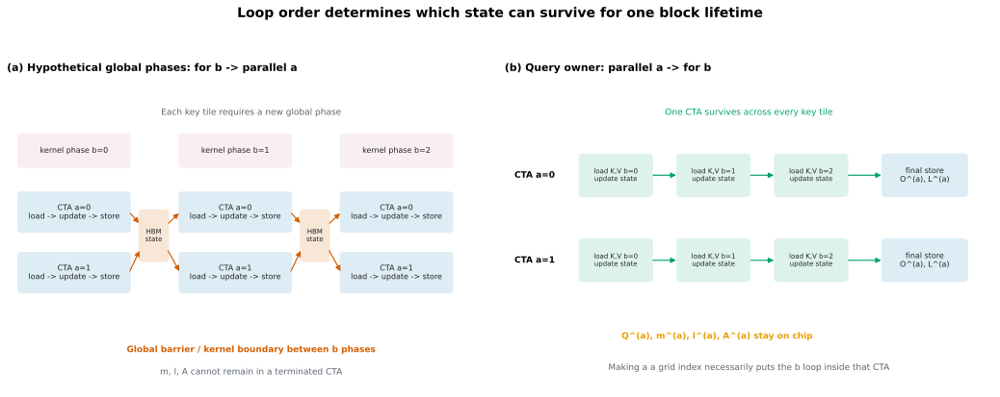
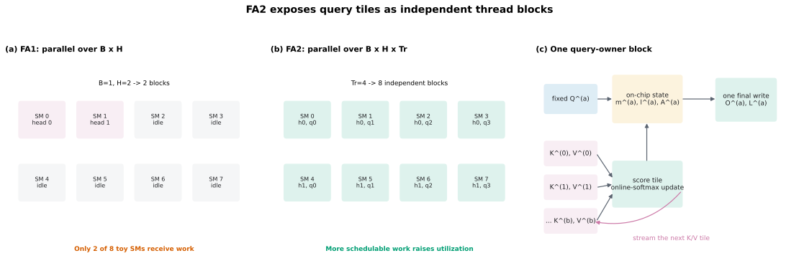
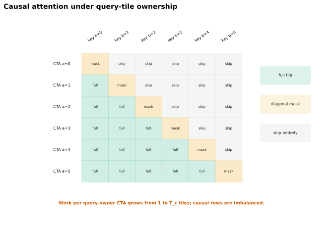
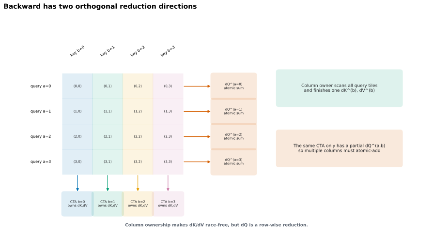
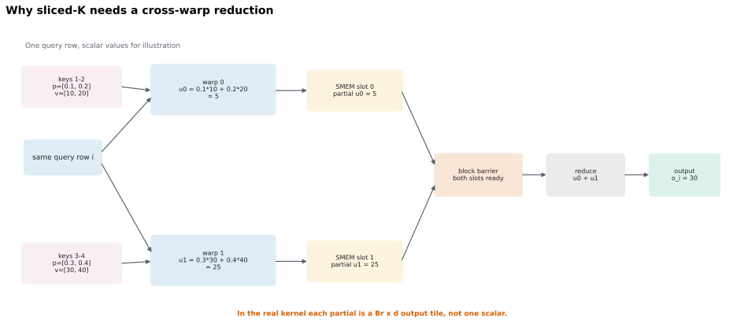

# 从 FlashAttention-1 到 FlashAttention-2：I/O 最优之后，为什么还要重做并行与工作划分

## 0. 本文要回答什么

FlashAttention-1（下文简称 FA1）已经避免把完整 attention matrix 写入 HBM，并证明了重要的 I/O 复杂度结论。为什么 FlashAttention-2（下文简称 FA2）还能再快约 2 倍？

最短答案是：

> FA1 主要解决“数据在 HBM 和片上存储之间怎样移动”；FA2 保留这个 I/O-aware 核心，再解决“这些工作怎样分给 thread blocks 和 warps，以及 Tensor Core 之外的标量/逐元素工作做了多少”。

因此，FA2 不是一种新的近似 attention，也没有把 dense attention 的二次算术复杂度变成线性。它修改的是同一精确算法的常数、并行任务粒度和片上通信方式。

本文面向已经读过 [03_02 Forward 篇](./03_02_flash_attention_2_beginner_textbook.md) 与 [03_03 Backward 篇](./03_03_flash_attention_2_backward.md) 的读者，但不依赖那两篇才能阅读。本文会重新建立必要的数学和 GPU 背景，重点回答以下问题：

1. FA1 的 I/O-aware 核心究竟是什么，为什么“少访问 HBM”可以比“少做 FLOPs”更重要？
2. FA1 的原始 thread-block/warp 划分留下了哪些性能问题？
3. FA2 所说的三类改进分别改了什么，没有改什么？
4. forward 与 backward 的循环顺序、输出所有权和同步需求如何变化？
5. 论文中的复杂度、并行性和性能数字应怎样解读？
6. 这些设计对 Triton 实现意味着什么？

### 0.1 主要资料与引用约定

本文以仓库内两篇官方论文 PDF 为主要来源：

- **FA1**：Dao et al., *FlashAttention: Fast and Memory-Efficient Exact Attention with IO-Awareness*，[本地 PDF](./references/flash_attention/flashattention_1_io_aware_exact_attention.pdf)，[arXiv:2205.14135](https://arxiv.org/abs/2205.14135)。
- **FA2**：Dao, *FlashAttention-2: Faster Attention with Better Parallelism and Work Partitioning*，[本地 PDF](./references/flash_attention/flashattention_2_better_parallelism_and_work_partitioning.pdf)，[arXiv:2307.08691](https://arxiv.org/abs/2307.08691)，[官方 HTML](https://arxiv.org/html/2307.08691v1)。

为避免把论文陈述、本文推导和实现建议混在一起，后文使用三种标签：

- **论文事实**：论文直接陈述、给出算法或报告实验。
- **文内推导**：由论文公式或调度直接推出，但不是照抄论文原句。
- **工程解释**：帮助理解或实现的模型；它可能随 GPU、编译器和 kernel 版本变化。

页码使用 PDF 文件页码。例如“FA2 PDF p. 8”指阅读器显示的第 8 页，而不是论文正文页脚编号。

### 0.2 一张总览表

| 维度 | FA1 | FA2 | 不变的部分 |
|---|---|---|---|
| 核心目标 | 减少 HBM 与片上 SRAM 之间的 I/O | 提高占用率，减少 non-matmul 工作和 warp 间通信 | 不物化完整 $S,P$ |
| 数学结果 | 精确 dense attention | 与 FA1 相同的精确 dense attention | $O=\operatorname{softmax}(QK^\top)V$ |
| forward 主调度 | 论文算法为 key/value tile 外循环、query tile 内循环；实现主要按 batch/head 并行 | query tile 外层并行，每个 block 扫描所有 key/value tiles | tile 内 online softmax |
| backward 主调度 | 主要按 batch/head 并行；key-major 扫描中更新 $dQ$ | 每个 key-column tile 一个 block，沿序列增加并行；对共享 $dQ$ 做 atomic add | tile 内重算 $S,P$ |
| block 内 warp 划分 | sliced-K：多个 warps 产生同一输出的部分和 | sliced-Q：不同 warps 拥有不同 query rows 的输出 | 仍用多个 warps 协作矩阵乘 |
| forward 保存统计量 | $m$ 与 $\ell$ | 只保存 $L=m+\log\ell$ | 都是每个 query 一组线性规模统计量 |
| 算术复杂度 | $\Theta(N^2d)$ | $\Theta(N^2d)$ | 没有变成线性 attention |
| 额外内存 | $O(N)$，不含输入输出 | $O(N)$，不含输入输出 | 不保存 $O(N^2)$ 的 $S,P$ |

---

## 1. 统一记号：数学列向量与框架布局

设单头 self-attention 的序列长度为 $N$，head dimension 为 $d$。数学上，单个 query、key、value 和输出都按列向量书写：

$$q_i,k_j,v_j,o_i\in\mathbb R^d,\qquad s_{ij}=\frac{q_i^\top k_j}{\sqrt d},\qquad o_i=\sum_{j=1}^{N}p_{ij}v_j$$

把各列向量的转置堆成矩阵的行：

$$Q=\begin{bmatrix}q_1^\top\\ \cdots\\ q_N^\top\end{bmatrix},\quad K=\begin{bmatrix}k_1^\top\\ \cdots\\ k_N^\top\end{bmatrix},\quad V=\begin{bmatrix}v_1^\top\\ \cdots\\ v_N^\top\end{bmatrix}\in\mathbb R^{N\times d}$$

于是矩阵形式为：

$$S=\frac{QK^\top}{\sqrt d},\qquad P=\operatorname{softmax}_{\mathrm{row}}(S),\qquad O=PV$$

本文省略 scale 时，只是为了突出调度；实现仍必须应用 $1/\sqrt d$ 或调用方指定的 scale。

**数学约定与 PyTorch 布局必须分开。** 数学上以列向量记 $y=Wx$；在 PyTorch 中特征位于最后一维，对应实现为 $y=xW^\top$。同理，PyTorch 常把单头输入存为 `(B, N, d)`，把多头输入存为 `(B, H, N, d)`，所以代码写 `Q @ K.transpose(-2, -1)`；这只是把每个 $q_i^\top$ 存在 Tensor 的最后一维，不是把数学中的 $q_i$ 改成行向量。

后文还使用：

| 记号 | 含义 |
|---|---|
| $B,H$ | batch size 与 attention head 数 |
| $B_r,B_c$ | query-row tile 与 key-column tile 的行数 |
| $T_r=\lceil N/B_r\rceil$ | query tiles 数 |
| $T_c=\lceil N/B_c\rceil$ | key/value tiles 数 |
| $M$ | FA1 理论模型中的片上 SRAM 容量 |
| $m_i$ | 第 $i$ 个 query 已处理 scores 的运行最大值 |
| $\ell_i$ | 相对 $m_i$ 平移后的指数和 |
| $z_i$ | 第 $i$ 个 query 的未归一化输出分子，是列向量 |
| $A^{(a)}$ | 第 $a$ 个 query tile 的未归一化输出 accumulator；每一行存放对应 $z_i^\top$ |
| $L_i=m_i+\log\ell_i$ | 第 $i$ 行完整 scores 的 logsumexp |

> **论文事实**：两篇论文都将每个 token 的向量按矩阵行存储，写成 $Q,K,V\in\mathbb R^{N\times d}$；本文额外声明单个 $q_i,k_j,v_j$ 是列向量，以保持数学记号一致。[FA1 §2.2，PDF p. 4](./references/flash_attention/flashattention_1_io_aware_exact_attention.pdf#page=4)；[FA2 §2.2，PDF p. 3](./references/flash_attention/flashattention_2_better_parallelism_and_work_partitioning.pdf#page=3)

---

## 2. 理解 FA1 与 FA2 所需的 GPU 背景

### 2.1 HBM、片上存储、SM、thread block 与 warp

先把“存储层级”和“执行层级”分开：

| 类别 | 层级 | 本文需要的理解 |
|---|---|---|
| 存储 | HBM / global memory | 容量大，可被不同 kernel 和 thread blocks 访问，但相对片上存储慢 |
| 存储 | shared memory / SRAM | 位于 SM 上，容量小、带宽高；同一 thread block 的 warps 可借它通信 |
| 存储 | registers | 每个线程的快速私有状态；寄存器过多会降低驻留 block 数，严重时发生 spilling |
| 执行 | streaming multiprocessor（SM） | 调度并执行 thread blocks 的硬件单元 |
| 执行 | thread block / CTA | CTA 是 Cooperative Thread Array 的缩写，也就是 CUDA thread block；它作为整体被调度到某个 SM，内部可以同步并共享 shared memory |
| 执行 | warp | 通常是 32 个线程；warp 内可用 shuffle 等快速方式通信并协作执行矩阵乘 |

后文会交替使用 `CTA` 和 `thread block`，二者在本文中含义相同。一个 CTA
通常包含多个 warps；同一 SM 可以在寄存器和 shared-memory 容量允许时同时
驻留多个 CTAs。CTA 内的线程可以使用 `__syncthreads()` 和 shared memory
协作，但不同 CTAs 即使被调度到同一个 SM，也不能用这两种机制直接同步或
共享状态。因此，“query-owner CTA”就是**独占一个 query tile 输出状态的
CUDA thread block**。

> **论文事实**：FA2 以 A100 为例，给出 108 个 SM、每个 SM 192 KB 片上 SRAM、HBM 带宽 1.5-2.0 TB/s、估计 SRAM 带宽约 19 TB/s；论文为简化讨论忽略了程序员不能直接控制的 L2 cache。[FA2 §2.1，PDF p. 2](./references/flash_attention/flashattention_2_better_parallelism_and_work_partitioning.pdf#page=2)

> **工程解释**：一个 tile “在片上”不等于它完整驻留在单一物理存储中。编译后的 kernel 可能把不同部分放入 registers、shared memory，或为 Tensor Core 操作生成特定布局。算法层面应先追踪 tile 的生命周期和所有权，再用 profiler 判断真实存储行为。

### 2.2 Occupancy 不是抽象名词：首先要有足够多的 blocks

GPU 有很多 SM。若一次 kernel launch 只有少量 thread blocks，就算每个 block 内部写得很高效，也可能有大量 SM 没有工作。

FA1 的原始实现主要在 batch 和 head 两个维度并行，thread-block 数约为：

$$G_{\mathrm{FA1}}\approx B H$$

FA2 沿序列 tile 再展开一维。forward 的 thread-block 数约为：

$$G_{\mathrm{FA2,fwd}}\approx B H T_r=B H\left\lceil\frac{N}{B_r}\right\rceil$$

> **论文事实**：FA2 论文称 FA1 用一个 thread block 处理一个 attention head，总 block 数为 `batch size · number of heads`；在 A100 上，这个数足够大，例如至少约 80 时，调度较高效。长序列通常伴随较小 batch，因此 FA2 增加序列维并行。[FA2 §3.2，PDF pp. 7-8](./references/flash_attention/flashattention_2_better_parallelism_and_work_partitioning.pdf#page=7)，[官方 HTML §3.2](https://arxiv.org/html/2307.08691v1#S3.SS2)

> **文内推导**：若训练保持每步 token 总数 $BN$ 近似不变，$N$ 增大时 $B$ 往往减小。FA1 的 $BH$ 会随之减少，而 FA2 的 $BHT_r$ 又乘上了近似与 $N$ 成正比的 tile 数，因此更能维持足够多的可调度任务。

> **工程解释**：block 数多只是 occupancy 的必要条件之一。寄存器数量、shared-memory 用量、每个 block 的 warp 数、指令依赖和硬件上限仍会限制实际 occupancy；不能只看 launch grid 就断言 kernel 已充分利用 GPU。

### 2.3 Roofline：速度由计算上限和带宽上限共同约束

算术强度定义为每搬运一个 byte 数据所执行的 FLOPs：

$$I=\frac{\text{FLOPs}}{\text{bytes moved}}$$

Roofline 模型可概括为：

$$P_{\mathrm{attainable}}\le \min\left(P_{\mathrm{peak}},\ I\cdot BW_{\mathrm{memory}}\right)$$

其中 $P_{\mathrm{peak}}$ 是计算峰值，$BW_{\mathrm{memory}}$ 是相应存储层级的带宽。

- 当 $I$ 较低时，$I\cdot BW_{\mathrm{memory}}$ 更小，kernel 偏 memory-bound。
- 当 $I$ 足够高时，计算峰值成为上限，kernel 偏 compute-bound。
- tiling、fusion 和数据复用的共同目标，是减少慢速层级的 bytes moved，从而提高相对于 HBM 的算术强度。

> **论文事实**：FA1 §2.1 明确用 arithmetic intensity 区分 compute-bound 与 memory-bound，并指出大 inner dimension 的矩阵乘通常偏 compute-bound，而逐元素算子和 softmax 等归约通常偏 memory-bound；FA1 的目标是减少 HBM 访问。[FA1 §2.1，PDF pp. 3-4](./references/flash_attention/flashattention_1_io_aware_exact_attention.pdf#page=3)

> **文内推导**：上面的 roofline 不意味着“整个 fused attention kernel 只有一个固定瓶颈”。同一 kernel 中的矩阵乘阶段可能接近 Tensor Core 的计算上限，softmax 和状态更新阶段却可能受普通 FP32 管线、shared-memory 带宽或同步限制。FA2 正是进一步处理这些非 GEMM 瓶颈。

### 2.4 为什么少量 non-matmul FLOPs 也可能很贵

FA2 把工作粗分成：

- **matmul FLOPs**：例如 $QK^\top$、$PV$ 以及 backward 中的矩阵乘，可由低精度 Tensor Cores 高吞吐执行；
- **non-matmul FLOPs**：例如 `max`、`exp`、加法、乘法、除法、类型转换和归约，通常走吞吐低得多的执行路径。

> **论文事实**：FA2 以 A100 为例，给出 FP16/BF16 matmul 理论峰值 312 TFLOP/s，而 non-matmul FP32 理论峰值为 19.5 TFLOP/s，相差 16 倍。作者因此强调，即使 non-matmul FLOPs 只占总 FLOPs 的一小部分，也可能占用显著时间。[FA2 §3.1，PDF p. 5](./references/flash_attention/flashattention_2_better_parallelism_and_work_partitioning.pdf#page=5)，[官方 HTML §3.1](https://arxiv.org/html/2307.08691v1#S3.SS1)

> **工程解释**：“一个 non-matmul FLOP 等于 16 个 matmul FLOPs”是该硬件峰值比率形成的性能直觉，不是通用计价公式。实际成本还取决于指令、精度、向量化、依赖链、占用率和访存。正确做法是先据此寻找热点，再用 profiler 验证。

---

## 3. FA1 的 I/O-aware 核心

### 3.1 标准 attention 为什么产生昂贵的 HBM 往返

标准实现通常拆成三个 kernel 或 kernel 组：

```text
S = Q K^T
P = softmax(S)
O = P V
```

$S,P\in\mathbb R^{N\times N}$。第一个矩阵乘把 $S$ 写到 HBM；softmax 读 $S$、写 $P$；第二个矩阵乘再读 $P$。训练还常需保存 $P$ 给 backward。

> **论文事实**：FA1 Algorithm 0 逐步列出了上述 HBM 读写，并指出标准 attention 的 HBM 访问量为 $\Theta(Nd+N^2)$。[FA1 Algorithm 0 与 Theorem 2，PDF pp. 4、6](./references/flash_attention/flashattention_1_io_aware_exact_attention.pdf#page=4)

> **工程解释**：问题不只是“$N^2$ Tensor 占不下”，还包括“即使占得下，也要多次通过 HBM 搬运”。容量优化与流量优化相关，但不是同一个指标。

### 3.2 Online softmax 让完整行可以分块处理

固定一个 query $q_i$，假设已经处理一部分 keys，并保存：

- 运行最大值 $m_i$；
- 平移后的指数和 $\ell_i$；
- 当前已归一化输出 $o_i$。

新 key/value tile 到来后，令新最大值为 $m_i'$。FA1 的合并关系可以按单行写成：

$$m_i'=\max\left(m_i,\max_{j\in\mathcal B}s_{ij}\right)$$

$$\ell_i'=e^{m_i-m_i'}\ell_i+\sum_{j\in\mathcal B}e^{s_{ij}-m_i'}$$

$$o_i'=\frac{e^{m_i-m_i'}\ell_i o_i+\sum_{j\in\mathcal B}e^{s_{ij}-m_i'}v_j}{\ell_i'}$$

这里 $\mathcal B$ 是当前 key tile。所有 $v_j,o_i$ 都是列向量，因此最后一个式子的向量加法维度一致。

> **论文事实**：FA1 §3.1 与 Algorithm 1 使用运行最大值、指数和及输出重标定，在片上逐 tile 得到完整 softmax attention；Theorem 1 证明结果仍是 $O=\operatorname{softmax}(QK^\top)V$，不是近似结果。[FA1 §3.1、Algorithm 1、Theorem 1，PDF pp. 4-5](./references/flash_attention/flashattention_1_io_aware_exact_attention.pdf#page=4)

> **文内推导**：旧输出 $o_i$ 已除以旧分母 $\ell_i$。合并到新最大值坐标系时，必须先乘回旧分子权重 $\ell_i$，再乘 $e^{m_i-m_i'}$ 重标定，加入当前 tile 的未归一化加权和，最后除以新分母 $\ell_i'$。这也解释了 FA2 后来为何改存未归一化 accumulator。

### 3.3 Tiling、fusion 与 recomputation 是一个整体

FA1 的核心不只是 online softmax，而是三项配合：

1. **Tiling**：把 $Q,K,V$ 切块，让当前 $S_{ij}$ tile 和 softmax 状态放在片上。
2. **Fusion**：在一个 kernel 中完成 score、mask、softmax、可选 dropout 和 $PV$，不把完整 $S,P$ 写回 HBM。
3. **Recomputation**：forward 保存线性规模的 softmax 统计量；backward 重新计算当前 $S,P$ tile，而不是从 HBM 读取完整 $P$。

> **论文事实**：FA1 明确指出 recomputation 增加了 FLOPs，却因减少 HBM 访问而加速 backward；Figure 2 的 GPT-2 medium 设置中，标准 attention 与 FA1 分别为 66.6 与 75.2 GFLOPs，但 HBM 读写量从 40.3 GB 降到 4.4 GB，forward + backward 时间从 41.7 ms 降到 7.3 ms。[FA1 §3.1、Figure 2，PDF pp. 5-6](./references/flash_attention/flashattention_1_io_aware_exact_attention.pdf#page=5)

> **工程解释**：这组数据是“重算可能比保存再读取更快”的具体证据，不是“任何重算都更快”的普遍定律。只有当省下的慢速 I/O 与同步成本超过新增算术时，重算才有利。

### 3.4 FA1 forward 的原始循环与数据流

FA1 Algorithm 1 的逻辑循环是：

```text
for key/value tile j:                 # outer
    load K_j, V_j from HBM to SRAM
    for query tile i:                 # inner
        load Q_i, O_i, m_i, l_i from HBM to SRAM
        compute S_ij and online-softmax update
        write O_i, m_i, l_i back to HBM
```

它优先复用当前 $K_j,V_j$：每个 key/value tile 加载一次，然后遍历所有 query tiles。代价是同一个 $Q_i$、$O_i$ 和状态 $(m_i,\ell_i)$ 会随不同 $j$ 被反复读写。

> **论文事实**：上述顺序直接对应 FA1 Algorithm 1 lines 5-15；Figure 1 也用外层 K/V blocks、内层 Q blocks 描绘该数据流。[FA1 Figure 1 与 Algorithm 1，PDF pp. 2、5](./references/flash_attention/flashattention_1_io_aware_exact_attention.pdf#page=2)

> **工程解释**：算法伪代码中的 loop 不必机械等同于一个 CUDA 线程的 loop，但它决定了数据复用方向。FA2 论文进一步说明，FA1 实现主要以“一整个 attention head 对应一个 thread block”的方式在 $B,H$ 上并行；因此 FA1 伪代码与 FA2 的性能讨论要结合阅读。

### 3.5 FA1 的 I/O 复杂度及其边界

这一节只分析 **HBM 与片上 SRAM 之间搬运了多少个标量元素**。它不直接计算显存峰值，也不直接预测运行时间。若元素类型固定，把元素访问次数乘以每个元素的 bytes，才得到近似字节流量。

#### 3.5.1 分析模型与假设

FA1 论文采用一个简化的两级存储模型：

1. 单头输入 $Q,K,V\in\mathbb R^{N\times d}$ 初始位于 HBM，结果 $O\in\mathbb R^{N\times d}$ 最终也写入 HBM；
2. 片上 SRAM 最多容纳 $M$ 个标量元素，且 $d\le M\le Nd$；
3. 只统计 HBM 与 SRAM 之间的元素传输，不统计寄存器访问、算术指令和同步；
4. 忽略常数、向上取整和最后一个不完整 tile；
5. 分析对象是 dense exact attention，不利用稀疏性跳过 query-key 对。

这里的 $M$ 是“可容纳多少个标量”的抽象容量，不是可以不经换算直接代入的设备 KB 数。真实 kernel 同时使用不同 dtype、registers、shared memory 和中间 buffer；若按 bytes 建模，必须给每类对象乘上对应元素宽度。

#### 3.5.2 标准 attention 为什么是 $\Theta(Nd+N^2)$

标准实现分成 $S=QK^\top$、$P=\operatorname{softmax}(S)$、$O=PV$ 三个阶段。逐阶段计数：

| 阶段 | 从 HBM 读取 | 向 HBM 写入 | 访问量级 |
|---|---|---|---:|
| $S=QK^\top$ | $Q,K$，共 $2Nd$ | $S$，共 $N^2$ | $\Theta(Nd+N^2)$ |
| $P=\operatorname{softmax}(S)$ | $S$，共 $N^2$ | $P$，共 $N^2$ | $\Theta(N^2)$ |
| $O=PV$ | $P,V$，共 $N^2+Nd$ | $O$，共 $Nd$ | $\Theta(N^2+Nd)$ |

三项相加后：

$$\operatorname{IO}_{\mathrm{standard}}=\Theta(Nd+N^2)$$

当 $N\gg d$ 时，$N^2$ 项占主导。即使完整 $S,P$ 能放进 HBM，它们仍要在不同 kernel 之间写回和重新读入；因此这里衡量的不只是“占多少容量”，还是“经过慢速存储层搬了多少次”。

> **论文事实**：上述计数对应 FA1 Algorithm 0 与 Theorem 2。[FA1 Algorithm 0、Theorem 2，PDF pp. 4、6](./references/flash_attention/flashattention_1_io_aware_exact_attention.pdf#page=4)

#### 3.5.3 Tile 尺寸为什么与 $M/d$ 有关

FA1 Algorithm 1 选择的 block size 为：

$$B_c=\left\lceil\frac{M}{4d}\right\rceil,\qquad B_r=\min\left(\left\lceil\frac{M}{4d}\right\rceil,d\right)$$

忽略常数和取整后：

$$B_c=\Theta\left(\frac{M}{d}\right),\qquad B_r=\Theta\left(\min\left(\frac{M}{d},d\right)\right)$$

选择这两个尺度，是为了让一次内层计算所需的对象都保持在 $O(M)$ 片上容量内：

| 片上对象 | 元素数 |
|---|---:|
| $K_j,V_j$ | $2B_c d$ |
| $Q_i,O_i$ | $2B_r d$ |
| 当前 $S_{ij},P_{ij}$ 及同尺度临时量 | $O(B_r B_c)$ |
| $m_i,\ell_i$ | $O(B_r)$ |

$B_c=\Theta(M/d)$ 直接保证一个 $K/V$ tile 占 $O(M)$。再令 $B_r\le d$ 且 $B_r=O(M/d)$，可同时得到 $B_r d=O(M)$ 与 $B_r B_c=O(M)$。常数 $1/4$ 为同时容纳多类活跃对象留出空间；渐近推导只关心这些项不会超过常数倍 $M$。

于是 key/value tiles 的数量为：

$$T_c=\left\lceil\frac{N}{B_c}\right\rceil=\Theta\left(\frac{Nd}{M}\right)$$

#### 3.5.4 固定一个 key/value tile 时搬运多少数据

回到 FA1 的 key-major 外循环。固定一个 $j$：

1. $K_j,V_j$ 各加载一次，共 $\Theta(B_c d)$；
2. 内层遍历全部 $T_r$ 个 query tiles，所有 $Q_i$ 合计恰好覆盖 $N$ 行，因此读取量为 $\Theta(Nd)$；
3. 所有 $O_i$ 也覆盖 $N$ 行，并且要读出旧值、写回新值，因此仍是 $\Theta(Nd)$；
4. $m_i,\ell_i$ 的全部读写为 $\Theta(N)$；
5. 当前 $S_{ij},P_{ij}$ 只在片上产生和消费，不写入 HBM。

由于 $M\le Nd$ 推出 $B_c=O(N)$，所以 $\Theta(B_c d)$ 不超过 $\Theta(Nd)$。因此，一个外层 $j$ 的总 HBM 访问量为：

$$\Theta(B_c d+Nd+Nd+N)=\Theta(Nd)$$

这里也能看出为什么最终式中不显式出现 $B_r$：无论每个 query tile 有多少行，一次完整内层扫描都会覆盖全部 $N$ 行；$B_r$ 改变调用粒度和常数，却不改变这一遍扫描的总元素数。

#### 3.5.5 乘上全部 key/value tiles

一共有 $T_c=\Theta(Nd/M)$ 个 key/value tiles。更完整地写，总访问量由“一次性读取全部 $K,V$”和“对每个 $j$ 扫描全部 query/output 状态”组成：

$$\operatorname{IO}_{\mathrm{FA1}}=\Theta(Nd)+T_c\Theta(Nd)=\Theta\left(Nd+\frac{N^2d^2}{M}\right)$$

由于假设 $M\le Nd$：

$$\frac{N^2d^2}{M}\ge\frac{N^2d^2}{Nd}=Nd$$

所以第二项不会小于第一项，最终得到：

$$\operatorname{IO}_{\mathrm{FA1}}=\Theta\left(\frac{N^2d^2}{M}\right)$$

这就是 FA1 Theorem 2 的计数主线：每个 $K/V$ 元素只从 HBM 读取一次，但 $Q/O$ 会被扫描 $T_c$ 遍；增大可用片上容量 $M$ 会增大 $B_c$、减少 $T_c$，因而减少重复扫描次数。[FA1 Theorem 2 与 Appendix C，PDF pp. 6、23-24](./references/flash_attention/flashattention_1_io_aware_exact_attention.pdf#page=6)

#### 3.5.6 什么时候比标准 attention 少

在常见的长序列区域 $N\gg d$，标准 attention 的主项为 $\Theta(N^2)$。两者主项之比为：

$$\frac{\operatorname{IO}_{\mathrm{standard}}}{\operatorname{IO}_{\mathrm{FA1}}}=\Theta\left(\frac{M}{d^2}\right)$$

因此：

- 当 $M\gg d^2$ 时，FA1 在该模型中显著减少 HBM 访问；
- 当 $M=\Theta(d^2)$ 时，两者在渐近量级上相同，仍可能因 fusion 等常数差异而有不同运行时间；
- 当 $M=\Theta(Nd)$ 时，FA1 达到 $\Theta(Nd)$，已经与“至少读入输入并写出输出”的规模同阶；
- 定理覆盖 $d\le M\le Nd$，但并没有声称该范围内每个 $M$ 都一定比标准实现少。

这解释了论文为什么强调典型配置中 $d^2$ 远小于 $M$。真正提供优势的是“片上容量足以容纳有复用价值的二维 tile”，而不只是“使用了分块”这个形式。

#### 3.5.7 Proposition 3 的下界究竟证明了什么

FA1 Proposition 3 的准确表述是：不存在一个精确 attention 算法，能够对区间 $M\in[d,Nd]$ 中的**所有** $M$，都取得 $o(N^2d^2/M)$ 的 HBM 访问量。

证明采用反证法。假设存在这样的算法，再取 $M=\Theta(Nd)$，则其访问量必须满足：

$$o\left(\frac{N^2d^2}{M}\right)=o(Nd)$$

但仅 $Q,K,V$ 三个输入和 $O$ 一个输出就各有 $\Theta(Nd)$ 规模；任何正确算法至少要读入必要输入并写出结果，因此需要 $\Omega(Nd)$ 次 HBM 访问，与 $o(Nd)$ 矛盾。

这个命题需要谨慎解读：

- 它排除了一个能在整个 $M$ 区间上统一渐近优于 FA1 的精确算法；
- 它不是针对每一个固定 $M$ 分别证明 $\Omega(N^2d^2/M)$；
- 它不排除改进常数、并行度、片上通信或特定 $M$/shape 的性能；
- 因而 FA2 可以保持同阶 I/O，同时仍通过调度和工作划分获得显著加速。

> **论文事实**：下界命题与上述反证法见 FA1 Proposition 3 和 Appendix C。[FA1 Proposition 3，PDF p. 6；Appendix C，PDF p. 24](./references/flash_attention/flashattention_1_io_aware_exact_attention.pdf#page=6)

#### 3.5.8 Backward 为什么也是同一量级

标准 backward 会依次产生或消费 $P,dP,dS\in\mathbb R^{N\times N}$，所以其 HBM 访问量仍为 $\Theta(Nd+N^2)$。

FA1 backward 固定一个 key/value tile 时：

1. $K_j,V_j$ 只需加载一次，最终 $dK_j,dV_j$ 也各写回一次；
2. 为了遍历所有 query rows，要读取完整的 $Q,O,dO$；
3. 同一个 $dQ$ 要跨 key tiles 累加，因此每个外层 $j$ 还要读写一遍完整 $dQ$；
4. 当前 $S,P,dP,dS$ tile 只在片上重算、使用和丢弃。

因此每个 key/value tile 仍产生 $\Theta(Nd)$ 访问，乘以 $T_c=\Theta(Nd/M)$ 后得到：

$$\operatorname{IO}_{\mathrm{standard,bwd}}=\Theta(Nd+N^2),\qquad \operatorname{IO}_{\mathrm{FA1,bwd}}=\Theta\left(\frac{N^2d^2}{M}\right)$$

这也说明 backward 重算并非“免费”：它增加矩阵乘和逐元素运算，却避免了完整 $P,dP,dS$ 的 HBM 往返。是否获得 wall-clock 加速，取决于节省的 I/O 是否大于新增计算。

> **论文事实**：FA1 Appendix C 对 backward 使用相同的分块约束和计数，得到与 forward 同阶的 HBM 访问量。[FA1 Theorem 4，PDF p. 21；Appendix C，PDF p. 24](./references/flash_attention/flashattention_1_io_aware_exact_attention.pdf#page=21)

#### 3.5.9 复杂度公式没有包含什么

这两个 $\Theta$ 结论没有直接建模：

- L2 cache 命中、coalescing、bank conflict 和实际事务粒度；
- FP16/BF16/FP32 混合存储造成的 byte 数差异；
- Tensor Core 与 non-matmul 指令吞吐；
- thread-block 数、occupancy、warp 间同步和 register spilling；
- causal mask、边界 tile、dropout 及 kernel launch 开销。

因此，I/O 复杂度回答“算法随 $N,d,M$ 扩展时需要多少跨层数据移动”，benchmark 才回答“某个实现实际用了多长时间”。FA1 首先消除了标准 attention 的主要 HBM 往返；FA2 在不改变 $\Theta(N^2d)$ 算术和线性额外存储的前提下，继续优化未被这个 I/O 模型描述的常数、并行度与片上通信。

### 3.6 FA1 backward：不保存 $P$，在片上重算

令上游梯度为 $do_i\in\mathbb R^d$。FA1 使用：

$$dP_{ij}=do_i^\top v_j,\qquad D_i=\sum_j P_{ij}dP_{ij}=do_i^\top o_i$$

$$dS_{ij}=P_{ij}(dP_{ij}-D_i)$$

$$dq_i=\sum_j dS_{ij}k_j,\qquad dk_j=\sum_i dS_{ij}q_i,\qquad dv_j=\sum_i P_{ij}do_i$$

若 forward 有 scale，$dq_i,dk_j$ 还要包含相同的 scale 因子。

FA1 forward 保存 $O,m,\ell$ 和 dropout 所需的伪随机状态。backward 对当前 tile 重算：

$$P_{ij}=\frac{e^{S_{ij}-m_i}}{\ell_i}$$

然后立即生成并消费 $dP,dS$ tile，不在 HBM 物化完整二次矩阵。

> **论文事实**：FA1 Appendix B.2 推导了 $D_i=do_i^\top o_i$；Algorithm 4 给出完整 tiled backward，并在 key tile 外循环中于片上累加 $dK_j,dV_j$、反复读写 $dQ_i$。[FA1 Appendix B.2 与 Algorithm 4，PDF pp. 18-21](./references/flash_attention/flashattention_1_io_aware_exact_attention.pdf#page=18)

> **文内推导**：$dK_j,dV_j$ 都沿 query 维归约，因此固定 key tile 可以在片上完成它们；$dQ_i$ 沿 key 维归约，所以 key-major 扫描必须让同一 $dQ_i$ 跨不同 $j$ 持续累加。这个“不同梯度有不同自然归约方向”的事实，是理解 FA2 backward atomic add 和其他两遍实现的关键。

---

## 4. FA1 已经 I/O-aware，为什么仍没有接近 GEMM

FA1 解决了最大的 HBM 问题，但“达到好的 I/O 复杂度”不等于“GPU 上所有资源都已充分利用”。还剩三类损失：

1. **non-matmul 工作偏多**：每个 key tile 都对已归一化输出做重标定和重新除法，还保存两份统计量。
2. **thread-block 并行度不足**：只按 $B,H$ 并行时，长序列、小 batch 的 launch grid 可能无法填满 SM。
3. **warp 间通信偏多**：sliced-K 让多个 warps 产生同一输出 tile 的部分和，必须通过 shared memory 同步与归约；第 7 章会用具体数值和数据流图展开这条路径。

> **论文事实**：FA2 摘要称 FA1 只达到理论峰值的 25%-40%；正文给出的更细口径是，FA1 forward 约为理论峰值的 30%-50%，backward 约为 25%-35%，而优化 GEMM 可达到 80%-90%。作者通过 profiling 将主要低效归因于 thread blocks 和 warps 之间不理想的工作划分。[FA2 摘要与 §1，PDF pp. 1-2](./references/flash_attention/flashattention_2_better_parallelism_and_work_partitioning.pdf#page=1)

> **工程解释**：FA2 的问题定义已经从“不要落地 $N\times N$ 中间量”转向“fused attention 离高效 GEMM 还有多远”。因此它不是推翻 FA1，而是在 FA1 已建立的 I/O 下界与重算框架上做第二层优化。

---

## 5. FA2 改进一：减少 non-matmul FLOPs

### 5.1 从“每轮维护归一化输出”改为“最后只归一化一次”

FA1 每处理一个 key tile，都得到新的 $\ell_i'$，并立刻把输出更新成已归一化的 $o_i'$。沿用 Forward 篇的记号，FA2 对单个 query 维护未归一化分子 $z_i\in\mathbb R^d$；对应的 query-tile accumulator 记作 $A^{(a)}$。

令：

$$\alpha_i=e^{m_i-m_i'}$$

当前 tile 在新最大值坐标系下的未归一化概率为 $\widetilde P_{ij}=e^{S_{ij}-m_i'}$。FA2 更新：

$$\ell_i'=\alpha_i\ell_i+\sum_{j\in\mathcal B}\widetilde P_{ij}$$

$$z_i'=\alpha_i z_i+\sum_{j\in\mathcal B}\widetilde P_{ij}v_j$$

所有 key tiles 处理完以后才执行：

$$o_i=\frac{z_i}{\ell_i}$$

> **论文事实**：FA2 §3.1.1 将第一项改动描述为维护 “un-scaled” 输出，只在循环末尾乘 $\operatorname{diag}(\ell)^{-1}$；Algorithm 1 lines 9-13 给出完整更新。[FA2 §3.1.1 与 Algorithm 1，PDF pp. 5-6](./references/flash_attention/flashattention_2_better_parallelism_and_work_partitioning.pdf#page=5)，[官方 HTML §3.1.1](https://arxiv.org/html/2307.08691v1#S3.SS1.SSS1)

> **勘误提示**：FA2 arXiv v1 的正文两块示例与 Algorithm 1 把旧 accumulator 的缩放项排成了逆缩放。换成本节的单行记号，即误写成 $(e^{m_i^{\mathrm{old}}-m_i^{\mathrm{new}}})^{-1}z_i$；这里的逆号会把不大于 1 的重标定因子反转。与 online-softmax 不变量一致的更新是上文的 $\alpha_i z_i$，即直接乘 $e^{m_i^{\mathrm{old}}-m_i^{\mathrm{new}}}$。这一点也可由 FA1 的正确合并式直接推出。

> **文内推导**：FA1 的 $o_i$ 已经除过旧 $\ell_i$，合并时要恢复旧分子并再次除以新 $\ell_i'$；FA2 的 $z_i$ 始终就是当前最大值坐标系下的分子，所以每轮只需乘 $\alpha_i$，归一化除法从“每个 tile 一次”变成“每行最终一次”。

> **工程解释**：矩阵乘 $Q_iK_j^\top$ 和 $\widetilde P_{ij}V_j$ 没有减少；减少的是围绕它们的逐行缩放、逐元素乘除和状态操作。因此这项优化体现的正是“总 FLOPs 变化不大，但昂贵 FLOPs 的组成更好”。

### 5.2 从保存 $(m,\ell)$ 改为只保存 logsumexp $L$

FA2 forward 最后保存：

$$L_i=m_i+\log\ell_i=\log\sum_j e^{S_{ij}}$$

backward 可直接重建：

$$P_{ij}=e^{S_{ij}-L_i}$$

> **论文事实**：FA2 §3.1.1 的第二项改动是只保存 $L$，不再同时保存 $m$ 和 $\ell$；Algorithm 2 line 11 用 $P_{ij}=e^{S_{ij}-L_i}$ 重建概率。[FA2 §3.1.1、§3.1.2 与 Algorithms 1-2，PDF pp. 5-7](./references/flash_attention/flashattention_2_better_parallelism_and_work_partitioning.pdf#page=5)

> **文内推导**：每行保存状态从两个标量降为一个标量，统计量存储由 $2N$ 降为 $N$，但两者都仍是 $O(N)$。这是常数改进，不是复杂度阶数变化。

> **工程解释**：$L$ 不是训练 loss。它是每个 query 行的 logsumexp，既是 forward 数值状态的压缩表示，也是 backward 重算 $P$ 的接口。

### 5.3 预计算 $D$：避免在每个 key tile 中重复点积

对第 $i$ 个 query 行，softmax backward 需要一个标量修正项：

$$D_i=do_i^\top o_i=\sum_{c=1}^{d}dO_{ic}O_{ic}$$

它只依赖该行的 $o_i$ 和 $do_i$，不依赖当前处理的是哪个 key tile $j$。所有 key tiles 都会使用同一个 $D_i$：

$$dS_{ij}=P_{ij}(dP_{ij}-D_i)$$

因此，若把 $D_i$ 放在 key-tile 循环内部，就会反复执行完全相同的 feature-dimension 点积。两种调度可以写成：

```text
FA1 Algorithm 4 的伪代码位置：
for key tile j:
    for query tile i:
        D_i = rowsum(dO_i * O_i)   # 每个 j 都重复
        use D_i to compute dS_ij

FA2 Algorithm 2：
D = rowsum(dO * O)                 # 主循环前统一计算一次
for key tile j:
    for query tile i:
        load D_i
        use D_i to compute dS_ij
```

设 key tiles 数为 $T_c$。计算完整 $D$ 需要 $\Theta(Nd)$ 次逐元素乘加：

- 写在内层循环时，这部分工作会重复 $T_c$ 次，达到 $\Theta(T_cNd)$；
- 提前预计算后只需 $\Theta(Nd)$，后续每个 tile 读取对应的 $D_i$；
- attention backward 的总渐近算术量仍是 $\Theta(N^2d)$，但昂贵的 non-matmul 归约常数减少了。

> **论文事实**：FA1 已在 Appendix B.2 推导 $D_i=do_i^\top o_i$；FA1 Algorithm 4 将其写在内层循环，FA2 Algorithm 2 则在 line 4 预计算整条 $D$。FA2 作者仍明确称 backward “almost the same”，只强调改用 $L$ 而不是 $(m,\ell)$。[FA1 Algorithm 4，PDF p. 21](./references/flash_attention/flashattention_1_io_aware_exact_attention.pdf#page=21)；[FA2 §3.1.2、Algorithm 2，PDF p. 7](./references/flash_attention/flashattention_2_better_parallelism_and_work_partitioning.pdf#page=7)

这里优化的是**计算位置和重复次数**：$D_i=do_i^\top o_i$ 的数学恒等式在 FA1 中已经存在，FA2 把这个与 $j$ 无关的循环不变量显式移到 tiled backward 主循环之前。

---

## 6. FA2 改进二：沿 sequence length 增加 thread-block 并行

这一项优化的核心不是“多启动一些 blocks”，而是找到 attention 中真正独立的任务，并让每个 block 对最终输出拥有清晰、无竞争的写入权。理解它需要连续回答：

1. FA1 为什么没有足够多的 blocks？
2. 哪个序列维 tile 可以独立成为任务？
3. reduction 维为什么应留在 owner block 内？
4. causal mask 怎样改变每个任务的工作量？
5. backward 为什么必须改用另一种 ownership？

### 6.1 第一步：识别 FA1 的 grid-level parallelism 不足

FA1 的原始 CUDA 实现主要沿 batch 和 head 并行，一个 thread block 负责一个 attention head。若 batch size 为 $B$、head 数为 $H$，可调度 block 数约为：

$$G_{\mathrm{FA1}}\approx BH$$

一个 block 在某一时刻只驻留于一个 SM。若 $BH$ 小于设备 SM 数量，就算每个 block 内部的 Tensor Core 使用得很好，也会有部分 SM 根本拿不到任务。

长序列场景尤其容易触发这个问题。训练常保持每步 token 总数近似固定；当序列长度 $N$ 增大时，batch size $B$ 往往减小，于是 $BH$ 也随之减少。FA1 的单个 block 会做更长的序列循环，但整个 grid 中可并行调度的任务反而更少。

> **论文事实**：FA2 §3.2 称 FA1 的 block 数为 `batch size · number of heads`，并指出 A100 有 108 个 SM；当这个乘积不够大时，仅依赖 $BH$ 无法填满设备。[FA2 §2.1、§3.2，PDF pp. 2、7-8](./references/flash_attention/flashattention_2_better_parallelism_and_work_partitioning.pdf#page=7)

### 6.2 第二步：交换循环，让 query tile 成为 output owner

FA1 Algorithm 1 是 key-major：

```text
parallel for batch/head h:                 # one thread block owns one head
    for key/value tile b:                  # b changes during this block's lifetime
        keep K^(b), V^(b) on chip
        for query tile a:
            load Q^(a), O^(a), m^(a), l^(a)
            update this query tile
            write O^(a), m^(a), l^(a)
```

这里必须区分两个术语：

- **key-major** 描述 block 内的循环顺序：$b$ 在 $a$ 外层；
- **owner** 描述 thread block 在整个生命周期内固定负责什么，以及它最终写哪些完整输出。

FA1 是 **key-major + head-owner**：grid 只沿 batch/head 展开，同一个 block 会依次令 $b=0,1,\ldots,T_c-1$，所以它并不固定拥有某个 key tile。真正的 key-owner 应当在 block 的整个生命周期中固定 $b$，只产生该 key 分区对所有 queries 的贡献；那是下面讨论的假设方案，不是 FA1。

> **论文事实**：FA2 §3.2 对 FA1 调度的原文描述是“schedule 1 thread block to process one attention head”，总 block 数为 `batch size · number of heads`。[FA2 §3.2，PDF p. 8](./references/flash_attention/flashattention_2_better_parallelism_and_work_partitioning.pdf#page=8)

#### 6.2.1 FA1 为什么使用 head-owner，而不是 key-owner

FA1 的 key-major 顺序优先复用当前 $K^{(b)},V^{(b)}$。一个 head-owner block 把它们加载到自己的 shared memory 后，可以连续更新多个 query tiles。

这里有一个重要硬件约束：**shared memory 属于 thread block，不能被其它 blocks 直接读取。** 假如把不同 query tiles 立刻拆给不同 blocks：

- block $a=0$ 要加载一份 $K^{(b)},V^{(b)}$；
- block $a=1$ 也要加载相同的 $K^{(b)},V^{(b)}$；
- 一个 block 无法把自己 shared memory 中的 K/V tile 借给另一个 block。

L2 cache 可能减少实际 HBM 流量，但它不等价于多个 blocks 共享一份可显式寻址的 SRAM tile。不过，这一点本身还不足以推出“必须由一个 block 处理全部 K/V tiles”；还要比较 $(a,b)$ tile grid 的三种 ownership：

| Owner 选择 | 一个 block 负责什么 | 可以在 block 内完成的归约 | 尚未完成的工作 |
|---|---|---|---|
| Head owner（FA1） | 一个 head 的所有 $(a,b)$ | query 维和 key 维都在同一 block 内 | block 数只有约 $BH$ |
| 假设的 key owner $b$（非 FA1） | 固定 $K^{(b)},V^{(b)}$，遍历所有 $a$ | 可跨 query tiles 复用当前 K/V | 每个 query 只得到 key 分区 $b$ 的 partial softmax/output |
| Query owner $a$（FA2） | 固定 $Q^{(a)}$，遍历所有 $b$ | 完整计算 $O^{(a)},L^{(a)}$ | 不同 owners 会重复读取 K/V |

**为什么不把不同 K/V tiles 直接交给不同 blocks？**

设 key-owner block $b$ 只看到索引集合 $\mathcal J_b$。对 query 行 $i$，它最多得到局部状态：

$$m_i^{[b]}=\max_{j\in\mathcal J_b}S_{ij},\qquad \ell_i^{[b]}=\sum_{j\in\mathcal J_b}e^{S_{ij}-m_i^{[b]}},\qquad z_i^{[b]}=\sum_{j\in\mathcal J_b}e^{S_{ij}-m_i^{[b]}}v_j$$

这里的 $m_i^{[b]}$ 只是在局部 key range 上的最大值，不同 blocks 的指数基准通常不同。全局结果不能写成 $\sum_b z_i^{[b]}/\ell_i^{[b]}$，而必须先计算：

$$m_i=\max_b m_i^{[b]}$$

$$\ell_i=\sum_b e^{m_i^{[b]}-m_i}\ell_i^{[b]},\qquad z_i=\sum_b e^{m_i^{[b]}-m_i}z_i^{[b]},\qquad o_i=\frac{z_i}{\ell_i}$$

因此，key-owner blocks 并没有直接得到最终输出。它们必须把每个 query 的 partial $m_i^{[b]},\ell_i^{[b]},z_i^{[b]}$ 交给另一个归约阶段。若每个 $b$ 都产生全部 $N_q$ 行的 partials，主导项 $z^{[b]}$ 的总暂存量为：

$$\Theta(T_c N_q d)$$

实现上通常需要 HBM partial buffer 和第二个 reduction kernel。若改成一个 block 只负责单个 $(a,b)$，虽然 block 数进一步增加到 $B H T_r T_c$，每个 $O^{(a)}$ 仍收到 $T_c$ 份 partial states，归约问题并未消失。第 6.4 节会继续解释跨 block 合并的同步限制。

所以“把不同 K/V tiles 交给不同 blocks”不是数学上不可行，而是把原本位于一个 owner 内的 online-softmax reduction 变成了昂贵的跨 block reduction。FA2 选择 query owner，是为了让每个 block 直接产出完整的 $O^{(a)},L^{(a)}$。

**为什么一个 head-owner block 不能把所有 query 状态一直留在片上？**

先看 key-major 顺序如何重复访问 $Q$：

```text
b = 0:  Q^(0), Q^(1), ..., Q^(T_r-1)
b = 1:  Q^(0), Q^(1), ..., Q^(T_r-1)
...
b = T_c-1: Q^(0), Q^(1), ..., Q^(T_r-1)
```

每个 $Q^{(a)}$ 会被后续所有 key tiles 使用。若它在处理完当前 $b$ 后离开片上存储，下一个 $b$ 就必须从 HBM 再加载它；所以“每个 $Q^{(a)}$ 在整个 forward 中只加载一次”意味着：**全部 $T_r$ 个 Q tiles 都必须从第一次使用开始，一直保留到最后一个 $b$ 结束。**

下面计算这需要多少空间。令：

$$T_r=\left\lceil\frac{N_q}{B_r}\right\rceil,\qquad N_{\mathrm{pad}}=T_r B_r$$

由于向上取整：

$$N_q\le N_{\mathrm{pad}}<N_q+B_r$$

每个 query tile 的状态规模为：

| 状态 | 元素数 | 是否会被后续 $b$ 再次使用 |
|---|---:|---|
| $Q^{(a)}$ | $B_r d$ | 是，所有 key tiles 都需要 |
| $O^{(a)}$ 或未归一化 accumulator | $B_r d$ | 是，每个 $b$ 都要继续更新 |
| $m^{(a)}$ | $B_r$ | 是，online softmax 状态 |
| $\ell^{(a)}$ | $B_r$ | 是，online softmax 状态 |

先不要求 $Q$ 常驻，只把所有 query tiles 的可变输出状态 $O,m,\ell$ 同时保留，所需标量元素数为：

$$M_{\mathrm{mutable}}=T_r(B_r d+2B_r)=N_{\mathrm{pad}}(d+2)\ge N_q(d+2)=\Omega(N_q d)$$

若进一步要求所有 $Q^{(a)}$ 在整个 key-tile 循环中只从 HBM 加载一次，还要增加 $T_r B_r d=N_{\mathrm{pad}}d$ 个元素：

$$M_{\mathrm{all}}=T_r(2B_r d+2B_r)=2N_{\mathrm{pad}}(d+1)\ge 2N_q(d+1)>2N_q d$$

这里的 $M_{\mathrm{mutable}}$ 和 $M_{\mathrm{all}}$ 先按“标量元素数”计数；具体字节数还取决于各状态的数据类型。关键是二者都随 $N_q$ 线性增长，而单个 block 可用的 registers/shared memory 容量与序列长度无关。在 FlashAttention 面向的长序列区间通常有 $N_q d\gg M$，所以不能让全体 query 状态跨所有 $b$ 同时驻留。

以 $N_q=4096,d=128,B_r=128$ 为例，$T_r=32$ 且没有 padding。按 $Q$ 使用 BF16、输出 accumulator 与 $m,\ell$ 使用 FP32 计算：

| 状态 | 字节数 |
|---|---:|
| 全部 $Q$ | $4096\times128\times2=1\ \mathrm{MiB}$ |
| 全部 FP32 输出 accumulators | $4096\times128\times4=2\ \mathrm{MiB}$ |
| 全部 FP32 $m,\ell$ | $2\times4096\times4=32\ \mathrm{KiB}$ |
| 合计 | 约 $3.03\ \mathrm{MiB}$ |

这还没有计算当前 $K,V$ tile、score tile 和其它临时量，已经远超单个 A100 SM 约 164 KiB 的 shared memory。register file 也不是一块可与 shared memory 任意合并、供单个 block 无限制索引的存储。

FA2 并不是设法把这约 3.03 MiB 全塞进一个 block。它让每个 query-owner block 只保留一个 $Q^{(a)}$ 及其 $m^{(a)},\ell^{(a)},A^{(a)}$。仅考虑这部分 resident query state，空间从随 $N_q$ 增长缩成随 tile size $B_r$ 增长：

$$M_{\mathrm{resident\ query\ state}}=\Theta(B_r d)$$

当前 $K,V$ 和 score/probability 临时量还分别贡献 tile 级空间，但它们由 $B_c$、$B_r$ 限定，不再随完整序列长度 $N_q$ 一起常驻。

> **核心结论：FA1 的 K/V 复用不是免费的**
>
> FA1 可以把当前 $K^{(b)},V^{(b)}$ 留在片上，并让它们依次服务多个 query
> tiles；不能同时留在片上的，是处理完该 $K^{(b)},V^{(b)}$ 后属于**所有
> query tiles** 的 partial states
> $\{O^{(a)},m^{(a)},\ell^{(a)}\}_{a=0}^{T_r-1}$。因此 block 每处理完一个
> query tile，就必须把它的更新后状态写回 HBM；进入下一个
> $K^{(b+1)},V^{(b+1)}$ 时，再逐个加载这些状态：
>
> $$\operatorname{HBM}\rightarrow(Q^{(a)},O^{(a)},m^{(a)},\ell^{(a)})\rightarrow\text{update}\rightarrow\operatorname{HBM}$$
>
> **所以你的理解是对的：连所有 query tiles 的中间结果状态都无法同时常驻
> 片上，更不可能再把全部 $Q^{(a)}$ 一并长期保留。FA1 用 K/V 的片上复用，
> 换取了 query 数据及其状态的反复读写和较少的并行 blocks。**

#### 6.2.2 保持全局 key-major，再并行 query blocks 会发生什么

CUDA/Triton 中，grid index 在一个 program/block 的整个生命周期内固定，而普通 `for` 循环运行在 program 内部。若把 query tile $a$ 映射为 `program_id`，自然结构只能是：

```text
parallel program/block a:
    for key tile b:
        ...
```

若坚持让 $b$ 保持所有 query blocks 之外的全局外层，结构就会变成：

```text
for key tile b on the host/runtime:
    launch parallel blocks over query tiles a
    wait until every block finishes b
```

第 $b+1$ 个阶段依赖第 $b$ 个阶段更新后的 $m^{(a)},\ell^{(a)},A^{(a)}$。普通 CUDA kernel 内没有适用于任意 grid 的全局 barrier，而且前一阶段的 blocks 结束后 registers/shared memory 会失效。因此每个阶段通常需要：

1. 把所有 query tiles 的 partial states 写入 HBM；
2. 结束当前 kernel，形成全局同步点；
3. 为下一个 $b$ 再启动一批 query blocks；
4. 从 HBM 重新加载 partial states。



**图 6-1：`for b: parallel a` 与 `parallel a: for b` 的生命周期差异。** 左侧是“保留全局 key-major、但每轮启动 query blocks”的假设调度，并非 FA1 实际的 head-owner 调度；每个 $b$ 都形成新的全局阶段，CTA 结束后状态只能经 HBM 传给下一阶段。右侧同一个 query-owner CTA 跨所有 $b$ 存活，$Q^{(a)},m^{(a)},\ell^{(a)},A^{(a)}$ 可持续驻留片上。

三种选择可以归纳为：

| 映射方式 | K/V tile 如何复用 | Query 状态如何跨 $b$ 存活 | 主要代价 |
|---|---|---|---|
| FA1：一个 block 拥有整个 head | 同一 block 内跨 $a$ 直接复用 | 每轮从 HBM 读写不同 $a$ 的状态 | 只有约 $BH$ 个 blocks |
| 保持全局 `for b`，每轮 launch query blocks | blocks 之间不能共享 SRAM，各自加载或依赖 cache | kernel 阶段之间经 HBM 保存 | 约 $T_c$ 次 launch/barrier 与状态往返 |
| FA2：query-owner block 内 `for b` | 不同 query owners 各自流式加载 K/V | 同一 block 的 registers/shared memory | 放弃直接的跨-block K/V SRAM 复用 |

理论上可以使用 cooperative launch/grid synchronization，但它要求参与 blocks 满足同时驻留等约束，限制 grid 的可扩展性；而且 K/V shared memory 仍不能跨 blocks 直接共享。它不是 FA2 用来获得普通、大规模 sequence parallelism 的方案。

#### 6.2.3 FA2 的选择：让 $a$ 进入 grid，让 $b$ 留在 block 内

因此，FA2 并不是在原 key-major 循环内部简单加一个 `parallel`。它交换两层循环，把 query tile 变成 block 的固定身份，再让该 block 顺序扫描全部 key/value tiles：

```text
parallel for query tile a:
    load Q^(a)
    initialize m^(a), l^(a), A^(a) on chip

    for key/value tile b:
        load K^(b), V^(b)
        update m^(a), l^(a), A^(a)

    normalize once
    write O^(a), L^(a)
```

为什么 query tile 可以成为完全独立的 owner？因为 row-wise softmax 与 weighted sum 只在同一 query 行内部归约。对属于 tile $a$ 的任意 query 行 $i$：

$$m_i=\max_j S_{ij},\qquad \ell_i=\sum_j e^{S_{ij}-m_i},\qquad z_i=\sum_j e^{S_{ij}-m_i}v_j,\qquad o_i=\frac{z_i}{\ell_i}$$

这些状态不读取其它 query rows。于是：

- block $a$ 唯一拥有 $Q^{(a)}$ 对应的 $m^{(a)},\ell^{(a)},A^{(a)}$；
- 它在内层循环中遍历全部 key/value tiles，完成 reduction 维；
- 最终只有该 block 写 $O^{(a)},L^{(a)}$；
- 不同 query-owner blocks 写入互不重叠的 rows，不需要跨 block 通信。

各对象的生命周期为：

| 对象 | 生命周期与位置 |
|---|---|
| $Q^{(a)}$ | block 开始时加载，扫描所有 $b$ 时保持片上 |
| $m^{(a)},\ell^{(a)},A^{(a)}$ | block 内初始化，随每个 $b$ 更新，结束前保持片上 |
| $K^{(b)},V^{(b)}$ | 逐 tile 流入，当前更新完成后即可被下一块替换 |
| $S^{(a,b)},\widetilde P^{(a,b)}$ | 当前迭代临时量，生成、消费后丢弃 |
| $O^{(a)},L^{(a)}$ | 所有 $b$ 扫描完成后各写回一次 |

> **论文事实**：FA2 Algorithm 1 把 query-row tile 放到外循环；§3.2 与 Figure 2 左图说明，每个 worker 负责 attention matrix 的一个 row block，不同 workers 无需通信。论文还注明，这种 loop interchange 与序列维并行最早由 Phil Tillet 的 Triton fused-attention 实现提出。[FA2 Algorithm 1、§3.2，PDF pp. 6、8](./references/flash_attention/flashattention_2_better_parallelism_and_work_partitioning.pdf#page=6)

至此才获得了增加 sequence-level blocks 的前提：query tile $a$ 已经是一个自包含任务，可以直接映射到独立的 `program_id`，而不需要其它 blocks 帮它完成 $O^{(a)},L^{(a)}$。

### 6.3 第三步：把 query tiles 映射到 grid

上一节先通过 loop interchange 建立 query-tile ownership；现在才能把这个独立任务加入 CUDA/Triton grid。FA2 将 query 序列切成：

$$T_r=\left\lceil\frac{N_q}{B_r}\right\rceil$$

于是 forward 的可调度 block 数从约 $BH$ 变为：

$$G_{\mathrm{FA2,fwd}}\approx BHT_r$$

例如 $B=1,H=2,N_q=4096,B_r=128$ 时，FA1 约有 2 个 blocks，FA2 则有 $2\times32=64$ 个 blocks。总算术量没有因此增加一个 $T_r$ 因子；原本由每个 head block 串行完成的 query-row 工作，现在被拆成更多独立任务。



**图 6-2：先建立 query ownership，再从 $BH$ 扩展到 $BHT_r$。** 左、中两图用 8 个 toy SM 展示 $B=1,H=2,T_r=4$ 时的任务覆盖，不代表真实 GPU 只有 8 个 SM；右图回顾一个 query-owner block 固定 $Q^{(a)}$、流式读取 $K^{(b)},V^{(b)}$ 的生命周期。

这里要区分两个概念：

- **grid-level parallelism**：一次 launch 有多少独立 blocks 可交给不同 SM；
- **SM 内 occupancy**：一个 SM 实际驻留的 active warps 占硬件上限的比例。

FA2 直接增加的是前者。实际 occupancy 仍受每个 block 的 registers、shared memory 和 warp 数限制，因此“blocks 变多”是提高利用率的必要条件之一，不是充分条件。

> **因果链**：loop interchange $\rightarrow$ query tile 独占输出状态 $\rightarrow$ query tiles 彼此无通信 $\rightarrow$ tile index $a$ 可以进入 grid $\rightarrow$ blocks 从 $BH$ 增加到 $BHT_r$。不能从“序列很长”直接跳到最后一步。

### 6.4 第四步：不要把同一 query 的 key reduction 随意拆给多个 blocks

看到 key tiles 也很多时，一个自然想法是：让多个 blocks 分别处理同一 query tile 的不同 key ranges。算术上这并非不可能，但它不再是无通信的 embarrassingly parallel。

假设两个 blocks 对同一个 query tile 分别处理两段 keys，并得到局部 online-softmax 状态 $(m^{[1]},\ell^{[1]},A^{[1]})$ 和 $(m^{[2]},\ell^{[2]},A^{[2]})$。方括号上标表示 key 分区，不是 query-tile 编号。正确合并必须先统一指数基准：

$$m=\max(m^{[1]},m^{[2]})$$

$$\ell=e^{m^{[1]}-m}\circ\ell^{[1]}+e^{m^{[2]}-m}\circ\ell^{[2]}$$

$$A=e^{m^{[1]}-m}[:,None]\circ A^{[1]}+e^{m^{[2]}-m}[:,None]\circ A^{[2]}$$

最后才能计算 $O=A/\ell[:,None]$。所以不能把两个局部 softmax 输出直接相加；必须同时归约 $m,\ell,A$。

跨 thread blocks 完成这件事比 block 内归约困难得多：

1. 不同 blocks 可能运行在不同 SM，不能共享同一块 SRAM；
2. 普通 CUDA blocks 没有任意位置的全局 barrier；
3. partial states 通常必须写入 HBM，再启动归约 kernel；
4. 使用 atomics 也不能一次完成 `max + 重标定 + sum` 这组耦合状态更新。

FA2 因此采用一个通用设计原则：

> **沿输出相互独立的维度增加 blocks，把 reduction 维保留在 owner block 内。**

对 forward 而言，query rows 相互独立，所以并行 query tiles；key 维决定 softmax 分母和输出加权和，所以留在 owner block 的内层循环中。第 7 章的 sliced-K/sliced-Q 讨论遵循同一原则，但发生在一个 thread block 内部；block 内至少还能借助 shared memory 和 barrier，跨 block 则通常要经过 HBM 或 atomic。

### 6.5 第五步：在 causal attention 中按 tile 分类，而不是逐元素盲算

对方形 causal self-attention，query 行 $i$ 只能读取满足 $j\le i$ 的 key。若 query/key tile 对齐且大小相同，固定 query tile $a$ 后：

- $b<a$：整个 tile 位于对角线下方，全部可见，可以直接执行无 mask 的快速路径；
- $b=a$：tile 与主对角线相交，必须执行逐元素 causal mask；
- $b>a$：整个 tile 位于对角线上方，可以在读取 $K^{(b)},V^{(b)}$ 前直接跳过。



**图 6-3：每个 tile row 由一个 query-owner CTA 负责。** 绿色 tile 完整计算，黄色对角 tile 逐元素 mask，灰色 tile 整块跳过。若共有 $T_r=T_c=T$ 个方形 tiles，实际访问 tile 数约为：

$$\sum_{a=0}^{T-1}(a+1)=\frac{T(T+1)}{2}$$

它接近完整 $T^2$ tile grid 的一半，但不会带来严格 2 倍加速：

- 对角 tile 仍有逐元素比较与 mask；
- 不同 query-owner blocks 的工作量从 1 个 key tile 增长到 $T$ 个，存在负载不均；
- pipeline 的初始化、结束和最终写回不会减半；
- 边界 tile、non-matmul 工作和访存也不与有效 score 数严格成比例。

对非方形 attention、prefix-LM 或带 offset 的 causal mask，分界不一定简单等于 $b=a$；但优化方法不变：先用 tile 的全局范围做整块分类，只把无法整块判定的边界 tile 留给逐元素 mask。

> **论文事实**：FA2 §3.1.1 指出，大序列下约一半 blocks 可跳过，每个 row block 通常只需对一个方形对角 tile 应用 causal mask，并报告 causal 相对 non-causal 约 1.7-1.8 倍加速。[FA2 §3.1.1，PDF pp. 6-7](./references/flash_attention/flashattention_2_better_parallelism_and_work_partitioning.pdf#page=6)

### 6.6 第六步：Backward 要根据梯度的归约方向重新选择 owner

forward 的自然 owner 是 query tile，因为每个 $O^{(a)}$ 沿 key 维归约。backward 同时产生三个输出，其归约方向并不一致。省略 score scale 后：

$$dQ^{(a)}=\sum_b dS^{(a,b)}K^{(b)}$$

$$dK^{(b)}=\sum_a (dS^{(a,b)})^\top Q^{(a)},\qquad dV^{(b)}=\sum_a (P^{(a,b)})^\top dO^{(a)}$$

因此：

- $dQ^{(a)}$ 沿 tile grid 的行方向归约，query tile $a$ 是自然 owner；
- $dK^{(b)},dV^{(b)}$ 沿列方向归约，key/value tile $b$ 是自然 owner；
- 一个单遍 grid 无法同时让行输出和列输出都只有唯一 owner。



**图 6-4：每个 $(a,b)$ 单元代表一个 query-key tile 对。** 向下的列归约形成 $dK^{(b)},dV^{(b)}$；向右的行归约形成 $dQ^{(a)}$。FA2 论文选择 column owner。

FA2 backward 的主调度可概括为：

```text
parallel for key/value tile b:
    initialize dK^(b), dV^(b) on chip

    for query tile a:
        recompute P^(a,b), dS^(a,b)
        dK^(b) += transpose(dS^(a,b)) @ Q^(a)
        dV^(b) += transpose(P^(a,b)) @ dO^(a)
        atomic_add(dQ^(a), dS^(a,b) @ K^(b))

    write dK^(b), dV^(b)
```

这个选择带来：

- 每个 column-owner block 在片上完成一个 $dK^{(b)},dV^{(b)}$，最终无竞争地写回；
- 可调度 block 数从约 $BH$ 增加到 $BHT_c$；
- 同一个 $dQ^{(a)}$ 会收到多个 column owners 的 partial contributions，因此必须 atomic add。

另一种设计是拆成两遍：key-owner pass 计算 $dK,dV$，query-owner pass 计算 $dQ$。这样每个输出都有唯一 owner，不需要全局 atomic，但会重复重算 $S,P,dP,dS$ tiles。课程可选 backward 采用的正是这种“用重算换 ownership”的思路，详见 [03_03 §9.7](./03_03_flash_attention_2_backward.md#97-为什么课程版-tiled-backward-使用两遍调度)。

> **论文事实**：FA2 §3.2 与 Figure 2 右图说明，每个 backward worker 负责一个 attention column block；不同 column blocks 通过 atomic adds 更新共享的 $dQ$。[FA2 §3.2、Figure 2，PDF p. 8](./references/flash_attention/flashattention_2_better_parallelism_and_work_partitioning.pdf#page=8)

### 6.7 这项优化交换了什么

沿序列维增加 thread blocks 不是免费加速，而是在不同成本之间重新选择：

| 维度 | FA1 倾向 | FA2 倾向 |
|---|---|---|
| Grid 中的 block 数 | 约 $BH$ | forward 约 $BHT_r$，backward 约 $BHT_c$ |
| Forward 复用方向 | 外层复用 $K,V$ | block 内长期保留 $Q$ 与输出状态 |
| K/V 读取 | key-major 顺序复用更直接 | 不同 query owners 逻辑上都要扫描 K/V，可由 cache 缓解 |
| 输出写回 | $O,m,\ell$ 随 key tiles 反复更新 | 每个 $O^{(a)},L^{(a)}$ 最终写一次 |
| 跨 block 通信 | 序列维并行较少 | forward 无通信；backward 的 $dQ$ 需要 atomic 或另起一遍 |
| 主要收益区域 | $BH$ 已足够大时收益有限 | 长序列、小 batch/head 时收益明显 |

实际收益取决于至少四个条件：

1. $BHT_r$ 或 $BHT_c$ 是否足以形成多个调度 waves；
2. 每个 block 的 registers/shared memory 是否允许足够 resident blocks；
3. 重复扫描 $K,V$ 是否被 L2 cache、预取和带宽有效承受；
4. causal 负载不均、atomic contention 和尾部 wave 是否显著。

因此“grid 更大”不能单独证明更快。它只表示调度器获得了更多独立工作；还要用 achieved occupancy、active SM、HBM/L2 流量、barrier/atomic stall 和实际时间验证收益。

### 6.8 可迁移到其它 kernel 的设计范式

FA2 的 sequence parallelism 可以抽象成一套通用方法：

1. **先画数据依赖。** 明确每个输出沿哪个轴归约，而不是先决定 grid。
2. **选择唯一 owner。** 一个 program/block 最好能独占最终输出 tile，避免 race。
3. **把 reduction 留在 owner 内。** 让 accumulator 在片上跨内层循环存活。
4. **沿非归约维暴露并行。** attention forward 选择 query rows，而不是把同一 softmax 行随意拆开。
5. **允许受控的数据重读或重算。** 多读一些可缓存的 $K,V$，可能比让大量 SM 空闲或引入全局同步更便宜。
6. **forward 与 backward 分别设计。** 反向传播可能有多个互相正交的归约方向，不能机械复用 forward grid。
7. **最后用硬件证据选择方案。** 比较 occupancy、cache、atomic、register pressure 和 wall-clock，而不是只比较 Big-O。

这套“独立维并行 + reduction owner + 片上 accumulator”的思路不只适用于 attention，也适用于分块归约、归一化、稀疏算子和带多个梯度输出的 fused kernels。

---

## 7. FA2 改进三：thread block 内用 sliced-Q 取代 sliced-K

这一章讨论的是**一个 thread block 内部，多个 warps 怎样分工**。它不是再次
改变第 6 章所说的 grid，也不是再次交换全局循环。

先给出本章结论，后面再逐步推导：

> **Sliced-K 把同一输出的归约维拆给多个 warps，所以各 warp 只得到 partial
> output，最后必须通信和求和；sliced-Q 把互不重叠的输出行拆给多个 warps，
> 所以每个 warp 扫完所有 key tiles 后都拥有完整输出，可以省掉这次跨 warp
> 归约。**

### 7.1 预备知识：先分清输出维和归约维

#### 7.1.1 普通矩阵乘为什么有一个“必须求和”的维度

先看普通矩阵乘：

$$C=AB,\qquad A\in\mathbb R^{M\times K},\quad B\in\mathbb R^{K\times N},\quad C\in\mathbb R^{M\times N}$$

单个输出元素为：

$$C_{mn}=\sum_{k=1}^{K}A_{mk}B_{kn}$$

三个维度的角色不同：

| 维度 | 作用 |
|---|---|
| $m$ | 决定输出 $C$ 的哪一行 |
| $n$ | 决定输出 $C$ 的哪一列 |
| $k$ | 在结果中消失，所有 $k$ 的贡献必须相加，因此叫 reduction dimension |

假设有两个 workers：

- 若 worker 0 计算 $C$ 的前半行，worker 1 计算后半行，它们写不同输出，不需要
  互相求和；
- 若 worker 0 计算 $k$ 的前半段，worker 1 计算后半段，它们都只得到同一个
  $C$ 的部分和，最后必须合并。

可以把这个区别记成：

```text
切输出维：
worker 0 -> C_rows_0      worker 1 -> C_rows_1
             不重叠，不需要归约

切归约维：
worker 0 -> partial C     worker 1 -> partial C
                  \       /
                    sum
                     |
                     C
```

本章 sliced-K 与 sliced-Q 的差异，本质上就是在选择“切归约维”还是“切输出
维”。

#### 7.1.2 一个 attention tile 包含两次矩阵乘

固定一个 query tile、一个 key/value tile：

$$Q\in\mathbb R^{B_r\times d},\qquad K,V\in\mathbb R^{B_c\times d}$$

第一步计算 score 和 probability：

$$S=QK^\top\in\mathbb R^{B_r\times B_c},\qquad P=\operatorname{softmax}_{\mathrm{row}}(S)$$

第二步计算当前 key/value tile 对输出分子的贡献：

$$C^{(a,b)}=P^{(a,b)}V^{(b)}\in\mathbb R^{B_r\times d}$$

把 shape 写在一起：

```text
Q          K^T             S / P          V         current contribution
(Br, d) x (d, Bc)  ->     (Br, Bc)  x   (Bc, d)  ->      (Br, d)
```

这里最容易忽略的一点是：**key 索引在两次矩阵乘中的角色发生了变化。**

- 在 $QK^\top$ 中，key 索引对应 $S$ 的列；
- 在 $PV$ 中，同一个 key 索引变成了求和后消失的 reduction dimension；
- query 索引始终对应 $S/P/O$ 的行，也就是最终输出行。

因此，沿 key rows 切分后，各 warp 最终只能得到 $O$ 的部分和；沿 query
rows 切分后，各 warp 得到的是不同的完整输出行。

#### 7.1.3 “sliced-K”不是泛指 GEMM 中名字为 K 的维度

论文中的 sliced-K 或 split-K，是说把 attention 的 $K,V$ tile 沿 key/token
方向分给不同 warps。它不能不加区分地理解成任意 GEMM API 里的字母 `K`。

在第二次矩阵乘 $PV$ 中，attention 的 key/token 方向恰好是 reduction
dimension，所以 sliced-K 才会产生必须相加的 partial outputs。

> **阅读检查点**：如果还不清楚为什么 sliced-K 需要归约，请只看
> $O_{ic}=\sum_jP_{ij}V_{jc}$。切分 key 索引 $j$，就是把同一个求和拆给多个
> warps；每个 warp 自然只能算出一部分。

### 7.2 FA1 sliced-K：多个 warps 共同产生同一输出

#### 7.2.1 每个 warp 拥有什么

FA1 在一个 thread block 内使用多个 warps。所有 warps 处理同一组 query
rows，但分别处理不同的 key/value rows：

```text
共同输入：同一个 Q tile

warp 0: K/V rows 0    -> P columns 0    -> partial O
warp 1: K/V rows 1    -> P columns 1    -> partial O
warp 2: K/V rows 2    -> P columns 2    -> partial O
warp 3: K/V rows 3    -> P columns 3    -> partial O

四个 partial O
       |
shared-memory reduction
       |
完整 O tile
```

这里的 `rows 0/1/2/3` 表示互不重叠的 row slices，不是每个 warp 只处理一行。

关键问题是：所有 warp 都在为**同一组 query rows、同一个输出
accumulator**做贡献。没有任何一个 warp 单独拥有当前 key/value tile 的完整
贡献，更没有完整的最终输出。

#### 7.2.2 真实 tile 中的 partial output

设 $W$ 个 warps 把 key 索引集合分成互不重叠的
$\mathcal J_0,\ldots,\mathcal J_{W-1}$。warp $w$ 持有：

$$P_{:,\mathcal J_w}\in\mathbb R^{B_r\times|\mathcal J_w|},\qquad V_{\mathcal J_w,:}\in\mathbb R^{|\mathcal J_w|\times d}$$

它只能计算：

$$U^{(w)}=P_{:,\mathcal J_w}V_{\mathcal J_w,:}\in\mathbb R^{B_r\times d}$$

当前 key/value tile 的完整贡献为：

$$C^{(a,b)}=\sum_{w=0}^{W-1}U^{(w)}$$

注意 $U^{(w)}$ 的 shape 已经是 $B_r\times d$，与输出 tile 一样大。
“partial”描述的是它缺少其它 key slices 的贡献，而不是它的 shape 更小。

若有 4 个 warps，每个 warp 都产生一个 $B_r\times d$ partial，归约前逻辑上
存在 4 份同尺度数据。即使具体 Tensor Core fragment 分散在许多线程的
registers 中，跨 warp 合并时仍要传递这些 partial elements。



**图 7-1：sliced-K 的归约数据流。** 多个 warps 分别产生同一
$B_r\times d$ 输出 tile 的 partial，必须通过 shared memory 合并后才能更新
当前 query tile 的输出状态。

#### 7.2.3 Softmax 自己也需要跨 warp 合并

真实 fused attention 不会提前得到完整 $P$。每个 warp 只看见自己的 key
slice，因此先得到局部 online-softmax 状态：

$$m_i^{(w)},\qquad \ell_i^{(w)},\qquad A_i^{(w)}$$

其中：

- $m_i^{(w)}$ 是 warp $w$ 所见 scores 的最大值；
- $\ell_i^{(w)}$ 是相对局部最大值的指数和；
- $A_i^{(w)}$ 是对应的未归一化输出分子。

不同 warp 的指数基准不同，不能直接相加 $\ell_i^{(w)}$ 和 $A_i^{(w)}$。
必须先取统一最大值：

$$m_i=\max_w m_i^{(w)}$$

再重标定并合并：

$$\ell_i=\sum_w e^{m_i^{(w)}-m_i}\ell_i^{(w)},\qquad A_i=\sum_w e^{m_i^{(w)}-m_i}A_i^{(w)}$$

最终才有：

$$o_i=\frac{A_i}{\ell_i}$$

因此 sliced-K 带来两类跨 warp 合并：

1. 每行标量状态 $m_i,\ell_i$；
2. 每行长度为 $d$ 的输出分子 $A_i$。

第二类的数据量更大。统计量约为 $O(WB_r)$ 个标量，而 partial outputs 约为
$O(WB_r d)$ 个标量。

#### 7.2.4 为什么通常要经过 shared memory 和 barrier

一个 thread 的 registers 不能被其它 thread 任意寻址。Warp shuffle 可以在
同一个 warp 的 32 个 threads 之间交换值，但不能直接跨 warp。

因此跨 warp 合并通常经历：

1. 每个 warp 在自己的 registers 中形成 $U^{(w)}$ 或 $A^{(w)}$；
2. 每个 warp 把 partial output 写入自己的 shared-memory 区域；
3. 整个 block 执行 barrier，保证所有写入完成；
4. reducer warps 从 shared memory 读回 partials；
5. reducer 逐元素相加，得到当前 key/value tile 的完整贡献 $C^{(a,b)}$；
6. 该贡献才能继续用于更新 query tile 的 online-softmax 输出状态。

第 3 步不能省略。若某个 warp 在其它 warp 尚未完成写入时开始读取，就可能
读到旧值或未完成数据。

也不能让所有 warps 普通 store 到同一输出地址：

- 多个并发 store 会产生 data race；
- 最后留下哪个值不确定；
- 即使改用 atomic add，也要对 $B_r d$ 个输出元素执行竞争更新；
- online softmax 还涉及最大值改变后的重标定，不是简单 atomic sum 就能解决。

#### 7.2.5 Shared memory 很快，为什么仍然会拖慢

Shared memory 确实远快于 HBM，但它不是零成本：

| 成本 | 来源 |
|---|---|
| 额外片上写入 | 每个 warp 都要写出自己的 partial output |
| 额外片上读取 | reducer 必须重新读取所有 partials |
| Barrier stall | 先完成的 warp 必须等待最慢 warp |
| 更长 live range | partials 在归约完成前不能释放 |
| 资源占用 | 更多 registers/shared memory 可能降低 occupancy |
| 布局代价 | 不合适的布局会产生 bank conflict 或转置 |

Tensor Core 的矩阵乘很快时，这些不由 Tensor Core 完成的 store、load、
barrier 和逐元素加法会占据越来越明显的时间。FA2 不是在证明 shared memory
“很慢”，而是在删除一条本来可以通过改变输出所有权而完全避免的通信路径。

> **论文事实**：FA2 §3.3 将 FA1 方案称为 split-K/sliced-K。warps 要把
> 中间结果写入 shared memory、同步、再相加；这些 shared-memory 读写拖慢
> forward。[FA2 §3.3 与 Figure 3a，PDF p. 9](./references/flash_attention/flashattention_2_better_parallelism_and_work_partitioning.pdf#page=9)，[官方 HTML §3.3](https://arxiv.org/html/2307.08691v1#S3.SS3)

### 7.3 FA2 sliced-Q：让每个 warp 拥有完整输出

#### 7.3.1 分工方向发生了什么变化

FA2 不再把 key rows 分给不同 warps，而是把 query rows 分给不同 warps。
所有 warps 共享当前 $K,V$ tile；同一个 CTA 随后继续加载下一个 $K,V$
tile，而每个 warp 始终保留自己负责的 query rows 的 online-softmax 状态：

```text
共同输入：同一个 K/V tile

warp 0: Q_rows_0 x K^T -> P_rows_0 -> P_rows_0 x V -> O_rows_0
warp 1: Q_rows_1 x K^T -> P_rows_1 -> P_rows_1 x V -> O_rows_1
warp 2: Q_rows_2 x K^T -> P_rows_2 -> P_rows_2 x V -> O_rows_2
warp 3: Q_rows_3 x K^T -> P_rows_3 -> P_rows_3 x V -> O_rows_3
```

不同 query rows 对应不同 softmax 行和不同输出行。它们在数学上彼此独立，
因此可以由不同 warps 分别拥有。上图中的 `O_rows` 表示该 warp 私有且持续
更新的输出状态；它要等 key-tile 循环结束后才成为最终输出。

#### 7.3.2 推广到真实 tile

把 query-row 索引集合切成互不重叠的
$\mathcal I_0,\ldots,\mathcal I_{W-1}$。Warp $w$ 负责：

$$Q_{\mathcal I_w,:}\in\mathbb R^{|\mathcal I_w|\times d}$$

并使用完整的当前 $K^{(b)},V^{(b)}$ tile 计算：

$$S_{\mathcal I_w,:}^{(a,b)}=Q_{\mathcal I_w,:}^{(a)}(K^{(b)})^\top,\qquad C_{\mathcal I_w,:}^{(a,b)}=P_{\mathcal I_w,:}^{(a,b)}V^{(b)}$$

对单个 $K,V$ tile，这一步更新的是当前 warp 私有的 output accumulator。
当 CTA 内的 key-tile 循环结束后，该 warp 已经遍历这些 query rows 所需的
全部 key columns，此时得到的是：

$$O_{\mathcal I_w,:}\in\mathbb R^{|\mathcal I_w|\times d}$$

这时它拥有的是这些 query rows 的完整结果，而不是需要与其它 warps 相加的
partial sum。不同 warps 的 $\mathcal I_w$ 互不重叠，因此：

- warp 0 可以直接持有并写回 $O_{\mathcal I_0,:}$；
- warp 1 可以直接持有并写回 $O_{\mathcal I_1,:}$；
- 不存在 $O_{\mathrm{tile}}=\sum_w U^{(w)}$ 这一步；
- 每个 warp 还能独立持有对应行的 $m,\ell,A$。

#### 7.3.3 为什么 softmax 也不再需要跨 warp 合并

Softmax 是逐 query row 计算的。对任意 $i\in\mathcal I_w$，只有 warp $w$
负责该行，并让它依次经过所有 key tiles：

```text
warp w owns query row i
    -> process key tile 0
    -> update m_i, l_i, A_i
    -> process key tile 1
    -> update m_i, l_i, A_i
    -> ...
    -> write O_i and L_i
```

因此同一行的：

- running maximum $m_i$；
- running denominator $\ell_i$；
- output accumulator $A_i$；

始终由同一个 warp 持有。没有其它 warp 产生该行的另一份局部状态，也就不需要
跨 warp 合并。


**图 7-2：同一个 thread block 内的工作划分变化。** 左侧 sliced-K 中，多个
warps 持有相同 query rows、不同 key slices，箭头汇聚到同一个输出；右侧
sliced-Q 中，不同 warps 持有不同 query rows，输出地址彼此不重叠。

> **核心判断方法**：不要只问“warp 读了哪块输入”，要问“warp 是否独占最终
> 输出”。如果多个 warps 对同一输出有贡献，就需要归约；如果每个 warp 拥有
> 不同输出，就可以独立完成。

### 7.4 两种方案逐项对比

| 问题 | FA1 sliced-K | FA2 sliced-Q |
|---|---|---|
| Warp 间怎样切分 | 切 key/value rows | 切 query rows |
| 所有 warps 是否处理相同 query rows | 是 | 否 |
| 每个 warp 得到什么 | 同一 $O$ tile 的 partial | 扫完全部 key tiles 后，不同 $O$ rows 的完整结果 |
| $PV$ 的 reduction 是否跨 warp | 是 | 否 |
| Softmax 行状态由谁拥有 | 同一行可能分散到多个 warps | 每行由一个 warp 完整持有 |
| Partial output 是否写 shared memory | 通常需要 | 不需要 |
| 是否需要 output barrier/reduction | 需要 | 不需要 |
| 最终 store 地址 | 多个 warps 共同贡献 | 各 warp 互不重叠 |
| 共享数据 | $Q$ tile | $K,V$ tile |
| 主要代价 | Partial-output 通信与同步 | 各 warp 都要读取共享的 $K,V$ |

从逻辑数据量看，sliced-K 可能要暂存 $W$ 份 partial output：

$$M_{\mathrm{sliced\text{-}K\ partial}}\propto WB_r d$$

sliced-Q 中，不同 warps 合起来只持有一份完整输出 tile：

$$M_{\mathrm{sliced\text{-}Q\ output}}\propto B_r d$$

这不是说 sliced-Q 的所有 shared-memory 使用量都除以 $W$，而是说它删除了
“为了合并同一输出而保存 $W$ 份 partial”这一项。

### 7.5 Sliced-Q 仍然需要哪些协作

“不需要 output 归约”不等于“整个 block 不需要 shared memory 或 barrier”。
Sliced-Q 通常仍需要：

1. 多个 threads 协作把 $K,V$ tile 从 HBM 搬入 shared memory；
2. 在读取新 tile 前确认 cooperative load 已完成；
3. 为 Tensor Core operand 准备符合要求的 shared-memory layout；
4. 在复用 shared-memory buffer 加载下一个 tile 前同步；
5. 在 backward 中协调更复杂的 $dQ,dK,dV$ 数据依赖。

它删除的是这一条特定路径：

```text
多个 warps 生成同一 O tile 的 partials
    -> 写 shared memory
    -> block barrier
    -> 读回并求和
```

不能把结论扩大为“FA2 不使用 shared memory”或“FA2 完全没有 warp 间同步”。

> **论文事实**：FA2 §3.3 与 Figure 3b 说明 sliced-Q 让每个 warp 得到自己
> 对应的输出 slice，forward 无需 warp 间的 partial-output 通信；backward
> 也避免 split-K，但由于 $Q,K,V,O,dO,dQ,dK,dV$ 的依赖更复杂，仍需一些
> 同步。[FA2 §3.3 与 Figure 3，PDF p. 9](./references/flash_attention/flashattention_2_better_parallelism_and_work_partitioning.pdf#page=9)

### 7.6 不要混淆两个不同层次的“切 query”

第 6 章和本章都在讨论 query，但层次不同：

| 层次 | 第 6 章 sequence parallelism | 第 7 章 sliced-Q |
|---|---|---|
| 发生位置 | 整个 launch 的 grid | 一个 thread block 内部 |
| 执行单元 | 不同 CTAs/thread blocks | 同一 CTA 内的不同 warps |
| 切分对象 | 不同 query tiles | 同一个 query tile 内的不同 query rows |
| 主要目的 | 增加可独立调度的 blocks，利用更多 SM | 让 warp 拥有独立输出，减少 shared-memory 归约 |
| 通信边界 | CTA 之间不能直接 barrier 或共享 SRAM | CTA 内 warps 可以通过 shared memory 和 barrier 协作 |

组合起来才是 FA2 forward 的完整工作划分：

```text
Grid level:
    CTA 0 owns query tile 0
    CTA 1 owns query tile 1
    CTA 2 owns query tile 2
    ...

Inside CTA 0:
    warp 0 owns rows 0...
    warp 1 owns rows ...
    warp 2 owns rows ...
    warp 3 owns rows ...
```

所以：

- “query tile 成为 grid 维度”回答有多少独立 CTAs；
- “sliced-Q”回答同一个 CTA 内的 warps 怎样分掉该 tile；
- 只完成其中一个变化，不等于完整复现 FA2 的调度。

> **工程解释**：sequence-level thread-block parallelism 与 sliced-Q 是两个
> 独立但配套的优化。前者改善跨 SM 并行度，后者减少同一 SM 内的 warp
> 通信。

### 7.7 Tile 越大并不一定越好

看到 sliced-Q 后，容易认为“每个 warp 多分几行，tile 越大越好”。实际存在
相反约束：

| Tile 变大可能带来的收益 | Tile 变大可能带来的代价 |
|---|---|
| 减少外层循环次数 | 增加 registers/thread |
| 提高 $K,V$ tile 复用 | 增加 shared-memory/block |
| 增大单次矩阵乘 | 降低每个 SM 可同时驻留的 blocks |
| 减少部分边界开销 | 增加尾部 tile 的无效工作 |
| 提高算术强度 | 可能发生 register spilling |

> **论文事实**：FA2 §3.3 指出，tile 过大会导致 register spilling，或超过
> 设备 shared-memory 容量而无法运行；论文通常在
> $\{64,128\}\times\{64,128\}$ 中按 head dimension 和设备手工选择 block
> size。[FA2 §3.3，PDF p. 9](./references/flash_attention/flashattention_2_better_parallelism_and_work_partitioning.pdf#page=9)

因此 tile shape 必须结合 GPU 架构、head dimension、寄存器数量和 shared
memory 实测，不能只从公式大小决定。

### 7.8 一遍读懂的因果链

把本章压缩成六步：

1. Attention 输出 $O=PV$ 要沿 key 索引求和。
2. FA1 sliced-K 把 key 索引分给不同 warps。
3. 所以每个 warp 只得到同一 $O$ 的 partial output。
4. Partials 必须通过 shared memory、barrier 和逐元素加法合并。
5. FA2 sliced-Q 改为把不同 query rows 分给 warps，每个 warp 遍历完整 key
   范围。
6. 每个 warp 因此独占自己的 $O$ rows 和 softmax 状态，不再需要
   partial-output 归约。

> **最终记忆句**：sliced-K 是“多人共同写一份答案，最后必须合并”；sliced-Q
> 是“每人独立完成不同答案，最后直接写回”。真正决定通信需求的不是输入被
> 怎样切开，而是最终输出是否有唯一 owner。

---

## 8. Forward 调度：从 FA1 到 FA2 的逐项变化

### 8.1 数据所有权对比

| 问题 | FA1 | FA2 |
|---|---|---|
| 逻辑外循环 | key/value tile $j$ | query tile $i$ |
| 主要复用对象 | 当前 $K_j,V_j$ | 当前 $Q_i$ 与其 online-softmax 状态 |
| 一个 thread block 的论文描述 | 一个 batch/head 的整个 attention | 一个 batch/head 的一个 query-row tile |
| $O_i,m_i,\ell_i$ 生命周期 | 随不同 $j$ 反复从 HBM 载入并写回 | 扫完所有 $j$ 前保持片上 |
| 最终写回 | 每次 tile 更新状态 | 每个 query tile 完成后写一次 $O_i,L_i$ |
| block 间通信 | 原方案不靠序列维 blocks | 无；不同 blocks 拥有不同 output rows |
| block 内 warp 方案 | sliced-K，需要 partial-output 归约 | sliced-Q，forward 无需 partial-output 归约 |

> **论文事实**：FA1 Algorithm 1 与 FA2 Algorithm 1 的外层循环顺序相反；FA2 §3.2 明确把这一交换与序列维 thread-block 并行联系起来。[FA1 Algorithm 1，PDF p. 5](./references/flash_attention/flashattention_1_io_aware_exact_attention.pdf#page=5)；[FA2 Algorithm 1 与 §3.2，PDF pp. 6、8](./references/flash_attention/flashattention_2_better_parallelism_and_work_partitioning.pdf#page=6)

### 8.2 为什么 FA2 forward 同时改善并行性和状态流量

对索引为 $a$ 的 query tile，online softmax 状态只有：

- $Q^{(a)}$：$B_r\times d$；
- $m^{(a)},\ell^{(a)}$：各 $B_r$；
- $A^{(a)}$：$B_r\times d$，其每一行对应一个 $z_i^\top$；
- 当前 $K^{(b)},V^{(b)},S^{(a,b)},\widetilde P^{(a,b)}$ tiles。

FA2 让同一 block 扫完所有 $b$，因此 $Q^{(a)},m^{(a)},\ell^{(a)},A^{(a)}$ 可以跨内层循环驻留片上。

> **文内推导**：FA1 的 key-major 顺序使 $K^{(b)},V^{(b)}$ 具有跨 query tiles 的时间局部性；FA2 的 query-major 顺序使 $Q^{(a)}$ 和输出状态具有跨 key tiles 的时间局部性。FA2 并不是让所有数据都只读一次，而是选择更适合并行和输出所有权的复用方向。

> **工程解释**：把 FA2 简化成“只是交换两层 for loop”会遗漏两个决定性能的配套变化：query tiles 被映射到独立 thread blocks，block 内又改为 sliced-Q。循环顺序、block grid 和 warp ownership 必须一起看。

---

## 9. Backward 调度：什么几乎没变，什么真正变了

### 9.1 数学与重算原则不变

FA1 与 FA2 backward 都遵循：

1. 不从 HBM 读取完整 $P$；
2. 用 $Q_iK_j^\top$ 重算当前 $S_{ij}$；
3. 用保存的行统计量恢复 $P_{ij}$；
4. 用 $D_i=do_i^\top o_i$ 计算 $dS_{ij}$；
5. 当前 tile 立即贡献给 $dQ,dK,dV$。

> **论文事实**：FA2 §3.1.2 明确称 backward 与 FA1 “almost the same”；主要算法差异是从 $(m,\ell)$ 改用 $L$。[FA2 §3.1.2，PDF p. 7](./references/flash_attention/flashattention_2_better_parallelism_and_work_partitioning.pdf#page=7)

### 9.2 Thread-block 调度真正变了

| 项目 | FA1 原始实现视角 | FA2 论文方案 |
|---|---|---|
| 并行 grid 主维度 | batch、head | batch、head、key-column tile |
| 一个 block 负责 | 一个 attention head | 一个 key-column tile |
| block 内完整归约 | 该 head 的整体扫描 | 当前 $dK_j,dV_j$ |
| $dQ_i$ 更新 | 同一 head owner 内跨 $j$ 累加 | 多个 column owners 贡献，使用 atomic add |
| softmax 保存量 | $m,\ell$ | $L$ |
| $D$ | 公式已存在；Algorithm 4 写在内层 | Algorithm 2 在主循环前预计算 |
| warp 划分 | split-K 风格，shared-memory 通信较多 | 避免 split-K，但 backward 仍有同步 |

> **文内推导**：forward 可以让 query tile 成为唯一 owner，因为 $O_i$ 只沿 key 维归约；backward 的三个输出有两种归约方向，无法让同一组 sequence-parallel blocks 同时唯一拥有 $dQ$ 与 $dK,dV$。FA2 选择 key-column owner，并用 atomic add 解决 $dQ$ 冲突。

### 9.3 算术重算与同步之间的取舍

FA2 论文方案在一次 tile 重算后可同时形成对 $dQ,dK,dV$ 的贡献，但 $dQ$ 需要 atomics。两遍 owner-specific 方案可以让 $dQ$ 和 $dK,dV$ 分别由唯一 program 写回，但通常会重复重算相同的 $S,P,dP,dS$ tile。

> **工程解释**：这是典型系统取舍：

| 方案 | 优点 | 代价 |
|---|---|---|
| key-owner + atomic $dQ$ | 一次 tile 重算可服务三个梯度；sequence 并行度高 | atomic contention、非确定性或额外累加 buffer |
| key-owner 与 query-owner 两遍 | 每个输出 tile 有唯一 owner；可避免全局 atomic | 重复重算、更多扫描或 kernel 阶段 |

不能只比较 FLOPs；还要比较 HBM 流量、atomics、并行度、寄存器压力和确定性要求。

---

## 10. 复杂度、数据量与可并行性

### 10.1 渐近复杂度没有发生代际变化

忽略 causal mask、dropout 和常数：

| 指标 | 标准 attention | FA1 | FA2 |
|---|---:|---:|---:|
| forward 算术 | $\Theta(N^2d)$ | $\Theta(N^2d)$ | $\Theta(N^2d)$ |
| backward 算术 | $\Theta(N^2d)$ | $\Theta(N^2d)$，包含重算 | $\Theta(N^2d)$，包含重算 |
| forward 额外存储 | $\Theta(N^2)$ | $O(N)$ | $O(N)$ |
| 是否在 HBM 物化完整 $S,P$ | 是 | 否 | 否 |
| 精确 dense attention | 是 | 是 | 是 |

> **论文事实**：FA1 Theorem 1 与 FA2 §3.1.1 都给出 forward 为 $O(N^2d)$ FLOPs、除输入输出外 $O(N)$ 额外内存；FA2 的证明沿用 FA1，未改变结果。[FA1 Theorem 1，PDF p. 5](./references/flash_attention/flashattention_1_io_aware_exact_attention.pdf#page=5)；[FA2 §3.1.1，PDF p. 7](./references/flash_attention/flashattention_2_better_parallelism_and_work_partitioning.pdf#page=7)

> **论文事实**：FA2 benchmark 按 forward 2 个 matmuls、backward 5 个 matmuls（包含重算），把 backward FLOPs 计为 forward 的 2.5 倍。[FA2 §4.1，PDF p. 10](./references/flash_attention/flashattention_2_better_parallelism_and_work_partitioning.pdf#page=10)

### 10.2 FA2 保留了 FA1 的 I/O 思想，但论文没有重新声明同一个定理

FA2 仍不写出完整 $S,P$，并使当前 tile 在片上生成和消费。若 query tile 大小满足 $B_r=\Theta(M/d)$，FA2 query-major forward 要为每个 query tile 扫描大小 $\Theta(Nd)$ 的 $K,V$，因此：

$$T_r\cdot\Theta(Nd)=\Theta\left(\frac{Nd}{M}\right)\Theta(Nd)=\Theta\left(\frac{N^2d^2}{M}\right)$$

> **文内推导**：这说明在与 FA1 相同的理想化容量假设下，交换循环后仍可得到同阶 HBM I/O。FA2 的主要贡献不是把 FA1 Theorem 2 再降一阶，而是改善实际 parallelism、non-matmul 常数和 shared-memory 通信。

> **工程解释**：应写“FA2 延续 FA1 的 I/O-aware tiling，并在同类模型下保持同阶 I/O”，而不要声称 FA2 论文重新证明了一个更低的 I/O 下界。

### 10.3 并行任务数发生了本质变化

| Pass | FA1 主要 blocks 数 | FA2 主要 blocks 数 | 每个 FA2 block 的 owner |
|---|---:|---:|---|
| Forward | $BH$ | $BHT_r$ | $O_i,L_i$ |
| Backward | $BH$ | $BHT_c$ | $dK_j,dV_j$；对 $dQ$ 贡献做 atomic |

> **文内推导**：算术复杂度不变，只说明总工作量同阶；$BH$ 变成 $BHT_r$ 或 $BHT_c$，改变的是可同时调度的独立任务数和关键路径长度。Big-O 无法表达这种 GPU 上极其重要的差别。

### 10.4 “线性内存”究竟指什么

FA1/FA2 所说的 $O(N)$ 额外内存，是相对每个 head、固定 $d$，且不含输入输出的算法工作空间。完整训练还要保存或持有 $Q,K,V,O$、梯度、模型参数、optimizer state 和其他层的 activations。

> **工程解释**：线性额外内存不代表显存使用与任何维度都线性，也不代表 kernel 内没有 $B_r B_c$ tile。它表示不把完整 $N\times N$ 的 $S,P$ 作为 HBM Tensor 长期物化。

---

## 11. 如何正确阅读论文性能数字

### 11.1 Attention microbenchmark 的实验边界

FA2 §4.1 的主要 A100 benchmark 条件是：

- GPU：A100 80 GB SXM4；
- sequence length：512、1K、2K、4K、8K、16K；
- 每个 batch 总 token 数固定为 16K，因此 sequence 越长，batch 越小；
- hidden dimension 为 2048；
- head dimension 为 64 或 128，对应 32 或 16 heads；
- 同时测试 causal 与 non-causal；
- 完整 batch 的 forward FLOPs 按 $4BHN^2d$ 计算；
- causal 时 attention microbenchmark 的 FLOPs 除以 2；
- backward FLOPs 计为 forward 的 2.5 倍。

> **论文事实**：FA2 相对 FA1 的 attention benchmark 加速范围为 1.7-3.0 倍，相对 Triton 版 FA1 为 1.3-2.5 倍，相对标准 PyTorch attention 为 3-10 倍；论文报告 A100 上最高约 230 TFLOP/s、理论峰值的 73%。[FA2 §4 与 §4.1、Figures 4-6，PDF pp. 9-12](./references/flash_attention/flashattention_2_better_parallelism_and_work_partitioning.pdf#page=9)

> **勘误提示**：FA2 §4.1 的排版公式写成 $4N^2dH$，漏掉了 batch size $B$；一次完整 batch 的 non-causal dense forward 应为 $4BHN^2d$，非方形 attention 的一般形式为 $4BHN_qN_kd$。复用论文 benchmark 口径时必须包含 $B$。

> **工程解释**：固定总 token 数特别有利于观察 FA2 的 sequence parallelism：$N$ 增加时 $B$ 减少，FA1 的 $BH$ 并行度下降，而 FA2 可由 $T_r$ 或 $T_c$ 补回。若固定 batch 而不是固定 token，总算术量和显存压力会按另一种方式变化。

### 11.2 End-to-end 训练数字的边界

FA2 Table 1 使用：

- 8 张 A100 80 GB SXM；
- GPT-style 1.3B 与 2.7B 模型；
- context length 2K 与 8K；
- 比较不使用 FlashAttention、FA1、FA2 三种设置。

> **论文事实**：FA2 最高达到 225 TFLOP/s/A100 和 72% model FLOPs utilization。8K context 下，1.3B 模型从 FA1 的 170 提升到 FA2 的 220 TFLOP/s/GPU，2.7B 模型从 175 提升到 225，约为 1.29 倍；相对无 FlashAttention baseline 的最高提升为 2.8 倍。[FA2 Table 1，PDF p. 12](./references/flash_attention/flashattention_2_better_parallelism_and_work_partitioning.pdf#page=12)

> **论文事实**：end-to-end FLOPs 采用文献中的 $6N_{\mathrm{seq}}N_{\mathrm{params}}+12L d_{\mathrm{model}}N_{\mathrm{seq}}^2$ 口径；即使是 causal attention，作者也没有把第二项减半，以便与既有文献一致。[FA2 §4.2，PDF p. 11](./references/flash_attention/flashattention_2_better_parallelism_and_work_partitioning.pdf#page=11)

> **工程解释**：attention kernel 约 2 倍，不会自动转化为整模型 2 倍。模型还有 MLP、投影、通信、optimizer 等成本；Amdahl 定律决定 end-to-end 收益更小。

### 11.3 哪些结论不能从论文数字推出

不能据此直接声称：

1. 任意 GPU、dtype、shape、mask 和软件版本都能得到 2 倍；
2. 任意 Triton 教学实现都能达到 73% 峰值；
3. FA2 在短序列、大 batch 下也一定显著受益于 sequence parallelism；
4. H100 上论文 Figure 7 的结果已经使用 TMA、第四代 Tensor Cores 或 FP8；
5. TFLOP/s 高就代表 wall-clock、显存和数值误差三个维度都最优。

> **论文事实**：FA2 Figure 7 在 H100 上直接运行同一实现，并明确说明没有使用 TMA、第四代 Tensor Cores 等新特性；这不是 H100 专用优化结果。[FA2 §4.1 与 Figure 7，PDF pp. 11、13](./references/flash_attention/flashattention_2_better_parallelism_and_work_partitioning.pdf#page=11)

---

## 12. 对 Triton 实现的启示

### 12.1 Forward 的 program ownership 应先于指针代码确定

FA2 风格 Triton forward 最自然的 grid 是：

```text
program_id(0) -> query tile a
program_id(1) -> batch/head
```

每个 program：

1. load 一个 $Q^{(a)}$；
2. 以 FP32 初始化 $m^{(a)}=-\infty$、$\ell^{(a)}=0$、$A^{(a)}=0$；
3. 循环所有允许的 $K^{(b)},V^{(b)}$；
4. 更新 online-softmax 状态；
5. 最后计算 $O^{(a)}=A^{(a)}/\ell^{(a)}[:,None]$ 与 $L^{(a)}=m^{(a)}+\log\ell^{(a)}$；
6. 每个输出位置只 store 一次。

> **工程解释**：这直接落实 FA2 的 query-owner 与 sequence parallelism。实现审查时，先问“一个 program 最终唯一拥有哪个输出 tile”，再检查 block pointer、mask 和 stride；否则很容易写出有跨 program race 的伪 FA2。

### 12.2 Q-major 循环不等于编译器一定生成 sliced-Q

Triton 开发者通常写 tile 级程序，并用 `num_warps` 指定一个 program 使用多少 warps；具体线程、warp 和矩阵指令布局由编译器决定。

> **工程解释**：可以从算法上设计 query-row ownership，但不能仅凭 Python 源码中“外层是 query tile”就断言 SASS 层面完全复现 FA2 Figure 3b。需要结合编译器版本、生成代码与 shared-memory 指标验证 warp 间是否仍有额外转置、暂存或归约。

### 12.3 Backward 先选择归约所有权，再选择 atomic 或重算

实现前画出三个梯度的归约方向：

| 梯度 | 自然 owner | 内层扫描 |
|---|---|---|
| $dQ_i$ | query tile $i$ | 所有 key tiles $j$ |
| $dK_j$ | key tile $j$ | 所有 query tiles $i$ |
| $dV_j$ | key tile $j$ | 所有 query tiles $i$ |

然后明确选择：

- **复现 FA2 论文**：key-owner programs，同时对 $dQ$ 做 atomic accumulation；
- **两种 owner 分开**：一遍 key-owner 算 $dK,dV$，一遍 query-owner 算 $dQ$；
- **partial buffer + reduction**：先写 partial $dQ$，再归约；
- **融合变体**：在一个 program/kernel 中安排两种逻辑扫描，但仍要审计重算和所有权。

> **工程解释**：选择标准不只是 kernel launch 数。需要同时测 atomic contention、partial-buffer 流量、重复重算、确定性、寄存器压力和实际 occupancy。

### 12.4 Tile 与 `num_warps` 必须按 shape 调优

至少应把以下参数纳入实验：

- `BLOCK_M` / $B_r$；
- `BLOCK_N` / $B_c$；
- head dimension $d$；
- `num_warps`；
- causal / non-causal；
- dtype 与 accumulator dtype；
- sequence length 和边界是否整除；
- batch/head 乘积是否足以填满设备。

> **工程解释**：较大的 `BLOCK_M/BLOCK_N` 可能提高数据复用，却也可能减少 grid 中 programs 数、增加 registers/shared memory，最终降低 occupancy 或 spilling。FA2 的 $\{64,128\}$ 只是论文实现的候选范围，不是跨设备常量。

### 12.5 应验证哪些性能证据

推荐至少收集：

| 问题 | 观测量 |
|---|---|
| sequence parallelism 是否生效 | grid 大小、active SM、achieved occupancy |
| HBM 流量是否符合预期 | DRAM read/write bytes、L2 hit 情况 |
| sliced-Q 是否减少通信 | shared-memory load/store、barrier/synchronization |
| tile 是否过大 | registers/thread、shared memory/block、local-memory spill |
| non-matmul 是否成为热点 | exp/reduction/elementwise 指令占比与时间 |
| atomic $dQ$ 是否昂贵 | atomic throughput、contention、deterministic 模式差异 |
| Tensor Core 是否有效 | matmul 指令、achieved FLOP/s、输入 dtype |

> **工程解释**：只看端到端毫秒数能判断“快不快”，不能解释“为什么快”。FA1→FA2 的学习价值正在于把时间变化追溯到 HBM、block 并行、shared-memory 通信和 non-matmul 四类机制。

### 12.6 正确性测试不能被性能测试替代

Triton 实现至少要覆盖：

- non-causal 与 causal；
- $N$ 不能被 tile size 整除；
- $d=64,128$ 等支持范围；
- FP16/BF16 输入与 FP32 accumulator；
- forward 的 $O,L$；
- backward 的 $dQ,dK,dV$；
- 与高精度 reference 的误差容限；
- 若使用 atomics，重复运行的确定性与误差波动。

> **工程解释**：论文中的“exact”表示没有稀疏、低秩等算法近似，不表示不同 tiling、归约顺序和指数实现会逐 bit 相同。

---

## 13. FA1 与 FA2 详细对比表

| 主题 | FA1 | FA2 | 应如何理解 |
|---|---|---|---|
| 研究问题 | 让 exact attention I/O-aware | 让 I/O-aware attention 更接近 GEMM 效率 | 两篇解决不同层次的瓶颈 |
| 完整 $S,P$ | 不在 HBM 物化 | 不在 HBM 物化 | 核心不变 |
| Softmax | online softmax | online softmax | 数学不变 |
| 输出状态 | 每轮维护已归一化 $O$ | 维护未归一化 accumulator，末尾归一化 | 少做 non-matmul |
| 保存统计量 | $m,\ell$ | $L=m+\log\ell$ | $2N\to N$ 的常数改进 |
| Forward 循环 | $j$ 外、$i$ 内 | $i$ 外、$j$ 内 | 改变复用与 owner |
| Forward block grid | 主要 $BH$ | $BHT_r$ | 长序列小 batch 更易填满 SM |
| Forward block owner | 整个 head | query-row tile | 不同 blocks 无需通信 |
| Backward block grid | 主要 $BH$ | $BHT_c$ | 沿 sequence 增加并行 |
| Backward block owner | 整个 head/key-major 扫描 | key-column tile | $dK,dV$ 唯一 owner |
| $dQ$ | head owner 内累加 | column owners atomic add | 并行度换同步 |
| Warp 划分 | sliced-K | sliced-Q | 减少 shared-memory partial reduction |
| Backward warp 同步 | 较多 | 减少但未消失 | backward 依赖更复杂 |
| Forward FLOPs 阶 | $\Theta(N^2d)$ | $\Theta(N^2d)$ | 仍是 dense attention |
| 额外内存阶 | $O(N)$ | $O(N)$ | 不含输入输出 |
| I/O 结论 | 证明 $\Theta(N^2d^2/M)$ | 延续同一 tiling 思想，重点不在新下界 | 不要虚构复杂度代际下降 |
| 主要性能收益来源 | 避免 $N^2$ HBM 往返 | non-matmul、occupancy、warp 通信 | 不是再次消除同一份 $P$ |
| 精确性 | 算法精确，浮点不保证 bitwise | 同左 | 与“近似 attention”区分 |

---

## 14. 常见误解

### 14.1 “FA2 发明了另一种 attention 公式”

错误。FA2 仍计算相同的 row-wise softmax attention，只改变计算顺序、状态表示和 GPU 工作划分。

### 14.2 “FA2 把 $\Theta(N^2d)$ 变成了线性”

错误。dense attention 的所有 query-key 配对仍需计算；FA2 的线性是相对 $N$ 的额外存储，不是算术复杂度。

### 14.3 “FA1 已经 I/O 最优，所以不可能再明显加速”

错误。I/O 复杂度是抽象模型中的渐近结论，不能覆盖 occupancy、warp 通信、non-matmul 吞吐、寄存器压力和常数。

### 14.4 “FA2 约 2 倍加速主要来自进一步减少 HBM”

不完整。FA2 论文明确强调三项来源：减少 non-matmul FLOPs、沿序列增加 thread-block 并行、用 sliced-Q 减少 shared-memory 通信。

### 14.5 “沿 sequence 并行就是把同一 query 的 keys 分给多个 forward blocks”

错误。FA2 forward 是不同 blocks 拥有不同 query-row tiles；每个 block 自己扫描完整的允许 key range，从而无需跨 block 合并 softmax 状态。

### 14.6 “sliced-Q 就是 query tile 外循环”

错误。query tile 外循环是 thread-block 层调度；sliced-Q 是同一个 block 内 warps 的工作划分。

### 14.7 “K/V 对所有 warps 可见，等于 K/V 只从 HBM 读取一次”

错误。“block 内共享”描述片上可见性；不同 query-owner blocks 仍可能各自加载相同 K/V tiles。cache 是否命中是另一层问题。

### 14.8 “FA2 backward 必须只有一个 kernel，而且必须 atomic”

错误。论文方案用 column-owner blocks 和 atomic $dQ$；后续实现可以使用两种 owner、partial buffer 或其他融合方式。应追踪不变量，而不是死记 kernel 数。

### 14.9 “只要 block 越大，I/O 越少，所以一定越快”

错误。大 block 可能造成 register spilling、shared-memory 超限、occupancy 下降和边界浪费。

### 14.10 “non-matmul FLOPs 占比小，可以忽略”

错误。A100 上论文给出的理论峰值比为 16:1；少量普通 FP32 工作也可能打断高吞吐 Tensor Core 主路径。

### 14.11 “73% 理论峰值是 FA2 的普遍保证”

错误。这是论文特定 A100、shape、dtype、实现和 FLOP 口径下的最高值。

### 14.12 “exact 表示与 PyTorch reference 逐 bit 相同”

错误。exact 表示没有改变 attention 的数学定义；不同归约顺序、指数实现和低精度矩阵乘会产生正常浮点差异。

### 14.13 “$L$ 是训练 loss”

错误。$L_i=\operatorname{logsumexp}(S_i)$ 是每个 query 行的 softmax 归一化统计量。

### 14.14 “FA1/FA2 的线性内存表示训练总显存是 $O(N)$”

不准确。论文结论针对 attention 算法相对输入输出的额外工作空间；完整模型还有多层 activations、参数、梯度和 optimizer state。

---

## 15. 推荐阅读路线

### 路线 A：只想抓住 FA1→FA2 的主线

1. 本文第 2.3-2.4 节：roofline 与 non-matmul。
2. 本文第 3.2-3.5 节：online softmax、FA1 调度与 I/O 复杂度。
3. 本文第 5-7 节：FA2 三项改进。
4. 本文第 13 节：对比表。

### 路线 B：按论文逐页精读

1. [FA1 §2.1，PDF pp. 3-4](./references/flash_attention/flashattention_1_io_aware_exact_attention.pdf#page=3)：GPU memory hierarchy、arithmetic intensity 与 fusion。
2. [FA1 §3.1、Algorithm 1，PDF pp. 4-5](./references/flash_attention/flashattention_1_io_aware_exact_attention.pdf#page=4)：tiling、online softmax、recomputation。
3. [FA1 Figure 2、Theorem 2，PDF p. 6](./references/flash_attention/flashattention_1_io_aware_exact_attention.pdf#page=6)：FLOPs、HBM 与 runtime 的关系。
4. [FA1 Appendix B.2-B.4，PDF pp. 18-21](./references/flash_attention/flashattention_1_io_aware_exact_attention.pdf#page=18)：backward 推导与 Algorithm 4。
5. [FA2 §3.1、Algorithms 1-2，PDF pp. 5-7](./references/flash_attention/flashattention_2_better_parallelism_and_work_partitioning.pdf#page=5)：non-matmul 改进与 $L,D$。
6. [FA2 §3.2、Figure 2，PDF pp. 7-8](./references/flash_attention/flashattention_2_better_parallelism_and_work_partitioning.pdf#page=7)：forward/backward sequence parallelism。
7. [FA2 §3.3、Figure 3，PDF p. 9](./references/flash_attention/flashattention_2_better_parallelism_and_work_partitioning.pdf#page=9)：sliced-K 与 sliced-Q。
8. [FA2 §4、Figures 4-6、Table 1，PDF pp. 9-12](./references/flash_attention/flashattention_2_better_parallelism_and_work_partitioning.pdf#page=9)：性能数字与实验边界。

### 路线 C：准备实现 Triton

1. 先读 [03_02 第 4-7 章](./03_02_flash_attention_2_beginner_textbook.md#4-online-softmax从一个-query-的输出开始)，确保能独立推导 $m,\ell,a$ 更新。
2. 再读本文第 6-8 节，先确定 forward program ownership。
3. 阅读 [03_03 第 9.4-9.8 节](./03_03_flash_attention_2_backward.md#94-第二个关键用-d-消除跨-tile-的行归约)，画出 $dQ,dK,dV$ 的归约方向。
4. 实现前写下 grid、每个 program 的唯一输出、需要的 accumulator 和边界 mask。
5. 正确性通过后，再按本文第 12.4-12.5 节调 tile、`num_warps` 并采集 profiler 证据。

---

## 16. 最终心智模型

可以把两代算法压缩成四层：

1. **数学层**：两者都计算精确的 $O=\operatorname{softmax}(QK^\top/\sqrt d)V$。
2. **I/O 层**：FA1 用 tiling、fusion、online softmax 和 backward recomputation 消除完整 $S,P$ 的 HBM 往返。
3. **调度层**：FA2 把 query/key sequence tiles 暴露为更多 thread-block 任务，解决长序列小 batch 下的低 occupancy。
4. **片上层**：FA2 减少 non-matmul 状态操作，并用 sliced-Q 让 warp 拥有独立输出，减少 shared-memory 通信。

判断一个实现是否真正体现 FA2，不应只问“有没有 online softmax”，还应连续追问：

- 每个 program/thread block 拥有哪个输出 tile？
- launch grid 是否沿 sequence 展开？
- online-softmax 状态是否在整个 key 扫描期间留在片上？
- 输出是否只在最后归一化？
- warp 间是否还在归约同一输出的 partial sums？
- backward 的 $dQ,dK,dV$ 分别由谁归约，冲突如何解决？
- 论文性能口径是否与当前硬件、shape、dtype 和 mask 一致？

回答完这些问题，才能从“会写 FlashAttention 公式”进入“能解释 FA1 为什么快、FA2 为什么还能更快”的层次。

---

## 参考资料

1. Tri Dao, Daniel Y. Fu, Stefano Ermon, Atri Rudra, Christopher Ré. *FlashAttention: Fast and Memory-Efficient Exact Attention with IO-Awareness*. NeurIPS 2022. [本地 PDF](./references/flash_attention/flashattention_1_io_aware_exact_attention.pdf)；[arXiv](https://arxiv.org/abs/2205.14135)。
2. Tri Dao. *FlashAttention-2: Faster Attention with Better Parallelism and Work Partitioning*. 2023. [本地 PDF](./references/flash_attention/flashattention_2_better_parallelism_and_work_partitioning.pdf)；[arXiv](https://arxiv.org/abs/2307.08691)；[官方 HTML](https://arxiv.org/html/2307.08691v1)。
3. 本仓库：[FlashAttention-2 Forward 初学者教材](./03_02_flash_attention_2_beginner_textbook.md)。
4. 本仓库：[FlashAttention-2 Backward 与实现验证](./03_03_flash_attention_2_backward.md)。
