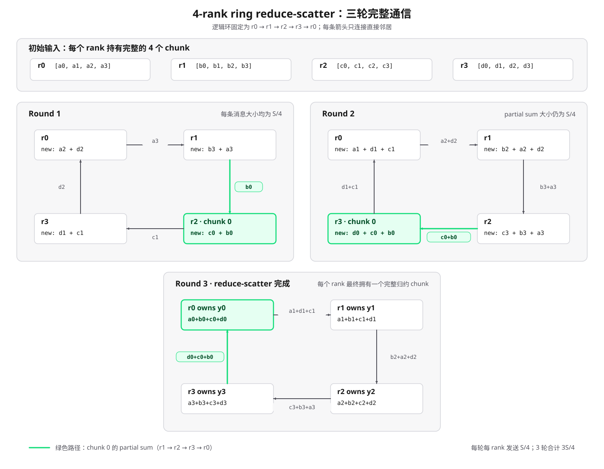

# PyTorch 4 进程 Gloo `all_reduce` 本地实验报告

## 0. 结论摘要

本文复现 handout [`5.1 Single-Node Distributed Communication in PyTorch`](./cs336_assignment2_systems_extracted.md#L1286-L1364) 的 4 进程 `all_reduce` 示例，并使用确定性输入和自动断言补强正确性检查。

本机实验中，rank 0 到 rank 3 的输入依次为 `[2, 7, 9]`、`[6, 9, 5]`、`[8, 0, 5]` 和 `[5, 9, 8]`。执行 Gloo `SUM all_reduce` 后，每个 rank 都得到逐元素总和 `[21, 25, 27]`，且调用前后的 `data_ptr()` 相同，证明 `data` 的底层 storage 没有被替换，结果确实原地写回。

本实验只验证 collective 语义、进程协调和本地执行链路。输入只有 3 个 `int64` 元素，没有预热和重复计时，因此不能用于推断大 Tensor、跨机网络或 NCCL/GPU 的通信性能。

---

## 1. 实验目标与实现

### 1.1 目标

实验需要验证：

1. `mp.spawn` 是否建立了 4 个独立 worker process；
2. 每个 rank 是否持有不同的本地输入；
3. `all_reduce(..., op=SUM)` 是否计算全部输入的逐元素和；
4. 全部 rank 是否得到相同结果；
5. 结果是否写回原 Tensor；
6. 多进程日志顺序是否具有非确定性。

### 1.2 脚本

实验脚本为 [`scripts/distributed_all_reduce_demo.py`](../scripts/distributed_all_reduce_demo.py)。它保留了 handout 的 `mp.spawn + init_process_group + all_reduce` 主链路，并增加了以下工程化处理：

- 每个 rank 使用 `seed + rank` 初始化独立 CPU generator，使输入数值可复现；
- 显式指定 `ReduceOp.SUM`，避免依赖默认值；
- 自动选择当前可用的本地 rendezvous 端口，降低端口冲突概率；
- 每个 worker 只使用 1 个 PyTorch CPU 线程；
- 每个 rank 独立重算期望总和，并用 `torch.equal` 做精确断言；
- 比较调用前后的 `data_ptr()`，验证原地修改；
- 在 `finally` 中销毁 process group；
- 设置 30 秒初始化超时，避免配置错误后无限等待。

输入由纯函数 `make_rank_data` 构造，期望值由 `expected_sum` 独立计算，通信初始化由 `setup_process_group` 负责，worker 逻辑与 CLI 入口彼此分离。

---

## 2. 背景知识

### 2.1 Worker、rank 与 world size

本实验是单机多进程程序。父进程调用 `mp.spawn(..., nprocs=4)` 创建 4 个子进程；PyTorch 将子进程索引作为第一个参数调用目标函数，因此 4 个 worker 的 rank 分别为 0、1、2、3。[2]

| 术语 | 本实验中的含义 |
|---|---|
| node | 一台参与分布式作业的机器；本实验只有 1 台 |
| worker / process | 一个独立 Python 子进程 |
| process group | 共同执行 collective 的进程集合 |
| world | 默认 process group |
| world size | world 中的进程总数，本实验为 4 |
| global rank | worker 在整个 world 中的唯一编号 |
| local rank | worker 在当前 node 内的编号；单机实验中等于 global rank |

rank 是通信身份，不是操作系统 PID。扩展到多机后，global rank 和 local rank 通常不再相同。[3]

### 2.2 Process group 与 rendezvous

`dist.init_process_group` 初始化默认 process group。未显式提供 `store` 或 `init_method` 时，PyTorch 默认使用 `env://`，通过 `MASTER_ADDR`、`MASTER_PORT`、`rank` 和 `world_size` 完成 rendezvous。[4]

本脚本在父进程中选择本地可用端口，再把相同地址和端口传给所有 worker。`MASTER_ADDR` 和 `MASTER_PORT` 用于成员发现及连接初始化，并不意味着归约数据都要经过 rank 0；实际数据路径由通信 backend 和所选算法决定。

### 2.3 Collective 与 point-to-point

`send`/`recv` 指定单一发送方和接收方，属于 point-to-point 通信。collective 要求 process group 内的所有相关 rank 以匹配的顺序共同参与。[5]

| Collective | 输入来自 | 完整结果位于 |
|---|---|---|
| `reduce` | 所有 rank | 指定 root rank |
| `broadcast` | root rank | 所有 rank |
| `all_reduce` | 所有 rank | 所有 rank |
| `all_gather` | 所有 rank | 所有 rank |
| `reduce_scatter` | 所有 rank | 每个 rank 得到归约结果的一部分 |

所有参与 rank 必须以一致顺序调用匹配的 collective，并提供兼容的元素数量和 dtype。否则可能出现报错、数据错误或集体等待。[6]

---

## 3. `all_reduce` 的数学语义

设 process group 中有 $P$ 个 rank，rank $r$ 持有列向量 $x^{(r)}\in\mathbb{Z}^n$。求和 all-reduce 计算：

$$y=\sum_{r=0}^{P-1}x^{(r)}$$

调用完成后，每个 rank 上都满足：

$$x^{(r)}\leftarrow y,\qquad r=0,\ldots,P-1$$

对于本实验的 $P=4,n=3$，结果为：

$$y=\begin{bmatrix}\sum_{r=0}^{3}x^{(r)}_0\\\sum_{r=0}^{3}x^{(r)}_1\\\sum_{r=0}^{3}x^{(r)}_2\end{bmatrix}$$

这里按照仓库约定使用数学列向量；PyTorch 中 shape 为 `(3,)` 的一维 Tensor 没有显式行轴或列轴。

`dist.all_reduce(data, op=dist.ReduceOp.SUM, async_op=False)` 的 `data` 同时是输入和输出。PyTorch API 明确说明，调用后所有进程中的 Tensor 按位相同。[1] 本脚本进一步比较调用前后的 `data.data_ptr()`；指针不变说明不是通过构造新 Tensor 替换变量，而是修改原 Tensor 的 storage。

---

## 4. 同步与输出顺序

### 4.1 CPU/Gloo

本实验使用 `async_op=False`。对于 CPU collective，调用返回后结果可以直接使用，因此脚本可以紧接着检查和打印 `data`。[7]

但 all-reduce 不是通用的日志排序 barrier。它保证的是各 rank 共同完成该 collective 以及结果可用，不保证随后哪个进程先执行 `print`。因此输出顺序不是 0、1、2、3 并不表示执行错误。

### 4.2 异步 collective

若使用 `async_op=True`，调用会立即返回 `Work` handle：

```python
work = dist.all_reduce(data, op=dist.ReduceOp.SUM, async_op=True)
# 这里可以执行不依赖 data 最终值的工作。
work.wait()
print(f"phase=after_all_reduce data={data}")
```

通信重叠只对不依赖归约结果的工作有效。在读取、覆盖或消费 `data` 前，必须建立正确的等待关系。[7]

### 4.3 CUDA/NCCL

CUDA 操作具有异步执行语义。即使 `async_op=False`，NCCL collective 返回通常也只说明工作已经正确入队；测量设备上的真实完成时间需要 CUDA event 或显式 stream/device synchronization。[7][8]

这也是 CPU/Gloo 正确性 demo 与 GPU/NCCL 性能 benchmark 的关键区别。

---

## 5. 本机实验

### 5.1 环境

| 项目 | 实测值 |
|---|---|
| 实验日期 | 2026-09-30 |
| 操作系统 | Linux 5.4.143.bsk.8-amd64 x86_64 |
| CPU | 2 x Intel Xeon Platinum 8336C @ 2.30 GHz |
| CPU 拓扑 | 56 cores，2 sockets，2 NUMA nodes |
| distributed node 数 | 1 |
| Python | 3.13.12 |
| PyTorch | 2.11.0+cu130 |
| `torch.distributed.is_available()` | `True` |
| `dist.is_gloo_available()` | `True` |
| `dist.is_nccl_available()` | `True` |
| `torch.cuda.is_available()` | `False` |
| backend | Gloo |
| world size | 4 |
| Tensor | CPU，shape `(3,)`，dtype `torch.int64` |
| PyTorch CPU threads | 每个 worker 1 个 |
| rendezvous | `127.0.0.1:45139`，端口由脚本自动选择 |

`dist.is_nccl_available() == True` 只表示当前 PyTorch 构建包含 NCCL backend；由于 `torch.cuda.is_available() == False`，本次不能进行 NCCL/CUDA 实验。

### 5.2 运行命令

```bash
uv run python scripts/distributed_all_reduce_demo.py \
  --world-size 4 \
  --vector-size 3 \
  --seed 20260930 \
  --torch-threads 1
```

### 5.3 原始输出

以下是最终记录的一次完整 stdout，保留真实的进程输出顺序；本次 stderr 为空：

```text
experiment_backend=gloo
experiment_world_size=4
experiment_vector_size=3
experiment_seed=20260930
experiment_master_addr=127.0.0.1
experiment_master_port=45139
experiment_torch_threads_per_worker=1
rank=3 phase=before_all_reduce data=[5, 9, 8]
rank=2 phase=before_all_reduce data=[8, 0, 5]
rank=0 phase=before_all_reduce data=[2, 7, 9]
rank=1 phase=before_all_reduce data=[6, 9, 5]
rank=0 phase=after_all_reduce data=[21, 25, 27] expected=[21, 25, 27] correct=True in_place=True
rank=3 phase=after_all_reduce data=[21, 25, 27] expected=[21, 25, 27] correct=True in_place=True
rank=2 phase=after_all_reduce data=[21, 25, 27] expected=[21, 25, 27] correct=True in_place=True
rank=1 phase=after_all_reduce data=[21, 25, 27] expected=[21, 25, 27] correct=True in_place=True
experiment_status=passed
```

进程退出码为 0，没有出现 Gloo、网络接口或端口相关警告。

### 5.4 数值核验

| Rank | `data` before | `data` after | `correct` | `in_place` |
|---:|---|---|---|---|
| 0 | `[2, 7, 9]` | `[21, 25, 27]` | `True` | `True` |
| 1 | `[6, 9, 5]` | `[21, 25, 27]` | `True` | `True` |
| 2 | `[8, 0, 5]` | `[21, 25, 27]` | `True` | `True` |
| 3 | `[5, 9, 8]` | `[21, 25, 27]` | `True` | `True` |

逐元素手工求和为：

$$\begin{bmatrix}2\\7\\9\end{bmatrix}+\begin{bmatrix}6\\9\\5\end{bmatrix}+\begin{bmatrix}8\\0\\5\end{bmatrix}+\begin{bmatrix}5\\9\\8\end{bmatrix}=\begin{bmatrix}21\\25\\27\end{bmatrix}$$

输出满足以下四项条件：

1. rank 0、1、2、3 都分别产生了一条 before 和 after 记录；
2. 所有 after Tensor 完全相同；
3. after 等于 4 个 before Tensor 的逐元素和；
4. 所有 rank 的 `data_ptr()` 在调用前后保持不变。

脚本连续执行两次时，输入数值因确定性 seed 保持不变，但 rank 的打印次序不同。这验证了 handout 脚注所强调的并发输出非确定性，同时不影响 collective 的结果一致性。

---

## 6. Gloo 与 NCCL

| 维度 | Gloo | NCCL |
|---|---|---|
| 推荐场景 | CPU 分布式通信、本地功能验证 | CUDA GPU 分布式训练 |
| 本实验能否使用 | 可以 | 不可以，本机没有可用 CUDA 设备 |
| 计时注意事项 | CPU 同步调用返回后结果可用 | 需要考虑 CUDA stream 的异步执行 |
| 性能目标 | 通用 CPU/网络通信 | 针对 NVIDIA GPU 与互联拓扑优化 |

PyTorch 官方建议 CPU 使用 Gloo、CUDA GPU 使用 NCCL；DDP 在 GPU 上通常采用“一张 GPU 对应一个进程”。[4][9]

从本脚本迁移到单机多 GPU 至少需要：

1. 为每个 rank 绑定不同的 GPU；
2. 把 Tensor 放到对应 CUDA device；
3. 将 backend 改为 NCCL；
4. 使用 CUDA event 或正确的同步边界计时；
5. 保证所有 rank 的 collective 类型、顺序、shape 和 dtype 匹配。

backend 名称不等于固定的 all-reduce 算法。NCCL 可以根据消息大小和硬件拓扑选择 Ring、Tree 等算法，因此不能断言本次 Gloo 调用或未来 NCCL 调用一定采用某一种内部实现。[10]

---

## 7. 与 DDP 梯度同步的联系

设 rank $r$ 在本地 mini-batch 上得到参数梯度列向量 $g^{(r)}$。数据并行训练通常需要平均梯度：

$$g_{\mathrm{avg}}=\frac{1}{P}\sum_{r=0}^{P-1}g^{(r)}$$

最直接的实现是对每个 `.grad` 执行 `SUM all_reduce`，然后除以 world size。PyTorch DDP 在此基础上还负责：[5][9]

1. 初始化时同步模型状态；
2. 为参数注册 autograd hook；
3. 将参数梯度组织成 buckets；
4. bucket 就绪后尽早发起 all-reduce；
5. 尝试让通信与剩余 backward 计算重叠；
6. 在 backward 完成后让各 rank 获得一致的平均梯度。

当各 rank 的本地 batch 大小相等，且本地 loss 都按样本取 mean 时，简单 rank 平均等价于全局 batch mean。若各 rank 的有效样本数或 token 数不同，则需要按全局有效数量加权，不能机械地除以 world size。

---

## 8. 复杂度与可扩展性

All-reduce 的通信开销由底层算法、传输机制（transport）和硬件互联共同决定。其语义规定归约后每个 rank 都持有完整结果；ring、tree 等算法则决定数据如何分块、传输和归约。因此，分析通信复杂度需要分别考察通信阶段数、传输字节数和有效链路带宽。

本节从通信栈与延迟–带宽模型出发，分析 ring all-reduce 的成本、硬件拓扑的影响及其与 DDP 调度的关系。更详细的算法推导、Gloo/PyTorch 源码调用关系、NCCL 调优与 GPUDirect RDMA 介绍见 [`04_02 All-Reduce 底层通信背景`](./04_02_all_reduce_communication_background.md)。

### 8.1 从 PyTorch 调用到底层链路

可以把一次分布式 collective 分成以下层次：

```text
PyTorch Tensor / DDP bucket
        |
        v
ProcessGroupGloo / ProcessGroupNCCL
        |
        v
collective algorithm + chunking/pipeline + protocol
        |
        v
transport: socket / shared-memory path / GPU P2P / RDMA
        |
        v
hardware: host DRAM / PCIe / NVLink / NVSwitch / NIC / network switches
```

各层职责不同：

| 层次 | 解决的问题 |
|---|---|
| API 语义 | 谁提供输入、谁得到结果、使用哪种归约操作 |
| process group/backend | 哪些 rank 参与，以及由 Gloo、NCCL 等哪个 backend 执行 |
| collective 算法 | 数据按 ring、tree、recursive doubling 或分层算法如何流动 |
| protocol/pipeline | Tensor 如何切成 chunk，如何在多条 channel 上流水传输 |
| transport | 数据通过 socket、GPU P2P、RDMA 等哪种机制移动 |
| 硬件拓扑 | 实际经过哪些 PCIe bridge、NVLink、NVSwitch、NIC 和交换机 |

`MASTER_ADDR` 和 `MASTER_PORT` 只负责 rendezvous 和连接初始化，属于控制面；它们不表示所有 Tensor 数据都由 rank 0 中转。当前 CPU/Gloo 实验也没有 profile Gloo 最终选择的 transport，因此只能证明 collective 语义正确，不能从日志反推出具体通信算法或数据路径。

仓库已有的 [`ml-engineering/network/comms.md`](../../../../ml-engineering/network/comms.md#L139-L292) 对 collective 算法、ring all-gather、tree reduce 和 ring reduce-scatter 给出了更完整的逐轮图解。

### 8.2 通用的延迟-带宽模型

设：

- $P$：参与 collective 的 rank 数；
- $S$：每个 rank 输入 Tensor 的 payload 大小，单位为 byte；
- $\alpha$：一个顺序通信阶段的固定延迟，包括软件调度、kernel/通信调用、排队和同步等固定成本；
- $\beta$：传输一个 byte 的时间，即有效带宽的倒数；
- $\gamma$：归约一个 byte 的本地计算成本；
- $K$：关键路径上不能并行隐藏的通信阶段数；
- $V$：关键路径上每个 rank 的有效传输字节数；
- $C$：每个 rank 实际参与归约的字节数。

一个比单纯写成 $S/B$ 更一般的近似是：

$$T_{\mathrm{collective}}\approx K\alpha+V\beta+C\gamma$$

这三个项分别解释：

1. **延迟项 $K\alpha$**：即使 payload 很小，每次 collective 和每轮依赖仍有固定成本；
2. **带宽项 $V\beta$**：消息足够大时，耗时主要由实际数据量和有效带宽决定；
3. **归约计算项 $C\gamma$**：`SUM`、`MAX` 等还需要执行本地归约，不是纯 memcpy。

$K$ 和 $V$ 取决于具体算法，$\alpha,\beta,\gamma$ 又取决于 backend、硬件和运行时状态，所以不能仅凭 API 名称得到唯一耗时。它们也不是硬件规格表上的常数：链路竞争、NUMA、GPU-NIC 亲和性、共享网络负载和消息大小都会改变有效值。

### 8.3 Ring all-reduce 为什么分成两阶段

对经典 ring all-reduce，先把每个 rank 的输入等分成 $P$ 个 chunk，每个 chunk 大小约为 $S/P$ byte。这里先采用“大消息且归约元素数能够被 $P$ 整除”的理想条件；真实实现还需要处理尾部、不均匀 chunk、对齐、channel 划分和更细的 slice。整个过程由两个阶段组成：

| 阶段 | 轮数 | 每轮每 rank 发送量 | 每 rank 累计发送量 | 阶段结束状态 |
|---|---:|---:|---:|---|
| ring reduce-scatter | $P-1$ | $S/P$ | $\frac{P-1}{P}S$ | 每个 rank 拥有一个归约完成的 chunk |
| ring all-gather | $P-1$ | $S/P$ | $\frac{P-1}{P}S$ | 每个 rank 收齐全部归约 chunk |

#### 8.3.1 4-rank reduce-scatter：从逐轮通信推导发送量

以下先只讨论 reduce-scatter，不涉及后续 all-gather。假设每个 rank 的 $S$ byte 输入可以等分为 4 个大小为 $S/4$ 的 chunk，并约定逻辑环方向为：

```text
r0 -> r1 -> r2 -> r3 -> r0
```

因此，`r0` 的直接右邻居是 `r1`，直接左邻居是 `r3`；其他 rank 也按同一方向各有一个固定的发送邻居和接收邻居。设初始输入为：

```text
r0: [a0, a1, a2, a3]
r1: [b0, b1, b2, b3]
r2: [c0, c1, c2, c3]
r3: [d0, d1, d2, d3]
```

每轮中，4 个 rank 同时向直接右邻居发送一个 chunk，并把直接左邻居发来的同编号 partial chunk 与本地贡献逐元素相加。完整三轮如下图所示：



*图：每个面板包含该轮的四条直接邻居传输和接收归约后的状态。绿色路径追踪 chunk 0：$b_0$ 从 `r1` 到 `r2`，$b_0+c_0$ 从 `r2` 到 `r3`，$b_0+c_0+d_0$ 再从 `r3` 到 `r0`。*

对应的发送内容为：

| 轮次 | `r0 -> r1` | `r1 -> r2` | `r2 -> r3` | `r3 -> r0` |
|---:|---|---|---|---|
| 1 | $a_3$ | $b_0$ | $c_1$ | $d_2$ |
| 2 | $a_2+d_2$ | $b_3+a_3$ | $c_0+b_0$ | $d_1+c_1$ |
| 3 | $a_1+d_1+c_1$ | $b_2+a_2+d_2$ | $c_3+b_3+a_3$ | $d_0+c_0+b_0$ |

第三轮结束后，4 个 rank 分别得到一个完整归约 chunk：

```text
r0: y0 = a0 + b0 + c0 + d0
r1: y1 = a1 + b1 + c1 + d1
r2: y2 = a2 + b2 + c2 + d2
r3: y3 = a3 + b3 + c3 + d3
```

这里必须区分**数据的原始来源**与**当前一跳的直接发送者**。例如，$c_0$ 最初属于 `r2`，但它不会从 `r2` 直接发送给 `r0`。chunk 0 的实际路径是：

```text
r1 --b0--> r2 --(b0+c0)--> r3 --(b0+c0+d0)--> r0
```

因此，$c_0$ 到达 `r0` 时包含在 `r3` 发出的 partial chunk 中；`r0` 的直接发送者仍然是左邻居 `r3`。`r0` 也不是先单独接收 $d_0$，再单独接收 $c_0$，而是在第三轮一次性收到 $b_0+c_0+d_0$，随后加入本地的 $a_0$。

partial chunk 聚合的来源逐轮增加，但它的形状和字节数不变。若第 $j$ 个 chunk 是列向量 $x_j^{(r)}\in\mathbb{R}^{n/4}$，那么部分和 $\sum_r x_j^{(r)}$ 仍属于 $\mathbb{R}^{n/4}$。归约是逐元素相加，不是沿某个维度拼接；因此，$b_0+c_0+d_0$ 与单独的 $b_0$ 都只占 $S/4$ byte。

从任意一个 rank 看，三轮中每轮恰好发送一个 $S/4$ chunk。例如，`r0` 依次发送 $a_3$、$a_2+d_2$ 和 $a_1+d_1+c_1$，所以发送量为：

$$V_{\mathrm{reduce\text{-}scatter,send}}=3\times\frac{S}{4}=\frac{3}{4}S$$

推广到 $P$ 个 rank，reduce-scatter 需要 $P-1$ 轮，每轮每个 rank 发送 $S/P$，因此：

$$V_{\mathrm{reduce\text{-}scatter,send}}=(P-1)\times\frac{S}{P}=\frac{P-1}{P}S$$

同一阶段中，每个 rank 的接收量也为 $\frac{P-1}{P}S$；这里讨论的“发送量”不把接收量再次相加。

#### 8.3.2 从 reduce-scatter 扩展到完整 ring all-reduce

只有在后续讨论完整 ring all-reduce 时，才需要再加入 all-gather 的发送量。all-gather 同样发送 $\frac{P-1}{P}S$，因此两个阶段合计为：

$$V_{\mathrm{ring}}=2\frac{P-1}{P}S$$

累计接收量与累计发送量相同。如果统计“发送 + 接收”的端点总字节数，还需要再乘 2；但 `nccl-tests` 的 all-reduce `busbw` 修正因子使用的是上面的单向发送口径。[11]

忽略归约计算、链路竞争以及 chunk pipeline 的启动/排空细节，ring 模型为：

$$T_{\mathrm{ring}}\approx 2(P-1)\alpha+2\frac{P-1}{P}\frac{S}{B}$$

其中 $B=1/\beta$ 是每个 rank 在所考虑链路上的有效单向带宽。这个式子与 handout 后续第 8.1 节的理想化推导一致：ring all-gather 和 ring reduce-scatter 各需要 $\frac{P-1}{P}\frac{S}{B}$ 秒，合起来是两倍。[Handout：L1601-L1622](./cs336_assignment2_systems_extracted.md#L1601-L1622)

### 8.4 理想 ring 模型与当前 Gloo 实验的边界

第 8.3.1 节的逐轮示意图采用理想 ring reduce-scatter：输入元素数可以被 rank 数整除，并且通信路径已明确指定为 ring。当前本地实验则只有 3 个 `int64` 元素，无法字面切分成 4 个等长 chunk；它也只记录了 Gloo backend、输入输出和正确性，没有采集足以确认实际 collective 算法的运行时证据。

若仅把当前 payload 大小 $S=3\times8=24$ byte 代入理想公式，reduce-scatter 的每 rank 发送量为 $\frac{3}{4}S=18$ byte，完整 ring all-reduce 的发送量为 $2\times\frac{3}{4}S=36$ byte。这两个数是连续大消息模型下的归一化估算，不是本次 Gloo 调用的真实 packet 或 chunk trace。对于这种极小 Tensor，尾部处理、线程调度和固定启动成本远比 payload 本身更重要。

### 8.5 为什么实现不会永远选择 ring

ring 的优点是没有单一 root 瓶颈，各 rank 可以同时发送和接收，处理大消息时容易获得较好的稳态带宽；缺点是需要 $2(P-1)$ 个顺序阶段，rank 数增大后延迟项线性增长。

| 算法思路 | 典型轮数 | 主要优势 | 主要限制 |
|---|---:|---|---|
| 朴素 reduce + broadcast | 取决于线性或树形实现 | 容易理解和实现 | 线性版本会让 root 成为瓶颈 |
| ring reduce-scatter + all-gather | $2(P-1)$ | 链路负载均衡，适合大消息 | 小消息或大量 rank 时固定延迟明显 |
| tree reduce + broadcast | 约 $2\lceil\log_2P\rceil$ | 关键路径短，常适合延迟敏感场景 | 多跳、拓扑映射和流水策略更复杂 |
| recursive doubling | $\log_2P$ | 阶段最少，适合很小消息 | 每轮交换完整 accumulator，发送量随 $\log P$ 增长 |
| recursive halving + doubling | $2\log_2P$ | 对数阶段且发送量为 $2(P-1)S/P$ | 伙伴映射和非 2 的幂处理更复杂 |
| hierarchical | 节点内与节点间分别执行 | 可以匹配 NVLink 与 NIC 的分层带宽 | 调度、分块和拓扑建模更复杂 |
| in-network reduction | 由交换网络参与归约 | 减少端点流量与拥塞 | 依赖 SHARP、NVLS 等专用硬件能力 |

真实 NCCL 可以在 Ring、Tree、NVLS 等算法之间选择；算法内部还会继续选择协议、channel 数和 chunk 大小。[10] 因此：

- “all-reduce 可以用 ring 实现”是正确的；
- “这次 `dist.all_reduce` 一定执行了 ring”没有证据；
- backend、算法、protocol 和 transport 是四个不同层次，不能混为一谈。

仓库中的 [`ml-engineering/network/comms.md`](../../../../ml-engineering/network/comms.md#L184-L292) 进一步比较了 linear/tree、ring、recursive doubling 和 reduce-scatter；[`ml-engineering/network/benchmarks/README.md`](../../../../ml-engineering/network/benchmarks/README.md#L155-L176) 则说明 NCCL 如何基于 latency/bandwidth 模型选择算法。

### 8.6 节点内与节点间不是同一条路径

不同部署形态下，collective 的实际数据路径差异很大：

| 场景 | 可能的数据路径 | 主要约束 |
|---|---|---|
| 当前单机 CPU/Gloo | host DRAM、Gloo transport、操作系统网络/进程间路径 | CPU 调度、内存带宽、socket/transport 延迟 |
| 单机多 GPU | GPU HBM、PCIe P2P、NVLink、NVSwitch | GPU 拓扑、P2P 能力、PCIe bridge、channel 并行度 |
| 多机 GPU | GPU HBM、PCIe/NVLink、NIC、交换网络、远端 NIC/GPU | GPUDirect RDMA、NIC 带宽、路由、拥塞、跨 rack 跳数 |

多机通信还需要关注：

- **bisection bandwidth**：把参与节点分成两半后，跨越切面的总可用带宽；
- **GPU-NIC affinity**：GPU 是否靠近实际使用的 NIC，是否跨 NUMA 或 PCIe root complex；
- **oversubscription**：上行链路是否被多台机器共享；
- **routing 与拥塞**：不同 ring/channel 是否竞争同一条 rail 或交换机链路；
- **慢 rank**：collective 的完成时间由最慢参与者和最拥塞路径决定；
- **host staging**：无法使用 GPU P2P 或 GPUDirect RDMA 时，数据可能需要经 host memory 中转。

仓库已有 [`ml-engineering/network/README.md`](../../../../ml-engineering/network/README.md#L40-L95) 解释单向/双向带宽、后端网络与 RDMA，并在[分布式训练部分](../../../../ml-engineering/network/README.md#L418-L502) 讨论 NVLink/NVSwitch、节点间网络、拓扑、共享网络和不同并行策略的网络敏感性。

### 8.7 `algbw` 与 `busbw` 不是同一个指标

假设一次 all-reduce 的 payload 为 $S$ byte，实测耗时为 $t$，`nccl-tests` 定义的算法带宽为：

$$\operatorname{algbw}=\frac{S}{t}$$

对 all-reduce，再用通信模式修正得到归一化 bus bandwidth：

$$\operatorname{busbw}=\operatorname{algbw}\times 2\frac{P-1}{P}$$

`algbw` 回答“从 API payload 角度每秒完成多少数据”，`busbw` 用 collective 特有的通信因子帮助横向比较底层链路利用率。[11] 它不是把所有物理链路上的每一个 byte 简单求和，也不能直接和厂商的双向聚合带宽混用。

比较带宽时必须统一：

- `GB/s` 与 `Gb/s`，二者相差 8 倍；
- 单向与 full-duplex 双向口径；
- payload 大小和 dtype；
- 节点内与节点间；
- rank 数、每节点 GPU 数和拓扑；
- `algbw` 与 `busbw`；
- 十进制 GB 与二进制 GiB。

仓库的 [`all_reduce_bench.py`](../../../../ml-engineering/network/benchmarks/all_reduce_bench.py) 已实现与 `nccl-tests` 一致的修正因子；配套说明和样例曲线位于 [`network/benchmarks/README.md`](../../../../ml-engineering/network/benchmarks/README.md#L1-L67)。

### 8.8 DDP 中总通信量不等于暴露在 step 上的时间

若完整模型梯度大小为 $G$ byte，经典 ring all-reduce 每个 rank 的累计发送量为：

$$V_{\mathrm{DDP}}\approx 2\frac{P-1}{P}G$$

当 $P$ 很大时，它趋近 $2G$。这就是“DDP 每 step 的梯度通信量约为模型梯度大小两倍”这一常见说法的来源；它是 ring 的单向发送口径，不是说每个 rank 直接向其他所有 rank 各发送两份完整梯度。仓库中的 [`megatron/megatron.md`](../../../../megatron/megatron.md#L130-L145) 和 [`model-parallelism/README.md`](../../../../ml-engineering/training/model-parallelism/README.md#L571-L604) 已从训练视角给出相同推导。

DDP 会把参数梯度组织成 buckets。bucket 大小存在真实取舍：

- bucket 较小：更早就绪，更容易与 backward 重叠，但 collective 次数更多，累计延迟 $K\alpha$ 增大；
- bucket 较大：调用次数少、带宽利用率可能更高，但必须等待更多梯度就绪，通信启动更晚，可重叠窗口缩短。

若一次通信需要 $T_{\mathrm{comm}}$，可用于隐藏它的计算窗口为 $T_{\mathrm{window}}$，暴露在关键路径上的通信至少约为：

$$T_{\mathrm{exposed}}\approx\max(0,T_{\mathrm{comm}}-T_{\mathrm{window}})$$

所以“通信量没有变化”不等于“step time 没有优化”：异步 bucket all-reduce 可以改变通信是否位于关键路径。反过来，网络太慢、bucket 不合适或 backward 计算太少时，通信无法被完全隐藏。

梯度累积也会改变调用次数。若一个 optimizer update 包含 $A$ 个 microbatch，不使用 `no_sync()` 会触发 $A$ 轮同步；正确使用 `no_sync()` 后只在窗口末同步一次。仓库的 [`02_04_gradient_accumulation_guide.md`](./02_04_gradient_accumulation_guide.md#L681-L700) 解释了正确同步边界，并在[复杂度分析](./02_04_gradient_accumulation_guide.md#L923-L934) 对比了 $O(AG)$ 与 $O(G)$ 的通信量级。

### 8.9 All-reduce、reduce-scatter 与分片训练

如果每个 rank 最终都需要完整梯度，all-reduce 很自然；如果每个 rank 只负责一个梯度或参数分片，再把完整结果复制到所有 rank 就是多余的。

因此 ZeRO/FSDP 常使用：

1. `reduce-scatter`：归约梯度，并让每个 rank 只保留负责的分片；
2. `all-gather`：在 forward/backward 真正需要完整参数时临时收集分片；
3. prefetch/overlap：尽量让下一层参数通信与当前层计算重叠。

这并不意味着 reduce-scatter 在任何口径下都比 all-reduce “少一半时间”；它改变了最终数据布局，并避免每个 rank 常驻完整归约结果，但完整训练还要考虑随后发生的参数 all-gather。不同方案应按一个 training step 的全部 collective 统计，而不是只比较单个 API。仓库的 [`model-parallelism/README.md`](../../../../ml-engineering/training/model-parallelism/README.md#L571-L609) 对 DDP、ZeRO/FSDP、TP、PP 和 SP 的 collective 与通信量做了统一比较。

### 8.10 如何做可信的 all-reduce benchmark

正式测量至少应做到：

1. 把 process group 初始化、Tensor 分配和第一次 lazy initialization 排除在计时区间外；
2. 使用多次 warmup，再记录多轮独立样本；
3. GPU/NCCL 使用 CUDA event 或正确的 device/stream synchronization；
4. 在所有 rank 收集耗时，至少报告最慢 rank；collective 的端到端关键路径不能只看最快 rank；
5. 扫描多种 payload，而不是只测一个大小；
6. payload 应接近真实 DDP bucket、FSDP shard 或 TP activation 的大小；
7. 分开测量节点内与节点间，并记录 GPU/NIC 拓扑、rank 放置和网络接口；
8. 同时报告 latency、`algbw`、`busbw`、均值/中位数、离散程度和异常值；
9. 固定或记录共享网络负载、CPU affinity、NUMA、NCCL 环境变量和软件版本；
10. 正确性校验放在计时区间外，避免把验证成本混入通信时间。

同样总字节数下，一次大 all-reduce 通常比大量小 all-reduce 更快，因为后者重复支付 $\alpha$。仓库中的 [`all_reduce_latency_comp.py`](../../../../ml-engineering/network/benchmarks/all_reduce_latency_comp.py) 专门比较“一次 4GB”与“1000 次 4MB”；[`network/benchmarks/README.md`](../../../../ml-engineering/network/benchmarks/README.md#L65-L73) 还强调了共享网络负载和可复现性。

### 8.11 仓库内已有相关材料

| 文档 | 与本节的关系 |
|---|---|
| [`04_02 All-Reduce 底层通信背景`](./04_02_all_reduce_communication_background.md) | 本节的深入版：算法推导、Gloo/NCCL 源码证据、硬件路径、DDP/FSDP 与 benchmark |
| [`ml-engineering/network/comms.md`](../../../../ml-engineering/network/comms.md#L139-L292) | collective 算法、ring、tree、recursive doubling、reduce-scatter 的逐轮图解 |
| [`ml-engineering/network/README.md`](../../../../ml-engineering/network/README.md#L40-L95) | 单/双向带宽、后端网络、RDMA、节点内与节点间互联 |
| [`ml-engineering/network/README.md`](../../../../ml-engineering/network/README.md#L418-L502) | 通信计算重叠、拓扑、共享网络、并行策略与 collective |
| [`ml-engineering/network/benchmarks/README.md`](../../../../ml-engineering/network/benchmarks/README.md#L1-L73) | all-reduce benchmark、`algbw`/`busbw`、payload 扫描和延迟实验 |
| [`ml-engineering/training/model-parallelism/README.md`](../../../../ml-engineering/training/model-parallelism/README.md#L571-L609) | DDP、ZeRO/FSDP、TP、PP、SP 的通信量比较 |
| [`megatron/megatron.md`](../../../../megatron/megatron.md#L130-L145) | 数据并行梯度规模与每 GPU ring all-reduce 流量推导 |
| [本 assignment handout：L1601-L1622](./cs336_assignment2_systems_extracted.md#L1601-L1622) | ring all-gather、ring reduce-scatter 与 ring all-reduce 的课程推导 |
| [`02_04_gradient_accumulation_guide.md`](./02_04_gradient_accumulation_guide.md#L681-L700) | DDP `no_sync()`、同步次数和通信复杂度 |

本实验的消息只有 `3 * sizeof(int64) = 24` byte，总运行时间又包含 Python 进程创建和 process group 初始化，因此仍然不能作为带宽测试。它的作用是验证语义；底层算法和性能必须通过单独的 profile/benchmark 识别。

---

## 9. 常见故障

| 现象 | 优先检查 |
|---|---|
| `Address already in use` | rendezvous 端口是否被占用 |
| 初始化或 collective 一直等待 | 是否缺少 rank，或 world size 配置不一致 |
| 部分 rank 卡住 | collective 类型、数量和调用顺序是否一致 |
| 输出顺序每次不同 | 正常的多进程调度现象，不是错误 |
| after 相同但数值错误 | 是否完整收集 before 值，归约 op 是否正确 |
| NCCL 报 device 错误 | 每个 rank 是否绑定独占 GPU，Tensor 是否位于 CUDA device |
| 退出时挂起 | 是否在所有 rank 上销毁 process group |

排查 collective hang 时，应优先比较所有 rank 的控制流。分布式程序常见问题不是局部算术表达式错误，而是某个 rank 少调用、多调用或以不同顺序调用 collective。

---

## 10. 结论

本次本地实验成功复现了 handout 第 5.1 节的核心行为：4 个独立 worker 通过 Gloo process group 共同执行 `SUM all_reduce`，每个 rank 的输入 Tensor 都被原地改写为 `[21, 25, 27]`。脚本不仅检查了跨 rank 结果一致，还独立验证了真实逐元素和以及 storage 指针不变。

实验同时说明，collective 的结果一致性与多进程日志顺序是两个不同问题；输出乱序不影响通信正确性。该示例可以作为后续 naive DDP 梯度同步的最小语义基础，但不能替代 handout 后续要求的多 GPU、不同消息规模和 NCCL 性能实验。

## 11. 一手资料

1. [PyTorch 2.11 `torch.distributed.all_reduce` API](https://docs.pytorch.org/docs/2.11/distributed.html#torch.distributed.all_reduce)
2. [PyTorch 2.11 `torch.multiprocessing.spawn`](https://docs.pytorch.org/docs/2.11/multiprocessing.html#torch.multiprocessing.spawn)
3. [PyTorch 2.11 `torchrun` definitions](https://docs.pytorch.org/docs/2.11/elastic/run.html#definitions)
4. [PyTorch 2.11 distributed：初始化、backend 与 shutdown](https://docs.pytorch.org/docs/2.11/distributed.html)
5. [PyTorch 官方教程：Writing Distributed Applications](https://docs.pytorch.org/tutorials/intermediate/dist_tuto.html)
6. [NVIDIA NCCL User Guide：Collective Operations](https://docs.nvidia.com/deeplearning/nccl/user-guide/docs/usage/collectives.html)
7. [PyTorch 2.11：Synchronous and asynchronous collective operations](https://docs.pytorch.org/docs/2.11/distributed.html#synchronous-and-asynchronous-collective-operations)
8. [NVIDIA NCCL User Guide：CUDA Stream Semantics](https://docs.nvidia.com/deeplearning/nccl/user-guide/docs/usage/streams.html)
9. [PyTorch 2.11 `DistributedDataParallel`](https://docs.pytorch.org/docs/2.11/generated/torch.nn.parallel.DistributedDataParallel.html)
10. [NVIDIA NCCL User Guide：`NCCL_ALGO`](https://docs.nvidia.com/deeplearning/nccl/user-guide/docs/env.html#nccl-algo)
11. [NVIDIA `nccl-tests`：collective bandwidth 计算](https://github.com/NVIDIA/nccl-tests/blob/master/doc/PERFORMANCE.md)
