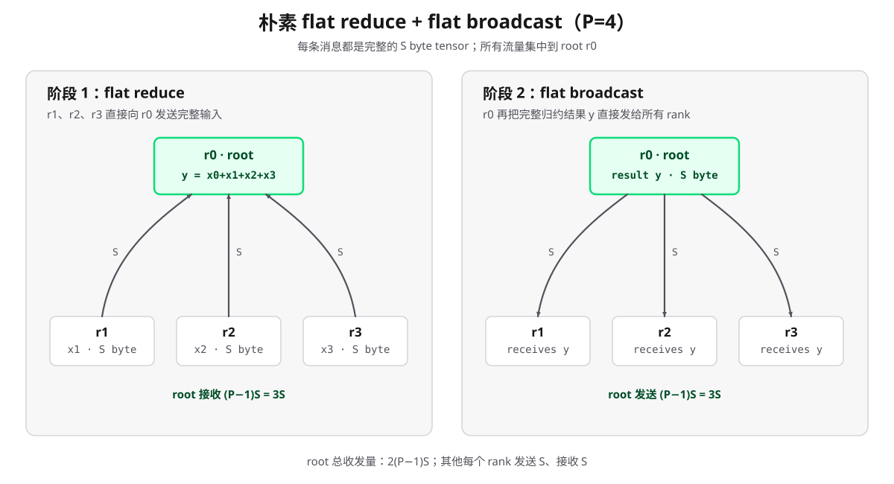
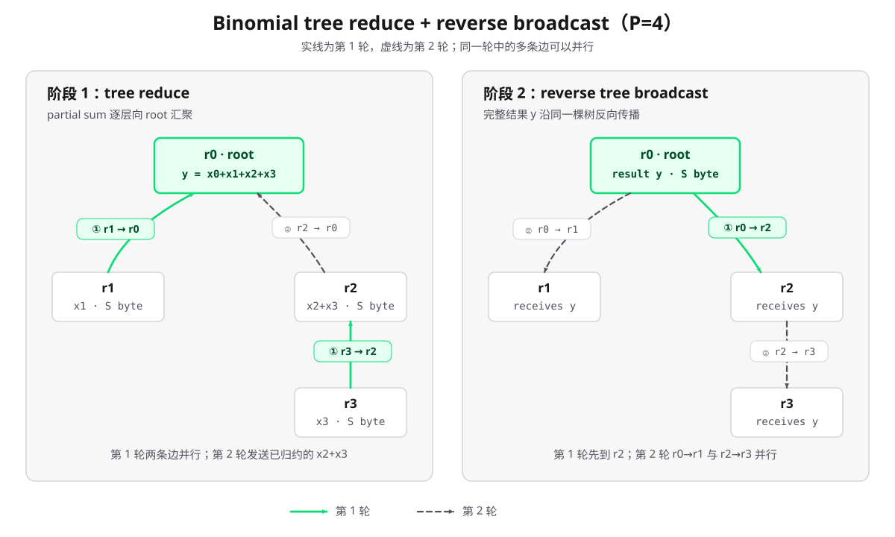
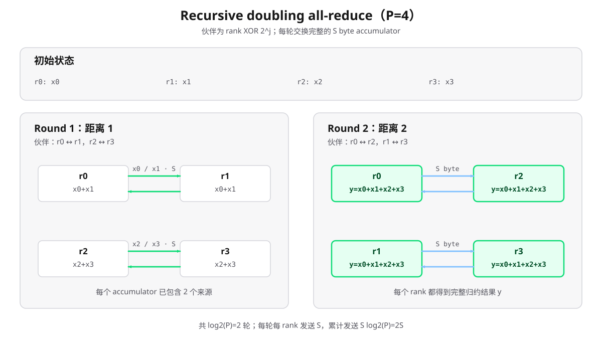
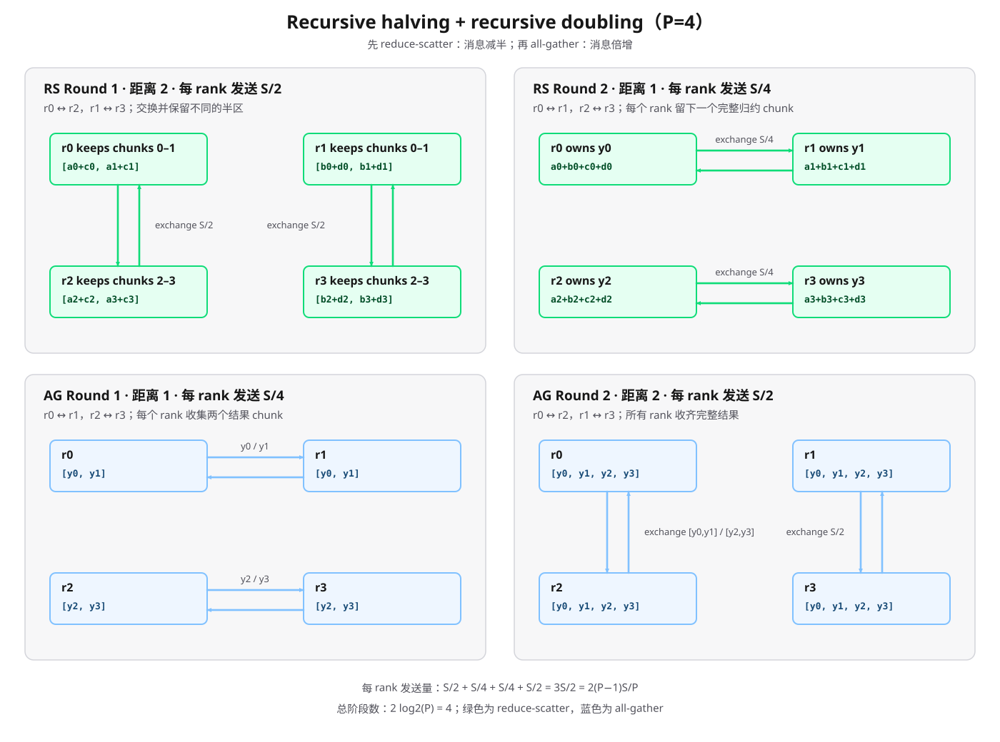

# All-Reduce 底层通信背景：从 Collective 语义到硬件链路与 Benchmark

## 0. 先给结论

1. **`all-reduce` 是通信语义，不是某一种固定算法。** 它要求所有 rank 提供同形状、同类型的数据，执行同一种归约，并让所有 rank 得到归约结果。`reduce + broadcast` 与 `reduce-scatter + all-gather` 都能实现该语义，但不代表库一定真的发起这两个独立 collective。[1][2]
2. **算法比较必须同时看阶段数和流量。** 小消息通常由启动延迟主导，偏好 $O(\log P)$ 阶段的 recursive doubling 或 tree；大消息通常由字节量和链路利用率主导，ring 以 $2(P-1)$ 个阶段换取每 rank 仅发送 $2(P-1)S/P$ 字节。
3. **`algbw` 与 `busbw` 不是同一个量。** `nccl-tests` 定义 $\mathrm{algbw}=S/t$；对 all-reduce 再乘 $2(P-1)/P$ 得到归一化 `busbw`。后者便于对照通信硬件，但不是对某一条 PCIe、NVLink 或 NIC 链路的直接测量。[5]
4. **逻辑算法必须映射到真实拓扑。** 单机可能经过 GPU P2P、NVLink、PCIe、host shared memory 和 NUMA；多机还要经过 GPU 到 NIC 的 PCIe 路径、InfiniBand/RoCE RDMA 或 TCP socket。最慢链路、共享上行和并发流量都可能成为瓶颈。[6][7]
5. **Gloo 或 NCCL 只是 backend 名称，不足以证明内部算法。** NCCL 默认会根据拓扑、体系结构、消息规模和性能模型选择算法/协议；Gloo 源码也包含多种 all-reduce 实现。前一篇 `04_01` 的本地 Gloo demo 只证明了 collective 结果，**没有通过日志、trace 或与实际二进制严格匹配的源码证据证明其内部算法**。
6. **训练中的优化对象是“暴露在关键路径上的通信”，而不只是 microbenchmark 带宽。** DDP 用 bucket 减少小 collective 并尝试与 backward 重叠；FSDP 则用参数 all-gather 和梯度 reduce-scatter 改变数据驻留方式与通信语义。[12][14][15]

本文只建立分析框架和可复现的测量方法，不报告或暗示任何本机、GPU 集群或网络的实测性能。

---

## 1. Collective 语义与实现分层

### 1.1 `all-reduce` 的数学语义

设 process group 有 $P$ 个 rank，rank $r$ 持有列向量 $x^{(r)}\in\mathbb{R}^{n}$，归约算子为逐元素的 $\oplus$。All-reduce 的抽象结果为：

$$y=x^{(0)}\oplus x^{(1)}\oplus\cdots\oplus x^{(P-1)}$$

完成后，每个 rank 都得到同一个结果：

$$x^{(r)}\leftarrow y,\qquad r=0,\ldots,P-1$$

求和时，$\oplus=+$。MPI 标准将 `MPI_Allreduce` 定义为与 `MPI_Reduce` 相同的归约，但结果出现在组内所有进程的接收缓冲区；NCCL 也给出相同语义。[1][2]

这里按本仓库约定把数学向量写成列向量。PyTorch 中 shape 为 `(n,)` 的一维 Tensor 本身没有显式行、列轴，这与数学记号并不冲突。

实际浮点求和不满足严格结合律。不同 ring 顺序、树形括号结构或分块方式可能产生末位差异，所以“满足同一数学语义”不等于“不同算法相对某个串行基准逐 bit 相同”。

### 1.2 两种等价分解不等于两次 API 调用

NCCL 官方文档明确给出：[2]

- `Reduce` 后接 `Broadcast` 等价于 `AllReduce`；
- `ReduceScatter` 后接 `AllGather` 也等价于 `AllReduce`。

第一种分解先把完整结果归约到 root，再传播完整结果。第二种分解先让每个 rank 只拥有最终结果的一个分片，再交换这些分片。后一种分解天然适合让数据和链路并行工作，是经典 ring all-reduce 和 Rabenseifner 类算法的基础。

这里的“等价”是**输入输出语义等价**。实现可以融合分块、归约、转发和同步，不必真的调用公开的 `reduce()`、`broadcast()`、`reduce_scatter()` 或 `all_gather()` API。MPI 标准也专门提醒，实现成 reduce 再 broadcast 是可行方案，但直接实现可能更快。[1]

### 1.3 从训练代码到电信号的五层视图

| 层次 | 例子 | 决定的问题 |
|---|---|---|
| 工作负载层 | DDP gradient bucket、FSDP parameter shard | 何时通信、通信多少、结果是否需要复制到所有 rank |
| Collective API 层 | `all_reduce`、`reduce_scatter_tensor` | 输入输出语义、process group、同步接口 |
| Collective 算法层 | ring、recursive doubling、tree | rank 间依赖关系、阶段数、每阶段分块与流量 |
| 传输层 | CUDA P2P、SHM、IB verbs、RoCE、TCP socket | 数据如何在一对端点间移动 |
| 物理拓扑层 | NVLink/NVSwitch、PCIe switch/root complex、NIC、ToR switch | 可用带宽、跳数、共享链路和拥塞位置 |

“调用了 Gloo/NCCL”只确定了 backend；“使用 IB/RDMA”只确定了部分传输路径；“使用 ring”只确定了 collective 的逻辑通信图。三者不能互相替代。

---

## 2. $\alpha$-$\beta$ 模型：先定义口径

经典 Hockney 模型把发送 $m$ 字节消息的时间写成：

$$T_{\mathrm{msg}}(m)=\alpha+\beta m$$

其中：

- $\alpha$ 是每次依赖阶段的固定成本，可包含软件调度、kernel launch、协议握手和链路启动延迟；
- $\beta$ 是每字节传输时间，即有效带宽的倒数；
- $1/\beta$ 是模型中的有效单向带宽，不应直接等同于设备宣传页上的原始线速。

若算法有 $K$ 个串行依赖阶段，关键路径累计发送 $V$ 字节，则常用近似为：

$$T\approx K\alpha+\beta V$$

归约本身还需要读写内存和算术。需要更精细时可增加每字节归约成本 $\gamma$，但本文的主表保持 $\alpha$-$\beta$ 口径。Thakur、Rabenseifner 与 Gropp 的经典 MPICH 论文正是用 $\alpha+n\beta$，并另设 $\gamma$ 分析归约计算；论文同时强调短消息要减少延迟项，长消息要减少带宽项。[3]

该模型的假设很强：

1. 各通信对可按理想方式并发；
2. 节点近似 one-port，即同一时刻至多有一个主要发送和一个主要接收；
3. 链路双向通信可并行；
4. 忽略 packet header、分块填充、内存复制、GPU kernel、cache、拥塞和慢 rank；
5. $K$ 表示有因果依赖的算法阶段，不是网络 packet 数，也不一定等于 profiler 中的 kernel 数。

因此它适合解释趋势和下界，不是生产集群的精确预测器。

---

## 3. 主要 All-Reduce 算法

以下先假设归约操作可结合、可交换，$P=2^m$，每个 rank 的逻辑输入大小为 $S$ 字节，并把“每 rank bytes”默认记为**发送量**；对这些对称算法，接收量与发送量同阶。非 2 的幂、非整除分块和多通道实现会增加边界处理。

### 3.1 朴素 `reduce + broadcast`

最直观的实现是让 $P-1$ 个非 root rank 把完整的 $S$ 字节发给 root，root 逐一归约，再把完整结果逐一发回。

在 one-port、root 串行处理的朴素模型下：

$$T_{\mathrm{flat}}\approx 2(P-1)(\alpha+\beta S)$$

root 的发送量和接收量各为 $(P-1)S$，其他 rank 各发送、接收 $S$。问题不在语义，而在 root 的注入/接收带宽和计算成为集中瓶颈。



*图：flat reduce 中，三个非 root rank 各向 `r0` 发送完整的 $S$ byte 输入；flat broadcast 再由 `r0` 向三个 rank 各发送完整结果。星形 fan-in 与 fan-out 都集中在 root。*

若 reduce 与 broadcast 各自改用树，阶段数可以下降；所以“reduce + broadcast”本身不是完整的性能描述，必须继续说明各阶段采用什么算法。

### 3.2 Binomial tree：减少阶段数

树形 reduce 每轮让已归约子树的规模翻倍，约 $\log_2P$ 轮到达 root；反向 broadcast 再用约 $\log_2P$ 轮传播结果：

$$T_{\mathrm{tree}}\approx 2\log_2P(\alpha+\beta S)$$



*图：$P=4$ 时，reduce 第 1 轮并行执行 `r1 -> r0` 和 `r3 -> r2`，第 2 轮执行 `r2 -> r0`；broadcast 沿同一棵树反向传播。实线和虚线分别表示第 1、2 轮。*

它把朴素 root 方案的线性阶段数降为对数，但每个活跃边仍传完整消息。具体 rank 的发送量不均匀，最忙 rank 在 binomial-tree 模型中可发送约 $S\log_2P$、接收约 $S\log_2P$。对大消息，未经分段流水的简单树并不具备 ring 的最小 per-rank 字节量。

NCCL 的 Tree 不能简单理解成这张朴素单树公式。NCCL 2.4 引入的 double binary trees 使用两棵角色互补的树各处理一半数据，使 rank 不会同时成为两棵树的内部节点；NVIDIA 的说明将其目标概括为接近 ring 的满带宽，同时保留对数级延迟，并在 ring 更有带宽优势时自动切回 ring。[4]

### 3.3 Recursive doubling：短消息的低阶段数方案

Recursive doubling 是 butterfly/hypercube 交换，不是“先归约到固定 root，再广播”的同义词。它没有固定 root；每个 rank 在每一轮都同时发送、接收和归约，最后所有 rank 直接得到完整结果。

先从 $P=4$ 的具体例子开始。4 是 $2^2$，所以每个 rank 可以用 2 位二进制数表示：

| Rank | 十进制编号 | 二进制编号 |
|---|---:|---:|
| `r0` | 0 | `00` |
| `r1` | 1 | `01` |
| `r2` | 2 | `10` |
| `r3` | 3 | `11` |

Recursive doubling 每轮只翻转 rank 二进制编号中的一位。自然语言中的“第 1 轮”对应程序下标 $j=0$，翻转最低位；“第 2 轮”对应 $j=1$，翻转次低位。

这里的 XOR 是按位异或：两个 bit 不同时结果为 1，相同时结果为 0。由于 $2^j$ 的二进制表示只有第 $j$ 位为 1，$r\mathbin{\operatorname{xor}}2^j$ 的效果就是只翻转 $r$ 的第 $j$ 位，其余位保持不变。

第 1 轮使用掩码 $2^0=1$，即二进制 `01`：

```text
00 XOR 01 = 01    -> r0 与 r1 配对
10 XOR 01 = 11    -> r2 与 r3 配对
```

第 2 轮使用掩码 $2^1=2$，即二进制 `10`：

```text
00 XOR 10 = 10    -> r0 与 r2 配对
01 XOR 10 = 11    -> r1 与 r3 配对
```

每一对伙伴会相互指向。例如，`00 XOR 01 = 01`，再次计算 `01 XOR 01 = 00`，所以 `r0` 选择 `r1` 的同时，`r1` 也会选择 `r0`。下表只列一次每对双向关系：

| 轮次 | 程序下标 | XOR 掩码 | 伙伴关系 | 交换归约后的状态 |
|---:|---:|---:|---|---|
| 1 | $j=0$ | `01` | `r0 <-> r1`，`r2 <-> r3` | `r0,r1` 持有 $x_0+x_1$；`r2,r3` 持有 $x_2+x_3$ |
| 2 | $j=1$ | `10` | `r0 <-> r2`，`r1 <-> r3` | 所有 rank 持有 $y=x_0+x_1+x_2+x_3$ |

第一轮前，每个 accumulator 只包含 1 个 rank 的输入；第一轮后包含 2 个来源；第二轮交换两个二元 partial sum，归约后便包含全部 4 个来源。这就是 “doubling” 名称的由来：每轮结束后，accumulator 覆盖的原始 rank 数量翻倍。



*图：第 1 轮交换距离为 1，第 2 轮交换距离为 2。每条双向关系由两个相反方向的发送组成；每个方向都发送完整的 $S$ byte accumulator。*

现在再推广到一般情况。若 $P=2^m$，每个 rank 恰好可以用 $m$ 位二进制数表示，因此算法执行 $m=\log_2P$ 轮。第 $j+1$ 轮翻转第 $j$ 个二进制位，伙伴公式为：

$$\operatorname{partner}(r,j)=r\mathbin{\operatorname{xor}}2^j,\qquad j=0,1,\ldots,m-1$$

每个 rank 向伙伴发送当前完整 accumulator，同时接收伙伴的完整 accumulator 并做逐元素归约。第 $j+1$ 轮结束后，每个 accumulator 已包含 $2^{j+1}$ 个原始 rank 的贡献。因此：

$$K_{\mathrm{recursive\ doubling}}=\log_2P$$

$$V_{\mathrm{send}}=S\log_2P$$

$$T_{\mathrm{recursive\ doubling}}\approx\log_2P(\alpha+\beta S)$$

这里的 $V_{\mathrm{send}}$ 是每个 rank 的发送量；接收量同样为 $S\log_2P$。算法只需要 $\log_2P$ 轮，因此适合固定延迟占主导的小消息；但每轮都发送完整 accumulator，长消息的带宽项会随 $\log P$ 增长。

XOR 伙伴是逻辑通信关系，不表示两个 rank 在物理上直接相邻。随着 $j$ 增大，伙伴距离从 1、2 增长到更高的二进制位；若 rank 映射与 PCIe、NVLink 或网络拓扑不匹配，多个交换可能竞争同一物理链路。非 2 的幂还需要额外的预处理或剩余 rank 处理，不能直接套用上述等式。[3]

### 3.4 Recursive halving + recursive doubling

Recursive halving + recursive doubling 通常指 Rabenseifner 类 all-reduce。它和第 3.3 节的 recursive doubling 不同：第 3.3 节每轮交换完整 accumulator；本节先通过 recursive halving 逐轮缩小有效数据范围，再通过 recursive doubling 逐轮恢复完整结果。

1. 用 recursive halving 做 reduce-scatter，每轮伙伴距离变化、保留的数据范围减半；
2. 用 recursive doubling 做 all-gather，每轮交换当前已拥有的结果分片。

仍假设 $P=2^m$，并将每个 rank 的输入分成 $P$ 个 chunk。以 $P=4$ 为例，reduce-scatter 的两轮为：

1. **距离 2，发送 $S/2$。** `r0 <-> r2`、`r1 <-> r3` 交换半个输入。`r0,r1` 保留 chunk 0–1 的 partial sums，`r2,r3` 保留 chunk 2–3 的 partial sums。
2. **距离 1，发送 $S/4$。** `r0 <-> r1`、`r2 <-> r3` 交换一个 partial chunk。结束后，`r0,r1,r2,r3` 分别拥有完整归约后的 $y_0,y_1,y_2,y_3$。

随后 all-gather 沿相反顺序执行：

1. **距离 1，发送 $S/4$。** `r0 <-> r1`、`r2 <-> r3` 交换各自的一个结果 chunk，每个 rank 得到两个 chunk。
2. **距离 2，发送 $S/2$。** `r0 <-> r2`、`r1 <-> r3` 交换已有的两个结果 chunk，所有 rank 得到完整的 $[y_0,y_1,y_2,y_3]$。



*图：上半部分的 reduce-scatter 消息大小从 $S/2$ 减为 $S/4$；下半部分的 all-gather 从 $S/4$ 增为 $S/2$。同一面板中的两组伙伴可以并行交换。*

reduce-scatter 中，每个 rank 的发送量是递减几何级数：

$$V_{\mathrm{reduce\text{-}scatter,send}}=\frac{S}{2}+\frac{S}{4}+\cdots+\frac{S}{P}=\frac{P-1}{P}S$$

all-gather 按相反顺序发送相同总量。因此，完整 all-reduce 的发送量为：

$$V_{\mathrm{send}}=2\left(\frac{S}{2}+\frac{S}{4}+\cdots+\frac{S}{P}\right)=2\frac{P-1}{P}S$$

两个阶段各需要 $\log_2P$ 轮：

$$T_{\mathrm{Rabenseifner}}\approx2\log_2P\,\alpha+2\frac{P-1}{P}\beta S$$

与 pure recursive doubling 相比，该算法把阶段数从 $\log_2P$ 增加到 $2\log_2P$，但把每 rank 发送量从 $S\log_2P$ 降到 $2(P-1)S/P$，因此更适合带宽成本不可忽略的中、大消息。

该结论仍建立在理想并发和均匀链路之上。XOR 伙伴可能在物理拓扑上相距很远，butterfly 通信图也可能在共享 PCIe 上行或交换网络中产生竞争；非 2 的幂和不能均分的消息需要额外处理。经典论文因此主张根据消息大小和进程数选择算法，而不是寻找一个在所有场景下都最优的实现。[3][4]

### 3.5 Ring：reduce-scatter + all-gather

经典 ring 把每个 rank 的 $S$ 字节输入等分成 $P$ 块，每块约 $S/P$ 字节，并把 rank 排成逻辑环。

**Reduce-scatter：**

- 共 $P-1$ 个阶段；
- 每阶段每个 rank 向下一邻居发送一块，从上一邻居接收一块并归约；
- 结束后，每个 rank 拥有最终结果的一个不同分片；
- 每个 rank 发送 $(P-1)S/P$ 字节。

**All-gather：**

- 再执行 $P-1$ 个阶段；
- 每阶段转发一个已经归约完成的分片；
- 结束后，每个 rank 重新拥有完整结果；
- 每个 rank 再发送 $(P-1)S/P$ 字节。

因此：

$$K_{\mathrm{ring}}=2(P-1)$$

$$V_{\mathrm{ring,send}}=2\frac{P-1}{P}S$$

$$T_{\mathrm{ring}}\approx2(P-1)\alpha+2\frac{P-1}{P}\beta S$$

当 $P$ 增大时，发送量趋近 $2S$，而不是 $PS$；代价是阶段数线性增长。实际实现还会把块切成 segments，并使用多个 channels 流水发送，使通信和本地归约并行。Patarasuk 与 Yuan 证明了大消息 ring all-reduce 的带宽最优性，同时明确指出它的通信轮数随进程数线性增长。[4]

### 3.6 理想模型对照

| 算法 | 串行依赖阶段 | 每 rank 发送量 | 理想 $\alpha$-$\beta$ 时间 | 主要倾向 |
|---|---:|---:|---:|---|
| 朴素 flat reduce + broadcast | $2(P-1)$ | root 最大为 $(P-1)S$ | $2(P-1)(\alpha+\beta S)$ | 教学基线 |
| binomial-tree reduce + broadcast | $2\log_2P$ | 不均匀，最大约 $S\log_2P$ | $2\log_2P(\alpha+\beta S)$ | 小消息、低阶段数 |
| recursive doubling all-reduce | $\log_2P$ | $S\log_2P$ | $\log_2P(\alpha+\beta S)$ | 很小消息 |
| recursive halving + doubling | $2\log_2P$ | $2(P-1)S/P$ | $2\log_2P\,\alpha+2(P-1)\beta S/P$ | 同时控制阶段与字节 |
| ring reduce-scatter + all-gather | $2(P-1)$ | $2(P-1)S/P$ | $2(P-1)\alpha+2(P-1)\beta S/P$ | 大消息、稳定吃满带宽 |

表中的 tree 是通用教材模型，不是 NCCL double binary tree 的完整性能模型；表中的 ring 也是理想单环特例，不包含多 channel、分层 ring、协议效率和拓扑拥塞。

---

## 4. `per-rank bytes`、算法带宽与 `bus bandwidth`

### 4.1 先区分四种“字节数”

1. **逻辑 payload $S$**：每个 rank 传给 all-reduce API 的输入大小。
2. **每 rank 发送/接收量**：算法在网络端点上实际推动的数据量；ring 中每个 rank 对称，tree 中可能不均匀。
3. **全局链路传输量**：所有 point-to-point 数据传输之和；它不等于某个 rank 的流量。
4. **物理链路字节数**：同一逻辑消息跨过多个 PCIe、NVLink 或交换机 hop 时，每条链路分别计数；这需要真实拓扑和路由，不能只由 collective 语义推出。

对理想 ring all-reduce，每个 rank 的发送量与接收量分别都是 $2(P-1)S/P$。全体 rank 的发送总量为：

$$V_{\mathrm{global,send}}=2(P-1)S$$

### 4.2 `nccl-tests` 的两个带宽

`nccl-tests` 官方性能说明定义：

$$\mathrm{algbw}=\frac{S}{t}$$

这里 $S$ 是单 rank 的逻辑输入大小，$t$ 是该 collective 的平均操作时间。`algbw` 回答“一个大小为 $S$ 的 all-reduce 多快完成”，所以最适合估算同类大消息的耗时。

对 all-reduce，`nccl-tests` 使用如下归一化：

$$\mathrm{busbw}=\mathrm{algbw}\cdot\frac{2(P-1)}{P}$$

因子 $2(P-1)/P$ 对应每 rank 平均必须承担的 point-to-point 数据移动量。官方说明强调，这一换算不依赖具体采用 ring 还是 tree，只要实现由 point-to-point 传输构成。[5]

相应地：

| Collective | `busbw / algbw` |
|---|---:|
| AllReduce | $2(P-1)/P$ |
| ReduceScatter | $(P-1)/P$ |
| AllGather | $(P-1)/P$ |
| Reduce | $1$ |
| Broadcast | $1$ |

### 4.3 如何正确解读

- `algbw` 是**应用视角的有效吞吐**，不是网卡或 GPU link 的原始吞吐。
- `busbw` 是按理想 collective 数据移动量换算出的**比较指标**，不是硬件计数器。
- `busbw` 可能对应 NVLink、PCIe、CPU socket 间互联或网络中的瓶颈，但具体是哪一处，必须结合拓扑和独立链路测试判断。
- 多条 NVLink、多个 NCCL channel、多 NIC 或全双工规格会改变“理论峰值”的分母。把 `busbw` 与单条链路标称值直接比较通常没有意义。
- 小消息下 $t$ 主要是固定开销，此时用 $S/t$ 讨论带宽会得到很低且不稳定的数，应该直接比较 latency。

---

## 5. 小消息延迟与大消息带宽

由 $T\approx K\alpha+\beta V$ 可直接看出两种区域：

### 5.1 小消息

当 $\beta V\ll K\alpha$ 时：

- 阶段数、kernel launch、线程唤醒、协议握手和同步更重要；
- 合并多个小 Tensor 通常比逐 Tensor collective 更有效；
- recursive doubling、tree 和 NCCL 低延迟协议可能优于长 ring；
- 单次测量极易被初始化、page fault、频率变化和系统噪声污染。

### 5.2 大消息

当 $\beta V\gg K\alpha$ 时：

- per-rank bytes、链路饱和度、分块流水、channel 数和拥塞更重要；
- ring 与 recursive-halving/doubling 都可达到 $2(P-1)S/P$ 的理想发送量；
- ring 只与邻居通信，较容易在某些拓扑上构造无冲突路径；
- tree 的阶段少，但简单树可能在父节点或共享上行形成热点；NCCL double tree 通过两棵互补树缓解角色不均衡。[4]

“小”和“大”没有固定字节阈值。交叉点取决于 GPU 代际、PCIe/NVLink、NIC、节点数、NCCL 版本、protocol、channel 数以及是否与计算并发，必须在目标机器上测量。

---

## 6. 数据实际经过哪里

### 6.1 单机 CPU：共享内存、NUMA 与 socket

同一进程内的线程可以直接共享地址空间；不同进程则需要 shared memory、内核 socket 或通信库管理的映射和复制。即使数据“不出机器”，仍可能受以下因素限制：

- DRAM 带宽和 cache coherence；
- 两个 NUMA node 之间的 UPI/QPI 类互联；
- worker 的 CPU affinity 与内存 first-touch 位置；
- memcpy、归约计算和线程调度；
- loopback/TCP 协议栈开销。

Gloo 把 transport 与 collective 算法分离，官方仓库说明其跨机传输可使用 IP，或在可用时使用 InfiniBand/RoCE；PyTorch 也允许通过 `GLOO_SOCKET_IFNAME` 选择接口。[9][12] 因而“单机 Gloo”不能自动等同于“纯共享内存 memcpy”，需要看具体 build、device 和 transport。

### 6.2 单机 GPU：NVLink、PCIe P2P 与 host shared memory

NCCL 的 GPU 间主要路径可分为：

1. **GPU P2P**：GPU 通过 NVLink 或 PCIe 直接访问/传输对端 GPU 数据；
2. **SHM fallback**：无法 P2P 时，通过 host memory 的共享内存传输；
3. **NET path**：必要时甚至可通过网络 transport 完成同机 CPU socket 间通信。

NCCL 官方 `NCCL_P2P_DISABLE` 文档明确把 P2P 描述为经 NVLink 或 PCI 的 CUDA direct access；`NCCL_SHM_DISABLE` 文档则说明 SHM 用于 P2P 不可行时，通过 host memory 通信。[8]

NVLink 通常提供比 PCIe 更高的 GPU-GPU 带宽，但“机器有 NVLink”并不表示任意 GPU 对都直连。NVSwitch、PCIe switch、host bridge 和 CPU socket 会形成不同距离。NCCL 依赖 `/sys` 发现 GPU 与 NIC 的 PCI topology；容器或虚拟机暴露错误拓扑会造成次优选择。[6]

### 6.3 多机：NIC、RDMA 与 GPUDirect RDMA

多机路径至少包含 GPU/CPU 到 NIC、交换网络和远端 NIC 到 GPU/CPU 三部分：

- **TCP socket**：通用，但经过内核网络栈，CPU 开销和延迟通常更高；
- **InfiniBand/RoCE verbs**：绕过传统内核数据路径，提供 RDMA 能力；
- **GPUDirect RDMA**：NIC 等第三方 PCIe 设备可与 GPU memory 建立直接数据路径，避免把 payload 先 bounce 到普通 CPU buffer。

NVIDIA 的 GPUDirect RDMA 文档强调，该能力建立在 PCIe peer access 上，且 GPU 与第三方设备的 upstream PCIe root-complex 关系是关键限制之一。[7] NCCL 默认在拓扑允许时启用 GDR；禁用 IB/RoCE 会回退到 IP sockets，`NCCL_NET_GDR_LEVEL` 则按 GPU-NIC 拓扑距离控制 GDR 使用范围。[8]

“RDMA”也不意味着数据绕过所有主机组件或没有 CPU 控制开销。内存注册、queue pair、completion、PCIe switch/root complex 和 NIC 注入带宽仍在路径中。

### 6.4 分层 collective

多机多 GPU 的带宽通常不均匀：节点内 NVLink/NVSwitch 最快，PCIe 次之，节点间 NIC 更慢。合理实现会尽量：

1. 先在节点内做 reduce-scatter 或局部归约；
2. 只让必要的数据跨 NIC；
3. 再在节点内 all-gather 或广播。

NVIDIA 对 hierarchical ring 的描述就是节点内 reduce-scatter、节点间 all-reduce、节点内 all-gather。[4] 这种分层减少昂贵的跨机副本，但仍要考虑每台机器的 GPU/NIC 比、NIC 数量和 rail 布局。

---

## 7. 拓扑、映射与拥塞

同一套 ring 公式在不同机器上可能得到完全不同的性能，因为逻辑边要映射到物理路径。

### 7.1 常见瓶颈

- 两个逻辑邻居实际跨 CPU socket，流量经过较慢的 host bridge；
- 多个 GPU 共享同一 PCIe switch 上行或同一 NIC；
- ring 中某一跳明显更慢，使整个流水线受最慢 hop 限制；
- tree 的多个 child 同时向同一 parent 或交换机上行发送，形成 incast；
- 多个 NCCL channel、多个 process group 或多个训练作业争用相同链路；
- 多 rail 网络的 rank/NIC 映射不一致，流量被迫跨 rail；
- RoCE 的 ECMP、PFC/ECN 或背景流量造成拥塞和尾延迟。

NCCL 的 `NCCL_CROSS_NIC` 文档专门区分 rail-optimized 网络和所有 NIC 接入同一交换网络的场景，说明 ring/tree 是否跨 NIC 必须服从实际网络拓扑，而不是固定规则。[8]

### 7.2 拓扑感知的含义

拓扑感知至少包含三件事：

1. 发现 GPU、CPU、PCIe switch、NVLink/NVSwitch 和 NIC 的连接关系；
2. 为 ring/tree 的逻辑边寻找更好的物理路径和 rank 顺序；
3. 估计候选算法、protocol 与 channel 配置的 latency/bandwidth，再选择预计时间最短者。

因此，仅凭 world size 和 Tensor 大小不能准确预测耗时。至少还要知道每节点 rank 数、GPU 型号与连接矩阵、GPU-NIC affinity、NIC 速率/数量、交换网络 oversubscription，以及是否存在并发流量。

---

## 8. Gloo 与 NCCL 如何选择算法

### 8.1 Gloo：存在多种实现，但不要从 demo 输出反推算法

Gloo 官方仓库把 transport 抽象与 collective 算法分开，并包含 ring、chunked ring、halving-doubling 和 BCube 等 all-reduce 实现。[9][10] 当前上游 Gloo 的通用 `gloo::allreduce(AllreduceOptions)` 在算法未指定时走 ring，源码还明确展示了“按 rank 分块、reduce-scatter 后再传播结果”的过程。[10]

PyTorch 2.11 的 `ProcessGroupGloo` 对 dense CPU Tensor 构造 `gloo::AllreduceOptions`、设置 buffer/reduce function/tag/timeout 后调用 `gloo::allreduce()`，Python 的 `dist.all_reduce()` 接口没有暴露 ring/tree 选择参数。[11]

但必须区分三种证据：

1. **通用算法知识**：Gloo 仓库存在 ring 和 halving-doubling 实现；
2. **指定版本静态源码**：某个 PyTorch tag 及其 Gloo submodule 显示默认路径；
3. **本次运行时事实**：实际安装的 wheel/build、链接的 Gloo commit、transport 和执行路径。

`04_01` demo 只记录 backend 为 Gloo、输入输出和正确性，没有记录 Gloo commit、算法选择日志、point-to-point trace 或 profiler 证据。因此，**该 demo 未证明内部使用 ring、tree、recursive doubling 或其他具体算法**。静态源码可以形成待验证假设，不能改写成实验结论。

### 8.2 NCCL：算法、protocol、channel 与 transport 联合选择

NCCL 官方 `NCCL_ALGO` 文档列出 Ring、Tree 以及硬件/网络相关的 CollNet、NVLS、PAT 等候选，并说明默认未设置时会根据 node topology 和 architecture 自动选择可用算法；`NCCL_PROTO` 则控制 LL、LL128、Simple 等 protocol。[8]

当前 NCCL 源码的 tuning 路径会：

1. 枚举有效的算法/protocol 候选；
2. 为候选估计 latency、bandwidth 和时间；
3. 允许 tuner plugin 修改候选代价；
4. 选择模拟时间最低的配置。[16]

因此 NCCL 的选择不是“消息小必为 tree、消息大必为 ring”的硬编码定律，而是受 collective 类型、消息大小、rank/node 数、拓扑、GPU 架构、protocol、channel、buffer registration 和版本影响的成本决策。小/大消息规律只是一阶直觉。

强制 `NCCL_ALGO` 或 `NCCL_PROTO` 适合做受控 A/B 实验和定位问题；官方文档不建议把调试型强制配置长期留在生产环境，因为版本升级后可能阻止更优的自动选择。[8]

---

## 9. 从 Collective 到 DDP 与 FSDP

### 9.1 DDP：为什么要 bucket

设 rank $r$ 的完整梯度列向量为 $g^{(r)}$。数据并行通常需要：

$$g_{\mathrm{avg}}=\frac{1}{P}\sum_{r=0}^{P-1}g^{(r)}$$

逐参数 all-reduce 会为大量小 Tensor 重复支付 $\alpha$。把梯度合并成一个超大 buffer 虽减少启动次数，却必须等到最后一个梯度产生后才能开始通信。

PyTorch DDP 的折中是 gradient buckets：[13][14]

- 按参数顺序组织多个 bucket，默认 `bucket_cap_mb` 为 25 MiB；
- 为参数注册 autograd hook；
- 某个 bucket 的梯度全部 ready 后，立即异步发起 all-reduce；
- backward 结束前等待全部 bucket 完成，并把平均梯度写回参数；
- `gradient_as_bucket_view=True` 可避免梯度与 bucket 间的一部分复制并节省约一份梯度大小的峰值内存。

bucket 太小会增加 collective 数量和 latency；bucket 太大会推迟首个通信，减少 overlap。参数 ready 顺序与 bucket 顺序不匹配也会产生等待。

### 9.2 “通信计算重叠”减少的是暴露时间

若 backward compute 用时为 $T_{\mathrm{comp}}$，全部通信用时为 $T_{\mathrm{comm}}$，完全串行时为：

$$T_{\mathrm{step}}\approx T_{\mathrm{comp}}+T_{\mathrm{comm}}$$

理想完全重叠时下界接近：

$$T_{\mathrm{step}}\gtrsim\max(T_{\mathrm{comp}},T_{\mathrm{comm}})$$

真实情况还会留下：

- 最早 bucket ready 前的等待；
- 最后 bucket 的通信尾部；
- compute kernel 与 NCCL kernel 对 SM、memory bandwidth 或 PCIe 的竞争；
- bucket copy、stream dependency 和 launch overhead。

所以不能把 NCCL kernel 与 GEMM 在 timeline 上“有交叠”直接等同于通信完全隐藏。应比较 critical path 和 step time。

### 9.3 Reduce-scatter 与 FSDP

DDP all-reduce 后每个 rank 保留完整梯度。若把 all-reduce 拆成 reduce-scatter + all-gather，只执行前半段，则每个 rank 只得到最终梯度的 $1/P$ 分片：

$$g_{\mathrm{shard}}^{(r)}=\operatorname{ReduceScatter}\left(g^{(0)},\ldots,g^{(P-1)}\right)_r$$

这不是“更快但输出相同”的 all-reduce 替代，因为输出布局已经改变。它适合优化器状态、梯度和参数都按 rank 分片的训练。

PyTorch FSDP 官方文档说明，FSDP 的 sharding process group 用于参数 all-gather 和梯度 reduce-scatter；`FULL_SHARD` 在计算前 all-gather 参数，在 backward 后只保留本 rank 的归约梯度分片。[15] 因而典型通信模式是：

- forward/backward 需要某层完整参数前：all-gather 参数；
- 该层梯度产生后：reduce-scatter 梯度；
- 配合 wrapping 粒度、prefetch 和 reshard 控制内存峰值及 overlap。

DDP bucket 与 FSDP wrap unit 的共同目标都是在“调用次数、可重叠时机、临时内存、链路效率”之间取平衡，但两者的最终数据驻留语义不同。

---

## 10. Benchmark 方法

### 10.1 先分清要回答的问题

| 问题 | 应测内容 |
|---|---|
| collective 本身有多快 | 隔离的 all-reduce microbenchmark |
| 底层链路是否正常 | GPU-GPU P2P、host memory、`ib_write_bw`/`ib_write_lat` 等点对点测试 |
| DDP/FSDP 是否受通信限制 | 完整 step timeline、暴露通信时间、overlap、尾部等待 |
| 算法为什么被选中 | NCCL topology/tuning 日志、版本和环境变量 |
| 扩展是否有效 | 固定单 rank 工作量的 weak scaling，或固定全局工作量的 strong scaling |

单一 `all_reduce` latency 不能代表训练 step；训练 throughput 也无法单独定位 PCIe、NIC 或算法问题。

### 10.2 Microbenchmark 最低要求

1. **固定环境**：记录 GPU/NIC/CPU 型号、节点数、每节点 rank 数、rank 到 GPU 映射、驱动/CUDA/NCCL/PyTorch 版本、dtype、in-place/out-of-place 和所有相关环境变量。
2. **记录拓扑**：保存 `nvidia-smi topo -m`，多机还要记录 GPU-NIC affinity、NIC 端口、rail 和交换网络。
3. **把初始化移出计时区**：process spawn、rendezvous、communicator init、memory allocation 和首次 lazy initialization 不属于 steady-state collective latency。
4. **预热**：先执行若干未计时 collective，使连接、kernel/module 和 buffer 状态稳定。
5. **扫描消息大小**：从 bytes/KiB 覆盖 latency 区，到 MiB/GiB 覆盖 bandwidth 区；使用几何步长更容易观察拐点。
6. **正确同步**：CPU/Gloo 可在同步调用返回后读结果；CUDA/NCCL 调用返回只表示工作已入队，必须用同一 stream 上的 CUDA events 或 stream synchronization 测设备完成时间。[17]
7. **跨 rank 汇总**：collective 的关键路径由最慢 rank 决定，至少报告 max；同时保留 median、p95/p99 和抖动，不只报告所有 rank 的算术平均。
8. **验证正确性**：性能测试也要保留若干 correctness iterations，防止配置错误或异步依赖错误产生“很快但错误”的结果。
9. **重复运行**：随机化或轮换 size 顺序，报告多轮分布；避免只挑最好一次。
10. **隔离干扰**：记录 GPU clock/power 状态、CPU/NUMA affinity、后台网络流量和共享集群作业。

### 10.3 使用 `nccl-tests`

`nccl-tests` 官方工具同时检查正确性和性能，支持单进程多 GPU 及 MPI 多进程/多机；参数包括消息范围、warmup、迭代数、per-iteration timing、rank 汇总方式和 tuning 信息。[5][18]

单机 8 GPU 的示例命令模板：

```bash
./build/all_reduce_perf \
  -b 8 -e 1G -f 2 \
  -g 8 \
  -w 20 -n 100 \
  -c 1 \
  -I 1 -K 5 \
  -a 3
```

多机、每进程一张 GPU 的模板：

```bash
mpirun -np 16 -N 8 \
  ./build/all_reduce_perf \
  -b 8 -e 1G -f 2 \
  -g 1 \
  -w 20 -n 100 \
  -c 1 \
  -I 1 -K 5 \
  -a 3
```

这里的数字只是测试设计模板，不是推荐阈值，也不是本机结果。应按显存、集群规模和作业限制调整。`-I 1` 请求逐迭代 CUDA event 统计，`-K 5` 从摘要中排除前 5 个样本，`-a 3` 关注跨 rank 最大值；这些选项应以实际 checkout 的 `nccl-tests --help` 为准。[18]

分析输出时：

- 小 size 看时间分布；
- 大 size 同时看 `algbw` 和 `busbw`；
- 对比 in-place 与 out-of-place；
- 检查错误计数；
- 不把 `busbw` 当成单条物理链路读数；
- 不把某次自动选择的结果外推到其他 NCCL 版本或拓扑。

### 10.4 分层定位

建议按以下顺序定位性能：

1. 用 `nvbandwidth` 或 CUDA `p2pBandwidthLatencyTest` 验证节点内 GPU-GPU 路径；
2. 用 `ib_write_bw`、`ib_write_lat` 验证节点间 fabric；若支持，再验证 GPU buffer 的 GPUDirect RDMA 路径；
3. 用 `nccl-tests` 测 collective；
4. 用 PyTorch profiler/Nsight Systems 看 DDP/FSDP 中通信是否及时发起、是否真正 overlap；
5. 最后才调整 bucket、wrap policy、NCCL algorithm/protocol 或 channel 参数。

NCCL 官方 troubleshooting 文档也建议先分别验证 GPU-GPU 和 fabric 基线，再判断是否为 NCCL 配置问题。[6]

### 10.5 如何验证 NCCL 选择，而不是猜

至少记录：

```bash
export NCCL_DEBUG=INFO
export NCCL_DEBUG_SUBSYS=INIT,GRAPH,TUNING
```

然后保存每个 rank 的日志，核对 topology、transport、channel 和 tuning 输出。做算法 A/B 时可临时限制 `NCCL_ALGO=Ring` 或 `NCCL_ALGO=Tree`，但必须：

- 使用完全相同的 rank placement、消息序列和系统负载；
- 记录 NCCL 版本，因为可用算法与成本模型会变化；
- 先确认该算法在目标 collective/拓扑上可用；
- 实验后移除强制变量，让生产配置恢复自动选择。

对 Gloo，也应以实际 wheel 对应的 PyTorch/Gloo source、运行时 trace 或可观察日志为证，不能仅凭“输出正确”“同机”或“backend=gloo”推断算法。

---

## 11. 常见误区

| 误区 | 正确理解 |
|---|---|
| All-reduce 就是 ring | All-reduce 是语义；ring 只是实现之一 |
| `reduce + broadcast` 一定慢 | 它只是分解；高效 tree/double-tree 仍可基于该结构 |
| ring 有 $2(P-1)$ 阶段，所以发送 $2(P-1)S$ | 每阶段只发送约 $S/P$，每 rank 总发送量是 $2(P-1)S/P$ |
| recursive doubling 与 recursive-halving/doubling 是一回事 | 前者每轮交换完整 accumulator；后者先减半分片、再倍增聚合 |
| `busbw` 就是 NVLink 或 NIC 实测线速 | 它是 `nccl-tests` 根据 collective 流量因子换算的归一化指标 |
| 单机通信不经过瓶颈 | PCIe switch、NUMA、host memory、共享上行和 P2P 能力都可能限制性能 |
| RDMA 表示完全没有 CPU 参与 | payload 可绕过 CPU bounce buffer，但控制、注册和完成处理仍存在 |
| `async_op=True` 就自动获得 overlap | 还需要正确的依赖、足够独立计算，以及不互相争抢关键硬件资源 |
| bucket 越大越好 | 大 bucket 减少启动次数，却推迟首个 collective 并增加通信尾部 |
| `04_01` Gloo demo 已证明使用 ring | demo 只证明结果语义，没有采集内部算法证据 |

---

## 12. 一套可复用的判断框架

遇到 all-reduce 性能问题时，依次回答：

1. **语义**：结果需要所有 rank 完整复制，还是每个 rank 只需一个 shard？
2. **规模**：$P$、每节点 rank 数、$S$、dtype 和 collective 调用频率是多少？
3. **模型**：当前区域更受 $K\alpha$ 还是 $\beta V$ 支配？
4. **算法**：候选方案的阶段数、per-rank bytes 和热点位置是什么？
5. **路径**：数据经过 NVLink、PCIe、SHM、NIC、RDMA 还是 socket？
6. **拓扑**：逻辑邻居是否对应近距离物理路径？是否共享 PCIe/NIC/switch？
7. **并发**：是否有多个 channel、collective、process group 或作业竞争？
8. **框架调度**：DDP bucket/FSDP wrap 是否让通信足够早地 ready？
9. **测量**：是否排除初始化、正确同步、看最慢 rank、验证结果并报告分布？
10. **证据**：算法与 transport 来自日志/trace/匹配版本源码，还是仅凭名称猜测？

这十个问题把“all-reduce 慢”拆成可验证的层次，也避免用理想 ring 公式解释所有 backend 和所有机器。

---

## 13. 一手资料

1. [MPI Forum, MPI 4.1 Standard, §7.9.6 All-Reduce](https://www.mpi-forum.org/docs/mpi-4.1/mpi41-report/node136.htm)：all-reduce 语义，以及 reduce + broadcast 只是可选实现。
2. [NVIDIA NCCL User Guide, Collective Operations](https://docs.nvidia.com/deeplearning/nccl/user-guide/docs/usage/collectives.html)：AllReduce、Reduce、Broadcast、ReduceScatter、AllGather 的官方语义与等价关系。
3. [Rajeev Thakur, Rolf Rabenseifner, William Gropp, *Optimization of Collective Communication Operations in MPICH*](https://ftp.mcs.anl.gov/pub/tech_reports/reports/P1140.pdf)：$\alpha$-$\beta$-$\gamma$ 模型、recursive doubling、reduce-scatter/all-gather 与按消息规模选择算法。
4. [Pitch Patarasuk, Xin Yuan, *Bandwidth Optimal All-reduce Algorithms for Clusters of Workstations*](https://doi.org/10.1016/j.jpdc.2008.09.002)：ring all-reduce 的通信下界、带宽最优性与线性轮数；[NVIDIA NCCL 2.4 官方技术文章](https://developer.nvidia.com/blog/massively-scale-deep-learning-training-nccl-2-4/)：double binary trees 与 ring/tree 切换。
5. [NVIDIA `nccl-tests`, Performance](https://github.com/NVIDIA/nccl-tests/blob/master/doc/PERFORMANCE.md)：time、`algbw`、`busbw` 及各 collective 的换算因子。
6. [NVIDIA NCCL User Guide, Troubleshooting: GPU/Topology](https://docs.nvidia.com/deeplearning/nccl/user-guide/docs/troubleshooting/gpu_troubleshooting.html) 与 [Performance and tuning](https://docs.nvidia.com/deeplearning/nccl/user-guide/docs/troubleshooting/performance_and_tuning.html)：GPU Direct、PCI topology、单机/多机链路基线和 affinity。
7. [NVIDIA CUDA, GPUDirect RDMA](https://docs.nvidia.com/cuda/gpudirect-rdma/)：GPU 与 NIC 等 PCIe peer device 的直接数据路径及 root-complex 限制。
8. [NVIDIA NCCL User Guide, Environment Variables](https://docs.nvidia.com/deeplearning/nccl/user-guide/docs/env.html)：`NCCL_ALGO`、`NCCL_PROTO`、P2P、SHM、IB/RoCE、GDR 与 cross-NIC 的官方定义。
9. [PyTorch Gloo 官方仓库](https://github.com/pytorch/gloo)：collective/transport 分层、支持的传输与 benchmark；[Gloo all-reduce 源码](https://github.com/pytorch/gloo/blob/0abb85818e9fa0ba5e3d5a2d6ad8d3df23b1a1e1/gloo/allreduce.cc#L97-L185)：通用入口的算法分派和分块 ring。
10. [Gloo `AllreduceHalvingDoubling`](https://github.com/pytorch/gloo/blob/0abb85818e9fa0ba5e3d5a2d6ad8d3df23b1a1e1/gloo/allreduce_halving_doubling.h) 与 [`AllreduceRingChunked`](https://github.com/pytorch/gloo/blob/0abb85818e9fa0ba5e3d5a2d6ad8d3df23b1a1e1/gloo/allreduce_ring_chunked.h)：Gloo 中不同算法的官方源码实现。
11. [PyTorch v2.11 `ProcessGroupGloo` all-reduce 入口](https://github.com/pytorch/pytorch/blob/v2.11.0/torch/csrc/distributed/c10d/ProcessGroupGloo.cpp#L999-L1076) 与 [Gloo options 委托](https://github.com/pytorch/pytorch/blob/v2.11.0/torch/csrc/distributed/c10d/ProcessGroupGlooDetail.hpp#L292-L315)：PyTorch 到 Gloo 的调用边界。
12. [PyTorch 2.11 Distributed 文档](https://docs.pytorch.org/docs/2.11/distributed.html)：backend 选择、collective API、同步语义、网络接口和 NCCL 调试。
13. [PyTorch 2.11 `DistributedDataParallel`](https://docs.pytorch.org/docs/2.11/generated/torch.nn.parallel.DistributedDataParallel.html)：gradient all-reduce、`bucket_cap_mb` 与 `gradient_as_bucket_view`。
14. [PyTorch DDP Design Note](https://docs.pytorch.org/docs/main/notes/ddp.html)：Reducer、bucket ready 顺序、异步 all-reduce 和 backward overlap。
15. [PyTorch 2.11 `FullyShardedDataParallel`](https://docs.pytorch.org/docs/2.11/fsdp.html)：参数 all-gather、梯度 reduce-scatter、wrapping 和 prefetch。
16. [NVIDIA NCCL tuning 源码](https://github.com/NVIDIA/nccl/blob/12df1a11afad322be5a204a2db890161cbf8131d/src/tuning/tuning.cc#L125-L235) 与 [cost model](https://github.com/NVIDIA/nccl/blob/12df1a11afad322be5a204a2db890161cbf8131d/src/tuning/cost_model.cc)：候选枚举、估时、plugin 与最低成本选择。
17. [NVIDIA NCCL User Guide, CUDA Stream Semantics](https://docs.nvidia.com/deeplearning/nccl/user-guide/docs/usage/streams.html)：NCCL 入队与设备异步完成的区别。
18. [NVIDIA `nccl-tests` README](https://github.com/NVIDIA/nccl-tests/blob/master/README.md)：单机/多机运行方式、消息扫描、warmup、迭代、正确性和逐迭代计时参数。
