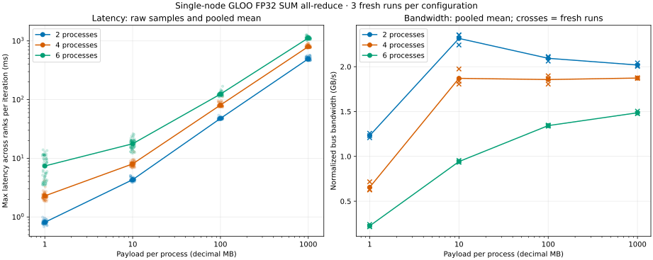

# 单机 All-Reduce Benchmark 实验报告

## 0. 问题定义与完成状态

### 0.1 要解决的问题

本报告对应 handout 的 [`distributed_communication_single_node`](./cs336_assignment2_systems_extracted.md#L1366-L1390)。实验目标是在单机多进程环境中测量 FP32 SUM all-reduce，并回答两个核心问题：

1. **消息大小如何影响通信时间？** 固定参与进程数，将每个 rank 的输入从 1 MB 增加到 10 MB、100 MB 和 1 GB，观察延迟是否逐渐由固定启动成本转为带宽主导。
2. **参与者数量如何影响通信时间？** 固定每个 rank 的输入大小，将进程或 GPU 数从 2 增加到 4 和 6，观察通信阶段、数据搬运、同步等待与资源竞争带来的变化。

实验自变量、观测量与完成条件如下：

| 类别 | 内容 |
|---|---|
| 消息大小 $S$ | 每个 rank 分别持有 1 MB、10 MB、100 MB、1 GB 的 FP32 Tensor |
| 参与者数量 $P$ | 2、4、6 个进程；题目正式环境中应为每进程一张 GPU |
| 固定操作 | `SUM all_reduce`，输入与输出使用同一 Tensor |
| 主要指标 | 每次 collective 中最慢 rank 的完成延迟 |
| 辅助指标 | mean、总体标准差、median、p95、CV、`algbw`、归一化 `busbw` |
| 正确性要求 | 全部元素等于预期归约结果，且 Tensor storage 保持不变 |
| 资源要求 | 每个独立配置在 5 分钟内结束 |
| 交付物 | 可复现脚本、原始数据、汇总表、图表和结果分析 |

这里测量的是**一次 all-reduce 从调用到结果可用所需的时间**，而不是完整训练 step，也不是单条物理链路的裸带宽。实验还需要区分平均延迟与尾部延迟，因为 collective 的关键路径由最慢 rank 决定。

### 0.2 本机能够完成的范围

题目要求改变 GPU 数并使用 NCCL，但本机没有可用 CUDA 设备。因此，本报告实际完成的是同一参数矩阵下的 **CPU/Gloo 实验**：

- 保留题目指定的 4 种 FP32 消息大小；
- 保留 2、4、6 个 worker process；
- 使用 Gloo 和 CPU Tensor 验证 benchmark 方法、正确性、延迟趋势与数据处理链路；
- 实现 NCCL 分支并提供复跑命令，但不虚构 GPU 结果。

CPU/Gloo 数据可以回答“固定 CPU 资源下，消息大小和进程数如何影响本地 collective”，但不能替代“增加 GPU 数时，NCCL 在 PCIe/NVLink 上如何扩展”这一正式问题。二者的 backend、硬件资源、拓扑和异步执行机制均不同。

### 0.3 完成状态

12 个配置均完成 3 次独立运行，36/36 组通过全量正确性与原地写回检查，共得到 720 个正式采样、2880 条逐 rank 时长记录。总实验耗时 408.89 秒；最长单组为 39.47 秒，全部满足题目“每组少于 5 分钟”的要求。

1 GB 的平均最慢 rank 延迟，在 2、4、6 进程下分别为 **495.375 ms、800.697 ms、1121.325 ms**。在固定 6 个 CPU 核的资源条件下，更多进程带来更大的通信和调度成本；1 MB、6 进程的 CV 达 43.1%，相对波动显著高于各 1 GB 组。

### 0.4 阅读顺序

1. [04_01 本地语义实验](./04_01_pytorch_all_reduce_demo_report.md)：理解 rank、process group、原地 SUM 和结果一致性。
2. 本文：理解 benchmark 要回答的问题、测量方法与实验结果。
3. [04_02 底层通信背景](./04_02_all_reduce_communication_background.md)：继续阅读 ring/tree、拓扑、RDMA、NCCL 算法选择和训练调度。

## 1. 环境、单位与资源边界

### 1.1 实测环境

| 项目 | 设置 |
|---|---|
| 实验日期 | 2026-10-01 |
| CPU | 2 × Intel Xeon Platinum 8336C @ 2.30 GHz |
| 主机拓扑 | 56 个物理核，2 sockets，2 NUMA nodes，每核 1 个硬件线程 |
| 实际 CPU affinity | `0-5`，都位于 socket 0 / NUMA node 0 |
| 内存 | 约 109.8 GiB；启动前 `MemAvailable` 约 84.7 GiB |
| OS | Linux 5.4.143.bsk.8-amd64，x86_64 |
| Python / PyTorch | 3.13.12 / 2.11.0+cu130 |
| CUDA device 数 | 0 |
| backend / device / dtype / op | Gloo / CPU / FP32 / SUM |
| Gloo 网络接口 | `GLOO_SOCKET_IFNAME=lo`，本机 loopback |
| Torch intra-op / inter-op threads | 每个 worker 分别为 1 / 1 |
| BLAS/OpenMP | `OMP_NUM_THREADS=1 MKL_NUM_THREADS=1 OPENBLAS_NUM_THREADS=1` |
| 单组超时 | 240 秒，含进程创建；超时清理整个子进程组 |
| 组间调度 | 顺序运行；全部配置与重复轮次以 seed `20261001` 打乱顺序 |

限制 6 核是为了控制本次作业的 CPU 占用。它不是“每 rank 独占一核”：所有 worker、Gloo 辅助线程和本次父进程共享这 6 个核。CPU affinity 也不是独占 CPU 的预约；其他主机进程仍可能竞争。未设置严格的 NUMA memory binding，首次触达倾向于本地节点，但不保证每个物理页都在 node 0。

Gloo 的 payload 通信选择 loopback，所以这里不经过外部以太网交换机，也不测真实 NIC 线速；内核网络路径、内存复制、归约计算、线程调度仍有实际成本。

### 1.2 MB、GB 与 FP32 元素数

题面使用 MB/GB，本文采用十进制：$1\,\mathrm{MB}=10^6$ byte，$1\,\mathrm{GB}=10^9$ byte。FP32 每元素 4 byte，$N_e=S/4$。

| 题目大小 | 命令 `--payload-mb` | 每 rank 字节数 $S$ | 每 rank 元素数 $N_e$ | 6 rank 的 payload 合计 |
|---|---:|---:|---:|---:|
| 1 MB | 1 | 1,000,000 | 250,000 | 6 MB |
| 10 MB | 10 | 10,000,000 | 2,500,000 | 60 MB |
| 100 MB | 100 | 100,000,000 | 25,000,000 | 600 MB |
| 1 GB | 1000 | 1,000,000,000 | 250,000,000 | 6 GB |

表中的 $S$ 始终指**单 rank 的输入**。它不是所有 rank 输入之和，也不是算法最终发送的总字节数。6 GB 只包含用户 tensor，不包含每个 Python/PyTorch 进程和 Gloo 的内部 buffer。

## 2. 实现组织与复现

### 2.1 模块分工

| 文件 | 职责 |
|---|---|
| [all_reduce_benchmark.py](file:///home/dengxiao.cs/code_repos/institutionalized/stanford_cs336/assignments/assignment2-systems/cs336_systems/all_reduce_benchmark.py#L23-L273) | 配置验证、进程组、输入恢复、collective 计时、全量正确性检查、跨 rank 统计 |
| [benchmark_all_reduce.py](file:///home/dengxiao.cs/code_repos/institutionalized/stanford_cs336/assignments/assignment2-systems/scripts/benchmark_all_reduce.py#L33-L118) | 参数矩阵、随机顺序、新进程隔离、整组超时、逐组 JSON 与错误记录 |
| [plot_all_reduce_benchmark.py](file:///home/dengxiao.cs/code_repos/institutionalized/stanford_cs336/assignments/assignment2-systems/scripts/plot_all_reduce_benchmark.py#L15-L140) | 读取已完成实验，生成表格、CSV、JSON 和独立图表 |

每个配置重复 3 次，每次创建新进程组。每个进程组执行一次未计时的正确性 collective、5 次 warmup、20 次计时 collective。每个配置最终有 $3\times20=60$ 个“逐次跨 rank 最大延迟”样本。

### 2.2 本机正式命令

以下命令在 `assignment2-systems/` 运行；输出目录必须不存在，以免把旧结果混入新实验：

```bash
GLOO_SOCKET_IFNAME=lo \
OMP_NUM_THREADS=1 MKL_NUM_THREADS=1 OPENBLAS_NUM_THREADS=1 \
taskset -c 0-5 uv run --no-sync python scripts/benchmark_all_reduce.py \
  --backend gloo \
  --world-sizes 2 4 6 \
  --payload-mb 1 10 100 1000 \
  --warmup-steps 5 \
  --measurement-steps 20 \
  --repeats 3 \
  --seed 20261001 \
  --timeout-seconds 240 \
  --output-dir benchmark_results/distributed_communication/cpu_gloo_20261001
```

绘图与汇总不重新执行 collective：

```bash
uv run --no-sync python scripts/plot_all_reduce_benchmark.py \
  --input-dir benchmark_results/distributed_communication/cpu_gloo_20261001 \
  --output-dir notes/assets/all_reduce_benchmark
```

`uv run --no-sync` 复用当前已安装环境，不在采样前临时更新依赖。原始逐 rank JSON、运行顺序、进程日志和硬件信息保存在 `benchmark_results/distributed_communication/cpu_gloo_20261001/`，该目录按仓库惯例被 Git 忽略。用于报告复核的聚合数据和图表保存在 `notes/assets/all_reduce_benchmark/`。

## 3. 正确性与计时口径

### 3.1 为什么每次必须重置输入

`all_reduce` 原地修改 tensor。[1] 若反复对上一轮的 SUM 结果求和，从第二次开始，各 rank 已持有相同全局和，下一次会再乘 world size，导致数值指数增长，最终可能溢出。

因此，每次 warmup 和正式计时前都重新填入该 rank 的固定输入。填充过程在计时外，而且只保留一份大 tensor 和一个小 pattern，避免额外保存一份 1 GB 源副本。

### 3.2 输入 pattern 与全量检查

rank 与元素下标均从 0 开始。定义位置 pattern $b_j=((j\bmod1024)\bmod17)/16$，rank $r$ 的输入分量为 $x_j^{(r)}=r+1+b_j$，期望值为：

$$y_j=\sum_{r=0}^{P-1}x_j^{(r)}=\frac{P(P+1)}{2}+Pb_j$$

这些小整数和二进制分数在本次 $P=2,4,6$ 下均能被 FP32 精确表示，求和没有需要容差处理的误差。pattern 随位置变化，能够检查部分错误偏移和遗漏写入；这仍是基准的受控输入，不是所有浮点输入的穷尽测试。

在 warmup 前、warmup 后、正式测量后各检查一次完整输出，同时确认 `data_ptr()` 未变。每次遍历全部 $N_e$ 元素，以最多约 4 MiB 的布尔临时块验证，不创建完整期望 tensor；NaN/Inf 或任何错误元素都会使检查失败。

数学中的 $x^{(r)},y$ 以列向量理解；代码的一维 Tensor shape 为 `(N_e,)`，没有显式行列轴。

### 3.3 一次采样的顺序

```text
恢复输入
→ 等待输入填充完成（NCCL 时同步 GPU）
→ barrier 对齐各 rank
→ NCCL 时等待 barrier 对应 GPU 工作完成
→ 开始 perf_counter_ns
→ all_reduce(SUM, async_op=False)
→ NCCL 时 cuda.synchronize
→ 结束 perf_counter_ns
```

CPU/Gloo 同步调用返回后本地结果可用；NCCL 的同步 API 不等于主机等待 GPU 全部执行完毕，因此 NCCL 分支显式等待当前 GPU 完成。[2][3]

本指标是 **host 调用到结果完成的延迟**，含 Python 调用、通信提交和必要等待；它不是纯 Gloo 内部传输耗时，也不是单个 NCCL kernel 时间。barrier、输入恢复和正确性检查均不在计时窗内，但它们仍会影响下一次采样的 cache 和线程状态。

每轮 barrier 只缩小开始时间偏差，不保证所有 rank 在同一纳秒开始计时。不要把各 rank 局部时长误认为完全同步的全局时间线。

### 3.4 跨 rank 和跨重复轮次的统计

第 $q$ 次新进程组、第 $i$ 个采样、rank $r$ 的本地耗时记为 $t_{q,i,r}$，先取：

$$T_{q,i}=\max_{0\le r<P}t_{q,i,r},\qquad \overline{T}=\frac{1}{RK}\sum_{q=0}^{R-1}\sum_{i=0}^{K-1}T_{q,i}$$

这里 $R=3,K=20$，均值、总体标准差、median、p95 和 CV 都基于这 60 个值。p95 使用线性插值；$\mathrm{CV}=100\sigma/\overline{T}$。

同一次 collective 的多个 rank 观测相关，不能把 $60P$ 条本地时长当作 $60P$ 次独立实验。同一进程组内的连续采样也可能相关，因此 60 个值只描述这次测量分布，不用于夸大统计置信度；三个新进程组的均值另列出来观察组间变化。

### 3.5 带宽口径

由平均延迟（换算为秒）计算：

$$\mathrm{algbw}=\frac{S}{10^9\overline{T}},\qquad \mathrm{normalized\ busbw}=\frac{2(P-1)}{P}\,\mathrm{algbw}$$

单位都是十进制 GB/s。[4] 这是**平均耗时换算带宽**，不是对每个采样的带宽做算术平均。

本文在 Gloo 上也给出该归一化指标，便于按同一数学口径比较不同进程数；`busbw` 的换算不证明 Gloo 使用 ring，更不表示 loopback 机器存在相应线速的物理网卡。

## 4. 实测结果

### 4.1 延迟与带宽总表

每行基于 3 次新进程组 × 20 次采样，先逐次取各 rank 最大时长，再统计这 60 个值。下表单位为 ms 和十进制 GB/s，标准差为总体标准差。1000 MB 即题目中的 1 GB。

| Payload | Processes | Mean ± std (ms) | Median (ms) | p95 (ms) | CV (%) | algbw (GB/s) | normalized busbw (GB/s) |
|---|---:|---:|---:|---:|---:|---:|---:|
| 1 MB | 2 | 0.812 ± 0.057 | 0.806 | 0.910 | 7.0 | 1.232 | 1.232 |
| 1 MB | 4 | 2.288 ± 0.350 | 2.229 | 2.724 | 15.3 | 0.437 | 0.655 |
| 1 MB | 6 | 7.404 ± 3.194 | 7.156 | 11.839 | 43.1 | 0.135 | 0.225 |
| 10 MB | 2 | 4.319 ± 0.254 | 4.275 | 4.801 | 5.9 | 2.315 | 2.315 |
| 10 MB | 4 | 8.021 ± 0.928 | 7.857 | 9.328 | 11.6 | 1.247 | 1.870 |
| 10 MB | 6 | 17.684 ± 3.258 | 17.661 | 23.928 | 18.4 | 0.565 | 0.942 |
| 100 MB | 2 | 47.767 ± 1.609 | 47.473 | 50.257 | 3.4 | 2.093 | 2.093 |
| 100 MB | 4 | 80.787 ± 6.744 | 78.554 | 91.627 | 8.3 | 1.238 | 1.857 |
| 100 MB | 6 | 124.078 ± 8.934 | 122.058 | 140.185 | 7.2 | 0.806 | 1.343 |
| 1000 MB | 2 | 495.375 ± 29.589 | 486.221 | 564.652 | 6.0 | 2.019 | 2.019 |
| 1000 MB | 4 | 800.697 ± 36.518 | 789.214 | 885.378 | 4.6 | 1.249 | 1.873 |
| 1000 MB | 6 | 1121.325 ± 53.377 | 1110.196 | 1206.329 | 4.8 | 0.892 | 1.486 |



左图保留全部逐次最大延迟散点，实线为均值；横纵坐标均为对数，散点仅作很小的水平错开以减少遮挡。右图实线由 60 个采样的平均延迟换算归一化带宽，叉号是三个独立进程组各自均值换算的带宽；它不是物理 NIC 吞吐。

可复核数据：[CSV](./assets/all_reduce_benchmark/results.csv)、[JSON](./assets/all_reduce_benchmark/results.json)。JSON 保留每行的全部 60 个最大延迟样本、三个进程组均值、各 rank 均值及原始文件 SHA-256。原始逐 rank 记录位于本地 [实验目录](../benchmark_results/distributed_communication/cpu_gloo_20261001/)。

### 4.2 消息大小：大消息区接近线性增长

从 100 MB 增大至 1 GB，payload 为 10 倍，2/4/6 进程的平均延迟分别变为 10.37、9.91、9.04 倍，接近带宽主导模型的线性关系。4 进程在 10 MB、100 MB、1 GB 的归一化带宽分别为 1.870、1.857、1.873 GB/s，处于相近水平；6 进程则从 0.942 上升到 1.343、1.486 GB/s，说明更大的 payload 摊薄了固定成本。

并非所有曲线都单调提高：2 进程的归一化带宽在 10 MB 为 2.315 GB/s，到 1 GB 为 2.019 GB/s。cache、内存搬运、协议分块和调度都可能影响有效带宽；本实验没有硬件计数器或通信 trace，不能把这一下降唯一归因于某个机制。

### 4.3 进程数：更多参与者没有带来更低延迟

| Payload | 4 进程 / 2 进程延迟 | 6 进程 / 2 进程延迟 |
|---|---:|---:|
| 1 MB | 2.82× | 9.12× |
| 10 MB | 1.86× | 4.09× |
| 100 MB | 1.69× | 2.60× |
| 1 GB | 1.62× | 2.26× |

all-reduce 需要合并更多来源，并让每个进程都获得完整结果。本次增加进程数的同时，每个进程的 payload 不变，CPU 核和内存资源仍固定：例如 1 GB、6 进程有 6 GB 用户 tensor，明显多于 2 进程的 2 GB。

1 MB、6 进程延迟远超单纯 1.667 倍流量系数，说明只考虑 payload 字节数不够；collective 阶段、线程调度和同步等待都可能占显著比例。这与延迟主导直觉一致，但不构成对实际 Gloo 算法或根因的唯一识别。

### 4.4 波动与三个独立进程组

1 MB、6 进程的最小/最大采样为 3.474/13.946 ms，p95 为 11.839 ms，CV 为 43.1%。因此只报告均值 7.404 ms 会隐藏明显波动。相比之下，1 GB 三种进程数的 CV 分别为 6.0%、4.6%、4.8%，大 payload 的相对波动较低，但慢样本仍保留在统计中。

下面每个值是一个新进程组的 20 个逐次最大延迟的均值。repeat 编号是逻辑重复编号；实际运行顺序被打乱，因此表中列顺序不是时间顺序。

| Payload | 进程数 | repeat 0 (ms) | repeat 1 (ms) | repeat 2 (ms) |
|---|---:|---:|---:|---:|
| 1 MB | 2 | 0.828 | 0.795 | 0.813 |
| 1 MB | 4 | 2.374 | 2.093 | 2.399 |
| 1 MB | 6 | 7.566 | 7.745 | 6.901 |
| 10 MB | 2 | 4.460 | 4.247 | 4.250 |
| 10 MB | 4 | 7.596 | 8.162 | 8.305 |
| 10 MB | 6 | 17.757 | 17.848 | 17.448 |
| 100 MB | 2 | 47.314 | 47.504 | 48.484 |
| 100 MB | 4 | 79.006 | 83.053 | 80.301 |
| 100 MB | 6 | 123.882 | 124.727 | 123.625 |
| 1000 MB | 2 | 497.285 | 499.055 | 489.785 |
| 1000 MB | 4 | 802.281 | 799.666 | 800.143 |
| 1000 MB | 6 | 1127.991 | 1108.020 | 1127.964 |

三个新进程组之间，4 进程/1 GB 的均值非常接近（799.666–802.281 ms），而 4 进程/1 MB 的组均值范围为 2.093–2.399 ms。它说明短调用对运行环境更敏感；三组数据仍不足以对长期稳定性或总体置信区间作强结论。

### 4.5 资源占用、运行时间与验证

| 进程数 | 1 GB 配置中的最高单 worker RSS (GiB) | 最长整组时间 (s) |
|---:|---:|---:|
| 2 | 1.421 | 21.63 |
| 4 | 1.424 | 30.21 |
| 6 | 1.426 | 39.47 |

RSS 来自 Linux `ru_maxrss`，包括 Python/PyTorch、tensor、Gloo 和 allocator 状态。它是**单个 worker 的高水位**，不是全实验同时刻 RSS；不能把不同进程、不同时间的峰值简单相加当成精确整机峰值。按数据结构估计，最大配置的主 tensor 合计 6 GB，另外还有每进程运行时及通信开销，远低于启动时可用内存。

36 次新进程组均返回 0、没有 OOM 或超时。每个 rank 在三个阶段全量检查，共 432 次检查全部通过；正式采样共 720 次 collective，对应 2880 条逐 rank 计时记录。总墙钟时间 408.89 秒是整个三轮矩阵之和；题目的“每组少于 5 分钟”对应单个配置的一次运行，本次最慢为 39.47 秒。

代码通过 Ruff 和 Python 编译检查，并用已知的两 rank 时长序列验证了“先逐次取 max，再统计”的聚合顺序；CPU smoke 与完整矩阵均实际执行。NCCL 的无设备报错路径已检查，但 NCCL 通信分支尚无硬件运行证据。

## 5. 如何用通信模型解释结果

### 5.1 轮次、字节数与并行性

经典 ring all-reduce 将输入拆成 $P$ 个 chunk，执行 $P-1$ 轮 reduce-scatter，再执行 $P-1$ 轮 all-gather。各 rank 可同时发送和接收，但前后轮次有数据依赖；不会因为有 $P$ 个 rank 就把总轮数再除以 $P$。

$$T_{\mathrm{ring}}\approx2(P-1)\alpha+2\frac{P-1}{P}\frac{S}{B_{\mathrm{eff}}}$$

| 进程数 $P$ | 理想 ring 轮数 | 每 rank 发送量 / $S$ |
|---:|---:|---:|
| 2 | 2 | 1 |
| 4 | 6 | 1.5 |
| 6 | 10 | 1.667 |

发送和接收各有上述量，不能再把发送加接收的总字节数套进单向带宽公式。节点内 CPU 共享固定资源时，$B_{\mathrm{eff}}$ 还会随进程数变化；不能仅用 1、1.5、1.667 三个系数预测延迟比例。

ring 是解释趋势的模型，不是本实验对实际执行算法的识别结果。Gloo 内部算法、chunk/slice 大小和传输线程也会影响拐点。详细推导见 [04_02 第 2–5 节](./04_02_all_reduce_communication_background.md#L59-L257)；handout 在[后续通信原语章节](./cs336_assignment2_systems_extracted.md#L1601-L1622) 给出了无固定延迟项的模型。

### 5.2 小消息与大消息

小 payload 容易受启动、线程唤醒、同步和排队支配；较大 payload 则更容易受复制、归约和数据搬运带宽支配。相同总字节数，拆成很多小 collective 会反复支付固定成本。

本实验最小为 1 MB，仍不是零字节/单标量延迟实验，因此不能用“1 MB 耗时”直接认定 $\alpha$，也不能仅拟合两点就断定具体底层算法。若需要找小消息阈值，应另扫 bytes/KiB 区间。

### 5.3 与 DDP bucket 和 FSDP 的关系

DDP 把梯度组织为 bucket：小 bucket 更早就绪但 collective 次数多；大 bucket 减少固定开销，却可能让通信开始更晚。最终目标是减少训练关键路径上的等待，microbenchmark 中大 Tensor 的带宽高不等于训练时 bucket 越大越好。[5]

FSDP 使用参数 all-gather 和梯度 reduce-scatter，最终数据驻留方式与 DDP 的全量梯度副本不同。比较时应统计完整 step 的所有通信，并考虑与计算重叠；不能把一次 all-reduce 曲线直接当作 FSDP step 耗时。

已有相关材料：

- [通信模式与逐轮算法图解](../../../../ml-engineering/network/comms.md#L139-L292)；
- [网络 benchmark 与消息大小](../../../../ml-engineering/network/benchmarks/README.md#L1-L73)；
- [不同并行方式的 collective](../../../../ml-engineering/training/model-parallelism/README.md#L571-L609)；
- [DDP `no_sync()` 与梯度累积](./02_04_gradient_accumulation_guide.md#L681-L700)。

### 5.4 脚本本身的时间、空间复杂度

设单 rank 元素数为 $N_e=S/4$，每组采样数为 $K$。输入恢复和一次全量校验各为 $O(N_e)$ 时间，它们都在计时区间外；每个 worker 的用户 tensor 为 $O(S)$ 空间，pattern 只有 1024 个 FP32 元素，比较临时块上限约 4 MiB。Gloo/NCCL 自身的工作区另计，不能由用户 tensor 大小精确推断。

每个进程组保存 $O(PK)$ 个原始时长，逐次跨 rank 取最大值是 $O(PK)$，对每配置 $RK$ 个值排序计算分位数为 $O(RK\log(RK))$。实验组之间顺序执行，所以峰值 payload 随最大组的 $PS$ 增长，不是 36 组 payload 的总和。

各 rank 的本地填充、归约和发送/接收可以并行；collective 内部有跨 rank 依赖，本脚本的采样迭代之间、实验配置之间保持串行。额外的 benchmark 辅助线程和通信线程仍共享 CPU 0–5，这也是需要报告亲和性和线程数的原因。

## 6. GPU 复跑与有效性边界

### 6.1 GPU 复跑命令

在至少有 6 张可用、且被当前 PyTorch/CUDA 构建支持的 GPU 的机器上，建立独立环境后运行：

```bash
uv run python scripts/benchmark_all_reduce.py \
  --backend nccl \
  --world-sizes 2 4 6 \
  --payload-mb 1 10 100 1000 \
  --warmup-steps 5 --measurement-steps 20 --repeats 3 \
  --seed 20261001 --timeout-seconds 240 \
  --output-dir benchmark_results/distributed_communication/gpu_nccl

uv run python scripts/plot_all_reduce_benchmark.py \
  --input-dir benchmark_results/distributed_communication/gpu_nccl \
  --output-dir notes/assets/all_reduce_benchmark_gpu
```

每个 rank 使用不同的 `cuda:rank`，没有足够 GPU 时会在创建实验目录前报错，不会偷偷回退到 CPU 或把多个 rank 放到同一张卡。上述命令是复跑入口，本机没有执行 NCCL 路径；还需记录 GPU 型号、互联、驱动、NCCL 版本和 rank placement。

### 6.2 本次结论的边界

1. CPU/Gloo 实验验证了单机多进程通信基准方法，并提供真实的 CPU 延迟结果；不能替代 GPU/NCCL 数据。
2. 所有配置共享 CPU 0–5；增加进程是在固定硬件资源内增加参与者，与增加 GPU 数量同时增加计算/互联资源的实验不同。
3. loopback 测量没有经过真实 NIC、跨机交换机、NVLink 或 GPUDirect RDMA。
4. 每轮填充和 barrier 定义了隔离调用的测量方法；连续批量 enqueue、真实 backward 重叠和 cache 状态变化可能得到不同结果。
5. 没有 GPU/通信 trace，因此不根据吞吐曲线断言底层实际选用了 ring、tree 或其他算法。
6. 该主机不是独占实验环境；保留慢样本和组间差异，不挑选最好一轮。

## 7. 题目简短回答与资料

**CPU/Gloo 版本的 3 句回答：** 在同一 NUMA 节点、固定 CPU 0–5、每 rank 1 个算子线程下，1 MB 的 2/4/6 进程平均延迟分别为 0.812/2.288/7.404 ms，1 GB 则为 495.375/800.697/1121.325 ms；中间大小和完整波动见第 4 节。较大消息的耗时接近随字节数线性增长，而短消息对进程数、启动和调度延迟更敏感，6 进程/1 MB 的 CV 达 43.1%。本次覆盖全部 12 个 CPU 配置且正确性通过，但没有 GPU/NCCL 实测，不能用这些数值作为题目要求的多 GPU 性能结论。

1. [PyTorch 2.11 `all_reduce`：原地输入输出与 SUM](https://docs.pytorch.org/docs/2.11/distributed.html#torch.distributed.all_reduce)
2. [PyTorch 2.11 同步与异步 collective](https://docs.pytorch.org/docs/2.11/distributed.html#synchronous-and-asynchronous-collective-operations)
3. [PyTorch 2.11 `torch.cuda.synchronize`](https://docs.pytorch.org/docs/2.11/generated/torch.cuda.synchronize.html)
4. [NVIDIA nccl-tests：algorithm bandwidth 与 bus bandwidth](https://github.com/NVIDIA/nccl-tests/blob/master/doc/PERFORMANCE.md#allreduce)
5. [PyTorch 2.11 DDP](https://docs.pytorch.org/docs/2.11/generated/torch.nn.parallel.DistributedDataParallel.html)
