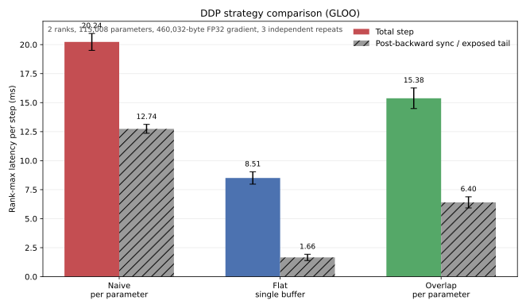

# 逐参数通信与反向计算重叠的 DDP Benchmark 实验报告

> 状态：实现、CPU/Gloo 对照和复现工具已完成；正式 2-GPU/NCCL/`xl` 数值与 Nsight 截图受硬件前置条件阻塞，本文明确记录而不伪造证据。

## 0. 问题定义

### 0.1 研究对象

本文只研究 Stanford CS336 Assignment 2 Section 5.3.2 的 `ddp_overlap_individual_parameters_benchmarking`。handout 要求在 **1 node、2 GPUs、xl 模型**的相同设置下完成两件事：[1]

1. 测量逐参数梯度通信与 backward 重叠时的单次训练迭代时间，并与两个既有基线比较。
2. 用 Nsight Systems 对比初始 DDP 与 overlap DDP，提交两张能显示通信是否与 backward 重叠的截图。

三个被测策略必须是：

| 策略 | 梯度通信粒度 | 发起时机 | 主动 overlap |
|---|---|---|---|
| `naive` | 每个参数张量一次 all-reduce | 整个 backward 之后 | 否 |
| `flat` | 所有梯度 flatten 后一次 all-reduce | 整个 backward 之后 | 否 |
| `overlap` | 每个参数张量一次异步 all-reduce | 该参数梯度 ready 后 | 是 |

核心问题不是“代码是否调用了 `async_op=True`”，而是：

1. overlap 版本的端到端 step time 是否降低；
2. Nsight GPU timeline 是否显示 backward compute kernel 与 NCCL all-reduce kernel 真实重叠；
3. 未隐藏的通信尾部还有多长，关键路径为何仍可能受通信限制。

### 0.2 范围边界

本文不把正式 PyTorch DDP 的 bucket reducer、FSDP、tensor parallel、跨节点网络或 NCCL 算法调优纳入变量。bucket 化会同时改变消息数量、大小和 ready 时机，无法单独回答“逐参数 overlap”的效果。

Section 2.1.2 规定 xl 模型为 $d_{\text{model}}=2560$、$d_{\text{ff}}=10240$、32 层、32 个 attention heads；除非另有说明，词表大小为 10,000、batch size 为 4、context length 为 512。[1]

本文暂按“batch size 4 是 global batch”解释，因此两 rank 各处理 2 个样本。若既有 naive/flat benchmark 使用“每 rank batch 4”，正式实验必须沿用既有定义，并明确写出 global/local batch，不能混用口径。

## 1. 调度差异与关键路径

### 1.1 三种调度

初始逐参数 DDP：

```text
forward -> backward compute -> all-reduce grad 1 -> ... -> all-reduce grad K -> optimizer
```

所有通信都在 backward 后，没有 backward/communication overlap。同步 PyTorch collective 在 CUDA 上返回只保证操作已正确入队，不表示设备端通信已经完成。[1][3]

单次 flat all-reduce：

```text
forward -> backward compute -> flatten -> one all-reduce -> unflatten/copy -> optimizer
```

它减少 collective 次数和固定 launch/调度成本，但仍不 overlap；flatten、copy 和额外 buffer 也属于其真实成本。[1]

逐参数 overlap DDP：

```text
backward starts
  -> grad K ready -> async all-reduce K starts/queues
  -> earlier-layer backward compute continues
  -> grad K-1 ready -> async all-reduce K-1 starts/queues
  -> ...
backward ends
  -> wait for all outstanding Work handles
  -> optimizer reads averaged gradients
```

`register_post_accumulate_grad_hook` 在叶子参数的 `.grad` 完成本次累积后运行，并允许 hook 访问或原地修改参数及其 `.grad`。[2] `finish_gradient_synchronization()` 是 optimizer 的硬依赖边界：过早等待会缩短 overlap，未等待就更新则会产生错误或数据竞争。[1][3]

### 1.2 关键路径模型

设：

| 符号 | 含义 |
|---|---|
| $B$ | 完整 backward compute 时间 |
| $K$ | 产生 dense gradient 的唯一参数张量数 |
| $r_i$ | 从 backward 开始到第 $i$ 个通信梯度 ready 的时间 |
| $c_i$ | 第 $i$ 个 all-reduce 在当前并发条件下的设备执行时间 |
| $s_i,f_i$ | 第 $i$ 个 all-reduce 的实际开始、完成时间 |
| $C_{\text{ind}}$ | 不重叠时逐参数通信总时间，近似为 $\sum_{i=1}^{K}c_i$ |

按梯度 ready 顺序编号，并用一条有序通信 lane 建模：

$$s_i=\max(r_i,f_{i-1}),\qquad f_i=s_i+c_i,\qquad f_0=0$$

于是 backward 加通信的完成时间是：

$$T_{\text{overlap,bwd+comm}}=\max(B,f_K)=\max\left(B,\max_{1\le i\le K}\left(r_i+\sum_{j=i}^{K}c_j\right)\right)$$

关键路径包含：

1. **启动空洞**：第一个梯度在 $r_1$ 才 ready。
2. **中段并发窗口**：NCCL 可与更早层的 backward compute 重叠。
3. **通信尾部**：最后 ready 的梯度仍须通信；若 $r_K\approx B$，至少留下约 $c_K$ 的尾部。

NCCL kernel 与 backward kernel 可能竞争 SM、HBM bandwidth、copy engine 或互联资源，使并发时的 $c_i$ 和 compute kernel 时间变长。因此上式是调度模型，不能用独立测得的通信耗时精确代替实测关键路径。

## 2. Overlap 的性能上界

忽略 ready 延迟、launch 开销和资源竞争，完全串行为：

$$T_{\text{serial,bwd+comm}}=B+C_{\text{ind}}$$

理想 overlap 下界为：

$$T_{\text{ideal,bwd+comm}}=\max(B,C_{\text{ind}})$$

最多隐藏 $\min(B,C_{\text{ind}})$，理想加速比为：

$$S_{\text{ideal,bwd+comm}}=\frac{B+C_{\text{ind}}}{\max(B,C_{\text{ind}})}\le 2$$

设 $Q$ 包含 forward、loss、zeroing、optimizer 等不被本优化缩短的 step 时间，则端到端上界进一步受限：

$$S_{\text{ideal,step}}=\frac{Q+B+C_{\text{ind}}}{Q+\max(B,C_{\text{ind}})},\qquad S_{\text{actual,step}}\le S_{\text{ideal,step}}$$

$2\times$ 只是 backward 加通信部分的理论极限，不是预期实测值。实际还受 $r_i$、通信尾部、Python hook、小 collective 固定成本和资源争用限制。

flat 优化“通信本身有多贵”，overlap 优化“能隐藏多少通信”。若参数 tensor 普遍很小，可能有 $C_{\text{ind}}\gg C_{\text{flat}}$；即使隐藏一部分 $C_{\text{ind}}$，overlap 也不保证快于 flat。因此必须同时实测三种策略，不能由“存在 overlap”推出“端到端最快”。

## 3. CUDA Stream 与异步语义

### 3.1 入队不等于完成

PyTorch 官方 CUDA 语义说明 GPU 操作通常先由 CPU 入队，稍后在设备执行；没有同步的 Python 墙钟计时主要测 launch。准确计时应使用 CUDA event，或在计时边界调用 `torch.cuda.synchronize()`。[4]

因此 Python hook 很快返回、`loss.backward()` 主机调用结束、NCCL API 返回，都不等于相关 GPU 工作完成。NVTX CPU range 和 GPU kernel activity 必须分开解释。

### 3.2 Stream、并发与依赖

CUDA stream 是单 device 上的线性执行序列。同一 stream 内按入队顺序串行；不同 stream 只有在没有依赖且资源允许时才可能并发。使用非默认 stream 时，生产者和消费者通常需要 event、`wait_stream()` 等依赖，tensor lifetime 还可能需要 `record_stream()`。[4]

ProcessGroupNCCL 通常使用独立 CUDA stream。正确 overlap 至少需要：

1. NCCL stream 等待 autograd/compute stream 产出该梯度；
2. optimizer 所在当前 stream 等待 NCCL 写回梯度完成。

PyTorch ProcessGroup 负责 collective 的 stream 协调时，不应猜测其内部 stream；自建 side stream 上的额外操作仍由调用方同步。[3][4]

### 3.3 `async_op` 与 `Work.wait()`

handout 与 PyTorch distributed 文档区分两层完成状态：[1][3]

- `async_op=False`：调用等待 collective 被入队，CUDA 操作仍可能未完成。
- `async_op=True`：立即返回 `Work`，返回时甚至不保证 collective 已入队。
- CUDA 上普通 `Work.wait()` 会让当前 CUDA stream 等待 NCCL work，不等价于 CPU 忙等到 GPU 完成；设置 timeout 时可能阻塞 CPU。

所以 `async_op=True` 只创造机会。只有 GPU timeline 显示 compute 与 NCCL kernel 的设备执行区间相交，才能证明真实 overlap。

### 3.4 NCCL 语义与顺序

NCCL 原生 collective 接受 CUDA stream；API 返回表示操作已入队，设备 collective 随后异步执行，可用 stream synchronization 或 CUDA event 判断完成。[5]

所有 rank 必须按相同顺序发起匹配 collective，顺序不一致可能错误或 hang。[6] 逐参数 hook 因而依赖各 rank 的 autograd 图和 gradient-ready 顺序一致；rank-dependent control flow、不同 unused parameters 或不一致 hook 顺序必须排除或显式处理。

以下操作会缩短或摧毁 overlap：hook 内立即 `work.wait()`、每个参数后 `torch.cuda.synchronize()`、backward 中间 device-wide synchronize，以及 optimizer 前不必要的逐项全局同步。benchmark 只在完整 step 计时边界同步；内部用 NVTX 标注，不用 synchronize 切段。

## 4. 实现与验收

| 位置 | 职责 |
|---|---|
| [`cs336_systems/ddp.py:L88-L125`](../cs336_systems/ddp.py#L88-L125) | post-accumulate hook、async Work、finish wait 与平均 |
| [`cs336_systems/ddp_benchmark.py:L31-L326`](../cs336_systems/ddp_benchmark.py#L31-L326) | 三策略统一 step、CUDA/NVTX 边界、rank-max 原始样本 |
| [`scripts/benchmark_ddp.py:L20-L224`](../scripts/benchmark_ddp.py#L20-L224) | 独立子进程、随机重复顺序、超时和 suite 汇总 |
| [`tests/test_ddp_variants.py:L24-L67`](../tests/test_ddp_variants.py#L24-L67) | 三策略 × 普通/tied 模型的全局 batch 等价测试 |

实现完成了初始化参数与 buffer 广播、唯一 trainable Parameter hook、`async_op=True` SUM all-reduce、全部 Work wait、world-size 平均、pending 状态清理和下一轮 forward guard。adapter 已切换到 overlap wrapper，CPU/Gloo 正确性测试通过。

它采用直接 hook 提交，支持边界是各 rank 具有相同静态图、used 参数集合和 ready 顺序；rank-dependent unused 参数、不同 ready 顺序、sparse gradient 和 reentrant backward 不在承诺范围内。这个边界与 `04_07` 的实现报告一致，不能把最小课程实现等同于正式 DDP Reducer。

统一 runner 对 CPU 使用 Gloo，对 GPU 使用 NCCL；NCCL 模式要求至少 `world_size` 张可见 CUDA device，否则在 spawn 前失败。measurement 外执行 `zero_grad`、barrier 和起点同步；step 覆盖 forward、loss、backward、finish 和 optimizer。naive/flat 在同步阶段计时前等待 backward GPU 完成，overlap 不插入该等待，从而保留并测量 exposed communication tail。

## 5. Benchmark 方法

### 5.1 公平性控制

三个策略除 DDP variant 外必须完全一致：

| 项目 | 固定值或记录要求 |
|---|---|
| 节点与设备 | 1 node，2 GPUs，一 rank 独占一 GPU |
| backend | NCCL |
| 模型 | xl：$d_{\text{model}}=2560$、$d_{\text{ff}}=10240$、32 layers、32 heads |
| 输入 | vocab 10,000，context 512，明确 global/local batch |
| dtype、optimizer | FP32；仓库 `AdamW`，`lr=1e-3`、`weight_decay=0.01` |
| 随机性 | 相同 seed、相同随机输入生成方式 |
| compile | 三者都关闭或使用同一设置 |
| warmup | 建议 5 steps，不进入统计或截图窗口 |
| measurement | 建议至少 10 steps，并独立重复多轮 |
| 环境 | 记录 GPU、互联、driver、CUDA、PyTorch、NCCL、Nsight 版本 |

每个策略用独立进程运行，避免 allocator、缓存和前一策略残留状态。运行顺序应轮换，而不是始终 naive、flat、overlap。

### 5.2 端到端计时

每个 measurement step 推荐：

```text
all ranks 在计时窗外对齐
-> torch.cuda.synchronize()
-> zero_grad
-> start host timer 或 CUDA events
-> forward -> loss -> backward
-> finish_gradient_synchronization -> optimizer.step
-> torch.cuda.synchronize() -> stop timer
-> 在计时窗外汇总各 rank duration 的 max
```

分布式 step 由最慢 rank 决定，所以每个 sample 先取 rank max，再对 samples 计算 mean、population standard deviation、median 和 p95，不能只报 rank 0。计时必须包含 overlap 的最终等待及 flat 的 flatten/unflatten，否则比较不公平。

### 5.3 CPU/Gloo 工程 smoke 数值

环境为 Intel Xeon Platinum 8336C、56 logical CPUs、Linux 5.4.143、Python 3.13.12、PyTorch 2.11.0+cu130 和 2-rank Gloo，每 rank 1 个 intra-op thread。被测小模型有 115,008 个参数、21 个 trainable tensors 和 460,032-byte FP32 gradient；每 case 运行 3 warmup + 10 measurement，共 3 次独立进程级 repeats。

| 策略 | calls/step | step mean ± repeat std (ms) | post-backward sync/tail (ms) | 相对 naive 加速 |
|---|---:|---:|---:|---:|
| `naive` | 21 | 20.235 ± 0.727 | 12.741 ± 0.383，完整同步 | $1.00\times$ |
| `flat` | 1 | 8.509 ± 0.535 | 1.660 ± 0.271，完整同步 | $2.38\times$ |
| `overlap` | 21 | 15.376 ± 0.887 | 6.405 ± 0.482，仅 exposed tail | $1.32\times$ |



结果来自 2-rank CPU/Gloo、小模型、3 次独立进程级重复，每次 3 warmup + 10 measurement。原始结果位于 `benchmark_results/ddp/cpu_gloo_smoke_20261001/`；聚合 CSV、Markdown、SVG/PNG 和输入 SHA-256 位于 [`notes/assets/ddp_benchmark/`](./assets/ddp_benchmark/)。

handout 要求的正式 `2×GPU + NCCL + xl` 数值不可得：当前开发机无 GPU，可访问节点最多只有一张 6 GB GTX 1060。NCCL runner 已以 `NCCL requires 2 distinct visible CUDA devices` fail-fast。`xl` 的参数、gradient 和两个 Adam moments 静态下界已约 50.765 GiB/卡，尚未计算 activation，因此不能在现有设备上执行，也不能把本表 CPU 数值改名为正式结果。

工程 smoke 的 1 至 2 句比较：overlap 将 step mean 从 naive 的 20.235 ms 降至 15.376 ms，得到 $1.32\times$ 加速，说明提前提交逐参数通信缩短了 CPU/Gloo 关键路径；flat 通过把 21 次 collective 合并为 1 次进一步降至 8.509 ms，说明本 workload 中消除固定调用成本比只调整逐参数通信时机更有效。

## 6. NVTX 标注与 Nsight 采集

### 6.1 NVTX 标注

NVTX range 是应用写给 profiler 的语义标签，本身不计时、不同步 GPU，也不保证对应 GPU 工作在 range 退出前完成。[7][8]

当前 runner 在 measurement loop 外标注 `ddp_benchmark_measurement`，并在每个 step 内依次标注：

```text
ddp_benchmark_measurement
  forward
  loss
  backward
  finish_gradient_synchronization
  optimizer
```

当前没有单独的 `step_<index>` 外层 range；每个 measurement step 的五个阶段按调用顺序重复出现。截图时应从 warmup 后的 `ddp_benchmark_measurement` 内选取同一组连续阶段，并通过 CUDA GPU row 判断 NCCL kernel，而不能把 NVTX range 自身当作设备执行时间。

### 6.2 检查版本

```bash
uv run nsys --version
uv run nsys profile --trace=help
nvidia-smi
uv run python -c 'import torch; print(torch.__version__, torch.version.cuda, torch.cuda.nccl.version())'
```

Nsight Systems 官方文档支持 `cuda`、`nvtx`、`osrt` 等 trace，并说明 CUDA 默认跟踪目标 process tree；新版本支持更详细的 `nccl` tracing，但需要匹配的 Nsight/NCCL 版本。[8] 即使不启用高级 NCCL trace，`--trace=cuda` 也应显示 NCCL CUDA kernel。

### 6.3 可直接执行的采集命令

naive trace：

```bash
nsys profile \
  --trace=cuda,nvtx,osrt \
  --sample=none --cpuctxsw=none \
  --cuda-trace-scope=process-tree \
  --force-overwrite=true \
  --output=profile_artifacts/ddp_naive_xl \
  -- uv run python scripts/benchmark_ddp.py \
  --backend nccl --world-size 2 --variants naive --model-size xl \
  --vocab-size 10000 --global-batch-size 4 --context-length 512 \
  --warmup-steps 5 --measurement-steps 1 --repeats 1 \
  --output-dir benchmark_results/ddp/nsys_naive_xl
```

overlap trace：

```bash
nsys profile \
  --trace=cuda,nvtx,osrt \
  --sample=none --cpuctxsw=none \
  --cuda-trace-scope=process-tree \
  --force-overwrite=true \
  --output=profile_artifacts/ddp_overlap_xl \
  -- uv run python scripts/benchmark_ddp.py \
  --backend nccl --world-size 2 --variants overlap --model-size xl \
  --vocab-size 10000 --global-batch-size 4 --context-length 512 \
  --warmup-steps 5 --measurement-steps 1 --repeats 1 \
  --output-dir benchmark_results/ddp/nsys_overlap_xl
```

runner 自己用 `mp.spawn` 创建两个 worker，所以不再外包一层 `torchrun`。`--cuda-trace-scope=process-tree` 用于覆盖 worker process。若目标版本的 `nsys profile --trace=help` 明确支持 `nccl`，可把 trace 列表扩展为 `cuda,nvtx,osrt,nccl`。

命令行辅助检查：

```bash
nsys stats --report cuda_api_sum profile_artifacts/ddp_overlap_xl.nsys-rep
nsys stats --report cuda_gpu_kern_sum profile_artifacts/ddp_overlap_xl.nsys-rep
nsys stats --report nvtx_sum profile_artifacts/ddp_overlap_xl.nsys-rep
```

summary 可以确认 NCCL kernel 是否出现、次数是否合理，但累计 kernel 时间不能证明并发；overlap 必须检查 timeline 或导出的逐事件起止时间。

## 7. Trace 有效性与 Overlap 证据标准

### 7.1 Trace 有效性

截图前必须确认：

1. 两个 rank 都在报告中，且分别绑定两张 GPU。
2. 显示 warmup 后的同一个稳态 step。
3. NVTX 能定位 backward 和 optimizer。
4. CUDA GPU row 同时存在 backward compute kernels 和 NCCL all-reduce kernels。
5. backward 内没有 `cudaDeviceSynchronize` 人为串行化。
6. NCCL 数量与唯一 gradient tensor 数一致或有明确解释。
7. 两 rank collective 顺序匹配，trace 未提前结束。

### 7.2 “无 overlap”的证据

对 `naive`，在同一 rank、同一 GPU、同一 step 上应看到：

1. 最后一个 backward compute kernel 结束后，第一个 NCCL kernel 才开始；
2. 所有 NCCL kernel 位于 backward compute 后、optimizer 前；
3. 两类设备执行区间交集为零，或只有时间分辨率内的边界接触。

CPU 上 `dist.all_reduce` 的位置不是充分证据，必须看 CUDA GPU row。

### 7.3 “有 overlap”的证据

对 `overlap`，同一 rank、同一 GPU、同一 step 上至少应看到：

1. backward 尚有后续 compute kernel 时，某个 NCCL kernel 已在另一 stream 执行；
2. 两类 GPU kernel 起止时间有可见的正长度交集；
3. backward 后允许存在 NCCL 尾部，但 optimizer 必须在依赖满足后开始；
4. 两个 rank 都有兼容轨迹，而非只在一个 rank 看到 launch。

若 GUI 支持 NCCL projection，可关联 API、runtime scheduling、CUDA launch 和 GPU operation。NVIDIA 文档明确区分这些阶段，所以 CPU API overlap 不能替代 GPU operation overlap。[8]

### 7.4 量化指标

设同一 GPU 上 backward compute kernel 区间并集为 $\mathcal{B}$，NCCL kernel 区间并集为 $\mathcal{N}$，区间长度为 $\mu(\cdot)$：

$$T_{\text{intersection}}=\mu(\mathcal{B}\cap\mathcal{N})$$

$$R_{\text{comm-overlap}}=\frac{\mu(\mathcal{B}\cap\mathcal{N})}{\mu(\mathcal{N})}$$

还应报告最后一个 backward compute kernel 结束到最后一个 NCCL kernel 结束的 exposed communication tail。该比率只表示时间交集，不表示两类 kernel 都保持独占运行时吞吐。

以下都不足以证明 overlap：源码用了 `async_op=True`；保存了 `Work`；CPU hook 与 backward range 相交；NCCL API 已返回；NCCL 与另一 rank/GPU 的 compute 相交；kernel 位于不同 stream 但设备时间不相交；只有 GPU utilization，没有逐 kernel timeline。

## 8. Nsight 截图状态

本次没有生成两张截图，原因不是缺少标注或命令，而是没有同时满足 workload 的 GPU 节点：

| 环境 | GPU | Nsight/PyTorch | 结论 |
|---|---|---|---|
| 当前开发机 | 0 | 无 `nsys`；PyTorch 可用但 CUDA false | 无 GPU activity 可采集 |
| `cuda-via-a` | 1× GTX 1060 6 GB | Nsight Systems 2024.6.2；无 PyTorch | 不满足 2 ranks/2 GPUs，且 `xl` 容量不足 |
| `agent1` | 0 | 无 PyTorch | 不可用 |

因此不存在可诚实插入的 `naive` 或 `overlap` GPU timeline。源码中的 `async_op=True`、CPU timing 改善和 NVTX range 都不能替代第 7 节定义的 kernel 时间交集证据。获得合格节点后，预期产物应保存为 `profile_artifacts/ddp_naive_xl.nsys-rep`、`profile_artifacts/ddp_overlap_xl.nsys-rep` 及对应 GUI 截图；截图必须经过第 7.1 节七项检查后才能写入报告。

## 9. 结果解释与完成度

### 9.1 CPU/Gloo 可以得出的结论

1. overlap 相对 naive 的 step mean 降低 24.0%，说明提前提交通信在该 CPU/Gloo workload 中缩短了关键路径。
2. backward 返回后的 tail wait 从 naive 完整同步的 12.741 ms 降到 6.405 ms；二者语义不同，后者不包含已经发生在 backward 内的通信，不能直接相减并称为“纯隐藏时间”。
3. flat 仍是三者最快：它把 21 次 collective 合并为 1 次；overlap 保留 21 次启动，因此只优化调度位置，没有消除固定调用成本。
4. 这些结果验证 benchmark 与调度路径，但 Gloo CPU 通信不存在 CUDA stream 和 NCCL kernel，不能作为 GPU overlap 截图的替代。

### 9.2 交付状态

| 交付项 | 状态 |
|---|---|
| overlap DDP 实现与 adapter | 完成 |
| 三策略统一 benchmark、raw JSON、CSV、图表与 provenance | 完成 |
| 2-rank CPU/Gloo 三次独立重复 | 完成，9/9 case passed |
| 2-GPU/NCCL/`xl` 端到端数值 | 硬件数量与显存容量不满足 |
| naive/overlap `.nsys-rep` 和两张 GPU timeline 截图 | 无法采集，未伪造 |

实现和可用环境内的实验已经闭环。要补齐 handout 的正式 GPU 性能与截图，剩余外部条件是提供一台至少两张独占 GPU、每卡显存显著高于 50.765 GiB 并为 activation 留有余量的节点；flat 对照还需额外约 12.691 GiB contiguous buffer。

## 10. 一手资料

1. [Stanford CS336 Assignment 2 Systems handout](../cs336_assignment2_systems.pdf)，Section 2.1.2、5.2、5.3.1、5.3.2。
2. [PyTorch 2.11 `Tensor.register_post_accumulate_grad_hook`](https://docs.pytorch.org/docs/2.11/generated/torch.Tensor.register_post_accumulate_grad_hook.html)。
3. [PyTorch 2.11 Distributed communication package](https://docs.pytorch.org/docs/2.11/distributed.html#synchronous-and-asynchronous-collective-operations)，异步 collective、`Work` 与 `all_reduce`。
4. [PyTorch 2.11 CUDA semantics](https://docs.pytorch.org/docs/2.11/notes/cuda.html#asynchronous-execution)，异步执行、计时与 CUDA streams。
5. [NVIDIA NCCL User Guide: CUDA Stream Semantics](https://docs.nvidia.com/deeplearning/nccl/user-guide/docs/usage/streams.html)。
6. [NVIDIA NCCL User Guide: Group Operation Ordering Semantics](https://docs.nvidia.com/deeplearning/nccl/user-guide/docs/usage/groups.html#group-operation-ordering-semantics)。
7. [NVIDIA NVTX C API: Markers and Ranges](https://nvidia.github.io/NVTX/doxygen/index.html#MARKERS_AND_RANGES)。
8. [NVIDIA Nsight Systems User Guide](https://docs.nvidia.com/nsight-systems/UserGuide/index.html)，Focused Profiling、NVTX、CLI profile options 与 NCCL trace。
