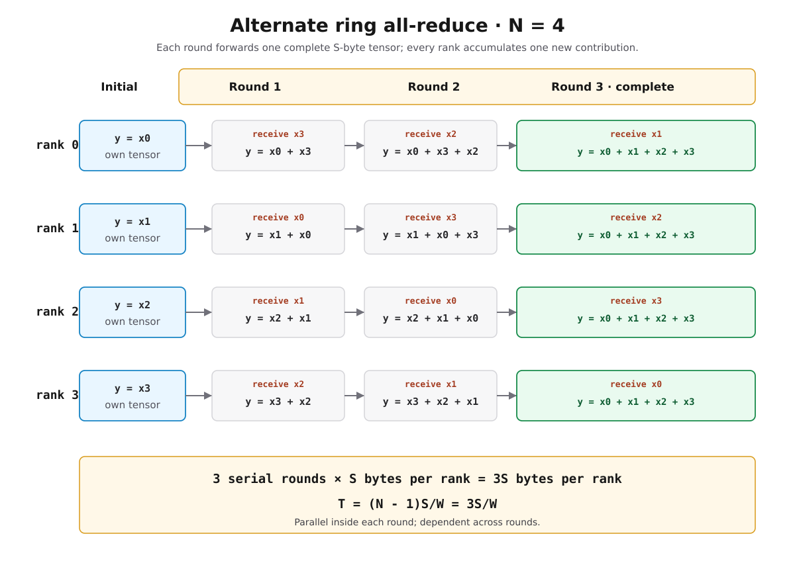
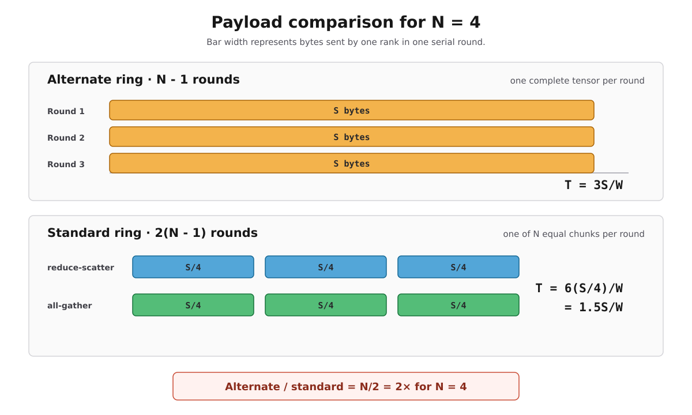

# Alternate Ring All-Reduce

## 1. 题目

有 $N$ 个 device，每个 device $i$ 持有一个大小为 $S$ 字节的完整 tensor $x^{(i)}$。每个 device 的 egress bandwidth 为 $W$。

题目给出的算法在第 $t=1,\ldots,N-1$ 轮中，让 device $i$：

1. 在第一轮前初始化 $y\leftarrow x^{(i)}$；
2. 向右侧 device $(i+1)\bmod N$ 发送一个完整的 $x^{((i-t+1)\bmod N)}$；
3. 从左侧 device $(i-1)\bmod N$ 接收一个完整的 $x^{((i-t)\bmod N)}$；
4. 将收到的 tensor 累加到 $y$。

问题是该算法需要多长时间。

## 2. 直接答案

$$ T_{\mathrm{alternate}}=(N-1)\frac{S}{W}. $$

一句话理由：算法共有 $N-1$ 个串行依赖轮次，每轮所有 device 虽然可以并行发送，但每个 device 都必须发送一个大小为 $S$ 的完整 tensor，因此每轮耗时为 $S/W$。

## 3. 为什么结果正确

device $i$ 初始拥有：

$$ y=x^{(i)}. $$

第 $t$ 轮收到：

$$ x^{((i-t)\bmod N)}. $$

当 $t$ 遍历 $1,\ldots,N-1$ 时，下标依次为：

$$ i-1,\ i-2,\ \ldots,\ i-(N-1)\pmod N. $$

这些下标恰好覆盖除 $i$ 以外的全部 $N-1$ 个 device，且每个只出现一次。因此算法结束后：

$$ y=x^{(i)}+\sum_{t=1}^{N-1}x^{((i-t)\bmod N)}=\sum_{j=0}^{N-1}x^{(j)}. $$

所以每个 device 最终都得到完整归约结果，满足 all-reduce 的输出语义。

*图 1：每个 rank 初始持有自己的 $x^{(i)}$，随后三轮各接收一个新的完整 tensor；轮内并行，轮间存在转发依赖。*

## 4. 时间推导

### 4.1 单轮时间

每轮中，所有 device 同时向右侧邻居发送数据。并行发送意味着不能把全体 device 的发送量 $NS$ 再串行相加；关键路径只看一个 device 在该轮必须发送多少数据。

本算法每个 device 每轮发送的是完整 tensor：

$$ V_{\mathrm{per\ step}}=S. $$

在每个 device 的 egress bandwidth 为 $W$ 的理想模型下：

$$ T_{\mathrm{per\ step}}=\frac{S}{W}. $$

### 4.2 总轮数

每个 device 初始已有自己的 tensor，还需要接收其他 $N-1$ 个 tensor，所以算法必须执行 $N-1$ 轮：

$$ K=N-1. $$

总时间为：

$$ T_{\mathrm{alternate}}=K\,T_{\mathrm{per\ step}}=(N-1)\frac{S}{W}. $$

## 5. 与标准 Ring All-Reduce 对比

经典 ring all-reduce 将完整 tensor 切成 $N$ 个大小为 $S/N$ 的 chunk：

1. $N-1$ 轮 reduce-scatter；
2. $N-1$ 轮 all-gather；
3. 每轮每个 device 只发送 $S/N$ 字节。

因此经典 ring 的理想时间为：

$$ T_{\mathrm{standard}}=2\frac{N-1}{N}\frac{S}{W}. $$

两种算法的时间比为：

$$ \frac{T_{\mathrm{alternate}}}{T_{\mathrm{standard}}}=\frac{N}{2}. $$

| Device 数量 $N$ | Alternate | 标准 ring | Alternate / 标准 ring |
|---:|---:|---:|---:|
| 2 | $S/W$ | $S/W$ | $1\times$ |
| 4 | $3S/W$ | $1.5S/W$ | $2\times$ |
| 8 | $7S/W$ | $1.75S/W$ | $4\times$ |

当 $N=2$ 时两者恰好相同；当 $N>2$ 时，alternate 算法因为每轮发送完整 tensor，带宽代价随 $N$ 线性增长。标准 ring 虽然执行两倍轮数，但每轮只发送 $1/N$ 大小的 chunk，所以总发送量趋近 $2S$。

*图 2：以 $N=4$ 为例，alternate 发送 $3$ 个完整 tensor；标准 ring 发送 $6$ 个四分之一 tensor，因此前者耗时是后者的 $2$ 倍。*

## 6. 具体例子：$N=4$

以 device 0 为例，初始：

$$ y=x^{(0)}. $$

三轮接收内容为：

| 轮次 $t$ | device 0 接收 | 更新后的 $y$ |
|---:|---|---|
| 1 | $x^{(3)}$ | $x^{(0)}+x^{(3)}$ |
| 2 | $x^{(2)}$ | $x^{(0)}+x^{(3)}+x^{(2)}$ |
| 3 | $x^{(1)}$ | $x^{(0)}+x^{(3)}+x^{(2)}+x^{(1)}$ |

每轮发送完整的 $S$ 字节，因此：

$$ T=3\frac{S}{W}. $$

而标准 4-device ring 有 6 轮、每轮发送 $S/4$：

$$ T_{\mathrm{standard}}=6\frac{S/4}{W}=\frac{3}{2}\frac{S}{W}. $$

## 7. 常见误区

### 7.1 错误地除以 $N$

所有 device 并行发送只意味着一轮时间由单个 device 的 $S/W$ 决定，不意味着单个 device 的完整 tensor 自动变成 $S/N$。只有显式切成 $N$ 个 chunk，才能得到每轮 $S/N$ 的带宽项。

### 7.2 错误地乘以 $N$

也不能把一轮中全体 device 的发送量 $NS$ 除以单个 device 的带宽 $W$。题目给的是每个 device 独立的 egress bandwidth，所有 device 可以同时发送，所以理想轮次时间仍是 $S/W$。

### 7.3 忽略轮次依赖

虽然同一轮中的发送并行，但第 $t+1$ 轮需要转发前面收到的数据，因此 $N-1$ 轮位于同一条串行关键路径，不能再并行压缩成一轮。

## 8. 加入固定延迟后的扩展

handout 只要求带宽模型。如果每轮还要支付固定启动延迟 $\alpha$，则可扩展为：

$$ T_{\mathrm{alternate}}\approx(N-1)\left(\alpha+\frac{S}{W}\right). $$

经典 ring 对应：

$$ T_{\mathrm{standard}}\approx2(N-1)\alpha+2\frac{N-1}{N}\frac{S}{W}. $$

alternate 算法轮数更少，但发送字节更多，因此只可能在消息极小、固定延迟远大于带宽时间的特殊情况下具有阶段数优势；对大 tensor，其带宽代价明显更高。
