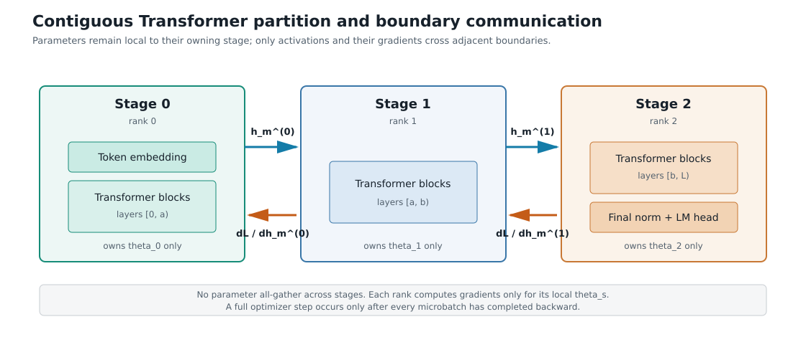
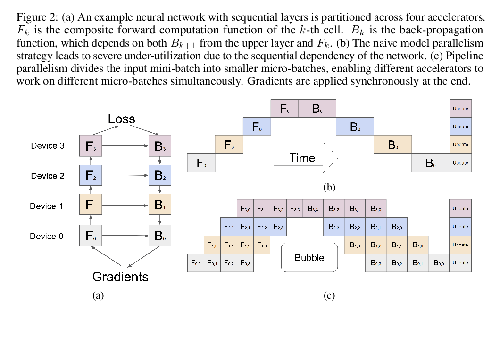
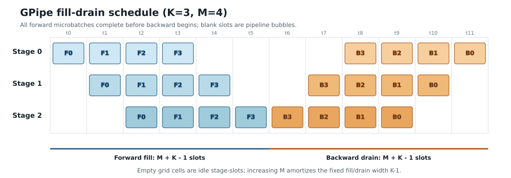
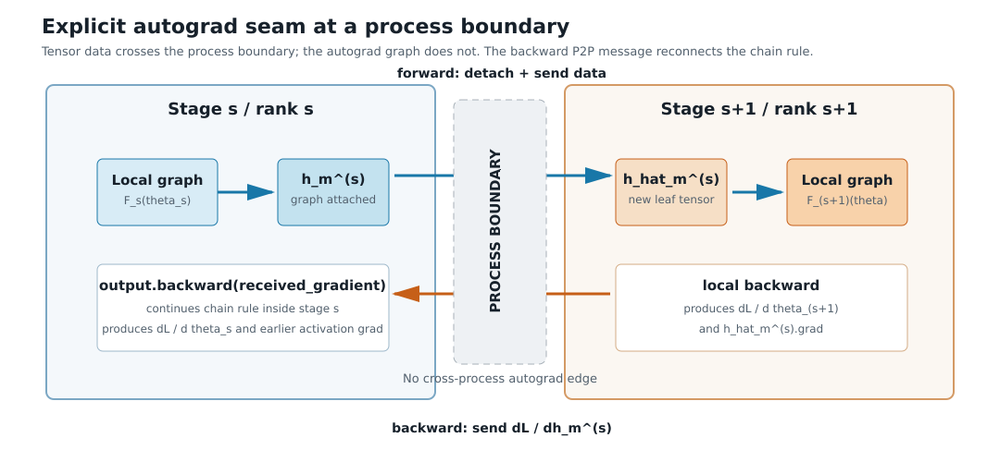
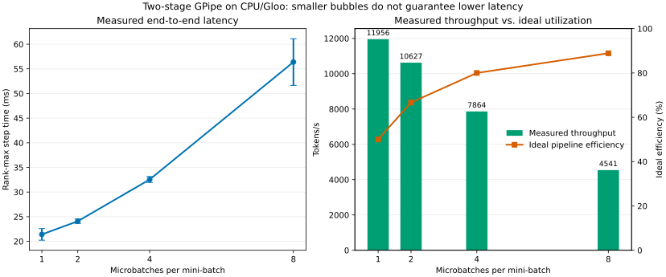
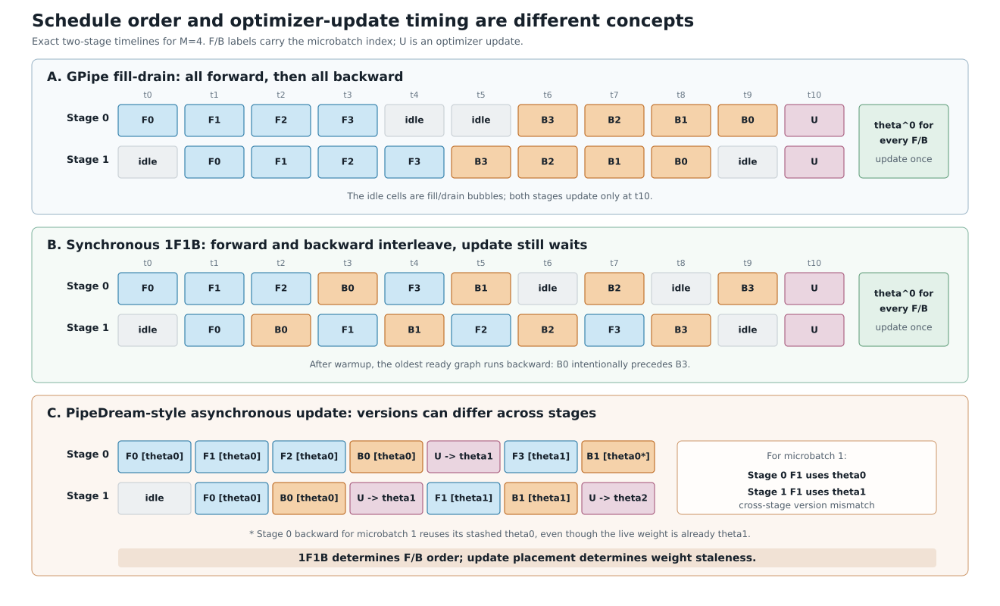

# 流水线并行入门：从同步语义到 GPipe 实现

## 摘要

流水线并行（Pipeline Parallelism，PP）把模型的连续层分配给多个流水线阶段（stage），再把一个 mini-batch 拆成多个微批次（microbatch），使不同 stage 能同时处理不同 microbatch。本文为 `TransformerLM` 实现同步 GPipe：采用填充—排空（fill-drain）调度，先完成所有 microbatch 的前向传播，再按逆序完成反向传播，最后统一更新参数。

实现的关键不在模型切片本身，而在于跨进程恢复反向传播：前向阶段发送 activation，反向阶段返回对应的 activation gradient，从而连接各 stage 的局部 autograd graph。正确性测试表明，在 2-stage 和 3-stage 配置下，PP 与非并行模型经过两步训练后的 loss 和全部参数一致。2-rank CPU/Gloo 实验中，microbatch 数从 1 增至 8 时，理论利用率由 50.00% 升至 88.89%，但 step time 由 `21.413 ms` 增至 `56.380 ms`；这说明 bubble 减少并不保证实际加速。对 FP32 `xl` 模型的静态核算则得到约 `25.383 GiB/stage` 的 parameter、gradient 与 AdamW moments。

## 1. 阅读目标与实现范围

本文围绕四个逐步深入的问题展开：

1. 模型如何被切成多个 stage，microbatch 又如何流经这些 stage？
2. 跨进程后 autograd graph 被截断，反向梯度如何传回前一个 stage？
3. PP 如何改变模型状态内存、activation 内存和通信量？
4. 为什么增加 microbatch 可以减少 bubble，却不保证训练更快？

全文先建立计算模型和性能公式，再映射到代码，最后用正确性测试和实验数据验证。第 8 节集中回答 DDP/FSDP、blocking P2P 和 1F1B 等常见延伸问题，不影响前七节的入门主线。

本实现刻意限定为同步 GPipe fill-drain，而不是完整的生产级 pipeline runtime。它支持连续 Transformer block 分区、2 到 $L$ 个 stage、等大小 microbatch、相邻 rank P2P，以及一个 mini-batch 内的梯度累积。计时、内存核算、结果序列化与基线参数对比均位于核心训练路径之外。

## 2. 从完整模型到流水线

本文统一使用以下记号：

| 记号 | 含义 |
|---|---|
| $L$ | Transformer block 总数 |
| $K$ | Pipeline stage 数；当前实现中也等于 rank 数 |
| $s$ | Stage 索引，$s\in\{0,\ldots,K-1\}$ |
| $B$ | 一个 mini-batch 的样本数 |
| $M$ | 一个 mini-batch 切分出的 microbatch 数 |
| $m$ | Microbatch 索引，$m\in\{0,\ldots,M-1\}$ |
| $d$ | Stage 边界 hidden state 的特征维度 |
| $b$ | 每个 activation 元素占用的字节数 |
| $P_s$ | Stage $s$ 持有的参数元素数 |

常用并行术语如下：

| 术语 | 含义 |
|---|---|
| rank | 一个分布式进程的编号；本文让一个 rank 负责一个 stage |
| P2P | Point-to-point，相邻 rank 之间的一发一收通信 |
| DDP | Distributed Data Parallel，每个 rank 保存完整模型副本的数据并行 |
| FSDP | Fully Sharded Data Parallel，将模型状态分片的数据并行 |
| TP | Tensor Parallelism，把单个算子的 tensor 计算拆到多个设备 |
| GPipe | 采用 microbatch 和同步 fill-drain 调度的流水线并行方法 |

### 2.1 模型如何分成多个 Stage

设完整网络由 $L$ 个顺序层构成，并被划分为 $K$ 个连续 stage：

$$ F(x;\theta)=F_{K-1}\left(\cdots F_1\left(F_0(x;\theta_0);\theta_1\right)\cdots;\theta_{K-1}\right). $$

不同 stage 的参数集合互不相交。对 TransformerLM，stage 0 额外持有 token embedding，stage $K-1$ 额外持有 final RMSNorm 和 `lm_head`。

令 $q=\lfloor L/K\rfloor$、$r=L\bmod K$。本实现使前 $r$ 个 stage 各持有 $q+1$ 层，其余 stage 各持有 $q$ 层。该策略保证层数最多相差 1，但并不保证浮点运算量（FLOPs）或显存完全均衡。



**图 1：** 参数只驻留在所属 stage；forward 发送 activation，backward 发送对应的 activation gradient。

### 2.2 Microbatch 如何流经各 Stage

将大小为 $B$ 的 mini-batch 等分为 $M$ 个 microbatch，每个 microbatch 大小为 $B/M$。记 microbatch $m$ 在 stage $s$ 的输出为 $h_m^{(s)}$：

$$ h_m^{(s)}=F_s\left(h_m^{(s-1)};\theta_s\right),\qquad s=0,\ldots,K-1. $$

前向阶段只需要把 $h_m^{(s)}$ 发送给相邻 stage $s+1$。反向阶段则沿相反方向发送 $\nabla_{h_m^{(s)}}L$。参数梯度始终由拥有该参数的 stage 本地计算，因此纯 PP 不需要跨 stage 对参数梯度执行 all-reduce。

例如 $B=8$、$M=4$ 时，每个 microbatch 包含 2 个样本。Stage 0 计算 microbatch 0 后把 activation 发给 stage 1，随即开始计算 microbatch 1；与此同时，stage 1 可以处理刚收到的 microbatch 0。这种“相邻 stage 同时处理不同 microbatch”就是流水线重叠。

### 2.3 为什么 Microbatch 梯度仍然等价

设 `loss_fn` 返回每个等大小 microbatch 的平均 loss $L_m$。实现实际反向传播的是 $L_m/M$，所以一个 mini-batch 结束后的本地参数梯度为：

$$ \nabla_{\theta_s}L=\nabla_{\theta_s}\left(\frac{1}{M}\sum_{m=0}^{M-1}L_m\right)=\frac{1}{M}\sum_{m=0}^{M-1}\nabla_{\theta_s}L_m. $$

这与在完整 batch 上计算平均 loss 后一次 backward 的梯度相同。若 microbatch 大小不相等，权重必须从 $1/M$ 改为各 microbatch 样本数占比。所有 microbatch 使用同一版本参数，且 optimizer 只在整个 mini-batch 的 backward 完成后更新一次，因此该同步 schedule 不产生 weight staleness。

上述等价性依赖三个前提：microbatch 大小相等、loss 使用相同归约语义、模型不存在依赖整个 batch 统计量的运算。GPipe [1] 同样采用 mini-batch 末尾统一更新以保持同步训练语义，并指出 BatchNorm 一类跨样本算子需要额外处理；本实验的 Transformer 使用 RMSNorm，不存在这一问题。由于浮点归约次序可能不同，这里声称的是数学等价与容差内数值等价，而不是逐 bit 相同。

## 3. 性能与内存模型

### 3.1 Bubble 从哪里来



**图 2：** GPipe 原论文 Figure 2 [1]。子图 (b) 展示无 microbatch 时的严重空闲，子图 (c) 展示 microbatch pipeline 与同步更新。

假设所有 stage 的单个 microbatch forward 时间均为 $t_f$，backward 时间均为 $t_b$，并暂时忽略通信。第一个 microbatch 必须依次走过 $K$ 个 stage，之后每增加一个 microbatch，只需再增加一个流水线时隙。因此，$M$ 个 microbatch 的 forward 共需 $K+(M-1)=M+K-1$ 个时隙；backward 同理：

$$ T_{\mathrm{pipe}}\approx(M+K-1)(t_f+t_b). $$

若在单设备上顺序执行相同计算，总时间约为 $MK(t_f+t_b)$。用单设备时间除以流水线时间可得理想 speedup，再除以设备数 $K$ 可得平均设备利用率：

$$ S_{\mathrm{ideal}}=\frac{MK}{M+K-1},\qquad \eta_{\mathrm{ideal}}=\frac{S_{\mathrm{ideal}}}{K}=\frac{M}{M+K-1}. $$

每个 stage 真正工作的有效时隙有 $M$ 个，额外的 $K-1$ 个时隙来自 pipeline 填充和排空。对应 bubble fraction 为：

$$ f_{\mathrm{bubble}}=\frac{K-1}{M+K-1}. $$



**图 3：** 本文使用的 fill-drain 状态机。空白 stage-slot 是 bubble；增大 $M$ 只摊薄固定的 $K-1$ 个 fill/drain 宽度。

该模型与 GPipe 对 bubble 的分析一致 [1, §2.3]，表达的是调度上限，而不是真实性能预测。只要 stage 不平衡、microbatch 的矩阵乘法（GEMM）效率下降或 P2P latency 不可忽略，实测效率就会低于该上限。

### 3.2 边界通信量如何计算

设 stage 边界 activation 的逻辑 shape 为 `(B, S, d)`，元素宽度为 $b$ 字节。一个 microbatch 的 activation 大小为 $BSdb/M$。每个边界在完整 mini-batch 中分别发送一次 forward activation 和一次 backward activation gradient：

$$ V_{\mathrm{boundary}}=2M\frac{B S d b}{M}=2B S d b. $$

因此，在 batch、sequence length 和 hidden dimension 固定时，microbatch 数不改变通信总字节量，却会把每个方向的一条消息拆成 $M$ 条消息。全 pipeline 的聚合边界流量为 $2(K-1)B S d b$，消息数为 $2M(K-1)$。增加 $M$ 的收益是降低 bubble，代价是更高的固定消息开销和更小的计算粒度。

### 3.3 模型状态占多少内存

设 stage $s$ 持有 $P_s$ 个 FP32 参数元素。AdamW 训练期间，四组主要张量长期驻留：

| 状态 | 元素数 | 作用 |
|---|---:|---|
| Parameter | $P_s$ | 当前模型参数 |
| Gradient | $P_s$ | 当前 mini-batch 的参数梯度 |
| First moment | $P_s$ | AdamW 的梯度滑动平均 |
| Second moment | $P_s$ | AdamW 的平方梯度滑动平均 |

因此，忽略标量 step 与 allocator 开销时：

$$ \mathcal{M}_{\mathrm{persistent}}^{(s)}=4P_s\times4\ \mathrm{bytes}=16P_s\ \mathrm{bytes}. $$

PP 不复制其他 stage 的模型状态，所以峰值由参数最多的 stage 决定，而不是由总参数量决定。与 FSDP 不同，PP 不需要在计算前 all-gather weight；每层完整 weight 始终驻留在所属 stage。

### 3.4 Activation 为什么仍然占内存

PP 只切分模型状态，不会自动消除 activation。对局部函数 $y=F_s(x;\theta_s)$，参数梯度依赖 forward 输入和中间结果；即使 $y$ 已发送给下一 stage，本 stage 仍需保存局部 autograd graph，直到该 microbatch 的 backward 到达。

当前 fill-drain 实现在 backward 开始前完成所有 microbatch 的 forward，因此这时每个 stage 都保存着多个尚未反向传播的局部计算图。固定完整 batch 时，将 batch 切成更多 microbatch 并不会使 activation 元素总量按 $M$ 线性增长，因为单个 microbatch 大小同时按 $1/M$ 缩小；但 Python 对象、allocator fragmentation 和算子 workspace 仍可能变化。

GPipe 原论文进一步结合 rematerialization（反向传播时重新计算前向结果），只保留 partition 边界 activation [1, §2.3]。在层和 activation 大小近似均匀时，忽略单个样本 activation 的常数因子，论文给出的单 stage activation 空间量级为 $O(B+(L/K)(B/M))$，而不做 rematerialization 时约为 $O((L/K)B)$。本文没有实现该优化，因此静态模型状态核算不能视为真实峰值内存；完整峰值还必须包含保存的 activation、P2P buffer、运行时 workspace 和 allocator reserved memory。

## 4. 系统设计与实现

### 4.1 接口与调用方式

核心实现位于 [`pipeline_parallel.py`](file:///home/dengxiao.cs/code_repos/institutionalized/stanford_cs336/assignments/assignment2-systems/cs336_systems/pipeline_parallel.py)，对调用方暴露两个主要模块：

- `TransformerPipelineStage`：表示一个 rank 拥有的局部模型；
- `PipelineParallel`：执行一个同步 mini-batch 的 forward/backward 调度。

最小可运行例子见 [`train_pipeline_parallel.py`](file:///home/dengxiao.cs/code_repos/institutionalized/stanford_cs336/assignments/assignment2-systems/scripts/train_pipeline_parallel.py)。它不包含 benchmark 或 baseline diff，只组装一个两 stage、四 microbatch 的 PP 训练：

```bash
uv run python scripts/train_pipeline_parallel.py
```

脚本中真正属于训练循环的核心只有：

```python
optimizer.zero_grad(set_to_none=True)
loss = pipeline.forward_backward(
    input_ids,
    targets,
    loss_fn=loss_fn,
    num_microbatches=num_microbatches,
)
optimizer.step()
```

`forward_backward()` 内部完成 microbatch 切分、forward activation P2P、反向 activation-gradient P2P 和本地参数梯度累积。将 optimizer 生命周期留在接口外部有两个作用：其一，核心调度不绑定具体 optimizer；其二，一次 optimizer step 与一个同步 mini-batch 的边界保持显式。

### 4.2 模型所有权与构造路径

[`balanced_layer_partition`](file:///home/dengxiao.cs/code_repos/institutionalized/stanford_cs336/assignments/assignment2-systems/cs336_systems/pipeline_parallel.py#L31-L54) 只计算连续层区间，不创建模型。`TransformerPipelineStage` 提供两条构造路径：

- [`from_model`](file:///home/dengxiao.cs/code_repos/institutionalized/stanford_cs336/assignments/assignment2-systems/cs336_systems/pipeline_parallel.py#L108-L129) 复用已有完整模型中属于本 stage 的模块对象，适合正确性对比和已有 checkpoint；若要获得内存节省，调用方必须随后释放原完整模型；
- [`from_dimensions`](file:///home/dengxiao.cs/code_repos/institutionalized/stanford_cs336/assignments/assignment2-systems/cs336_systems/pipeline_parallel.py#L132-L171) 只实例化本 rank 所需模块，避免真实训练时先在每个设备上分配完整模型。

局部 blocks 使用全局层号作为 `ModuleDict` key。因此 stage state dict 仍保留 `layers.0.*`、`layers.17.*` 等全局名称，不需要额外的 key 重写即可合并分片 checkpoint。

### 4.3 如何跨进程衔接 Autograd

`dist.send()` 只传输 tensor 数据，不会跨进程传输 autograd graph。实现因而在发送端执行 `output.detach()`，并在接收端将 activation 设置为新的 leaf tensor。这个显式连接点可称为 autograd seam。设 stage $s+1$ 接收到的 leaf 为 $\widehat h_m^{(s)}$：

1. stage $s+1$ 本地 backward 得到 $\nabla_{\widehat h_m^{(s)}}L$；
2. 该梯度被发送回 stage $s$；
3. stage $s$ 调用 `h_m^{(s)}.backward(gradient)`；
4. PyTorch 继续在 stage $s$ 的局部计算图中应用链式法则。

这条显式 activation-gradient 通道就是两个局部 autograd graph 之间的 seam。它对应 [`_forward_microbatch`](file:///home/dengxiao.cs/code_repos/institutionalized/stanford_cs336/assignments/assignment2-systems/cs336_systems/pipeline_parallel.py#L250-L276)、[`_receive_input_activation`](file:///home/dengxiao.cs/code_repos/institutionalized/stanford_cs336/assignments/assignment2-systems/cs336_systems/pipeline_parallel.py#L278-L287) 和 [`_backward_microbatch`](file:///home/dengxiao.cs/code_repos/institutionalized/stanford_cs336/assignments/assignment2-systems/cs336_systems/pipeline_parallel.py#L289-L301)。



**图 4：** Forward 只发送 detached tensor data；接收端生成 leaf tensor。Backward 再把该 leaf 的 gradient 发送回前一 stage。

### 4.4 代码中的 Fill-drain 调度

[`forward_backward`](file:///home/dengxiao.cs/code_repos/institutionalized/stanford_cs336/assignments/assignment2-systems/cs336_systems/pipeline_parallel.py#L210-L235) 的算法可写为：

```text
for microbatch m = 0 ... M-1:
    stage 0: use token IDs
    stage s > 0: recv activation from stage s-1
    run local forward
    stage s < K-1: send detached activation to stage s+1
    stage K-1: compute loss / M

for microbatch m = M-1 ... 0:
    stage K-1: backward(loss_m / M)
    stage s < K-1: recv activation gradient from stage s+1
                     backward(local_output, received_gradient)
    stage s > 0: send local input-activation gradient to stage s-1
```

逆序 backward 不是数值正确性的必要条件，因为不同 microbatch 的计算图彼此独立；它与 GPipe 的 drain 顺序一致，也使最近创建的 autograd graph 最先释放。

### 4.5 状态不变量与失败模式

实现依赖以下不变量：

1. process-group world size 等于 stage 数，且 rank 等于 stage index；
2. 每个 rank 使用相同的 batch shape、microbatch 数和调用顺序；
3. batch size 能被 $M$ 整除；
4. 相邻 stage 对 activation shape 和 dtype 的判断一致；
5. 所有 rank 在一个 step 中执行相同数量、相同顺序的 send/recv；
6. optimizer 只能在所有 microbatch backward 完成后更新。

其中第 5 条是阻塞式 P2P 的核心安全条件。任一 rank 在通信序列中提前异常，其他 rank 都可能停在 send/recv 上，因此配置校验必须在开始通信前完成。

### 4.6 关注点分离

核心 PP 文件不包含计时、进程常驻内存（RSS）/CUDA memory 采样、结果聚合或参数对比。实验逻辑集中在 [`pipeline_parallel_accounting.py`](file:///home/dengxiao.cs/code_repos/institutionalized/stanford_cs336/assignments/assignment2-systems/cs336_systems/pipeline_parallel_accounting.py)，命令行入口与重复调度位于 [`benchmark_pipeline_parallel.py`](file:///home/dengxiao.cs/code_repos/institutionalized/stanford_cs336/assignments/assignment2-systems/scripts/benchmark_pipeline_parallel.py)。这种分离使训练路径的行为由少量接口和不变量定义，而测量方法可以独立修改。

## 5. 正确性论证与测试

### 5.1 局部反向传播的等价性

考虑相邻 stage $s$ 与 $s+1$。发送端保存带本地计算图的 $h_m^{(s)}$，接收端对其数据副本 $\widehat h_m^{(s)}$ 建立新的局部图。接收端计算出的 $\nabla_{\widehat h_m^{(s)}}L$ 与单进程图中该边界上的梯度数值相同；将它作为 `h_m^{(s)}.backward()` 的外部梯度后，链式法则恢复 stage $s$ 的参数梯度。对 stage 从后向前归纳，即可恢复完整模型 backward。

再结合第 2.3 节的 $1/M$ loss 缩放，每个 stage 累积得到完整 mini-batch 的平均梯度。因此，在参数初始化、输入和 optimizer 超参数相同的条件下，一次 PP 更新与非并行更新等价。

### 5.2 测试设计

[`test_pipeline_parallel.py`](file:///home/dengxiao.cs/code_repos/institutionalized/stanford_cs336/assignments/assignment2-systems/tests/test_pipeline_parallel.py) 没有只比较单次输出，而是执行以下验证：

1. 检查 7 层在 3 个 stage 上被划分为 `[0,3)`、`[3,5)`、`[5,7)`；
2. 检查非法 stage 数、layer 数与 stage index；
3. 分别使用 2-stage 和 3-stage、4 个 microbatch 训练两步；
4. 每步比较 PP loss 与完整模型 loss；
5. 合并所有 stage 的 state dict，并逐参数比较更新结果。

两步参数比较同时覆盖了 forward activation、跨进程 backward、$1/M$ loss 缩放、梯度累积和 optimizer 更新后的下一轮状态。Accounting 测试另行验证参数总量守恒、stage 不均衡度、通信字节公式和理论 bubble。

测试命令为：

```bash
CUDA_VISIBLE_DEVICES="" OMP_NUM_THREADS=1 MKL_NUM_THREADS=1 \
uv run pytest -q \
  tests/test_pipeline_parallel.py \
  tests/test_pipeline_parallel_accounting.py
```

连续执行 5 轮，每轮均为 `13 passed`。

## 6. 实验方法

### 6.1 实验要验证什么

实验对应前三节的三个直接结论：

1. 各 stage 的参数量之和应等于完整模型参数量；对于结构均匀的 Transformer，两 stage 的参数量应接近。
2. 固定 batch shape 时，改变 microbatch 数 $M$ 不应改变 stage 边界的总通信字节数。
3. 增大 $M$ 会减少理论 bubble，但在小型 CPU 模型上，更多小消息和更小的矩阵计算可能抵消这一收益。

### 6.2 环境与控制变量

| 项目 | 设置 |
|---|---|
| CPU | Intel Xeon Platinum 8336C @ 2.30 GHz |
| Python / PyTorch | 3.13.12 / 2.11.0+cu130 |
| 通信后端 / ranks | Gloo（CPU 分布式通信后端）/ 2 |
| CPU threads | 每 worker 1 |
| 模型 | $d_{\mathrm{model}}=64$、$d_{\mathrm{ff}}=128$、4 layers、4 heads |
| vocabulary / context | 256 / 32 |
| global batch | 8 |
| 自变量 | $M\in\{1,2,4,8\}$ |
| warmup / measurement | 3 / 10 steps |
| repeats | 3 个隔离进程组 |

每种设置记录两 rank 中较慢者的 step time。设置的执行顺序使用固定种子随机化，以减弱温度、后台负载和先后顺序的系统性偏差。每种设置独立运行 3 次；每次先对 10 个 step 求均值，表格再报告 3 个均值的平均值和总体标准差。

### 6.3 复现命令

```bash
CUDA_VISIBLE_DEVICES="" \
OMP_NUM_THREADS=1 MKL_NUM_THREADS=1 OPENBLAS_NUM_THREADS=1 \
uv run python scripts/benchmark_pipeline_parallel.py \
  --backend gloo \
  --world-size 2 \
  --model-size small \
  --d-model 64 \
  --d-ff 128 \
  --num-layers 4 \
  --num-heads 4 \
  --vocab-size 256 \
  --global-batch-size 8 \
  --context-length 32 \
  --microbatches 1 2 4 8 \
  --warmup-steps 3 \
  --measurement-steps 10 \
  --repeats 3 \
  --num-threads 1 \
  --output-dir benchmark_results/pipeline_parallel/cpu_gloo_final2_20261003
```

结构化结果见 [`cpu_gloo_summary.json`](./assets/pipeline_parallel/cpu_gloo_summary.json)，环境和源码哈希见 [`provenance.json`](./assets/pipeline_parallel/provenance.json)。

## 7. 实验结果

### 7.1 `xl` 静态模型状态

参考配置为 $d_{\mathrm{model}}=2560$、$d_{\mathrm{ff}}=10240$、32 层、32 heads、vocabulary 10,000，采用 FP32 参数和 AdamW：

| stage | 所属模块 | 参数量 | 参数内存 | parameter + gradient + moments |
|---|---|---:|---:|---:|
| 0 | embedding + layers `[0,16)` | 1,703,403,520 | 6.345673 GiB | 25.382690 GiB |
| 1 | layers `[16,32)` + final norm + lm head | 1,703,406,080 | 6.345682 GiB | 25.382729 GiB |

两个 stage 合计 3,406,809,600 个参数，与完整模型一致；参数内存不均衡比为 `1.0000015`。差异只有 2,560 个参数，即最后一个 RMSNorm weight。由于 embedding 与 `lm_head` 大小相同，本配置按层数均分恰好也近似实现了参数量均衡。

不过，`25.383 GiB/stage` 已超过 24 GiB，且尚未计入 activation、通信 buffer、CUDA context 和 allocator fragmentation。因此两张 24 GiB GPU 仍不足以用纯 FP32 AdamW 训练该 `xl` 配置；需要更多 stage、低精度状态、offload，或与其他并行策略组合。

### 7.2 `xl` 边界通信

取 global batch 8、sequence length 512、hidden dimension 2560 和 FP32 activation，一个 stage 边界每个 mini-batch 的通信为：

```text
forward activation:           40 MiB
backward activation gradient: 40 MiB
双向合计:                     80 MiB
```

该结果对 $M=1$ 和 $M=8$ 相同，与第 3.2 节的通信量公式一致。变化的是消息数：每个方向从 1 条变为 8 条。

### 7.3 CPU/Gloo step time

| microbatches $M$ | microbatch size | 理想利用率 | step mean ± repeat std | tokens/s | 相对 $M=1$ |
|---:|---:|---:|---:|---:|---:|
| 1 | 8 | 50.00% | 21.413 ± 1.175 ms | 11,956 | 内部对照 |
| 2 | 4 | 66.67% | 24.091 ± 0.445 ms | 10,627 | 慢 12.51% |
| 4 | 2 | 80.00% | 32.554 ± 0.605 ms | 7,864 | 慢 52.03% |
| 8 | 1 | 88.89% | 56.380 ± 4.734 ms | 4,541 | 慢 163.30% |



**图 5：** 理论利用率随 $M$ 增大，但实测吞吐下降，说明理想 bubble 模型遗漏了 microbatch kernel efficiency 与消息 latency。

理论利用率单调提高，而吞吐单调下降。这里不存在矛盾：$\eta_{\mathrm{ideal}}$ 只描述均衡、零通信成本、固定 microbatch kernel 效率条件下的 pipeline occupancy；实测 step time 同时包含矩阵计算效率、P2P latency、Python 调度和 autograd 启动成本。

当 $M$ 从 1 增加到 8 时，microbatch size 从 8 降至 1。`d_model=64` 的矩阵已经很小，进一步切分使 GEMM 更难有效利用 CPU；同时每个方向的消息数增加 8 倍。当前 blocking `send/recv` 也没有在同一 stage 内显式重叠通信。因而，bubble 收益不足以抵消粒度损失。

### 7.4 运行时内存观测

以 $M=4$ 的一个 repeat 为例：

| stage | parameter | backward 后 gradient | AdamW moments |
|---|---:|---:|---:|
| 0 | 394,240 B | 394,240 B | 788,480 B |
| 1 | 394,496 B | 394,496 B | 788,992 B |

张量字节数与静态公式完全一致。观测到的 RSS 约为 600 MiB，主要来自 Python、PyTorch runtime、通信库与 allocator，不能用于估计这个微型模型的参数节省。

本实验没有在 forward 峰值处采样 activation，因此该表只验证 persistent model state，不支持关于 peak activation memory 的经验结论。

## 8. 常见问题与延伸阅读（可选）

### 8.1 PP 与 FSDP 的取舍

两路 PP 和两路 FSDP 都能把理想 persistent model state 降到约完整模型的一半，但机制不同。FSDP 在每个 rank 上运行完整网络的一份数据分片，并为每个 shardable weight 执行两次 all-gather 和一次 gradient reduce-scatter；PP 让每个 rank 只运行一部分层，并在 stage 边界交换 activation。

当 activation 边界远小于模型 weight 时，PP 的通信量可能更有优势；当 stage 难以平衡、microbatch 太少或 activation 很大时，pipeline bubble 与 P2P 会成为瓶颈。

FSDP 本身属于数据并行：各 rank 处理不同数据，逻辑上执行同一模型，区别只是 parameter、gradient 和 optimizer state 没有像 DDP 那样完整复制，而是分片驻留。因此更准确的组合写法是 `PP × (DDP/FSDP) × TP`：在数据并行维度选择 DDP 或 FSDP，而不是把 DDP 与 FSDP 当成两个独立维度叠加。

例如 8 张 GPU 可以组织成 4-way PP 和 2-way data parallel。每条 pipeline 包含 4 个 stage；两条 pipeline 处理不同的 mini-batch shard。两条 pipeline 中位置相同的 stage 构成一个 data-parallel group：若该 stage 能完整放入单卡，就使用 DDP；若仍然过大，就使用 FSDP，使这个 stage 的模型状态在两个对应 rank 间分片。还可以在单个 stage 内继续使用 TP。

有些资料确实会写成“FSDP + replicated DP”，通常指 hybrid sharding：先在一个较小 group 内用 FSDP 分片，再让多个 shard group 处理不同数据并保持副本同步。这仍然是分层的数据并行拓扑，并不是在同一个 process group 上重复执行两套等价的梯度同步。

### 8.2 实现复杂度从哪里来

核心 PP 文件为 302 行，直接组装训练的示例为 98 行；其余 accounting、benchmark、绘图和测试都不属于训练主链路。LOC 只能说明实现表面积，不能直接代表算法难度。PP 真正的复杂性来自三个状态空间的乘积：

1. stage 位置决定收发方向；
2. microbatch 位置决定当前保存哪张 autograd graph；
3. schedule phase 决定执行 forward、backward 还是 optimizer step。

当前 fill-drain 把 phase 分为两个完整区间，因此状态机仍然简单。1F1B 会让 forward/backward 在 steady state 交错，并引入 warmup、steady、cooldown 三段；异步 P2P、virtual stages 和 DP 组合还会进一步扩大通信匹配与生命周期管理的复杂度。

### 8.3 为什么本实现选择 Blocking P2P

这里的 blocking P2P 指 `dist.send()` 和 `dist.recv()`：调用方不会像 `dist.isend()`、`dist.irecv()` 那样立即得到一个 `Work` handle 并继续调度后续操作，而是在当前通信调用取得进展后才返回 Python 控制流。具体的设备完成语义取决于 backend，但从本实现的调度器视角看，通信与下一条 Python 指令之间存在明确的先后关系。

#### 8.3.1 Blocking 不等于整条 pipeline 串行

以三个 stage 为例，stage 0 完成 microbatch 0 的 forward 后调用 `send(h_0)`；stage 1 预先进入对应的 `recv(h_0)`。一旦这对 send/recv 匹配，stage 0 可以继续计算 microbatch 1，而 stage 1 同时计算 microbatch 0。因此，不同 stage 之间仍然存在 pipeline overlap。

Blocking 限制的是**同一个 stage 内的通信—计算重叠**：stage 0 必须等当前 `send(h_0)` 返回后，才能启动 microbatch 1 的本地计算。异步实现则可以先发起 `isend(h_0)`，只要保证发送 buffer 在通信完成前不被复用，就能更早启动后续计算。

#### 8.3.2 它简化了哪些状态

当前实现中，每个 rank 的通信序列可以用概念三元组 `(phase, microbatch_index, operation)` 描述。它不是代码中实际创建的 tuple，而是用于分析通信顺序的状态坐标：

| 分量 | 定义域 | 含义 |
|---|---|---|
| `phase` | `{forward, backward}` | 当前处于前向填充阶段还是反向排空阶段 |
| `microbatch_index` | $\{0,1,\ldots,M-1\}$ | 当前消息属于哪个 microbatch |
| `operation` | `{recv_prev, send_next, recv_next, send_prev}` | 本 rank 执行的 P2P 操作及 peer 方向 |

对 stage $s$，`prev` 表示 rank $s-1$，`next` 表示 rank $s+1$。并非所有笛卡尔积组合都合法：

- Forward 按 $m=0,1,\ldots,M-1$ 执行；若 $s>0$，先执行 `(forward, m, recv_prev)`；若 $s<K-1$，本地计算后执行 `(forward, m, send_next)`。
- Backward 按 $m=M-1,\ldots,1,0$ 执行；若 $s<K-1$，先执行 `(backward, m, recv_next)`；若 $s>0$，本地 backward 后执行 `(backward, m, send_prev)`。
- 首 stage 没有 `recv_prev` 和 `send_prev`；末 stage 没有 `send_next` 和 `recv_next`。

因此，给定 stage index、$K$ 和 $M$ 后，本 rank 的全部通信调用及其顺序就被唯一确定：

```text
forward:
  recv activation -> local compute -> send activation

backward:
  recv output gradient -> local backward -> send input gradient
```

同步调用返回后，调度器可以直接认为当前 buffer 已经不再需要由 Python 侧追踪。实现因而不需要维护：

1. pending send/recv 的 `Work` handle；
2. 尚未完成通信的 activation buffer 生命周期；
3. 可以复用哪个 buffer slot 的状态；
4. CUDA communication stream 与 compute stream 之间的 event；
5. 某个 microbatch 在 wait、ready、running 或 completed 中的异步状态。

这使 [`_forward_microbatch`](file:///home/dengxiao.cs/code_repos/institutionalized/stanford_cs336/assignments/assignment2-systems/cs336_systems/pipeline_parallel.py#L250-L276) 和 [`_backward_microbatch`](file:///home/dengxiao.cs/code_repos/institutionalized/stanford_cs336/assignments/assignment2-systems/cs336_systems/pipeline_parallel.py#L289-L301) 可以直接按程序顺序表达数据依赖，也使正确性测试更容易定位到具体 microbatch。

#### 8.3.3 代价与死锁条件

Blocking P2P 有三项主要代价：

1. sender 在 send 返回前不能启动本 stage 的下一项计算，通信尾部直接暴露在关键路径上；
2. 多条小消息不能自然地合并、预取或批量等待，P2P latency 更容易主导小 microbatch；
3. 所有 rank 必须以兼容顺序调用 send/recv，否则会形成环形等待。

例如 stage 0 正在等待 stage 1 接收 microbatch 0，但 stage 1 错误地先等待来自 stage 2 的 backward gradient，两边都无法继续，程序就会 deadlock。这也是第 4.5 节要求所有 rank 使用相同 batch shape、microbatch 数和 phase 顺序的原因。

#### 8.3.4 生产实现如何改进

更高性能的实现通常会预先发布 `irecv()`，使用 `isend()` 返回的 `Work` handle 追踪完成状态，并为多个 in-flight microbatch 建立 ring buffer。只有当某项计算真正依赖通信结果，或者一个 buffer 即将被复用时，调度器才调用 `wait()`。在 CUDA 上还需要处理 communication stream、compute stream、event 和 tensor storage lifetime。

这些机制可以隐藏 P2P latency，却把简单的两阶段循环扩展成异步状态机。本文选择 blocking P2P，是为了先验证 stage 分区、跨进程 autograd 和 microbatch 梯度语义；它不是性能最优方案，CPU/Gloo benchmark 也不能据此代表成熟 PP runtime 的性能上限。

### 8.4 1F1B 不等于异步更新

Forward/backward 的交错顺序与 optimizer 更新语义是两个独立维度：

这里的 $B_i$ 表示“microbatch $i$ 在当前 stage 上的 backward”，下标不是层号。反向传播只要求同一个 microbatch 按 stage 逆序，例如 stage 1 的 $B_0$ 必须先于 stage 0 的 $B_0$；不同 microbatch 的计算图彼此独立，所以并不存在“$B_3$ 必须先于 $B_0$”的依赖。GPipe 在完成全部 forward 后按 $B_3,B_2,B_1,B_0$ 排空，而 1F1B 会让最早准备好的 $B_0$ 先执行，以便尽早释放 microbatch 0 的 activation。

| 调度 | 执行顺序 | 更新时机 | Weight staleness |
|---|---|---|---|
| GPipe fill-drain | 全部 forward，再全部 backward | mini-batch 结束后一次 | 无 |
| 同步 1F1B | warmup 后交替 forward/backward，再 cooldown | 所有 microbatch backward 后一次 | 无 |
| 原始 PipeDream | steady state 交替 forward/backward | 更细粒度异步更新 | 存在，需要 weight stashing |



**图 6：** 上两栏严格给出 $K=2$、$M=4$ 时每个 stage 的时序：GPipe 与同步 1F1B 的 F/B 顺序不同，但都在所有 backward 完成后统一更新。第三栏单独说明 PipeDream 异步更新的版本语义；星号表示 backward 必须取回该 microbatch 在 forward 时使用的旧版本。F/B 顺序决定 pipeline occupancy，optimizer 更新时机才决定是否出现 weight staleness。

因此，实现 1F1B 并不必然改变优化语义。PyTorch `Schedule1F1B` [2] 可以在一个 schedule step 内累积全部 microbatch 梯度并保持同步更新；原始 PipeDream [3] 的 staleness 来自其异步更新策略，而不是来自“1F1B”这个执行顺序本身。

## 9. 本文覆盖范围

本文是一篇 PP 入门实验，重点是理解四件事：如何切分模型、为什么要切 microbatch、activation 及其 gradient 如何跨 stage 传递，以及 bubble 如何影响利用率。

阅读实验结果时只需注意：

1. 正确性测试证明当前实现与非并行训练在数值容差内一致；
2. 性能实验运行在 CPU/Gloo 小模型上，只说明本实验环境中的开销趋势，不能代表 GPU/NCCL 性能；
3. 内存表统计 parameter、gradient 和 AdamW moments，没有测量 forward 时的 activation 峰值；
4. $M=1$ 是没有 microbatch overlap 的两-stage PP 对照，不是单设备训练对照。

这些边界不影响对 PP 基本机制的理解，但限制了实验数字能够支持的结论范围。

## 10. 结论

该实现证明了同步 PP 的两个核心性质。第一，进程间 autograd graph 可以通过“发送 detached activation、返回 activation gradient”被显式拼接，配合 $1/M$ loss 缩放后保持完整 mini-batch 的优化语义。第二，microbatch 数控制的是 bubble 与粒度开销之间的权衡，而不是单调性能旋钮。

静态核算说明两路 PP 可以把 `xl` 模型状态近似均分，但纯 FP32 AdamW 的单 stage persistent state 仍超过 24 GiB。CPU/Gloo 实验则表明，对小模型继续切碎 microbatch 会显著降低吞吐。由此得到的工程判断是：PP 是否有效取决于 stage balance、单 microbatch 算术强度、边界通信成本和 activation 策略，不能只依据理想 bubble 公式选择 $M$。

## 参考资料

1. Huang et al., [GPipe: Easy Scaling with Micro-Batch Pipeline Parallelism](./references/distributed_training/gpipe_easy_scaling_with_micro_batch_pipeline_parallelism.pdf), arXiv:1811.06965.
2. PyTorch, [Pipeline Parallelism documentation](https://docs.pytorch.org/docs/stable/distributed.pipelining.html).
3. Narayanan et al., [PipeDream: Generalized Pipeline Parallelism for DNN Training](https://doi.org/10.1145/3341301.3359646), SOSP 2019.
4. Stanford CS336 Assignment 2, [Section 8: Analyzing Parallelism Strategies](./cs336_assignment2_systems_extracted.md).
5. [Pipeline Parallelism 一手资料核对备忘录](./references/distributed_training/pipeline_parallel_primary_sources.md).
