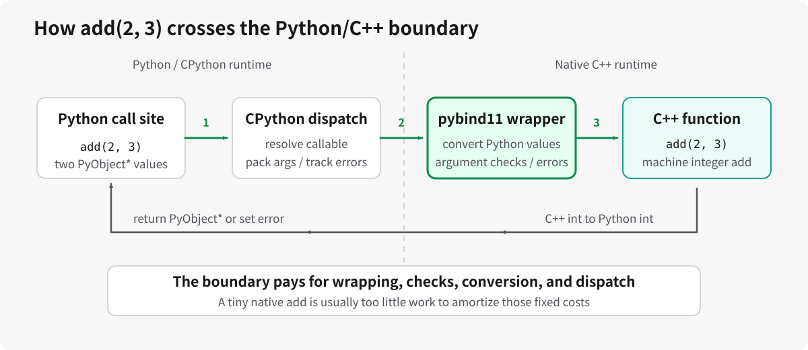
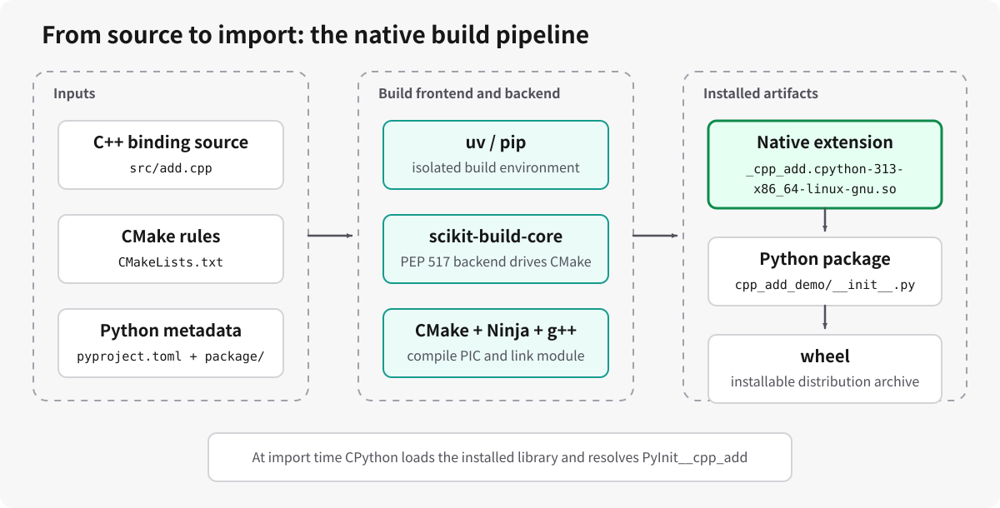
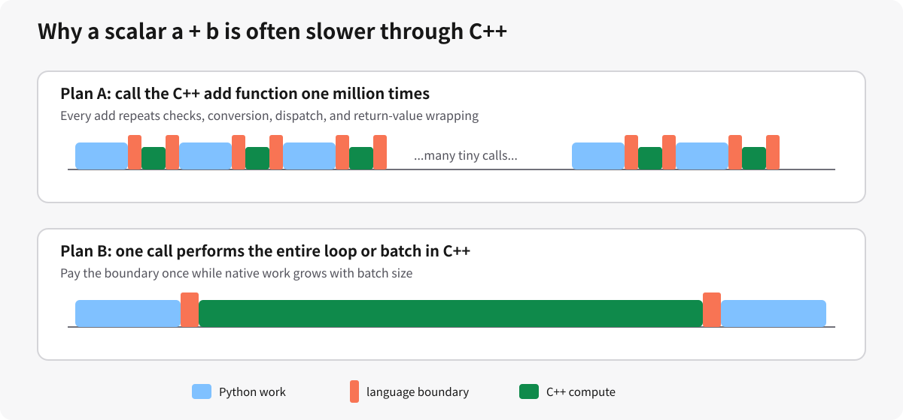

# 从 C++ 的 `a + b` 到 Python 原生扩展：Linux 原理详解

## 0. 本章目标

本文只讨论 Linux 上的 CPython 原生扩展。构建示例用于观察原理，不展开其它系统或跨平台发布。

我们希望在 Python 中写：

```python
from cpp_add_demo import add

result = add(2, 3)
print(f"result={result}")
```

但真正执行加法的是 C++：

```cpp
std::int64_t add(std::int64_t a, std::int64_t b) {
    return a + b;
}
```

看似只是把一个函数“接到 Python 上”，背后却同时涉及：

1. Python 对象模型与动态类型；
2. C++ 编译、符号、目标文件和共享库；
3. CPython 扩展模块协议；
4. Python/C++ 调用约定与参数传递；
5. ABI 与 Linux 动态链接；
6. GIL、异常、对象生命周期与线程安全；
7. 构建后端与包安装；
8. 跨语言边界的性能成本。

本章最终要回答：

- Python 为什么不能直接 `import add.cpp`？
- `.so` 为什么能被 Python 当成模块导入？
- `PYBIND11_MODULE` 到底生成了什么？
- Python 对象如何变成 C++ 函数参数？
- C++ 异常如何变成 Python 异常？
- 为什么一个 C++ 标量加法通常比 Python 的 `a + b` 更慢？
- 什么情况下值得把代码移到 C++？
- 这套机制与 PyTorch C++/CUDA Extension 有什么关系？

配套可运行项目位于：

- [演示项目 README](./demos/cpp_python_add/README.md)
- [C++ 绑定源码](./demos/cpp_python_add/src/add.cpp)
- [CMake 配置](./demos/cpp_python_add/CMakeLists.txt)
- [Python 构建配置](./demos/cpp_python_add/pyproject.toml)
- [Python 包装入口](./demos/cpp_python_add/cpp_add_demo/__init__.py)
- [类型存根](./demos/cpp_python_add/cpp_add_demo/__init__.pyi)
- [测试](./demos/cpp_python_add/tests/test_add.py)
- [边界开销 benchmark](./demos/cpp_python_add/benchmark.py)

---

## 1. 先建立正确的心智模型

### 1.1 “给 Python 使用”不是调用源码文件

Python 不会解释 C++ 语法，也不会在每次 `import` 时自动运行 `g++`。完整流程是：

```text
C++ 源码
  -> C++ 编译器
  -> 位置无关机器码
  -> 共享库
  -> 安装到 Python 包目录
  -> CPython 动态加载
  -> 查找模块初始化符号
  -> 创建 Python module 对象
  -> 注册可调用函数
```

Python 最终加载的是已经编译好的机器码文件，而不是 `.cpp`。



### 1.2 三层接口

最好把系统拆成三层：

| 层 | 示例 | 责任 |
|---|---|---|
| Python API | `cpp_add_demo.add(2, 3)` | 稳定的用户入口、类型提示、文档 |
| 绑定层 | `PYBIND11_MODULE`、`module.def` | 参数检查、调用适配、异常映射 |
| C++ 实现 | `add` | 真正的原生计算 |

演示项目没有让用户直接导入 `_cpp_add`，而是：

```python
from ._cpp_add import add
```

这种设计有两个好处：

1. 原生模块名可以保持私有；
2. 以后可以在 Python 层增加检查、fallback、类型适配或兼容逻辑，而不改变用户 import 路径。

---

## 2. Python 与 C++ 的运行模型为何不同

### 2.1 Python 值是对象

在 CPython 中，Python 层的：

```python
a = 2
b = 3
```

不是两个裸机器整数。变量 `a` 和 `b` 保存的是指向 Python 对象的引用。对象至少包含：

- 类型信息；
- 引用计数；
- 整数实际数据；
- 解释器需要的对象头。

Python `int` 是由解释器管理的对象，不等同于一个裸 C++ 整数。

### 2.2 C++ 参数通常是固定布局的值

C++：

```cpp
std::int64_t add(std::int64_t a, std::int64_t b);
```

要求两个参数都能表示为固定 64 位有符号整数。函数入口期待的是两个机器值，不认识 `PyObject*`，也不知道 Python 的类型检查、引用计数和异常状态。

### 2.3 绑定层是协议翻译器

绑定层必须完成：

```text
PyObject* 参数
  -> 检查 Python 类型
  -> 读取数值
  -> 检查目标 C++ 类型范围
  -> 构造 C++ 参数
  -> 调用 C++ 函数
  -> 把 C++ 结果包装成新 Python 对象
```

这也是为什么一个只有一条加法指令的 C++ 函数不一定更快：真正的计算很短，协议翻译反而占主要成本。

---

## 3. C++ 编译、链接与共享库背景

### 3.1 编译不是一个步骤

概念上可分为：

1. 预处理：展开 `#include` 和宏；
2. 编译：把 C++ 翻译为汇编或中间表示；
3. 汇编：生成目标文件；
4. 链接：解析符号并生成共享库。

Linux 扩展通常是：

```text
_cpp_add.cpython-313-x86_64-linux-gnu.so
```

### 3.2 为什么需要位置无关代码

共享库会被加载到进程地址空间中运行时选择的位置。编译器通常需要生成 position-independent code：

```text
-fPIC
```

`pybind11_add_module` 会通过 CMake 处理 Linux Python 扩展所需的编译和链接细节。

### 3.3 符号与 C++ name mangling

C++ 支持命名空间、类和模板，编译器需要把这些类型信息编码进符号名。例如：

```cpp
namespace demo {
std::int64_t add(std::int64_t a, std::int64_t b);
}
```

机器码中的符号通常不只叫 `add`，还会编码命名空间和参数类型。

CPython 不理解 C++ name mangling。它要求扩展导出一个具有约定名称和 C linkage 的入口：

```text
PyInit__cpp_add
```

`PYBIND11_MODULE(_cpp_add, module)` 会生成这个入口，并处理 C linkage 与符号可见性。

### 3.4 API 与 ABI

API 是源码层约定：

```cpp
module.def("add", ...);
```

ABI 是二进制层约定，包括：

- 参数如何放入寄存器或栈；
- 符号如何命名；
- 结构体如何布局；
- 异常如何传播；
- 使用哪个 C++ 标准库 ABI；
- Python 对象结构是否兼容。

源码能编译不代表已有二进制能在另一环境加载。

---

## 4. CPython 原生扩展协议

### 4.1 `import` 时发生什么

执行：

```python
import cpp_add_demo._cpp_add
```

CPython 大致执行：

1. 按 `sys.meta_path` 和 package 路径寻找模块；
2. 找到与当前解释器兼容的扩展后缀；
3. 让操作系统动态加载器打开共享库；
4. 查找 `PyInit__cpp_add`；
5. 调用初始化函数；
6. 得到 Python module 对象；
7. 将 module 放入 `sys.modules`。

初始化只在模块首次成功导入时执行一次；之后通常直接复用 `sys.modules` 中的对象。

### 4.2 ABI 后缀

本机实际构建产物是：

```text
_cpp_add.cpython-313-x86_64-linux-gnu.so
```

字段含义：

| 字段 | 含义 |
|---|---|
| `_cpp_add` | 模块名 |
| `cpython-313` | 面向 CPython 3.13 |
| `x86_64-linux-gnu` | Linux 目标架构与 ABI |
| `.so` | 共享库 |

可以查看当前解释器期待的后缀：

```bash
python -c '
import sysconfig
print(f"extension_suffix={sysconfig.get_config_var(\"EXT_SUFFIX\")}")
'
```

### 4.3 不使用 pybind11 时要写什么

最小 CPython C API 版本大致如下：

```cpp
#define PY_SSIZE_T_CLEAN
#include <Python.h>

static PyObject* add(PyObject* self, PyObject* args) {
    long long a;
    long long b;
    if (!PyArg_ParseTuple(args, "LL", &a, &b)) {
        return nullptr;
    }
    return PyLong_FromLongLong(a + b);
}

static PyMethodDef methods[] = {
    {"add", add, METH_VARARGS, "Add two integers."},
    {nullptr, nullptr, 0, nullptr},
};

static PyModuleDef module = {
    PyModuleDef_HEAD_INIT,
    "c_add",
    nullptr,
    -1,
    methods,
};

PyMODINIT_FUNC PyInit_c_add(void) {
    return PyModule_Create(&module);
}
```

这段代码暴露了底层事实：

- Python 调用约定传入 `PyObject*`；
- 参数解析失败必须返回 `nullptr`；
- Python 异常通过解释器线程状态保存；
- 返回值必须是新的 Python 对象；
- 方法表把字符串名称映射到 C 函数；
- 模块必须导出特定初始化符号。

它还没有处理整数加法溢出，因此不能直接视为生产级实现。

---

## 5. pybind11 帮我们做了什么

### 5.1 pybind11 是头文件库

pybind11 主要通过 C++ 模板和头文件生成包装代码。它不会让 Python 直接理解 C++；它只是自动生成符合 CPython 扩展协议的桥接层。

演示项目：

```cpp
PYBIND11_MODULE(_cpp_add, module) {
    module.def(
        "add",
        &add,
        py::arg("a"),
        py::arg("b"),
        "Add two C++ int64 values with overflow checking.");
}
```

生成的逻辑包含：

1. 导出 `PyInit__cpp_add`；
2. 创建 module；
3. 注册名称 `add`；
4. 检查参数数量和关键字；
5. 尝试把 Python 参数转换为 `int64_t`；
6. 调用 C++ `add`；
7. 把结果转换为 Python `int`；
8. 将 C++ 异常映射为 Python 异常。

### 5.2 它没有消除边界

pybind11 降低了开发成本，不会消除：

- 类型检查；
- Python/C++ 对象转换；
- 函数分派；
- Python 对象分配；
- GIL 约束；
- 动态调用开销。

“代码是 C++ 写的”和“代码会更快”是两个不同命题。

---

## 6. 演示项目结构

```text
cpp_python_add/
├── CMakeLists.txt
├── README.md
├── benchmark.py
├── cpp_add_demo/
│   ├── __init__.py
│   ├── __init__.pyi
│   └── py.typed
├── pyproject.toml
├── src/
│   └── add.cpp
├── tests/
│   └── test_add.py
└── uv.lock
```

职责划分：

| 文件 | 责任 |
|---|---|
| `src/add.cpp` | C++ 实现与 pybind11 注册 |
| `CMakeLists.txt` | 原生模块编译和安装位置 |
| `pyproject.toml` | PEP 517 构建后端与 Python 元数据 |
| `cpp_add_demo/__init__.py` | 稳定 Python API |
| `cpp_add_demo/__init__.pyi` | 静态类型提示 |
| `tests/test_add.py` | 正确性、错误与转换边界 |
| `benchmark.py` | 测量跨语言标量调用成本 |

该 demo 有独立的 `pyproject.toml` 和 `.venv`，不会修改 Assignment 2 顶层依赖。

---

## 7. C++ 实现逐段解释

### 7.1 加法实现

```cpp
std::int64_t add(std::int64_t a, std::int64_t b) {
    constexpr auto min_value = std::numeric_limits<std::int64_t>::min();
    constexpr auto max_value = std::numeric_limits<std::int64_t>::max();
    if ((b > 0 && a > max_value - b) || (b < 0 && a < min_value - b)) {
        throw std::overflow_error("int64 addition overflow");
    }
    return a + b;
}
```

为什么不能直接返回 `a + b`？

C++ 有符号整数溢出属于未定义行为。编译器可假设它永远不会发生，并据此做优化。生产代码不应依赖溢出后的环绕结果。

检查必须发生在加法之前：

```text
b > 0  时，检查 a <= max - b
b < 0  时，检查 a >= min - b
```

检查通过后，`a + b` 才有定义。

### 7.2 注册 Python 函数

```cpp
module.def(
    "add",
    &add,
    py::arg("a"),
    py::arg("b"),
    "Add two C++ int64 values with overflow checking.");
```

这里把 Python 名称 `add` 映射到 C++ 函数指针 `&add`。`py::arg` 使关键字调用也有效：

```python
add(2, 3)
add(a=2, b=3)
```

本例只有一个整数签名，重点是完整走通原生函数的定义、注册、构建和导入。

---

## 8. 构建系统如何协作



### 8.1 `pyproject.toml`

```toml
[build-system]
requires = [
    "pybind11>=3.0,<4",
    "scikit-build-core>=0.11,<2",
]
build-backend = "scikit_build_core.build"
```

含义：

- `uv` 或 `pip` 是构建前端；
- 构建前端创建隔离环境；
- 安装 `[build-system].requires`；
- 调用 `scikit-build-core` 的 PEP 517 接口；
- `scikit-build-core` 按需提供并运行 CMake/Ninja；
- CMake 生成 Ninja 构建；
- Ninja 调用 C++ 编译器。

因此无需把 `cmake` 和 `ninja` 手工写入 `build-system.requires`；`scikit-build-core` 会在主机工具不满足要求时向隔离构建环境注入对应 wheel。主机仍需要可用 C++ 编译器和基础系统链接能力。

### 8.2 `CMakeLists.txt`

```cmake
find_package(Python COMPONENTS Interpreter Development.Module REQUIRED)
find_package(pybind11 CONFIG REQUIRED)

pybind11_add_module(_cpp_add MODULE src/add.cpp)
target_compile_features(_cpp_add PRIVATE cxx_std_17)
```

`Development.Module` 表示需要构建 Python 扩展模块所需的信息，而不是构建嵌入 Python 解释器的独立程序。

### 8.3 安装位置

```cmake
install(
    TARGETS _cpp_add
    LIBRARY DESTINATION cpp_add_demo
    RUNTIME DESTINATION cpp_add_demo
)
```

必须把原生模块安装到 Python package 内部：

```text
site-packages/
└── cpp_add_demo/
    ├── __init__.py
    └── _cpp_add.cpython-313-x86_64-linux-gnu.so
```

只有编译成功但忘记 `install(TARGETS ...)` 时，wheel 可能不包含共享库，最终表现为安装成功但 import 失败。

---

## 9. 构建与运行

从 Assignment 2 根目录执行：

```bash
UV_DEFAULT_INDEX=https://mirrors.aliyun.com/pypi/simple/ \
  uv sync \
  --project notes/demos/cpp_python_add \
  --group test
```

调用：

```bash
uv run --project notes/demos/cpp_python_add \
  python -c '
from cpp_add_demo import add
result = add(2, 3)
print(f"result={result}")
'
```

预期：

```text
result=5
```

测试：

```bash
uv run --project notes/demos/cpp_python_add \
  pytest -q notes/demos/cpp_python_add/tests
```

查看扩展路径：

```bash
uv run --project notes/demos/cpp_python_add \
  python -c '
import cpp_add_demo._cpp_add as module
print(f"extension_path={module.__file__}")
'
```

---

## 10. 参数转换与范围检查

### 10.1 Python `int` 与 C++ `int64_t`

Python `int` 任意精度，C++ `int64_t` 范围固定：

$$ -2^{63} \le x \le 2^{63}-1 $$

绑定层只需完成本接口真正需要的检查：

1. 参数必须是可转换为 C++ `int64_t` 的 Python 整数；
2. 超出 `int64_t` 输入范围时拒绝调用；
3. 两个合法 `int64_t` 相加仍可能溢出，因此 C++ 实现再次检查结果范围。

例如：

```python
add(2**100, 1)
```

会因输入超出 `int64_t` 范围而抛出 `TypeError`。

### 10.2 容器转换

若使用：

```cpp
#include <pybind11/stl.h>
```

则 Python `list` 可转换为 `std::vector`。这种转换通常会逐元素复制：

```text
Python list
  -> 分配 std::vector
  -> N 次元素转换
  -> C++ 计算
  -> 再复制回 Python list
```

对大数组，应该优先使用 buffer protocol、NumPy view 或 PyTorch Tensor，而不是把每个元素复制进 `std::vector`。

---

## 11. 异常如何跨边界

### 11.1 Python 的错误约定

CPython C API 通常用：

```text
返回 nullptr + 设置当前线程异常状态
```

表示函数失败。

### 11.2 pybind11 的异常映射

演示中的：

```cpp
throw std::overflow_error("int64 addition overflow");
```

会变成 Python：

```python
OverflowError: int64 addition overflow
```

常见映射包括：

| C++ 异常 | Python 异常 |
|---|---|
| `std::invalid_argument` | `ValueError` |
| `std::out_of_range` | `IndexError` |
| `std::overflow_error` | `OverflowError` |
| 其它 `std::exception` | `RuntimeError` |

自定义异常可通过 `py::register_exception` 注册。

### 11.3 不要让未知异常穿过 C ABI

未捕获 C++ 异常不能安全穿越 C ABI 边界。绑定层必须捕获并翻译。pybind11 生成的包装器负责这一点，但以下问题仍由实现者负责：

- 异常是否携带足够上下文；
- 是否错误地用异常处理可预期分支；
- 析构函数是否抛异常；
- 原生线程中的异常如何传回 Python。

---

## 12. 对象所有权与生命周期

本例只有整数返回值，生命周期简单：输入转换为值，输出创建新 Python 对象。

绑定类、指针和 view 时，必须回答：

1. 谁拥有 C++ 对象？
2. Python 对象销毁时是否删除 C++ 对象？
3. 返回引用指向的 owner 是否仍存活？
4. C++ 是否保存了借用的 Python buffer？
5. 多线程销毁发生在哪个线程？

pybind11 提供：

- `return_value_policy`；
- `py::keep_alive`；
- `std::unique_ptr` holder；
- `std::shared_ptr` holder；
- `py::smart_holder`。

错误的 ownership policy 可能导致：

- use-after-free；
- double free；
- 内存泄漏；
- 隐蔽的数据悬挂；
- Python 对象和 C++ 对象互相引用形成环。

---

## 13. GIL 与并发

### 13.1 默认情况下 GIL 仍被持有

从 Python 进入 pybind11 函数时，调用线程默认持有 GIL。C++ 代码不会因为换了语言就自动与其它 Python 线程并行。

对于本例的单条加法，释放 GIL 反而比计算更贵。

### 13.2 长时间原生计算

若 C++ 函数：

- 运行时间足够长；
- 不访问 Python 对象；
- 不调用需要 GIL 的 Python C API；
- 自身线程安全；

可使用：

```cpp
module.def(
    "long_running_function",
    &long_running_function,
    py::call_guard<py::gil_scoped_release>());
```

需要访问 Python 对象时必须重新获取：

```cpp
py::gil_scoped_acquire acquire;
```

### 13.3 原生线程

C++ 可以创建线程，但要区分：

- 只处理原生内存的线程；
- 需要创建或访问 Python 对象的线程。

后者必须正确附着解释器线程状态并持有 GIL。

---

## 14. 性能：为什么这个 C++ 加法更慢



一次调用可粗略写成：

$$ T_{\text{call}} = T_{\text{dispatch}} + T_{\text{convert-in}} + T_{\text{C++}} + T_{\text{convert-out}} $$

本例中 $T_{\text{C++}}$ 极小，其余项成为主要成本。

一百万次标量调用：

$$ T_{\text{scalar}} = N(T_{\text{boundary}} + T_{\text{tiny-work}}) $$

一次批量调用：

$$ T_{\text{batch}} = T_{\text{boundary}} + N T_{\text{work}} $$

只有第二种方式能有效摊销固定边界成本。

### 14.1 本机实验

命令：

```bash
uv run --project notes/demos/cpp_python_add \
  python notes/demos/cpp_python_add/benchmark.py \
  --iterations 1000000
```

一次实测：

```text
iterations=1000000
python_seconds=0.056170
cpp_seconds=0.100470
cpp_over_python_ratio=1.789
python_checksum=3000000
cpp_checksum=3000000
```

在这次环境中，C++ 扩展标量调用约为纯 Python 加法耗时的 `1.789` 倍。

该结果不是跨机器常数；它只说明：

- 标量边界调用可能比 Python 内建运算慢；
- benchmark 必须测完整调用路径；
- “C++ 代码”不能代替性能证据。

### 14.2 何时 C++ 值得

更适合原生扩展的工作：

- 一个调用内包含长循环；
- 大规模矩阵或张量 kernel；
- 复杂解析器；
- 压缩、编解码、哈希；
- SIMD；
- 调用已有 C/C++ 库；
- 需要直接操作设备或系统 API；
- 需要释放 GIL 并执行独立原生任务。

不适合：

- 一两个标量算术运算；
- 大量极细粒度 getter/setter；
- 每个元素都单独跨边界；
- 主要时间仍消耗在 Python 回调中。

---

## 15. 复杂度与可并行性

### 15.1 当前 `add`

时间复杂度：

$$ O(1) $$

额外空间复杂度：

$$ O(1) $$

但复杂度记号隐藏了跨语言边界的固定常数。

### 15.2 $N$ 次 Python 循环调用

时间复杂度：

$$ O(N) $$

其中每次都支付边界成本。即使渐近复杂度与批量 C++ 循环相同，常数也可能显著不同。

### 15.3 并行性

当前函数：

- 没有内部并行价值；
- 默认持有 GIL；
- 多线程 Python 调用不能靠它获得 CPU 并行加速。

批量函数可进一步：

- 在 C++ 内部使用线程池；
- 使用 OpenMP；
- 使用 SIMD；
- 把数据提交到 CUDA；
- 释放 GIL 后执行。

并行化前应先扩大单次调用粒度，否则调度和同步成本会淹没计算。

---

## 16. Linux `.so` 与 ABI 边界

### 16.1 文件名记录兼容范围

本例生成：

```text
_cpp_add.cpython-313-x86_64-linux-gnu.so
```

它表明该共享库面向：

- CPython 3.13；
- Linux；
- x86-64；
- 当前 GNU 工具链 ABI。

构建系统会先把 `.so` 放进 wheel，再由安装器解包到 Python 环境。这里仅把 wheel 视为安装容器，不讨论发布流程。

### 16.2 为什么不能随便复制 `.so`

即使两台机器都运行 Linux，直接复制 `.so` 也可能失败，原因包括：

- Python minor 版本不同；
- CPU 架构不同；
- glibc 版本不兼容；
- 缺少依赖共享库；
- C++ 标准库 ABI 不一致；
- 编译时启用了目标 CPU 不支持的指令；
- Debug/Release 运行时不匹配。

### 16.3 Linux 动态加载器还要解析依赖

加载 `_cpp_add.so` 时，Linux 动态加载器还要找到它依赖的：

- `libstdc++.so`；
- `libgcc_s.so`；
- `libc.so`；
- 其它显式链接的原生库。

因此，CPython 找到了扩展文件仍不代表导入一定成功。ELF 依赖缺失或 ABI 不兼容都会在模块初始化前导致 `ImportError`。

---

## 17. 静态类型与运行时类型

原生扩展函数通常没有普通 Python 函数那样完整的注解信息，因此 demo 提供：

```python
def add(a: int, b: int) -> int: ...
```

`py.typed` 告诉类型检查器该包提供类型信息。

但 `.pyi` 只能近似运行时行为：

- Python `int` 没有写出 int64 范围；
- 静态类型系统通常不跟踪数值范围；
- 运行时仍以 pybind11 的参数检查为准。

类型存根不能替代运行时检查和测试。

---

## 18. 调试原生扩展

### 18.1 `ModuleNotFoundError`

检查：

```bash
python -c '
import sys
print(f"sys_path={sys.path}")
'
```

确认 package 被安装，扩展位于 package 目录。

### 18.2 `ImportError: dynamic module does not define module export function`

常见原因：

- `PYBIND11_MODULE` 名称与文件模块名不一致；
- 构建了 `_cpp_add`，初始化符号却是 `PyInit_other_name`；
- 共享库不是 Python 扩展。

检查：

```bash
nm -D path/to/_cpp_add*.so | grep PyInit
```

预期：

```text
PyInit__cpp_add
```

### 18.3 缺少依赖共享库

```bash
ldd path/to/_cpp_add*.so
```

若出现 `not found`，检查：

- RPATH/RUNPATH；
- 安装位置；
- `LD_LIBRARY_PATH`；
- wheel 是否打包依赖。

### 18.4 未定义符号

```text
ImportError: undefined symbol: ...
```

可能原因：

- 忘记链接实现库；
- 链接顺序错误；
- C++ ABI 不匹配；
- PyTorch 与扩展使用不同 `_GLIBCXX_USE_CXX11_ABI`；
- 符号可见性被隐藏。

### 18.5 崩溃

Python 异常无法捕获 segmentation fault。使用：

```bash
gdb --args python -c 'import cpp_add_demo; cpp_add_demo.add(2, 3)'
```

调试构建可增加：

```text
-O0 -g
```

内存错误可使用：

- AddressSanitizer；
- UndefinedBehaviorSanitizer；
- Valgrind；
- Python `faulthandler`。

### 18.6 构建缓存

修改 C++ 后若行为未变化：

```bash
rm -rf notes/demos/cpp_python_add/build
uv sync --project notes/demos/cpp_python_add --reinstall-package cpp-add-demo
```

先确认实际 import 的 `.so` 路径，不要只盯着源码目录。

---

## 19. 测试应该覆盖什么

本例测试包括：

1. 正常整数输入；
2. 负整数输入；
3. 关键字参数；
4. 不兼容类型；
5. `int64` 加法溢出；
6. 超出 `int64` 范围的 Python 整数。

生产扩展还应覆盖：

- 空输入；
- 边界长度；
- 非连续数组；
- dtype；
- 对齐；
- 只读 buffer；
- 生命周期；
- 多线程；
- 异常路径；
- 重复 import；
- 多 Python 版本；
- Debug/Release；
- 支持的操作系统和 CPU 架构。

原生扩展的错误可能破坏整个解释器，因此测试要求通常应高于普通 Python 辅助函数。

---

## 20. 常见绑定方案比较

| 方案 | 适合场景 | 优点 | 主要代价 |
|---|---|---|---|
| CPython C API | 最底层控制、实现运行时组件 | 无额外绑定依赖 | 样板多、引用计数和错误处理复杂 |
| `ctypes` | 调用已有 C ABI 动态库 | Python 标准库自带 | C++ 需额外 C wrapper，类型安全较弱 |
| CFFI | C 接口、ABI/API 模式 | 声明式、比 ctypes 友好 | 主要面向 C ABI |
| Cython | Python-like 代码渐进优化 | 与 Python/NumPy 结合紧密 | 新语言层和生成代码 |
| pybind11 | 现代 C++ 类、函数、模板 | 表达自然、生态成熟 | 编译时间和二进制体积较大 |
| nanobind | 新项目、重视体积/编译性能 | 现代设计、较轻量 | 生态和兼容经验相对较少 |
| SWIG | 大型多语言接口生成 | 支持多语言 | 生成层较重，调试体验复杂 |
| PyTorch C++ Extension | Tensor 算子、ATen/CUDA | 与 PyTorch dispatcher 集成 | 依赖 PyTorch ABI 和构建体系 |

选择标准：

- 已有库是 C 还是 C++；
- 是否暴露类和模板；
- 是否需要 NumPy/PyTorch 零拷贝；
- 是否需要链接其它 Linux 原生库；
- 团队是否能调试 C++；
- 绑定层是否会成为长期公共 API。

---

## 21. 与 PyTorch C++/CUDA Extension 的关系

PyTorch 扩展没有绕开本章机制，而是在其上增加：

- ATen Tensor 类型；
- dispatcher；
- device/dtype/layout 约定；
- CUDA 编译；
- stream 与 device guard；
- autograd 注册；
- PyTorch 自身 ABI。

最小关系可写为：

```text
Python import
  -> CPython extension module
  -> pybind11 或 torch operator registration
  -> ATen C++ function
  -> CPU kernel 或 CUDA kernel
```

对于 Tensor 运算，接口设计还必须考虑：

- tensor 是否 contiguous；
- dtype；
- device；
- stride；
- stream；
- 异步 CUDA 错误；
- backward；
- fake/meta kernel；
- `torch.compile` 可见性。

如果只是用 pybind11 收到 `torch::Tensor` 并直接启动 CUDA kernel，仍需遵循当前 PyTorch stream，而不是默认 stream。

---

## 22. 从 `a + b` 扩展到真实高性能接口

一个合理演进路径：

### 22.1 阶段一：标量函数

目标：

- 跑通构建；
- 理解 import；
- 理解类型转换；
- 学会检查二进制。

### 22.2 阶段二：批量数组

接口从：

```python
add(a, b)
```

变成：

```python
add_arrays(a, b)
```

一次调用处理大量元素，开始摊销边界成本。

### 22.3 阶段三：零拷贝 view

使用 buffer protocol 或 NumPy：

```text
Python array storage
  -> C++ view
  -> 原地或输出 buffer
```

要检查：

- dtype；
- ndim；
- shape；
- stride；
- 对齐；
- owner 生命周期。

### 22.4 阶段四：并行 CPU kernel

释放 GIL，在 C++ 内并行。

### 22.5 阶段五：PyTorch/CUDA operator

增加：

- Tensor metadata 验证；
- device kernel；
- dispatcher；
- autograd；
- benchmark 与 profiler。

---

## 23. 设计原则总结

1. 先定义 Python API，再写绑定代码。
2. 把业务实现与绑定层分开。
3. 明确每个参数的类型范围、ownership 和错误语义。
4. 不依赖 C++ 有符号整数溢出。
5. 不把大量标量调用误认为高性能接口。
6. 优先扩大单次调用粒度。
7. 只有不访问 Python 对象且线程安全时才释放 GIL。
8. 把构建和安装视为产品接口的一部分。
9. 在目标 Python、Linux 发行版、CPU 与依赖版本上构建和测试。
10. 原生崩溃会终止解释器，必须认真测试异常和内存边界。
11. 先测完整端到端路径，再声称 C++ 更快。
12. 对 PyTorch/CUDA 扩展继续遵循 device、stream 和 autograd 语义。

---

## 24. 建议练习

1. 删除整数溢出检查，用 UBSan 观察边界输入。
2. 新增一个 `subtract(a, b)`，练习注册多个函数。
3. 新增 `add_many(list_a, list_b)`，测量逐元素复制成本。
4. 使用 `py::array_t<std::int64_t>` 实现 NumPy 数组加法。
5. 比较复制版与零拷贝输入检查版。
6. 新增长时间 C++ 循环并释放 GIL。
7. 用两个 Python 线程验证是否真正并行。
8. 故意修改 `PYBIND11_MODULE` 名称，观察 import 错误并用 `nm` 定位。
9. 用 `file`、`ldd` 和 `nm -D` 检查生成的 ELF 扩展。
10. 将相同算子改写为 PyTorch C++ Extension，并增加 CPU Tensor 测试。

---

## 25. 参考资料

- [Python: Extending and Embedding the Python Interpreter](https://docs.python.org/3/extending/index.html)
- [Python: Defining Extension Modules](https://docs.python.org/3/c-api/extension-modules.html)
- [Python: Importing Modules](https://docs.python.org/3/reference/import.html)
- [PEP 3149: ABI Version Tagged .so Files](https://peps.python.org/pep-3149/)
- [pybind11 Documentation](https://pybind11.readthedocs.io/en/latest/)
- [pybind11 Build Systems](https://pybind11.readthedocs.io/en/latest/compiling.html)
- [scikit-build-core Getting Started](https://scikit-build-core.readthedocs.io/en/stable/guide/getting_started.html)
- [PyTorch C++ Extension](https://docs.pytorch.org/docs/stable/cpp_extension.html)
